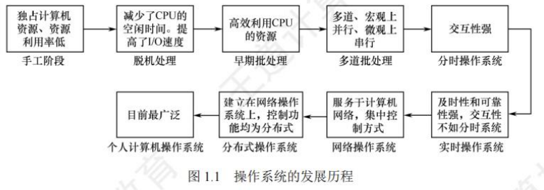
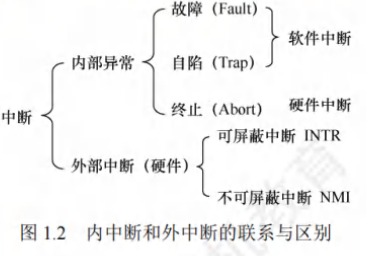
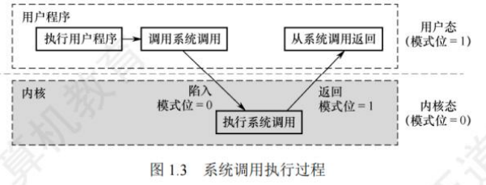
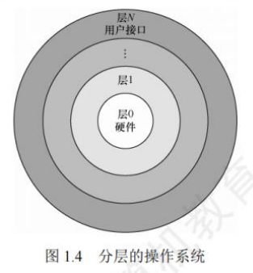
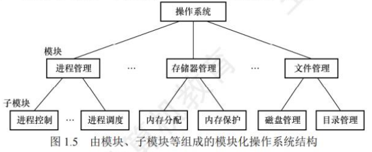
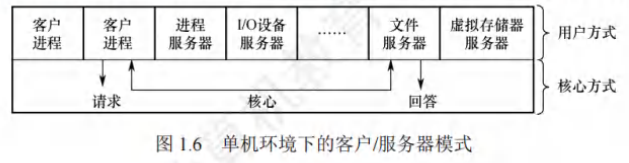
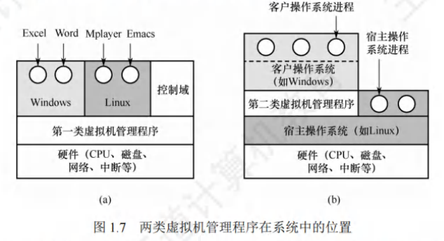

# 操作系统概述

[TOC]

## 概念

操作系统是**控制**和**管理**整个计算机系统的**硬件**和**软件资源**，合理地**组织**、**调度**计算机的**工作**和**资源**的分配，进而为用户和其他软件**提供**方便**接口**和**环境**的程序集合。

操作系统是计算机系统中最基本的系统软件。

### 特征

- **并发**：两个或多个事件在同一时间间隔内发生。

> 并行性是指系统具有同时进行运算或操作的特性。同一时刻能完成两种或两种以上的工作。

- **共享**：系统中的资源可供内存中多个并发执行的进程共同使用。

资源共享可分为互斥共享和同时访问。

互斥共享：一段时间内只允许一个进程访问该资源，该资源称为临界资源。

同时访问：一段时间内由多个进程同时访问(分时)。例如：磁盘。

并发和共享是最基本的特征，两者之间互为存在的条件。

- 虚拟：将一个物理上的实体变为若干逻辑上的对应物。

虚拟技术可归纳为：时分复用技术，空分复用技术。

- 异步：由于资源有限，进程的执行不是一贯到底的，而是走走停停的，以不可预知的速度向前推进。

运行环境相同，操作系统就须保证多次运行进程后都能获得相同的结果。

### 功能

为了给多道程序提供良好的运行环境，操作系统应具有以下几方面的功能：处理机管理、存储器管理、设备管理和文件管理。为了方便用户使用操作系统，还必须向用户提供接口。同时，操作系统可用来扩充机器，以提供更方便的服务、更高的资源利用率。

- **作为计算机系统资源的管理者**
  - 处理机管理(进程管理)：进程控制、进程同步、进程通信、死锁处理、处理机调度等。
  - 存储器管理：内存分配与回收、地址映射、内存保护与共享和内存扩充等。
  - 文件管理：文件存储空间的管理、目录管理及文件读写管理和保护等。
  - 设备管理：缓冲管理、设备分配、设备处理和虚拟设备等。

- **作为用户和计算机硬件之间的接口**
  - 命令接口：用户利用这些操作命令来组织和控制作业的执行。
    - 联机命令接口(交互式命令接口)：适用于分时或实时系统的接口。

    - 脱机命令接口(批处理命令接口)：适用于批处理系统。

  - 程序接口：编程人员可以使用它们来请求操作系统服务。由一组系统调用组成。

- **实现了对计算机资源的扩充**

## 发展历程

### 手工操作阶段(无OS)

用户在计算机上算题的所有工作都要人工干预，如程序的装入、运行、结果的输出等。

- 手工操作阶段有两个缺点：

1. 用户独占全机，虽然不会出现因资源已被其他用户占用而等待的现象，但资源利用率低。

2. CPU等待手工操作， CPU的利用不充分。

唯一的解决办法：用高速的机器代替相对较慢的手工操作来对作业进行控制。

### 批处理阶段(OS开始出现)

按发展历程又分为单道批处理系统、多道批处理系统。

#### 单道批处理

为实现对作业的连续处理，需要先将一批作业以脱机方式输入磁带，并在系统中配上监督程序(Monitor)，在其控制下，使这批作业能一个接一个地连续处理。虽然系统对作业的处理是成批进行的，但内存中始终保持一道作业。

- 主要特征：

1. 自动性。在顺利的情况下，磁带上的一批作业能自动地逐个运行，而无须人工干预。
2. 顺序性。磁带上的各道作业顺序地进入内存，先调入内存的作业先完成。
3. 单道性。内存中仅有一道程序运行，即监督程序每次从磁带上只调入一道程序进入内存运行，当该程序完成或发生异常情况时，才换入其后继程序进入内存运行。

- 问题：

每次主机内存中仅存放一道作业，每当它在运行期间(注意这里是“运行时”而不是“完成后”)发出输入/输出请求后，高速的 CPU 便处于等待低速的I/O完成的状态。为了进一步提高资源的利用率和系统的吞吐量，引入了多道程序技术。

#### 多道批处理

用户所提交的作业都先存放在外存上并排成一个队列，作业调度程序按一定的算法从后备队列中选择若干作业调入内存，它们在管理程序的控制下相互穿插地运行，共享系统中的各种硬/软件资源。

当某道程序因请求I/O操作而暂停运行时，CPU便立即转去运行另一道程序，这是通过中断机制实现的。它让系统的各个组成部分都尽量的“忙”，切换任务所花费的时间很少，因而可实现系统各部件之间的并行工作，使其在单位时间内的效率翻倍。

- 多道批处理系统的主要特征：

1. 多道。计算机内存中同时存放多道相互独立的程序。
2. 宏观上并行。同时进入系统的多道程序都处于运行过程中，但都未运行完毕。
3. 微观上串行。内存中的多道程序轮流占有 CPU，交替执行。

- 多道程序设计技术的实现需要解决下列问题：

1. 如何分配处理器。
2. 多道程序的内存分配问题。
3. I/O 设备如何分配。
4. 如何组织和存放大量的程序和数据，以方便用户使用并保证其安全性与一致性。

- 优点：

1. 资源利用率高，多道程序共享计算机资源，从而使各种资源得到充分利用；
2. 系统吞吐量大，CPU 和其他资源保持“忙碌”状态。

- 缺点：

1. 用户响应的时间较长；
2. 不提供人机交互能力，用户既不能了解自己的程序的运行情况，又不能控制计算机。

### 分时操作系统

分时技术：指将处理器的运行时间分成很短的时间片，按时间片轮流将处理器分配给各联机作业使用。若某个作业在分配给它的时间片内不能完成其计算，则该作业暂时停止运行，将处理器让给其他作业使用，等待下一轮再继续运行。由于计算机速度很快，作业运行轮转得也很快，因此给每个用户的感觉就像是自己独占一台计算机。

分时操作系统：指多个用户通过终端同时共享一台主机，这些终端连接在主机上，用户可以同时与主机进行交互操作而互不干扰。

实现分时系统的关键问题：如何使用户能与自己的作业进行交互，即当用户在自己的终端上键入命令时，系统应能及时接收并及时处理该命令，再将结果返回用户。

分时系统与多道批处理系统的区别：多道批处理是实现作业自动控制而无须人工干预的系统，而分时系统是实现人机交互的系统

- 分时系统的主要特征如下：

1. 同时性。同时性也称多路性，指允许多个终端用户同时使用一台计算机。
2. 交互性。用户通过终端采用人机对话的方式直接控制程序运行，与同程序进行交互。
3. 独立性。系统中多个用户可以彼此独立地进行操作，互不干扰，单个用户感觉不到别人也在使用这台计算机，好像只有自己单独使用这台计算机一样。
4. 及时性。用户请求能在很短时间内获得响应。

### 实时操作系统

为了能在某个时间限制内完成某些紧急任务而不需要时间片排队，诞生了实时操作系统。在实时操作系统的控制下，计算机系统接收到外部信号后及时进行处理，并在严格的时限内处理完接收的事件。

- 时间限制可以分为两种情况：

1. 若某个动作必须绝对地在规定的时刻(或规定的时间范围)发生，则称为硬实时系统，这类系统必须提供绝对保证，让某个特定的动作在规定的时间内完成。

2. 若能够接受偶尔违反时间规定且不会引起任何永久性的损害，则称为软实时系统，

实时操作系统的主要特点：及时性和可靠性。

### 网络操作系统

网络操作系统将计算机网络中的各台计算机有机地结合起来，提供一种统一、经济而有效的使用各台计算机的方法，实现各台计算机之间数据的互相传送。

网络操作系统最主要的特点是：网络中各种资源的共享及各台计算机之间的通信。

### 分布式计算机系统

分布式计算机系统：用于管理分布式计算机系统的操作系统。

分布式计算机系统是由多台计算机组成并满足下列条件的系统：

1. 系统中任意两台计算机通过通信方式交换信息；
2. 系统中的每台计算机都具有同等的地位，即没有主机也没有从机；
3. 每台计算机上的资源为所有用户共享；
4. 系统中的任意台计算机都可以构成一个子系统，并且还能重构：
5. 任何工作都可以分布在几台计算机上，由它们并行工作、协同完成。

分布式计算机系统主要特点是：分布性和并行性。

分布式操作系统与网络操作系统的本质不同：分布式操作系统中的若干计算机相互协同完成同一任务。

### 个人操作系统

个人计算机操作系统是目前使用最广泛的操作系统。

## 运行环境

### 处理器运行模式

- 在计算机系统中，通常 CPU 执行两种不同性质的程序：

1. 操作系统内核程序；
2. 用户自编程序(系统外层的应用程序，简称应用程序)。

对操作系统而言，这两种程序的作用不同，前者是后者的管理者，因此“管理程序”(内核程序)要执行一些特权指令，而“被管理程序”(用户自编程序)出于安全考虑不能执行这些特权指令。

- 特权指令和非特权指令的特点：

1. 特权指令，是指不允许用户直接使用的指令，如I/O指令、关中断指令、内存清零指令，存取用于内存保护的寄存器、送PSW到程序状态字寄存器等的指令。
2. 非特权指令，是指允许用户直接使用的指令，它不能直接访问系统中的软硬件资源，仅限于访问用户的地址空间，这也是为了防止用户程序对系统造成破坏。

- 具体实现

将 CPU 的运行模式划分为**用户态**(目态)和**核心态**(又称管态、内核态)。

 CPU处于核心态时，CPU可以执行特权指令，切换到用户态的指令也是特权指令。 CPU处于用户态时，CPU只能执行非特权指令。

应用程序运行在用户态，操作系统内核程序运行在核心态。应用程序向操作系统请求服务时通过使用访管指令，访管指令是在用户态执行的，因此是非特权指令。

- 操作系统的内核

1. 现代操作系统，几乎都是分层式的结构。操作系统的各项功能分别被设置在不同的层次上。与硬件关联较紧密的模块，如时钟管理、中断处理、设备驱动等处于最低层。

2. 其次是运行频率较高的程序，如进程管理、存储器管理和设备管理等。

这部分内容的指令运行在核心态。内核是计算机上配置的底层软件，它管理着系统的各种资源。大多数操作系统的内核包括 4 方面的内容：时钟管理，中断机制，原语，系统控制的数据结构及处理。核心态指令实际上包括系统调用类指令和一些针对时钟、中断和原语的操作指令。

#### 时钟管理

在计算机的各种部件中，时钟是关键设备。

- 时钟的功能：

计时，操作系统需要通过时钟管理，向用户提供标准的系统时间。

通过时钟中断的管理，可以实现进程的切换。例如，在分时操作系统中采用时间片轮转调度，在实时系统中按截止时间控制运行，在批处理系统中通过时钟管理来衡量一个作业的运行程度等。

#### 中断机制

引入中断技术的初衷是提高多道程序运行时的CPU利用率，使CPU可以在I/O操作期间执行其他指令。

中断机制中，只有一小部分功能属于内核，它们负责保护和恢复中断现场的信息，转移控制权到相关的处理程序。减少中断的处理时间，提高系统的并行处理能力。

#### 原语

操作系统的底层是一些可被调用的公用小程序，它们各自完成一个规定的操作，将具有这些特点的程序称为原语(Atomic Operation)。

- 特点

1. 处于操作系统的底层，是最接近硬件的部分。
2. 这些程序的运行具有原子性，其操作只能一气呵成(出于系统安全性和便于管理考虑)。
3. 这些程序的运行时间都较短，而且调用频繁。定义原语的直接方法是关中断，让其所有动作不可分割地完成后再打开中断。系统中的设备驱动、CPU切换、进程通信等功能中的部分操作都可定义为原语，使它们成为内核的组成部分。

#### 系统控制的数据结构及处理

系统中用来登记状态信息的数据结构很多，如作业控制块、进程控制块(PCB)、设备控制块、各类链表、消息队列、缓冲区、空闲区登记表、内存分配表等。

- 基本操作

1. 进程管理。进程状态管理、进程调度和分派、创建与撤销进程控制块等。
2. 存储器管理。存储器的空间分配和回收、内存信息保护程序、代码对换程序等。
3. 设备管理。缓冲区管理、设备分配和回收等。

### 中断和异常

在操作系统中引入核心态和用户态这两种工作状态后，需要考虑这两种状态之间如何切换。

操作系统内核工作在核心态，而用户程序工作在用户态。系统不允许用户程序实现核心态的功能，而它们又必须使用这些功能。因此，需要在核心态建立一些“门”，以便实现从用户态进入核心态。

在实际操作系统中，CPU运行用户程序时唯一能进入这些“门”的途径是通过中断或异常。发生中断或异常时，运行用户态的CPU会立即进入核心态，这是通过硬件实现的。

- 中断和异常的意义

操作系统的发展过程大体上就是一个想方设法不断提高资源利用率的过程，而提高资源利用率就需要在程序并未使用某种资源时，将它对那种资源的占有权释放，而这一行为就需要通过中断实现。

#### 中断和异常的定义

中断(Interruption)也称外中断，是指来自CPU执行指令外部的事件。

- 常见的中断

1. 通常用于信息I/O。
2. 时钟中断，表示一个固定的时间片已到，让处理机处理计时、启动定时运行的任务等。

异常(Exception)也称内中断，是指来自CPU执行指令内部的事件，如程序的非法操作码、地址越界、运算溢出、虚存系统的缺页及专门的陷入指令等引起的事件。异常不能被屏蔽，一旦出现，就应立即处理。

#### 中断和异常的分类

外中断可分为可屏蔽中断和不可屏蔽中断。

1. 可屏蔽中断：是指通过INTR 线发出的中断请求，通过改变屏蔽字可以实现多重中断，从而使得中断处理更加灵活。

2. 不可屏蔽中断：是指通过 NMI线发出的中断请求，通常是紧急的硬件故障，如电源掉电等。

异常也是不能被屏蔽的。异常可分为故障、自陷和终止。

1. 故障(Fault)：由指令执行引起的异常，如非法操作码、缺页故障、除数为 0、运算溢出等。

2. 自陷(Trap，又称陷入)：是一种事先安排的“异常”事件，用于在用户态下调用操作系统内核程序，如条件陷阱指令、系统调用指令等。

3. 终止(Abort)：是指出现了使得CPU无法继续执行的硬件故障，如控制器出错、存储器校验错等。故障异常和自陷异常属于软件中断(程序性异常)，终止异常和外部中断属于硬件中断。

#### 中断和异常的处理过程

当CPU在执行用户程序的第i条指令时检测到一个异常事件，或在执行第i条指令后发现一个中断请求信号，则CPU打断当前的用户程序，然后转到相应的中断或异常处理程序去执行。

若中断或异常处理程序能够解决相应的问题，则在中断或异常处理程序的最后， CPU通过执行中断或异常返回指令，回到被打断的用户程序的第i条指令或第i+1条指令继续执行；

若中断或异常处理程序发现是不可恢复的致命错误，则终止用户程序。通常情况下，对中断和异常的具体处理过程由操作系统(和驱动程序)完成。

- 注意区分中断处理和子程序调用：

1. 中断处理程序与被中断的当前程序是相互独立的，它们之间没有确定的关系；子程序与主程序是同一程序的两部分，它们属于主从关系。
2. 通常中断的产生都是随机的；而子程序调用是通过调用指令(CALL)引起的，是由程序设计者事先安排的。
3. 调用子程序的过程完全属于软件处理过程；而中断处理的过程还需要有专门的硬件电路才能实现。
4. 中断处理程序的入口地址可由硬件向量法产生向量地址，再由向量地址找到入口地址；子程序的入口地址是由CALL指令中的地址码给出的。
5. 调用中断处理程序和子程序都需要保护程序计数器(PC)的内容，前者由中断隐指令完成，后者由CALL 指令完成(执行CALL指令时，处理器先将当前的 PC值压入栈，再将 PC设置为被调用子程序的入口地址)。
6. 响应中断时，需对同时检测到的多个中断请求进行裁决，而调用子程序时没有这种操作。

### 系统调用

系统调用：是指用户在程序中调用操作系统所提供的一些子功能，它可被视为特殊的公共子程序。系统中的各种共享资源都由操作系统统一掌管，因此在用户程序中，凡是与资源有关的操作(如存储分配、I/O传输及管理文件等)，都必须通过系统调用方式向操作系统提出服务请求，并由操作系统代为完成。通常，一个操作系统提供的系统调用命令有几十条乃至上百条之多，每个系统调用都有唯一的系统调用号。

#### 系统调用的分类

1. 设备管理。完成设备的请求或释放，以及设备启动等功能。

2. 文件管理。完成文件的读、写、创建及删除等功能。

3. 进程控制。完成进程的创建、撤销、阻塞及唤醒等功能。

4. 进程通信。完成进程之间的消息传递或信号传递等功能。
5. 内存管理。完成内存的分配、回收以及获取作业占用内存区大小和起始地址等功能。

系统调用相关功能涉及系统资源管理、进程管理之类的操作，对整个系统的影响非常大，因此系统调用的处理需要由操作系统内核程序负责完成，要运行在核心态。

#### 系统调用的处理过程:

1. 用户程序首先将系统调用号和所需的参数压入堆理栈；接着，调用实际的调用指令，然后执行一个陷入指令，将CPU状态从用户态转为核心态，再后由硬件和操作系统内核程序保护被中断进程的现场，将程序计数器(PC)、程序状态字(PSW)及通用寄存器内容等压入堆栈。
2. 分析系统调用类型，转入相应的系统调用处理子程序。在系统中配置了一张系统调用入口表，表中的每个表项都对应一个系统调用，根据系统调用号可以找到该系统调用处理子程序的入口地址。
3. 在系统调用处理子程序执行结束后，恢复被中断的或设置新进程的CPU现场，然后返回被中断进程或新进程，继续往下执行。

可以这么理解，用户程序执行"陷入指令”，相当于将CPU的使用权主动交给操作系统内核程序(CPU状态会从用户态进入核心态)，之后操作系统内核程序再对系统调用请求做出相应处理。处理完成后，操作系统内核程序又会将CPU的使用权还给用户程序(CPU状态会从核心态回到用户态)，

设计的目的是：用户程序不能直接执行对系统影响非常大的操作，必须通过系统调用的方式请求操作系统代为执行，以便保证系统的稳定性和安全性。

操作系统的运行环境可以理解为：用户通过操作系统运行上层程序(如系统提供的命令解释程序或用户自编程序)，而这个上层程序的运行依赖于操作系统的底层管理程序提供服务支持，当需要管理程序服务时，系统则通过硬件中断机制进入核心态，运行管理程序；也可能是程序运行出现异常情况，被动地需要管理程序的服务，这时就通过异常处理来进入核心态。管理程序运行结束时，用户程序需要继续运行，此时通过相应的保存的程序现场退出中断处理程序或异常处理程序，返回断点处继续执行。

- 由用户态转向核心态的例子:

1. 用户程序要求操作系统的服务，即系统调用。
2. 发生一次中断。
3. 用户程序中产生了一个错误状态。
4. 用户程序中企图执行一条特权指令。从核心态转向用户态由一条指令实现，这条指令也是特权命令，一般是中断返回指令。

## OS结构

### 分层法

分层法是将操作系统分为若干层，底层(层 0)为硬件，顶层(层 N)为用户接口，每层只能调用紧邻它的低层的功能和服务(单向依赖)。

- 分层法的优点：

1. 便于系统的调试和验证，简化了系统的设计和实现。第1层可先调试而无须考虑系统的其他部分，因为它只使用了基本硬件。第1层调试完且验证正确之后，就可以调试第2层，如此向上。如果在调试某层时发现错误，那么错误应在这一层上，这是因为它的低层都调试好了。
2. 易扩充和易维护。在系统中增加、修改或替换一层中的模块或整层时，只要不改变相应层间的接口，就不会影响其他层。

- 分层法的问题：

1. 合理定义各层比较困难。因为依赖关系固定后，往往就显得不够灵活。
2. 效率较差。操作系统每执行一个功能，通常要自上而下地穿越多层，各层之间都有相应的层间通信机制，这无疑增加了额外的开销，导致系统效率降低。

### 模块化

模块化是将操作系统按功能划分为若干具有一定独立性的模块。每个模块具有某方面的管理功能，并规定好各模块间的接口，使各模块之间能够通过接口进行通信。还可以进一步将各模块细分为若干具有一定功能的子模块，同样也规定好各子模块之间的接口。这种设计方法被称为模块-接口法。

在划分模块时，如果将模块划分得太小，虽然能降低模块本身的复杂性，但会使得模块之间的联系过多，造成系统比较混乱；如果模块划分得过大，又会增加模块内部的复杂性，显然应在两者间进行权衡。此外，在划分模块时，要充分考虑模块的独立性问题，因为模块独立性越高，各模块间的交互就越少，系统的结构也就越清晰。衡量模块的独立性主要有两个标准：内聚性，模块内部各部分间联系的紧密程度。内聚性越高，模块独立性越好。耦合度，模块间相互联系和相互影响的程度。耦合度越低，模块独立性越好。

- 模块化的优点：

1. 提高了操作系统设计的正确性、可理解性和可维护性；
2. 增强了操作系统的可适应性；
3. 加速了操作系统的开发过程。

- 模块化的缺点：

1. 模块间的接口规定很难满足对接口的实际需求。
2. 各模块设计者齐头并进，每个决定无法建立在上一个已验证的正确决定的基础上，因此无法找到一个可靠的决定顺序。

### 宏内核

从操作系统的内核架构来划分，可分为宏内核和微内核。

宏内核(单内核或大内核)：是指将系统的主要功能模块都作为一个紧密联系的整体运行在核心态，从而为用户程序提供高性能的系统服务。因为各管理模块之间共享信息，能有效利用相互之间的有效特性，所以具有无可比拟的性能优势。

- 宏内核的缺点：

随着体系结构和应用需求的不断发展，需要操作系统提供的服务越来越复杂，操作系统的设计规模急剧增长，操作系统也面临着”软件危机“困境。(因此出现了微内核)

- 宏内核的发展：

从操作系统的发展来看，宏内核获得了绝对的胜利，目前主流的操作系统，如Windows、Android、iOS、macOS、Linux 等，都是基于宏内核的构架。

微内核和宏内核一直是同步发展的，目前主流的操作系统是广泛吸取微内核构架的优点而后揉合而成的混合内核。

### 微内核

微内核技术：是将一些非核心的功能移到用户空间。这种设计带来的好处是方便扩展系统，所有新服务都可以在用户空间增加，内核基本不用去做改动。

微内核的基本概念微内核构架：是指将内核中最基本的功能保留在内核，而将那些不需要在核心态执行的功能移到用户态执行，从而降低内核的设计复杂性。那些移出内核的操作系统代码根据分层的原则被划分成若干服务程序，它们的执行相互独立，交互则都借助于微内核进行通信。

微内核结构将操作系统划分为两大部分：微内核和多个服务器。

微内核是指精心设计的、能实现操作系统最基本核心功能的小型内核，通常包含：

1. 与硬件处理紧密相关的部分；
2. 一些较基本的功能；
3. 客户和服务器之间的通信。

这些部分只是为构建通用操作系统提供一个重要基础，这样就可以确保将内核做得很小。操作系统中的绝大部分功能都放在微内核外的一组服务器(进程)中实现，如用于提供对进程(线程)进行管理的进程(线程)服务器、提供虚拟存储器管理功能的虚拟存储器服务器等，它们都是作为进程来实现的，运行在用户态，客户与服务器之间是借助微内核提供的消息传递机制来实现交互的。图 1.6 展示了单机环境下的客户/服务器模式。

在微内核结构中，为了实现高可靠性，只有微内核运行在内核态，其余模块都运行在用户态，一个模块中的错误只会使这个模块崩溃，而不会使整个系统崩溃。例如，文件服务代码运行时出了问题，宏内核因为文件服务是运行在内核态的，系统直接就崩溃了。而微内核的文件服务是运行在用户态的，只要将文件服务功能强行停止，然后重启，就可以继续使用，系统不会崩溃。

微内核的基本功能微内核结构通常利用“机制与策略分离”的原理来构造OS结构，将机制部分以及与硬件紧密相关的部分放入微内核。

- 微内核通常具有如下功能：

1. 进程(线程)管理。进程(线程)之间的通信功能是微内核 OS最基本的功能，此外还有进程的切换、进程的调度，以及多处理机之间的同步等功能，都应放入微内核。例如，为实现进程调度功能，需要在进程管理中设置一个或多个进程优先级队列，这部分属于调度功能的机制部分，应将它放入微内核。而对用户进程如何分类，以及优先级的确认方式，则属于策略问题，可将它们放入微内核外的进程管理服务器中。
2. 低级存储器管理。在微内核中，只配置最基本的低级存储器管理机制，如用于实现将逻辑地址变换为物理地址等的页表机制和地址变换机制，这一部分是依赖于硬件的，因此放入微内核。而实现虚拟存储器管理的策略，则包含应采取何种页面置换算法，采用何种内存分配与回收的策略，应将这部分放在微内核外的存储器管理服务器中。
3. 中断和陷入处理。微内核 OS 将与硬件紧密相关的一小部分放入微内核，此时微内核的主要功能是捕获所发生的中断和陷入事件，并进行中断响应处理，在识别中断或陷入的事件后，再发送给相关的服务器来处理，故中断和陷入处理也应放入微内核。微内核操作系统将进程管理、存储器管理以及I/O管理这些功能一分为二，属于机制的很小一部分放入微内核，而绝大部分放入微内核外的各种服务器实现，大多数服务器都要比微内核大。因此，在采用客户/服务器模式时，能将微内核做得很小。

- 微内核结构的主要优点

1. 扩展性和灵活性。许多功能从内核中分离出来，当要修改某些功能或增加新功能时，只需在相应的服务器中修改或新增功能，或再增加一个专用的服务器，而无需改动内核代码。
2. 可靠性和安全性。前面已举例说明。
3. 可移植性。与 CPU 和I/O硬件有关的代码均放在内核中，而其他各种服务器均与硬件平台无关，因而将操作系统移植到另一个平台上所需做的修改是比较小的。
4. 分布式计算。客户和服务器之间、服务器和服务器之间的通信采用消息传递机制，这就使得微内核系统能很好地支持分布式系统和网络系统。

- 微内核结构的主要问题

性能问题，因为需要频繁地在核心态和用户态之间进行切换，操作系统的执行开销偏大。

- 解决方法

为了改善运行效率，可以将那些频繁使用的系统服务移回内核，从而保证系统性能，但这又会使微内核的容量明显地增大。

虽然宏内核在桌面操作系统中取得了绝对的胜利，但是微内核在实时、工业、航空及军事应用中特别流行，这些领域都是关键任务，需要有高度的可靠性。当今宏内核构架遇到了越来越多的困难和挑战，而微内核的优势似乎越来越明显，尤其是谷歌的Fuchsia和华为的鸿蒙OS，都瞄准了微内核构架。

### 外核

- 概念

不同于虚拟机克隆真实机器，另一种策略是对资源进行划分，给每个用户分配整个资源的个子集。

这样，某个虚拟机可能得到磁盘的 0 至 1023 盘块，而另一台虚拟机得到磁盘的 1024 至2047盘块等。在底层，一种称为外核(exokernel)的程序在内核态中运行。

它的任务是为虚拟机分配资源，并检查这些资源使用的安全性，以确保没有机器会使用他人的资源。每个用户的虚拟机可以运行自己的操作系统，但限制只能使用已经申请并且获得分配的那部分资源。

- 外核机制的优点

1. 减少了资源的“映射层”。在其他设计中，每个虚拟机系统都认为它拥有完整的磁盘(或其他资源)，这样虚拟机监控程序就必须维护一张表格以重映像磁盘地址，有了外核，这个重映射处理就不需要了。外核只需要记录已分配给各个虚拟机的有关资源即可。
2. 它将多道程序(在外核内)与用户操作系统代码(在用户空间内)加以分离，而且相应的负载并不重，因为外核所做的只是保持多个虚拟机彼此不发生冲突。

## OS引导

操作系统(如Windows、Linux等)是一种程序，程序以数据的形式存放在硬盘中，而硬盘通常分为多个区，一台计算机中又可能有多个或多种外部存储设备。操作系统引导是指计算机利用CPU运行特定程序，通过程序识别硬盘，识别硬盘分区，识别硬盘分区上的操作系统，最后通过程序启动操作系统，一环扣一环地完成上述过程。

### 引导过程

1. 激活 CPU。激活的 CPU 读取 ROM 中的 boot 程序，将指令寄存器置为 BIOS(基本输入/输出系统)的第一条指令，即开始执行BIOS的指令。
2. 硬件自检。BIOS程序在内存最开始的空间构建中断向量表，接下来的POST过程要用到中断功能。然后进行通电自检，检查硬件是否出现故障。如有故障，主板会发出不同含义的蜂鸣，启动中止；如无故障，屏幕会显示CPU、内存、硬盘等信息。
3. 加载带有操作系统的硬盘。通电自检后，BIOS 开始读取 Boot Sequence(通过 CMOS 里保存的启动顺序，或者通过与用户交互的方式)，将控制权交给启动顺序排在第一位的存储设备，然后CPU将该存储设备引导扇区的内容加载到内存中。
4. 加载主引导记录(MBR)。硬盘以特定的标识符区分引导硬盘和非引导硬盘。如果发现一个存储设备不是可引导盘，就检查下一个存储设备。如无其他启动设备，就会死机。主引导记录MBR 的作用是告诉CPU 去硬盘的哪个主分区去找操作系统。
5. 扫描硬盘分区表，并加载硬盘活动分区。MBR 包含硬盘分区表，硬盘分区表以特定的标识符区分活动分区和非活动分区。主引导记录扫描硬盘分区表，进而识别含有操作系统的硬盘分区(活动分区)。找到硬盘活动分区后，开始加载硬盘活动分区，将控制权交给活动分区。
6. 加载分区引导记录(PBR)。读取活动分区的第一个扇区，这个扇区称为分区引导记录(PBR)，其作用是寻找并激活分区根目录下用于引导操作系统的程序(启动管理器)。
7. 加载启动管理器。分区引导记录搜索活动分区中的启动管理器，加载启动管理器。
8. 加载操作系统。将操作系统的初始化程序加载到内存中执行。

## 虚拟机

### 概念

虚拟机是指利用虚拟化技术，将一台物理机器虚拟化为多台虚拟机器，通过隐藏特定计算平台的实际物理特性，为用户提供抽象的、统一的、模拟的计算环境。有两类虚拟化方法。

### 第一类虚拟机管理系统

从技术上讲，第一类虚拟机管理程序就像一个操作系统，因为它是唯一一个运行在最高特权级的程序。它在裸机上运行并且具备多道程序功能。虚拟机管理程序向上层提供若干虚拟机，这些虚拟机是裸机硬件的精确复制品。由于每台虚拟机都与裸机相同，所以在不同的虚拟机上可以运行任何不同的操作系统。图1.7(a)中显示了第一类虚拟机管理程序。

虚拟机作为用户态的一个进程运行，不允许执行敏感指令。然而，虚拟机上的操作系统认为自己运行在内核态(实际上不是)，称为虚拟内核态。虚拟机中的用户进程认为自己运行在用户态(实际上确实是)。当虚拟机操作系统执行了一条CPU处于内核态才允许执行的指令时，会陷入虚拟机管理程序。在支持虚拟化的 CPU上，虚拟机管理程序检查这条指令是由虚拟机中的操作系统执行的还是由用户程序执行的。如果是前者，虚拟机管理程序将安排这条指令功能的正确执行。否则，虚拟机管理程序将模拟真实硬件面对用户态执行敏感指令时的行为。在过去不支持虚拟化的CPU上，真实硬件不会直接执行虚拟机中的敏感指令，这些敏感指令被转为对虚拟机管理程序的调用，由虚拟机管理程序模拟这些指令的功能。

### 第二类虚拟机管理系统

图 1.7(b)中显示了第二类虚拟机管理程序。它是一个依赖于Windows、Linux等操作系统分配和调度资源的程序，很像一个普通的进程。第二类虚拟机管理程序仍然伪装成具有CPU和各种设备的完整计算机。例如，VMware。

运行在两类虚拟机管理程序上的操作系统都称为客户操作系统。对于第二类虚拟机管理程序，运行在底层硬件上的操作系统称为宿主操作系统。首次启动时，第二类虚拟机管理程序像一台刚启动的计算机那样运转，期望找到的驱动器可以是虚拟设备。然后将操作系统安装到虚拟磁盘上(其实只是宿主操作系统中的一个文件)。客户操作系统安装完成后，就能启动并运行。

虚拟化在 Web 主机领域很流行。没有虚拟化，服务商只能提供共享托管(不能控制服务器的软件)和独占托管(成本较高)。当服务商提供租用虚拟机时，一台物理服务器就可以运行多个虚拟机，每个虚拟机看起来都是一台完整的服务器，客户可以在虚拟机上安装自己想用的操作系统和软件，但是只需支付较低的费用，这就是市面上常见的“云”主机。有的教材将第一类虚拟化技术称为裸金属架构，将第二类虚拟化技术称为寄居架构。

