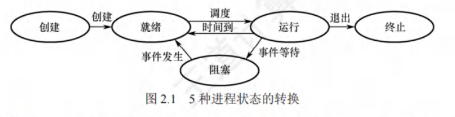
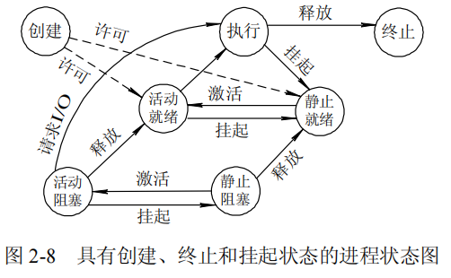
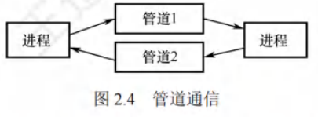
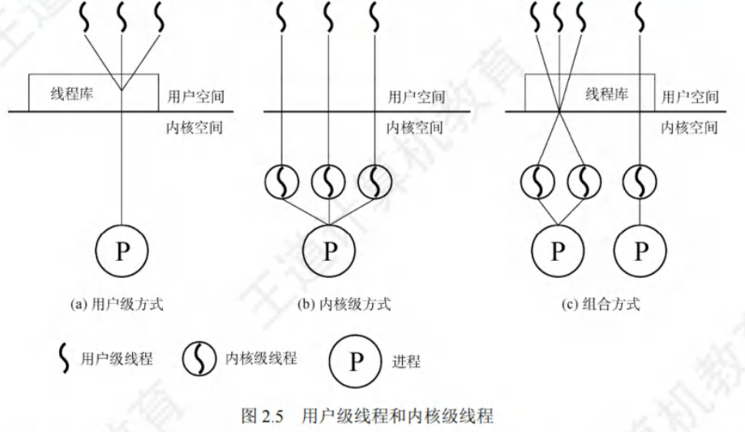
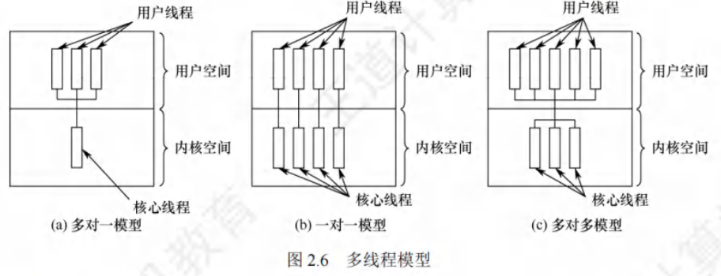
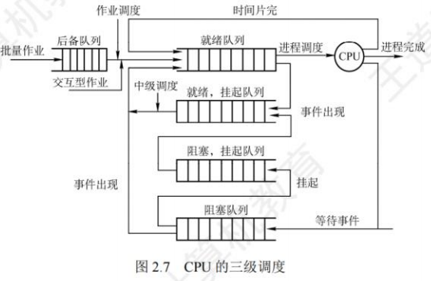
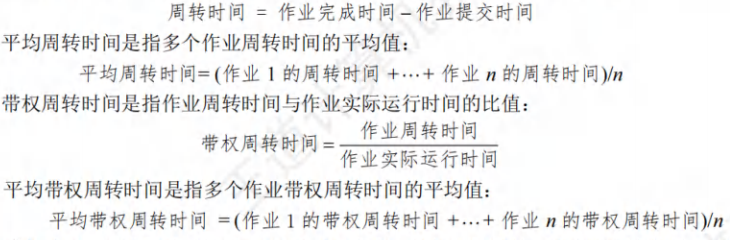

# 进程与线程

[toc]

## 进程

### 进程的引入

引入进程的原因：在多道程序环境下，允许多个程序并发执行，此时它们将失去封闭性，并具有间断性及不可再现性的特征。

进程更好地描述和控制程序的并发执行，实现操作系统的并发性和共享性(最基本的两个特性)。

为了使参与并发执行的每个程序(含数据)都能独立地运行，必须为之配置一个专门的数据结构，称为**进程控制块**(PCB)。

​	系统利用 PCB 来描述进程的基本情况和运行状态，进而控制和管理进程。由程序段、相关数据段和PCB三部分构成了进程实体(又称进程映像)。所谓创建进程，就是创建进程的PCB；而撤销进程，就是撤销进程的PCB。

### 进程的定义

进程是进程实体的运行过程，是系统进行资源分配和调度的一个独立单位。

### 进程特征

​	进程是由多道程序的并发执行而引出的，它和程序是两个截然不同的概念。程序是静态的，进程是动态的，进程的基本特征是对比单个程序的顺序执行提出的。

1. 动态性。进程是程序的一次执行，它有着创建、活动、暂停、终止等过程，具有一定的生命周期，是动态地产生、变化和消亡的。动态性是进程最基本的特征。
2. 并发性。指多个进程同存于内存中，能在一段时间内同时运行。引入进程的目的就是使进程能和其他进程并发执行。并发性是进程的重要特征，也是操作系统的重要特征。
3. 独立性。指进程是一个能独立运行、独立获得资源和独立接受调度的基本单位。凡未建立 PCB 的程序，都不能作为一个独立的单位参与运行。
4. 异步性。由于进程的相互制约，使得进程按各自独立的、不可预知的速度向前推进。异步性会导致执行结果的不可再现性，为此在操作系统中必须配置相应的进程同步机制。

### 进程组成

​	进程是一个独立的运行单位，也是操作系统进行资源分配和调度的基本单位。

#### 进程控制块

​	在进程的整个生命期中，系统总是通过PCB对进程进行控制的，即系统唯有通过进程的PCB才能感知到该进程的存在。

1. 进程创建时，操作系统为它新建一个PCB，该结构之后常驻内存，任意时刻都可以存取，并在进程结束时删除。PCB是进程实体的一部分，是进程存在的唯一标志。
2. 进程执行时，系统通过其PCB了解进程的现行状态信息，以便操作系统对其进行控制和管理；
3. 进程结束时，系统收回其 PCB，该进程随之消亡。
4. 当操作系统希望调度某个进程运行时，要从该进程的PCB中查出其现行状态及优先级；
5. 在调度到某个进程后，要根据其PCB中所保存的CPU状态信息，设置该进程恢复运行的现场，并根据其PCB中的程序和数据的内存始址，找到其程序和数据；
6. 进程在运行过程中，当需要和与之合作的进程实现同步、通信或访问文件时，也需要访问PCB；
7. 当进程由于某种原因而暂停运行时，又需将其断点的CPU环境保存在PCB中。

- 进程控制块包含的内容

1. 进程描述信息。进程标识符：标志各个进程，每个进程都有一个唯一的标识号。用户标识符：进程所归属的用户，用户标识符主要为共享和保护服务。
2. 进程控制和管理信息。进程当前状态:描述进程的状态信息，作为CPU分配调度的依据。进程优先级:描述进程抢占CPU的优先级，优先级高的进程可优先获得CPU。
3. 资源分配清单，用于说明有关内存地址空间或虚拟地址空间的状况，所打开文件的列表和所使用的输入/输出设备信息。
4. 处理机相关信息，也称CPU的上下文，主要指 CPU中各寄存器的值。当进程处于执行态时，CPU的许多信息都在寄存器中。当进程被切换时，CPU状态信息都必须保存在相应的PCB中，以便在该进程重新执行时，能从断点继续执行。

- 进程控制块的组织方式

1. 链接方式将同一状态的 PCB 链接成一个队列，不同状态对应不同的队列，也可将处于阻塞态的进程的 PCB，根据其阻塞原因的不同，排成多个阻塞队列。
2. 索引方式将同一状态的进程组织在一个索引表中，索引表的表项指向相应的PCB，不同状态对应不同的索引表，如就绪索引表和阻塞索引表等。

#### 程序段

​	程序段就是能被进程调度程序调度到CPU执行的程序代码段。

​	注意，程序可被多个进程共享，即多个进程可以运行同一个程序。

#### 数据段

一个进程的数据段，可以是进程对应的程序加工处理的原始数据，也可以是程序执行时产生的中间或最终结果。

### 状态

​	进程在其生命周期内，由于系统中各个进程之间的相互制约及系统的运行环境的变化，使得进程的状态也在不断地发生变化。

通常进程有以下 5 种状态，前 3 种是进程的基本状态。

1. 运行态。进程正在 CPU 上运行。在单 CPU 中，每个时刻只有一个进程处于运行态。
2. 就绪态。进程获得了除CPU外的一切所需资源，一旦得到CPU，便可立即运行。系统中处于就绪态的进程可能有多个，通常将它们排成一个队列，称为就绪队列。
3. 阻塞态，又称等待态。进程正在等待某一事件而暂停运行，如等待某个资源可用(不包括 CPU)或等待 I/O 完成。即使 CPU 空闲，该进程也不能运行。系统通常将处于阻塞态的进程也排成一个队列，甚至根据阻塞原因的不同，设置多个阻塞队列。
4. 创建态。进程正在被创建，尚未转到就绪态。创建进程需要多个步骤:首先申请一个空白 PCB，并向 PCB中填写用于控制和管理进程的信息；然后为该进程分配运行时所必须的资源；最后将该进程转入就绪态并插入就绪队列。但是，如果进程所需的资源尚不能得到满足，如内存不足，则创建工作尚未完成，进程此时所处的状态称为创建态。
5. 终止态。进程正从系统中消失，可能是进程正常结束或其他原因退出运行。进程需要结束运行时，系统首先将该进程置为终止态，然后进一步处理资源释放和回收等工作。

区别就绪态和阻塞态：就绪态是指进程仅缺少 CPU，只要获得 CPU 就立即运行；而阻塞态是指进程需要其他资源(除了CPU)或等待某一事件。之所以将CPU和其他资源分开，是因为在分时系统的时间片轮转机制中，每个进程分到的时间片是若干毫秒。也就是说，进程得到 CPU 的时间很短且非常频繁，进程在运行过程中实际上是频繁地转换到就绪态的；而其他资源(如外设)的使用和分配或某一事件的发生(如I/O完成)对应的时间相对来说很长，进程转换到阻塞态的次数也相对较少。这样来看，就绪态和阻塞态是进程生命周期中两个完全不同的状态。

### 状态转换

图 2.1说明了5种进程状态的转换，而3种基本状态之间的转换如下：

1. 就绪态→运行态:处于就绪态的进程被调度后，获得CPU资源(分派CPU的时间片)，于是进程由就绪态转换为运行态。
2. 运行态→就绪态:处于运行态的进程在时间片用完后，不得不让出CPU，从而进程由运行态转换为就绪态。此外，在可剥夺的操作系统中，当有更高优先级的进程就绪时，调度程序将正在执行的进程转换为就绪态，让更高优先级的进程执行。
3. 运行态→阻塞态：进程请求某一资源(如外设)的使用和分配或等待某一事件的发生(如I/O操作的完成)时，它就从运行态转换为阻塞态。进程以系统调用的形式请求操作系统提供服务，这是一种特殊的、由运行用户态程序调用操作系统内核过程的形式。
4. 阻塞态→就绪态:进程等待的事件到来时，如I/O操作完成或中断结束时，中断处理程序必须将相应进程的状态由阻塞态转换为就绪态。

​	需要注意的是，一个进程从运行态变为阻塞态是主动的行为，而从阻塞态变为就绪态是被动的行为，需要其他相关进程的协助。

### 进程控制

​	进程控制的主要功能是对系统中的所有进程实施有效的管理，它具有创建新进程、撤销已有进程、实现进程状态转换等功能。在操作系统中，一般将进程控制用的程序段称为原语，原语的特点是执行期间不允许中断，它是一个不可分割的基本单位。

#### 创建

​	允许一个进程创建另一个进程，此时创建者称为父进程，被创建的进程称为子进程。子进程可以继承父进程所拥有的资源。当子进程被撤销时，应将其从父进程那里获得的资源还给父进程。此外，在撤销父进程时，通常也会同时撤销其所有的子进程。

- 导致创建进程的操作

​	在操作系统中，终端用户登录系统、作业调度、系统提供服务、用户程序的应用请求等都会引起进程的创建。

- 创建一个新进程的过程(创建原语)

1. 为新进程分配一个唯一的进程标识号，并申请一个空白PCB (PCB是有限的)。若PCB申请失败，则创建失败。
2. 为进程分配其运行所需的资源，如内存、文件、1/0设备和CPU时间等(在PCB中体现)。这些资源或从操作系统获得，或仅从其父进程获得。如果资源不足(如内存)，则并不是创建失败，而是处于创建态，等待内存资源。
3. 初始化 PCB，主要包括初始化标志信息、初始化 CPU 状态信息和初始化 CPU 控制信息，以及设置进程的优先级等。
4. 若进程就绪队列能够接纳新进程，则将新进程插入就绪队列，等待被调度运行。

#### 终止

- 导致终止进程的事件

1. 正常结束，表示进程的任务已完成并准备退出运行。
2. 异常结束，表示进程在运行时，发生了某种异常事件，使程序无法继续运行，如存储区越界、保护错、非法指令、特权指令错、运行超时、算术运算错、I/O 故障等。
3. 外界干预，指进程应外界的请求而终止运行，如操作员或操作系统干预、父进程请求和父进程终止。

- 终止一个进程的过程(终止原语)：

1. 根据被终止进程的标识符，检索出该进程的PCB，从中读出该进程的状态。
2. 若被终止进程处于运行状态，立即终止该进程的执行，将CPU资源分配给其他进程。
3. 若该进程还有子孙进程，则通常需将其所有子孙进程终止(有些系统无此要求)。
4. 将该进程所拥有的全部资源，或归还给其父进程，或归还给操作系统。
5. 将该PCB从所在队列(链表)中删除。

#### 阻塞

- 导致阻塞进程的事件

​	正在执行的进程，由于期待的某些事件未发生，如请求系统资源失败、等待某种操作的完成、新数据尚未到达或无新任务可做等，进程便通过调用阻塞原语(Block)，使自己由运行态变为阻塞态。

​	可见，阻塞是进程自身的一种主动行为，也因此只有处于运行态的进程(获得CPU)，才可能将其转为阻塞态。

- 阻塞原语的执行过程如下:

1. 找到将要被阻塞进程的标识号(PID)对应的PCB。
2. 若该进程为运行态，则保护其现场，将其状态转为阻塞态，停止运行。
3. 将该PCB插入相应事件的等待队列，将CPU资源调度给其他就绪进程。

#### 唤醒

- 导致唤醒进程的事件

​	当被阻塞进程所期待的事件出现时，如它所期待的I/O操作已完成或其所期待的数据已到达，由有关进程(比如，释放该I/O设备的进程，或提供数据的进程)调用唤醒原语(Wakeup)，将等待该事件的进程唤醒。

- 唤醒原语的执行过程如下:

1. 在该事件的等待队列中找到相应进程的PCB。
2. 将其从等待队列中移出，并置其状态为就绪态。
3. 将该PCB插入就绪队列，等待调度程序调度。

​	Block原语和Wakeup原语是一对作用刚好相反的原语，必须成对使用。如果在语某个进程中调用了Block 原语，则必须在与之合作的或其他相关的进程中安排一条相应的Wakeup原语，以便唤醒阻塞进程；否则，阻塞进程将因不能被唤醒而永久地处于阻塞态。

#### 挂起

- 导致挂起进程的事件

​	用户进程请求将自己挂起，父进程请求将自己的某个子进程挂起，系统将利用挂起原语suspend()将指定进程或处于阻塞状态的进程挂起。

- 挂起原语的执行过程如下:

1. 检查被挂起进程的状态。
2. 若处于活动就绪状态，便将其改为静止就绪。
3. 对于活动阻塞状态的进程，则将之改为静止阻塞。为了方便用户或父进程考查该进程的运行情况而把该进程的PCB复制到某指定的内存区域。
4. 若被挂起的进程正在执行，则转向调度程序重新调度。

#### 激活

- 导致激活进程的事件

父进程或用户进程请求激活指定进程，若该进程驻留在外存而内存中已有足够的空间时，则可将在外存上处于静止就绪状态的该进程换入内存。系统将利用激活原语active()将指定进程激活。

- 激活原语的执行过程如下:

1. 激活原语先将进程从外存调入内存，检查该进程的现行状态。
2. 若是静止就绪，便将之改为活动就绪
3. 若为静止阻塞，便将之改为活动阻塞。
4. 假如采用的是抢占调度策略，则每当有新进程进入就绪队列时，应检查是否要进行重新调度，即由调度程序将被激活进程与当前进程进行优先级的比较，如果被激活进程的优先级更低，就不必重新调度。否则，立即剥夺当前进程的运行，把处理机分配给刚被激活的进程。

### 进程同步

#### 概念

#### 信号量机制

#### 管程

#### 互斥锁

### 经典同步问题

#### 生产者-消费者问题

#### 哲学家进食问题

#### 读者-写者问题

#### 吸烟者问题

### 进程通信

#### 概念

​	进程通信，是指进程之间的信息交换，其所交换的信息量少者是一个状态或数值，多者则是成千上万个字节。进程之间的互斥和同步，由于其所交换的信息量少而被归结为低级通信。在进程互斥中，进程通过只修改信号量来向其他进程表明临界资源是否可用。

#### 高级通信方式

​	高级进程通信，是指用户可直接利用操作系统所提供的一组通信命令高效地传送大量数据的一种通信方式，操作系统隐藏了进程通信的实现细节。通信过程对用户是透明的。减少了通信程序编制上的复杂性。

​	高级通信方法主要有以下三类：

- 共享存储器系统

​	在共享存储器系统中，相互通信的进程共享某些数据结构或共享存储区，进程之间能够通过这些空间进行通信。

​	可把它们分成以下两种类型：

1. 基于共享数据结构的通信方式。要求诸进程公用某些数据结构，借以实现诸进程间的信息交换。如在生产者-消费者问题中，就是用有界缓冲区这种数据结构来实现通信的。这里，公用数据结构的设置及对进程间同步的处理，都是程序员的职责。这无疑增加了程序员的负担，而操作系统却只须提供共享存储器。因此，这种通信方式是低效的，只适于传递相对少量的数据。
2. 基于共享存储区的通信方式。为了传输大量数据，在存储器中划出了一块共享存储区，进程可通过对共享存储区中数据的读或写来实现通信。进程在通信前，先向系统申请获得共享存储区中的一个分区，并指定该分区的关键字；若系统已经给其他进程分配了这样的分区，则将该分区的描述符返回给申请者，继之，由申请者把获得的共享存储分区连接到本进程上；此后，便可像读、写普通存储器一样地读、写该公用存储分区。

- 消息传递

​	消息传递系统，是当前应用最为广泛的一种进程间的通信机制。进程间的数据交换是以格式化的消息为单位的；程序员直接利用操作系统提供的一组通信命令(原语)，不仅能实现大量数据的传递，而且还隐藏了通信的实现细节，使通信过程对用户是透明的，从而减化了通信程序编制的复杂性。

​	微内核与服务器之间的通信，都采用了消息传递机制。由于它能很好地支持多处理机系统、分布式系统和计算机网络，它也成为这些领域最主要的通信工具。消息传递系统的通信方式属于高级通信方式。又因其实现方式的不同而进一步分成直接通信方式和间接通信方式两种。

- 管道通信

​	管道，是指用于连接一个读进程和一个写进程以实现它们之间通信的一个共享文件，又名pipe文件。

​	向管道(共享文件)提供输入的发送进程(即写进程)，以字符流形式将大量的数据送入管道；而接受管道输出的接收进程(即读进程)，则从管道中接收(读)数据。由于发送进程和接收进程是利用管道进行通信的，故又称为管道通信。

​	为了协调双方的通信，管道机制必须提供以下三方面的协调能力：

1. 互斥，即当一个进程正在对pipe执行读/写操作时，其它(另一)进程必须等待。
2. 同步，指当写(输入)进程把一定数量(如4 KB)的数据写入pipe，便去睡眠等待，直到读(输出)进程取走数据后，再把它唤醒。当读进程读一空pipe时，也应睡眠等待，直至写进程将数据写入管道后，才将之唤醒。
3. 确定对方是否存在，只有确定了对方已存在时，才能进行通信。

​	管道只能由创建进程所访问，当父进程创建一个管道后，由于管道是一种特殊文件，子进程会继承父进程的打开文件，因此子进程也继承父进程的管道，并可用它来与父进程进行通信。

​	从管道读数据是一次性操作，数据一旦被读取，就释放空间以便写更多数据。普通管道只允许单向通信，若要实现两个进程双向通信，则需要定义两个管道。

#### 实现方法

​	在进程之间通信时，源进程可以直接或间接地将消息传送给目标进程，由此可将进程通信分为直接通信和间接通信两种通信方式。

- 直接通信方式

​	这是指发送进程利用OS所提供的发送命令，直接把消息发送给目标进程。要求发送进程和接收进程都以显式方式提供对方的标识符。

- 间接通信方式

​	间接通信方式指进程之间的通信需要通过作为共享数据结构的实体。该实体用来暂存发送进程发送给目标进程的消息；接收进程则从该实体中取出对方发送给自己的消息。通常把这种中间实体称为信箱。消息在信箱中可以安全地保存，只允许核准的目标用户随时读取。因此，利用信箱通信方式，既可实现实时通信，又可实现非实时通信。

​	信箱可由操作系统创建，也可由用户进程创建，创建者是信箱的拥有者。据此，可把信箱分为以下三类：

1. 私用信箱用户进程可为自己建立一个新信箱，并作为该进程的一部分。信箱的拥有者有权从信箱中读取消息，其他用户则只能将自己构成的消息发送到该信箱中。这种私用信箱可采用单向通信链路的信箱来实现。当拥有该信箱的进程结束时，信箱也随之消失。
2. 公用信箱它由操作系统创建，并提供给系统中的所有核准进程使用。核准进程既可把消息发送到该信箱中，也可从信箱中读取发送给自己的消息。显然，公用信箱应采用双向通信链路的信箱来实现。通常，公用信箱在系统运行期间始终存在。
3. 共享信箱它由某进程创建，在创建时或创建后指明它是可共享的，同时须指出共享进程(用户)的名字。信箱的拥有者和共享者都有权从信箱中取走发送给自己的消息。

​	在利用信箱通信时，在发送进程和接收进程之间存在以下四种关系：

1. 一对一关系。这时可为发送进程和接收进程建立一条两者专用的通信链路，使两者之间的交互不受其他进程的干扰。
2. 多对一关系。允许提供服务的进程与多个用户进程之间进行交互，也称为客户/服务器交互
3. 一对多关系。允许一个发送进程与多个接收进程进行交互，使发送进程可用广播方式向接收者(多个)发送消息。
4. 多对多关系。允许建立一个公用信箱，让多个进程都能向信箱中投递消息；也可从信箱中取走属于自己的消息。

#### 相关问题

- 通信链路

​	为使在发送进程和接收进程之间能进行通信，必须在两者之间建立一条通信链路。有两种方式建立通信链路。

1. 由发送进程在通信之前用显式的“建立连接”命令(原语)请求系统为之建立一条通信链路；在链路使用完后，也用显式方式拆除链路。
2. 发送进程无须明确提出建立链路的请求，只须利用系统提供的发送命令(原语)，系统会自动地为之建立一条链路。这种方式主要用于单机系统中。

​	根据通信链路的连接方法，可把通信链路分为两类：

1. 点一点连接通信链路，这时的一条链路只连接两个结点(进程)；
2. 多点连接链路，指用一条链路连接多个(n>2)结点(进程)。

​	根据通信方式的不同，则又可把链路分成两种：

1. 单向通信链路，只允许发送进程向接收进程发送消息，或者相反；
2. 双向链路，既允许由进程A向进程B发送消息，也允许进程B同时向进程A发送消息。

​	根据通信链路容量的不同而把链路分成两类：

1. 无容量通信链路，在这种通信链路上没有缓冲区，因而不能暂存任何消息；
2. 有容量通信链路，指在通信链路中设置了缓冲区，因而能暂存消息。缓冲区数目愈多，通信链路的容量愈大。

- 消息的格式

​	在消息传递系统中所传递的消息，必须具有一定的消息格式。在单机系统环境中，由于发送进程和接收进程处于同一台机器中，有着相同的环境，故其消息格式比较简单；但在计算机网络环境下，不仅源和目标进程所处的环境不同，而且信息的传输距离很远，可能要跨越若干个完全不同的网络，致使所用的消息格式比较复杂。通常，可把一个消息分成消息头和消息正文两部分。消息头包括消息在传输时所需的控制信息，如源进程名、目标进程名、消息长度、消息类型、消息编号及发送的日期和时间；而消息正文则是发送进程实际上所发送的数据。

​	两种消息格式

1. 比较短的定长消息格式，这便减少了对消息的处理和存储开销。这种方式可用于办公自动化系统中，为用户提供快速的便笺式通信；但这对要发送较长消息的用户是不方便的。
2. 采用变长的消息格式，即进程所发送消息的长度是可变的。系统无论在处理还是在存储变长消息时，都可能会付出更多的开销，但这方便了用户。

- 进程同步方式

​	在进程之间进行通信时，需要有进程同步机制，以使诸进程间能协调通信。不论是发送进程，还是接收进程，在完成消息的发送或接收后，都存在两种可能性，即进程或者继续发送(接收)，或者阻塞。

​	三种情况：

1. 发送进程阻塞，接收进程阻塞。主要用于进程之间紧密同步，发送进程和接收进程之间无缓冲时。这两个进程平时都处于阻塞状态，直到有消息传递时。这种同步方式称为汇合。
2. 发送进程不阻塞，接收进程阻塞。平时，发送进程不阻塞，因而它可以尽快地把一个或多个消息发送给多个目标； 而接收进程平时则处于阻塞状态，直到发送进程发来消息时才被唤醒。
3. 发送进程和接收进程均不阻塞。平时，发送进程和接收进程都在忙于自己的事情，仅当发生某事件使它无法继续运行时，才把自己阻塞起来等待。

### 消息缓冲队列通信机制

## 线程

### 概念

​	引入线程的目的则是减小程序在并发执行时所付出的时空开销，提高操作系统的并发性能。

​	线程最直接的理解就是轻量级进程，它是一个基本的 CPU 执行单元，也是程序执行流的最小单元，由线程ID、程序计数器、寄存器集合和堆栈组成。

​	线程是进程中的一个实体，是被系统独立调度和分派的基本单位，线程自己不拥有系统资源，只拥有一点儿在运行中必不可少的资源，但它可与同属一个进程的其他线程共享进程所拥有的全部资源。一个线程可以创建和撤销另一个线程，同一进程中的多个线程之间可以并发执行。由于线程之间的相互制约，致使线程在运行中呈现出间断性。线程也有就绪、阻塞和运行三种基本状态。

​	引入线程后，进程的内涵发生了改变，进程只作为除CPU外的系统资源的分配单元，而线程则作为CPU的分配单元。由于一个进程内部有多个线程，若线程的切换发生在同一个进程内部，则只需要很少的时空开销。

### 比较

1. 调度。在传统的操作系统中，拥有资源和独立调度的基本单位都是进程，每次调度都要进行上下文切换，开销较大。在引入线程的操作系统中，线程是独立调度的基本单位，而线程切换的代价远低于进程。在同一进程中，线程的切换不会引起进程切换。但从一个进程中的线程切换到另一个进程中的线程时，会引起进程切换。
2. 并发性。在引入线程的操作系统中，不仅进程之间可以并发执行，而且一个进程中的多个线程之间亦可并发执行，甚至不同进程中的线程也能并发执行，从而使操作系统具有更好的并发性，提高了系统资源的利用率和系统的吞吐量。
3. 拥有资源。进程是系统中拥有资源的基本单位，而线程不拥有系统资源(仅有一点必不可少、能保证独立运行的资源)，但线程可以访问其隶属进程的系统资源，这主要表现在属于同一进程的所有线程都具有相同的地址空间。要知道，若线程也是拥有资源的单位，则切换线程就需要较大的时空开销，线程这个概念的提出就没有意义。
4. 独立性。每个进程都拥有独立的地址空间和资源，除了共享全局变量，不允许其他进程访问。某个进程中的线程对其他进程不可见。同一进程中的不同线程是为了提高并发性及进行相互之间的合作而创建的，它们共享进程的地址空间和资源。
5. 系统开销。在创建或撤销进程时，系统都要为之分配或回收进程控制块PCB及其他资源，如内存空间、I/O设备等。操作系统为此所付出的开销，明显大于创建或撤销线程时的开销。类似地，在进程切换时涉及进程上下文的切换，而线程切换时只需保存和设置少量寄存器内容，开销很小。此外，由于同一进程内的多个线程共享进程的地址空间，因此这些线程之间的同步与通信非常容易实现，甚至无须操作系统的干预。
6. 支持多处理器系统。对于传统单线程进程，不管有多少个CPU，进程只能运行在一个CPU上。对于多线程进程，可将进程中的多个线程分配到多个CPU上执行。

### 属性

​	多线程操作系统中的进程已不再是一个基本的执行实体，但它仍具有与执行相关的状态。所谓进程处于“执行”状态，实际上是指该进程中的线程正在执行。

1. 线程是一个轻型实体，它不拥有系统资源，但每个线程都应有一个唯一的标识符和一个线程控制块，线程控制块记录线程执行的寄存器和栈等现场状态。
2. 不同的线程可以执行相同的程序，即同一个服务程序被不同的用户调用时，操作系统将它们创建成不同的线程。
3. 同一进程中的各个线程共享该进程所拥有的资源。
4. 线程是CPU的独立调度单位，多个线程是可以并发执行的。在单 CPU的计算机系统中，各线程可交替地占用CPU；在多CPU的计算机系统中，各线程可同时占用不同的CPU，若各个CPU同时为一个进程内的各线程服务，则可缩短进程的处理时间。
5. 一个线程被创建后，便开始了它的生命周期，直至终止。线程在生命周期内会经历阻塞态、就绪态和运行态等各种状态变化。

- 线程有利于提高系统并发性

​	有了线程，线程切换时，有可能会发生进程切换，也有可能不发生进程切换，平均而言每次切换所需的开销就变小了，因此能够让更多的线程参与并发，而不会影响到响应时间等问题。

### 状态与转换

​	各线程之间也存在共享资源和相互合作的制约关系，致使线程在运行时也具有间断性。

​	线程在运行时也具有下面三种基本状态：

1. 执行态:线程已获得CPU而正在运行。
2. 就绪态:线程已具备各种执行条件，只需再获得CPU便可立即执行。
3. 阻塞态:线程在执行中因某事件受阻而处于暂停状态。

​	线程这三种基本状态之间的转换和进程基本状态之间的转换是一样的。

### 组织与控制

- 进程控制块

​	系统也为每个线程配置一个线程控制块TCB，用于记录控制和管理线程的信息。

​	线程控制块通常包括：

1. 线程标识符；
2. 一组寄存器，包括程序计数器、状态寄存器和通用寄存器；
3. 线程运行状态，用于描述线程正处于何种状态；
4. 优先级；
5. 线程专有存储区，线程切换时用于保存现场等；
6. 堆栈指针，用于过程调用时保存局部变量及返回地址等。

​	同一进程中的所有线程都完全共享进程的地址空间和全局变量。各个线程都可以访问进程地址空间的每个单元，所以一个线程可以读、写或甚至清除另一个线程的堆栈。

- 线程的创建

​	线程也是具有生命期的，它由创建而产生，由调度而执行，由终止而消亡。相应地，在操作系统中就有用于创建线程和终止线程的函数(或系统调用)。

​	用户程序启动时，通常仅有一个称为初始化线程的线程正在执行，其主要功能是用于创建新线程。在创建新线程时，需要利用一个线程创建函数，并提供相应的参数，如指向线程主程序的，入口指针、堆栈的大小、线程优先级等。线程创建函数执行完后，将返回一个线程标识符。

- 线程的终止

​	当一个线程完成自己的任务后，或线程在运行中出现异常而要被强制终止时，由终止线程调用相应的函数执行终止操作。但是有些线程(主要是系统线程)一旦被建立，便一直运行而不会被终止。通常，线程被终止后并不立即释放它所占有的资源，只有当进程中的其他线程执行了分离函数后，被终止线程才与资源分离，此时的资源才能被其他线程利用。

​	被终止但尚未释放资源的线程仍可被其他线程调用，以使被终止线程重新恢复运行。

### 实现方式

线程的实现可以分为两类：用户级线程(ULT)和内核级线程(KLT)。

- 用户级线程(ULT)

​	用户级线程就是“从用户视角能看到的线程”。在用户级线程中，有关线程管理(创建、撤销和切换等)的所有工作都由应用程序在用户空间内(用户态)完成，无须操作系统干预，内核意识不到线程的存在。应用程序可以通过使用线程库设计成多线程程序。通常，应用程序从单线程开始，在该线程中开始运行，在其运行的任何时刻，可以通过调用线程库中的派生例程创建一个在相同进程中运行的新线程。图2.5(a)说明了用户级线程的实现方式。

​	对于设置了用户级线程的系统，其调度仍然以进程为单位进行，各个进程轮流执行一个时间片。假设进程 A 包含 1 个用户级线程，进程 B 包含 100 个用户级线程，这样，进程 A 中线程的运行时间将是进程B中各线程运行时间的100倍，因此对线程来说实质上是不公平的。

​	这种实现方式的优点如下：

1. 线程切换不需要转换到内核空间，节省了模式切换的开销。
2. 调度算法可以是进程专用的，不同的进程可根据自身的需要，对自己的线程选择不同的调度算法。
3. 用户级线程的实现与操作系统平台无关，对线程管理的代码是属于用户程序的一部分。

​	这种实现方式的缺点如下：

1. 系统调用的阻塞问题，当线程执行一个系统调用时，不仅该线程被阻塞，而且进程内的所有线程都被阻塞。
2. 不能发挥多CPU的优势，内核每次分配给一个进程的仅有一个 CPU，因此进程中仅有一个线程能执行。

- 内核级线程(KLT)

​	在操作系统中，无论是系统进程还是用户进程，都是在操作系统内核的支持下运行的，与内核紧密相关。内核级线程同样也是在内核的支持下运行的，线程管理的所有工作也是在内核空间内(核心态)实现的。操作系统也为每个内核级线程设置一个线程控制块TCB，内核根据该控制块感知某线程的存在，并对其加以控制。图2.5(b)说明了内核级线程的实现方式。

​	这种实现方式的优点如下：

1. 能发挥多 CPU 的优势，内核能同时调度同一进程中的多个线程并行执行。
2. 如果进程中的一个线程被阻塞，内核可以调度该进程中的其他线程占用CPU，也程可运行其他进程中的线程。
3. 内核支持线程具有很小的数据结构和堆栈，线程切换比较快、开销小。
4. 内核本身也可采用多线程技术，可以提高系统的执行速度和效率。

​	这种实现方式的缺点如下：同一进程中的线程切换，需要从用户态转到核心态进行，系统开销较大。这是因为用户进程的线程在用户态运行，而线程调度和管理是在内核实现的。

- 组合方式

​	在组合实现方式中，内核支持多个内核级线程的建立、式调度和管理，同时允许用户程序建立、调度和管理用户级线程。一些内核级线程对应多个用户级线程，这是用户级线程通过时分多路复用内核级线程实现的。

​	同一进程中的多个线程可以同时在多CPU上并行执行，且在阻塞一个线程时不需要将整个进程阻塞，所以组合方式能结合KLT和ULT的优点，并且克服各自的不足。图2.5(c)展示了这种组合实现方式。

​	线程库，是为程序员提供创建和管理线程的API。实现线程库主要的方法有如下两种：

1. 在用户空间中提供一个没有内核支持的库。这种库的所有代码和数据结构都位于用户空间中。这意味着，调用库内的一个函数只导致用户空间中的一个本地函数的调用。
2. 实现由操作系统直接支持的内核级的一个库。对于这种情况，库内的代码和数据结构位于内核空间。调用库中的一个API函数通常会导致对内核的系统调用。

​	目前使用的三种主要线程库是: POSIX Pthreads，Windows API，Java。

### 多线程模型

​	在同时支持用户级线程和内核级线程的系统中，由于用户级线程和内核级线程连接方式的不同，从而形成了下面三种不同的多线程模型。

1. 多对一模型。将多个用户级线程映射到一个内核级线程，如图2.6(a)所示。每个进程只被分配一个内核级线程，线程的调度和管理在用户空间完成。仅当用户线程需要访问内核时，才将其映射到一个内核级线程上，但每次只允许一个线程进行映射。优点:线程管理是在用户空间进行的，无须切换到核心态，因而效率比较高。缺点:如果一个线程在访问内核时发生阻塞，则整个进程都会被阻塞；在任何时刻，只有一个线程能够访问内核，多个线程不能同时在多个 CPU 上运行。
2. 一对一模型。将每个用户级线程映射到一个内核级线程，如图2.6(b)所示。每个进程有与用户级线程数量相同的内核级线程，线程切换由内核完成，需要切换到核心态。优点：当一个线程被阻塞后，允许调度另一个线程运行，所以并发能力较强。缺点:每创建一个用户线程，相应地就需要创建一个内核线程，开销较大。
3. 多对多模型。将n个用户级线程映射到m个内核级线程上，要求n2m，如图2.6(c)所示。特点:既克服了多对一模型并发度不高的缺点，又克服了一对一模型的一个用户进程占用太多内核级线程而开销太大的缺点。此外，还拥有上述两种模型各自的优点。

## CPU调度

### 概念

​	在多道程序系统中，进程的数量往往多于CPU的个数，因此进程争用CPU的情况在所难免。

​	CPU 调度是对 CPU 进行分配，即从就绪队列中按照一定的算法(公平、高效的原则)选择一个进程并将CPU分配给它运行，以实现进程并发地执行。

​	CPU 调度是多道程序操作系统的基础，是操作系统设计的核心问题。

### 层次

1. 高级调度(作业调度)按照某种规则从外存上处于后备队列的作业中挑选一个(或多个)，给它(们)分配内存、I/O设备等必要的资源，并建立相应的进程，以使它(们)获得竞争CPU的权利。简言之，作业调度就是内存与辅存之间的调度。每个作业只调入一次、调出一次。多道批处理系统中大多配有作业调度，而其他系统中通常不需要配置作业调度。
2. 中级调度(内存调度)引入中级调度的目的是提高内存利用率和系统吞吐量。为此，将那些暂时不能运行的进程调至外存等待，此时进程的状态称为挂起态。当它们已具备运行条件且内存又稍有空闲时，由中级调度来决定将外存上的那些已具备运行条件的挂起进程再重新调入内存，并修改其状态为就绪态，挂在就绪队列上等待。中级调度实际上是存储器管理中的对换功能。
3. 低级调度(进程调度)按照某种算法从就绪队列中选取一个进程，将 CPU 分配给它。进程调度是最基本的一种调度，在各种操作系统中都必须配置这级调度。进程调度的频率很高，一般几十毫秒一次。

### 联系

​	作业调度从外存的后备队列中选择一批作业进入内存，为它们建立进程，这些进程被送入就绪队列，进程调度从就绪队列中选出一个进程，并将其状态改为运行态，将CPU分配给它。中级调度是为了提高内存的利用率，系统将那些暂时不能运行的进程挂起来。

1. 作业调度为进程活动做准备，进程调度使进程正常活动起来。
2. 中级调度将暂时不能运行的进程挂起，中级调度处于作业调度和进程调度之间。
3. 作业调度次数少，中级调度次数略多，进程调度频率最高。4)进程调度是最基本的，不可或缺。

### 调度的实现

#### 调度程序(调度器)

​	用于调度和分派CPU的组件称为调度程序，它通常由三部分组成。

1. 排队器。将系统中的所有就绪进程按照一定的策略排成一个或多个队列，以便于调度程序选择。每当有一个进程转变为就绪态时，排队器便将它插入相应的就绪队列。
2. 分派器。依据调度程序所选的进程，将其从就绪队列中取出，将CPU 分配给新进程。
3. 上下文切换器。在对CPU进行切换时，会发生两对上下文的切换操作：
   1. 第一对，将当前进程的上下文保存到其 PCB中，再装入分派程序的上下文，以便分派程序运行；
   2. 第二对，移出分派程序的上下文，将新选进程的 CPU 现场信息装入 CPU 的各个相应寄存器。

​	在上下文切换时，需要执行大量 load 和 store 指令，以保存寄存器的内容，因此会花费较多时间。现在已有硬件实现的方法来减少上下文切换时间。通常采用两组寄存器，其中一组供内核使用，一组供用户使用。这样，上下文切换时，只需改变指针，让其指向当前寄存器组即可。

#### 调度的时机，切换，过程

​	调度程序是操作系统内核程序。请求调度的事件发生后，才可能运行调度程序，调度了新的就绪进程后，才会进行进程切换。理论上这三件事情应该顺序执行，但在实际的操作系统内核程序运行中，若某时刻发生了引起进程调度的因素，则不一定能马上进行调度与切换。

​	进程调度与切换的情况如下：

1. 创建新进程后，由于父进程和子进程都处于就绪态，因此需要决定是运行父进程还是运行子进程，调度程序可以合法地决定其中一个进程先运行。
2. 进程正常结束后或者异常终止后，必须从就绪队列中选择某个进程运行。若没有就绪进程，则通常运行一个系统提供的闲逛进程。
3. 当进程因I/O请求、信号量操作或其他原因而被阻塞时，必须调度其他进程运行。
4. 当I/O设备完成后，发出 I/O中断，原先等待I/O的进程从阻塞态变为就绪态，此时需要决定是让新的就绪进程投入运行，还是让中断发生时运行的进程继续执行。

​	此外，当有更紧急的任务(如更高优先级的进程进入就绪队列)需要处理时，或者当前进程的时间片用完时，也被强行剥夺 CPU(被动放弃)。

​	进程切换往往在调度完成后立刻发生，它要求保存原进程当前断点的现场信息，恢复被调度进程的现场信息。现场切换时，操作系统内核将原进程的现场信息推入当前进程的内核堆栈来保存它们，并更新堆栈指针。内核完成从新进程的内核栈中装入新进程的现场信息、更新当前运行进程空间指针、重设 PC寄存器等相关工作之后，开始运行新的进程。

​	不能进行进程的调度与切换的情况如下：

1. 在处理中断的过程中。中断处理过程复杂，在实现上很难做到进程切换，而且中断处理是系统工作的一部分，逻辑上不属于某一进程，不应被剥夺 CPU 资源。
2. 需要完全屏蔽中断的原子操作过程中。如加锁、解锁、中断现场保护、恢复等原子操作。在原子过程中，连中断都要屏蔽，更不应该进行进程调度与切换。

​	若在上述过程中发生了引起调度的条件，则不能马上进行调度和切换，应置系统的请求调度标志，直到上述过程结束后才进行相应的调度与切换。

#### 进程调度的方式

​	进程调度方式是指当某个进程正在CPU上执行时，若有某个更为重要或紧迫的进程需要处理，即有优先权更高的进程进入就绪队列，此时应如何分配CPU。

​	两种进程调度方式：

1. 非抢占调度方式，又称非剥夺方式。是指当一个进程正在CPU上执行时，即使有某个更为重要或紧迫的进程进入就绪队列，仍然让正在执行的进程继续执行，直到该进程运行完成(如正常结束、异常终止)或发生某种事件(如等待I/O操作、在进程通信或同步中执行了 Block 原语)而进入阻塞态时，才将 CPU 分配给其他进程。非抢占调度方式的优点是实现简单、系统开销小，适用于早期的批处理系统，但它不能用于分时系统和大多数的实时系统。
2. 抢占调度方式，又称剥夺方式。是指当一个进程正在CPU上执行时，若有某个更为重要或紧迫的进程需要使用CPU，则允许调度程序根据某种原则去暂停正在执行的进程，将CPU分配给这个更为重要或紧迫的进程。抢占调度方式对提高系统吞吐率和响应效率都有明显的好处。但“抢占”不是一种任意性行为，必须遵循一定的原则，主要有优先权、短进程优先和时间片原则等。

#### 闲逛进程

​	在进程切换时，如果系统中没有就绪进程，就会调度闲逛进程(Idle Process)运行，它的PID为0。如果没有其他进程就绪，该进程就一直运行，并在指令周期后测试中断。闲逛进程的优先级最低，没有就绪进程时才会运行闲逛进程，只要有进程就绪，就会立即让出 CPU。闲逛进程不需要CPU之外的资源，它不会被阻塞。

#### 线程调度

1. 用户级线程调度。由于内核并不知道线程的存在，所以内核还是和以前一样，选择一个进程，并给予时间控制。由进程中的调度程序决定哪个线程运行。
2. 内核级线程调度。内核选择一个特定线程运行，通常不用考虑该线程属于哪个进程。对被选择的线程赋予一个时间片，如果超过了时间片，就会强制挂起该线程。

用户级线程的线程切换在同一进程中进行，仅需少量的机器指令；内核级线程的线程切换需要完整的上下文切换、修改内存映像、使高速缓存失效，这就导致了若干数量级的延迟。

### 调度的目标

​	不同的调度算法具有不同的特性，在选择调度算法时，必须考虑算法的特性。为了比较CPU调度算法的性能，提出几种评价标准：

- CPU利用率

​	CPU是计算机系统中最重要和昂贵的资源之一，所以应尽可能使CPU保持“忙”状态，使这一资源利用率最高。CPU利用率的计算方法如下：

- 系统吞吐量

​	表示单位时间内CPU完成作业的数量。长作业需要消耗较长的CPU时间，因此会降低系统的吞吐量。而对于短作业，需要消耗的CPU时间较短，因此能提高系统的吞吐量。调度算法和方式的不同，也会对系统的吞吐量产生较大的影响。

- 周转时间

​	指从作业提交到作业完成所经历的时间，是作业等待、在就绪队列中排队、在CPU上运行及1/0操作所花费时间的总和。周转时间的计算方法如下：

- 等待时间

​	指进程处于等待 CPU 的时间之和，等待时间越长，用户满意度越低。CPU 调度算法实际上并不影响作业执行或I/O操作的时间，只影响作业在就绪队列中等待所花的时间。因此，衡量一个调度算法的优劣，常常只需简单地考察等待时间。

- 响应时间

​	指从用户提交请求到系统首次产生响应所用的时间。在交互式系统中，周转时间不是最好的评价准则，一般采用响应时间作为衡量调度算法的重要准则之一。从用户角度来看，调度策略应尽量降低响应时间，使响应时间处在用户能接受的范围之内。

​	要想得到一个满足所有用户和系统要求的算法几乎是不可能的。设计调度程序，一方面要满足特定系统用户的要求(如某些实时和交互进程的快速响应要求)，另一方面要考虑系统整体效率(如减少整个系统的进程平均周转时间)，同时还要考虑调度算法的开销。

### 进程切换

​	对于通常的进程而言其创建、撤销及要求由系统设备完成的1/0操作都是利用系统调用而进入内核，再由内核中的相应处理程序予以完成的。进程切换同样是在内核的支持下实现的，因此可以说任何进程都是在操作系统内核的支持下运行的是与内核紧密相关的。

- 上下文切换切换

​	CPU 到另一个进程需要保存当前进程状态并恢复另一个进程的状态，这个任务称为上下文切换。进程上下文采用进程PCB表示包括CPU寄存器的值、进程状态和内存管理信息等。当进行上下文切换时内核将旧进程状态保存在其PCB中然后加载经调度而要执行的新进程的上下文。在切换过程中进程的运行环境产生实质性的变化。上下文切换的流程如下：

1. 挂起一个进程，将CPU 上下文保存到 PCB，包括程序计数器和其他寄存器。
2. 将进程的 PCB移入相应的队列，如就绪、在某事件阻塞等队列。
3. 选择另一个进程执行，并更新其 PCB。
4. 恢复新进程的 CPU 上下文。
5. 跳转到新进程PCB中的程序计数器所指向的位置执行。

- 上下文切换的消耗

​	上下文切换通常是计算密集型的，即它需要相当可观的 CPU 时间，在每秒几十上百次的切换中每次切换都需要纳秒量级的时间所以上下文切换对系统来说意味着消耗大量的CPU时间。有些 CPU提供多个寄存器组这样上下文切换就只需要简单改变当前寄存器组的指针。

- 上下文切换与模式切换

​	模式切换与上下文切换是不同的模式切换时CPU逻辑上可能还在执行同一进程。用户进程最开始都运行在用户态若进程因中断或异常进入核心态运行执行完后又回到用户态刚被中断的进程运行。用户态和内核态之间的切换称为模式切换而不是上下文切换因为没有改变当前的进程。上下文切换只能发生在内核态它是多任务操作系统中的一个必需的特性。

### 调度算法

#### 先来先服务FCFS

#### 短作业(进程)优先SJ(P)F

#### 高响应比优先调度算法

#### 优先级调度算法

#### 时间片轮转(RR)调度算法

#### 多级队列调度算法

#### 多级反馈队列调度算法

#### 实时调度

## 死锁

### 概念

### 死锁预防

### 死锁避免

### 死锁检测

### 死锁解除

