# I/O管理

## I/O管理概述

### I/O设备

#### 设备的分类

- 按信息交换的单位分类：

1. 块设备。信息交换以数据块为单位，如磁盘、磁带等。磁盘设备的基本特征是传输速率较高、可寻址，即对它可随机地读/写任意一块。
2. 字符设备。信息交换以字符为单位，如交互式终端机、打印机等。它们的基本特征是传输速率低、不可寻址，并且时常采用中断I/O方式。

- 按设备的传输速率分类：

1. 低速设备。传输速率仅为每秒几字节到数百字节，如键盘、鼠标等。
2. 中速设备。传输速率为每秒数千字节至数万字节，如激光打印机等。
3. 高速设备。传输速率在数百千字节至千兆字节，如磁盘机、光盘机等。

- 按设备的使用特性分类：

1. 存储设备。用于存储信息的外部设备，如磁盘、磁带、光盘等。
2. 输入/输出设备。又可分为输入设备、输出设备和交互式设备。输入设备用于向计算机输入外部信息，如键盘、鼠标、扫描仪等；输出设备用于计算机向外输出数据信息，如打印机等；交互式设备则集成了上述两类设备的功能，如触控显示器等。

- 按设备的共享属性分类：

1. 独占设备。同一时刻只能由一个进程占用的设备。一旦将这类设备分配给某进程，便由该进程独占，直至用完释放。低速设备一般是独占设备，如打印机。
2. 共享设备。同一时间段内允许多个进程同时访问的设备。对于共享设备，可同时分配给多个进程，通过分时的方式共享使用。典型的共享设备是磁盘。
3. 虚拟设备。通过SPOOLing技术将独占设备改造为共享设备，将一个物理设备变为多个逻辑设备，从而可将设备同时分配给多个进程。

#### I/O接口

​	I/O接口(又称设备控制器)是CPU与设备之间的接口，以实现设备和计算机之间的数据交换。它接收发自CPU的命令，控制设备工作，使CPU能从繁杂的设备控制事务中解脱出来。设备控制器主要由三部分组成，如图5.1所示。

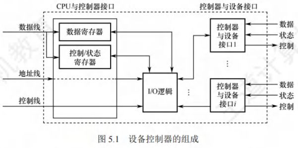

1. 设备控制器与CPU的接口。用于实现CPU与设备控制器之间的通信。该接口有三类信号线：数据线、地址线和控制线。数据线传送的是读/写数据、控制信息和状态信息；地址线传送的是要访问I/O接口中的寄存器编号；控制线传送的是读/写等控制信号。
2. 设备控制器与设备的接口。一个设备控制器可以连接一个或多个设备，因此控制器中有一个或多个设备接口。每个接口都可传输数据、控制和状态三种类型的信号。
3. I/O逻辑。用于实现对设备的控制。它通过一组控制线与CPU交互，对从CPU收到的I/O命令进行译码。CPU启动设备时，将启动命令发送给控制器，同时通过地址线将地址发送给控制器，由控制器的I/O逻辑对地址进行译码，并对所选设备进行控制。

- 设备控制器的主要功能有：

1. 接收和识别命令，如磁盘控制器能接收CPU发来的读、写、查找等命令；
2. 数据交换，包括CPU和控制器之间的数据传输，以及控制器和设备之间的数据传输；
3. 标识和报告设备的状态，以供CPU处理；
4. 地址识别；
5. 数据缓冲；
6. 差错控制。

#### I/O接口的类型

从不同的角度看，I/O接口可以分为不同的类型。

1. 按数据传送方式(外设和接口一侧)，可分为并行接口(一个字节或者一个字的所有位同时传送)和串行接口(一位一位地有序传送)，接口要完成数据格式的转换。
2. 按主机访问I/O设备的控制方式，可分为程序查询接口、中断接口和 DMA 接口等。
3. 按功能选择的灵活性，可分为可编程接口(通过编程改变接口功能)和不可编程接口。

#### I/O端口

I/O端口是指设备控制器中可被CPU直接访问的寄存器，主要有以下三类寄存器。

1. 数据寄存器：用于缓存从设备送来的输入数据，或从CPU送来的输出数据。
2. 状态寄存器：保存设备的执行结果或状态信息，以供CPU读取。
3. 控制寄存器：由CPU写入，以便启动命令或更改设备模式。

I/O端口要想能够被CPU访问，就要对各个端口进行编址，每个端口对应一个端口地址。而对I/O端口的编址方式有与存储器独立编址和统一编址两种，如图5.2所示。

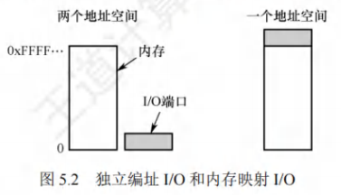

- 独立编址

​	独立编址是指为每个端口分配一个I/O端口号。I/O端口的地址空间与主存地址空间是两个独立的地址空间，它们的范围可以重叠，相同地址可能属于不同的地址空间。普通用户程序不能对端口进行访问，只有操作系统使用特殊的I/O指令才能访问端口。

优点：I/O端口数比主存单元少得多，只需少量地址线，使得I/O端口译码简单，寻址速度更快。使用专用I/O指令，可使程序更加清晰，便于理解和检查。

缺点：I/O指令少，只提供简单的传输操作，所以程序设计的灵活性较差。此外，CPU需要提供两组独立的存储器和设备的读/写控制信号，增加了控制的复杂性。

- 统一编址

​	统一编址又称内存映射I/O，是指将主存地址空间分出一部分给I/O端口进行编址，I/O端口和主存单元在同一地址空间的不同分段中，根据地址范围就能区分访问的是I/O端口还是主存单元，因此无须设置专门的I/O指令，用统一的访存指令就可访问I/O端口。

优点：不需要专门的I/O指令，使得CPU访问I/O的操作更加灵活和方便，还使得端口有较大的编址空间。I/O访问的保护机制可由虚拟存储管理系统来实现，无须专门设置。

缺点：端口地址占用了部分主存地址空间，使主存的可用容量变小。此外，由于在识别I/O端口时全部地址线都需参加译码，使得译码电路更复杂，降低了寻址速度。

### I/O控制方式

​	I/O控制是指控制设备和主机之间的数据传送。在I/O控制方式的发展过程中，始终贯穿着这样一个宗旨：尽量减少CPU对I/O控制的干预，将CPU从繁杂的I/O控制事务中解脱出来，以便其能更多地去执行运算任务。

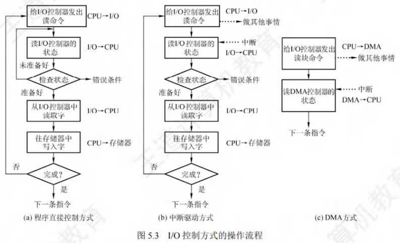

#### 程序直接控制方式

​	CPU对I/O设备的控制采取轮询的I/O方式，又称程序轮询方式。如图5.3(a)所示，CPU向设备控制器发出一条I/O指令，启动从I/O设备读取一个字(节)，然后不断地循环测试设备状态(称为轮询)，直到确定该字(节)已在设备控制器的数据寄存器中。于是CPU将数据寄存器中的数据取出，送入内存的指定单元，这样便完成了一个字(节)的I/O操作。

​	这种方式简单且易于实现，但缺点也很明显。CPU的绝大部分时间都处于等待I/O设备状态的循环测试中，CPU和I/O设备只能串行工作，由于CPU和I/O设备的速度差异很大，导致CPU的利用率相当低。而CPU之所以要不断地测试I/O设备的状态，就是因为在CPU中未采用中断机构，使I/O设备无法向CPU报告它已完成了一个字(节)的输入操作。

#### 中断驱动方式

​	中断驱动方式的思想是：允许I/O设备主动打断CPU的运行并请求服务，从而"解放”CPU，使得CPU向设备控制器发出一条I/O指令后可以继续做其他有用的工作。

​	从设备控制器的角度来看：设备控制器从CPU接收一个读命令，然后从设备读数据。一旦数据读入设备控制器的数据寄存器，便通过控制线给CPU发出中断信号，表示数据已准备好，然后等待CPU请求该数据。设备控制器收到CPU发出的取数据请求后，将数据放到数据总线上，传到CPU的寄存器中。至此，本次I/O操作完成，设备控制器又可开始下一次I/O操作。

​	从CPU的角度来看：当前运行进程发出读命令，该进程将被阻塞，然后保存该进程的上下文，转去执行其他程序。在每个指令周期的末尾，CPU检查中断信号。当有来自设备控制器的中断时，CPU保存当前运行进程的上下文，转去执行中断处理程序以处理该中断请求。这时，CPU从设备控制器读一个字的数据传送到寄存器，并存入主存。中断处理完后解除发出I/O命令的进程的阻塞状态，然后恢复该进程(或其他进程)的上下文，然后继续运行。

​	相比于程序轮询I/O方式，在中断驱动I/O方式中，设备控制器通过中断主动向CPU报告I/O操作已完成，不再需要轮询，在设备准备数据期间，CPU和设备并行工作，CPU的利用率得到明显提升。中断驱动I/O方式的速度仍然受限。

​	中断驱动方式仍有两个明显的问题：

1. 设备与内存之间的数据交换都必须经过CPU中的寄存器；
2. CPU是以字(节)为单位进行干预的，若将这种方式用于块设备的I/O操作，则显然是极其低效的。

#### DMA方式

​	DMA (直接存储器存取)方式的基本思想是，在I/O设备和内存之间开辟直接的数据交换通路，彻底“解放”CPU。DMA方式的特点如下：

1. 基本传送单位是数据块，而不再是字(节)。
2. 所传送的数据，是从设备直接送入内存的，或者相反，而不再经过CPU。
3. 仅在传送一个或多个数据块的开始和结束时，才需要CPU干预。

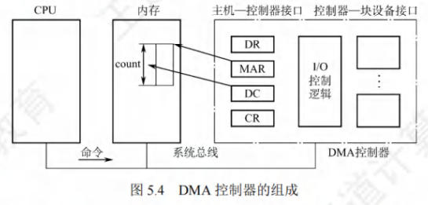

​	为了实现主机和控制器之间直接交换成块的数据，须在 DMA控制器中设置如下 4 类寄存器：

1. 命令/状态寄存器(CR)。接收从CPU发来的I/O命令、有关控制信息，或设备的状态。
2. 内存地址寄存器(MAR)。在输入时，它存放将数据从设备传送到内存的起始目标地址：在输出时，它存放由内存到设备的内存源地址。
3. 数据寄存器(DR)。暂存从设备到内存或从内存到设备的数据。
4. 数据计数器(DC)。存放本次要传送的字(节)数。

​	DMA方式的工作过程是：CPU接收到设备的DMA请求时，它向DMA控制器发出一条命令，同时设置MAR和DC初值，启动DMA控制器，然后继续其他工作。之后CPU就将I/O控制权交给DMA控制器，由DMA控制器负责数据传送。DMA控制器直接与内存交互，每次传送一个字，这个过程不需要CPU参与。整个数据传送结束后，DMA 控制器向CPU发送一个中断信号。因此只有在传送开始和结束时才需要CPU的参与。

​	DMA 方式的优点：数据传输以“块”为单位，CPU介入的频率进一步降低；数据传送不再经过CPU的寄存器，CPU和设备的并行操作程度得到了进一步提升。

#### 通道控制方式

​	I/O通道是一种特殊的处理机，它可执行一系列通道指令。设置通道后，CPU只需向通道发送一条I/O指令，指明通道程序在内存中的位置和要访问的I/O设备，通道收到该指令后，执行通道程序，完成规定的I/O任务后，向CPU发出中断请求。通道方式可以实现CPU、通道和I/O设备三者的并行工作，从而更有效地提高整个系统的资源利用率。

​	通道与一般处理机的区别是：通道指令的类型单一，没有自己的内存，通道所执行的通道程序是放在主机的内存中的，也就是说通道与CPU共享内存。

​	通道与 DMA 方式的区别是：DMA 方式需要CPU来控制传输的数据块大小、传输的内存位置，而通道方式中这些信息是由通道控制的。另外，每个DMA控制器对应一台设备与内存传递数据，而一个通道可以控制多台设备与内存的数据交换。

### I/O软件层次结构

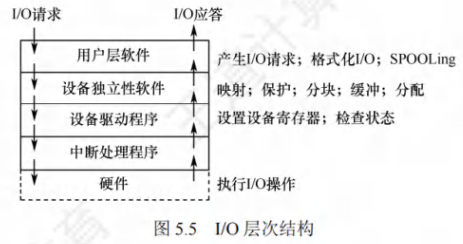

​	为使复杂的I/O软件能具有清晰的结构、良好的可移植性和易适应性，目前普遍采用层次式结构的I/O软件。将系统中的设备管理模块分为若干层次，每层都是利用其下层提供的服务，完成输入/输出功能中的某些子功能，并屏蔽这些功能实现的细节，向高层提供服务。在层次式结构的I/O软件中，只要层次间的接口不变，对某一层次中的软件的修改都不会引起其下层或高层代码的变更，仅最低层才涉及硬件的具体特性。

​	整个I/O软件可以视为具有 4 个层次的系统结构，各层次及其功能如下：

- 用户层软件

​	实现与用户交互的接口，用户可直接调用在用户层提供的、与I/O操作有关的库函数，对设备进行操作。通常大部分的I/O软件都在操作系统内核，但仍有一小部分在用户层，包括与用户程序链接在一起的库函数。用户层I/O软件必须通过一组系统调用来获取操作系统服务。

- 设备独立性软件

​	用于实现用户程序与设备驱动器的统一接口、设备命名、设备保护以及设备的分配与释放等，同时为设备管理和数据传送提供必要的存储空间。设备独立性也称设备无关性，其含义是指应用程序所用的设备不局限于某个具体的物理设备。为实现设备独立性而引入了逻辑设备和物理设备这两个概念。在应用程序中，使用逻辑设备名来请求使用某类设备；而在系统实际执行时，必须将逻辑设备名映射成物理设备名。

​	使用逻辑设备名的好处是：

1. 增加设备分配的灵活性；
2. 易于实现I/O重定向，所谓I/O重定向，是指用于I/O操作的设备可以更换(重定向)，而不必改变应用程序。

​	为了实现设备独立性，必须再在驱动程序之上设置一层设备独立性软件。设备独立性软件的主要功能可分为以下两个方面。

1. 执行所有设备的公有操作，包括：对设备的分配与回收；将逻辑设备名映射为物理设备名；对设备进行保护，禁止用户直接访问设备；缓冲管理；差错控制：提供独立于设备的大小统一的逻辑块，屏蔽设备之间信息交换单位大小和传输速率的差异。
2. 向用户层(或文件层)提供统一接口。无论何种设备，它们向用户所提供的接口应是相同的。例如，对各种设备的读/写操作，在应用程序中都统一使用read/write命令等。

- 设备驱动程序

​	与硬件直接相关，负责具体实现系统对设备发出的操作指令，驱动I/O设备工作的驱动程序。通常，每类设备配置一个设备驱动程序，它是I/O进程与设备控制器之间的通信程序，通常以进程的形式存在。设备驱动程序向上层用户程序提供一组标准接口，设备具体的差别被设备驱动程序所封装，用于接收上层软件发来的抽象I/O要求，如 read 和 write命令，转换为具体要求后，发送给设备控制器，控制I/O设备工作；它也将由设备控制器发来的信号传送给上层软件，从而为I/O内核子系统隐藏设备控制器之间的差异。

- 中断处理程序

​	用于保存被中断进程的CPU环境，转入相应的中断处理程序进行处理，处理完毕再恢复被中断进程的现场后，返回到被中断进程。

​	中断处理层的主要任务有：进行进程上下文的切换，对处理中断信号源进行测试，读取设备状态和修改进程状态等。由于中断处理与硬件紧密相关，对用户而言，应尽量加以屏蔽，因此应放在操作系统的底层，系统的其余部分尽可能少地与之发生联系。

1. 当用户要读取某设备的内容时，通过操作系统提供的read命令接口，这就经过了用户层。
2. 操作系统提供给用户使用的接口一般是统一的通用接口，也就是几乎每个设备都可以响应的统一命令，如read命令，用户发出的read命令，首先经过设备独立层进行解析，然后交往下层。
3. 接下来，不同类型的设备对read命令的行为有所不同，如磁盘接收read命令后的行为与打印机接收read命令后的行为是不同的。因此，需要针对不同的设备，将read命令解析成不同的指令，这就经过了设备驱动层。
4. 命令解析完毕后，需要中断正在运行的进程，转而执行read命令，这就需要中断处理程序。
5. 命令真正抵达硬件设备，硬件设备的控制器按照上层传达的命令操控硬件设备，完成相应的功能。

### 应用程序I/O接口

#### I/O接口的分类

在I/O系统与高层之间的接口中，根据设备类型的不同，又进一步分为若干类。

- 字符设备接口

​	字符设备是指数据的存取和传输是以字符为单位的设备，如键盘、打印机等。基本特征是传输速率较低、不可寻址，并且在输入/输出时通常采用中断驱动方式。

​	get和put操作。由于字符设备不可寻址，只能采取顺序存取方式，通常为字符设备建立一个字符缓冲区，用户程序通过 get 操作从缓冲区获取字符，通过 put操作将字符输出到缓冲区。

​	in-control 指令。字符设备类型繁多，差异甚大，因此在接口中提供一种通用的 in-control 指令来处理它们(包含了许多参数，每个参数表示一个与具体设备相关的特定功能)。

​	字符设备都属于独占设备，为此接口中还需要提供打开和关闭操作，以实现互斥共享。

- 块设备接口

​	块设备是指数据的存取和传输是以数据块为单位的设备，典型的块设备是磁盘。基本特征是传输速率较高、可寻址。磁盘设备的I/O常采用 DMA 方式。

​	隐藏了磁盘的二维结构。在二维结构中，每个扇区的地址需要用磁道号和扇区号来表示。块设备接口将磁盘的所有扇区从 0 到 n-1 依次编号，这样，就将二维结构变为一种线性序列。

​	将抽象命令映射为低层操作。块设备接口支持上层发来的对文件或设备的打开、读、写和关闭等抽象命令，该接口将上述命令映射为设备能识别的较低层的具体操作。

​	内存映射接口通过内存的字节数组来访问磁盘，而不提供读/写磁盘操作。映射文件到内存的系统调用返回包含文件副本的一个虚拟内存地址。只在需要访问内存映像时，才由虚拟存储器实际调页。内存映射文件的访问如同内存读/写一样简单，极大地方便了程序员。

- 网络设备接口

现代操作系统都提供面向网络的功能，因此还需要提供相应的网络软件和网络通信接口，使计算机能够通过网络与网络上的其他计算机进行通信或上网浏览。许多操作系统提供的网络I/O接口为网络套接字接口，套接字接口的系统调用使应用程序创建的本地套接字连接到远程应用程序创建的套接字，通过此连接发送和接收数据。

#### 阻塞I/O和非阻塞I/O

​	操作系统的I/O接口还涉及两种模式：阻塞和非阻塞。

​	阻塞I/O是指当用户进程调用I/O操作时，进程就被阻塞，并移到阻塞队列，I/O操作完成后，进程才被唤醒，移到就绪队列。当进程恢复执行时，它收到系统调用的返回值，并继续处理数据。大多数操作系统提供的I/O接口都是采用阻塞I/O。例如，你和女友去奶茶店买奶茶，点完单后，因为不知道奶茶什么时候做好，所以只能一直等待，其他什么事也不能干。

优点：操作简单，实现难度低，适合并发量小的应用开发。

缺点：I/O执行阶段进程会一直阻塞下去。

​	非阻塞I/O是指当用户进程调用I/O操作时，不阻塞该进程，但进程需要不断询问I/O操作是否完成，在I/O执行阶段，进程还可以做其他事情。当问到I/O操作完成后，系统将数据从内核复制到用户空间，进程继续处理数据。例如，你和女友去奶茶店买奶茶，汲取了上次的教训，点完单后顺便逛逛商场，由于担心错过取餐，所以每隔一段时间就过来询问服务员。

优点：进程在等待I/O期间不会阻塞，可以做其他事情，适合并发量大的应用开发。

缺点：轮询方式询问I/O结果，会占用CPU的时间。

## 设备独立性软件

### 设备独立性软件

​	也称与设备无关的软件，是I/O系统的最高层软件，它的下层是设备驱动程序，其界限因操作系统和设备的不同而有所差异。比如，一些本应由设备独立性软件实现的功能，也可能放在设备驱动程序中实现。这样的差异主要是出于对操作系统、设备独立性软件和设备驱动程序运行效率等多方面因素的权衡。总体而言，设备独立性软件包括执行所有设备公有操作的软件。

### 高速缓存与缓冲区

#### 磁盘高速缓存(Disk Cache)

​	操作系统中使用磁盘高速缓存技术来提高磁盘的I/O速度，对访问高速缓存要比访问原始磁盘数据更为高效。例如，正在运行进程的数据既存储在磁盘上，又存储在物理内存上，也被复制到 CPU 的二级和一级高速缓存中。不过，磁盘高速缓存技术不同于通常意义下的介于 CPU 与内存之间的小容量高速存储器，而是指利用内存中的存储空间来暂存从磁盘中读出的一系列盘块中的信息。因此，磁盘高速缓存逻辑上属于磁盘，物理上则是驻留在内存中的盘块。磁盘高速缓存在内存中分为两种形式：一种是在内存中开辟一个单独的空间作为缓存区，大小固定；另一种是将未利用的内存空间作为一个缓冲池，供请求分页系统和磁盘I/O时共享。

#### 缓冲区(Buffer)

​	引入缓冲区的目的主要如下：

1. 缓和CPU与I/O设备间速度不匹配的矛盾。
2. 减少对CPU的中断频率，放宽对CPU中断响应时间的限制。
3. 解决基本数据单元大小(数据粒度)不匹配的问题。
4. 提高CPU和I/O设备之间的并行性。

​	缓冲区的实现方法如下：

1. 采用硬件缓冲器，但由于成本太高，除一些关键部位外，一般不采用硬件缓冲器。
2. 利用内存作为缓冲区，本节要介绍的正是由内存组成的缓冲区。

- 单缓冲

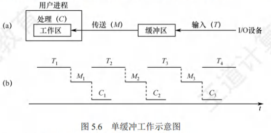

​	每当用户进程发出一个I/O请求，操作系统便在内存中为之分配一个缓冲区。通常，一个缓冲区的大小就是一个块。如图5.6所示，在块设备输入时，假定从设备将一块数据输入到缓冲区的时间为T，操作系统将该缓冲区中的数据传送到工作区的时间为M，而CPU对这一块数据进行处理的时间为C。注意，必须等缓冲区冲满后才能从缓冲区中取出数据。

- 双缓冲

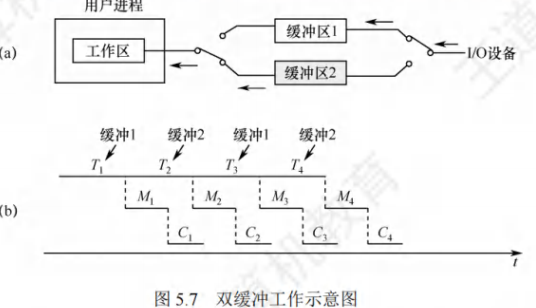

​	为了加快输入和输出速度，提高设备利用率，引入了双缓冲机制，也称缓冲对换。如图 5.7所示，当设备输入数据时，先将数据送入缓冲区1，装满后便转向缓冲区2。此时，操作系统可以从缓冲区1中取出数据，送入用户进程，并由CPU对数据进行处理。当缓冲区1中取出的数据处理完后，若缓冲区2已冲满，则操作系统又从缓冲区2中取出数据送入用户进程处理，而设备又可以开始将数据送入缓冲区1。双缓冲机制提高了设备和CPU的并行程度。

- 循环缓冲

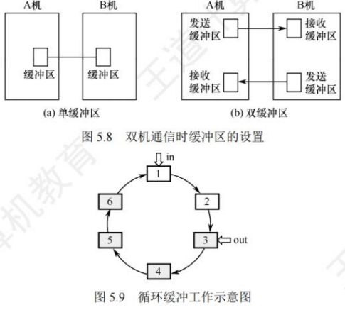

​	在双缓冲机制中，当输入与输出的速度基本匹配时，能取得较好的效果。但若两者的速度相差甚远，则双缓冲区的效果不会太理想。为此，又引入了多缓冲机制，让多个缓冲区组成循环缓冲区的形式，如图5.9所示，灰色表示已装满数据的缓冲区，白色表示空缓冲区。

​	循环缓冲包含多个大小相等的缓冲区，每个缓冲区中有一个链接指针指向下一个缓冲区，最后一个缓冲区指针指向第一个缓冲区，多个缓冲区链接成一个循环队列。循环缓冲中还需设置in和out两个指针，in指向第一个可以输入数据的空缓冲区，out指向第一个可以提取数据的满缓冲区。输入/输出时，in和out指针沿链接方向循环移动。

- 缓冲池

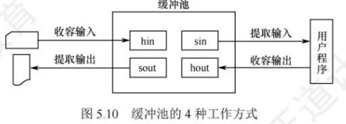

​	相比于缓冲区(仅是一块内存空间)，缓冲池是包含一个用于管理自身的数据结构和一组操作函数的管理机制，用于管理多个缓冲区。缓冲池可供多个进程共享使用。

​	缓冲池由多个系统公用的缓冲区组成，缓冲区按其使用状况可以分为：

1. 空缓冲队列，由空缓冲区链接而成的队列；
2. 输入队列，由装满输入数据的缓冲区链接而成的队列；
3. 输出队列，由装满输出数据的缓冲区所链接成的队列。

​	此外还应具有 4 种工作缓冲区：

1. 用于收容输入数据的工作缓冲区(hin)
2. 用于提取输入数据的工作缓冲区(sin)
3. 用于收容输出数据的工作缓冲区(hout)
4. 用于提取输出数据的工作缓冲区(sout)

​	缓冲池中的缓冲区有以下4种工作方式。

1. 收容输入。输入进程需要输入数据时，从空缓冲队列的队首摘下一个空缓冲区，作为收容输入工作缓冲区，然后将数据输入其中，装满后再将它挂到输入队列的队尾。
2. 提取输入。计算进程需要输入数据时，从输入队列的队首取得一个缓冲区，作为提取输入工作缓冲区，从中提取数据，用完该数据后将它挂到空缓冲队列的列尾。
3. 收容输出。计算进程需要输出数据时，从空缓冲队列的队首取得一个空缓冲区，作为收容输出工作缓冲区，当其中装满数据后，再将它挂到输出队列的队尾。
4. 提取输出。输出进程需要输出数据时，从输出队列的队首取得一个装满输出数据的缓冲区，作为提取输出工作缓冲区，当数据提取完后，再将它挂到空缓冲队列的队尾。

​	对于循环缓冲和缓冲池，只是定性地介绍它们的机理，而不去定量研究它们平均处理一块数据所需要的时间。而对于单缓冲和双缓冲，我们只要按照上面的模板分析，就可以解决任何单缓冲和双缓冲情况下数据块处理时间的问题，以不变应万变。

#### 高速缓存与缓冲区的对比

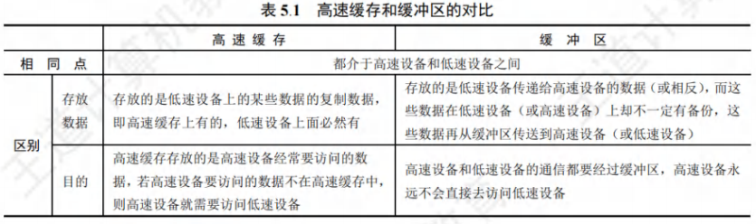

### 设备分配与回收

#### 设备分配概述

​	设备分配是指根据用户的I/O请求分配所需的设备。分配的总原则是充分发挥设备的使用效率，尽可能地让设备忙碌，又要避免由于不合理的分配方法造成进程死锁。

#### 设备分配的数据结构

​	在系统中，可能存在多个通道，每个通道可以连接多个控制器，每个控制器可以连接多个物理设备。设备分配的数据结构要能体现出这种从属关系，各数据结构的介绍如下。

- 设备控制表(DCT)

​	系统为每个设备配置一张 DCT，表中的表项就是设备的各个属性。

在DCT中，应该有下列字段：

1. 设备类型：表示设备类型，如打印机、扫描仪、键盘等。

2. 设备标识符：即物理设备名，每个设备在系统中的物理设备名是唯一的。

3. 设备状态：表示当前设备的状态(忙/闲)。

4. 指向控制器表的指针：每个设备由一个控制器控制，该指针指向对应的控制器表。

5. 重复执行次数或时间：重复执行次数达到规定值仍不成功时，才认为此次I/O失败。

6. 设备队列的队首指针：指向正在等待该设备的进程队列(由进程 PCB 组成)的队首。

当某个进程释放某个设备，且无其他进程请求该设备时，系统将该设备DCT中的设备状态改为空闲，即可实现“设备回收”。

- 控制器控制表(COCT)

​	每个设备控制器都对应一张COCT。操作系统根据 COCT 的信息对控制器进行操作和管理。每个控制器由一个通道控制，通过表项“与控制器连接的通道表指针”可以找到相应通道的信息。

- 通道控制表(CHCT)

每个通道都对应一张CHCT。操作系统根据CHCT的信息对通道进行操作和管理。一个通道可为多个控制器服务，通过表项“与通道连接的控制器表首址”可以找到该通道管理的所有控制器的信息。

- 系统设备表(SDT)

整个系统只有一张SDT。它记录已连接到系统中的所有物理设备的情况，每个物理设备对应一个表目。

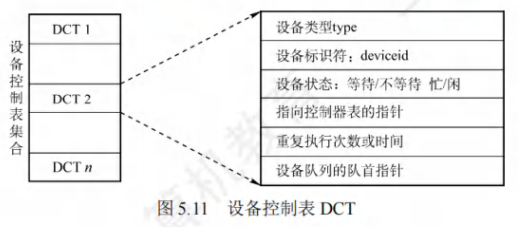

​	在多道程序系统中，进程数多于资源数，因此要有一套合理的分配原则，主要考虑的因素有设备的固有属性、设备的分配算法、设备分配的安全性以及设备的独立性。

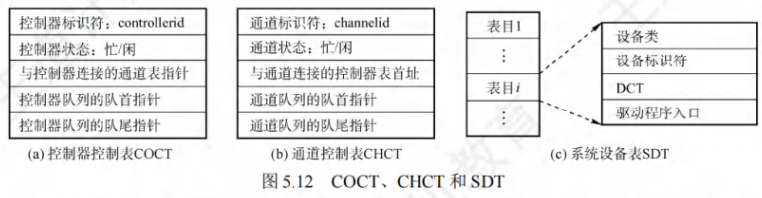

#### 设备分配时考虑的因素

- 设备的固有属性

设备的固有属性可分成三种，对它们应采取不同的分配策略：

1. 独占设备：将它分配给某个进程后，便由该进程独占，直至进程完成或释放该设备。
2. 共享设备：可将它同时分配给多个进程，需要合理调度各个进程访问该设备的先后次序。
3. 虚拟设备：虚拟设备属于可共享设备，可将它同时分配给多个进程使用。

- 设备分配算法

针对设备分配，通常只采用以下两种分配算法：

1. FCFS 算法。该算法根据各个进程对某个设备提出请求的先后次序，将这些进程排成一个设备请求队列，设备分配程序总是将设备首先分配给队首进程。
2. 最高优先级优先算法。在用该算法形成设备队列时，优先级高的进程排在设备队列前面，而对于优先级相同的I/O请求，则按FCFS原则排队。

- 设备分配中的安全性

设备分配中的安全性是指在设备分配中应防止发生进程死锁。

1. 安全分配方式。每当进程发出I/O请求后，便进入阻塞态，直到其I/O操作完成时才被唤醒。这样，进程一旦获得某种设备后便会阻塞，不能再请求任何资源，而在它阻塞时也不保持任何资源。其优点是设备分配安全，缺点是CPU和I/O设备是串行工作的。
2. 不安全分配方式。进程在发出I/O请求后仍继续运行，需要时又会发出第二个、第三个I/O请求等。仅当进程所请求的设备已被另一进程占用时，才进入阻塞态。优点是一个进程可同时操作多个设备，使进程推进迅速；缺点是有可能造成死锁。

#### 设备分配的步骤

下面以独占设备为例，介绍设备分配的过程。

1. 分配设备。首先根据I/O请求中的物理设备名，查找SDT，从中找出该设备的DCT，再据根据DCT中的设备状态字段，可知该设备的状态。若忙，则将进程PCB挂到设备等待状队列中；若不忙，则根据一定的策略将设备分配给该进程。
2. 分配控制器。设备分配后，根据DCT找到COCT，查询控制器的状态。若忙，则将进程PCB 挂到控制器等待队列中；若不忙，则将控制器分配给该进程。
3. 分配通道。控制器分配后，根据COCT找到CHCT，查询通道的状态。若忙，则将进程PCB挂到通道等待队列中；若不忙，则将通道分配给该进程。只有设备、控制器和通道都分配成功时，这次的设备分配才算成功，之后便可启动设备进行数据传送。

​	在上面的例子中，进程是以物理设备名提出I/O请求的。若指定设备已分配给其他进程，则该进程分配失败；或者说上面的设备分配程序不具有设备无关性。为了获得设备的独立性，进程应使用逻辑设备名。这样，系统首先从 SDT中找出第一个该类设备的DCT。若该设备忙，则查找第二个该类设备的DCT，仅当所有该类设备都忙时，才将进程挂到该类设备的等待队列上。而只要有一个该类设备可用，系统便进入进一步的分配操作。

#### 逻辑设备名到物理设备名的映射

​	为了实现设备的独立性，进程中应使用逻辑设备名来请求某类设备。但是，系统只识别物理设备名，因此在系统中需要配置一张逻辑设备表，用于将逻辑设备名映射为物理设备名。

逻辑设备表(Logical Unit Table，LUT)的每个表项中包含3项内容：逻辑设备名、物理设备名和设备驱动程序的入口地址。当进程用逻辑设备名来请求分配设备时，系统会为它分配一台相应的物理设备，并在LUT中建立一个表目，填上相应的信息，当以后进程再利用该逻辑设备名请求I/O操作时，系统通过查找LUT 来寻找对应的物理设备及其驱动程序。

在系统中，可采取两种方式设置逻辑设备表：

1. 整个系统中只设置一张LUT。如图5.13(a)所示。所有进程的设备分配情况都记录在同一张 LUT 中，这就要求所有用户不能使用相同的逻辑设备名，主要适用于单用户系统。
2. 为每个用户设置一张 LUT。如图 5.13(b)所示。系统为每个用户设置一张LUT，同时在多用户系统中都配置系统设备表。因此，不同用户可以使用相同的逻辑设备名。

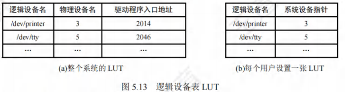

### SPOOLing技术(假脱机技术)

​	为了缓和CPU的高速性与I/O设备的低速性之间的矛盾，引入了假脱机技术，它是操作系统中采用的一项将独占设备改造成共享设备的技术。该技术利用专门的外围控制机，先将低速I/O设备上的数据传送到高速磁盘上，或者相反。当CPU需要输入数据时，便可直接从磁盘中读取数据；反之，当CPU需要输出数据时，也能以很快的速度将数据先输出到磁盘上。引入多道程序技术后，系统便可利用程序来模拟脱机输入/输出时的外围控制机，在主机的直接控制下实现脱机输入/输出功能。SPOOLing 系统的组成如图 5.14 所示。

#### SPOOLing技术的特点

- 输入井和输出井

​	在磁盘上开辟出的两个存储区域。输入井模拟脱机输入时的磁盘，用于收容I/O设备输入的数据。输出井模拟脱机输出时的磁盘，用于收容用户程序的输出数据。一个进程的输入(或输出)数据保存为一个文件，所有进程的输入(或输出)文件链接成一个输入(或输出)队列。

- 输入缓冲区和输出缓冲区

​	在内存中开辟的两个缓冲区。输入缓冲区用于暂存由输入设备送来的数据，以后再传送到输入井。输出缓冲区用于暂存从输出井送来的数据，以后再传送到输出设备。

- 输入进程和输出进程输入进程

​	用于模拟脱机输入时的外围控制机，将用户要求的数据从输入设备传送到输入缓冲区，再存放到输入井中。当CPU需要输入数据时，直接从输入井中读入内存。输出进程用于模拟脱机输出时的外围控制机，将用户要求输入的数据从内存传送到输出井，待输出设备空闲时，再将输出井中的数据经输出缓冲区输出至输出设备。

- 井管理程序

​	用于控制作业与磁盘井之间信息的交换。

​	打印机是典型的独占设备，利用SPOOLing技术可将它改造为一台可供多个用户共享的打印设备。当多个用户进程发出打印输出请求时， SPOOLing系统同意它们的请求，但并不真正立即将打印机分配给它们，而由假脱机管理进程为每个进程做如下两项工作：

1. 在磁盘缓冲区中为进程申请一个空闲盘块，并将要打印的数据送入其中暂存。
2. 为用户进程申请一张空白的用户请求打印表，并将用户的打印要求填入其中，再将该表挂到假脱机文件队列上。

​	对每个用户进程而言，系统并非即时执行真实的打印操作，而只是即时将数据输出到缓冲区，这时的数据并未被真正打印，而只让用户感觉系统已为它打印，真正的打印操作是在打印机空闲且该打印任务在等待队列中已排到队首时进行的。以上过程用户是不可见的。虽然系统中只有一台打印机，但是当进程提出打印请求时，系统都在输出井中为其分配一个缓冲区(相当于分配一台逻辑设备)，使每个进程都觉得自己正在独占一台打印机，从而实现对打印机的共享。

- SPOOLing 系统的特点

1. 提高了I/O速度，将对低速I/O设备执行的操作演变为对磁盘缓冲区中数据的存取操作，如同脱机输入/输出一样，缓和了CPU和低速I/O设备之间速度不匹配的矛盾；
2. 将独占设备改造为共享设备，在假脱机打印机系统中，实际上并没有为任何进程分配设备；
3. 实现了虚拟设备功能，对每个进程而言，它们都认为自己独占了一台设备。

​	SPOOLing技术是一种以空间换时间的技术，我们很容易理解它牺牲了空间，因为它开辟了磁盘上的空间作为输入井和输出井。

​	磁盘是一种高速设备，在与内存交换数据的速度上优于打印机、键盘、鼠标等中低速设备。若没有SPOOLing技术， CPU要向打印机输出要打印的数据，打印机的打印速度比较慢， CPU就必须迁就打印机，在打印机将数据打印完后才能继续做其他的工作，浪费了CPU的不少时间。在SPOOLing技术下， CPU要打印机打印的数据可以先输出到磁盘的输出井中(这个过程由假脱机进程控制)，然后做其他的事情。若打印机此时被占用，则SPOOLing 系统就会将这个打印请求挂到等待队列上，待打印机有空时再将数据打印出来。向磁盘输出数据的速度比向打印机输出数据的速度快，因此就节省了时间。

### 设备驱动程序接口

​	设备驱动程序是I/O系统的上层与设备控制器之间的通信程序，其主要任务是接收上层应用发来的抽象I/O请求，如read或write命令，将它们转换为具体要求后发送给设备控制器，进而使其启动设备去执行任务；反之，它也将设备控制器发来的信号传送给上层应用。

#### 设备驱动程序的功能

为了实现上层应用与设备控制器之间的通信，设备驱动程序应具有以下功能：

1. 接收由上层软件发来的命令和参数，并将抽象要求转换为与设备相关的具体要求。例如，将抽象要求中的盘块号转换为磁盘的盘面号、磁道号及扇区号。
2. 检查用户I/O请求的合法性，了解设备的工作状态，传递与设备操作有关的参数，设置设备的工作方式。
3. 发出I/O命令，若设备空闲，则立即启动它，完成指定的I/O操作；若设备忙，则将请求者的 PCB 挂到设备队列上等待。
4. 及时响应由设备控制器发来的中断请求，并根据其中断类型，调用相应的中断处理程序进行处理。

#### 设备驱动程序的特点

​	相比于普通的应用程序和系统程序，设备驱动程序具有以下差异：

1. 设备驱动程序将抽象的I/O请求转换成具体的I/O操作后，传送给设备控制器，并将设备控制器中记录的设备状态和I/O操作的完成情况及时地反馈给请求进程。
2. 设备驱动程序与设备采用的I/O控制方式紧密相关，常用的I/O控制方式是中断驱动方式和DMA方式。
3. 设备驱动程序与硬件密切相关，对于不同类型的设备，应配置不同的设备驱动程序。
4. 由于设备驱动程序与硬件紧密相关，目前很多设备驱动程序的基本部分已固化在ROM中。
5. 设备驱动程序应允许同时多次调用执行。

​	为了使所有的设备驱动程序都有统一的接口，一方面，要求每个设备驱动程序与操作系统之间都有相同或相近的接口，以便更容易地添加一个新的设备驱动程序，同时更容易地编制设备驱动程序；另一方面，要将抽象的设备名转换为具体的物理设备名，并且进一步找到相应的设备驱动程序入口。此外，还应对设备进行保护，防止无权访问的用户使用设备。

## 磁盘和固态硬盘

### 磁盘

​	磁盘(Disk)是表面涂有磁性物质的物理盘片，通过一个称为磁头的导体线圈从磁盘存取数据。在读/写操作期间，磁头固定，磁盘在下面高速旋转。磁盘盘面上的数据存储在一组同心圆中，称为磁道。每个磁道与磁头一样宽，一个盘面有上千个磁道。磁道又划分为几百个扇区，每个扇区固定存储大小(如1KB)，一个扇区称为一个盘块。相邻磁道及相邻扇区间通过一定的间隙分隔开，以避免精度错误。注意，由于扇区按固定圆心角度划分，所以密度从最外道向里道增加，磁盘的存储能力受限于最内道的最大记录密度。

​	为了提高磁盘的存储容量，充分利用磁盘外层磁道的存储能力，现代磁盘不再将内外磁道划分为相同数目的扇区，而将盘面划分为若干环带，同一环带内的所有磁道具有相同的扇区数，外层环带的磁道拥有较内层环带的磁道更多的扇区。

​	磁盘安装在一个磁盘驱动器中，它由磁头臂、用于旋转磁盘的转轴和用于数据输入/输出的电子设备组成。多个盘片垂直堆叠，组成磁盘组，每个盘面对应一个磁头，所有磁头固定在一起，与磁盘中心的距离相同且只能“共进退”。所有盘片上相对位置相同的磁道组成柱面。扇区是磁盘可寻址的最小单位，磁盘上能存储的物理块数目由扇区数、磁道数及磁盘面数决定，磁盘地址用“柱面号·盘面号·扇区号”表示。

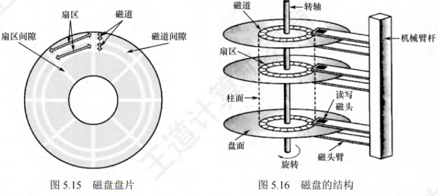

​	磁盘按不同的方式可分为若干类型：磁头相对于盘片的径向方向固定的称为固定头磁盘，这种磁盘中的每个磁道有一个磁头。磁头可移动的称为活动头磁盘，磁头臂可来回伸缩定位磁道。盘片永久固定在磁盘驱动器内的称为固定盘磁盘。盘片可移动和替换的称为可换盘磁盘。操作系统中几乎每介绍一类资源及其管理时，都要涉及一类调度算法。用户访问文件，需要操作系统的服务，文件实际上存储在磁盘中，操作系统接收用户的命令后，经过一系列的检验访问权限和寻址过程后，最终都会到达磁盘，控制磁盘将相应的数据信息读出或修改。当有多个请求同时到达时，操作系统就要决定先为哪个请求服务，这就是磁盘调度算法要解决的问题。

### 磁盘的管理

#### 磁盘初始化

​	一个新的磁盘只是一个磁性记录材料的空白盘。在磁盘可以存储数据之前，必须将它分成扇区，以便磁盘控制器能够进行读/写操作，这个过程称为低级格式化(或称物理格式化)。每个扇区通常由头部、数据区域和尾部组成。头部和尾部包含了一些磁盘控制器的使用信息，其中利用磁道号、磁头号和扇区号来标志一个扇区，利用CRC字段对扇区进行校验。大多数磁盘在工厂时作为制造过程的一部分就已低级格式化，这种格式化能够让制造商测试磁盘，并且初始化逻辑块号到无损磁盘扇区的映射。对于许多磁盘，当磁盘控制器低级格式化时，还能指定在头部和尾部之间留下多长的数据区，通常选择256或512字节等。

#### 分区

​	在可以使用磁盘存储文件之前，还要完成两个步骤。

1. 将磁盘分区(我们熟悉的 C盘、D盘等形式的分区)，每个分区由一个或多个柱面组成，每个分区的起始扇区和大小都记录在磁盘主引导记录的分区表中。
2. 对物理分区进行逻辑格式化(也称高级格式化)，将初始文件系统数据结构存储到磁盘上，这些数据结构包括空闲空间和已分配空间，以及一个初始为空的目录，建立根目录、对保存空闲磁盘块信息的数据结构进行初始化。

​	因扇区的单位太小，为了提高效率，操作系统将多个相邻的扇区组合在一起，形成一簇(在Linux 中称为块)。为了更高效地管理磁盘，一簇只能存放一个文件的内容，文件所占用的空间只能是簇的整数倍；如果文件大小小于一簇(甚至是0字节)，也要占用一簇的空间。

#### 引导块

​	计算机启动时需要运行一个初始化程序(自举程序)，它初始化 CPU、寄存器、设备控制器和内存等，接着启动操作系统。为此，自举程序找到磁盘上的操作系统内核，将它加载到内存，并转到起始地址，从而开始操作系统的运行。

​	自举程序通常存放在ROM中，为了避免改变自举代码而需要改变 ROM 硬件的问题，通常只在 ROM 中保留很小的自举装入程序，而将完整功能的引导程序保存在磁盘的启动块上，启动块位于磁盘的固定位置。具有启动分区的磁盘称为启动磁盘或系统磁盘。

​	引导 ROM 中的代码指示磁盘控制器将引导块读入内存，然后开始执行，它可以从非固定的磁盘位置加载整个操作系统，并且开始运行操作系统。下面以Windows为例来分析引导过程。Windows 允许将磁盘分为多个分区，有一个分区为引导分区，它包含操作系统和设备驱动程序。Windows系统将引导代码存储在磁盘的第 0 号扇区，它称为主引导记录(MBR)。引导首先运行ROM 中的代码，这个代码指示系统从 MBR 中读取引导代码。除了包含引导代码，MBR 还包含一个磁盘分区表和一个标志(以指示从哪个分区引导系统)，如图5.17所示。当系统找到引导分区时，读取分区的第一个扇区，称为引导扇区，并继续余下的引导过程，包括加载各种系统服务。

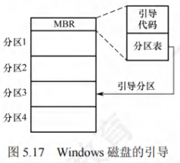

#### 坏块

​	由于磁盘有移动部件且容错能力弱，因此容易导致一个或多个扇区损坏。部分磁盘甚至在出厂时就有坏块。根据所用的磁盘和控制器，对这些块有多种处理方式。

​	对于简单磁盘，如采用IDE控制器的磁盘，坏块可手动处理，如MS-DOS的Format命令执行逻辑格式化时会扫描磁盘以检查坏块。坏块在 FAT 表上会标明，因此程序不会使用它们。

​	对于复杂的磁盘，控制器维护磁盘内的坏块列表。这个列表在出厂低级格式化时就已初始化，并在磁盘的使用过程中不断更新。低级格式化将一些块保留作为备用，操作系统看不到这些块。控制器可以采用备用块来逻辑地替代坏块，这种方案称为扇区备用。

​	对坏块的处理实质上就是用某种机制使系统不去使用坏块。

### 磁盘调度算法

#### 磁盘的存取时间

​	一次磁盘读/写操作的时间由寻找(寻道)时间、旋转延迟时间和传输时间决定。

- 寻道时间T

​	活动头磁盘在读/写信息前，将磁头移动到目的磁道所需的时间。这个时间除跨越 n 条磁道的时间外，还包括启动磁头臂的时间s，则
$$
T_s = m \times n + s
$$
式中， m是与磁盘驱动器速度有关的常数，约为0.2ms，磁头臂的启动时间约为2ms。

- 旋转延迟时间T

​	磁头定位到要读/写扇区所需的时间，设磁盘的旋转速度为r，则
$$
T_r = \frac{1}{2r}
$$
​	对于硬盘，典型的旋转速度为5400转/分，相当于一周11.1ms，则T~r~为5.55ms；对于软盘，其旋转速度为300-600转/分，则T为50-100ms。

- 传输时间T

​	从磁盘读出或向磁盘写入数据所需的时间，这个时间取决于每次所读/写的字节数b和磁盘的旋转速度r，则
$$
T_t = \frac{b}{rN}
$$
式中，r为磁盘每秒的转数，N 为一个磁道上的字节数。

​	总平均存取时间T可以表示为
$$
T_a = T_s +\frac{1}{2r}+\frac{b}{rN}
$$
​	在磁盘的存取时间中，寻道时间占大头，它与磁盘调度算法密切相关；而延迟时间和传输时间都与磁盘旋转速度线性相关,所以转速是磁盘性能的一个非常重要的硬件参数,也很难从操作系统层面进行优化。因此,磁盘调度的主要目标是减少磁盘的平均寻道时间。

#### 磁盘调度算法

- 先来先服务算法FCFS
- 最短寻道时间优先算法SSTF
- 扫描算法SCAN
- 循环扫描算法C_SCAN

#### 减少延迟时间的方法

​	除减少寻道时间外，减少延迟时间也是提高磁盘传输效率的重要因素。

​	磁盘是连续自转设备，磁头读入一个扇区后，需要经过短暂的处理时间，才能开始读入下一个扇区。若逻辑上相邻的块在物理上也相邻，则读入几个连续的逻辑块可能需要很长的延迟时间。为此，可对一个盘面的扇区进行交替编号[假设盘面有8个扇区，如图5.24(b)所示]，即让逻辑上相邻的块物理上保持一定的间隔，于是读入多个连续块时能够减少延迟时间。

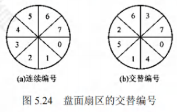

​	此外，由于磁盘的所有盘面是同步转动的，逻辑块在相同柱面上也是按盘面号连续存放的，即按0号盘0号扇区、0号盘1号扇区……0号盘7号扇区、1号盘0号扇区……1号盘7号扇区、2号盘0号扇区……的顺序存放。要读入不同盘面上的连续块，在读完0号盘7号扇区后，还需要一段处理时间，所以当磁头首次划过 1 号盘 0 号扇区(下一次要读的块)时，并不能读取，只能等磁头再次划过该扇区时才能读取。为此，可对不同的盘面进行错位命名[假设有2个盘面，且已采用交替编号，如图 5.25(b)所示]，则读入相邻两个盘面的连续块时也能减少延迟时间。

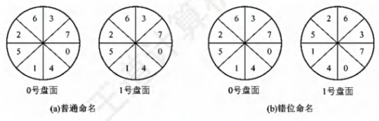

​	在磁盘的存取时间中，寻道时间和延迟时间属于“找”的时间，凡是“找”的时间都可以通过一定的方法优化，但传输时间是磁盘本身性质所决定的，不能通过一定的措施减少。

#### 提高磁盘I/O速度的方法

​	文件的访问速度是衡量文件系统性能最重要的因素，可从以下三个方面来优化：

1. 改进文件的目录结构及检索目录的方法，以减少对目录的查找时间； 
2. 选取好的文件存储结构，以提高对文件的访问速度；
3. 提高磁盘I/O速度，以实现文件中的数据在磁盘和内存之间快速传送。

1. 采用磁盘高速缓存。上节介绍了磁盘高速缓存的概念。
2. 调整磁盘请求顺序。即上面介绍的各种磁盘调度算法。
3. 提前读。在读磁盘当前块时，将下一磁盘块也读入内存缓冲区。
4. 延迟写。仅在缓冲区首部设置延迟写标志，然后释放此缓冲区并将其链入空闲缓冲区链表的尾部，当其他进程申请到此缓冲区时，才真正将缓冲区信息写入磁盘块。
5. 优化物理块的分布。除了上面介绍的扇区编号优化，当文件采用链接方式和索引方式组织时，应尽量将同一个文件的盘块安排在一个磁道上或相邻的磁道上，以减少寻道时间。另外，将若干盘块组成簇，按簇对文件进行分配，也可减少磁头的平均移动距离。
6. 虚拟盘。是指用内存空间去仿真磁盘，又叫RAM盘。常用于存放临时文件。
7. 采用磁盘阵列RAID。由于可采用并行交叉存取，因此能大幅提高磁盘I/O速度。

### 固态硬盘

#### 固态磁盘的特性

​	固态硬盘(Solid State Disk，SSD)是一种基于闪存技术的存储器。它与 U 盘并无本质差别，只是容量更大，存取性能更好。一个SSD由一个或多个闪存芯片和闪存翻译层组成，如图5.26所示。闪存芯片替代传统磁盘中的机械驱动器，而闪存翻译层将来自CPU的逻辑块读/写请求翻译成对底层物理设备的读/写控制信号，因此闪存翻译层相当于扮演了磁盘控制器的角色。

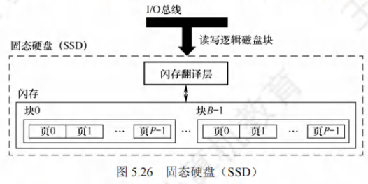

​	在图 5.26 中，一个闪存由B块组成，每块由 P 页组成。通常，页的大小是 512B-4KB，每块由 32-128 页组成，块的大小为 16KB-512KB。数据是以页为单位读/写的。只有在一页所属的块整个被擦除后，才能写这一页。不过，一旦一个块被擦除，块中的每页就都可以直接再写一次。某个块进行了若干重复写后，就会磨损坏，不能再使用。

​	随机写很慢，有两个原因。首先，擦除块比较慢，通常比访问页高一个数量级。其次，如果写操作试图修改一个包含已有数据的页$P_i$，那么这个块中所有含有用数据的页都必须被复制到一个新(擦除过的)块中，然后才能进行对页$P_i$，的写操作。

​	比起传统磁盘，SSD有很多优点，它由半导体存储器构成，没有移动的部件，因此随机访问速度比机械磁盘要快很多，也没有任何机械噪声和震动，能耗更低、抗震性好、安全性高等。随着技术的不断发展，价格也不断下降，SSD有望逐步取代传统机械硬盘。

#### 磨损均衡

​	固态硬盘也有缺点，闪存的擦写寿命是有限的，一般是几百次到几千次。如果直接用普通闪存组装 SSD，那么实际的寿命表现可能非常令人失望——读/写数据时会集中在 SSD 的一部分闪存，这部分闪存的寿命会损耗得特别快。一旦这部分闪存损坏，整块SSD也就损坏了。这种磨损不均衡的情况，可能会导致一块 256GB 的 SSD 只因数兆空间的闪存损坏而整块损坏。

​	为了弥补 SSD 的寿命缺陷，引入了磨损均衡。SSD 磨损均衡技术大致分为两种：

1. 动态磨损均衡。写入数据时，自动选择较新的闪存块。老的闪存块先歇一歇。
2. 静态磨损均衡。这种技术更为先进，就算没有数据写入，SSD也会监测并自动进行数据分配，让老的闪存块承担无须写数据的存储任务，同时让较新的闪存块腾出空间，平常的读/写操作在较新的闪存块中进行。如此一来，各闪存块的寿命损耗就都差不多。

