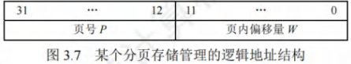
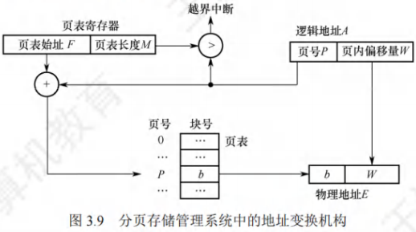

# 内存管理

[toc]

## 内存管理

### 内存管理的概念

#### 引入内存管理

​	内存容量也在不断增大，但仍然不可能将所有用户进程和系统所需要的全部程序与数据放入主存。

#### 内存管理的概念

​	内存管理的概念：操作系统必须对内存空间进行合理的划分和有效的动态分配。操作系统对内存的划分和动态分配。

#### 内存管理的主要功能

1. 内存空间的分配与回收。由操作系统负责内存空间的分配和管理，记录内存的空闲空间、内存的分配情况，并回收已结束进程所占用的内存空间。
2. 地址转换。由于程序的逻辑地址与内存中的物理地址不可能一致，因此存储管理必须提供地址变换功能，将逻辑地址转换成相应的物理地址。
3. 内存空间的扩充。利用虚拟存储技术从逻辑上扩充内存。内存共享。指允许多个进程访问内存的同一部分。例如，多个合作进程可能需要访问同一块数据，因此必须支持对内存共享区域进行受控访问。
4. 存储保护。保证各个进程在各自的存储空间内运行，互不干扰。

### 进程运行的基本原理和要求

#### 程序的链接与装入

​	创建进程首先要将程序和数据装入内存。将用户源程序变为可在内存中执行的程序，通常需要以下几个步骤：

- 编译。由编译程序将用户源代码编译成若干目标模块。
- 链接。由链接程序将编译后形成的一组目标模块，以及它们所需的库函数链接在一起，形成一个完整的装入模块。
- 装入。由装入程序将装入模块装入内存运行。

​	当将一个装入模块装入内存时，有以下三种装入方式。

- 绝对装入

​	绝对装入方式只适用于单道程序环境。在编译时，若知道程序将放到内存的哪个位置，则编译程序将产生绝对地址的目标代码。装入程序按照装入模块的地址，将程序和数据装入内存。由于程序中的逻辑地址与实际内存地址完全相同，因此不需对程序和数据的地址进行修改。

​	程序中使用的绝对地址，可在编译或汇编时给出，也可由程序员直接赋予。而通常情况下在程序中采用的是符号地址，编译或汇编时再转换为绝对地址。

- 可重定位装入

​	经过编译、链接后的装入模块的始址(起始地址)通常都从 0 开始，程序中使用的指令和数据地址都是相对于始址的，此时应采用可重定位装入方式。根据内存的当前情况，将装入模块装入内存的适当位置。在装入时对目标程序中的相对地址的修改过程称为重定位，又因为地址转换通常是在进程装入时一次完成的，所以称为静态重定位，如图 3.2(a)所示。

​	当一个作业装入内存时，必须给它分配要求的全部内存空间，若没有足够的内存，则无法装入。作业一旦进入内存，整个运行期间就不能在内存中移动，也不能再申请内存空间。

- 动态运行时装入

​	动态运行时装入也称动态重定位。程序若要在内存中发生移动，则要采用动态的装入方式。装入程序将装入模块装入内存后，并不会立即将装入模块中的相对地址转换为绝对地址，而是将这种地址转换推迟到程序真正要执行时才进行。因此，装入内存后的所有地址均为相对地址。这种方式需要一个重定位寄存器(存放装入模块的起始位置)的支持，如图3.2(b)所示。

​	动态重定位的优点：可以将程序分配到不连续的存储区；在程序运行前只需装入它的部分代码即可投入运行，然后在程序运行期间，根据需要动态申请分配内存；便于程序段的共享。

​	当对目标模块进行链接时，根据链接的时间不同，分为以下三种链接方式。

- 静态链接

​	在程序运行之前，先将各目标模块及它们所需的库函数链接成一个完整的装入模块，以后不再拆开。将几个目标模块装配成一个装入模块时，需要解决两个问题：

1. 修改相对地址，编译后的所有目标模块都是从0开始的相对地址，当链接成一个装入模块时要修改相对地址。
2. 变换外部调用符号，将每个模块中所用的外部调用符号也都变换为相对地址。

- 装入时动态链接

​	将用户源程序编译后所得到的一组目标模块，在装入内存时，采用边装入边链接的方式。其优点是便于修改和更新，便于实现对目标模块的共享。

- 运行时动态链接

​	在程序执行中需要某目标模块时，才对它进行链接。凡在程序执行中未用到的目标模块，都不会被调入内存和链接到装入模块上。其优点是能加快程序的装入过程，还可节省内存空间。

#### 逻辑地址与物理地址

​	编译后，每个目标模块都从0号单元开始编址，这称为该目标模块的相对地址(或逻辑地址)。当链接程序将各个模块链接成一个完整的可执行目标程序时，链接程序顺序依次按各个模块的相对地址构成统一的从0号单元开始编址的逻辑地址空间(或虚拟地址空间)，对于32位系统，逻辑地址空间的范围为$2^{32}-1$。进程在运行时，看到和使用的地址都是逻辑地址。用户程序和程序员只需知道逻辑地址，而内存管理的具体机制则是完全透明的。不同进程可以有相同的逻辑地址，因为这些相同的逻辑地址可以映射到主存的不同位置。

​	物理地址空间是指内存中物理单元的集合，它是地址转换的最终地址，进程在运行时执行指令和访问数据，最后都要通过物理地址从主存中存取。当装入程序将可执行代码装入内存时，必须通过地址转换将逻辑地址转换成物理地址，这个过程称为地址重定位。

​	操作系统通过内存管理部件(MMU)将进程使用的逻辑地址转换为物理地址。进程使用虚拟内存空间中的地址，操作系统在相关硬件的协助下，将它“转换”成真正的物理地址。逻辑地址通过页表映射到物理内存，页表由操作系统维护并被处理器引用。

#### 进程的内存映像

​	不同于存放在硬盘上的可执行程序文件，当一个程序调入内存运行时，就构成了进程的内存映像。

​	一个进程的内存映像一般有几个要素：

- 代码段：即程序的二进制代码，代码段是只读的，可以被多个进程共享。
- 数据段：即程序运行时加工处理的对象，包括全局变量和静态变量。
- 进程控制块(PCB)：存放在系统区。操作系统通过 PCB来控制和管理进程。
- 堆：用来存放动态分配的变量。通过调用`malloc`函数动态地向高地址分配空间。
- 栈：用来实现函数调用。从用户空间的最大地址往低地址方向增长。

​	代码段和数据段在程序调入内存时就指定了大小，而堆和栈不一样。当调用像`malloc`和`free`这样的C标准库函数时，堆可以在运行时动态地扩展和收缩。用户栈在程序运行期间也可以动态地扩展和收缩，每次调用一个函数，栈就会增长；从一个函数返回时，栈就会收缩。

​	图3.3是一个进程在内存中的映像。其中，共享库用来存放进程用到的共享函数库代码，如`printf()`函数等。在只读代码段中， `.init`是程序初始化时调用的`_init`函数；` .text`是用户程序的机器代码：`.rodata`是只读数据。在读/写数据段中，`data`是已初始化的全局变量和静态变量；`.bss`是未初始化及所有初始化为0的全局变量和静态变量。

#### 内存保护

​	确保每个进程都有一个单独的内存空间。内存分配前，需要保护操作系统不受用户进程的影响，同时保护用户进程不受其他用户进程的影响。内存保护可采取两种方法：

1. 在 CPU 中设置一对上、下限寄存器，存放用户进程在主存中的下限和上限地址，每当 CPU要访问一个地址时，分别和两个寄存器的值相比，判断有无越界。
2. 采用重定位寄存器(也称基地址寄存器)和界地址寄存器(也称限长寄存器)进行越界检查。重定位寄存器中存放的是进程的起始物理地址，界地址寄存器中存放的是进程的最大逻辑地址。内存管理部件将逻辑地址与界地址寄存器进行比较，若未发生地址越界，则加上重定位寄存器的值后映射成物理地址，再送交内存单元，如图3.4所示。

​	实现内存保护需要重定位寄存器和界地址寄存器，因此要注意两者的区别。重定位寄存器是用来“加”的，逻辑地址加上重定位寄存器中的值就能得到物理地址：界地址寄存器是用来“比”的，通过比较界地址寄存器中的值与逻辑地址的值来判断是否越界。

​	加载重定位寄存器和界地址寄存器时必须使用特权指令，只有操作系统内核才可以加载这两个存储器。这种方案允许操作系统内核修改这两个寄存器的值，而不允许用户程序修改。

#### 内存共享

​	只有那些只读的区域才可以共享。可重入代码也称纯代码，是一种允许多个进程同时访问但不允许被任何进程修改的代码。但在实际执行时，也可以为每个进程配以局部数据区，将在执行中可能改变的部分复制到该数据区，这样，程序在执行时只需对该私有数据区中的内存进行修改，并不去改变共享的代码。

#### 内存分配与回收

​	存储管理方式随着操作系统的发展而发展。在操作系统由单道向多道发展时，存储管理方式便由单一连续分配发展为固定分区分配。为了能更好地适应不同大小的程序要求，又从固定分区分配发展到动态分区分配。为了更好地提高内存的利用率，进而从连续分配方式发展到离散分配方式——页式存储管理。引入分段存储管理的目的，主要是满足用户在编程和使用方面的要求，其中某些要求是其他几种存储管理方式难以满足的。

### 连续分配管理

​	连续分配方式是指为一个用户程序分配一个连续的内存空间，连续分配方式主要包括单一连续分配、固定分区分配和动态分区分配。

#### 单一连续分配

​	在单一连续分配方式中，内存被分为**系统区**和**用户区**。

- 系统区仅供操作系统使用，通常在低地址部分；

- 用户区内存中**仅有一道用户程序**，即用户程序独占整个用户区。

- 优点：简单、**无外部碎片**；不需要进行内存保护，因为内存中永远只有一道程序。

- 缺点：只能用于单用户、单任务的操作系统中；**有内部碎片**；存储器的利用率极低。

#### 固定分区分配

​	固定分区分配是最简单的一种多道程序存储管理方式，它将**用户内存空间**划分为**若干固定大小的分区**，**每个分区只装入一道作业**。当有空闲分区时，便可再从外存的后备作业队列中选择适当大小的作业装入该分区，如此循环。在划分分区时有两种不同的方法。

- 分区大小相等。程序太小会造成浪费，程序太大又无法装入，缺乏灵活性。

- 分区大小不等。划分为多个较小的分区、适量的中等分区和少量大分区。

​	为了便于分配和回收，建立一张分区使用表，通常按分区大小排队，各表项包括对应分区的始址、大小及状态(是否已分配)，如图 3.5 所示。分配内存时，便检索该表，以找到一个能满足要求且尚未分配的分区分配给装入程序，并将对应表项的状态置为“已分配”；若找不到这样的分区，则拒绝分配。回收内存时，只需将对应表项的状态置为“未分配”即可。

- 优点：无外部碎片
- 缺点：程序太大而放不进任何一个分区；**有内部碎片**；存储器的利用率低。

#### 动态分区分配

- 动态分区分配的基本原理

​	动态分区分配也称**可变分区分配**，是指在进程装入内存时，根据进程的实际需要，动态地为之分配内存，并使分区的大小正好适合进程的需要。因此，系统中分区的大小和数量是可变的。

​	如图3.6所示，系统有64MB内存空间，其中低8MB固定分配给操作系统，其余为用户可用内存。开始时装入前三个进程，它们分别分配到所需的空间后，内存仅剩4MB，进程4无法装入。在某个时刻，内存中没有一个就绪进程，CPU 出现空闲，操作系统就换出进程2，换入进程4。由于进程4比进程2小，这样在主存中就产生了一个6MB的内存块。之后CPU又出现空闲，需要换入进程2，而主存无法容纳进程2，操作系统就换出进程1，换入进程2。

- 两种常用的数据结构

1. 空闲分区表
2. 空闲分区链

- 动态分区分配的内存**回收方法**：

​	回收内存时，系统根据回收分区的始址，从空闲分区链中找到相应的插入点，此时可能出现四种情况：

1. 回收区与插入点的前一空闲分区相邻，此时将这两个分区合并，并修改前一分区表项的大小为两者之和；
2. 回收区与插入点的后一空闲分区相邻，此时将这两个分区合并，并修改后一分区表项的始址和大小；
3. 回收区同时与插入点的前、后两个分区相邻，此时将这三个分区合并，修改前一分区表项的大小为三者之和，并取消后一分区表项；
4. 回收区没有相邻的空闲分区，此时应该为回收区新建一个表项，填写始址和大小，并插入空闲分区链。

- 动态分区分配的内存**分配算法**：

​	将作业装入主存时，需要按照一定的分配算法从空闲分区链(表)中选出一个分区，以分配给该作业。按分区检索方式，可分为顺序分配算法和索引分配算法。顺序分配算法是指依次搜索空闲分区链上的空闲分区，以寻找一个大小满足要求的分区。

- 基于**顺序搜索**的**分配算法**

1. **首次适应(First Fit)算法**。空闲分区按地址递增的次序排列。每次分配内存时，顺序查找到第一个能满足大小的空闲分区，分配给作业。首次适应算法保留了内存高地址部分的大空闲分区，有利于后续大作业的装入。但它会使内存低地址部分出现许多小碎片，而每次分配查找时都要经过这些分区，因此增加了开销。
2. **最佳适应(Best Fit)算法**。每次分配内存时，顺序查找到第一个能满足大小的空闲分区，即最小的空闲分区，分配给作业。
3. **最坏适应(Worst Fit)算法**。空闲分区按容量递减的次序排列。每次分配内存时，顺序查找到第一个能满足要求的之空闲分区，即最大的空闲分区，从中分割一部分空间给作业。
4. **邻近适应(Next Fit)算法**。也称循环首次适应算法。

- 基于**索引搜索**的**分配算法**

​	当系统很大时，空闲分区链可能很长，此时采用顺序分配算法可能很慢。

​	索引分配算法的思想是，根据其大小对空闲分区分类，对于每类(大小相同)空闲分区，单独设立一个空闲分区链，并设置一张索引表来管理这些空闲分区链。当为进程分配空间时，在索引表中查找所需空间大小对应的表项，并从中得到对应的空闲分区链的头指针，从而获得一个空闲分区。

1. **快速适应算法**。空闲分区的分类根据进程常用的空间大小进行划分。分配过程分为两步：
   1. 首先根据进程的长度，在索引表中找到能容纳它的最小空闲分区链表；
   2. 然后从链表中取出第一块进行分配。优点是查找效率高、不产生内部碎片；缺点是回收分区时，需要有效地合并分区，算法比较复杂，系统开销较大。
2. **伙伴系统**。规定所有分区的大小均为2的k次幂(k为正整数)。当需要为进程分配大小为n的分区时(2-<n<2')，在大小为2'的空闲分区链中查找。若找到，则将该空闲分区分配给进程。否则，表示大小为2'的空闲分区已耗尽，需要在大小为21的空闲分区链中继续查找。若存在大小为241的空闲分区，则将其等分为两个分区，这两个分区称为一对伙伴，其中一个用于分配，而将另一个加入大小为 2'的空闲分区链。若不存在，则继续查找，直至找到为止。回收时，也可能需要对伙伴分区进行合并。
3. **哈希算法**。根据空闲分区链表的分布规律，建立哈希函数，构建一张以空闲分区大小为关键字的哈希表，每个表项记录一个对应空闲分区链的头指针。分配时，根据所需分区大小，通过哈希函数计算得到哈希表中的位置，从中得到相应的空闲分区链表。

### 基本分页存储管理

​	固定分区会产生内部碎片，动态分区会产生外部碎片，这两种技术对内存的利用率都比较低。

​	引入了分页的思想：将内存空间分为若干固定大小(如4KB)的分区，称为页框、页帧或物理块。进程的逻辑地址空间也分为与块大小相等的若干区域，称为页或页面。操作系统以页框为单位为各个进程分配内存空间。

​	从形式上看，分页的方法像是分区相等的固定分区技术，分页管理不产生外部碎片。但它又有本质的不同点：块的大小相对分区要小很多，而且进程也按照块进行划分，进程运行时按块申请主存可用空间并执行。这样，进程只会在为最后一个不完整的块申请一个主存块空间时，才产生主存碎片，所以尽管会产生内部碎片，但这种碎片相对于进程来说也是很小的，每个进程平均只产生半个块大小的内部碎片(也称页内碎片)。

#### 分页存储的基本概念

- 页面和页面大小

​	页框：将**内存空间**分为一个个大小相等的分区，每个分区就是一个**页框**(页框=页帧=内存块=物理块=物理页面)。

​	每个页框有一个编号，即“页框号”(页框号=页帧号=内存块号=物理块号=物理页号)，页框号从0开始。

​	页：将**进程的逻辑地址空间**也分为与页框大小相等的一个个部分，每个部分称为一个**页**或“页面”。

​	每个页面也有一个编号，即“页号”，页号从0开始。

​	操作系统以页框为单位为各个进程分配内存空间。进程的每个页面分别放入一个页框中。也就是说，进程的页面与内存的页框有一一对应的关系。各个页面不必连续存放，可以放到不相邻的各个页框中。页面大小应是2的整数次幂。

- 地址结构

​	如果有$M$位表示“页号”，一个进程最多允许有$2^M$个页面。	

​	如果有$K$位表示“页内偏移量”，一个**页面的大小**是$2^K$个页框。

​	$页号=逻辑地址/页面长度(取除法的整数部分)$

​	$页内偏移量=逻辑地址\%页面长度(取除法的余数部分)$

- 页表

​	为了便于找到进程的每个页面在内存中存放的位置，系统为每个进程建立一张页面映射表，简称页表。

​	在页表中，由于页表项连续存放，因此页号可以是隐含的，不占用存储空间。

​	进程的每个页面对应一个页表项，每个页表项由页号和块号组成，它记录了页面在内存中对应的物理块号，如图3.8所示。进程执行时，通过查找页表，即可找到每页在内存中的物理块号。可见，页表的作用是实现从页号到物理块号的地址映射。

#### 基本地址变换机构

​	地址变换机构的任务是将逻辑地址转换为内存中的物理地址。地址变换是借助于页表实现的。

​	在系统中设置一个页表寄存器(PTR)，存放页表在内存的$始址F$和$页表长度M$。单CPU系统中只设置一个页表寄存器。设$页面大小L$，$逻辑地址 A$到$物理地址E$的变换过程如下(假设逻辑地址、页号、每页的长度都是十进制数)：

1. 根据逻辑地址计算出页号$P=A/L$、页内偏移量$W=A\%L$。
2. 判断页号是否越界，若$页号P\geq页表长度M$，则产生越界中断，否则继续执行。
3. 在页表中查询页号对应的页表项，确定页面存放的物理块号。$页号P对应的页表项地址=页表始址F+页号P\times页表项长度$，取出该$页表项内容b$，即为页框号。
4. 计算$物理地址E=b\times L+W$，用$物理地址E$去访存。注意，$物理地址=页面在内存中的始址+页内偏移量$，$页面在内存中的始址 = 块号×块大小(页面大小)$。

​	分页管理方式存在的两个主要问题：

1. 每次访存操作都需要进行逻辑地址到物理地址的转换，地址转换过程必须足够快，否则访存速度会降低；
2. 每个进程引入页表，用于存储映射机制，页表不能太大，否则内存利用率会降低。

#### 具有快表的地址变换机构

​	若页表全部放在内存中，则存取一个数据或一条指令至少要访问两次内存：第一次是访问页表，确定所存取的数据或指令的物理地址；第二次是根据该地址存取数据或指令。

​	在地址变换机构中增设一个具有并行查找能力的高速缓冲存储器——快表(TLB)，也称相联存储器，用来存放当前访问的若干页表项，以加速地址变换的过程。与此对应，主存中的页表常称为慢表。

​	在具有快表的分页机制中，地址的变换过程如下：

1. CPU给出逻辑地址后，由硬件进行地址转换，将页号与快表中的所有页号进行比较。
2. 若找到匹配的页号，说明要访问的页表项在快表中有副本，则直接从中取出该页对应的页框号，与页内偏移量拼接形成物理地址。这样，存取数据仅一次访存即可实现。
3. 若未找到匹配的页号，则需要访问主存中的页表，读出页表项后，应同时将其存入快表，以便后面可能的再次访问。若快表已满，则须按照特定的算法淘汰一个旧页表项。

#### 两级页表

​	引入分页管理后，进程在执行时不需要将所有页调入内存页框，而只需将保存有映射关系的页表调入内存。但仍需考虑页表的大小。

​	解决上述问题的方法有两种：

1. 对于页表所需的内存空间，采用离散分配方式，用一张索引表来记录各个页表的存放位置，这就解决了页表占用连续内存空间的问题；
2. 只将当前需要的部分页表项调入内存，其余的页表项仍驻留磁盘，需要时再调入(虚拟内存的思想)，这就解决了页表占用内存过多的问题。

​	这个方案就和当初引进页表机制的思路一模一样，实际上就是为离散分配的页表再建立一张页表，称为外层页表(或页目录)。仍以上面的条件为例，当采用两级分页时，对页表再进行分页，则外层页表需要1K个页表项，刚好占用4KB的内存空间，使得外层页表的大小正好等于一页，这样就得到了逻辑地址空间的格式，如图3.11所示。

​	在页表的每个表项中，存放的是进程的某页对应的物理块号。在外层页表的每个表项中，存放的是某个页表分页的始址。可以利用外层页表和页表来实现进程从逻辑地址到物理地址的变换。

​	为了方便实现地址变换，需要在系统中增设一个外层页表寄存器(也称页目录基址寄存器)，用于存放页目录始址。将逻辑地址中的页目录号作为页目录的索引，从中找到对应页表的始址：再用二级页号作为页表分页的索引，从中找到对应的页表项；将页表项中的物理块号和页内偏移拼接，即为物理地址，再用该地址访问内存单元。共进行了3次访存。

### 基本分段存储管理

​	分页管理方式是从计算机的角度考虑设计的，目的是提高内存的利用率，提升计算机的性能。

​	分页通过硬件机制实现，对用户完全透明。分段管理方式的提出则考虑了用户和程序员，以满足方便编程、信息保护和共享、动态增长及动态链接等多方面的需要。

#### 分段

​	分段系统将用户进程的逻辑地址空间划分为大小不等的段。段间不要求连续，进程的地址空间是二维的。

​	分段存储管理的逻辑地址结构由$段号S$与$段内偏移量W$两部分组成。在图3.13中，段号为16 位，段内偏移量为16 位，因此一个进程最多有2^16^=65536段，最大段长为64KB.

​	在页式系统中，逻辑地址的页号和页内偏移量对用户是透明的，但在分段系统中，段号和段内偏移量必须由用户显式提供，在高级程序设计语言中，这个工作由编译程序完成。

#### 段表

​	每个进程都有一张逻辑空间与内存空间映射的段表，进程的每个段对应一个段表项，段表项记录了该段在内存中的始址和段的长度。段表的内容如图3.14所示。

​	配置段表后，执行中的进程可以通过查找段表，找到每段所对应的内存区。可见，段表用于实现从逻辑段到物理内存区的映射，如图3.15所示。

#### 地址变换机构

​	系统中设置了一个段表寄存器，用于存放$段表始址F$和$段表长度M$。从$逻辑地址A$到$物理地址E$之间的地址变换过程如下：

1. 从$逻辑地址A$中取出前几位为$段号S$，后几位为$段内偏移量 W$。
2. 判断段号是否越界，若$段号S\geq 段表长度M$，则产生越界中断，否则继续执行。
3. 在段表中查询段号对应的段表项，$段号S对应的段表项地址 = 段表始址 F+ 段号 S\times 段表项长度$。取出段表项中该段的$段长C$，若$W \geq C$，则产生越界中断，否则继续执行。
4. 取出段表项中该段的$始址b$，计算物理地址$E=b+W$，用$物理地址E$去访存。

#### 分页和分段的对比

​	分页和分段有许多相似之处，两者都是非连续分配方式，都要通过地址映射机构实现地址变换。但是，在概念上两者完全不同，主要表现在以下三个方面：

1. 页是信息的物理单位，分页的主要目的是提高内存利用率，分页完全是系统的行为，对用户是不可见的。段是信息的逻辑单位，分段的主要目的是更好地满足用户需求，用户按照逻辑关系将程序划分为若干段，分段对用户是可见的。
2. 页的大小固定且由系统决定。段的长度不固定，具体取决于用户所编写的程序。
3. 分页管理的地址空间是一维的。段式管理不能通过给出一个整数便确定对应的物理地址，因为每段的长度是不固定的，无法通过除法得出段号，无法通过求余得出段内偏移，所以一定要显式给出段号和段内偏移，因此分段管理的地址空间是二维的。

#### 段的共享与保护

​	在分页系统中，虽然也能实现共享，但远不如分段系统来得方便。若被共享的代码占N个页框，则每个进程的页表中都要建立N个页表项，指向被共享的N个页框。

​	在分段系统中，不管该段有多大，都只需为该段设置一个段表项，因此非常容易实现共享。只需在每个进程的段表中设置一个段表项，指向被共享的同一个物理段。不能被任何进程修改的代码称为可重入代码或纯代码(不属于临界资源)，它是一种允许多个进程同时访问的代码。为了防止程序在执行时修改共享代码，在每个进程中都必须配以局部数据区，将在执行过程中可能改变的部分复制到数据区，这样，进程就可对该数据区中的内容进行修改。

​	与分页管理类似，分段管理的保护方法主要有两种：一种是存取控制保护，另一种是地址越界保护。地址越界保护将段表寄存器中的段表长度与逻辑地址中的段号比较，若段号大于段表长度，则产生越界中断；再将段表项中的段长和逻辑地址中的段内偏移进行比较，若段内偏移大于段长，也会产生越界中断。分页管理只需要判断页号是否越界，页内偏移是不可能越界的。

### 段页式存储管理

​	分页存储管理能有效地提高内存利用率，而分段存储管理能反映程序的逻辑结构并有利于段的共享和保护。将这两种存储管理方法结合起来，便形成了段页式存储管理方式。

​	在段页式系统中，进程的地址空间首先被分成若干逻辑段，每段都有自己的段号，然后将每段分成若干大小固定的页。对内存空间的管理仍然和分页存储管理一样，将其分成若干和页面大小相同的存储块，对内存的分配以存储块为单位，如图 3.17所示。

​	在段页式系统中，进程的逻辑地址分为三部分：段号、页号和页内偏移量，如图3.18所示。

​	为了实现地址变换，系统为每个进程建立一张段表，每个段对应一个段表项，每个段表项至少包括段号、页表长度和页表始址；每个段有一张页表，每个页表项至少包括页号和块号。此外，系统中还应有一个段表寄存器，指出进程的段表始址和段表长度(段表寄存器和页表寄存器的作用都有两个，一是在段表或页表中寻址，二是判断是否越界)。

​	在段页式存储管理中，每个进程的段表只有一个，而页表可能有多个。

​	在进行地址变换时，首先通过段表查到页表始址，然后通过页表找到物理块号，最后形成物理地址。如图 3.19 所示，进行一次访问实际需要三次访问主存，这里同样可以使用快表来加快查找速度，其关键字由段号、页号组成，值是对应的物理块号和保护码。

## 虚拟内存管理

### 虚拟内存的基本概念

#### 传统存储管理方式的特征

1. 一次性。作业必须一次性全部装入内存后，才能开始运行。这会导致两个问题：
   1. 当作业很大而不能全部被装入内存时，将使该作业无法运行；
   2. 当大量作业要求运行时，由于内存不足以容纳所有作业，只能使少数作业先运行，导致多道程序并发度的下降。
2. 驻留性。作业被装入内存后，就一直驻留在内存中，其任何部分都不会被换出，直至作业运行结束。运行中的进程会因等待I/O而被阻塞，可能处于长期等待状态。

​	由以上分析可知，许多在程序运行中不用或暂时不用的程序(数据)占据了大量的内存空间，而一些需要运行的作业又无法装入运行，显然浪费了宝贵的内存资源。

#### 局部性原理

​	要真正理解虚拟内存技术的思想，首先必须了解著名的局部性原理。从广义上讲，快表、页高速缓存及虚拟内存技术都属于高速缓存技术，这个技术所依赖的原理就是局部性原理。局部性原理既适用于程序结构，又适用于数据结构。局部性原理表现在以下两个方面：

1. 时间局部性。程序中的某条指令一旦执行，不久后该指令可能再次执行；某数据被访问过，不久后该数据可能再次被访问。产生的原因是程序中存在着大量的循环操作。
2. 空间局部性。一旦程序访问了某个存储单元，在不久后，其附近的存储单元也将被访问，即程序在一段时间内所访问的地址，可能集中在一定的范围之内，因为指令通常是顺序存放、顺序执行的，数据也一般是以向量、数组、表等形式簇聚存储的。

​	时间局部性通过将近来使用的指令和数据保存到高速缓存中，并使用高速缓存的层次结构实现。空间局部性通常使用较大的高速缓存，并将预取机制集成到高速缓存控制逻辑中实现。虚拟内存技术实际上建立了“内存-外存”的两级存储器结构，利用局部性原理实现高速缓存。

#### 虚拟存储器的定义和特征

​	基于局部性原理，在程序装入时，仅需将程序当前运行要用到的少数页面(或段)装入内存，而将其余部分暂留在外存，便可启动程序执行。在程序执行过程中，当所访问的信息不在内存时，由操作系统负责将所需信息从外存调入内存，然后继续执行程序，这个过程就是请求调页(或请求调段)功能。当内存空间不够时，由操作系统负责将内存中暂时用不到的信息换出到外存，从而腾出空间存放将要调入内存的信息，这个过程就是页面置换(或段置换)功能。这样，系统好像为用户提供了一个比实际内存容量大得多的存储器，称为虚拟存储器。

​	之所以将其称为虚拟存储器，是因为这种存储器实际上并不存在，只是由于系统提供了部分装入、请求调入和置换功能后(均对用户透明)，给用户的感觉是好像存在一个比实际物理内存大得多的存储器。但容量大只是一种错觉，是虚的。虚拟存储器有以下三个主要特征：

1. 多次性。无需在作业运行时一次性全部装入内存，而是允许被分成多次调入内存，即只需将当前要运行的那部分程序和数据装入内存即可开始运行。以后每当要运行到尚未调入的那部分程序或数据时，再将它们调入。多次性是虚拟存储器最重要的特征。
2. 对换性。在作业运行时无需一直常驻内存，而是允许在作业运行过程中，将那些暂不使用的程序和数据从内存调至外存的对换区(换出)，待以后需要时再将它们从外存调至内存(换进)。正是由于对换性，才使得虚拟存储器得以正常运行。
3. 虚拟性。从逻辑上扩充了内存的容量，使用户看到的内存容量，远大于实际容量。这是虚拟存储器所表现出的最重要特征，也是实现虚拟存储器的最重要目标。

#### 虚拟内存技术的实现

​	虚拟内存技术允许将一个作业分多次调入内存。采用连续分配方式时，会使相当一部分内存空间都处于暂时或“永久”的空闲状态，造成内存资源的严重浪费，而且也无法从逻辑上扩大内存容量。因此，虚拟内存的实现需要建立在离散分配的内存管理方式的基础上。虚拟内存的实现有以下三种方式：

1. 请求分页存储管理。

2. 请求分段存储管理
3. 请求段页式存储管理。

不管哪种方式，都需要有一定的硬件支持。一般需要的支持有以下几个方面：

1. 一定容量的内存和外存。
2. 页表机制(或段表机制)，作为主要的数据结构。
3. 中断机构，当用户程序要访问的部分尚未调入内存时，则产生中断。
4. 地址变换机构，逻辑地址到物理地址的变换。

### 请求分页管理方式

​	请求分页系统建立在基本分页系统的基础之上，为支持虚拟存储器功能而增加了请求调页和页面置换功能。在请求分页系统中，只要求将当前需要的一部分页面装入内存，便可启动作业运行。在作业执行过程中，当所访问的页面不在内存时，再通过请求调页功能将其从外存调入内存；当内存空间不够时，通过页面置换功能将内存中暂时用不到的页面换出到外存。

​	为了实现请求分页，系统必须提供一定的硬件支持。除了需要一定容量的内存及外存的计算机系统，还需要有页表机制、缺页中断机构和地址变换机构。

#### 页表机制

​	相比于基本分页系统，在请求分页系统中，为了实现请求调页功能，操作系统需要知道每个页面是否已调入内存：若未调入，则还需要知道该页在外存中的存放地址。为了实现页面置换功能，操作系统需要通过某些指标来决定换出哪个页面；对于要换出的页面，还要知道其是否被修改过，以决定是否写回外存。为此，在请求页表项中增加了4个字段，如图3.20所示。

增加的 4 个字段说明如下：

1. 状态位P。标记该页是否已调入内存，供程序访问时参考。
2. 访问字段 A。记录本页在一段时间内被访问的次数，或记录本页最近已有多长时间未被访问，供置换算法换出页面时参考。
3. 修改位M。标记该页在调入内存后是否被修改过，以决定换出时是否写回外存。
4. 外存地址。记录该页在外存的存放地址，通常是物理块号，供调入该页时参考。

#### 缺页中断机构

​	在请求分页系统中，每当要访问的页面不在内存时，便产生一个缺页中断，请求操作系统的缺页中断处理程序处理。此时缺页的进程阻塞，放入阻塞队列，调页完成后再将其唤醒，放回就绪队列。若内存中有空闲页框，则为进程分配一个页框，将所缺页面从外存装入该页框，并修改页表中的相应表项，若内存中没有空闲页框，则由页面置换算法选择一个页面淘汰，若该页在内存期间被修改过，则还要将其写回外存。未被修改过的页面不用写回外存。

​	缺页中断作为中断，同样要经历诸如保护CPU环境、分析中断原因、转入缺页中断处理程序、恢复 CPU 环境等几个步骤。但与一般的中断相比，它有以下两个明显的区别：

1. 在指令执行期间而非一条指令执行完后产生和处理中断，属于内部异常。
2. 一条指令在执行期间，可能产生多次缺页中断。

#### 地址变换机构

​	在基本分页系统地址变换机构的基础上，为实现虚拟内存，增加了产生和处理缺页中断，及从内存中换出一页的功能，请求分页系统中的地址变换过程如图3.21 所示。

请求分页系统的地址变换过程如下：

1. 先检索快表，若命中，则从相应表项中取出该页的物理块号，并修改页表项中的访问位，以供置换算法换出页面时参考。对于写指令，还需要将修改位置为1。
2. 若快表未命中，则要到页表中查找，若找到，则从相应表项中取出物理块号，并将该页表项写入快表，若快表已满，则需采用某种算法替换。
3. 若在页表中未找到，则需要进行缺页中断处理，请求系统将该页从外存换入内存，页面被调入内存后，由操作系统负责更新页表和快表，并获得物理块号。
4. 利用得到的物理块号和页内地址拼接形成物理地址，用该地址去访存。

- 新增步骤

1. 请求调页(查到页表项时进行判断)
2. 页面置换(需要调入页面，但没有空闲内存块时进行)
3. 需要修改请求页表中新增的表项

### 页框分配

#### 驻留集大小

​	对于分页式的虚拟内存，在进程准备执行时，不需要也不可能将一个进程的所有页都读入主存。因此，操作系统必须决定读取多少页，即决定给特定的进程分配几个页框。给一个进程分配的页框的集合就是这个进程的驻留集。需要考虑以下两点：

1. 驻留集越小，驻留在内存中的进程就越多，可以提高多道程序的并发度，但分配给每个进程的页框太少，会导致缺页率较高，CPU 需耗费大量时间来处理缺页。
2. 驻留集越大，当分配给进程的页框超过某个数目时，再为进程增加页框对缺页率的改善是不明显的，反而只能是浪费内存空间，还会导致多道程序并发度的下降。

#### 内存分配策略

​	在请求分页系统中，可采取两种内存分配策略，即固定和可变分配策略。在进行置换时，也可采取两种策略，即全局和局部置换。于是可组合出下面三种适用的策略。

- 固定分配局部置换

​	为每个进程分配固定数目的物理块，在进程运行期间都不改变。所谓局部置换，是指若进程在运行中发生缺页，则只能从分配给该进程在内存的页面中选出一页换出，然后再调入一页，以保证分配给该进程的内存空间不变。实现这种策略时，难以确定应为每个进程分配的物理块数目：太少会频繁出现缺页中断，太多又会降低 CPU 和其他资源的利用率。

- 可变分配全局置换

​	先为每个进程分配一定数目的物理块，在进程运行期间可根据情况适当地增加或减少。所谓全局置换，是指若进程在运行中发生缺页，则系统从空闲物理块队列中取出一块分配给该进程，并将所缺页调入。这种方法比固定分配局部置换更加灵活，可以动态增加进程的物理块，但也存在弊端，如它会盲目地给进程增加物理块，从而导致系统多道程序的并发能力下降。

- 可变分配局部置换

​	为每个进程分配一定数目的物理块，当某进程发生缺页时，只允许从该进程在内存的页面中选出一页换出，因此不会影响其他进程的运行。若进程在运行中频繁地发生缺页中断，则系统再为该进程分配若干物理块，直至该进程的缺页率趋于适当程度：反之，若进程在运行中的缺页率特别低，则可适当减少分配给该进程的物理块，但不能引起其缺页率的明显增加。这种方法在保证进程不会过多地调页的同时，也保持了系统的多道程序并发能力。当然它需要更复杂的实现，也需要更大的开销，但对比频繁地换入/换出所浪费的计算机资源，这种牺牲是值得的。

#### 物理块调入算法

​	采用固定分配策略时，将系统中的空闲物理块分配给各个进程，可采用下述几种算法。

1. 平均分配算法，将系统中所有可供分配的物理块平均分配给各个进程。
2. 按比例分配算法，根据进程的大小按比例分配物理块。
3. 优先权分配算法，为重要和紧迫的进程分配较多的物理块。通常采取的方法是将所有可分配的物理块分成两部分：一部分按比例分配给各个进程；一部分则根据优先权分配。

#### 调入页面的时机

​	为确定系统将进程运行时所缺的页面调入内存的时机，可采用以下两种调页策略：

1. 预调页策略。根据局部性原理，一次调入若干个相邻的页面会比一次调入一页更高效。但若提前调入的页面中大多数都未被访问，则又是低效的。因此，可以预测不久之后可能被访问的页面，将它们预先调入内存，但目前预测成功率仅约50%。因此这种策略主要用于进程的首次调入，由程序员指出应先调入哪些页。
2. 请求调页策略。进程在运行中需要访问的页面不在内存，便提出请求，由系统将其所需页面调入内存。由这种策略调入的页一定会被访问，且比较易于实现，因此目前的虚拟存储器大多采用此策略。其缺点是每次仅调入一页，增加了磁盘I/O开销。预调页实际上就是运行前的调入，请求调页实际上就是运行期间的调入。

#### 从何处调入页面

​	请求分页系统中的外存分为两部分：用于存放文件的文件区和用于存放对换页面的对换区，也称交换区。对换区采用连续分配方式，而文件区采用离散分配方式，因此对换区的磁盘I/O速度比文件区的更快。这样，当发生缺页请求时，系统从何处将缺页调入内存就分为三种情况：

1. 系统拥有足够的对换区空间。可以全部从对换区调入所需页面，以提高调页速度。为此，在进程运行前，需将与该进程有关的文件从文件区复制到对换区。
2. 系统缺少足够的对换区空间。凡是不会被修改的文件都直接从文件区调入；当换出这些页面时，由于它们不会被修改而不必再换出。但对于那些可能被修改的部分，在将它们换出时必须放在对换区，以后需要时再从对换区调入(因为读比写的速度快)。
3. UNIX方式。与进程有关的文件都放在文件区，因此未运行过的页面都应从文件区调入。曾经运行过但又被换出的页面，由于是放在对换区，因此在下次调入时应从对换区调入。进程请求的共享页面若被其他进程调入内存，则不需要再从对换区调入。

#### 如何调入页面

​	当进程所访问的页面不在内存中时(存在位为 0)，便向 CPU 发出缺页中断，中断响应后便转入缺页中断处理程序。该程序通过查找页表得到该页的物理块，此时，若内存未满，则启动磁盘I/O，将所缺页调入内存，并修改页表。若内存已满，则先按某种置换算法从内存中选出一页准备换出；若该页未被修改过(修改位为0)，则不需要将该页写回磁盘；但是，若该页已被修改(修改位为1)，则必须将该页写回磁盘，然后将所缺页调入内存，并修改页表中的相应表项，置其存在位为1。调入完成后，进程就可利用修改后的页表形成所要访问数据的内存地址。

### 页面置换算法

​	进程运行时，若其访问的页面不在内存而需将其调入，但内存已无空闲空间时，就需要从内存中调出一页，换出到外存。选择调出哪个页面的算法就称为页面置换算法。页面的换入、换出需要磁盘I/O，开销较大，因此好的页面置换算法应该追求更低的缺页率。

#### 最佳置换算法(OPT)

​	最佳置换算法选择淘汰的页面是以后永不使用的页面，或是在最长时间内不再被访问的页面，以便保证获得最低的缺页率。由于人们目前无法预测进程在内存的若干页面中哪个是未来最长时间内不再被访问的，因此该算法无法实现。但可利用该算法去评价其他算法。

#### 先进先出页面置换算法(FIFO)

​	FIFO 算法选择淘汰的页面是最早进入内存的页面。该算法实现简单，将内存中的页面根据调入的先后顺序排成一个队列，需要换出时选择队头的页面即可。但该算法没有利用局部性原理，与进程实际运行的规律不相适应，因此性能较差。

#### 最近最久未使用置换算法(LRU)

​	LRU 算法选择淘汰的页面是最近最长时间未使用的页面，它认为过去一段时间内未访问过的页面，在最近的将来可能也不会被访问。该算法为每个页面设置一个访问字段，用来记录页面自上次被访问以来所经历的时间，淘汰页面时选择现有页面中值最大的页面。

#### 时钟置换算法(CLOCK)

- 简单的CLOCK置换算法

​	为每个页面设置一位访问位，当某页首次被装入或被访问时，其访问位被置为 1。算法将内存中的页面链接成一个循环队列，并有一个替换指针与之相关联。当某一页被替换时，该指针被设置指向被替换页面的下一页。在选择淘汰一页时，只需检查页面的访问位：若为0，就选择该页换出；若为1，则将它置为0，暂不换出，给予该页第二次驻留内存的机会，再依次顺序检查下一个页面。当检查到队列中的最后一个页面时，若其访问位仍为1，则返回到队首去循环检查。由于该算法是循环地检查各个页面的使用情况，所以称为 CLOCK 算法。但是，因为该算法只有一位访问位，而置换时将未使用过的页面换出，所以也称最近未用(NRU)算法。

- 改进型CLOCK置换算法

​	将一个页面换出时，若该页已被修改过，则要将该页写回磁盘，若该页未被修改过，则不必将它写回磁盘。可见，对于修改过的页面，替换代价更大。在改进型CLOCK算法中，除考虑页面使用情况外，还增加了置换代价--修改位。在选择页面换出时，优先考虑既未使用过又未修改过的页面。

### 抖动和工作集

#### 抖动

​	在页面置换过程中，一种最糟糕的情形是，刚刚换出的页面马上又要换入内存，刚刚换入的页面马上又要换出内存，这种频繁的页面调度行为称为抖动或颠簸。

​	系统发生抖动的根本原因是，分配给每个进程的物理块太少，不能满足进程正常运行的基本要求，致使每个进程在运行时频繁地出现缺页，必须请求系统将所缺页面调入内存。显然，对磁盘的访问时间也随之急剧增加，造成每个进程的大部分时间都用于页面的换入/换出，而几乎不能再去做任何有效的工作，进而导致发生CPU利用率急剧下降并趋于零的情况。

​	抖动是进程运行时出现的严重问题，必须采取相应的措施解决它。由于抖动的发生与系统为进程分配物理块的多少(即驻留集)有关，于是又提出了关于进程工作集的概念。

#### 工作集

​	工作集是指在某段时间间隔内，进程要访问的页面集合。一般来说，工作集W可由时间t和工作集窗口尺寸 4 来确定。例如，某个进程对页面的访问次序如下：

​	假设工作集窗口尺寸4设置为5，则在4时刻，进程的工作集为(2，3，5)， t时刻，进程的工作集为(1，2，3，4)。实际应用中，工作集窗口会设置得很大，对于局部性好的程序，工作集大小一般会比工作集窗口4小很多。工作集反映了进程在接下来的一段时间内很有可能会频繁访问的页面集合，因此驻留集大小不能小于工作集，否则进程在运行过程中会频繁缺页。

### 内存映射文件

​	内存映射文件(Memory-Mapped Files)是操作系统向应用程序提供的一个系统调用，它与虚拟内存有些相似，在磁盘文件与进程的虚拟地址空间之间建立映射关系。

​	进程通过该系统调用，将一个文件映射到其虚拟地址空间的某个区域，之后就用访问内存的方式读写文件。这种功能将一个文件当作内存中的一个大字符数组来访问，而不通过文件1/O 操作来访问，显然这更便利。磁盘文件的读出/写入由操作系统负责完成，对进程而言是透明的。当映射进程的页面时，不会实际读入文件的内容，而只在访问页面时才被每次一页地读入。当进程退出或关闭文件映射时，所有被改动的页面才被写回磁盘文件。

​	进程可通过共享内存来通信，实际上，很多时候，共享内存是通过映射相同文件到通信进程的虚拟地址空间来实现的。当多个进程映射到同一个文件时，各进程的虚拟地址空间都是相互独立的，但操作系统将对应的这些虚拟地址空间映射到相同的物理内存(用页表实现)，如图3.28所示。一个进程在共享内存上完成了写操作，此刻当另一个进程在映射到这个文件的虚拟地址空间上执行读操作时，就能立刻看到上一个进程写操作的结果。

​	内存映射文件带来的好处主要是：

1. 使程序员的编程更简单，已建立映射的文件只需按访问内存的方式进行读写；
2. 方便多个进程共享同一个磁盘文件。

### 性能影响因素

​	缺页率是影响虚拟存储器性能的主要因素，而缺页率又受到页面大小、分配给进程的物理块数、页面置换算法以及程序的编制方法的影响。

​	根据局部性原理，页面较大则缺页率较低，页面较小则缺页率较高。页面较小时，一方面减少了内存碎片，有利于提高内存利用率；另一方面，也会使每个进程要求较多的页面，导致页表过长，占用大量内存。页面较大时，虽然可以减少页表长度，但会使页内碎片增大。

​	分配给进程的物理块数越多，缺页率就越低，但是当物理块超过某个数目时，再为进程增加一个物理块对缺页率的改善是不明显的。可见，此时已没有必要再为它分配更多的物理块，否则也只能是浪费内存空间。只要保证活跃页面在内存中，保持缺页率在一个很低的范围即可。

​	好的页面置换算法可使进程在运行过程中具有较低的缺页率。选择 LRU、CLOCK 等置换算法，将未来有可能访问的页面尽量保留在内存中，从而提高页面的访问速度。

​	写回磁盘的频率。换出已修改过的页面时，应当写回磁盘，如果每当一个页面被换出就将它写回磁盘，那么每换出一个页面就需要启动一次磁盘，效率极低。为此在系统中建立一个已修改换出页面的链表，对每个要被换出的页面(已修改)，可以暂不将它们写回磁盘，而将它们挂在该链表上，仅当被换出页面数达到给定值时，才将它们一起写回磁盘，这样就可显著减少磁盘I/O的次数，即减少已修改页面换出的开销。此外，若有进程在这批数据还未写回磁盘时需要再次访问这些页面，则不需从外存调入，而直接从已修改换出页面链表上获取，这样也可以减少页面从磁盘读入内存的频率，减少页面换进的开销。

​	编写程序的局部化程度越高，执行时的缺页率就越低。若存储采用的是按行存储，则访问时就要尽量采用相同的访问方式，避免按列访问造成缺页率过高的现象。

### 地址翻译

设某系统满足以下条件：

1. 有一个 TLB 与一个 data Cache
2. 存储器以字节为编址单位
3. 虚拟地址14位
4. 物理地址12位
5. 页面大小为64B
6. TLB为四路组相联，共有16个条目
7. data Cache是物理寻址、直接映射的，行大小为 4B，共有16 组

写出访问地址为0x03d4， 0x00f1和0x0229的过程。