# 文件管理

[toc]

## 文件管理基础

### 文件的基本概念

​	文件(File)是以硬盘为载体的存储在计算机上的信息集合，文件可以是文本文档、图片、程序等。

​	在系统运行时，计算机以进程为基本单位进行资源的调度和分配；而在用户进行的输入、输出中，则以文件为基本单位。

​	大多数应用程序的输入都是通过文件来实现的，其输出也都保存在文件中，以便信息的长期存储及将来的访问。

​	当用户将文件用于程序的输入、输出时，还希望可以访问、修改和保存文件等，实现对文件的维护管理，这就需要系统提供一个文件管理系统，操作系统中的文件系统(File System)就是用于实现用户的这些管理要求的。

#### 文件的定义

​	文件包括一块存储空间，更准确地说，是存储空间中的数据；

​	操作系统要管理大量的数据，必须要对这些数据进行分类，文件必定包含分类和索引的信息；

​	不同用户对数据的访问权限不同，文件中一定包含关于访问权限的信息。

​	文件系统提供了与二级存储相关的资源的抽象，让用户能在不了解文件的各种属性、文件存储介质的特征及文件在存储介质上的具体位置等情况下，方便快捷地使用文件。用户通过文件系统建立文件，用于应用程序的输入、输出，对资源进行管理。

- 文件的结构，通过自底向上的方式来定义。

1. 数据项。是文件系统中最低级的数据组织形式，可分为以下两种类型：
   - 基本数据项。用于描述一个对象的某种属性的一个值，是数据中的最小逻辑单位。
   - 组合数据项。由多个基本数据项组成。
2. 记录。是一组相关的数据项的集合，用于描述一个对象在某方面的属性。
3. 文件。是指由创建者所定义的、具有文件名的一组相关元素的集合，可分为有结构文件和无结构文件两种。在有结构的文件中，文件由若干个相似的记录组成；而无结构文件则被视为一个字符流。

​	将程序和数据组织成文件。文件可以是数字、字符或二进制代码，基本访问单元可以是字节或记录。文件可以长期存储在硬盘中，允许可控制的进程间共享访问，能够被组织成复杂的结构。

#### 文件的属性

​	除了文件数据，操作系统还会保存与文件相关的信息，如所有者、创建时间等，这些附加信息称为文件属性或文件元数据。文件属性在不同系统中差别很大，但通常都包括如下属性。

1. 名称。文件名称唯一，以容易读取的形式保存。
2. 类型。被支持不同类型的文件系统所使用。
3. 创建者。文件创建者的ID。
4. 所有者。文件当前所有者的ID。
5. 位置。指向设备和设备上文件的指针。
6. 大小。文件当前大小(用字节、字或块表示)，也可包含文件允许的最大值。
7. 保护。对文件进行保护的访问控制信息。
8. 创建时间、最后一次修改时间和最后一次存取时间。文件创建、上次修改和上次访问的相关信息，用于保护和跟踪文件的使用。

#### 文件的分类

​	为了便于管理文件，将文件分成了若干类型。

1. 按性质和用途分类，分为系统文件、用户文件、库文件。
2. 按文件中数据的形式分类，分为源文件、目标文件、可执行文件。
3. 按存取控制属性分类，分为可执行文件、只读文件、读/写文件。
4. 按组织形式和处理方式分类，分为普通文件、目录文件、特殊文件。

### 文件控制块和索引节点

#### 文件控制块

​	文件控制块(File Control Block，FCB)是用来存放控制文件需要的各种信息的数据结构，以实现按名存取。文件与FCB一一对应，FCB的有序集合称为文件目录，一个FCB就是一个文件目录项。

​	一个文件目录也被视为一个文件，称为目录文件。每当创建一个新文件，系统就要为其建立一个FCB，用来记录文件的各种属性。

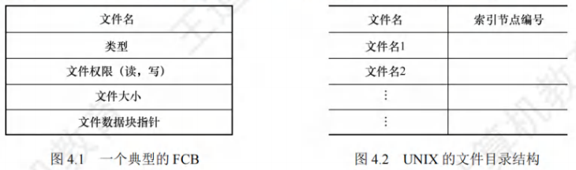

- FCB主要包含以下信息：

1. 基本信息，如文件名、文件的物理位置、文件的逻辑结构、文件的物理结构等。
2. 存取控制信息，包括文件主的存取权限、核准用户的存取权限以及一般用户的存取权限。
3. 使用信息，如文件建立时间、上次修改时间等。

#### 索引节点

​	文件目录通常存放在磁盘上，当文件很多时，文件目录会占用大量的盘块。

​	在查找目录的过程中，要先将存放目录文件的第一个盘块中的目录调入内存，然后用给定的文件名逐一比较，若未找到指定文件，就还需要不断地将下一盘块中的目录项调入内存，逐一比较。

​	在检索目录的过程中，只用到了文件名，仅当找到一个目录项(其中的文件名与要查找的文件名匹配)时，才需从该目录项中读出该文件的物理地址。

​	在检索目录时，文件的其他描述信息不会用到，也不需要调入内存。有的系统采用了文件名和文件描述信息分离的方法，使文件描述信息单独形成一个称为索引节点的数据结构，简称`i`节点(`inode`)。在文件目录中的每个目录项仅由文件名和相应的索引节点号(或索引节点指针)构成。

- 磁盘索引节点

  磁盘索引节点是指存放在磁盘上的索引节点。每个文件有一个唯一的磁盘索引节点，主要包括以下内容：

1. 文件主标识符，拥有该文件的个人或小组的标识符。
2. 文件类型，包括普通文件、目录文件或特别文件。
3. 文件存取权限，各类用户对该文件的存取权限。
4. 文件物理地址，每个索引节点中含有13个地址项，即`iaddr(0)-iaddr(12)`，它们以直接或间接方式给出数据文件所在盘块的编号。
5. 文件长度，指以字节为单位的文件长度。
6. 文件链接计数，在本文件系统中所有指向该文件的文件名的指针计数。
7. 文件存取时间，本文件最近被进程存取、修改的时间及索引节点最近被修改的时间。

- 内存索引节点

​	内存索引节点是指存放在内存中的索引节点。当文件被打开时，要将磁盘索引节点复制到内存的索引节点中，便于以后使用。在内存索引节点中增加了以下内容：

1. 索引节点号，用于标识内存索引节点。状态，指示i节点是否上锁或被修改。
2. 访问计数，每当有一进程要访问此i节点时，计数加1；访问结束减1。
3. 逻辑设备号，文件所属文件系统的逻辑设备号。
4. 链接指针，设置分别指向空闲链表和散列队列的指针。

### 文件的操作

#### 文件的基本操作

​	文件属于抽象数据类型。为了正确地定义文件，需要考虑可以对文件执行的操作。操作系统提供一系列的系统调用，实现对文件的创建、删除、读、写、打开和关闭等操作。

1. 创建文件。创建文件有两个必要步骤：
   1. 为新文件分配外存空间；
   2. 在目录中为之创建一个目录项，目录项记录了新文件名、文件在外存中的地址等信息。

2. 删除文件。为了删除文件，根据文件名查找目录，删除指定文件对应的目录项和文件控制块，然后回收该文件所占用的存储空间(包括磁盘空间和内存缓冲区)。
3. 读文件。为了读文件，根据文件名查找目录，找到指定文件的目录项后，从中得到被读文件在外存中的地址；在目录项中，还有一个指针用于对文件进行读操作。
4. 写文件。为了写文件，根据文件名查找目录，找到指定文件的目录项后，再利用目录项中的写指针对文件进行写操作。每当发生写操作时，便更新写指针。

#### 文件的打开

​	当用户对一个文件实施多次读/写等操作时，每次都要从检索目录开始。为了避免多次重复地检索目录，大多数操作系统要求，当用户首次对某文件发出操作请求时，须先利用系统调用`open`将该文件打开。系统维护一个包含所有打开文件信息的表，称为打开文件表。

​	打开，是指系统检索到指定文件的目录项后，将该目录项从外存复制到内存中的打开文件表的一个表目中，并将该表目的索引号(也称文件描述符)返回给用户。当用户再次对该文件发出操作请求时，可通过文件描述符在打开文件表中查找到文件信息，从而节省了大量的检索开销。当文件不再使用时，可利用系统调用`close`关闭它，则系统将会从打开文件表中删除这一表目。

#### 文件的关闭

​	在多个进程可以同时打开文件的操作系统中，通常采用两级表：整个系统表和每个进程表。整个系统的打开文件表包含与进程无关的信息。每个进程的打开文件表保存的是进程对文件的使用信息，并包含指向系统表中适当条目的指针。一旦有进程打开了一个文件，系统表就包含该文件的条目。当另一个进程执行调用`open`时，只不过是在其打开文件表中增加一个条目，并指向系统表的相应条目。系统打开文件表为每个文件关联一个打开计数器(Open Count)，以记录多少进程打开了该文件。当文件不再使用时，利用系统调用`close`关闭它，会删除单个进程的打开文件表中的相应条目，系统表中的相应打开计数器也会递减。当打开计数器为0时，表示该文件不再被使用，并且可从系统表中删除相应条目。

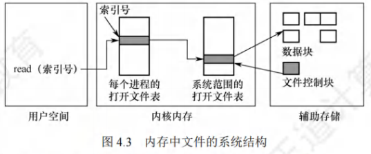

​	文件名不必是打开文件表的一部分，因为一旦完成对FCB在磁盘上的定位，系统就不再使用文件名。对于访问打开文件表的索引号，UNIX称之为文件描述符，而Windows称之为文件句柄。因此，只要文件未被关闭，所有文件操作都是通过文件描述符(不是文件名)来进行。

​	每个打开文件都具有如下关联信息：

1. 文件指针。系统跟踪上次的读写位置作为当前文件位置的指针，这种指针对打开文件的某上个进程来说是唯一的，因此必须与磁盘文件属性分开保存。
2. 文件打开计数。计数器跟踪当前文件打开和关闭的数量。因为多个进程可能打开同一个文件，所以系统在删除打开文件条目之前，必须等待最后一个进程关闭文件。
3. 文件磁盘位置。大多数文件操作要求系统修改文件数据。查找磁盘上的文件所需的信息保存在内存中，以便系统不必为每个操作都从磁盘上读取该信息。
4. 访问权限。每个进程打开文件都需要有一个访问模式(创建、只读、读写、添加等)。该信息保存在进程的打开文件表中，以便操作系统能够允许或拒绝后续的I/O请求。

### 文件保护

​	为了防止文件共享可能会导致文件被破坏或未经核准的用户修改文件，文件系统必须控制用户对文件的存取，即解决对文件的读、写、执行的许可问题。

​	必须在文件系统中建立相应的文件保护机制，可以通过口令保护、加密保护和访问控制等方式实现。其中，口令和加密是为了防止用户文件被他人存取或窃取，而访问控制则用于控制用户对文件的访问方式。

#### 访问类型

​	对文件的保护可从限制对文件的访问类型中出发。可加以控制的访问类型主要有以下几种。

1. 读。从文件中读。
2. 写。向文件中写。
3. 执行。将文件装入内存并执行。
4. 添加。将新信息添加到文件结尾部分。
5. 删除。删除文件，释放空间。
6. 列表清单。列出文件名和文件属性。

​	此外还可以对文件的重命名、复制、编辑等加以控制。这些高层的功能可以通过系统程序调用低层系统调用来实现。保护可以只在低层提供。

#### 访问控制

​	解决访问控制最常用的方法是根据用户身份进行控制。而实现基于身份访问的最为普通的方法是，为每个文件和目录增加一个访问控制列表(Access-Control List， ACL)，以规定每个用户名及其所允许的访问类型。

​	优点：可以使用复杂的访问方法

​	缺点：长度无法预计并且可能导致复杂的空间管理，使用精简的访问列表可以解决这个问题。

#### 文件访问控制表的结构

​	精简的访问控制列表可采用拥有者、组和其他三种用户类型。

1. 拥有者。创建文件的用户。
2. 组。一组需要共享文件且具有类似访问的用户。
3. 其他。系统内的所有其他用户。

​	每项占用一个二进制位，这样只需用矩阵即可描述这三类用户的访问权限。

​	创建文件时，系统将文件拥有者的名字、所属组名记录在该文件的FCB中。

​	用户访问该文件时，若用户是文件主，按照文件主所拥有的权限访问文件；

​	若用户和文件主在同一个用户组，则按照同组权限访问，否则只能按其他用户权限访问。

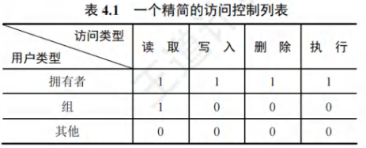

​	口令和密码是另外两种访问控制方法。

​	口令指用户在建立一个文件时提供一个口令，系统为其建立FCB时附上相应口令，同时告诉允许共享该文件的其他用户。用户请求访问时必须提供相应的口令。这种方法时间和空间的开销不多，缺点是口令直接存在系统内部，不够安全。

​	密码指用户对文件进行加密，文件被访问时需要使用密钥。这种方法保密性强，节省了存储空间，不过编码和译码要花费一定的时间。

​	口令和密码都是防止用户文件被他人存取或窃取，并没有控制用户对文件的访问类型。

​	对于多级目录结构而言，不仅需要保护单个文件，而且需要保护子目录内的文件，即需要提供目录保护机制。目录操作与文件操作并不相同，因此需要不同的保护机制。

### 文件的逻辑结构

​	文件的逻辑结构是指从用户角度出发所看到的文件的组织形式。

​	文件的物理结构(又称存储结构)是指将文件存储在外存上的存储组织形式，是用户所看不见的。

​	文件的逻辑结构与存储介质特性无关，它实际上是指在文件的内部，数据在逻辑上是如何组织起来的。

​	按逻辑结构，文件可划分为无结构文件和有结构文件两大类。

#### 无结构文件

​	无结构文件是最简单的文件组织形式，它是由字符流构成的文件，所以又称流式文件，其长度以字节为单位。对流式文件的访问，是通过读/写指针来指出下一个要访问的字节的。在系统中运行的大量源程序、可执行文件、库函数等，所采用的就是无结构文件。由于无结构文件没有结构，因而对记录的访问只能通过穷举搜索的方式，因此这种文件形式对很多应用不适用。

#### 有结构文件

​	有结构文件是指由一个以上的记录构成的文件，所以又称记录式文件。各记录由相同或不同数目的数据项组成，根据各记录的长度是否相等，可分为定长记录和变长记录两种。

1. 定长记录。文件中所有记录的长度都是相同的，各数据项都在记录中的相同位置，具有相同的长度。检索记录的速度快，方便用户对文件进行处理，广泛用于数据处理中。
2. 变长记录。文件中各记录的长度不一定相同，原因可能是记录中所包含的数据项数目不同，也可能是数据项本身的长度不定。检索记录只能顺序查找，速度慢。

​	有结构文件按记录的组织形式可以分为顺序文件、索引文件、索引顺序文件。

- 顺序文件

​	文件中的记录一个接一个地顺序排列，记录可以是定长记录或变长记录。顺序文件中记录的排列有两种结构：

1. 串结构，各记录之间的顺序与关键字无关，通常是按存入的先后时间进行排列，检索时必须从头开始顺序依次查找，比较费时；
2. 顺序结构，所有记录按关键字顺序排列，对于定长记录的顺序文件，检索时可采用折半查找，效率较高。

​	在对记录进行批量操作，即每次要读或写一大批记录时，顺序文件的效率是所有逻辑文件中最高的。此外，对于顺序存储设备(如磁带)，也只有顺序文件才能被存储并能有效地工作。在经常需要查找、修改、增加或删除单个记录的场合，顺序文件的性能较差。

- 索引文件

​	对于定长记录的顺序文件，要查找第$i$条记录，可直接根据下式计算得到第i条记录相对于第1条记录的地址：$A_i = i \times L$。然而，对于变长记录的顺序文件，要查找第i条记录，必须顺序地查找前$i-1$条记录，以获得相应记录的长度L，进而按下式计算出第i条记录的地址：
$$
A_i = \sum_{i=1}^{i-1} L_i+1
$$
​	变长记录的顺序文件只能顺序查找，效率较低。为此，可以建立一张索引表，为主文件的每个记录在索引表中分别设置一个索引表项，其中包含指向记录的指针和记录长度，索引表按关键字排序，因此其本身也是一个定长记录的顺序文件，如图4.4所示。这样就将对变长记录顺序文件的顺序检索，转变成了对定长记录索引文件的随机检索，从而加快了记录的检索速度。

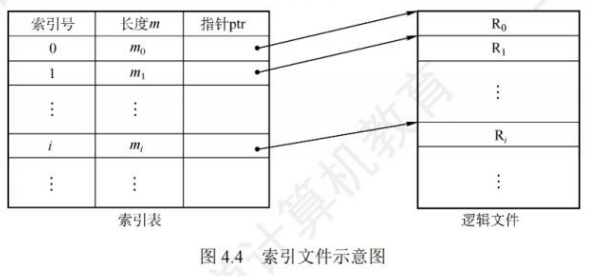

​	索引文件由于需要配置索引表，且每个记录都要有一个索引项，因此增加了存储开销。

- 索引顺序文件

​	索引顺序文件是顺序文件和索引文件的结合。最简单的索引顺序文件只使用了一级索引，先将变长记录顺序文件中的所有记录分为若干组，然后为文件建立一张索引表，并为每组中的第一个记录建立一个索引项，其中包含该记录的关键字和指向该记录的指针。

​	如图4.5所示，主文件包含姓名和其他数据项，姓名为关键字，记录按姓名的首字母分组，同一个组内的关键字可以无序，但是组与组之间的关键字必须有序。将每组的第一个记录的姓名及其逻辑地址放入索引表，索引表按姓名递增排列。检索时，首先查找索引表，找该记录所在的组，然后在该组中使用顺序查找，就能很快地找到记录。

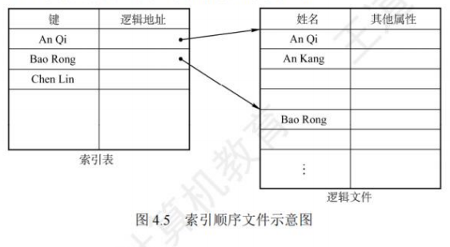

​	对于含有 N条记录的顺序文件，查找某关键字的记录时，平均需要查找$N/2$次。在索引顺序文件中，假设$N$条记录分为$\sqrt N$组，索引表中有$\sqrt N$个表项，每组有$\sqrt N$条记录，在查找某关键字的记录时，先顺序查找索引表，需要查找VN/2次，然后在主文件对应的组中顺序查找，也需要查找$\sqrt N/2$次，因此共需查找$\sqrt N/2+\sqrt N/2=\sqrt N$次。显然，索引顺序文件提高了查找效率，若记录数很多，则可采用两级或多级索引。这种方式就是数据结构中的分块查找。

​	索引文件和索引顺序文件都提高了查找速度，但都因配置索引表而增加了存储空间。

- 直接文件或散列文件(Hash File)

​	给定记录的键值或通过散列函数转换的键值直接决定记录的物理地址。散列文件具有很高的存取速度，但是会引起冲突，即不同关键字的散列函数值可能相同。

### 文件的物理结构

​	文件实际上是一种抽象数据类型，要研究它的逻辑结构、物理结构，以及关于它的一系列操作。文件的物理结构就是研究文件的实现，即文件数据在物理存储设备上是如何分布和组织的。

1. 文件的分配方式，是对磁盘非空闲块的管理；
2. 文件存储空间管理，是对磁盘空闲块的管理。

#### 连续分配

​	连续分配方法要求每个文件在磁盘上占有一组连续的块。

​	磁盘地址定义了磁盘上的一个线性排序，这种排序使进程访问磁盘时需要的寻道数和寻道时间最小。

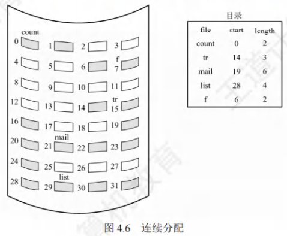

​	采用连续分配时，逻辑文件中的记录也顺序存储在相邻的物理块中。一个文件的目录项中应记录该文件的第一个磁盘块的块号和所占用的块数。若文件长n块并从位置b开始，则该文件将占有块$b,b+1,b+2,···,b+n-1$，要访问文件的第$i$块，可直接访问块$b+i-1$

- 连续分配的优点：支持顺序访问和直接访问(即随机访问) ；连续分配的文件在顺序访问时速度最快不方便文件拓展；

- 连续分配的缺点：存储空间利用率低,会产生磁盘碎片。

#### 链接分配

​	链接分配是一种采用离散分配的方式。

- 链式分配的优点：

1. 消除了磁盘的外部碎片，提高了磁盘的利用率。
2. 便于动态地为文件分配盘块，无须事先知道文件的大小。
3. 文件的插入、删除和修改也非常方便。

​	链接分配又可分为隐式链接和显式链接两种形式。

- 隐式链接

​	目录项中含有文件第一块的指针(盘块号)和最后一块的指针。每个文件对应一个磁盘块的链表，磁盘块分布在磁盘的任何地方。除文件的最后一个盘块外，每个盘块都存有指向文件下一个盘块的指针，这些指针对用户是透明的。

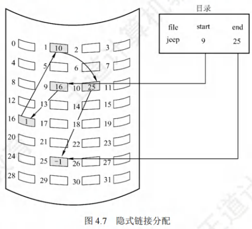

- 隐式链接的缺点：

1. 只支持顺序访问，若要访问文件的第i块，则只能从第1块开始，通过盘块指针顺序查找到第i块，随机访问效率很低。
2. 稳定性问题，文件盘块中的任何一个指针出问题，都会导致文件数据的丢失。
3. 指向下一个盘块的指针也要耗费一定的存储空间。

​	为了提高查找速度和减小指针所占用的存储空间，可以将几个盘块组成一个簇，按簇而不按块来分配，可以大幅地减少查找时间，也可以改善许多算法的磁盘访问时间。比如一簇为4块，这样，指针所占的磁盘空间比例也要小得多。这种方法的代价是增加了内部碎片。

- 显式链接

​	显式链接是指将用于链接文件各物理块的指针，显式地存放在内存的一张链接表中，该表在整个磁盘中仅设置一张，称为文件分配表(File Allocation Table，FAT)。

​	每个表项中存放指向下一个盘块的指针。文件目录中只需记录该文件的起始块号，后续块号可通过查 FAT找到。

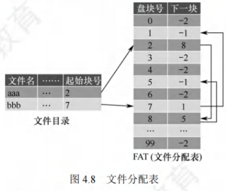

​	FAT的表项与全部磁盘块一一对应，并且可以用一个特殊的数字$-1$表示文件的最后一块，可以用$-2$表示这个磁盘块是空闲的(当然也可指定为$-3$，$-4$)。FAT还标记了空闲的磁盘块，操作系统可以通过FAT对磁盘空闲空间进行管理。当某进程请求系统分配一个磁盘块时，系统只需从FAT中找到$-2$的表项，并将对应的磁盘块分配给该进程即可。

- 显式链接的优点：

1. 支持顺序访问，也支持直接访问，要访问第$i$块，无须依次访问前$i-1$块；
2. FAT在系统启动时就被读入内存，检索记录是在内存中进行的，因而不仅显著提高了检索速度，而且明显减少了访问磁盘的次数。

- 显式链接的缺点：FAT需要占用一定的内存空间。

#### 索引分配

- 单级索引分配方式

​	在打开某个文件时，只需将该文件对应的盘块的编号调入内存即可，完全没有必要将整个FAT调入内存。为此，应该将每个文件所有的盘块号集中地放在一起，当访问到某个文件时，将该文件对应的盘块号一起调入内存即可，这就是索引分配的思想。它为每个文件分配一个索引块(表)，将分配给该文件的所有盘块号都记录在该索引块中。

​	索引分配的优点是支持直接访问，当要访问第i块时，索引块的第i个条目指向的便是文件的第i个块。索引分配也不会产生外部碎片。缺点是索引块增加了额外的存储空间开销。

​	索引块的主要问题是：每个文件必须有一个索引块，当文件很小时，比如只有数个盘块，该方式仍为之分配一个索引块，此时索引块的利用率很低；当文件很大时，若其盘块号需要占用若干索引块，此时可通过链指针将各索引块按序链接起来，但这种方法是低效的。

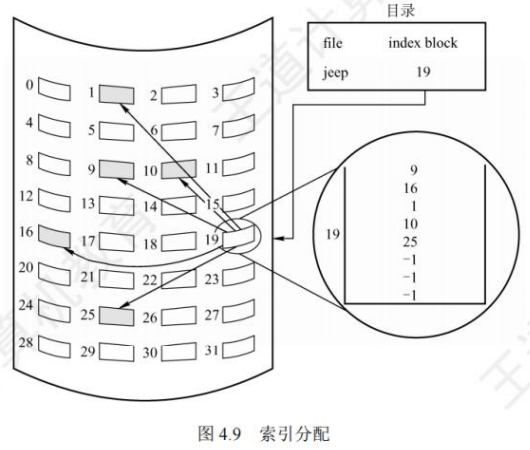

- 多级索引分配方式

​	当文件太大而索引块太多时，应该为这些索引块再建立一级索引，称为主索引，将第一个索引块的盘块号、第二个索引块的盘块号……填入该主索引表，这样，便形成了二级索引分配方式，其原理类似于内存管理中的多级页表。查找时，通过主索引查找第二级索引，再通过第二级索引查找所需数据块。如果文件非常大，那么还可使用三级、四级索引分配方式。

- 多级索引的优点：极大加快了对大型文件的查找速度。

- 多级索引的缺点：当访问一个盘块时，其所要启动磁盘的次数随着索引级数的增加而增多，即使是对数量众多的小文件也是如此。

- 混合索引分配方式

​	为了能够较全面地照顾到小型、中型、大型和特大型文件，可采用混合索引分配方式。对于小文件，为了提高对众多小文件的访问速度，最好能将它们的每个盘块地址直接放入FCB，这样就可以直接从FCB中获得该文件的盘块地址，即为直接寻址。对于中型文件，可以采用单级索引分配，需要先从FCB中找到该文件的索引表，从中获得该文件的盘块地址，即为一次间址。对于大型或特大型文件，可以采用两级和三级索引分配。UNIX系统采用的就是这种分配方式，在其索引节点中，共设有 13 个地址项，即`i.addr(0)~i.addr(12)`。

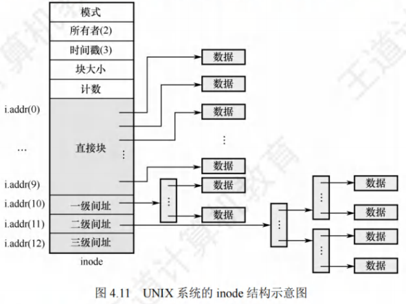

1. 直接地址。为了提高对小文件的检索速度，在索引节点中可设置 10 个直接地址项，即用`i.addr(0)~i.addr(9)`来存放直接地址，即文件数据块的盘块号。假如每个盘块的大小为4KB，当文件不大于40KB时，便可直接从索引节点中读出该文件的全部盘块号。
2. 一次间接地址。对于中、大型文件，只采用直接地址并不现实的。为此，可再利用索引节点中的地址项 `i.addr(10)`来提供一次间接地址，即采用一级索引分配。一次间接地址中记录了文件的一次间址块号，一次间址块就是索引块，其中记录了文件数据块的盘块号。一次间址块中可以存放1024个盘块号，可以表示 $1K\times4KB=4MB$大小的文件。因此，同时采用直接地址和一次间址，允许的文件最大长度为$4MB+40KB$。
3. 多次间接地址。当文件长度大于$4MB+40KB$时，还需利用地址项`i.addr(11)`来提供二次间接地址，即采用两级索引分配。二次间接地址中记录了文件的主索引块号，主索引块中记录了文件的一次间址块号。当地址项`i.addr(11)`作为二次间址块时，可以表示$1K\times1K\times4KB=4GB$大小的文件。因此，同时采用直接地址、一次间址和二次间址时，允许的文件最大长度为$4GB+4MB+40KB$。同理，同时采用直接地址、一次间址、二次间址和三次间址时，允许的文件最大长度为$4TB + 4GB + 4MB + 40KB$.

## 目录

### 目录的基本概念

​	FCB的有序集合称为文件目录，一个FCB就是一个文件目录项。与文件管理系统和文件集合相关联的是文件目录，它包含有关文件的属性、位置和所有权等。

​	首先来看目录管理的基本要求：从用户的角度看，目录在用户(应用程序)所需要的文件名基和文件之间提供一种映射，所以目录管理要实现“按名存取”；目录存取的效率直接影响到系统的性能，所以要提高对目录的检索速度；在多用户系统中，应允许多个用户共享一个文件，因此目录还需要提供用于控制访问文件的信息。此外，应允许不同用户对不同文件采用相同的名字，以便于用户按自己的习惯给文件命名，目录管理通过树形结构来解决和实现。

### 目录结构

#### 单级目录结构

​	在整个文件系统中只建立一张目录表，每个文件占一个目录项。

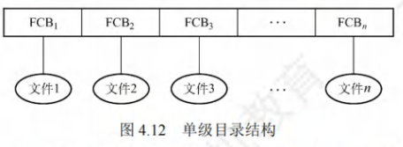

​	当建立一个新文件时，必须先检索所有目录项，以确保没有“重名”的情况，然后在该目录中增设一项，将新文件的属性信息填入该项。当访问一个文件时，先按文件名在该目录中查找到相应的FCB，经合法性检查后执行相应的操作。当删除一个文件时，先从该目录中找到该文件的目录项，回收该文件所占用的存储空间，然后清除该目录项。

​	单级目录结构实现了“按名存取”，但是存在查找速度慢、文件不允许重名、不便于文件共享等缺点，而且对于多用户的操作系统显然是不适用的。

#### 两级目标结构

​	为了克服单级目录所存在的缺点，可以采用两级方案，将文件目录分成主文件目录(Master File Directory， MFD)和用户文件目录(User File Directory，UFD)两级。

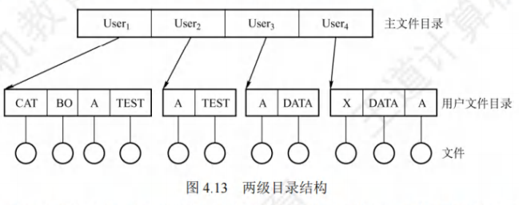

​	主文件目录项记录用户名及相应用户文件目录所在的存储位置。用户文件目录项记录该用户所有文件的FCB。当某用户欲对其文件进行访问时，只需搜索该用户对应的UFD，这既解决了不同用户文件的“重名”问题，又在一定程度上保证了文件的安全。

​	两级目录结构提高了检索的速度，解决了多用户之间的文件重名问题，文件系统可以在目录上实现访问限制。但是两级目录结构缺乏灵活性，不能对文件分类。

#### 树形目录结构

​	将两级目录结构加以推广，就形成了树形目录结构，如图4.14所示。它可以明显地提高对目录的检索速度和文件系统的性能。当用户要访问某个文件时，用文件的路径名标识文件，文件路径名是个字符串，由从根目录出发到所找文件通路上所有目录名与数据文件名用分隔符“/”链接而成。从根目录出发的路径称为绝对路径，系统中的每个文件都有唯一的路径名。由于一个进程在运行时，其所访问的文件大多局限于某个范围，当层次较多时，每次从根目录查询会浪费时间，于是可为每个进程设置一个当前目录(又称工作目录)，此时进程对各文件的访问都只须相对于当前目录而进行。当用户要访问某个文件时，使用相对路径名标识文件，相对路径由从当前目录出发到所找文件通路上所有目录名与数据文件名用分隔符"/”链接而成。

​	图4.14是Linux操作系统的目录结构，`/dev/hda`就是一个绝对路径。若当前目录为`/bin`，则`.ls`就是一个相对路径，其中符号`.`表示当前工作目录。

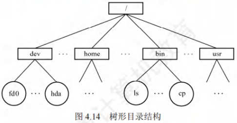

​	每个用户都有各自的“当前目录”，登录后自动进入该用户的“当前目录”。操作系统提供一个专门的系统调用，供用户随时改变“当前目录”。例如，在UNIX系统中，`/etc/passwd`文件就包含有用户登录时默认的“当前目录”，可用`cd`命令改变“当前目录”。树形目录结构可以很方便地对文件进行分类，层次结构清晰，也能够更有效地进行文件的管理和保护。在树形目录中，不同性质、不同用户的文件，可以分别呈现在系统目录树的不同层次或不同子树中，很容易地赋予不同的存取权限。但是，在树形目录中查找一个文件，需要按路径名逐级访问中间节点，增加了磁盘访问次数，这无疑会影响查询速度。目前，大多数操作系统如UNIX、Linux 和Windows系统都采用了树形文件目录。

#### 无环图目录结构

​	树形目录结构能便于实现文件分类，但不便于实现文件共享，为此在树形目录结构的基础上增加一些指向同一节点的有向边，使整个目录成为一个有向无环图。这种结构允许目录共享子目录或文件，同一个文件或子目录可以出现在两个或多个目录中。

​	当某用户要求删除一个共享节点时，若系统只是简单地将它删除，则当另一共享用户需要访问时，会因无法找到这个文件而发生错误。为此，可为每个共享节点设置一个共享计数器，每当图中增加对该节点的共享链时，计数器加1；每当某用户提出删除该节点时，计数器减1.仅当共享计数器为0时，才真正删除该节点，否则仅删除请求用户的共享链。

​	无环图目录结构方便地实现了文件的共享，但使得系统的管理变得更加复杂。

### 目录的操作

​	在理解一个文件系统的需求前，我们首先考虑在目录这个层次上所需要执行的操作，这有助于后面文件系统的整体理解。

1. 搜索。当用户使用一个文件时，需要搜索目录，以找到该文件的对应目录项。
2. 创建文件。当创建一个新文件时，需要在目录中增加一个目录项。
3. 删除文件。当删除一个文件时，需要在目录中删除相应的目录项。
4. 创建目录。在树形目录结构中，用户可创建自己的用户文件目录，并可再创建子目录。
5. 删除目录。有两种方式： 
   1. 不删除非空目录，删除时要先删除目录中的所有文件，并递归式地删除子目录。
   2. 可删除非空目录，目录中的文件和子目录同时被删除。
6. 移动目录。将文件或子目录在不同的父目录之间移动，文件的路径名也会随之改变。
7. 显示目录。用户可以请求显示目录的内容，如显示该用户目录中的所有文件及属性。
8. 修改目录。某些文件属性保存在目录中，因而这些属性的变化需要改变相应的目录项。

### 目录实现

​	在访问一个文件时，操作系统利用路径名找到相应目录项，目录项中提供了查找文件磁盘块所需要的信息。目录实现的基本方法有线性列表和哈希表两种，要注意目录的实现就是为了查找，因此线性列表实现对应线性查找，哈希表的实现对应散列查找。

- 线性列表

​	最简单的目录实现方法是，采用文件名和数据块指针的线性列表。当创建新文件时，必须首先搜索目录以确定没有同名的文件存在，然后在目录中增加一个新的目录项。当删除文件时，则根据给定的文件名搜索目录，然后释放分配给它的空间。当要重用目录项时有许多种方法：可以将目录项标记为不再使用，或将它加到空闲目录项的列表上，还可以将目录的最后一个目录项复制到空闲位置，并减少目录的长度。采用链表结构可以减少删除文件的时间。

​	线性列表的优点在于实现简单，不过由于线性表的特殊性，查找比较费时。

- 哈希表

​	除了采用线性列表存储文件目录项，还可以采用哈希数据结构。哈希表根据文件名得到一个值，并返回一个指向线性列表中元素的指针。这种方法的优点是查找非常迅速，插入和删除也较简单，不过需要一些措施来避免冲突(两个文件名称哈希到同一位置)。

​	目录查询是通过在磁盘上反复搜索完成的，需要不断地进行I/O操作，开销较大。所以如前所述，为了减少I/O操作，将当前使用的文件目录复制到内存，以后要使用该文件时只需在内存中操作，因此降低了磁盘操作次数，提高了系统速度。

### 文件共享

​	文件共享使多个用户共享同一个文件，系统中只需保留该文件的一个副本。若系统不能提供共享功能，则每个需要该文件的用户都要有各自的副本，会造成对存储空间的极大浪费。

​	前面介绍了无环图目录，基于该结构可以实现文件共享，当建立链接关系时，必须将被共享文件的物理地址(盘块号)复制到相应的目录。如果某个用户向该文件添加新数据，且需要增加新盘块，那么这些新增的盘块只出现在执行操作的目录中，对其他共享用户是不可见的。

#### 基于索引节点的共享方式(硬链接)

​	硬链接是基于索引节点的共享方式，它将文件的物理地址和属性等信息不再放在目录项中，而是放在索引节点中，在文件目录中只设置文件名及指向相应索引节点的指针。在用户A和B的文件目录中，都设置有指向共享文件的索引节点指针。在索引节点中还有一个链接计数count，也称引用计数，表示链接到本索引节点(即文件)上的用户目录项的数目。当count = 2时，表示有两个用户目录项链接到本文件上，即有两个用户共享此文件。

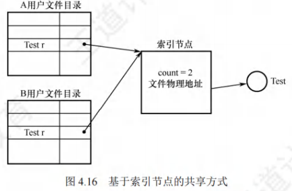

​	用户A创建一个新文件时，他便是该文件的所有者，此时将count置为1。用户B要共享此文件时，在B的目录中增加一个目录项，并设置一个指针指向该文件的索引节点。此时，文件主仍然是用户A，count=2。

​	如果用户A不再需要此文件，不能直接将其删除，因为若删除了该文件，也必然删除了该文件的索引节点，这样便会使用户B的指针悬空，而B可能正在此文件上执行写操作，此时将因此半途而废。因此用户A不能删除此文件，只是将该文件的count减1，然后删除自己目录中的相应目录项。用户B仍可以使用该文件。当count=0时，表示没有用户使用该文件，才会删除该文件。如图4.17给出了用户B链接到文件上的前、后情况。

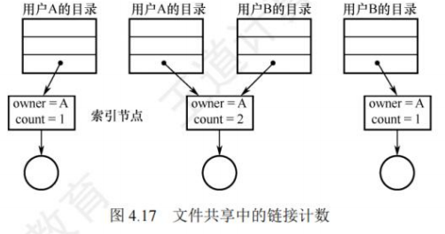

#### 利用符号链实现文件共享(软链接)

​	为使用户B能共享用户 A 的一个文件 F，可由系统创建一个 LINK 类型的新文件 L，并将文件L写入用户B 的目录，以实现B 的目录与文件F的链接。文件L中只含有被链接文件F的路径名。这种链接方法称为符号链接或软链接，它类似于Windows系统中的快捷方式。当用户B访问文件L时，操作系统看到要读的文件属于LINK类型，则根据其中记录的路径名去查询文件 F，然后对 F 进行读/写操作，从而实现用户B对文件 F 的共享。

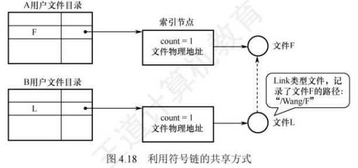

​	利用符号链方式实现文件共享时，只有文件主才拥有指向其索引节点的指针。而共享该文件的其他用户只有该文件的路径名，并不拥有指向其索引节点的指针。这样，也就不会发生在文件主删除一个共享文件后留下一个悬空指针的情况。当文件主将一个共享文件删除后，若其他用户又试图通过符号链去访问它时，则会访问失败，于是再将符号链删除，此时不会产生任何影响。

​	在符号链的共享方式中，当其他用户读共享文件时，系统根据文件路径名依次查找目录，直至找到该文件的索引节点。因此，每次访问共享文件时，都可能要多次地读盘，增大了访问文件的开销。此外，符号链接也是一个文件，其索引节点也要耗费一定的磁盘空间。

​	利用符号链实现网络文件共享时，只需提供该文件所在机器的网络地址及文件路径名。

​	文件共享，“软”“硬”兼施。硬链接就是多个指针指向一个索引节点，保证只要还有一个指针指向索引节点，索引节点就不能删除；软链接就是将到达共享文件的路径保存下来，当要访问文件时，根据路径寻找文件。可见，硬链接的查找速度要比软链接的快。

## 文件系统

### 文件系统结构

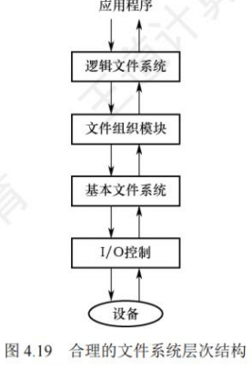

​	文件系统(File system)提供高效和便捷的磁盘访问，以便允许存储、定位、提取数据。文件系统有两个不同的设计问题：第一个问题是，定义文件系统的用户接口，它涉及定义文件及其属性、所允许的文件操作、如何组织文件的目录结构。第二个问题是，创建算法和数据结构，以便映射逻辑文件系统到物理外存设备。现代操作系统有多种文件系统类型，因此文件系统的层次结构也不尽相同。

- I/O控制层

​	包括设备驱动程序和中断处理程序，在内存和磁盘系统之间传输信息。设备驱动程序将输入的命令翻译成底层硬件的特定指令，硬件控制器利用这些指令使I/O设备与系统交互。设备驱动程序告诉I/O控制器对设备的什么位置采取什么动作。

- 基本文件系统

​	向对应的设备驱动程序发送通用命令，以读取和写入磁盘的物理块。每个物理块由磁盘地址标识。该层也管理内存缓冲区，并保存各种文件系统、目录和数据块的缓存。在进行磁盘块传输前，分配合适的缓冲区，并对缓冲区进行管理。管理它们对于系统性能的优化至关重要。

- 文件组织模块

​	组织文件及其逻辑块和物理块。文件组织模块可以将文件的逻辑块地址转换为物理块地址，每个文件的逻辑块从0到N编号，它与数据的物理块不匹配，因此需要通过转换来定位。文件组织模块还包括空闲空间管理器，以跟踪未分配的块，根据需求提供给文件组织模块。

- 逻辑文件系统

​	用于管理文件系统中的元数据信息。元数据包括文件系统的所有结构，而不包括实际数据(或文件内容)。逻辑文件系统管理目录结构，以便根据给定文件名为文件组织模块提供所需要的信息。它通过文件控制块来维护文件结构。逻辑文件系统还负责文件保护。

### 文件系统布局

#### 文件系统在磁盘中的结构

​	文件系统存放在磁盘上，多数磁盘划分为一个或多个分区，每个分区中有一个独立的文件系统。文件系统可能包括如下信息：启动存储在那里的操作系统的方式、总的块数、空闲块的数量和位置、目录结构以及各个具体文件等。图4.20所示为一个可能的文件系统布局。

1. 主引导记录(Master Boot Record，MBR)，位于磁盘的0号扇区，用来引导计算机，MBR的后面是分区表，该表给出每个分区的起始和结束地址。表中的一个分区被标记为活动分区。当计算机启动时，BIOS读入并执行 MBR。MBR 做的第一件事是确定活动分区，读入它的第一块，即引导块。
2. 引导块(boot block)，MBR执行引导块中的程序后，该程序负责启动该分区中的操作系统。每个分区都是统一从一个引导块开始，即使它不含有一个可启动的操作系统，也不排除以后会在该分区安装一个操作系统。Windows系统称之为分区引导扇区。除了从引导块开始，磁盘分区的布局是随着文件系统的不同而变化的。文件系统经常包含有如图 4.20 所列的一些项目。
3. 超级块(super block)，包含文件系统的所有关键信息，在计算机启动时，或者在该文件系统首次使用时，超级块会被读入内存。超级块中的典型信息包括分区的块的数量、块的大小、空闲块的数量和指针、空闲的FCB数量和FCB指针等。

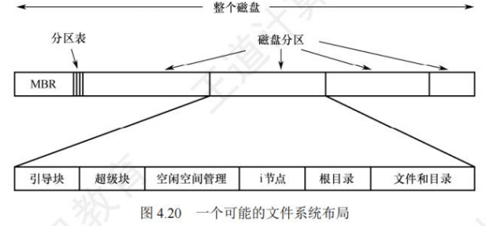

4. 文件系统中空闲块的信息，可以用位示图或指针链接的形式给出。后面也许跟的是一组i节点，每个文件对应一个节点， i节点说明了文件的方方面面。接着可能是根目录，它存放文件系统目录树的根部。最后，磁盘的其他部分存放了其他所有的目录和文件。

#### 文件系统在内存中的结构

​	内存中的信息用于管理文件系统并通过缓存来提高性能。这些数据在安装文件系统时被加载，在文件系统操作期间被更新，在卸载时被丢弃。这些结构的类型可能包括：

1. 内存中的安装表(mount table)，包含每个已安装文件系统分区的有关信息。
2. 内存中的目录结构的缓存，包含最近访问目录的信息。
3. 整个系统的打开文件表，包含每个打开文件的FCB副本、打开计数及其他信息。
4. 每个进程的打开文件表，包含进程打开文件的文件描述符(Windows称之为文件句柄)和指向整个系统的打开文件表中对应表项的指针。

### 外存空闲空间管理

​	一个存储设备可以按整体用于文件系统，也可以细分。例如，一个磁盘可以划分为2个分区，每个分区都可以有单独的文件系统。包含文件系统的分区通常称为卷(volume)。卷可以是磁盘的一部分，也可以是整个磁盘，还可以是多个磁盘组成RAID集。

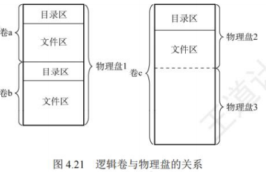

​	在一个卷中，存放文件数据的空间(文件区)和FCB的空间(目录区)是分离的。由于存在很多种类的文件表示和存放格式，所以现代操作系统中一般都有很多不同的文件管理模块，通过它们可以访问不同格式的卷中的文件。卷在提供文件服务前，必须由对应的文件程序进行初始化，划分好目录区和文件区，建立空闲空间管理表格及存放卷信息的超级块。

#### 空闲表法

​	空闲表法属于连续分配方式，它与内存的动态分区分配类似，为每个文件分配一块连续的存储空间。系统为外存上的所有空闲区建立一张空闲表，每个空闲区对应一个空闲表项，其中包括表项序号、该空闲区的第一个空闲盘块号、该空闲区的空闲盘块数等信息。再将所有空闲区按其起始盘块号递增的次序排列。

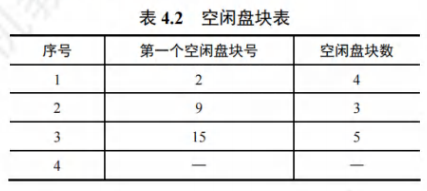

- 盘块的分配：

空闲盘区的分配与内存的动态分配类似，也是采用首次适应算法、最佳适应算法等。例如，在系统为某新创建的文件分配空闲盘块时，先顺序地检索空闲盘块表的各表项，直至找到第一个其大小能满足要求的空闲区，再将该盘区分配给用户，同时修改空闲盘块表。

- 盘块的回收：

在对用户所释放的存储空间进行回收时，也采用类似于内存回收的方法，即要考虑回收区是否与空闲盘块表中插入点的前区和后区相邻接，对相邻接者应予以合并。空闲表法的优点是具有较高的分配速度，可减少访问磁盘的I/O频率。对于较小的文件(1~5个盘块)，可以采用连续分配方式为文件分配几个相邻的盘块。

#### 空闲链表法

​	空闲链表法是指将所有空闲盘区拉成一条空闲链，可分为以下两种。

- 空闲盘块链

​	空闲盘块链是指将磁盘上的所有空闲空间以盘块为单位拉成一条链。每个盘块都有指向下一个空闲盘块的指针。当用户请求分配存储空间时，系统从链首开始，依次摘下适当数目的空闲盘块分配给用户。当用户释放存储空间时，系统将回收的盘块依次插入空闲盘块链的末尾。

​	空闲盘块链的优点：分配和回收一个盘块的过程非常简单。

​	空闲盘块链的缺点：在为一个文件分配盘块时可能要重复操作多次，效率较低：又因它是以盘块为单位的，空闲盘块链会很长。

- 空闲盘区链

​	空闲盘区链是指将磁盘上的所有空闲盘区拉成一条链，每个盘区包含若干相邻的盘块。每个盘区含有下一个空闲盘区的指针和本盘区的盘块数。分配盘区的方法与内存的动态分区分配类似，通常采用首次适应算法。回收盘区时，同样也要将回收区与相邻接的空闲盘区合并。

​	空闲盘区链的优点：分配与回收的效率较高，且空闲盘区链较短。

​	空闲盘区链的缺点：分配与回收的过程比较复杂。

#### 位示图法

​	位示图是利用二进制的一位来表示磁盘中一个盘块的使用情况，磁盘上的所有盘块都有一个二进制位与之对应。当其值为“0”时，表示对应的盘块空闲；为“1”时，表示已分配。这样，一个$m \times n$位组成的位示图就可用来表示$m \times n$个盘块的使用情况，如图4.22所示。

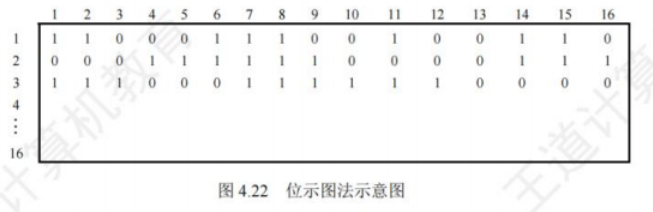

- 盘块的分配：

1. 顺序扫描位示图，从中找出一个或一组其值为“0”的二进制位。
2. 将找到的一个或一组二进制位转换成与之对应的盘块号。假设找到值为“0”的二进制位处在位示图的第i行、第j列，则其对应的盘块号应按下式计算(n为每行位数)：

$$
b = n(i-1)+j
$$

3. 修改位示图，令`map[i, j]=1`。

- 盘块的回收：

1. 将回收盘块的盘块号转换成位示图中的行号和列号。转换公式为：

$$
i=(b-1) DIV n+1
$$

$$
j= (b-1) MOD n + 1
$$

2. 修改位示图，令`map[i, j]=1`。

​	位示图法的优点：很容易在位示图中找到一个或一组相邻接的空闲盘块。由于位示图很小，占用空间少，因此可将它保存在内存中，从而节省许多磁盘启动的开销。

​	位示图法的缺点：位示图大小会随着磁盘容量的增加而增大，因此常用于小型计算机。

#### 成组链接法

​	空闲表法和空闲链表法都不适用于大型文件系统，因为这会使空闲表或空闲链表太大。UNIX系统中采用的是成组链接法，它结合了上述两种方法的思想而克服“表太长”的缺点。

​	成组链接法的思想：将空闲盘块分成若干组，如100个盘块作为一组，每组的第一个盘块记录下一组的空闲盘块总数和空闲盘块号。这样，由各组的第一个盘块可以链接成一条链。第一组的空闲盘块总数和空闲盘块号保存在内存的专用栈中，称为空闲盘块号栈。假设系统空闲区为第201-7999号盘块，则第一组的盘块号为201-300……次末组的盘块号为7801~7900，最末一组的盘块号为7901～7999。最末一组只有 99 个盘块，它们的块号记录在前一组的 7900 号盘块中，该块中存放的第一个盘块号是“0”，以作为空闲盘块链的结束标志。

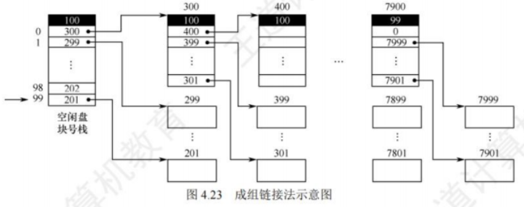

​	简而言之，每组(除了最后一组)的第一块作为索引块，然后将这些索引块链接起来。

- 盘块的分配：

​	根据空闲盘块号栈的指针，将与之对应的盘块分配给用户，同时移动指针。若该指针指向的是栈底的盘块号，则由于该盘块号对应的盘块中保存的是下一组空闲盘块号，因此要将该盘块的内容读入栈中，作为新的空闲盘块号栈的内容，并将原栈底盘块号对应的盘块分配出去(其中有用的数据已读入栈中)。最后，将栈中的空闲盘块数减1。

- 盘块的回收：

​	将回收的盘块号存入空闲盘块号栈的顶部，同时移动指针，并将栈中的空闲盘块数加1。当栈中的空闲盘块数已达 100 时，表示栈已满，将现有栈中的 100个空闲盘块号存入新回收的盘块，并将新回收的盘块号作为新栈底，再将栈中的空闲盘块数置为 1。

​	表示空闲空间的位向量表或空闲盘块号栈，以及卷中的目录区、文件区划分信息都要存放在磁盘中，一般放在卷头位置，在UNIX系统中称为超级块。在对卷中的文件进行操作前，超级块要预先读入内存，并且经常保持主存超级块与磁盘卷中超级块的一致性。

### 虚拟文件系统

​	虚拟文件系统(VFS)屏蔽了不同文件系统的差异和操作细节，向上为用户提供了文件操作的统一调用接口，如图4.24所示。当用户程序访问文件时，通过VFS提供的统一调用函数(如`open()`等)来操作不同文件系统的文件，而无须考虑具体的文件系统和实际的存储介质。

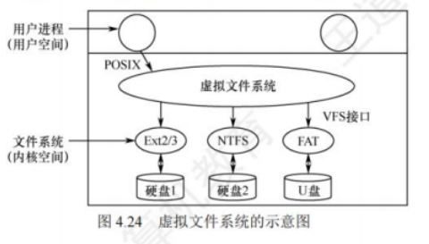

​	虚拟文件系统采用了面向对象的思想，它抽象出一个通用的文件系统模型，定义了通用文件系统都支持的接口。新的文件系统只要支持并实现这些接口，即可安装和使用。为了实现虚拟文件系统，系统抽象了四种对象类型。每个对象都包含数据和函数指针，这些函数指针指向操作这些数据的文件系统的实现函数。这四种对象类型如下。

- 超级块对象

​	表示一个已安装(或称挂载)的特定文件系统。超级块对象对应于磁盘上特定扇区的文件系统超级块，用于存储已安装文件系统的元信息。其操作方法包含一系列可在超级块对象上调用的操作函数，主要有分配`inode`、销毁 `inode`、读`inode`、写`inode`等。

- 索引节点对象

​	表示一个特定的文件。索引节点和文件是一对一的关系。只有当文件被访问时，才在内存中创建索引节点对象，每个索引节点对象都会复制磁盘索引节点包含的一些数据。索引节点对象还提供许多操作函数，如创建新索引节点、创建硬链接、创建新目录等。

- 目录项对象

​	表示一个特定的目录项。目录项对象是一个路径的组成部分，它包含指向关联索引节点的指针，还包含指向父目录和指向子目录的指针。不同于前面两个对象，目录项对象在磁盘上没有对应的数据结构，而是 VFS在遍历路径的过程中，将它们逐个解析成目录项对象的。

- 文件对象

​	表示一个与进程相关的已打开文件。可以通过调用`open()`打开一个文件，通过调用`close()`关闭一个文件。文件对象和物理文件的关系类似于进程和程序的关系。文件对象仅是进程视角上代表已打开的文件，它反过来指向其索引节点。文件对象包含与该文件相关联的目录项对象，包含该文件的文件系统、文件指针等，还包含在该文件对象上的一系列操作函数。当进程发起一个面向文件的系统调用时，内核调用VFS中的一个函数，该函数调用目标文件系统中的相应函数，将文件系统请求转换到面向设备的指令。以在用户空间调用`write()`为例，它在VFS中通过`sys_write()`函数处理，`sys_write()`找到具体文件系统提供的写方法，将控制权交给该文件系统，最后由该文件系统与物理介质交互并写入数据，如图4.25所示。

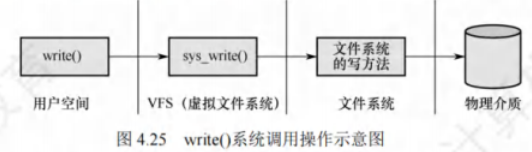

​	对用户来说，不需要关心不同文件系统的具体实现细节，只需要对一个虚拟的文件操作界面进行操作。VFS对每个文件系统的所有细节进行抽象，使得不同的文件系统在系统中运行的进程看来都是相同的。严格来说，VFS并不是一种实际的文件系统，它只存在于内存中，不存在于任何外存空间中。VFS在系统启动时建立，在系统关闭时消亡。

### 文件系统挂载

​	如文件在使用前要打开那样，文件系统在进程使用之前必须先安装，也称挂载(Mounting)。将设备中的文件系统挂载到某个目录后，就可通过这个目录来访问设备上的文件。注意，这里的设备指的是逻辑上的设备，如一个磁盘上的不同分区都可视为不同的设备。

​	Windows 系统维护一个扩展的两级目录结构，用驱动器字母表示设备和卷。卷具有常规树结构的目录，与驱动器号相关联，还含有指向已安装文件系统的指针。特定文件的路径形式为`driverletter:\path\to\file`，访问时，操作系统找到相应文件系统的指针，并遍历该设备的目录结构，以查找指定的文件。新版的Windows允许文件系统安装在目录树下的任意位置，就像UNIX一样。在启动时，Windows操作系统自动发现所有设备，并且安装所有找到的文件系统。

​	UNIX使用系统的根文件系统，它是在系统启动时直接安装的，也是内核映像所在的文件系统。除了根文件系统，所有其他文件系统都要先挂载到根文件系统中的某个目录后才能访问。其他文件系统要么在系统初始化时自动安装，要么由用户挂载在已安装文件系统的目录下。安装文件系统的这个目录称为安装点，同一个设备可以有多个安装点，同一个安装点同时只能挂载一个设备。将设备挂载到安装点之后，通过该目录就可以读取该设备中的数据。

​	假定将存放在磁盘`/dev/fdo`上的ext2文件系统通过`mount`命令安装到`/flp:`
​		`mount -t ext2 /dev/fdo/flp`
​	如需卸载该文件系统，可以使用`umount`命令。
