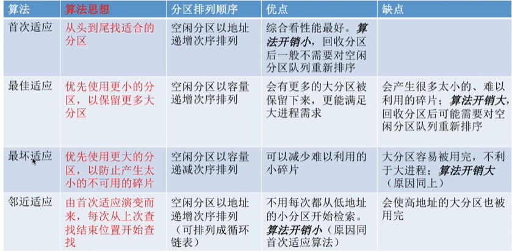
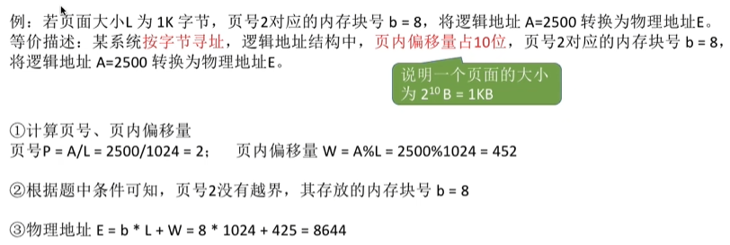
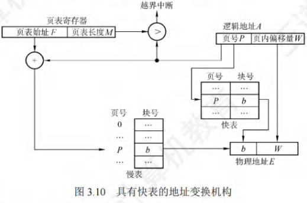
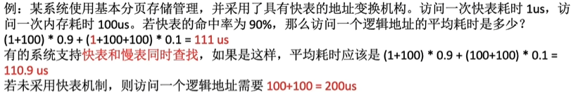
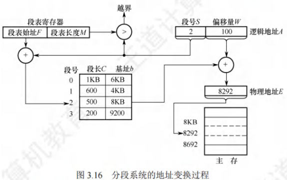
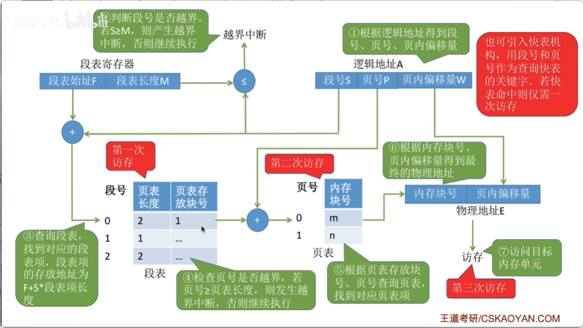

# 内存管理

## 内存管理

### 概念

#### 进程运行的基本原理和要求

### 连续分配管理方式

#### 单一连续分配

#### 固定分区分配

#### 动态分区分配(重点)

### 基本分页存储管理(重点)

#### 概念

#### 基本地址变换机构

在系统中设置一个页表寄存器(PTR)，存放页表在内存的$始址F$和$页表长度M$。单CPU系统中只设置一个页表寄存器。设$页面大小L$，$逻辑地址 A$到$物理地址E$的变换过程如下(假设逻辑地址、页号、每页的长度都是十进制数)：

1. 根据逻辑地址计算出页号$P=A/L$、页内偏移量$W=A\%L$。
2. 判断页号是否越界，若$页号P\geq页表长度M$，则产生越界中断，否则继续执行。
3. 在页表中查询页号对应的页表项，确定页面存放的物理块号。$页号P对应的页表项地址=页表始址F+页号P\times页表项长度$，取出该$页表项内容b$，即为页框号。
4. 计算$物理地址E=b\times L+W$，用$物理地址E$去访存。注意，$物理地址=页面在内存中的始址+页内偏移量$，$页面在内存中的始址 = 块号×块大小(页面大小)$。

#### 具有快表的地址变换机构

​	在具有快表的分页机制中，地址的变换过程如下：

1. CPU给出逻辑地址后，由硬件进行地址转换，将页号与快表中的所有页号进行比较。
2. 若找到匹配的页号，说明要访问的页表项在快表中有副本，则直接从中取出该页对应的页框号，与页内偏移量拼接形成物理地址。这样，存取数据仅一次访存即可实现。
3. 若未找到匹配的页号，则需要访问主存中的页表，读出页表项后，应同时将其存入快表，以便后面可能的再次访问。若快表已满，则须按照特定的算法淘汰一个旧页表项。

#### 两级页表

### 基本分段存储管理

#### 概念

#### 地址变换机构

​	系统中设置了一个段表寄存器，用于存放$段表始址F$和$段表长度M$。从$逻辑地址A$到$物理地址E$之间的地址变换过程如下：

1. 从$逻辑地址A$中取出前几位为$段号S$，后几位为$段内偏移量 W$。
2. 判断段号是否越界，若$段号S\geq 段表长度M$，则产生越界中断，否则继续执行。
3. 在段表中查询段号对应的段表项，$段号S对应的段表项地址 = 段表始址 F+ 段号 S\times 段表项长度$。取出段表项中该段的$段长C$，若$W \geq C$，则产生越界中断，否则继续执行。
4. 取出段表项中该段的$始址b$，计算物理地址$E=b+W$，用$物理地址E$去访存。

#### 分页和分段的对比

#### 段的共享与保护

### 段页式存储管理

## 虚拟内存管理

### 概念

### 请求分页管理方式

#### 页表机制

#### 缺页中断机构

#### 地址变换机构

### 页框管理

#### 驻留集大小

#### 内存分配策略

#### 物理块调入算法

#### 调入页面的时机

#### 从何处调入页面

#### 如何调入页面

### 页面置换算法(重点)

#### 最佳置换算法(OPT)

#### 先进先出页面置换算法(FIFO)

#### 最近最久未使用置换算法(LRU)

#### 时钟置换算法(CLOCK)

### 抖动和工作集

#### 抖动

#### 工作集

### 内存映射文件

