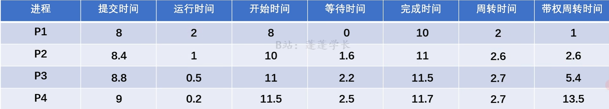
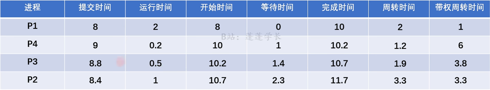
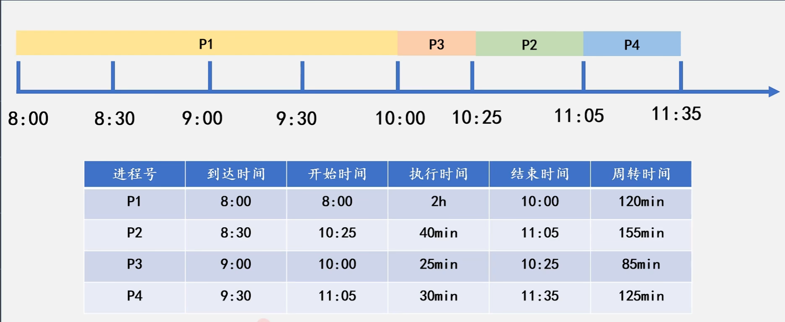
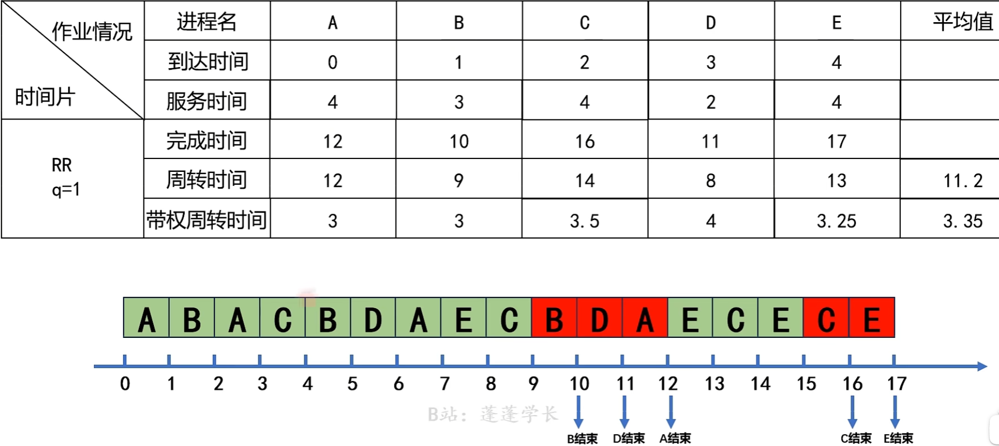

# 进程与线程

## 进程

### 进程引入

### 进程定义

### 进程特征

### 进程组成

#### 进程控制块

#### 程序段

#### 数据段

### 进程状态

### 状态转换

### 进程控制

创建 终止 阻塞 唤醒 挂起 激活 

### 进程通信

## 进程同步(重点)

### 概念

### 同步与互斥的实现

### 互斥锁

```c
semaphore mutex = 1;
```

当mutex为0时，阻塞。

当mutex为1时，唤醒。

### 信号量

#### 整型信号量

`wait()`可简写为`P()`

`signal()`可简写为`V()`

```c
wait(S){
    While(S<=0);
    S--;
}

signal(S){
    S++;
}
```

#### 记录型信号量

```c
typedef struct{
    int value;
    struct process *L;
}semaphore;

void wait(semaphore S){
    S.value--;
    if(S.value < 0){
        //add this process to S.L;
        block(S.L);
    }
}

void signal(Semaphore S){
    S.value++;
    if(S.value <= 0){
        //remove a process P from S.L;
        wakeup(P);
    }
}
```

### 管程

### 进程同步问题

- 步骤

1. 找出进程
2. 找出临界区
3. 找同步关系
4. 定义信号量，写伪代码

- 注意：互斥锁要在访问临界区之后

#### 生产者-消费者问题

```c
semaphore mutex=1;	//临界区互斥信号量
semaphore empty=n;	//空闲缓冲区
semaphore ful1=0;	//缓冲区初始化为空
producer(){		//生产者进程
    while (1){
        produce an item in nextp;//生产数据
        P(empty);//获取空缓冲区单元
        P(mutex);//进入临界区
        add nextp to buffer; //将数据放入缓冲区
        V(mutex);//离开临界区，释放互斥信号量
        V(full);//满缓冲区数加 1
    }
}

consumer(){		//消费者进程
    while(1){
        P(full);//获取满缓冲区单元
        P(mutex);//进入临界区
        remove an item from buffer; //从缓冲区取出数据
        V(mutex);//离开临界区，释放互斥信号量
        V(empty);//空缓冲区数加1
        consume the item;//消费数据
    }
}
```

#### 哲学家进食问题

#### 读者-写者问题

#### 吸烟者问题

## 线程

### 概念

### 比较

### 属性

### 状态与转换

### 组织与控制

### 实现方式

### 多进程模型

## CPU调度

### 概念

### 层次与联系

### 实现

### 目标

### 进程切换

### 调度算法(重点)

#### 做题方法：

1. 先依次列出：到达，服务，开始，等待，完成，周转，带权周转时间项。

2. 按照算法，推出运行顺序，画出数轴。
3. 计算时间。

#### 公式

开始时间：由*提交时间*，*运行时间*，*上一个作业的开始时间*计算

等待时间：$调度开始时间-提交时间$

完成时间：$服务时间+开始时间$

周转时间：$完成时间-提交时间$ 

带权周转时间：$周转时间 \div 服务时间$

#### 先来先服务FCFS



运行顺序：按照到达顺序。

缺点：只考虑了作业的等待时间，忽略了作业运行时间。

#### 短作业优先SJF



运行顺序：每次调度时，运行时间短的优先。

缺点：只考虑了作业的运行时间，忽略了作业等待时间。

#### 高响应比优先

高响应比：$R_p = \frac{等待时间+服务时间}{服务时间} = 1+\frac{等待时间}{服务时间}$



#### 时间片调度算法

​	维护一个队列，将到达的进程加入队列，每次取队列头部进程。时间片结束后，若未完成，则将进程加入队列中，再加入新到达的进程。



#### 优先级调度算法

运行顺序：按照优先级排序。

### 实时调度

## 死锁

### 概念

### 死锁预防

### 死锁避免(重点)

- 写出安全序列

1. 计算Available
2. 填表

| 进程 | Work | Allocation | Need | W+A  |
| :--: | :--: | :--------: | :--: | :--: |
|  P0  |      |            |      |      |
|  P1  |      |            |      |      |
|  P2  |      |            |      |      |
|  P3  |      |            |      |      |
|  P4  |      |            |      |      |

3. 写安全序列

- 进程请求资源

1. $Request(A,B,C) \leq Available(A1,B2,C3)$
2. $Request(A,B,C) \leq Need(A2,B2,C2)$

3. 求安全序列

### 死锁检测

### 死锁解除