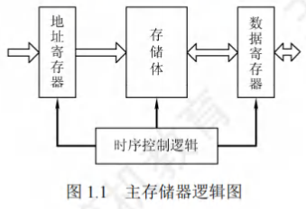
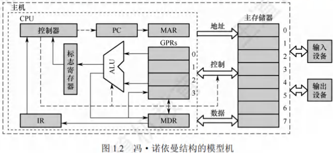
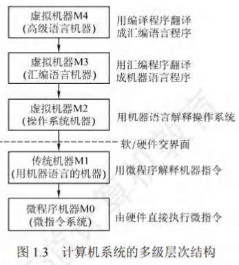
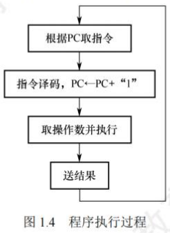
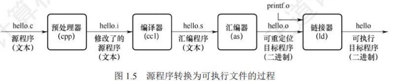

# 计算机系统概述

## 计算机发展历程(考纲中删除)

### 计算机硬件的发展

#### 计算机的四代变化

从1946年世界上第一台电子数字计算机(ElectronicNumerical Integrator And Computer, ENIAC)问世以来，计算机的发展已经经历了四代。
1. **第一代计算机(1946-1957年)——电子管时代**：
    - 特点：逻辑元件采用**电子管**；使用机器语言进行编程；主存储器用延迟线或磁鼓存储信息，容量极小；体积庞大，成本高；运算速度较低，一般只有几千次到几万次每秒。
2. **第二代计算机(1958-1964年)——晶体管时代**：
    - 特点：逻辑元件采用**晶体管**；运算速度提高到几万次到几十万次每秒；主存储器使用**磁芯存储器**；计算机软件也得到了发展，开始出现了高级语言及其编译程序，有了操作系统的雏形。
3. **第三代计算机(1965-1971年)——中小规模集成电路时代**：
    - 特点：逻辑元件采用**中小规模集成电路**；半导体存储器开始取代磁芯存储器；高级语言发展迅速，操作系统也进一步发展，开始有了分时操作系统。
4. **第四代计算机(1972年至今)——超大规模集成电路时代**：
    - 特点：逻辑元件采用**大规模集成电路和超大规模集成电路**，产生了**微处理器**；诸如并行、流水线、高速缓存和虚拟存储器等概念用在了这代计算机中。

#### 计算机元件的更新换代

1. **摩尔定律**：当价格不变时，集成电路上可容纳的晶体管数目，约每隔18个月便会增加一倍，性能也将提升一倍。也就是说，我们现在和18个月后花同样的钱买到的CPU，后者的性能是前者的两倍。这一定律揭示了信息技术进步的速度。
2. **半导体存储器的发展**：1970年，美国仙童半导体公司生产出第一个较大容量的半导体存储器，至今，半导体存储器经历了11代：单芯片1KB、4KB、16KB、64KB、256KB、1MB、4MB、16MB、64MB、256MB和现在的1GB。
3. **微处理器的发展**：自1971年Intel公司开发出第一个微处理器Intel4004至今，微处理器经历了Intel 8008(8位)、Intel 8086(16位)、Intel 80386(32位)、Pentium(32位)、Pentium III (64位)、Pentium 4 (64位)、Core i7(64位)等。这里的32位、64位指的是**机器字长**，是指计算机进行一次整数运算所能处理的二进制数据的位数。

### 计算机软件的发展

计算机软件技术的蓬勃发展，也为计算机系统的发展做出了很大的贡献。
1. **计算机语言的发展**：经历了面向机器的**机器语言和汇编语言**、面向问题的**高级语言**。其中高级语言的发展真正促进了软件的发展，它经历了从科学计算和工程计算的FORTRAN、结构化程序设计的PASCAL到面向对象的C++和适应网络环境的Java。
2. **系统软件的发展**：与此同时，直接影响计算机系统性能提升的各种系统软件也有了长足的发展，特别是操作系统，如Windows、UNIX、Linux等。 

## 计算机系统的层次结构

### 计算机系统的组成

硬件系统和软件系统共同构成了一个完整的计算机系统。
- **硬件**：指有形的物理设备，是计算机系统中实际物理装置的总称。
- **软件**：指在硬件上运行的程序和相关的数据及文档。

计算机系统性能的好坏，很大程度上由软件的效率和作用来表征，而软件性能的发挥离不开硬件的支持。对某一功能来说，若其既可用软件实现，又可用硬件实现，则称为软/硬件在逻辑功能上是等价的。在设计计算机系统时，要进行软/硬件的功能分配。通常，一个功能若使用频繁且硬件实现成本理想，用硬件解决可提高效率。

### 计算机硬件

#### 冯·诺依曼机基本思想

冯·诺依曼在研究EDVAC机时提出了"存储程序"的概念，“存储程序”的思想奠定了现代计算机的基本结构，以此概念为基础的各类计算机统称冯·诺依曼机，其特点如下：
1. 采用**“存储程序”的工作方式**。
2. 计算机硬件系统由**运算器、存储器、控制器、输入设备和输出设备**5大部件组成。
3. 指令和数据以同等地位存储在存储器中，形式上没有区别，但计算机应能区分它们。
4. 指令和数据均用**二进制代码表示**。
5. 指令由**操作码和地址码**组成，操作码指出操作的类型，地址码指出操作数的地址。

“存储程序”的基本思想是：将事先编制好的程序和原始数据送入主存储器后才能执行，一旦程序被启动执行，就无须操作人员的干预，计算机会自动逐条执行指令，直至程序执行结束。

#### 计算机的功能部件

(1) **输入设备**
输入设备的主要功能是将程序和数据以机器所能识别和接受的信息形式输入计算机。最常用也最基本的输入设备是键盘，此外还有鼠标、扫描仪、摄像机等。

(2) **输出设备**
输出设备的任务是将计算机处理的结果以人们所能接受的形式或其他系统所要求的信息形式输出。最常用、最基本的输出设备是显示器、打印机。输入/输出设备(简称I/O设备)是计算机与外界联系的桥梁，是计算机中不可缺少的重要组成部分。

(3) **存储器**
存储器分为**主存储器(也称内存储器或主存)和辅助存储器(也称外存储器或外存)**。CPU能够直接访问的存储器是主存储器。辅助存储器用于帮助主存储器记忆更多的信息，辅助存储器中的信息必须调入主存储器后，才能为CPU所访问。主存储器的工作方式是按存储单元的地址进行存取，这种存取方式称为按地址存取方式。

主存储器的最基本组成：存储体存放二进制信息，**存储器地址寄存器(MAR)**存放访存地址，经过地址译码后找到所选的存储单元。**存储器数据寄存器(MDR)**用于暂存要从存储器中读或写的信息，时序控制逻辑用于产生存储器操作所需的各种时序信号。

存储体由许多存储单元组成，每个存储单元包含若干存储元件，每个存储元件存储一位二进制代码“0”或“1”。因此存储单元可存储一串二进制代码，称这串代码为存储字，称这串代码的位数为存储字长，存储字长可以是1B(8bit)或是字节的偶数倍。
- MAR用于寻址，其位数反映最多可寻址的存储单元的个数，如MAR为10位，则最多有$2^{10}=1024$个存储单元，记为1K。MAR的长度与PC的长度相等。
- MDR的位数通常等于存储字长，一般为字节的2次幂的整数倍。

注意：MAR与MDR虽然是存储器的一部分，但在现代计算机中却是存在于CPU中的；另外，后文提到的高速缓存(Cache)也存在于CPU中。

(4) **运算器**
运算器是计算机的执行部件，用于进行**算术运算和逻辑运算**。算术运算是按算术运算规则进行的运算，如加、减、乘、除；逻辑运算包括与、或、非、异或、比较、移位等运算。

运算器的核心是**算术逻辑单元(Arithmetic and Logic Unit, ALU)**。运算器包含若干通用寄存器，用于暂存操作数和中间结果，如累加器(ACC)、乘商寄存器(MQ)、操作数寄存器(X)、变址寄存器(IX)、基址寄存器(BR)等，其中前三个寄存器是必须具备的。

运算器内还有**程序状态寄存器(PSW)，也称标志寄存器**，用于存放ALU运算得到的一些标志信息或处理机的状态信息，如结果是否溢出、有无产生进位或借位、结果是否为负等。

(5) **控制器**
控制器是计算机的指挥中心，由其“指挥”各部件自动协调地进行工作。控制器由**程序计数器(PC)、指令寄存器(IR)和控制单元(CU)**组成。
- PC用来存放当前欲执行指令的地址，具有自动加1的功能(这里的“1”指一条指令的长度)，即可自动形成下一条指令的地址，它与主存储器的MAR之间有一条直接通路。
- IR用来存放当前的指令，其内容来自主存储器的MDR。指令中的操作码OP(IR)送至CU，用以分析指令并发出各种微操作命令序列；而地址码Ad(IR)送往MAR，用以取操作数。

一般将运算器和控制器集成到同一个芯片上，称为**中央处理器(CPU)**。CPU和主存储器共同构成主机，而除主机外的其他硬件装置(外存、I/O设备等)统称外部设备，简称外设。

图12所示为冯·诺依曼结构的模型机。CPU包含ALU、通用寄存器组GPRS、标志寄存器、控制器、指令寄存器IR、程序计数器PC、存储器地址寄存器MAR和存储器数据寄存器MDR。
图中从控制器送出的虚线就是控制信号，可以控制如何修改PC以得到下一条指令的地址，可以控制ALU执行什么运算，可以控制主存储器是进行读操作还是写操作(读/写控制信号)。

CPU和主存储器之间通过一组总线相连，总线中有地址、控制和数据3组信号线。MAR中的地址信息会直接送到地址线上，用于指向读/写操作的主存储器存储单元；控制线中有读/写信号线，指出数据是从CPU写入主存储器还是从主存储器读出到CPU，根据是读操作还是写操作来控制将MDR中的数据是直接送到数据线上还是将数据线上的数据接收到MDR中。 

### 计算机软件

#### 系统软件和应用软件

软件按其功能分类，可分为**系统软件和应用软件**。
- **系统软件**：是一组保证计算机系统高效、正确运行的基础软件，通常作为系统资源提供给用户使用。主要有操作系统(OS)、数据库管理系统(DBMS)、语言处理程序、分布式软件系统、网络软件系统、标准库程序、服务性程序等。
- **应用软件**：指用户为解决某个应用领域中的各类问题而编制的程序，如各种科学计算类程序、工程设计类程序、数据统计与处理程序等。

在本学科范畴内，编写诸如操作系统、编译程序等各种系统软件的人员称为系统程序员；利用计算机及所支持的系统软件来编写解决具体应用问题的人员称为应用程序员。

#### 三个级别的语言

1. **机器语言**：也称二进制代码语言，需要编程人员记忆每条指令的二进制编码。是计算机唯一可以直接识别和执行的语言。
2. **汇编语言**：用英文单词或其缩写代替二进制的指令代码，更容易为人们记忆和理解。使用汇编语言编辑的程序，必须经过一个称为汇编程序的系统软件的翻译，将其转换为机器语言程序后，才能在计算机的硬件系统上执行。
3. **高级语言**：（如C、C++、Java等）为方便程序设计人员写出解决问题的处理方案和解题过程的程序。通常高级语言需要经过编译程序编译成汇编语言程序，然后经过汇编操作得到机器语言程序，或直接由高级语言程序翻译成机器语言程序。

因此计算机无法直接理解和执行高级语言程序，所以需要将高级语言程序转换为机器语言程序，通常把进行这种转换的软件系统称翻译程序。翻译程序有以下三类：
1. **汇编程序(汇编器)**：将汇编语言程序翻译成机器语言程序。
2. **解释程序(解释器)**：将源程序中的语句按执行顺序逐条翻译成机器指令并立即执行。
3. **编译程序(编译器)**：将高级语言程序翻译成汇编语言或机器语言程序。

#### 软件和硬件的逻辑功能等价性

硬件实现的往往是最基本的算术和逻辑运算功能，而其他功能大多通过软件的扩充得以实现。对某一功能来说，既可以由硬件实现，又可以由软件实现，从用户的角度来看，它们在功能上是等价的。这一等价性被称为**软/硬件逻辑功能的等价性**。例如，浮点数运算既可以用专门的浮点运算器硬件实现，又可以通过一段子程序实现，这两种方法在功能上完全等效，不同的只是执行时间的长短而已，显然硬件实现的性能要优于软件实现的性能。

软件和硬件逻辑功能的等价性是计算机系统设计的重要依据，软件和硬件的功能分配及其界面的确定是计算机系统结构研究的重要内容。当研制一台计算机时，设计者必须明确分配每一级的任务，确定哪些功能使用硬件实现，哪些功能使用软件实现。软件和硬件功能界面的划分是由设计目标、性能价格比、技术水平等综合因素决定的。

### 计算机系统的层次结构

计算机是一个硬软件组成的综合体。因为面对的应用范围越来越广，所以必须有复杂的系统软件和硬件的支持。由于软/硬件的设计者和使用者从不同的角度、用不同的语言来对待同一个计算机系统，因此他们看到的计算机系统的属性对计算机系统提出的要求也就各不相同。

计算机系统的多级层次结构的作用，就是针对上述情况，根据从各种角度所看到的机器之间的有机联系，来分清彼此之间的界面，明确各自的功能，以便构成合理、高效的计算机系统。

关于计算机系统层次结构的分层方式，目前尚无统一的标准，这里采用如图1.3所示的层次结构。

1. **第1级是微程序机器层**：这是一个实在的硬件层，它由机器硬件直接执行微指令。
2. **第2级是传统机器语言层**：它也是一个实际的机器层，由微程序字解释机器指令系统。
3. **第3级是操作系统层**：它由操作系统程序实现。操作系统程序是由机器指令和广义指令组成的，这些广义指令是为了扩展机器功能而设置的，是由操作系统定义和解释的软件指令，所以这一层也称混合层。
4. **第4级是汇编语言层**：这一层由汇编程序支持和执行，借此可编写汇编语言源程序。
5. **第5级是高级语言层**：它是面向用户的，是为方便用户编写应用程序而设置的。该层由各种高级语言编译程序支持和执行。在高级语言层之上，还可以有应用程序层，它由解决实际问题的处理程序组成，如文字处理软件、多媒体处理软件和办公自动化软件等。

没有配备软件的纯硬件系统称**裸机**。第3层~第5层称为**虚拟机**，简单来说就是软件实现的机器。虚拟机器只对该层的观察者存在，这里的分层和计算机网络的分层类似，对于某层的观察者来说，只能通过该层的语言来了解和使用计算机，而不必关心下层是如何工作的。

层次之间的关系紧密，**下层是上层的基础，上层是下层的扩展**。

软件和硬件之间的界面就是**指令集体系结构(ISA)**，ISA定义了一台计算机可以执行的所有指令的集合，每条指令规定了计算机执行什么操作，以及所处理的操作数存放的地址空间和操作数类型。可以看出，ISA是指软件能感知到的部分，也称软件可见部分。

本门课程主要讨论传统机器M1和微程序机器M0的组成原理及设计思想。 

### 计算机系统的工作原理

#### "存储程序"工作方式

**“存储程序”工作方式**规定，程序执行前，需要将程序所含的指令和数据送入主存储器，一旦程序被启动执行，就无须操作人员的干预，自动逐条完成指令的取出和执行任务。如图1.4所示，一个程序的执行就是周而复始地执行一条一条指令的过程。每条指令的执行过程包括：从主存储器中取指令、对指令进行译码、计算下条指令地址、取操作数并执行、将结果送回存储器。

程序执行前，先将程序第一条指令的地址存放到PC中，取指令时，将PC的内容作为地址访问主存储器。在每条指令执行过程中，都需要计算下条将执行指令的地址，并送至PC。若当前指令为顺序型指令，则下条指令地址为PC的内容加上当前指令的长度；若当前指令为跳转型指令，则下条指令地址为指令中指定的目标地址。当前指令执行完后，根据PC的内容到主存储器中取出的是下一条将要执行的指令，因而计算机能周而复始地自动取出并执行一条一条的指令。

#### 从源程序到可执行文件

在计算机中编写的C语言程序，都必须被转换为一系列的低级机器指令，这些指令按照一种称为可执行目标文件的格式打好包，并以二进制磁盘文件的形式存放起来。

以UNIX系统中的GCC编译器程序为例，读取源程序文件hello.c，并把它翻译成一个可执行目标文件hello，整个翻译过程可分为四个阶段完成：
1. **预处理阶段**：预处理器(cpp)对源程序中以字符#开头的命令进行处理，例如将#include命令后面的.h文件内容插入程序文件。输出结果是一个以.i为扩展名的源文件hello.i。
2. **编译阶段**：编译器(ccl)对预处理后的源程序进行编译，生成一个汇编语言源程序hello.s。汇编语言源程序中的每条语句都以一种文本格式描述了一条低级机器语言指令。
3. **汇编阶段**：汇编器(as)将hello.s翻译成机器语言指令，把这些指令打包成一个称为可重定位目标文件hello.o，它是一种二进制文件，因此用文本编辑器打开会显示乱码。
4. **链接阶段**：链接器(ld)将多个可重定位目标文件和标准库函数合并为一个可执行目标文件，简称可执行文件。本例中，链接器将hello.o和标准库函数printf所在的可重定位目标模块printf.o合并，生成可执行文件hello。最终生成的可执行文件被保存在磁盘上。

#### 指令执行过程的描述

可执行文件代码段是由一条一条机器指令构成的，**指令**是用0和1表示的一串0/1序列，用来指示CPU完成一个特定的原子操作。例如，取数指令从存储单元中取出一个数据送到CPU的寄存器中，存数指令将CPU寄存器的内容写入一个存储单元，ALU指令将两个寄存器的内容进行某种算术或逻辑运算后送到一个CPU寄存器中，等等。指令的执行过程在第5章中详细描述。

下面以取数指令(送至运算器的ACC中)为例来说明，其信息流程如下：
1. **取指令**：PC→MAR→MDR→IR
根据PC取指令到IR。将PC的内容送MAR，MAR中的内容直接送地址线，同时控制器将读信号送读/写信号线，主存储器根据地址线上的地址和读信号，从指定存储单元读出指令，送到数据线上，MDR从数据线接收指令信息，并传送到IR中。
2. **分析指令**：OP(IR)→CU
指令译码并送出控制信号。控制器根据IR中指令的操作码，生成相应的控制信号，送到不同的执行部件。在本例中，IR中是取数指令，因此读控制信号被送到总线的控制线上。
3. **执行指令**：Ad(IR)→MAR→MDR→MDR→ACC
取数操作。将IR中指令的地址码送MAR，MAR中的内容送地址线，同时控制器将读信号送读/写信号线，从主存储器中读出操作数，并通过数据线送至MDR，再传送到ACC中。

每取完一条指令，还须为取下条指令做准备，计算下条指令的地址，即(PC)+1→PC。
注意：(PC)指程序计数器PC中存放的内容。PC→MAR应理解为(PC)→MAR，即程序计数器中的值经过数据通路送到MAR，也即表示数据通路时括号可省略(因为只是表示数据流经的途径，而不强调数据本身的流动)。但运算时括号不能省略，即(PC)+1→PC不能写为PC+1→PC，当题目中(PC)→MAR的括号未省略时，最好也不要省略。 

## 计算机的性能指标

### 计算机的主要性能指标

#### 机器字长

通常所说的“某16位或32位机器”，其中的16、32指的是**机器字长**，简称字长。字长是指计算机进行一次整数运算（即定点整数运算）所能处理的二进制数据的位数，通常与CPU的寄存器位数、ALU有关。因此，字长一般等于通用寄存器的位数或ALU的宽度，**字长越长，数的表示范围越大，计算精度越高**。计算机字长通常选定为字节（8位）的整数倍。

#### 数据通路带宽

**数据通路带宽**是指数据总线一次所能并行传送信息的位数。这里所说的数据通路宽度是指外部数据总线的宽度，它与CPU内部的数据总线宽度（内部寄存器的大小）有可能不同。
注意：各个子系统通过数据总线连接形成的数据传送路径称为数据通路。

#### 主存容量

**主存容量**是指主存储器所能存储信息的最大容量，通常以字节来衡量，也可用字数×字长（如512K×16位）来表示存储容量。其中，MAR的位数反映了存储单元的个数，MDR的位数反映了存储单元的字长。例如，MAR为16位，表示$2^{16}=65536$，即此存储体内有65536个存储单元（可称为64K内存，$1K = 1024$），若MDR为32位，则表示存储容量为$64K×32$位。

#### 运算速度

(1) **吞吐量和响应时间**：

- **吞吐量**：指系统在单位时间内处理请求的数量。它取决于信息能多快地输入内存，CPU能多快地取指令，数据能多快地从内存取出或存入，以及所得结果能多快地从内存送给一台外部设备。几乎每步都关系到主存储器，因此系统吞吐量主要取决于主存储器的存取周期。
- **响应时间**：指从用户向计算机发送一个请求，到系统对该请求做出响应并获得所需结果的等待时间。通常包括CPU时间（运行一个程序所花费的时间）与等待时间（用于磁盘访问、存储器访问、I/O操作、操作系统开销等的时间）。

(2) **主频和CPU时钟周期**：

    - **CPU时钟周期**：机器内部主时钟脉冲信号的宽度，它是CPU工作的最小时间单位。时钟脉冲信号由机器脉冲源发出的脉冲信号经整形和分频后形成。时钟周期以相邻状态单元间组合逻辑电路的最大延迟为基准确定，也以指令流水线的每个流水段的最大延迟时间确定。
        - **主频(CPU时钟频率)**：机器内部主时钟的频率，即时钟周期的倒数，它是衡量机器速度的重要参数。对于同一个型号的计算机，其主频越高，完成指令的一个执行步骤所用的时间越短，执行指令的速度越快。主频最直观的理解就是每秒有多少个时钟周期。
        注意：$CPU时钟周期 = 1/主频$，主频通常以Hz(赫兹)为单位，$10Hz$表示每秒10次。

(3) **CPI(Cycle Per Instruction)**，即执行一条指令所需的时钟周期数。

不同指令的时钟周期数可能不同，因此对于一个程序或一台机器来说，其CPI指该程序或该机器指令集中的所有指令执行所需的平均时钟周期数，此时CPI是一个平均值。

**IPS(Instructions Per Second)**，即每秒执行多少条指令，$IPS = 主频/平均CPI$。

(4) **CPU执行时间**：指运行一个程序所花费的时间。

$CPU执行时间 = CPU时钟周期数/主频 = (指令条数×CPI)÷主频$。

上式表明，CPU的性能（CPU执行时间）取决于三个要素：主频、CPI和指令条数。主频、CPI和指令条数是相互制约的。例如，更改指令集可以减少程序所含的指令条数，但同时可能引起CPU结构的调整，从而可能会增加时钟周期的宽度（降低主频）。

【例1.1】假定计算机M1和M2具有相同的指令集体系结构，M1的主频为2GHz，程序P在M1上的运行时间为10s。M2采用新技术可使主频大幅提升，但平均CPI也增加到M1的1.5倍。则M2的主频至少提升到多少才能使程序P在M2上的运行时间缩短为6s?

解:

程序P在M1上的时钟周期数 = 指令条数×CPI = CPU执行时间×主频 = $10s×2GHz = 2×10^{10}$。
M2的平均CPI为M1的1.5倍，因此程序P在M2上的时钟周期数 = $1.5×2×10^{10}=3×10^{10}$。
要使程序P在M2上的运行时间缩短到6s，则M2的主频至少应为：
程序P所含时钟周期数÷CPU执行时间 = $3×10^{10}÷6s = 5GHz$。
由此可见，M2的主频是M1的2.5倍，但M2的速度却只是M1的1.67倍。

(5) **MIPS(Million Instructions Per Second)**，即每秒执行多少百万条指令。

$MIPS = 指令条数÷(执行时间×10^{6}) = 主频÷(CPI×10^{6})$。

MIPS对不同机器进行性能比较是有缺陷的，因为不同机器的指令集不同，指令的功能也就不同，比如在机器M1上某条指令的功能也许在机器M2上要用多条指令来完成；不同机器的CPI和时钟周期也不同，因而同一条指令在不同机器上所用的时间也不同。

**FLOPS(Floating-point Operations Per Second)**，即每秒执行多少次浮点运算。
**MFLOPS(Million FLOPS)**，即每秒执行多少百万（$10^{6}$）次浮点运算。
**GFLOPS(GigaFLOPS)**，即每秒执行多少十亿（$10^{9}$）次浮点运算。
**TFLOPS(TeraFLOPS)**，即每秒执行多少万亿（$10^{12}$）次浮点运算。
**PFLOPS(PetaFLOPS)**，即每秒执行多少千万亿（$10^{15}$）次浮点运算。
**EFLOPS(ExaFLOPS)**，即每秒执行多少百京（$10^{18}$）次浮点运算（$1京 = 1亿亿 = 10^{16}$）。
**ZFLOPS(ZettaFLOPS)**，即每秒执行多少十万京（$10^{21}$）次浮点运算。

注意：在描述存储容量、文件大小等时，K、M、G、T通常用2的幂次表示，如$1Kb = 2^{10}b$；在描述速率、频率等时，k、M、G、T通常用10的幂次表示，如$1kb/s = 10^{3}b/s$。通常前者用大写的K，后者用小写的k，但其他前缀均为大写，表示的含义取决于所用的场景。

#### **基准程序**

**基准程序(Benchmarks)**是专门用来进行性能评价的一组程序，能够很好地反映机器在运行实际负载时的性能，可以通过在不同机器上运行相同的基准程序来比较在不同机器上的运行时间，从而评测其性能。对于不同的应用场合，应该选择不同的基准程序。

使用基准程序进行计算机性能评测也存在一些缺陷，因为基准程序的性能可能与某一小段的短代码密切相关，而硬件系统设计人员或编译器开发者可能会针对这些代码片段进行特殊的优化，使得执行这段代码的速度非常快，以至于得不到准确的性能评测结果。

#### 几个专业术语

1) **系列机**：具有基本相同的体系结构，使用相同基本指令系统的多个不同型号的计算机组成的一个产品系列。
2) **兼容**：指软件或硬件的通用性，即运行在某个型号的计算机系统中的硬/软件也能应用于另一个型号的计算机系统时，称这两台计算机在硬件或软件上存在兼容性。
3) **固件**：将程序固化在ROM中组成的部件称为固件。固件是一种具有软件特性的硬件，吸收了软件/硬件各自的优点，其执行速度快于软件，灵活性优于硬件，是软/硬件结合的产物。例如，目前操作系统已实现了部分固化（把软件永恒地存储于ROM中）。 

