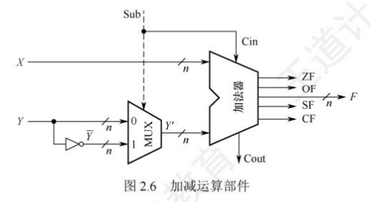

# 数据的表示和运算

## 数制与码制

### 进位计数制及其相互转换

在计算机系统内部，所有信息都采用二进制进行编码，主要原因如下：
1. **物理实现简单与成本低**：二进制仅有两种状态，借助具有两个稳定状态的物理器件就能轻松表示二进制数的每一位，例如利用高低电平或者电荷的正负极性来分别表示0和1，这使得制造成本相对较低。
2. **便于逻辑运算和判断**：二进制的1和0恰好与逻辑值“真”和“假”相对应，这为计算机实现逻辑运算以及程序中的逻辑判断提供了极大的便利条件。
3. **编码和运算规则简便**：二进制的编码和运算规则十分简单，通过逻辑门电路就能够方便快捷地实现算术运算。

#### 进位计数法

常见的进位计数法包含十进制、二进制、八进制以及十六进制等。其中，十进制是我们日常生活中最为常用的计数方式，而在计算机领域中，二进制、八进制和十六进制则更为常见。

在进位计数法里，每个数位所使用的不同数码的个数被称作基数。以十进制为例，其基数为10（即0~9这十个数码），遵循“逢十进一”的计数规则。就像十进制数101，个位上的1和百位上的1所代表的数值是截然不同的。每个数码所表示的实际数值等于该数码自身乘以一个与它所在数位相关的常数，这个常数就被称为位权。一个进位数的数值大小，就是它的各位数码按照位权相加的结果。

对于一个$r$进制数$(K_{n}K_{n - 1}\cdots K_{0}K_{-1}\cdots K_{-m})$，其数值可以表示为$K_{n}r^{n}+K_{n - 1}r^{n - 1}+\cdots+K_{0}r^{0}+K_{-1}r^{-1}+\cdots+K_{-m}r^{-m}$ 。在这个表达式中，$r$代表基数，$r^{i}$是第$i$位的位权，$K_{i}$的取值范围是$0,1,\cdots,r - 1$这$r$个数码中的任意一个。
1. **二进制**：在计算机中应用最为广泛的是基数为2的二进制计数制。二进制只有0和1这两种数码，计数规则是“逢二进一”。它的任意数位的位权为$2^{i}$，其中$i$表示所在的位数。
2. **八进制**：八进制的基数为8，拥有0~7共8个不同的数码，计数时遵循“逢八进一”的原则。由于$r = 8 = 2^{3}$，所以可以很方便地将二进制中的3位数码编为一组，对应1位八进制数码，二者之间的转换非常便捷。
3. **十六进制**：十六进制的基数是16，包含0~9、A~F共16个不同的数码，其中A~F分别代表10~15。其计数规则是“逢十六进一”。因为$r = 16 = 2^{4}$，所以4位二进制数码恰好与1位十六进制数码相对应。

为了标识一个数的进位计数制，我们通常采用后缀字母的方式：用B表示二进制，用O表示八进制，用D表示十进制（通常情况下，十进制的后缀D可以直接省略），用H表示十六进制。此外，有时也会用前缀$0x$来表示十六进制数。

#### 不同进制数之间的相互转换

1. 二进制与十进制
2. 二进制与八进制
3. 二进制与十六进制
4. 十进制与八进制
5. 十进制与十六进制
6. 八进制与十六进制

### 定点数的编码方式

#### 真值和机器数

在日常生活中，我们通常使用正号（正号在正数中可省略）和负号来分别表示正数和负数，例如 +15、-8 等。这种带有“+”或“-”符号的数被称为真值，它是机器数所代表的实际数值。

在计算机中，通常会将数的符号和数值部分一起进行编码，把数据的符号进行数字化处理，一般用“0”来表示“正”，用“1”来表示“负”。这种将符号“数字化”后的数就被称为机器数。常见的机器数表示法有原码、补码和反码。例如，$0,101$（这里的逗号“,”仅仅是为了区分符号位与数值位）表示的是 +5。

#### 机器数的定点表示

根据小数点在数中的位置是否固定，在计算机中存在两种数据格式：定点表示和浮点表示。在现代计算机系统中，通常使用补码整数来表示整数，用原码小数来表示浮点数的尾数部分，用移码来表示浮点数的阶码部分。历年的统考真题命题信息也主要集中在这个范畴内。

定点表示法主要用于表示定点小数和定点整数。
1. **定点小数**：定点小数属于纯小数，约定其小数点的位置在符号位之后、有效数值部分的最高位之前。若数据$X$的形式为$X = x_{0}x_{1}x_{2}\cdots x_{n}$（其中$x_{0}$为符号位，$x_{1}\sim x_{n}$是数值的有效部分，也称为尾数，$x_{1}$为最高有效位），那么它在计算机中的表示形式如图2.1所示。
2. **定点整数**：定点整数是纯整数，约定其小数点的位置在有效数值部分的最低位之后。若数据$X$的形式为$X = x_{0}x_{1}x_{2}\cdots x_{n}$（其中$x_{0}$为符号位，$x_{1}\sim x_{n}$是尾数，$x_{n}$为最低有效位），则它在计算机中的表示形式如图2.2所示。


实际上，在机器内部并不存在真正的小数点，小数点的位置是人为约定的。因此，在进行定点数的编码和运算时，我们无需考虑对应的定点数是小数还是整数，只需要关注它们的符号位和数值位就可以了。定点数的编码表示法主要有4种，分别是原码、补码、反码和移码。

#### 原码、补码、反码、移码

1. 原码表示法
2. 补码表示法
3. 反码表示法
4. 移码表示法

### 整数的表示

#### 无符号整数的表示

当一个编码的全部二进制位都作为数值位，而没有专门的符号位时，这个编码所表示的就是无符号整数，简称为无符号数。此时，默认该数的符号为正。由于无符号整数省略了一位符号位，所以在字长相同的情况下，它所能表示的最大数要比有符号整数所能表示的最大数大。一般来说，在全部是正数运算且不会出现负值结果的场合中，会使用无符号整数来表示数据。例如，无符号整数可以用于地址运算，或者用来表示指针。

举例来说，对于8位无符号整数，其最小数为$00000000$（对应的数值为0），最大数为$11111111$（对应的数值为$2^{8}-1 = 255$），所以它的表示范围是$0$到$255$；而对于8位有符号整数，最小数是$10000000$（对应的数值为$-2^{7}=-128$），最大数是$01111111$（对应的数值为$2^{7}-1 = 127$），其表示范围则是$-128$到$127$。

#### 有符号整数的表示

将数的符号进行数值化处理，并把符号位放置在有效数字的前面，这样就组成了有符号整数。虽然前面介绍的原码、补码、反码和移码都可以用来表示有符号整数，但是补码表示法具有明显的优势：
- **0的表示唯一性**：与原码和反码相比，0的补码表示是唯一的。
- **运算规则简便**：与原码和移码相比，补码的运算规则相对简单，并且符号位可以和数值位一起参与运算。
- **表示范围优势**：与原码和反码相比，补码能够多表示一个最小负数。

在计算机中，有符号整数都采用补码来表示，因此$n$位有符号整数的表示范围是$-2^{n - 1}$到$2^{n - 1}-1$。

### C语言中的整数类型及类型转换

根据统考大纲的要求，考生需要具备对高级程序设计语言（如C语言）中相关问题进行分析的能力。而C语言中变量之间的类型转换是统考中经常出现的题目，因此需要读者深入理解和掌握这部分内容。

#### C语言中的整型数据类型

C语言中的整型数据本质上就是定点整数。根据位数的不同，整型数据可以分为字符型（char，8位）、短整型（short或short int，16位）、整型（int，32位）、长整型（long或long int，在32位机器中为32位，在64位机器中为64位）。其中，char类型是整型数据中比较特殊的一种。对于其他类型，如short、int、long等，如果不指定signed/unsigned属性，它们默认都是有符号整数；而char类型默认是无符号整数。无符号整数（unsigned short、unsigned int、unsigned long）的全部二进制位都作为数值位，没有符号位，其数值相当于数的绝对值。

无论是signed型还是unsigned型的整型数据，它们都是按照补码的形式存储的。只不过，signed型的最高位代表符号位，而在unsigned型中，最高位表示的是数值位。正因为如此，这两种类型所表示的数据范围也有所不同。

#### 有符号数和无符号数的转换

C语言允许在不同的数据类型之间进行类型转换。强制类型转换的格式为“TYPEb=(TYPE)a” 。经过强制类型转换后，会返回一个具有TYPE类型的数值，但是这种操作并不会改变操作数本身。
1. **short型转换到unsigned short型**：当有符号数$x$是一个负数时，将其转换为无符号数$y$。例如，在采用补码的机器上，对于代码片段
   
    ```C++
    int main()
    {
        short x=-4321;
        unsigned short y=(unsigned short)x;
        printf("x=%d,y=%u\n", x,y);
    }
    ```
    程序的输出结果为“$x = -4321, y = 61215$，从输出结果来看，得到的$y$值似乎与原来的$x$值没有直接关系。然而，当我们将这两个数转换为二进制表示时，就会发现其中的规律：将short型强制转换为unsigned short型时，只是改变了数值的解释方式，而两个变量对应的每一位二进制位值都是相同的。这表明，强制类型转换的结果是保持位值不变，仅仅改变了对这些位的解释方式。
2. **unsigned short型转换到short型**：例如，对于代码片段“int main(){unsigned short x=65535;short y=(short)x;printf("x=%u, y=%d\n", x, y);}”，同样在采用补码的机器上，程序会输出“$x = 65535$” 。把这两个数转换为二进制表示后，可以进一步证实之前的结论。由此可知，当有符号数转换为等长的无符号数时，符号位会被解释为数值的一部分，负数转换为无符号数时数值将发生变化；同理，当无符号数转换为有符号数时，最高位会被解释为符号位，也可能导致数值发生变化。

需要注意的是：如果同时有无符号数和有符号数参与运算，根据C语言标准规定，此时会按照无符号数进行运算。

#### 不同字长整数之间的转换

另一种常见的运算就是在不同字长的整数之间进行类型转换。

1. **大字长变量向小字长变量转换**：例如，对于代码片段
    ```C++
    int main()
    {
        //int型占用4B 
        int x=165537, u=-34991;
        //short型占用2B 
        short y=(short)x, v=(short)u;
        printf("x=%d, y=%d\n", x, y);
        printf("u=%d, v=%d\n", u, v);
    }
    ```

运行结果为“$x = 165537, y = -31071$；$u = -34991, v = 30545$”。其中$x,y,u,v$的十六进制表示分别为$0x000286a1$、$0x86a1$、$0xffff7751$、$0x7751$。通过观察这些数字可以很容易得出结论：当大字长变量向小字长变量进行强制类型转换时，系统会直接截断多余的高位部分，将低位部分直接赋值给小字长变量，这也是一种保持位值的处理方法。
2. **小字长变量向大字长变量转换**：例如，对于代码片段
    ```C++
    int main()
    {
        short x=-4321;
        int y=x;
        unsigned short u=(unsigned short)x;
        unsigned int v=u;printf("x=%d, y=%d\n", x, y);
        printf("u=%u, v=%u\n", u, v);
    }
    ```
    运行结果为“$x = -4321, y = -4321$；$u = 61215, v = 61215$” 。$x,y,u,v$的十六进制表示分别为$0xef1f$、$0xffffef1f$、$0xef1f$、$0x000000000000ef1f$。从这个例子可以看出，从小字长变量转换为大字长变量时，不仅要使相应的位值相等，还需要对高位部分进行扩展。如果原数字是无符号整数，那么就进行**零扩展**，即扩展后的高位部分用0填充；如果原数字是有符号整数，则进行**符号扩展**，扩展后的高位部分用原数字的符号位填充。实际上，这两种扩展方式下的高位部分都可以理解为原数字的符号位。这与前面的三个例子有所不同，从位值与数值的角度来看，前三个例子的转换规则都是保证相应的位值相等，而小字长向大字长的转换，在位值相等的基础上还需要补充高位的符号位，这可以理解为数值上的相等。需要注意的是，char型为8位无符号整数，当它转换为int型时，高位直接补0即可。 

### 基本运算部件

在计算机中，运算器由**算术逻辑单元(Arithmetic Logic Unit, ALU)、移位器、状态寄存器(PSW)和通用寄存器组**等组成。运算器的基本功能包括加、减、乘、除四则运算，与、或、非、异或等逻辑运算，以及移位、求补等操作。其中，**ALU的核心部件是加法器**。

#### 带标志加法器

无符号数加法器只能用于两个无符号数相加，无法进行有符号整数的加/减运算。为了实现有符号整数的加/减运算，需要在无符号数加法器的基础上增加相应的逻辑门电路，使加法器不仅能计算和/差，还能生成相应的标志信息。图2.3是带标志加法器的实现电路。

在图2.3中：
- **溢出标志**：其逻辑表达式为$OF = C_{n} \oplus C_{n - 1}$。
- **符号标志**：就是和的符号，即$SF = F_{n - 1}$。
- **零标志**：$ZF = 1$当且仅当$F = 0$。
- **进位/借位标志**：$CF = C_{out} \oplus C_{in}$ 。


#### 算术逻辑单元(ALU)

ALU是一种功能较强的组合逻辑电路，能进行多种算术运算和逻辑运算。由于加、减、乘、除运算最终都可归结为加法运算，所以**ALU的核心是带标志加法器**，同时它也能执行“与”“或”“非”等逻辑运算。

ALU的基本结构如图2.4所示，其中$A$和$B$是两个$n$位操作数输入端，$C_{in}$是进位输入端，$ALUOp$是操作控制端（发出控制信号），用于决定ALU所执行的处理功能。例如，当$ALUop$选择$Add$运算时，ALU就执行加法运算，输出的结果就是$A$加$B$之和。$ALUop$的位数决定了操作的种类，例如，当位数为$3$时，ALU最多只有$8$种操作。

图2.5给出了能够完成3种运算“与”“或”和“加法”的一位ALU结构图。其中，一位加法用一个全加器实现，在$ALUOp$的控制下，由一个多路选择器(MUX)选择输出3种操作结果之一。这里有3种操作，所以$ALUOp$至少要有两位。同时，ALU也可以实现左移或右移的移位操作。

 

### 定点数的移位运算
当计算机中没有乘/除法运算电路时，可通过加法和移位相结合实现乘/除法运算。
对于任意二进制整数，**左移一位（不产生溢出）相当于乘以2**；**右移一位（不考虑移出的末位尾数）相当于除以2**。
根据操作数类型，移位运算分为逻辑移位和算术移位。

#### 逻辑移位
逻辑移位将操作数视为无符号整数。其规则为：**左移时，高位移出，低位补0；右移时，低位移出，高位补0**。对于无符号整数的逻辑左移，若高位的1移出，则发生溢出。

#### 算术移位
算术移位需考虑符号位，将操作数视为有符号整数。
计算机中有符号整数用补码表示，采用补码算术移位方式。规则为：**左移时，高位移出，低位补0，若移出的高位不同于移位后的符号位（左移前后符号位不同），则发生溢出；右移时，低位移出，高位补符号位，若低位的1移出，则影响精度**。例如，补码1001和01左移时会发生溢出，右移时会丢失精度。

### 定点数的加法运算

#### 补码的加减法运算
补码加减运算规则简单，易于实现。补码加减运算公式（设机器字长为$n + 1$）：
\[ [A + B]_补 = [A]_补 + [B]_补 \ (mod \ 2^{n + 1}) \]
\[ [A - B]_补 = [A]_补 + [-B]_补 \ (mod \ 2^{n + 1}) \]
补码运算特点：
1. 按二进制运算规则运算，逢二进一。
2. 若做加法，两个数的补码直接相加；若做减法，则将被减数与减数的负数补码相加。
3. 符号位与数值位一起参与运算，加、减运算结果的符号位也在运算中直接得出。
4. 最终运算结果的高位丢弃，保留$n + 1$位，运算结果亦为补码。

【例2.3】设字长为8位（含1位符号位），$A = 15$，$B = 24$，求$[A + B]_补$和$[A - B]_补$
解：
$A = +15 = +0001111$，$B = +24 = +0011000$；得$[A]_补 = 00001111$，$[B]_补 = 00011000$。
求得$[-B]_补 = 11101000$。所以
$[A + B]_补 = 00001111 + 00011000 = 00100111$，符号位为0，对应真值为$+39$
$[A - B]_补 = [A]_补 + [-B]_补 = 00001111 + 11101000 = 11110111$，符号位为1，对应真值为$-9$。

#### 溢出判别方法
仅当两个符号相同的数相加或两个符号相异的数相减才可能产生溢出，如两个正数相加结果为负；一个负数减去一个正数结果为正。
补码定点数加减运算溢出判断方法有3种：
1. **采用一位符号位**：
由于减法用加法器实现，无论是加还是减，只要参加操作的两个数符号相同，结果又与原操作数符号不同，则表示溢出。
设$A$的符号为$A_s$，$B$的符号为$B_s$，运算结果的符号为$S_s$，则溢出逻辑表达式为：
$V = A_sB_s\overline{S_s} + \overline{A_s}\overline{B_s}S_s $
若$V = 0$，表示无溢出；若$V = 1$，表示有溢出。
2. **采用双符号位**：
双符号位法也称模4补码。运算结果的两个符号位$S_{s1}S_{s2}$相同，表示未溢出；两个符号位$S_{s1}S_{s2}$不同，表示溢出，此时最高位符号位代表真正的符号。
符号位$S_{s1}S_{s2}$的各种情况：
    - $S_{s1}S_{s2} = 00$：表示结果为正数，无溢出。
    - $S_{s1}S_{s2} = 01$：表示结果正溢出。
    - $S_{s1}S_{s2} = 10$：表示结果负溢出。
    - $S_{s1}S_{s2} = 11$：表示结果为负数，无溢出。
溢出逻辑判断表达式为$V = S_{s1} \oplus S_{s2}$，若$V = 0$，表示无溢出；若$V = 1$，表示有溢出。
3. **采用一位符号位根据数值位的进位情况判断溢出**：
若符号位（最高位）的进位$C_s$与最高数位（次高位）的进位$C_{m - 1}$相同，说明无溢出，否则说明有溢出。溢出逻辑判断表达式为$V = C_s \oplus C_{m - 1}$，若$V = 0$，表示无溢出；$V = 1$，表示有溢出。 

#### 加减运算电路
已知一个数的补码表示为$Y$，则其负数的补码为$\overline{Y}+1$。因此，在原加法器的输入端加$n$个反向器实现各位取反，加一个$2$选$1$多路选择器，用控制端$Sub$控制，选择将$Y$或$\overline{Y}$输入加法器，并将$Sub$作为低位进位送到加法器（做减法时末位加$1$），如图2.6所示。该电路可实现模$2^n$补码加减运算。
- 当$Sub$为$1$时，做减法，实现$X + \overline{Y} + 1 = [X]_补 + [-Y]_补$。
- 当$Sub$为$0$时，做加法，实现$X + Y = [X]_补 + [Y]_补$。



无符号整数相当于正整数的补码表示，此电路也能实现无符号数的加/减运算。对于有符号数$x$和$y$，图中$X$和$Y$是$x$和$y$的补码表示；对于无符号数$x$和$y$，图中$X$和$Y$是$x$和$y$的二进制表示。补码减法和无符号数减法，都是用被减数加上减数的负数的补码（即$\overline{Y}+1$）来实现。

运算器无法识别二进制串是有符号数还是无符号数。例如$0 - 1 = 00...0 + 11...1 = 11...1$，若为有符号数，对应值为$-1$；若为无符号数，对应值为$2^n - 1$（$n$位无符号数最大值），结果出错。

可通过标志信息区分有符号整数和无符号整数运算结果：
- **零标志$ZF$**：$ZF = 1$表示结果$F$为$0$，对无符号数和有符号数运算都有意义。
- **溢出标志$OF$**：判断有符号数运算是否溢出，$OF = C_s \oplus C_{m - 1}$。对无符号数运算无意义，无法据此判断无符号数运算是否溢出，如无符号数加法$010 + 011 = 101$，$OF = 1$但未溢出。
- **符号标志$SF$**：表示结果的符号，即$F$的最高位。对无符号数运算无意义。
- **进/借位标志$CF$**：表示无符号数运算时的进位/借位，判断是否溢出。加法时，$CF = 1$表示结果溢出，$CF$等于进位输出$C_{out}$；减法时，$CF = 1$表示有借位（不够减），$CF$等于进位输出$C_{out}$取反，综合$CF = \overline{Sub} \cdot C_{out}$ 。如无符号数加法$110 + 011$最高位产生进位，减法$000 - 111$最高位产生借位，结果均溢出（$CF = 1$）。对有符号数运算无意义，无法据此判断有符号数运算是否溢出。

1. **无符号数大小的比较**：
对于无符号数运算，零标志$ZF$、进/借位标志$CF$有意义。假设有两个无符号数$A$和$B$，以$A - B$为例：
    - 若$A = B$，如$A - B = 011 - 011 = 000$，此时$ZF = 1$，$CF = 0$。
    - 若$A > B$，如$A - B = 010 - 001 = 001$，此时$ZF = 0$，$CF = 0$。
    - 若$A < B$，如$A - B = 000 - 001 = (1)000 - 001 = 111$，此时$ZF = 0$，$CF = 1$。
当$ZF = 1$时，$A = B$；当$ZF = 0$且$CF = 0$时，$A > B$；当$CF = 1$时，$A < B$。
2. **有符号数大小的比较**：
对于有符号数运算，零标志$ZF$、溢出标志$OF$、符号标志$SF$有意义。假设两个有符号数$A$和$B$（补码表示），以$[A]_补 - [B]_补$为例：
    - 若$A = B$，如$[A]_补 - [B]_补 = 011 - 011 = [A]_补 + [-B]_补 = 011 + 101 = (1)000$，此时$ZF = 1$，$OF = C_3 \oplus C_2 = 0$，$SF = 0$。
    - 若$A > B$，如$[A]_补 - [B]_补 = 010 - 001 = 010 + 111 = (1)001$，此时$ZF = 0$，$OF = 0$，$SF = 0$；又如$[A]_补 - [B]_补 = 011 - 110$，此时$ZF = 0$，$OF = 1$，$SF = 1$。
    - 若$A < B$，如$[A]_补 - [B]_补 = 000 - 001 = 000 + 111 = 111$，此时$ZF = 0$，$OF = 0$，$SF = 1$；又如$[A]_补 - [B]_补 = 101 - 011 = 101 + 101 = (1)010$，此时$ZF = 0$，$OF = 1$，$SF = 0$。
当$ZF = 1$时，$A = B$；当$ZF = 0$且$OF = 0$时，若$SF = 0$，$A > B$；当$OF = 1$时，若$SF = 1$，正数减负数溢出致结果为负，当$OF = SF$（或$OF \oplus SF = 0$）且$ZF = 0$时，$A > B$；当$ZF = 0$且$OF = 0$时，若$SF = 1$，$A < B$；当$OF = 1$时，若$SF = 0$，负数减正数溢出致结果为正，当$OF \neq SF$（或$OF \oplus SF = 1$）且$ZF = 0$时，$A < B$。

#### 原码的加减法运算(了解)

在原码加减运算中，符号位和数值位分开处理，规则如下：
- **加法规则**：遵循“同号求和，异号求差”原则，先判断符号位。符号位相同，数值位相加，结果符号位不变，若最高数值位相加产生进位，则溢出；符号位不同，做减法，绝对值大的数减绝对值小的数，结果符号位与绝对值大的数相同。
- **减法规则**：先将减数的符号取反，然后被减数与符号取反后的减数按原码加法运算。

原码的加减运算规则复杂，计算机大多采用补码加减运算。 

### 定点数的乘除运算

#### 定点乘法运算
1. **乘法运算的基本原理**
   原码乘法特点是符号位与数值位分开求，分两步：
    - 乘积的符号位由两个乘数的符号位“异或”得到。
    - 乘积的数值位是两个乘数的绝对值之积，两个定点数的数值部分之积可视为两个无符号数的乘积。

下面是两个无符号数相乘的手算过程


由上述分析可知，乘法运算可用加法和移位运算实现（乘以$2^{-1}$相当于做一次右移），两个$n$位无符号数相乘共需进行$n$次加法和$n$次移位运算。原码乘法运算过程归纳如下：
    - 被乘数和乘数均取绝对值参加运算（视为无符号数），符号位为$x_s \oplus y_s$。
    - 部分积$P_i$是乘法运算的中间结果，初值$P_0 = 0$。从乘数的最低位$y_{n - 1}$开始，将前面所得的部分积$P_i$加上$X \times y_{n - 1}$，然后右移一位，此步骤重复$n$次。
**注意**：由于参与运算的是两个数的数值位，因此运算过程中的右移操作均为逻辑右移。

2. **乘法运算电路**
   图2.7是32位无符号数乘法运算的逻辑结构图（此处有对应图片）。部分积和被乘数$X$做无符号数加法时，可能产生进位，因此设置一个专门的进位位$C$。乘积寄存器$P$初始置$0$。计数器$C_t$初值为$32$，每循环一次减$1$。
    - $ALU$是乘法器的核心部件，对乘积寄存器$P$和被乘数寄存器$X$的内容做“无符号加法”运算，结果送回寄存器$P$，进位存放在$C$中。
    - 每次循环都对进位位$C$、寄存器$P$和寄存器$Y$实现同步“逻辑右移”，此时，进位位$C$移入寄存器$P$的最高位，寄存器$Y$的最低位移出。
    - 每次从寄存器$Y$移出的最低位都被送到控制逻辑，以决定被乘数是否“加”到部分积上。

在字长为32位的计算机中：
    - 对于两个$int$型变量$x$和$y$的乘积，若乘积高32位的每一位都相同，且都等于乘积低32位的符号，则表示不溢出，否则表示溢出。
    - 当$x$和$y$都为$unsigned int$型变量时，若乘积的高32位全为$0$，则表示不溢出，否则表示溢出。

#### 除法运算
1. **除法运算的基本原理**
原码的除法运算与乘法运算相似，是移位和加减运算迭代的过程，但更复杂。$n$位定点数的除法运算，需统一为：一个$2n$位的数除以一个$n$位的数，得到一个$n$位的商，因此需要对被除数进行扩展。
    - 对于定点正小数（即原码小数），只需在被除数低位添$n$个$0$即可。
    - 对于定点正整数（即无符号数），只需在被除数高位添$n$个$0$即可。
做整数除法时，若除数为$0$，则发生“除数为$0$”异常，需调出操作系统相应的异常处理程序进行处理。

下面以两个无符号数为例说明手算除法步骤


上述除法运算的过程可归纳如下：
    - 被除数与除数相减，够减则上商为$1$，不够减则上商为$0$。
    - 每次得到的差为中间余数，将除数右移后与上次的中间余数比较。用中间余数减除数，够减则上商为$1$，不够减则上商为$0$。如此重复，直到商的位数满足要求为止。
    - 若是$2n$位除以$n$位的无符号数，商的位数为$n + 1$位，当第一次试商为$1$时，则表示结果溢出（即无法用$n$位表示商），如$111111 / 1111 = 10001$。
    - 若是两个$n$位的无符号数相除，则第一位商为$0$，且结果肯定不会溢出，如两个$4$位数相除的最大商为$00001111 / 0001 = 1111$。
    - 对于浮点数尾数的原码小数相除，第一次试商为$1$，则说明尾数部分有溢出，可通过右规消除。
计算机内部的除法运算与手算除法一样，通过被除数（中间余数）减除数来得到每一位商，够减上商$1$，不够减上商$0$。原码除法运算也要将符号位和数值位分开处理，商的符号位是两个数的符号位的“异或”结果，商的数值位是两个数的绝对值之商。

2. **除法运算电路**
    - 寄存器$Y$存放除数。
    - 寄存器$R$初始时存放扩展被除数的高32位，运算过程中存放中间余数的高位部分，结束时存放的是余数。
    - 寄存器$Q$初始时存放扩展被除数的低32位，运算过程中部分存放中间余数的低位部分、部分存放商，结束时存放的是32位商。
    - $ALU$是除法器的核心部件，对寄存器$R$和$Y$的内容做加/减运算，运算结果被送回寄存器$R$。
    - 计数器$C_t$初值为$32$，每循环一次减$1$。
    - 每次循环，寄存器$R$和$Q$实现同步左移，左移时，$Q$的最高位移入$R$的最低位，$Q$中空出的最低位被上商。从低位开始，逐次把商的各个数位左移到$Q$中。
    - 每次由控制逻辑根据$ALU$运算结果的符号来决定上商是$0$还是$1$。

若是两个32位$int$型整数相除，则除了$-2^{31} / -1$会溢出，其余情况都不会溢出。 


## 浮点数的表示与运算

### 浮点数的表示
浮点数表示法是指以适当的形式将比例因子表示在数据中，让小数点的位置根据需要而浮动。这样，在位数有限的情况下，既扩大了数的表示范围，又保持了数的有效精度。例如，用定点数表示电子的质量（$9\times10^{-28}g$）或太阳的质量（$2\times10^{33}g$）是非常不方便的。

#### 浮点数的表示格式
通常，浮点数表示为：
$N = (-1)^S\times M\times R^E$
式中，$S$取值$0$或$1$，用来决定浮点数的符号；**$M$是一个二进制定点小数，称为尾数，一般用定点原码小数表示**；**$E$是一个二进制定点整数，称为阶码或指数，用移码表示**。$R$是基数（隐含），可以约定为$2$、$4$、$16$等。可见浮点数由符号、尾数和阶码三部分组成。
图2.9是一个32位短浮点数格式的例子。


其中，第$0$位为符号$S$；第$1$～$7$位为移码表示的阶码$E$（偏置值为$64$）；第$8$～$31$位为$24$位二进制原码小数表示的尾数$M$；基数$R$为$2$。**阶码的值反映浮点数的小数点的实际位置；阶码的位数反映浮点数的表示范围；尾数的位数反映浮点数的精度**。

#### 浮点数的表示范围
原码是关于原点对称的，故浮点数的范围也是关于原点对称的，如图2.10所示。


运算结果大于最大正数时称为正上溢，小于绝对值最大负数时称为负上溢，正上溢和负上溢统称上溢。数据一旦产生上溢，计算机必须中断运算操作，进行溢出处理。当运算结果在$0$至最小正数之间时称为正下溢，在$0$至绝对值最小负数之间时称为负下溢，正下溢和负下溢统称下溢。数据下溢时，浮点数值趋于零，计算机将其当作机器零处理。

#### 浮点数的规格化
为了在浮点数运算过程中尽可能多地保留有效数字的位数，使有效数字尽量占满尾数数位，必须在运算过程中对浮点数进行规格化操作。所谓规格化操作，是指通过调整一个非规格化浮点数的尾数和阶码的大小，使非零浮点数在尾数的最高数位上保证是一个有效值。
- **左规**：当运算结果的尾数的最高数位不是有效位，即出现$\pm0.0\cdots0\times\cdots\times$的形式时，需要进行左规。左规时，尾数每左移一位、阶码减$1$（基数为$2$时）。左规可能要进行多次。
- **右规**：当运算结果的尾数的有效位进到小数点前面时，需要进行右规，右规只需进行一次。将尾数右移一位、阶码加$1$（基数为$2$时）。右规时，阶码增加可能导致溢出。

基数为$2$的原码规格化尾数$M$应满足$\frac{1}{2} \leq |M| < 1$，形式如下：
- 正数为$0.1\times\cdots\times$的形式，最大值为$0.11\cdots1$，最小值为$0.100\cdots0$，表示范围为$\frac{1}{2} < M < (1 - 2^{-n})$；
- 负数为$1.1\times\cdots\times$的形式，最大值为$1.10\cdots0$，最小值为$1.11\cdots1$，表示范围为$-(1 - 2^{-n}) < M < -\frac{1}{2}$。

基数不同，浮点数的规格化形式也不同。当浮点数尾数的基数为$2$时，原码规格化数的尾数的尾数最高位一定是$1$。当基数为$4$时，原码规格化数的尾数最高两位不全为$0$。

#### IEEE754标准
按照IEEE 754标准，常用的浮点数的格式如图2.11所示。

IEEE754标准规定常用的浮点数格式有$32$位单精度浮点数（短浮点数、float型）和$64$位双精度浮点数（长浮点数、double型），其基数隐含为$2$，见表2.2。


单精度格式中包含$1$位符号$s$、$8$位阶码$e$和$23$位尾数$f$；双精度格式包含$1$位符号$s$、$11$位阶码$e$和$52$位尾数$f$。基数隐含为$2$；尾数用原码表示。对于规格化的二进制浮点数，尾数的最高位总是$1$，为了能使尾数多表示一位有效位，将这个$1$隐藏，称为隐藏位，因此$23$位尾数实际表示了$24$位有效数字。IEEE754规定隐藏位$1$的位置在小数点之前，例如，$(12)_{10} = (1100)_2$，将它规格化后结果为$1.1\times2^3$，其中整数部分的“$1$”将不存储在$23$位尾数内。

在IEEE754标准中，指数用移码表示，但偏置值并不是通常$n$位移码所用的$2^{n - 1}$，而是$2^{n - 1} - 1$，因此，单精度和双精度浮点数的偏置值分别为$127$和$1023$。在存储浮点数阶码之前，偏置值要先加到阶码真值上。
- 规格化单精度浮点数的真值为：$(-1)^s\times 1.f\times 2^{e - 127}$
- 规格化双精度浮点数的真值为：$(-1)^s\times 1.f\times 2^{e - 1023}$

式中，规格化单精度浮点数的阶码$e$的取值范围为$1$～$254$（$8$位）；规格化双精度浮点数的阶码$e$的取值范围为$1$～$2046$（$11$位）。IEEE754规格化浮点数的表示范围见表2.3。

对于IEEE754格式的浮点数，阶码全为$0$或全为$1$时，有其特别的解释，如表2.4所示。


(1) 全$0$阶码全$0$尾数：$+0/-0$。零的符号取决于符号$s$，一般情况下$+0$和$-0$是等效的。
(2) 全$1$阶码全$0$尾数：$+\infty/-\infty$。$+\infty$在数值上大于所有有限数，$-\infty$则小于所有有限数。引入无穷大数的目的是，在计算过程出现异常的情况下使得程序能继续进行下去。
(3) 全$1$阶码非$0$尾数：$NaN$（Not a Number）。表示一个没有定义的数，称为非数。
(4) 全$0$阶码非$0$尾数：非规格化数。非规格化数的特点是阶码为全$0$，尾数高位有一个或几个连续的$0$，但不全为$0$。因此，非规格化数的隐藏位为$0$，且单精度和双精度浮点数的指数分别为$-126$或$-1022$。非规格化数可以用于处理阶码下溢。

【例2.5】将十进制数$-8.25$转换为IEEE754单精度浮点数格式表示。
解：
IEEE754规定：单精度浮点数的偏置值是$127$；尾数最高位的“$1$”是被隐藏的。
先将$-8.25$转换成二进制数，即$-1000.01 = -1.00001\times2^3$，再计算阶码$E$，$E - 127 = 3$，因此$E = 130$，转换成二进制数为$10000010$。
IEEE754单精度浮点数格式：符号(1位)+阶码(8位)+尾数(23位)。因此，单精度格式表示为：
$1;1000 0010; 0000 1000 0000 0000 0000 0000$
即$1100 0001 0000 0100 0000 0000 0000 0000 = C104 0000H$

【例2.6】求IEEE754单精度浮点数$C6400000H$的值是多少。
解：
先将$C6400000H$按二进制展开为：
$1100 0110 0100 0000 0000 0000 0000 0000$
其对应IEEE754单精度浮点数的格式如下：


因此，符号$=1$表示负数；阶码值为$1000 1100 - 0111 1111 = 0000 1101 = 13$；尾数值为$1.5$（注意其有隐藏位，要加$1$）。因此，浮点数的值为$-1.5\times2^{13}$。

#### 定点、浮点表示的区别
(1) **数值的表示范围**：若定点数和浮点数的字长相同，则浮点表示法所能表示的数值范围远大于定点表示法。
(2) **精度**：对于字长相同的定点数和浮点数来说，浮点数虽然扩大了数的的表示范围，但精度降低了。
(3) **数的运算**：浮点数包括阶码和尾数两部分，运算时不仅要做尾数的运算，还要做阶码的运算，而且运算结果要求规格化，所以浮点运算比定点运算复杂。
(4) **溢出问题**：在定点运算中，当运算结果超出数的表示范围时，发生溢出；在浮点运算中，运算结果超出尾数表示范围却不一定溢出，只有规格化后阶码超出所能表示的范围时，才发生溢出。 

### 浮点数的加减运算
浮点数运算的特点是阶码运算和尾数运算分开进行，浮点数加减运算分为以下几步。

#### 对阶
对阶的目的是使两个操作数的小数点位置对齐，即使得两个数的阶码相等。为此，先求阶码差，然后以**小阶码向大阶码看齐**的原则，将阶码小的尾数右移一位（基数为$2$），阶码加$1$，直到两个数的阶码相等为止。尾数右移时，若舍弃有效位会产生误差，影响精度。为了保证运算的精度，尾数右移时，低位移出的位不要丢掉，应保留并参加尾数部分的运算。
注意：若采用大阶码向小阶码看齐的原则，则尾数需要左移，最高有效位被移出，导致结果出错。

#### 尾数加减
将对阶后的尾数按定点原码小数的加(减)运算规则进行运算。因为IEEE754浮点数尾数中有一个隐藏位，因此在进行尾数加减时，必须将隐藏位还原到尾数部分。运算后的尾数不一定是规格化的，因此，浮点数的加减运算需要进一步进行规格化处理。

#### 尾数规格化
IEEE754规格化尾数的形式为$\pm1.x\cdots x$。尾数相加减后会得到各种可能结果，例如：
$1.x\cdots x + 1.x\cdots x = 1x.x\cdots x$
$1.x\cdots x - 1.x\cdots x = \pm0.0\cdots01x\cdots x$
- **右规**：当结果为$\pm1x.x\cdots x$时，需要进行右规。尾数右移一位，阶码加$1$。尾数右移时，最高位$1$被移到小数点前一位作为隐藏位，最后一位移出时，要考虑舍入。
- **左规**：当结果为$\pm0.0\cdots01x\cdots x$时，需要进行左规。尾数每左移一位，阶码减$1$。可能需要左规多次，直到将第一位$1$移到小数点左边。
注意：1. 左规一次相当于乘以$2$，右规一次相当于除以$2$；2. 需要右规时，只需进行一次。

#### 舍入
在对阶和尾数右规时，可能会对尾数进行右移，为保证运算精度，一般将移出的部分低位保留下来，参加中间过程的运算，最后再将运算结果进行舍入，还原表示成IEEE754格式。
IEEE754提供了以下$4$种可选的舍入模式。
- **就近舍入**：舍入为最近的可表示数。当运算结果是两个可表示数的非中间值时，实际上是“$0$舍$1$入”方式（类似于十进制的“四舍五入”法）；当运算结果正好在两个可表示数的中间时，则选择结果为偶数。
- **正向舍入**：朝数轴$+\infty$方向舍入，即取右边最近的可表示数。
- **负向舍入**：朝数轴$-\infty$方向舍入，即取左边最近的可表示数。
- **截断法**：直接截取所需位数，丢弃后面的所有位，这种舍入处理最简单。对正数或负数来说，都是取更接近原点的那个可表示数，是一种趋向原点的舍入。

#### 溢出判断
在尾数规格化和尾数舍入时，可能会对结果的阶码执行加/减运算。因此，必须考虑指数溢出问题。若一个正指数超过了最大允许值（$127$或$1023$），则发生指数上溢，产生异常。若一个负指数超过了最小允许值（$-149$或$-1074$），则发生指数下溢，通常把结果按机器零处理。
- **右规和尾数舍入**：数值很大的尾数舍入时，可能因为末位加$1$而发生尾数溢出，此时需要通过右规来调整尾数和阶码。右规时阶码加$1$，导致阶码增大，因此需要判断是否发生了指数上溢。当调整前的阶码为$11111110$时，加$1$后，会变成$11111111$而发生指数上溢。
- **左规**：左规时阶码减$1$，导致阶码减小，因此需要判断是否发生了指数下溢。其判断规则与指数上溢类似，左规一次，阶码减$1$，然后判断阶码是否为全$0$来确定指数是否下溢。

由此可见，浮点数的溢出并不是以尾数溢出来判断的，尾数溢出可以通过右规操作得到纠正。运算结果是否溢出主要看结果的指数是否发生了上溢，因此是由指数上溢来判断的。

某些题目中可能会指定尾数或阶码采用补码表示。通常可以采用双符号位，当尾数求和结果溢出（如尾数为$10.xx\cdots x$或$01.xx\cdots x$）时，需右规一次；当结果出现$00.0xx\cdots x$或$11.1xx\cdots x$时，需要左规，直到尾数变为$00.1xx\cdots x$或$11.0xx\cdots x$。

### C语言中的浮点数类型
C语言中的`float`型和`double`型分别对应于IEEE 754单精度浮点数和双精度浮点数。`long double`型对应于扩展双精度浮点数，但`long double`型的长度和格式随编译器和处理器类型的不同而有所不同。在C程序中，等式的赋值和判断会导致强制类型转换，以`char→int→long→double`和`float→double`最为常见，从前到后范围和精度都从小到大，转换过程没有损失。

不同类型数的混合运算时，遵循的原则是“类型提升”，即较低类型转换为较高类型。如`long`型与`int`型一起运算时，需先将`int`型转换为`long`型，然后进行运算，结果为`long`型。若`float`型和`double`型一起运算，虽然两者同为浮点型，但精度不同，则仍需先将`float`型转换为`double`型后再进行运算，结果亦为`double`型。所有这些转换都是系统自动进行的，这种转换称为隐式类型转换。
- `int`型转换为`float`型时，虽然不会发生溢出，但`float`型尾数连隐藏位共$24$位，当`int`型数的第$24$～$31$位非$0$时，无法精确转换成$24$位浮点数的尾数，需舍入处理，影响精度。
- `int`型或`float`型转换为`double`型时，因`double`型的有效位数更多，因此能保留精确值。
- `double`型转换为`float`型时，因`float`型的表示范围更小，因此大数转换时可能会发生溢出。此外，由于尾数有效位数变少，因此高精度数转换时会发生舍入。
- `float`型或`double`型转换为`int`型时，因`int`型没有小数部分，因此数据会向$0$方向截断（仅保留整数部分），发生舍入。另外，因`int`型的表示范围更小，因此大数转换时可能会溢出。

在不同数据类型之间转换时，往往隐藏着一些不容易察觉的错误，编程时要非常小心。 

### 数据的大小端和对其存储

#### 数据的"大端方式"和"小端方式"存储
在存储数据时，数据从低位到高位可以有不同的排列方式，通常用最低有效字节(LSB)和最高有效字节(MSB)来分别表示数据的低位和高位。例如，在32位计算机中，一个int型变量i的机器数为01234567H，其最高有效字节MSB = 01H，最低有效字节LSB = 67H。

现代计算机基本都采用字节编址，即每个地址编号中存放1字节。不同类型的数据占用的字节数不同，如int型和float型占4字节，double型占8字节等，而程序中对每个数据只给定一个地址。假设变量i的地址为0800H，字节01H、23H、45H、67H应各有一个内存地址，那么4字节在内存中应如何排列呢？根据数据中各字节在连续字节序列中的排列顺序不同，可以采用两种排列方式：大端方式(big endian)和小端方式(little endian)，如图2.12所示。


- **大端方式**：先存储高位字节，后存储低位字节。字中的字节顺序和原序列的相同。
- **小端方式**：先存储低位字节，后存储高位字节。字中的字节顺序和原序列的相反。

在检查底层机器级代码时，需要分清各类型数据字节序列的顺序，例如，以下是由反汇编器(汇编的逆过程，即将机器代码转换为汇编代码)生成的一行机器级代码的文本表示：
```
4004d3: 01 05 64 94 04 08
add eax, 0x8049464
```
其中，"4004d3"是十六进制数表示的地址，"01 05 64 94 04 08"是指令的机器代码，"add eax, 0x8049464"是指令的汇编形式，该指令的第二个操作数是一个立即数0x8049464。执行指令时，从指令代码的后4字节中取出该立即数，立即数存放的字节序列为64H、94H、04H、08H，正好与操作数的字节顺序相反，即采用的是小端方式存储，得到08049464H，去掉开头的0，得到值0x8049464，在阅读以小端方式存储的机器代码时，要注意字节是按相反顺序显示的。

#### 数据按"边界对齐"方式存储
现代计算机都是按字节编址的，假设字长为32位，数据按边界对齐方式存放要求其存储地址是自身大小的整数倍，半字地址一定是2的整数倍，字地址一定是4的整数倍，这样无论所取的数据是字节、半字还是字，均可一次访存取出。当所存数据不满足上述要求时，可通过填充空白字节使其符合要求。这样做虽然会浪费一些存储空间，但可以提高存取数据的速度。当数据不按边界对齐方式存储时，半字长或字长的数据可能在两个存储字中，此时需要两次访存，并对高低字节的位置进行调整后才能得到所需数据，从而影响了系统的效率。

例如，"字节1、字节2、字节3、半字1、半字2、半字3、字1"的数据按序存放在存储器中，按边界对齐方式和按边界不对齐方式存储时，格式分别如图2.13和图2.14所示。


在C语言的struct类型中，"边界对齐"有两个重要要求：
- 每个成员按其类型的大小对齐，char型的对齐值为1，short型的对齐值为2，int型的对齐值为4，单位为字节；
- struct的长度必须是成员中最大对齐值的整数倍(不够就补空字节)。这样就能保证struct数组的每项都满足边界对齐的条件。

先来看两个例子(32位，x86环境，GCC编译器)：
```c
struct A{
    int a;
    char b;
    short c;
};
struct B{
    char b;
    int a;
    short c;
};
```
结果却是：`sizeof(A)=8`，`sizeof(B)=12`。

之所以出现上面的结果，是因为编译器要使结构体成员在空间上对齐。为此必须满足：
- 每个成员存储的"起始地址%该成员的长度 = 0"，而结构体中的成员都是按定义的先后顺序排放的。
- 结构体的长度也必须是最大成员长度的整数倍，即结构体也要对齐排放。

设B从地址0x0000开始，第一个成员b的对齐值是1，其存放地址符合0x0000 % 1 = 0；第二个成员a的对齐值是4，只能存放在从0x0004到0x0007这四个字节中，满足0x0004 % 4 = 0且紧邻第一个成员；第三个成员c的对齐值是2，可以存放在从0x0008到0x0009这两个字节中。此外，结构体长度必须是最大对齐值的整数倍，故0x000A到0x000B也为B所占用，共12字节。

设A也从地址0x000开始，第一个成员a的对齐值是4，存放在从0x000到0x0003这四个字节中；第二个成员b的对齐值是1，存放在0x0004中；第三个成员c的对齐值是2，为满足"起始地址 % N = 0"的条件，只能存放在从0x0006到0x0007这两个字节中，结构体共占用8字节。

边界对齐方式相对边界不对齐方式是一种空间换时间的思想。精简指令系统计算机RISC通常采用边界对齐方式，因为边界对齐方式取指令时间相同，因此能适应指令流水。 


