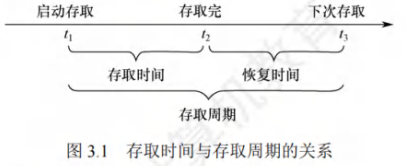
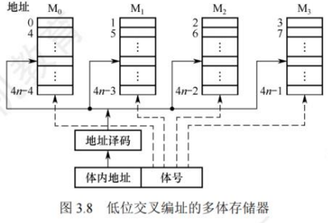

# 存储系统

## 存储器概述

### 存储器的分类

#### 按在计算机中的作用(层次)分类
1. **主存储器**：简称主存，也称内存储器（内存），用来存放计算机运行期间所需的程序和数据，CPU可以直接随机地对其进行访问，也可和高速缓冲存储器（Cache）及辅助存储器交换数据。其特点是**容量较小、存取速度较快、每位价格较高**。
2. **辅助存储器**：简称辅存，也称外存储器或外存，用于存放当前暂时不用的程序和数据，以及一些需要永久性保存的信息。辅存内容需调入主存后才能被CPU访问。其特点是**容量大、存取速度较慢、单位成本低**。
3. **高速缓冲存储器**：简称Cache，位于主存和CPU之间，存放当前CPU经常使用的指令和数据，以便CPU高速访问。Cache的存取速度可与CPU速度相匹配，但**存储容量小、价格高**。现代计算机常将其制作在CPU中。

#### 按存储介质分类
按存储介质，存储器可分为磁表面存储器（磁盘、磁带）、硬磁芯存储器、半导体存储器（MOS型存储器、双极型存储器）和光存储器（光盘）。

#### 按存取方式分类
1. **随机存储器（RAM）**：存储器的任何一个存储单元都能随机存取，且存取时间与存储单元物理位置无关。优点是读/写方便、使用灵活，主要用作主存或高速缓冲存储器。RAM又分为静态RAM和动态RAM（第2节会详细介绍）。
2. **只读存储器（ROM）**：存储器内容只能随机读出不能写入。信息写入后固定不变，断电也不丢失，常用来存放固定程序、常数和汉字字库等。它与随机存储器可共同作为主存一部分，统一构成主存地址域。由ROM派生出的存储器有可反复重写类型，广义上的只读存储器虽已可电擦除写入，但写入速度比读取速度慢得多，仍保留断电内容保留、随机读取特性。
3. **串行访问存储器**：对存储单元读/写操作时，需按物理位置先后顺序寻址，包括顺序存取存储器（如磁带）和直接存取存储器（如磁盘、光盘）。
    - 顺序存取存储器内容只能按某种顺序存取，存取时间与信息在存储体上的物理位置有关，特点是存取速度慢。
    - 直接存取存储器既不像RAM那样随机访问任何存储单元，也不像顺序存取存储器那样完全按顺序存取，而是介于两者之间。存取信息时通常先找整个存储器中的某个小区域（如磁盘上的磁道），再在小区域内顺序查找。

#### 按信息的可保存性分类
- 断电后，存储信息即消失的存储器，称为**易失性存储器**，如RAM。
- 断电后信息仍然保持的存储器，称为**非易失性存储器**，如ROM、磁表面存储器和光存储器。

若某个存储单元所存储的信息被读出时，原存储信息被破坏，称为**破坏性读出**；若读出时，被读单元原存储信息不被破坏，称为**非破坏性读出**。具有破坏性读出性能的存储器，每次读出操作后，必须紧接一个再生操作，以恢复被破坏的信息。

### 存储器的性能指标
存储器有三个主要性能指标，即存储容量、单位成本和存储速度。这三个指标相互制约，设计存储器系统所追求的目标就是大容量、低成本和高速度。
1. **存储容量**：存储容量 = 存储字数×字长（如1M×8位）。单位换算：1B（Byte，字节） = 8b（bit，位）。存储字数表示存储器的地址空间大小，字长表示一次存取操作的数据量。
2. **单位成本**：每位价格 = 总成本/总容量。
3. **存储速度**：数据传输速率（每秒传送信息的位数） = 数据的宽度/存取周期。
    - **存取时间（T）**：存取时间是指从启动一次存储器操作到完成该操作所经历的时间，分为读出时间和写入时间。
    - **存取周期（Tm）**：存取周期是指存储器进行一次完整的读/写操作所需的全部时间，即连续两次独立访问存储器操作（读或写操作）之间所需的最小时间间隔。
    - **主存带宽（Bm）**：也称数据传输速率，表示每秒从主存进出信息的最大数量，单位为字/秒、字节/秒（B/s）或位/秒（b/s）。

存取时间不等于存取周期，通常存取周期大于存取时间。这是因为对任何一种存储器，在读写操作之后，总要有一段恢复内部状态的复原时间。对于破坏性读出的存储器，存取周期往往比存取时间大得多，甚至可达Tm = 2T，因为存储器中的信息读出后需要马上进行再生。

### 多级层次的存储系统

为解决存储系统大容量、高速度和低成本这三个相互制约的矛盾，在计算机系统中，通常采用多级存储器结构。在图中由上至下，位价越来越低，速度越来越慢，容量越来越大，CPU访问的频度也越来越低。实际上，存储系统层次结构主要体现在Cache-主存层和主存-辅存层。在存储体系中，Cache、主存能与CPU直接交换信息，辅存则要通过主存与CPU交换信息；主存与CPU、Cache、辅存都能交换信息。

存储器层次结构的主要思想是上一层的存储器作为低一层存储器的高速缓存。当CPU要从存储器中存取数据时，先访问Cache，若不在Cache中，则访问主存，若不在主存中，则访问磁盘，此时，操作数从磁盘读出送到主存，然后从主存送到Cache。从CPU的角度看，Cache-主存层的速度接近于Cache，容量和位价却接近于主存。从主存-辅存层分析，其速度接近于主存，容量和位价却接近于辅存。这就解决了速度、容量、成本这三者之间的矛盾。

- **Cache-主存层**：主要解决CPU和主存速度不匹配的问题，主存和Cache之间的数据调动是由硬件自动完成的，对所有程序员均是透明的。
- **主存-辅存层**：主要解决存储系统的容量问题，主存和辅存之间的数据调动是由硬件和操作系统共同完成的，对应用程序员是透明的。

在主存-辅存层的不断发展中，逐渐形成了虚拟存储系统，在这个系统中程序员编程的地址范围与虚拟存储器的地址空间相对应，编程时可用的地址空间远大于主存空间。

注意：在Cache-主存层和主存-辅存层中，上一层中的内容都只是下一层中的内容的副本，也即Cache（或主存）中的内容只是主存（或辅存）中的内容的一部分。 

## 主存储器

### SRAM芯片和DRAM芯片
半导体存储器分为随机存储器(RAM)和只读存储器(ROM)。RAM又分为静态随机存储器(SRAM)和动态随机存储器(DRAM)，主存储器主要由DRAM实现，靠近处理器的那一层(Cache)则由SRAM实现，它们都是易失性存储器。ROM是非易失性存储器。

#### SRAM的工作原理
通常把存放一个二进制位的物理器件称为存储元，它是存储器最基本的构件。地址码相同的多个存储元构成一个存储单元，若干存储单元的集合构成存储体。
静态随机存储器(SRAM)的存储元是用双稳态触发器(六晶体管MOS)来记忆信息的，**静态是指即使信息被读出后，它仍保持其原状态而不需要再生(非破坏性读出)**。
SRAM的**存取速度快，但集成度低，功耗较大，价格昂贵，一般用于高速缓冲存储器**。

#### DRAM的工作原理
与SRAM的存储原理不同，动态随机存储器(DRAM)是利用存储元电路中栅极电容上的电荷来存储信息的，DRAM的基本存储元通常只使用一个晶体管，所以它比SRAM的密度要高很多。相对于SRAM来说，DRAM具有**集成度高、位价低和功耗低等优点，但DRAM的存取速度比SRAM慢，且必须定时刷新和读后再生，一般用于大容量的主存系统**。
DRAM电容上的电荷一般只能维持1~2ms，因此即使电源不断电，信息也会自动消失。此外，读操作会使其状态发生改变(破坏性读出)，需读后再生，这也是称其为动态存储器的原因。
刷新可以采用读出的方法进行，根据读出内容对相应单元进行重写，即读后再生。对同一行进行相邻两次刷新的时间间隔称为刷新周期，通常取2ms。常用的刷新方式有以下3种:
1. **集中刷新**：在一个刷新周期内，利用一段固定的时间，依次对存储器的所有行进行逐一再生，在此期间停止对存储器的读/写操作，称为死时间，也称访存死区。**优点是读/写操作时不受刷新工作的影响；缺点是在集中刷新期间(死区)不能访问存储器**。
2. **分散刷新**：将一个存储器系统的工作周期分为两部分:前半部分用于正常的读/写操作，后半部分用于刷新。这种刷新方式增加了系统的存取周期，如存储芯片的存取周期为0.5μs，则系统的存取周期为1μs。**优点是没有死区；缺点是加长了系统的存取周期**。
3. **异步刷新**：结合了前两种方法，使得在一个刷新周期内每一行又刷新一次。具体做法是将刷新周期除以行数，得到相邻两行之间刷新的时间间隔t，每隔时间t产生一次刷新请求。这样就使"死时间"的分布更加分散，避免让CPU连续等待过长的时间。

DRAM的刷新需要注意以下问题:
1. 刷新对CPU是透明的，即刷新不依赖于外部的访问。
2. DRAM的刷新单位是行，由芯片内部自行生成行地址。
3. 刷新操作类似于读操作，但又有所不同。另外，刷新时不需要选片，即整个存储器中的所有芯片同时被刷新。

注意:虽然DRAM的刷新和再生都是恢复数据，但刷新与再生的过程并不完全相同。**刷新是以行为单位，逐行恢复数据的，而再生仅需恢复被读出的那些单元的数据**。

目前更常用的是SDRAM(同步DRAM)芯片，其工作方式与传统DRAM的不同，传统DRAM与CPU采用异步方式交换数据，CPU发出地址和控制信号后，经过一段延迟时间，数据才读出或写入，在读/写完成之前，CPU不能做其他工作。而SDRAM与CPU采用同步方式交换数据，它将CPU发出的地址和控制信号锁存起来，CPU在其读/写完成之前可进行其他操作。SDRAM的每一步操作都在系统时钟的控制下进行，支持突发传输方式。第一次存取时给出首地址，同一行的所有数据都被送到行缓冲器，因此，以后每个时钟都可以连续地从SDRAM输出一个数据。行缓冲器用来缓存指定行中整行的数据，其大小为"列数×位平面数"，通常用SRAM实现。

#### DRAM芯片的读/写周期
DRAM芯片读/写周期的时序图如图3.4所示。为了使芯片能正确接收行、列地址并实现读写操作，各信号的时间关系应符合一定要求。读(写)周期时间tRC(tWC)表示DRAM芯片进行两次连续读(写)操作时所必须间隔的时间。
- **读周期**：在RAS有效前将行地址送到芯片的地址引脚，CAS滞后RAS一段时间，在CAS有效前再将列地址送到芯片的地址引脚，RAS、CAS应分别至少保持tRAS和tCAS的时间。在读周期中WE为高电平，并在CAS有效前建立。
- **写周期**：行列选通信号的时序关系和读周期相同。在写周期中WE为低电平，同样在CAS有效前建立。为了保证数据可靠地写入，写数据必须在CAS有效前在数据总线上保持稳定。

#### SRAM和DRAM的比较

#### 存储器芯片的内部结构
存储器芯片由存储体、I/O读/写电路、地址译码器和控制电路等部分组成。

1. **存储体(存储矩阵)**：存储体是存储单元的集合，它由行选择线(X)和列选择线(Y)来选择所访问单元，存储体的相同行、列上的多位(位平面数)同时被读出或写入。
2. **地址译码器**：用来将地址转换为译码输出线上的高电平，以便驱动相应的读/写电路。地址译码有单译码法(一维译码)和双译码法(二维译码)两种方式。
    - **单译码法**：只有一个行译码器，同一行中所有存储单元的字线连在一起，同一行中的各单元构成一个字，被同时读出或写入。**缺点是地址译码器的输出线数过多**。
    - **双译码法**：如图3.5所示，地址译码器分为X和Y方向两个译码器，在选中的行和列交叉点上能确定一个存储单元，这是DRAM芯片目前普遍采用的译码结构。
3. **I/O控制电路**：用以控制被选中的单元的读出或写入，具有放大信息的作用。
4. **片选控制信号**：单个芯片容量太小，往往满足不了计算机对存储器容量的要求，因此需用一定数量的芯片进行存储器的扩展。在访问某个字时，必须"选中"该存储字所在的芯片，而其他芯片不被"选中"，因此需要有片选控制信号。
5. **读/写控制信号**：根据CPU给出的读命令或写命令，控制被选中单元进行读或写。 

### 只读存储器

#### 只读存储器(ROM)的特点
ROM和RAM都是支持随机访问的存储器，其中SRAM和DRAM均为易失性半导体存储器。而ROM中一旦有了信息，就不能轻易改变，即使掉电也不会丢失。ROM具有两个显著的优点：
- 结构简单，所以**位密度比可读/写存储器的高**。
- 具有非易失性，所以**可靠性高**。

#### ROM的类型
根据制造工艺的不同，ROM可分为掩模式只读存储器(MROM)、一次可编程只读存储器(PROM)、可擦除可编程只读存储器(EPROM)、Flash存储器和固态硬盘(SSD)。
1. **掩模式只读存储器**：
MROM的内容由半导体制造厂按用户提出的要求在芯片的生产过程中直接写入，写入以后任何人都无法改变其内容。**优点是可靠性高，集成度高，价格便宜；缺点是灵活性差**。
2. **一次可编程只读存储器**：
PROM是可以实现一次性编程的只读存储器。允许用户利用专门的设备(编程器)写入自己的程序，一旦写入，内容就无法改变。
3. **可擦除可编程只读存储器**：
EPROM不仅可以由用户利用编程器写入信息，而且可以对其内容进行多次改写。EPROM虽然既可读又可写，但它不能取代RAM，因为EPROM的编程数有限，且写入时间过长。
4. **Flash存储器**：
Flash存储器是在EPROM的基础上发展起来的，它**兼有ROM和RAM的优点，可在不加电的情况下长期保存信息，又能在线进行快速擦除与重写**。Flash存储器既有EPROM价格便宜、集成度高的优点，又有E²PROM电可擦除重写的特点，且擦除重写的速度快。
5. **固态硬盘(Solid State Drive,SSD)**：
基于闪存的固态硬盘是用固态电子存储芯片阵列制成的硬盘，由控制单元和存储单元(Flash芯片)组成。**保留了Flash存储器长期保存信息、快速擦除与重写的特性，且比传统硬盘具有读/写速度快、低功耗的特性，缺点是价格较高**。 

### 主存储器的基本组成

图3.6是主存储器(Main Memory, MM)的基本框图，其中由一个个存储0或1的记忆单元(也称存储元件)构成的存储矩阵(也称存储体)是存储器的核心部件。存储元件是具有两种稳态的能表示二进制0和1的物理器件。为了存取存储体中的信息，必须对存储单元编号(也称编址)。编址单位是指具有相同地址的那些存储元件构成的一个单位，可以按字节编址，也可以按字编址。现代计算机通常采用字节编址方式，此时存储体内的一个地址中有1字节。

指令执行过程中需要访问主存时，CPU首先把被访问单元的地址送到MAR中，然后通过地址线将主存地址送到主存中的地址寄存器，以便地址译码器进行译码，选中相应单元，同时CPU将读/写信号通过控制线送到主存的读/写控制电路。
- **写操作**：CPU同时将要写的信息送到MDR中，在读/写控制电路的控制下，经数据线将信号写入选中的单元。
- **读操作**：主存读出选中单元的内容送至数据线，然后被送到MDR中。

MDR 的位数与数据线的位数相同，MAR的位数与地址线的位数相同。图3.6采用64位数据线，所以在按字节编址方式下，每次最多可以存取8个单元的内容。地址线的位数决定了主存地址空间的最大可寻址范围。例如，36位地址的最大寻址范围为$0$~$2^{36} - 1$，即地址从0开始编号。

注意：数据线的位数通常等于存储字长，因此MDR的位数通常等于存储字长；若数据线的位数不等于存储字长，则MDR的位数由数据线的位数决定。

DRAM芯片容量较大，地址位数较多，为了减少芯片的地址引脚数，通常采用地址引脚复用技术，行地址和列地址通过相同的引脚分先后两次输入，这样地址引脚数可减少一半。

假定有一个$2^n×b$位DRAM芯片的存储阵列，其行数为$r$，列数为$c$，则$2^n = r×c$。存储阵列的地址位数为n，其中行地址位数为$log₂r$，列地址位数为$log₂c$，则$n = log₂r + log₂c$。由于DRAM芯片采用地址引脚复用技术，为减少地址引脚数，应尽量使行、列位数相同，即满足$|r - c|$最小。又由于DRAM按行刷新，为减少刷新开销，应使行数较少，因此还需满足$r ≤ c$。 

### 多模块存储器
多模块存储器是一种空间并行技术，利用多个结构完全相同的存储模块的并行工作来提高存储器的吞吐率。常用的有单体多字存储器和多体低位交叉存储器。
注意：CPU的速度比存储器快得多，若同时从存储器中取出$n$条指令，就可以充分利用CPU资源，提高运行速度。多体交叉存储器就是基于这种思想提出的。

#### 单体多字存储器
在单体多字系统中，每个存储单元存储$m$个字，总线宽度也为$m$个字，一次并行读出$m$个字。在一个存取周期内，从同一地址取出$m$条指令，然后将指令逐条送至CPU执行，即每隔$\frac{1}{m}$存取周期，CPU向主存取一条指令。这显然提高了单体存储器的工作速度。
缺点：只有指令和数据在主存中连续存放时，这种方法才能有效提升存取速度。一旦遇到转移指令，或操作数不能连续存放时，这种方法的提升效果就不明显。

#### 多体并行存储器
多体并行存储器由多体模块组成。每个模块都有相同的容量和存取速度，各模块都有独立的读/写控制电路、地址寄存器和数据寄存器。它们既能并行工作，又能交叉工作。
多体并行存储器分为高位交叉编址和低位交叉编址两种。
(1) **高位交叉编址(顺序方式)**
高位地址表示模块号(或体号)，低位地址为模块内地址(或体内地址)。如图3.7所示，存储器共有4个模块$M_0$～$M_3$，每个模块有$n$个单元，各模块的地址范围如图中所示。

在高位交叉方式下，总把低位的体内地址送到由高位体号确定的模块内进行译码。访问一个连续主存块时，总是先在一个模块内访问，等到该模块访问完才转到下一个模块访问，CPU总是按顺序访问存储模块，各模块不能被并行访问，因而不能提高存储器的吞吐率。
注意：模块内的地址是连续的，存取方式仍是串行存取，因此这种存储器仍是顺序存储器。

(2) **低位交叉编址(交叉方式)**
低位地址为模块号，高位地址为模块内地址。如图3.8所示，每个模块按“模$m$”交叉编址，模块号 = 单元地址$\%m$，假定有$m$个模块，每个模块有$k$个单元，则单元$0,m,\cdots,(k - 1)m$位于$M_0$；单元$1,m + 1,\cdots,(k - 1)m + 1$位于$M_1$；以此类推。

低位交叉方式下，总是把高位的体内地址送到由低位体号所确定的模块内进行译码。程序连续存放在相邻模块中，因此称采用此编址方式的存储器为交叉存储器。
交叉存储器可以采用轮流启动或同时启动两种方式。
- **轮流启动方式**
若每个模块一次读/写的位数正好等于数据总线位数，模块的存取周期为$T$，总线周期为$r$，为实现轮流启动方式，存储器交叉模块数应大于或等于：
$m = \frac{T}{r}$
按每隔$\frac{1}{m}$个存取周期轮流启动各模块，则每隔$\frac{1}{m}$个存取周期就可读出或写入一个数据，存取速度提高$m$倍，图3.9展示了4体交叉轮流启动的时间关系。交叉存储器要求其模块数大于或等于$m$，以保证启动某模块后经过$m\times r$的时间后再次启动该模块时，其上次的存取操作已经完成(以保证流水线不间断)。这样，连续存取$m$个字所需的时间为：
$t = T + (m - 1)r$
而顺序方式连续读取$m$个字所需的时间为$t_2 = mT$。可见交叉存储器的带宽大大提高。

若访存地址出现在同一个模块内，则会发生访存冲突，此时需延迟发生冲突的访问请求。
- **同时启动方式**
若所有模块一次并行读/写的总位数正好等于数据总线位数，则可以同时启动所有模块进行读/写。设每个模块一次读/写的位数为$16$位，模块数$m = 4$，当数据总线位数为$64$位，$4$个模块共提供$64$位，正好构成一个存储字，因此应该同时启动$4$个模块进行并行读/写。 

## 主存储器与CPU的连接

### 连接原理
1. 主存储器通过数据总线、地址总线和控制总线与CPU连接。
2. 数据总线的位数与工作频率的乘积正比于数据传输速率。
3. 地址总线的位数决定了可寻址的最大内存空间。
4. 控制总线(读/写)指出总线周期的类型和本次输入/输出操作完成的时刻。
主存储器与CPU的连接如图3.10所示。

单个芯片的容量是有限的，因此通过存储器芯片扩展技术，将多个芯片集成在一个内存条上，然后由多个内存条及主板上的ROM芯片组成计算机所需的主存空间，再通过总线与CPU相连。

### 主存容量的扩展
由于单个存储芯片的容量是有限的，它在字数或字长方面与实际存储器的要求都有差距，因此需要在字和位两方面进行扩充才能满足实际存储器的容量要求。

#### 位扩展法
位扩展是指对字长进行扩展(增加存储字长)。当CPU的系统数据线数多于存储芯片的数据位数时，必须对存储芯片扩位，使其数据位数与CPU的数据线数相等。
- **连接方式**：各芯片的地址线、片选线和读/写控制线与系统总线相应并联；各芯片的数据线单独引出，分别连接系统数据线。各芯片同时工作。
- **示例**：如图3.11所示，用8片8K×1位的RAM芯片组成8K×8位的存储器。8片RAM芯片的地址线$A_{12}～A_0$、$\overline{CS}$、$\overline{WE}$都分别连在一起，每片的数据线依次作为CPU数据线的一位。

#### 字扩展法
字扩展是指对存储字的数量进行扩展，而存储字的位数满足系统要求。系统数据线位数等于芯片数据线位数，系统地址线位数多于芯片地址线位数。
- **连接方式**：各芯片的地址线与系统地址线的低位对应相连；芯片的数据线和读/写控制线与系统总线相应并联；由系统地址线的高位译码得到各芯片的片选信号。各芯片分时工作。
- **示例**：如图3.12所示，用4片16K×8位的RAM芯片组成64K×8位的存储器。4片RAM芯片的数据线$D_0～D_7$和$\overline{WE}$都分别连在一起。将$A_{15}A_{14}$用作片选信号，$A_{15}A_{14}=00$时，译码器输出端0有效，选中最左边1号芯片；$A_{15}A_{14}=01$时，译码器输出端1有效，选中2号芯片，以此类推(同一时刻只能有一个芯片被选中)。各芯片的地址分配如下：
    - 第一片，最低地址：$0000000000000000$；最高地址：$0011111111111111$（16位）
    - 第二片，最低地址：$0100000000000000$；最高地址：$0111111111111111$
    - 第三片，最低地址：$1000000000000000$；最高地址：$1011111111111111$
    - 第四片，最低地址：$1100000000000000$；最高地址：$1111111111111111$

#### 字位同时扩展法
字位同时扩展是前两种扩展的组合，这种方式既增加存储字的数量，又增加存储字长。
- **连接方式**：将进行位扩展的芯片作为一组，各组的连接方式与位扩展的相同；由系统地址线高位译码产生若干片选信号，分别接到各组芯片的片选信号。
- **示例**：如图3.13所示，用8片16K×4位的RAM芯片组成64K×8位的存储器。每两片构成一组16K×8位的存储器(位扩展)，4组便构成64K×8位的存储器(字扩展)。地址线$A_{15}A_{14}$经译码器得到4个片选信号，$A_{15}A_{14}=00$时，输出端0有效，选中第一组的芯片(1和2)；$A_{15}A_{14}=01$时，输出端1有效，选中第二组的芯片(3和4)，以此类推。 

### 存储芯片的地址分配和片选
CPU要实现对存储单元的访问，首先要选择存储芯片，即进行片选；然后在选定的芯片中选择具体的存储单元，以进行数据的读/写，即进行字选。芯片内的字选通常是由CPU送出的$N$条低位地址线完成（$N$由片内存储容量$2^N$决定）。片选信号的产生方法分为线选法和译码片选法。

#### 线选法
线选法用除片内寻址外的高位地址线直接连接至各个存储芯片的片选端，当某位地址线信息为“$0$”时，就选中与之对应的存储芯片。这些片选地址线每次寻址时只能有一位有效，不允许同时有多位有效，这样才能保证每次只选中一个芯片(或芯片组)。
假设4片$2K×8$位存储芯片采用线选法构成$8K×8$位存储器，各芯片的片选信号见表3.2，其中低位地址线$A_{10}～A_0$作为字选线，用于片内寻址。
- **优点**：不需要地址译码器，线路简单。
- **缺点**：地址空间不连续，选片的地址线必须分时为低电平(否则不能工作)，不能充分利用系统的存储器空间，造成地址资源的浪费。

#### 译码片选法
译码片选法用除片内寻址外的高位地址线通过地址译码器产生片选信号。如用8片$8K×8$位的存储芯片组成$64K×8$位存储器(地址线为16位，数据线为8位)，需要8个片选信号；若采用线选法，除去片内寻址的13位地址线，仅余高3位，不足以产生8个片选信号。因此，采用译码片选法，即用一片74LS138作为地址译码器，高3位用于片选，则$A_{15}A_{14}A_{13}=000$时选中第一片，$A_{15}A_{14}A_{13}=001$时选中第二片，以此类推。

### 存储器与CPU的连接

#### 合理选择存储芯片
要组成一个主存系统，选择存储芯片是第一步，主要指存储芯片的类型(RAM或ROM)和数量的选择。通常选用ROM存放系统程序、标准子程序和各类常数，RAM则是为用户编程而设置的。此外，在考虑芯片数量时，要尽量使连线简单、方便。

#### 地址线的连接
存储芯片的容量不同，其地址线数也不同，而CPU的地址线数往往比存储芯片的地址线数要多。通常将CPU地址线的低位与存储芯片的地址线相连，以选择芯片中的某一单元(字选)，这部分的译码是由芯片的片内逻辑完成的。而CPU地址线的高位则在扩充存储芯片时使用，用来选择存储芯片(片选)，这部分译码由外接译码器逻辑完成。
例如，设CPU地址线为16位，即$A_{15}～A_0$，$1K×4$位的存储芯片仅有10根地址线，此时可将CPU的低位地址$A_{9}～A_0$与存储芯片的地址线$A_{9}～A_0$相连。

#### 数据线的连接
CPU的数据线数与存储芯片的数据线数不一定相等，在相等时可直接相连；在不等时必须对存储芯片扩位，使其数据位数与CPU的数据线数相等。

#### 读/写命令线的连接
CPU读/写命令线一般可直接与存储芯片的读/写控制端相连，通常高电平为读，低电平为写。有些CPU的读/写命令线是分开的(读为$\overline{RD}$，写为$\overline{WE}$，均为低电平有效)，此时CPU的读命令线应与芯片的允许读控制端相连，而CPU的写命令线则应与芯片的允许写控制端相连。

#### 片选线的连接
片选线的连接是CPU与存储芯片连接的关键。存储器由许多存储芯片叠加而成，哪一片被选中完全取决于该存储芯片的片选控制端$\overline{CS}$是否能接收到来自CPU的片选有效信号。
片选有效信号与CPU的访存控制信号$\overline{MREQ}$ (低电平有效)有关，因为只有当CPU要求访存时，才要求选中存储芯片。若CPU访问$I/O$，则$\overline{MREQ}$为高，表示不要求存储器工作。 
