# 存储系统

## 外部存储器

### 磁盘存储器
磁盘存储器是以磁盘为存储介质的存储器，其主要优点：
1. 存储容量大，位价格低。
2. 记录介质可重复使用。
3. 记录信息可长期保存而不丢失，甚至可脱机存档。
4. 非破坏性读出，读出时不需要再生。

缺点：存取速度慢，机械结构复杂，对工作环境要求较高。

#### 磁盘存储器
(1) **磁盘设备的组成**
磁盘存储器由磁盘驱动器、磁盘控制器和盘片组成。
- **磁盘驱动器**：驱动磁盘转动并在盘面上通过磁头进行读/写操作的装置，如图3.14所示。
- **磁盘控制器**：磁盘驱动器与主机的接口，负责接收并解释CPU发来的命令，向磁盘驱动器发出各种控制信号，并负责检测磁盘驱动器的状态。
- **存储区域**：一个磁盘含有若干记录面，每个记录面划分为若干圆形的磁道，而每条磁道又划分为若干扇区，扇区(也称块)是磁盘读/写的最小单位即磁盘按块存取。
    - **磁头数(Heads)**：即记录面数，表示磁盘共有多少个磁头，磁头用于读取/写入盘片上记录面的信息，一个记录面对应一个磁头。
    - **柱面数(Cylinders)**：表示磁盘每面盘片上有多少条磁道。在一个盘组中，不同记录面的相同编号(位置)的诸磁道构成一个圆柱面。
    - **扇区数(Sectors)**：表示每条磁道上有多少个扇区。
    - 相邻磁道及相邻扇区间通过一定的间隙分隔开，以避免精度错误。由于扇区按固定圆心角度划分，因此位密度从最外道向里道增加，磁盘的存储能力受限于最内道的最大记录密度。
- **磁盘高速缓存(Disk Cache)**：在内存中开辟一部分区域，用于缓冲将被送到磁盘上的数据。优点：写磁盘时是按“簇”进行的，可以避免频繁地用小块数据写盘；有些中间结果数据在写回磁盘之前可被快速地再次使用。
(2) **磁记录原理**
    - **原理**：磁头和磁性记录介质相对运动时，通过电磁转换完成读/写操作。
    - **编码方法**：按某种方案(规律)，把一连串的二进制信息变换成存储介质磁层中一个磁化翻转状态的序列，并使读/写控制电路容易、可靠地实现转换。
    - **磁记录方式**：通常采用调频制(FM)和改进型调频制(MFM)的记录方式。
(3) **磁盘的性能指标**
    - **记录密度**：记录密度是指盘片单位面积上记录的二进制信息量，通常以道密度、位密度和面密度表示。道密度是沿磁盘半径方向单位长度上的磁道数，位密度是磁道单位长度上能记录的二进制代码位数，面密度是位密度和道密度的乘积。
    - **磁盘的容量**：磁盘容量有非格式化容量和格式化容量之分。非格式化容量是指磁记录表面可利用的磁化单元总数，非格式化容量 = 记录面数×柱面数×每条磁道的磁化单元数。格式化容量是指按照某种特定的记录格式所能存储信息的总量。格式化容量 = 记录面数×柱面数×每道扇区数×每个扇区的容量。格式化后的容量比非格式化容量要小。
    - **存取时间**：存取时间由寻道时间(磁头移动到目的磁道的时间)、旋转延迟时间(磁头定位到要读/写扇区的时间)和传输时间(传输数据所花费的时间)三部分构成。因为寻道和找扇区的距离远近不一，所以寻道时间和旋转延迟时间通常取平均值(平均寻道时间取从最外道移动到最内道时间的一半，平均旋转延迟时间取旋转半周的时间)。
    - **数据传输速率**：磁盘存储器在单位时间内向主机传送数据的字节数，称为数据传输速率。假设磁盘转数为$r$转/秒，每条磁道容量为$N$字节，则数据传输速率为$D_{r}=rN$。
(4) **磁盘地址**
主机向磁盘控制器发送寻址信息，磁盘的地址一般如下图所示。

若磁盘有16个盘面，每个盘面有256个磁道，每个磁道划分为16个扇区，则每个扇区地址要16位二进制代码，其格式如下图所示。

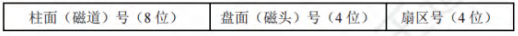

(5) **磁盘的工作过程**
磁盘的主要操作是寻址、读盘、写盘。每个操作都对应一个控制字，磁盘工作时，第一步是取控制字，第二步是执行控制字。磁盘属于机械式部件，其读/写操作是串行的，不可能在同一时刻既读又写，也不可能在同一时刻读两组数据或写两组数据。

#### 磁盘阵列
RAID(独立冗余磁盘阵列)是指将多个独立的物理磁盘组成一个独立的逻辑盘，数据在多个物理盘上分割交叉存储、并行访问，具有更好的存储性能、可靠性和安全性。
RAID的分级如下所示。在RAID1~RAID5几种方案中，无论何时有磁盘损坏，都可随时拔出受损的磁盘再插入好的磁盘，而数据不会损坏，提升了系统的可靠性。
- **RAID0**：无冗余和无校验的磁盘阵列。
- **RAID1**：镜像磁盘阵列。
- **RAID2**：采用纠错的海明码的磁盘阵列。
- **RAID3**：位交叉奇偶校验的磁盘阵列。
- **RAID4**：块交叉奇偶校验的磁盘阵列。
- **RAID5**：无独立校验的奇偶校验磁盘阵列。

RAID0把连续多个数据块交替地存放在不同物理磁盘的扇区中，几个磁盘交叉并行读/写，即条带化技术，这样不仅扩大了存储容量，还提高了磁盘存取速度，但RAID0没有容错能力。
为了提高可靠性，RAID1使两个磁盘同时进行读/写，互为备份，若一个磁盘出现故障，可从另一磁盘中读出数据。两个磁盘当一个磁盘使用，意味着容量减少一半。

总之，RAID通过同时使用多个磁盘，提高了传输速率；通过在多个磁盘上并行存取来大幅提高存储系统的数据吞吐量；通过镜像功能，提高安全可靠性；通过数据校验，提供容错能力。 

### 固态硬盘

#### 固态硬盘的特性

固态硬盘(SSD)是一种基于闪存技术的存储器。它与U盘并无本质差别，只是容量更大，存取性能更好。一个SSD由一个或多个闪存芯片和闪存翻译层组成，如图3.15所示。闪存芯片替代传统旋转磁盘中的机械驱动器，而闪存翻译层将来自CPU的逻辑块读/写请求翻译成对底层物理设备的读/写控制信号，因此，这个闪存翻译层相当于代替了磁盘控制器的角色。

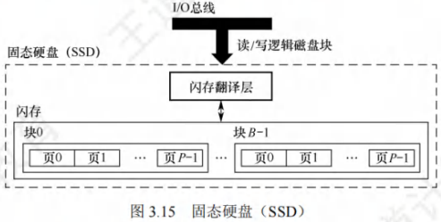

在图3.15中，一个闪存由$B$块组成，每块由$P$页组成。通常，页的大小是$512B～4KB$，每块由$32～128$页组成，块的大小为$16KB～512KB$。数据是以页为单位读/写的。只有在一页所属的块整个被擦除后，才能写这一页。不过，一旦一个块被擦除，块中的每个页就都可以直接再写一次。某个块进行了若干次重复写之后，就会磨损坏，不能再使用。

随机写很慢，有两个原因。首先，擦除块较慢，通常比访问页高一个数量级。其次，若写操作试图修改一个包含已有数据的页$P$，则这个块中所有含有用数据的页都必须被复制到一个新(擦除过的)块中，然后才能进行对页$P$的写操作。

比起传统磁盘，SSD有很多优点，它由半导体存储器构成，没有移动的部件，因而随机访问时间比机械磁盘要快很多，也没有任何机械噪声和振动，能耗更低，抗震性好，安全性高等。

#### 磨损均衡(Wear Leveling)
固态硬盘也有缺点，闪存的擦写寿命是有限的，一般是几百次到几千次。若直接用普通闪存组装SSD，则实际的寿命表现可能非常令人失望——读/写数据时会集中在SSD的一部分闪存，这部分闪存的寿命会损耗得特别快。一旦这部分闪存损坏，整块SSD也就损坏了。这种磨损不均衡的情况，可能会导致一块$256GB$的SSD，只因数兆字节空间的闪存损坏而整块损坏。

为了弥补SSD的寿命缺陷，引入了磨损均衡。SSD磨损均衡技术大致分为两种:
1. **动态磨损均衡**：写入数据时，自动选择较新的闪存块。老的闪存块先歇一歇。
2. **静态磨损均衡**：这种技术更为先进，就算没有数据写入，SSD也会监测并自动进行数据分配，让老的闪存块承担无须写数据的存储任务，同时让较新的闪存块腾出空间，平常的读/写操作在较新的闪存块中进行。如此一来，各个闪存块的寿命损耗就都差不多。

有了这种算法加持，SSD的寿命就比较可观了。例如，对于一个$256GB$的SSD，若闪存的擦写寿命是$500$次，则需要写入$125TB$数据，才寿终正寝。就算每天写入$10GB$数据，也要三十多年才能将闪存磨损坏，更何况很少有人每天往SSD中写入$10GB$数据。 

## 高速缓冲存储器

由于程序的转移概率不会很低，数据分布的离散性较大，因此单纯依靠并行主存系统提高主存系统的效率是有限的。**高速缓存Cache拥有比主存更快的速度，在CPU和主存之间设置Cache可以显著提高存储系统的效率，Cache由SRAM组成，通常直接集成在CPU中**。

### 程序访问的局部性原理

程序访问的局部性原理包括**时间局部性**和**空间局部性**。
- **时间局部性**：最近的未来要用到的信息，很可能是现在正在使用的信息，因为程序中存在循环、多次重复执行的子程序段以及对数组的存储和访问操作。
- **空间局部性**：最近的未来要用到的信息，很可能与现在正在使用的信息在存储空间上是邻近的，因为指令通常顺序存放、顺序执行，数据一般以向量、数组等形式簇聚地存储。

高速缓冲技术就是利用局部性原理，把程序中正在使用的部分数据存放在一个高速的、容量较小的Cache中，使CPU的访存操作大多数针对Cache进行，从而提高程序的执行速度。

【例3.2】假设数组元素按行优先方式存储，对于下面的两个程序:

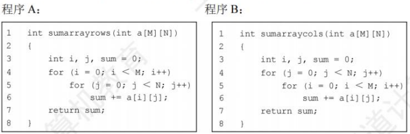

1) 对于数组a的访问，哪个空间局部性更好？哪个时间局部性更好
2) 对于指令访问来说，for循环体的空间局部性和时间局部性如何？

解：假定M、N都为2048，按字节编址，每个数组元素占4字节，则指令和数据在主存中的存放情况如图3.16所示。

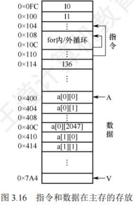

1) 对于数组a，程序A和程序B的空间局部性相差较大。
    - 程序A对数组a的访问顺序为a\[0][0],a\[0][1],....a\[0][2047];a\[1][0], a\[1][1], ..., a\[1][2047]; ... ，访问顺序与存放顺序一致，因此**空间局部性好**。
    - 程序B对数组a的访问顺序为a\[0][0],a\[1][0],....a\[2047][0];a\[0][1],a\[1][1], ..., a\[2047][1]; ... ，访问顺序与存放顺序不一致，每次访问都要跳过2048个数组元素，即8192字节，若主存与Cache的交换单位小于8KB，则每访问一个数组元素都需要将一个主存块装入Cache，因而**没有空间局部性**。
    - 两个程序中，数组a的**时间局部性都差**，因为每个数组元素都只被访问一次。
2) 对于for循环体，程序A和程序B中的访问局部性是一样的。因为循环体内指令按序连续存放，所以**空间局部性好**；内循环体被连续重复执行2048×2048次，因此**时间局部性也好**。

由上述分析可知，虽然程序A和程序B的功能相同，但因内、外两重循环的顺序不同而导致两者对数组a访问的空间局部性相差较大，从而带来执行时间的巨大差异。

### Cache的基本工作原理

为便于Cache与主存交换信息，**Cache和主存都被划分为大小相等的块，Cache块也称Cache行，每块由若干字节组成，块的长度称为块长(也称行长)。因为Cache的容量远小于主存的容量，所以Cache中的块数要远少于主存中的块数，Cache中仅保存主存中最活跃的若干块的副本**。因此，可按照某种策略预测CPU在未来一段时间内欲访存的数据，将其装入Cache。图3.17所示为Cache的基本结构。

当CPU发出读请求时：
- 若访存地址在Cache中**命中**，就将此地址转换成Cache地址，直接对Cache进行读操作，与主存无关。
- 若Cache**不命中**，则仍需访问主存，并把此字所在的块一次性地从主存调入Cache。若此时Cache已满，则需根据某种替换算法，用这个块替换Cache中原来的某块信息。整个过程全部由硬件实现。

**值得注意的是，CPU与Cache之间的数据交换以字为单位，而Cache与主存之间的数据交换则以Cache块为单位**。

当CPU发出写请求时，若Cache命中，有可能会遇到Cache与主存中的内容不一致的问题。例如，由于CPU写Cache，把Cache某单元中的内容从X修改成X"，而主存对应单元中的内容仍然是X，没有改变，因此若Cache命中，需要按照一定的写策略处理，常见的处理方法有全写法和回写法，详见本节的Cache写策略部分。

某些计算机中也采用同时访问Cache和主存的方式，若Caache命中，则终止访存。

**CPU欲访问的信息已在Cache中的比率称为Cache的命中率**。设一个程序执行期间，Cache的总命中次数为$N_c$，访问主存的总次数为$N_m$，则命中率$H$为：
$H = \frac{N_c}{N_c + N_m}$

可见为提高访问效率，命中率$H$越接近1越好。设$t_c$为命中时的Cache访问时间，$t_m$为未命中时的访问时间，$1 - H$表示未命中率，则Cache-主存系统的平均访问时间$T_a$为：
$T_a = Ht_c + (1 - H)t_m$

【例3.3】假设Cache的速度是主存的5倍，且Cache的命中率为95%，则采用Cache后，存储器性能提高多少(假设采用先访问Cache，Cache不命中时，才采用访问主存的方式)?
解：设Cache的存取周期为$t$，主存的存取周期为$5t$，得出系统的平均访问时间$T$为

$$
\begin{align*}
T&=Cache命中时的访问时间×命中率+Cache缺失时的访问时间×缺失率\\
&=0.95×t + 0.05×(t + 5t) = 1.25t
\end{align*}
$$

或

$$
\begin{align*}
T&=Cache命中时的访问时间+Cache缺失时的访存开销×缺失率\\
&=t + 0.05×5t = 1.25t
\end{align*}
$$

可知，采用Cache后的存储器性能为原来的$\frac{5t}{1.25t} \approx 4$倍。

根据Cache的读、写流程，可知实现Cache时需解决以下关键问题:
1. **数据查找**：如何快速判断数据是否在Cache中。
2. **地址映射**：主存块如何存放在Cache中，如何将主存地址转换为Cache地址。
3. **替换策略**：Cache满后，使用何种策略对Cache块进行替换或淘汰。
4. **写入策略**：如何既保证主存块和Cache块的数据一致性，又尽量提升效率。 

### Cache和主存的映射方式

由于Cache行数比主存块数少得多，因此主存中只有一部分块的信息可放在Cache中。所以，在Cache中要为每块加一个**标记位**，指明它是主存中哪一块的副本，该标记的内容相当于主存中块的编号。为了说明Cache行中的信息是否有效，每个Cache行需要一个**有效位**。

Cache行中的信息是主存中某个块的副本，**地址映射**是指把主存地址空间映射到Cache地址空间，即把存放在主存中的信息按照某种规则装入Cache。地址映射的方法有以下3种：

#### 直接映射
主存中的每一块只能装入Cache中的唯一位置。若这个位置已有内容，则产生块冲突，原来的块将无条件地被替换出去（无须使用替换算法）。直接映射实现简单，但不够灵活，即使Cache的其他许多地址空着也不能占用，这使得直接映射的块冲突概率最高，空间利用率最低。

直接映射的关系可定义为：
$ \text{Cache行号} = \text{主存块号} \mod \text{Cache总行数} $

假设Cache共有$2^c$行，主存有$2^m$块，在直接映射方式中，主存的第$0$块、第$2^c$块、第$2^{c + 1}$块......只能映射到Cache的第$0$行；而主存的第$1$块、第$2^c + 1$块、第$2^{c + 1} + 1$块.....只能映射到Cache的第$1$行，以此类推。由映射函数可看出，主存块号的低$c$位正好是它要装入的Cache行号。给每个Cache行设置一个长为$l = m - c$的**标记(tag)**，当主存某块调入Cache后，就将其块号的高$l$位设置在对应Cache行的标记中，如图3.18(a)所示。

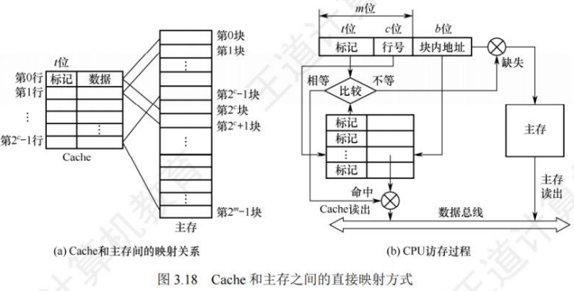

直接映射的地址结构为：

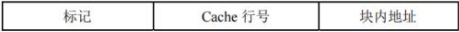

CPU访存过程如图3.18(b)所示。首先根据访存地址中间的$c$位，找到对应的Cache行，将对应Cache行中的标记和主存地址的高$l$位标记进行比较，若相等且有效位为$1$，则访问Cache“命中”，此时根据主存地址中低位的块内地址，在对应的Cache行中存取信息；若不相等或有效位为$0$，则“不命中”，此时CPU从主存中读出该地址所在的一块信息送到对应的Cache行中，将有效位置$1$，并将标记设置为地址中的高$l$位，同时将该地址上中的内容送CPU。

#### 全相联映射
主存中的每一块可以装入Cache中的任何位置，如图3.19所示，每行的标记用于指出该行来自主存的哪一块，因此CPU访存时需要与所有Cache行的标记进行比较。
- **优点**：
    - Cache块的冲突概率低，只要有空闲Cache行，就不会发生冲突；
    - 空间利用率高；
    - 命中率高；
- **缺点**：
    - 标记的比较速度较慢；
    - 实现成本较高，通常需采用按内容寻址的相联存储器。

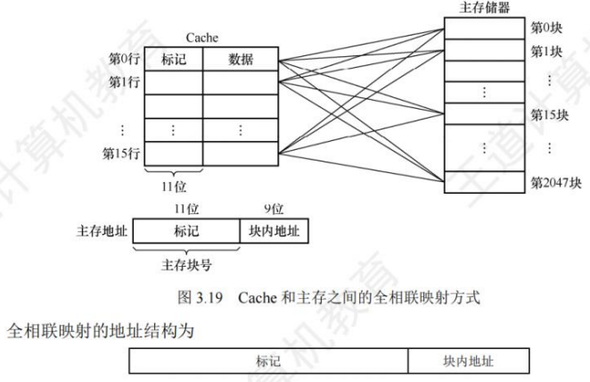

CPU访存过程如下：首先将主存地址的高位标记（位数$=\log_2$主存块数）与Cache各行的标记进行比较，若有一个相等且对应有效位为$1$，则命中，此时根据块内地址从该Cache行中取出信息；若都不相等，则不命中，此时CPU从主存中读出该地址所在的一块信息送到Cache的任意一个空闲行中，将有效位置$1$，并设置标记，同时将该地址中的内容送CPU。

通常为每个Cache行都设置一个比较器，比较器位数等于标记学段的位数。访存时根据标记字段的内容来访问Cache行中的主存块，因而其查找过程是一种“按内容访问”的存取方式，所以是一种“相联存储器”。这种方式的时间开销和硬件开销都较大，不适合大容量Cache。

#### 组相联映射
将Cache分成$2^Q$个大小相等的组，每个主存块可以装入固定组中的任意一行，即组间采用直接映射、而组内采用全相联映射的方式，如图3.20所示。它是对直接映射和全相联映射的一种折中，当$Q = 1$时变为全相联映射，当$Q = \text{Cache行数}$时变为直接映射。路数越大，即每组Cache行的数量越大，发生块冲突的概率越低，但相联比较电路也越复杂。选定适当的数量，可使组相联映射的成本接近直接映射，而性能上仍接近全相联映射。假设每组有$r$个Cache行，则称为$r$路组相联，图3.20中每组有两个Cache行，因此称为二路组相联。

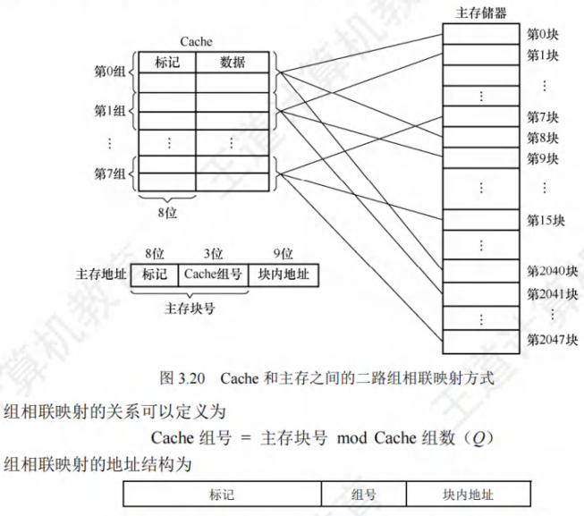

CPU访存过程如下：首先根据访存地址中间的组号找到对应的Cache组；将对应Cache组每个行的标记与主存地址的高位标记进行比较；若有一个相等且有效位为$1$，则访问Cache命中，此时根据主存地址中的块内地址，在对应Cache行中存取信息；若都不相等或虽相等但有效位为$0$，则不命中，此时CPU从主存中读出该地址所在的一块信息送到对应Cache组的任意一个空闲行中，将有效位置$1$，并设置标记，同时将该地址中的内容送CPU。

直接映射因为每块只能映射到唯一的Cache行，因此只需设置$1$个比较器。而$r$路组相联映射需要在对应分组中与$r$个Cache行进行比较，因此需设置$r$个比较器。

【例3.4】假设某个计算机的主存地址空间大小为$256MB$，按字节编址，其数据Cache有$8$个Cache行，行长为$64B$。
1) 若不考虑用于Cache的一致维护性位（脏位）和替换算法控制位，并且采用直接映射方式，则该数据Cache的总容量为多少？
2) 若该Cache采用直接映射方式，则主存地址为$3200$（十进制）的主存块对应的Cache行号是多少？采用二路组相联映射时又是多少？
3) 以直接映射方式为例，简述访存过程（设访存的地址为$(0123456H)$）

解：
1) 因为Cache包括了可以对Cache中所包含的存储器地址进行跟踪的硬件，即Cache的总容量$=$存储容量$+$标记阵列容量（有效位、标记位），本题不考虑脏位和替换算法位。

标记字段长度的计算：主存地址有$28$位（$256MB = 2^{28}B$），其中$6$位为块内地址（$2^6B = 64B$），$3$位为行号（$2^3 = 8$），剩余$28 - 6 - 3 = 19$位为标记字段，故数据Cache的总容量为$8\times(1 + 19 + 512)=4256$位。
2) 直接映射方式中，主存按照块的大小划分，主存地址$3200$对应的字块号为$3200B/64B = 50$。而Cache只有$8$行，则$50\mod8 = 2$，因此对应的Cache行号为$2$。

二路组相联映射方式，实质上就是将两个Cache行合并，内部采用全相联方式，外部采用直接映射方式，$50\mod4 = 2$，对应的组号为$2$，即对应的Cache行号为$4$或$5$。
3) 直接映射方式中，$28$位主存地址可分为$19$位的主存标记位，$3$位的块号，$6$位的块内地址，即$0000000010010 0011010$为主存标记位，$001$为块号，$010110$为块内地址。

首先根据块号，查Cache（即$001$号Cache行）中对应的主存标记位，看是否相同。若相同，再看Cache行中的有效位是否为$1$，若是，称此访问命中，按块内地址$010110$读出Cache行所对应的单元并送入CPU中，完成访存。

若出现标记位不相等或有效位为$0$的情况，则不命中，访问主存将数据取出并送往CPU和Cache对应块中，把主存地址的高$19$位写入$001$行的标记位，并将有效位置$1$。

三种映射方式中：
- 直接映射的每个主存块只能映射到Cache中的某一固定行；
- 全相联映射可以映射到所有Cache行；
- $N$路组相联映射可以映射到$N$行。

当Cache大小、主存块大小一定时：
1) 直接映射的命中率最低，全相联映射的命中率最高。
2) 直接映射的判断开销最小、所需时间最短，全相联映射的判断开销最大、所需时间最长。
3) 直接映射标记所占的额外空间开销最少，全相联映射标记所占的额外空间开销最大。 

### Cache中主存块的替换算法

在采用全相联映射或组相联映射方式时，从主存向Cache传送一个新块，当Cache或Cache组中的空间已被占满时，就需要使用**替换算法**置换Cache行。而采用直接映射时，一个给定的主存块只能放到唯一的固定Cache行中，所以在对应Cache行已有一个主存块的情况下，新的主存块毫无选择地把原先已有的那个主存块换掉，因而无须考虑替换算法。

常用的替换算法有随机（RAND）算法、先进先出（FIFO）算法、近期最少使用（LRU）算法和最不经常使用（LFU）算法。其中最常考查的是**LRU法**。
1) **随机算法**：随机地确定替换的Cache行。它的实现比较简单，但未依据程序访问的局部性原理，因此可能命中率较低。
2) **先进先出算法**：选择最早调入的Cache行进行替换。它比较容易实现，但也未依据程序访问的局部性原理，因为最早进入的主存块也可能是目前经常要用的。
3) **近期最少使用算法（LRU）**：依据程序访问的局部性原理，选择近期内长久未访问过的Cache行进行替换，其平均命中率要比FIFO的高，是堆栈类算法。

LRU算法对每个Cache行设置一个计数器（也称LRU替换位），用计数值来记录主存块的使用情况，并根据计数值选择淘汰某个块，计数值的位数与Cache组大小有关，二路时有1位LRU位，四路时有2位LRU位。假定采用四路组相联，有5个主存块{1,2,3,4,5}映射到Cache的同组，对于主存访问序列{1,2,3,4,1,2,5,1,2,3,4,5}，采用LRU算法的替换过程如图3.23所示，图中左边阴影的数字是对应Cache行的计数值，右边的数字是存放在该行中的主存块号。

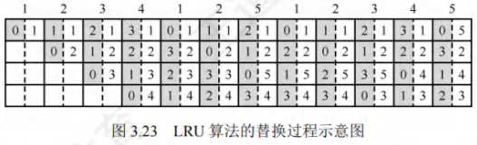

计数器的变化规则：
1. 命中时，所命中的行的计数器清零，比其低的计数器加1，其余不变；
2. 未命中且还有空闲行时，新装入的行的计数器置0，其余全加1；
3. 未命中且无空闲行时，计数值为3的行的信息块被替换，新装入的行的计数器置0，其余全加1。

当集中访问的存储区超过Cache组的大小时，命中率可能变得很低，如上例的访问序列变为1,2,3,4,5,1,2,3,4,5...而Cache每组只有4行，则命中率为0，这种现象称为**抖动**。
4) **最不经常使用算法**：将一段时间内被访问次数最少的Cache行换出。每行也设置一个计数器，新行装入后从0开始计数，每访问一次，被访问的计数器加1，需要替换时比较各特定行的计数值，将计数值最小的行换出。这种算法与LRU类似，但不完全相同。

### Cache的一致性问题
因为Cache中的内容是主存块副本，当对Cache中的内容进行了更新时，就需选用写操作策略使Cache内容和主存内容保持一致。此时分两种情况。

对于Cache写操作命中（write hit），有两种处理方法。
1) **全写法（直写法、write-through）**：当CPU对Cache写命中时，必须把数据同时写入Cache和主存。当某一块需要替换时，就不必把这一块写回主存了，用新调入的块直接覆盖即可。这种方法实现简单，能随时保持主存数据的正确性。
**缺点**：增加了访存次数，降低了Cache的效率。
**写缓冲**：为减少全写法直接写入主存的时间损耗，在Cache和主存之间加一个写缓冲（Write Buffer）。CPU同时写数据到Cache和写缓冲中，写缓冲再将内容写入主存。写缓冲是一个FIFO队列，写缓冲可以解决速度不匹配的问题。但若出现频繁写时，会使写缓冲饱和溢出。

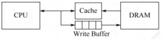

2) **回写法（write-back）**：当CPU对Cache写命中时，只把数据写入Cache，而不立即写入主存，只有当此块替换出时才写回主存。这种方法减少了访存次数，但存在数据不一致的隐患。为了减少写回主存的次数，给每个Cache行设置一个修改位（脏位）。若修改位为1，则说明对应Cache行中的块被修改过，替换时须写回主存；若修改位为0，则说明对应Cache行中的块未被修改过，替换时无须写回主存。

全写法和回写法都对应于Cache写命中（要被修改的块在Cache中）时的情况。

对于Cache写操作不命中，也有两种处理方法。
1) **写分配法（write-allocate）**：更新主存单元，然后把这个主存块调入Cache。它试图利用程序的空间局部性，缺点是每次写不命中都要从主存读一个块到Cache中。
2) **非写分配法（not-write-allocate）**：只更新主存单元，而不把主存块调入Cache。

非写分配法通常与全写法合用，写分配法通常和回写法合用。

随着指令流水技术的发展，需要将指令Cache和数据Cache分开设计，这就有了分离的Cache结构。统一Cache的优点是设计和实现相对简单，但由于执行部件存取数据时，指令预取部件要从同一Cache读指令，因此会引发冲突。采用分离的Cache结构可以解决这个问题，而且分离的指令和数据Cache还可以充分利用指令和数据的不同局部性来优化性能。

现代计算机的Cache通常设立多级Cache，假定设2级Cache，按离CPU的远近可各自命名为L1Cache、L2Cache，离CPU越远，访问速度越慢，容量越大。指令Cache与数据Cache分离一般在L1级，此时通常为写分配法与回写法合用。下图是一个含有两级Cache的系统，L1Cache对L2Cache使用全写法，L2Cache对主存使用回写法，由于L2Cache的存在，其访问速度大于主存，因此避免了因频繁写时造成的写缓冲饱和溢出。 

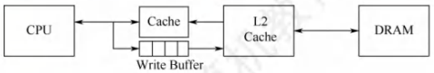

## 虚拟存储器

主存和辅存共同构成了**虚拟存储器**，二者在硬件和系统软件的共同管理下工作。对于应用程序员而言，虚拟存储器是透明的。虚拟存储器具有接近主存的速度和辅存的容量。

### 虚拟存储器的基本概念
虚拟存储器将主存或辅存的地址空间统一编址，形成一个庞大的地址空间，在这个空间内，用户可以自由编程，而不必在乎实际的主存容量和程序在主存中实际的存放位置。

用户编程允许涉及的地址称为**虚地址**或**逻辑地址**，虚地址对应的存储空间称为**虚拟空间**或**程序空间**。实际的主存单元地址称为**实地址**或**物理地址**，实地址对应的是主存地址空间，也称实地址空间。虚地址比实地址要大很多。虚拟存储器的地址空间如图3.24所示。

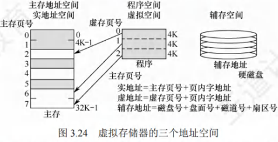

CPU使用虚地址时，先判断这个虚地址对应的内容是否已装入主存。若已在主存中，则通过地址变换，CPU可直接访问主存指示的实际单元；若不在主存中，则把包含这个字的一页或一段调入主存后再由CPU访问。若主存已满，则采用替换算法置换主存中的交换块（页面）。

虚拟存储器也采用和Cache类似的技术，将辅存中经常访问的数据副本存放到主存中。但是缺页（或段）而访问辅存的代价很大，提高命中率是关键，因此虚拟存储机制采用全相联映射，每个虚页面可以存放到对应主存区域的任何一个空闲页位置。此外，当进行写操作时，不能每次写操作都同时写回磁盘，因而，在处理一致性问题时，采用回写法。

### 页式虚拟存储器
页式虚拟存储器以页为基本单位。主存空间和虚拟地址空间都被划分成相同大小的页，主存空间中的页称为**物理页**、**实页**、**页框**，虚拟地址空间中的页称为**虚拟页**、**虚页**。**页表**记录了程序的虚页调入主存时被安排在主存中的位置。页表一般长久地保存在内存中。

#### 页表
图3.25是一个页表示例。**有效位**也称装入位，用来表示对应页面是否在主存，若为1，则表示该虚拟页已从外存调入主存，此时页表项存放该页的物理页号；若为0，则表示没有调入主存，此时页表项可以存放该页的磁盘地址。**脏位**也称修改位，用来表示页面是否被修改过，虚存机制中采用回写策略，利用脏位可判断替换时是否需要写回磁盘。**引用位**也称使用位，用来配合替换策略进行设置，例如是否实现最先调入（FIFO位）或最近最少用（LRU位）策略等。

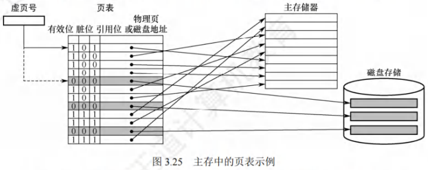

以图3.25的页表为例，假设CPU欲访问的数据在第1页，对应的有效位为1，说明该页已存放在主存中，再通过地址转换部件将虚拟地址转换为物理地址，然后到相应的主存实页中存取数据。若该数据在第5页，有效位为0，则发生“缺页”异常，需调用操作系统的缺页异常处理程序。缺页处理程序根据对应表项中的存放位置字段，将所缺页面从磁盘调入一个空闲的物理页框。若主存中没有空闲页框，还需要选择一个页面替换。由于采用回写策略，因此换出页面时根据脏位确定是否要写回磁盘。缺页处理过程中需要对页表进行相应的更新。

页式虚拟存储器的优点是，页面的长度固定，页表简单，调入方便。缺点是，因为程序不可能正好是页面的整数倍，最后一页的零头将无法利用而造成浪费，并且页不是逻辑上独立的实体，所以处理、保护和共享都不及段式虚拟存储器方便。

#### 地址转换
在虚拟存储系统中，指令给出的地址是虚拟地址，因此当CPU执行指令时，要先将虚拟地址转换为主存物理地址，才能到主存中存取指令和数据。虚拟地址分为两个字段：高位为**虚页号**，低位为**页内偏移地址**。物理地址也分为两个字段：高位为**物理页号**，低位为**页内偏移地址**。由于两者的页面大小相同，因此页内偏移地址是相等的。虚拟地址到物理地址的转换是由页表实现的，页表是一张存放在主存中的虚页号和实页号的对照表。

每个进程都有一个**页表基址寄存器**，存放该进程的页表首地址，据此找到对应的页表首地址(对应1)，然后根据虚拟地址高位的虚拟页号找到对应的页表项(对应2)，若装入位为1，则取出物理页号(对应3)，和虚拟地址低位的页内地址拼接，形成实际物理地址(对应4)。若装入位为0，说明缺页，需要操作系统进行缺页处理。地址变换过程如图3.26所示。

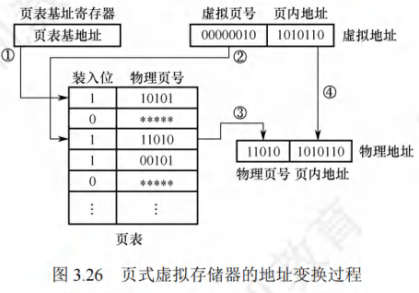

#### 快表(TLB)
由地址转换过程可知，访存时先访问一次主存去查页表，再访问主存才能取得数据。若缺页，则还要进行页面替换、页面修改等，因此采用虚拟存储机制后，访问主存的次数更多了。

依据程序访问的局部性原理，在一段时间内总是经常访问某些页时，若把这些页对应的页表项存放在高速缓冲器组成的**快表(TLB)**中，则可以明显提高效率。相应地把放在主存中的页表称为**慢表(Page)**。在地址转换时，首先查找快表，若命中，则无须访问主存中的页表。

快表用SRAM实现，其工作原理类似于Cache，通常采用全相联或组相联映射方式。TLB表项由页表表项内容和TLB标记组成。全相联映射下，TLB标记就是对应页表项的虚拟页号；组相联方式下，TLB标记则是对应虚拟页号的高位部分，而虚拟页号的低位部分作为TLB组的组号。

#### 具有TLB和Cache的多级存储系统
图3.27是一个具有TLB和Cache的多级存储系统，其中Cache采用二路组相联方式。CPU给出一个32位的虚拟地址，TLB采用全相联方式，每一项都有一个比较器，查找时将虚页号与每个TLB标记字段同时进行比较，若有某一项相等且对应有效位为1，则TLB命中，此时可直接通过TLB进行地址转换；若未命中，则TLB缺失，需要向主存去查页表。图中所示的是两级页表方式，虚页号被分成页目录索引和页表索引两部分，由这两部分得到对应的页表项，从而进行地址转换，并将相应表项调入TLB，若TLB已满，则还需要采用替换策略。完成由虚拟地址到物理地址的转换后，Cache机构根据映射方式将物理地址划分成多个字段，然后根据映射规则找到对应的Cache行或组，将对应Cache行中的标记与物理地址中的高位部分进行比较，若相等且对应有效位为1，则Cache命中，此时根据块内地址取出对应的字送给CPU。

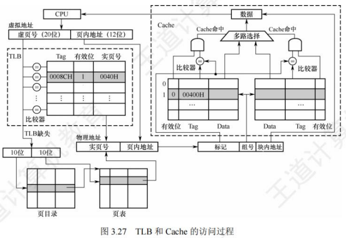

查找时，快表和慢表也可以同步进行，若快表中有此虚页号，则能很快地找到对应的实页号，并且使慢表的查找作废，从而就能做到虽采用虚拟存储器但访问主存速度几乎没有下降。

在一个具有TLB和Cache的多级存储系统中，CPU一次访存操作可能涉及TLB、页表、Cache、主存和磁盘的访问，访问过程如图3.28所示。可见，CPU访存过程中存在三种缺失情况：
1. **TLB缺失**：要访问的页面的页表项不在TLB中；
2. **Cache缺失**：要访问的主存块不在Cache中；
3. **Page缺失**：要访问的页面不在主存中。

由于TLB只是页表的一部分副本，因此Page缺失时，TLB也必然缺失。同理，Cache也只是主存的一部分副本，页表未命中意味着信息不在主存，因此Page缺失时，Cache也必然缺失。这三种缺失的可能组合情况如表3.3所示。

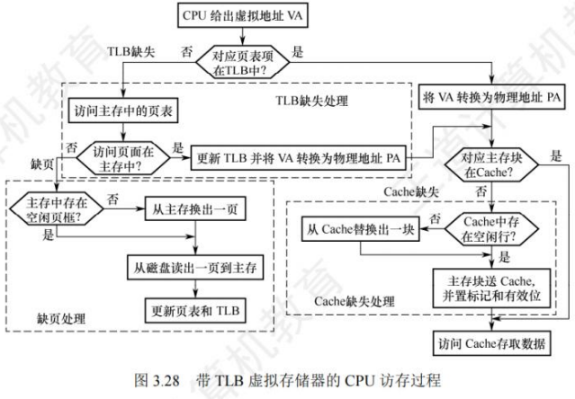

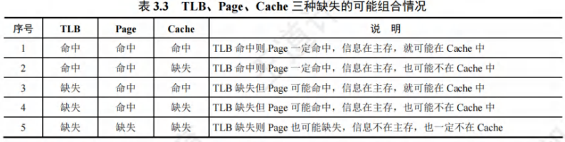

最好的情况是第1种组合，此时无须访问主存；第2种和第3种组合都需要访问一次主存；第4种组合需要访问两次主存；第5种组合发生“缺页异常”，需要访问磁盘，并且至少访问两次主存。Cache缺失处理由硬件完成；缺页处理由软件完成，操作系统通过“缺页异常处理程序”来实现；而TLB缺失既可以用硬件，又可以用软件来处理。 

### 段式虚拟存储器

段式虚拟存储器中的段是按程序的**逻辑结构**划分的，各个段的长度因程序而异。把虚拟地址分为两部分：**段号**和**段内地址**。虚拟地址到实地址之间的变换是由**段表**来实现的。段表是程序的逻辑段和在主存中存放位置的对照表。段表的每行记录与某个段对应的段号、装入位、段起点和段长等信息。因为段的长度可变，所以段表中要给出各段的起始地址与段的长度。

CPU根据虚拟地址访存时，首先根据段表基地址与段号拼接成对应的段表项，然后根据该段表项的装入位判断该段是否已调入主存（装入位为“1”，表示该段已调入主存；装入位为“0”，表示该段不在主存中）。已调入主存时，从段表读出该段在主存中的起始地址，与段内地址（偏移量）相加，得到对应的主存实地址。段式虚拟存储器的地址变换过程如图3.29所示。

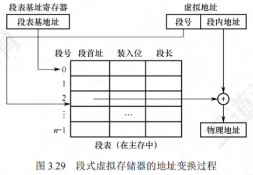

因为段本身是程序的逻辑结构所决定的一些独立部分，因而分段对程序员来说是**不透明**的；而分页对程序员来说是**透明**的，程序员编写程序时不需知道程序将如何分页。

段式虚拟存储器的优点是，段的分界与程序的自然分界相对应，因而具有逻辑独立性，使得它易于编译、管理、修改和保护，也便于多道程序的共享；缺点是因为段长度可变，分配空间不便，容易在段间留下碎片，不好利用，造成浪费。

### 段页式虚拟存储器
在段页式虚拟存储器中，把程序按逻辑结构分段，每段再划分为固定大小的页，主存空间也划分为大小相等的页，程序对主存的调入、调出仍以页为基本交换单位。每个程序对应一个段表，每段对应一个页表，段的长度必须是页长的整数倍，段的起点必须是某一页的起点。

虚地址分为段号、段内页号、页内地址三部分。CPU根据虚地址访存时，首先根据段号得到段表地址；然后从段表中取出该段的页表起始地址，与虚地址段内页号合成，得到页表地址；最后从页表中取出实页号，与页内地址拼接形成主存实地址。

段页式虚拟存储器的优点是，兼具页式和段式虚拟存储器的优点，可以按段实现共享和保护；缺点是在地址变换过程中需要两次查表，系统开销较大。

### 虚拟存储器与Cache的比较
虚拟存储器与Cache既有很多相同之处，又有很多不同之处。
1. **相同之处**
    1) 最终目标都是为了提高系统性能，两者都有容量、速度、价格的梯度。
    2) 都把数据划分为小信息块，并作为基本的交换单位，虚存系统的信息块更大。
    3) 都有地址映射、替换算法、更新策略等问题。
    4) 都依据局部性原理应用“快速缓存”的思想，将活跃的数据放在相对高速的部件中。
2. **不同之处**
    1) Cache主要解决系统速度，而虚拟存储器却是为了解决主存容量。
    2) Cache全由硬件实现，是硬件存储器，对所有程序员透明；而虚拟存储器由OS和硬件共同实现，是逻辑上的存储器，对系统程序员不透明，但对应用程序员透明。
    3) 对于不命中性能影响，因为CPU的速度约为Cache的10倍，主存的速度为硬盘的100倍以上，因此虚拟存储器系统不命中时对系统性能影响更大。
    4) CPU与Cache和主存都建立了直接访问的通路，而辅存与CPU没有直接通路。也就是说，在Cache不命中时主存能和CPU直接通信，同时将数据调入Cache；而虚拟存储器系统不命中时，只能先由硬盘调入主存，而不能直接和CPU通信。 