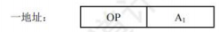
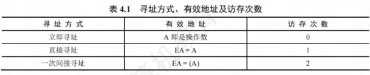

# 指令系统

## 指令系统

### 指令集体系结构
机器指令（简称指令）是指示计算机执行某种操作的命令。一台计算机的所有指令的集合构成该机的指令系统，也称指令集。**指令系统是指令集体系结构(ISA)中最核心的部分**，ISA完整定义了软件和硬件之间的接口，是机器语言或汇编语言程序员所应熟悉的。

ISA规定的内容主要包括:
1. 指令格式，指令寻址方式，操作类型，以及每种操作对应的操作数的相应规定。
2. 操作数的类型，操作数寻址方式，以及是按大端方式还是按小端方式存放。
3. 程序可访问的寄存器编号、个数和位数，存储空间的大小和编址方式。
4. 指令执行过程的控制方式等，包括程序计数器、条件码定义等。

ISA规定了机器级程序的格式，机器语言或汇编语言程序员必须对机器的ISA非常熟悉。不过，大多数程序员不会用汇编语言或机器语言编写程序，通常用高级语言（如C/C++/Java）编写程序，这样开发效率更高，也不易出错。但是，高级语言抽象层太高，隐藏了许多机器级程序的细节，使得高级语言程序员不能很好地利用与机器结构相关的一些优化方法来提升程序的性能。若程序员对ISA和底层硬件实现细节有充分的了解，则可以更好地编制高性能程序。

### 指令的基本格式
一条指令就是机器语言的一个语句，它是一组有意义的二进制代码。**一条指令通常包括操作码字段和地址码字段两部分**：

其中，**操作码指出该指令应执行什么操作以及具有何种功能**。操作码是识别指令、了解指令功能及区分操作数地址内容等的关键信息。例如，指出是算术加运算还是算术减运算，是程序转移还是返回操作。**地址码给出被操作的信息(指令或数据)的地址**，包括参加运算的一个或多个操作数的地址、运算结果的保存地址、程序的转移地址、被调用子程序的入口地址等。

**指令字长是指一条指令所包含的二进制代码的位数**，其取决于操作码的长度、地址码的长度和地址码的个数。指令字长与机器字长没有固定的关系，它既可以等于机器字长，又可以大于或小于机器字长。通常，把指令长度等于机器字长的指令称为单字长指令，指令长度等于半个机器字长的指令称为半字长指令，指令长度等于两个机器字长的指令称为双字长指令。

在一个指令系统中，**若所有指令的长度都是相等的，则称为定长指令字结构**，定字长指令的执行速度快，控制简单。**若各种指令的长度随指令功能而异，则称为变长指令字结构**。然而，因为主存一般是按字节编址的，所以指令字长通常为字节的整数倍。

根据指令中操作数地址码的数目的不同，可将指令分成以下几种格式：
#### 零地址指令

只给出操作码OP，没有显式地址。这种指令有两种可能:
1. 不需要操作数的指令，如空操作指令、停机指令、关中断指令等。
2. 零地址的运算类指令仅用在堆栈计算机中。通常参与运算的两个操作数隐含地从栈顶和次栈顶弹出，送到运算器进行运算，运算结果再隐含地压入堆栈。

#### 一地址指令

这种指令也有两种常见的形态，要根据操作码的含义确定究竟是哪一种。
1. 只有目的操作数的单操作数指令，按A地址读取操作数，进行OP操作后，结果存回原地址。
指令含义：OP(A1)→A
如操作码含义是加1、减1、求反、求补、移位等。
2. 隐含约定目的地址的双操作数指令，按指令地址A，可读取原操作数，指令可隐含约定另一个操作数由ACC(累加器)提供，运算结果也将存放在ACC中。
指令含义：(ACC)OP(A1)→ACC

若指令字长为32位，操作码占8位，1个地址码字段占24位，则指令操作数的直接寻址范围为$2^{24}=16M$。若地址码字段均为主存地址，则完成一条一地址指令需要3次访存（取指令1次，取操作数1次，存结果1次）。 

#### 二地址指令

**指令含义：(A1)OP(A2)→A1**
对于常用的算术和逻辑运算指令，往往要求使用两个操作数，需分别给出目的操作数和源操作数的地址，其中目的操作数地址还用于保存本次的运算结果。
若指令字长为32位，操作码占8位，两个地址码字段各占12位，则每个操作数的直接寻址范围为$2^{12}=4K$。若地址码字段均为主存地址，则完成一条二地址指令需要4次访存（取指令1次，取两个操作数2次，存结果1次）。

#### 三地址指令

**指令含义：(A1)OP(A2)→A3**。
若指令字长为32位，操作码占8位，3个地址码字段各占8位，则每个操作数的直接寻址范围为$2^{8}=256$。若地址码字段均为主存地址，则完成一条三地址指令需要4次访问存储器（取指令1次，取两个操作数2次，存结果1次）。

#### 四地址指令

**指令含义：(A1)OP(A2)→A3，A4=下一条将要执行指令的地址** 
若指令字长为32位，操作码占8位，4个地址码字段各占6位，则每个操作数的直接寻址范围为$2^{6}=64$。若地址码字段均为主存地址，则完成一条四地址指令需要4次访存（取指令1次，取两个操作数2次，存结果1次）。

### 定长操作码指令格式
定长操作码指令在指令字的最高位部分分配固定的若干位（定长）表示操作码。**一般n位操作码字段的指令系统最大能够表示$2^{n}$条指令**。定长操作码对于简化计算机硬件设计，提高指令译码和识别速度很有利。当计算机字长为32位或更长时，这是常规用法。

### 扩展操作码指令格式
为了在指令字长有限的前提下仍保持比较丰富的指令种类，可采取可变长度操作码，即全部指令的操作码字段的位数不固定，且分散地放在指令字的不同位置上。显然，这将增加指令译码和分析的难度，使控制器的设计复杂化。**最常见的变长操作码方法是扩展操作码，它使操作码的长度随地址码的减少而增加，不同地址数的指令可具有不同长度的操作码，从而在满足需要的前提下，有效地缩短指令字长**。图4.1所示即为一种扩展操作码的安排方式。

在图4.1中，指令字长为16位，其中4位为基本操作码字段OP，另有3个4位长的地址字段A1、A2和A3。4位基本操作码若全部用于三地址指令，则有16条。图4.1中所示的三地址指令为15条，1111留作扩展操作码之用；二地址指令为15条，11111111留作扩展操作码之用；一地址指令为15条，1111111111111留作扩展操作码之用；零地址指令为16条。
除这种安排外，还有其他多种扩展方法，如形成15条三地址指令、12条二地址指令、63条一地址指令和16条零地址指令，共106条指令，请读者自行分析。

在设计扩展操作码指令格式时，必须注意以下两点:
1. 不允许短码是长码的前缀，即短操作码不能与长操作码的前面部分的代码相同。
2. 各指令的操作码一定不能重复。

通常情况下，**对使用频率较高的指令分配较短的操作码，对使用频率较低的指令分配较长的操作码，从而尽可能减少指令译码和分析的时间**。 

### 指令的操作类型
设计指令系统时必须考虑应提供哪些操作类型，**指令操作类型按功能可分为以下几种**。

#### 数据传送
传送指令通常有寄存器之间的传送(MOV)、从内存单元读取数据到CPU寄存器(LOAD)、从CPU寄存器写数据到内存单元(STORE)、进栈操作(PUSH)、出栈操作(POP)等。

#### 算术和逻辑运算
这类指令主要有加(ADD)、减(SUB)、乘(MUL)、除(DIV)、加1(INC)、减1(DEC)、与(AND)、或(OR)、取反(NOT)、异或(XOR)等。

#### 移位操作
移位指令主要有算术移位、逻辑移位、循环移位等。

#### 转移操作
转移指令主要有无条件转移(JMP)、条件转移(BRANCH1)、调用(CALL)、返回(RET)、陷阱(TRAP)等。**无条件转移指令在任何情况下都执行转移操作，而条件转移指令仅在特定条件满足时才执行转移操作，转移条件一般是某个标志位的值，或几个标志位的组合**。

**调用指令和转移指令的区别**：执行调用指令时必须保存下一条指令的地址(返回地址)，当子程序执行结束时，根据返回地址返回到主程序继续执行；而转移指令则不返回执行。

#### 输入输出操作
这类指令用于完成CPU与外部设备交换数据或传送控制命令及状态信息。 

## 指令的寻址方式
寻址方式是指寻找指令或操作数有效地址的方式，即确定本条指令的数据地址及下一条待执行指令的地址的方法。寻址方式分为指令寻址和数据寻址两大类。

### 指令寻址和数据寻址
寻找下一条将要执行的指令地址称为指令寻址；寻找本条指令的数据地址称为数据寻址。

#### 指令寻址
指令寻址方式有两种：一种是顺序寻址方式，另一种是跳跃寻址方式。
1. **顺序寻址**
通过程序计数器PC加1（1条指令的长度），自动形成下一条指令的地址。

**注意**：PC自增的大小与编址方式、指令字长有关。现代计算机通常是按字节编址的，若指令字长为16位，则PC自增为$(PC)+2$；若指令字长为32位，则PC自增为$(PC)+4$。
2. **跳跃寻址**
通过转移类指令实现。跳跃是指由本条指令给出下条指令地址的计算方式。而是否跳跃可能受到状态寄存器的控制，跳跃的方式分为绝对转移（地址码直接指出转移目标地址）和相对转移（地址码指出转移目的地址相对于当前PC值的偏移量），由于CPU总是根据PC的内容去主存取指令的，因此转移指令执行的结果是修改PC值，下一条指令仍然通过PC给出。

#### 数据寻址
数据寻址是指如何在指令中表示一个操作数的地址，或怎样计算出操作数的地址。数据寻址的方式较多，为区别各种方式，通常在指令字中设置一个寻址特征字段，用来指明属于哪种寻址方式（其位数决定了寻址方式的种类），由此可得指令的格式如下所示:

指令中的地址码字段并不代表操作数的真实地址，这种地址称为形式地址(A)。形式地址结合寻址方式，可以计算出操作数在存储器中的真实地址，这种地址称为有效地址(EA)。

若为立即寻址，则形式地址的位数决定了操作数的范围。
若为直接寻址，则形式地址的位数决定了可寻址的范围。
若为寄存器寻址，则形式地址的位数决定了通用寄存器的最大数量。
若为寄存器间接寻址，则寄存器的位数决定了可寻址的范围。
**注意**：$(A)$表示地址为$A$的数值，$A$既可以是寄存器编号，又可以是内存地址。

### 常见的数据寻址方式
#### 隐含寻址
这种类型的指令不明显地给出操作数的地址，而是隐含操作数的地址。例如，单地址的指令格式就隐含约定第二个操作数由累加器(ACC)提供，指令中只明显指出第一个操作数的地址。因此，累加器(ACC)对单地址指令格式来说是隐含寻址，如图4.2所示。

优点是有利于缩短指令字长；缺点是需增加存储操作数或隐含地址的硬件。

#### 立即(数)寻址
指令字中的地址字段指出的不是操作数的地址，而是操作数本身，也称立即数，采用补码表示。图4.3所示为立即寻址示意图，图中#表示立即寻址特征，$A$就是操作数。
优点是指令在执行阶段不访存，指令执行速度最快；缺点是$A$的位数限制了立即数的范围。 

#### 直接寻址
指令字中的形式地址$A$就是操作数的真实地址$EA$，即$EA = A$，如图4.4所示。

优点是简单，不需要专门计算操作数的地址，指令在执行阶段仅需访存一次；缺点是$A$的位数限制了该指令操作数的寻址范围，操作数的地址不易修改。

#### 间接寻址
间接寻址是相对于直接寻址而言的，指令的地址字段给出的不是操作数的真正地址，而是操作数有效地址所在主存单元的地址，也就是操作数地址的地址，即$EA=(A)$，如图4.5所示。

优点是可扩大寻址范围（有效地址$EA$的位数大于形式地址$A$的位数），便于编制程序（用间接寻址可方便地完成子程序返回）；缺点是指令在执行阶段需要多次访存（一次间接寻址需$2$次访存）。由于执行速度较慢，一般为了扩大寻址范围时，通常采用寄存器间接寻址。

#### 寄存器寻址
与直接寻址的原理一样，只是把访问主存改为访问寄存器，指令的地址字段给出的是操作数所在寄存器的编号，即$EA = R$，其操作数在由$R$所指的寄存器内，如图4.6所示。
优点是指令在执行阶段不用访存，只访问寄存器，执行速度快；寄存器数量远小于内存单元数，所以地址码位数较少，指令字长较短；缺点是寄存器价格昂贵，CPU的寄存器数量有限。

#### 寄存器间接寻址
这种方式综合了间接寻址和寄存器寻址各自的特点，指令字中的$R$所指寄存器给出的不是一个操作数，而是操作数所在主存单元的地址，即$EA=(R)$，如图4.7所示。

相比间接寻址，这种方式既扩大了寻址范围，又减少了访存次数，在执行阶段仅需访存$1$次。相比寄存器寻址，这种方式在执行阶段需要访存（因操作数在主存中）获得操作数。

#### 相对寻址
相对寻址是把$PC$的内容加上指令格式中的形式地址$A$而形成操作数的有效地址，即$EA=(PC)+A$，其中$A$是相对于当前$PC$值的偏移量，可正可负，补码表示，如图4.8所示。

在图4.8中，$A$的位数决定操作数的寻址范围。
优点是操作数的地址不是固定的，它随$PC$值的变化而变化，且与指令地址之间总是相差一个固定的偏移量，因此便于程序浮动。相对寻址广泛应用于转移指令。
**注意**：对于转移指令$JMP A$，若指令的地址为$X$，且占$2B$，则在取出该指令后，$PC$的值会增$2$，即$(PC)=X + 2$，这样在执行完该指令后，会自动跳转到$X + 2 + A$的地址继续执行。

#### 基址寻址
基址寻址是指将基址寄存器$(BR)$的内容加上指令字中的形式地址$A$而形成操作数的有效地址，即$EA=(BR)+A$。其中基址寄存器既可采用专用寄存器，又可指定某个通用寄存器作为基址寄存器，如图4.9所示。

基址寄存器是面向操作系统的，其内容由操作系统或管理程序确定，主要用于解决程序逻辑空间与存储器物理空间的无关性。在程序执行过程中，基址寄存器的内容不变（作为基地址），形式地址可变（作为偏移量）。采用通用寄存器作为基址寄存器时，可由用户决定哪个寄存器作为基址寄存器，但其内容仍由操作系统确定。
基址寻址的优点是可以扩大寻址范围（基址寄存器的位数大于形式地址$A$的位数）；用户不必考虑自己的程序存于主存的具体位置，因此有利于多道程序设计，并可用于编制浮动程序，但偏移量（形式地址$A$）的位数较短。

#### 变址寻址
变址寻址是指将变址寄存器$(IX)$的内容加上指令字中的形式地址$A$而形成操作数的有效地址，即$EA=(IX)+A$，其中$IX$为变址寄存器（专用），也可用通用寄存器作为变址寄存器。图4.10所示为采用专用寄存器$IX$的变址寻址示意图。
变址寄存器是面向用户的，在程序执行过程中，变址寄存器的内容可由用户改变（作为偏移量），形式地址$A$不变（作为基地址）。
变址寻址的优点是可扩大寻址范围（变址寄存器的位数大于形式地址$A$的位数）；在数组处理过程中，可设定$A$为数组的首地址，不断改变变址寄存器$IX$的内容，便可很容易形成数组中任意一个数据的地址，特别适合编制循环程序。偏移量（变址寄存器$IX$）的位数足以表示整个存储空间。

显然，变址寻址与基址寻址的有效地址形成过程极为相似。但从本质上讲，两者有较大区别。基址寻址面向系统，主要用于为多道程序或数据分配存储空间，因此基址寄存器的内容通常由操作系统或管理程序确定，在程序的执行过程中其值不可变，而指令字中的$A$是可变的。变址寻址立足于用户，主要用于处理数组问题，在变址寻址中，变址寄存器的内容由用户设定，在程序执行过程中其值可变，而指令字中的$A$是不可变的。
相对寻址、基址寻址和变址寻址三种寻址方式非常类似，都将某个寄存器的内容与一个形式地址相加而生成操作数的有效地址，通常把这三种寻址方式称为偏移寻址。

#### 堆栈寻址
堆栈是存储器（或寄存器组）中一块特定的、按后进先出$(LIFO)$原则管理的存储区，该存储区中读/写单元的地址是用一个特定寄存器给出的，该寄存器称为堆栈指针$(SP)$。堆栈可分为硬堆栈和软堆栈两种。寄存器堆栈也称硬堆栈，硬堆栈的成本较高，不适合做大容量的堆栈。而从主存中划出一段区域来做堆栈是最合算且最常用的方法，这种堆栈称为软堆栈。
在采用堆栈结构的计算机中，大部分指令表面上都表现为无操作数指令的形式，因为操作数地址都隐含使用了$SP$。因此在读/写堆栈的前后都伴有自动完成对$SP$的加减操作。
下面简单总结寻址方式、有效地址及访存次数(不含取本条指令的访存)，见表4.1。 

