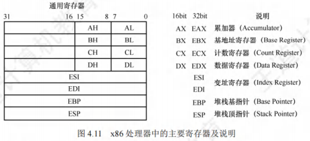
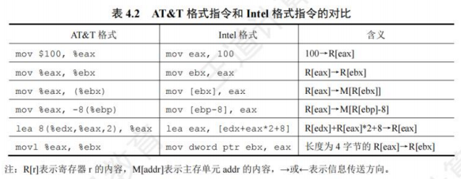
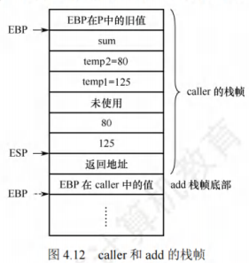
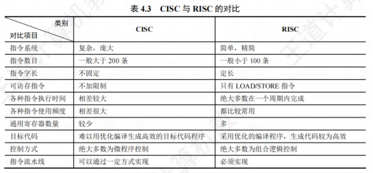

# 指令系统

## 程序的机器级代码表

### 常用汇编指令介绍

#### 相关寄存器
x86处理器中有8个32位的通用寄存器。为了向后兼容，**EAX、EBX、ECX和EDX的高两位字节和低两位字节可以独立使用**，E表示Extended，表示32位的寄存器。例如，EAX的低两位字节称为AX，而AX的高低字节又可分别作为两个8位寄存器，分别称为AH和AL。



除EBP和ESP外，其他几个寄存器的用法比较灵活。

#### 汇编指令格式
使用不同的编程工具开发程序时，用到的汇编程序也不同，一般有两种不同的汇编格式：AT&T格式和Intel格式（统考要求掌握的是**Intel格式**）。它们的区别主要体现如下：
- **字母大小写**：AT&T格式的指令只能用小写字母，而Intel格式的指令对大小写不敏感。
- **操作数顺序**：在AT&T格式中，第一个为源操作数，第二个为目的操作数，方向从左到右；在Intel格式中，第一个为目的操作数，第二个为源操作数，方向从右向左。
- **前缀使用**：在AT&T格式中，寄存器需要加前缀“%”，立即数需要加前缀“$”；在Intel格式中，寄存器和立即数都不需要加前缀。
- **内存寻址符号**：在内存寻址方面，AT&T格式使用“(”和“)”，而Intel格式使用“[”和“]”。
- **复杂寻址方式**：在处理复杂寻址方式时，例如AT&T格式的内存操作数“disp(base,index,scale)”分别表示偏移量、基址寄存器、变址寄存器和比例因子，如“8(%edx,%eax,2)”表示操作数为$M[R[edx]+R[eax]*2+8]$，其对应的Intel格式的操作数为“[edx+eax*2+8]”。
- **指定数据长度**：在指定数据长度方面，AT&T格式指令操作码的后面紧跟一个字符，表明操作数大小，“b”表示byte(字节)、“w”表示word(字)或“l”表示long(双字)。Intel格式也有类似的语法，它在操作码后面显式地注明byte ptr、word ptr或dword ptr。

由于32或64位体系结构都是由16位扩展而来的，因此用Word(字)表示16位。表4.2展示了两种格式的几条不同指令。其中，**mov指令用于在内存和寄存器之间或者寄存器之间移动数据**；**lea指令用于将一个内存地址(而不是其所指的内容)加载到目的寄存器**。



两种汇编格式的相互转换并不复杂，但历年统考真题采用的均是Intel格式。 

#### 常用指令

汇编指令通常可分为数据传送指令、算术和逻辑运算指令和控制流指令，下面以Intel格式为例，介绍一些常用的指令。以下用于操作数的标记分别表示寄存器、内存和常数：
- `<reg>`：表示任意寄存器，若其后带有数字，则指定其位数，如`<reg32>`表示32位寄存器（eax, ebx, ecx, edx, esi, edi, esp或ebp）；`<reg16>`表示16位寄存器（ax, bx, cx或dx）；`<reg8>`表示8位寄存器（ah, al, bh, bl, ch, cl, dh, dl）。
- `<mem>`：表示内存地址（如`[eax]`、`[var + 4]`或`dword ptr [eax + ebx]`）。
- `<con>`：表示8位、16位或32位常数。`<con8>`表示8位常数；`<con16>`表示16位常数；`<con32>`表示32位常数。

x86中的指令机器码长度为1字节，对同一指令的不同用途有多种编码方式，比如mov指令就有28种机内编码，用于不同操作数类型或用于特定寄存器，例如：

```
# 机器码为B8H
mov ax, <con16>
# 机器码为B0H
mov al, <con8>
# 机器码为89H
mov <reg16>, <reg16>/<mem16>
# 机器码为8AH
mov <reg8>/<mem8>, <reg8>
# 机器码为8BH
mov <reg16>/<mem16>, <reg16>
```

##### 数据传送指令
1. **mov指令**：将第二个操作数（寄存器的内容、内存中的内容或常数值）复制到第一个操作数（寄存器或内存）。
    - 语法：

```
mov <reg>, <reg>
mov <reg>, <mem>
mov <mem>, <reg>
mov <reg>, <con>
mov <mem>, <con>
```

	- 举例：

```
# 将ebx值复制到eax
mov eax, ebx
# 将5保存到var值指示的内存地址的一字节中
mov byte ptr [var], 5
```

    - 注意：双操作数指令的两个操作数不能都是内存，即mov指令不能用于直接从内存复制到内存，若需在内存之间复制，可先从内存复制到一个寄存器，再从这个寄存器复制到内存。


2. **push指令**：将操作数压入内存的栈，常用于函数调用。ESP是栈顶，入栈前先将ESP值减4（栈增长方向与内存地址增长方向相反），然后将操作数压入ESP指示的地址。
    - 语法：

```
push <reg32>
push <mem>
push <con32>
```
    - 举例（注意，栈中元素固定为32位）：

```
# 将eax值入栈
push eax
# 将var值指示的内存地址的4字节值入栈
push [var]
```

3. **pop指令**：与push指令相反，pop指令执行的是出栈工作，出栈前先将ESP指示的地址中的内容出栈，然后将ESP值加4。
    - 语法：

```
# 弹出栈顶元素送到eax
pop eax
# 弹出栈顶元素送到ebx值指示的内存地址的4字节中
pop [ebx]
```

##### 算术和逻辑运算指令

1. **add/sub指令**：add指令将两个操作数相加，相加的结果保存到第一个操作数中。sub指令用于两个操作数相减，相减的结果保存到第一个操作数中。
    - 语法：

```
add <reg>, <reg>
sub <reg>, <reg>
add <reg>, <mem>
sub <reg>, <mem>
add <mem>, <reg>
sub <mem>, <reg>
add <reg>, <con>
sub <reg>, <con>
add <mem>, <con>
sub <mem>, <con>
```

	- 举例：

```
# eax = eax - 10
sub eax, 10
# 10与var值指示的内存地址的一字节值相加，并将结果保存在var值指示的内存地址的字节中
add byte ptr [var], 10
```
2. **inc/dec指令**：inc、dec指令分别表示将操作数自加1、自减1。
    - 语法：
```
inc <reg>
dec <reg>
inc <mem> / dec <mem>
```
    - 举例：
```
# eax值自减1
dec eax
# var值指示的内存地址的4字节值自加1
inc dword ptr [var]
```
3. **imul指令**：有符号整数乘法指令，有两种格式：
    - 两个操作数，两个操作数相乘，将结果保存在第一个操作数中，第一个操作数必须为寄存器。
    - 三个操作数，将第二个和第三个操作数相乘，将结果保存在第一个操作数中，第一个操作数必须为寄存器。
    - 语法：
```
imul <reg32>, <reg32>
imul <reg32>, <mem>
imul <reg32>, <reg32>, <con>
imul <reg32>, <mem>, <con>
```
    - 举例：
```
# eax = eax * [var]
imul eax, [var]
# esi = edi * 25
imul esi, edi, 25
```
    - 注意：乘法操作结果可能溢出，则编译器置溢出标志OF = 1，以使CPU调出溢出异常处理程序。
4. **idiv指令**：有符号整数除法指令，它只有一个操作数，即除数，而被除数则为edx:eax中的内容（共64位），操作结果有两部分：商和余数，商送到eax，余数则送到edx。
    - 语法：
```
idiv <reg32>
idiv <mem>
```
    - 举例：
```
idiv ebx
idiv dword ptr [var]
```
5. **and/or/xor指令**：and、or、xor指令分别是逻辑与、逻辑或、逻辑异或操作指令，用于操作数的位操作，操作结果放在第一个操作数中。
    - 语法：
```
and <reg>, <reg> / or <reg>, <reg> / xor <reg>, <reg>
and <reg>, <mem> / or <reg>, <mem> / xor <reg>, <mem>
and <mem>, <reg> / or <mem>, <reg> / xor <mem>, <reg>
and <reg>, <con> / or <reg>, <con> / xor <reg>, <con>
and <mem>, <con> / or <mem>, <con> / xor <mem>, <con>
```
    - 举例：
```
# 将eax中的前28位全部置为0，最后4位保持不变
and eax, 0fH
# 置edx中的内容为0
xor edx, edx
```
6. **not指令**：位翻转指令，将操作数中的每一位翻转，即0 -> 1、1 -> 0。
    - 语法：
```
not <reg>
not <mem>
```
    - 举例：
```
# 将var值指示的内存地址的一字节的所有位翻转
not byte ptr [var]
```
7. **neg指令**：取负指令。
    - 语法：
```
neg <reg>
neg <mem>
```
    - 举例：
```
# eax = -eax
neg eax
```
8. **shl/shr指令**：逻辑移位指令，shl为逻辑左移，shr为逻辑右移，第一个操作数表示被操作数，第二个操作数指示移位的位数。
    - 语法：
```
shl <reg>, <con8>
shr <reg>, <con8>
shl <mem>, <con8>
shr <mem>, <con8>
shl <reg>, <cl> / shr <reg>, <cl>
shl <mem>, <cl> / shr <mem>, <cl>
```
    - 举例：
```
# 将eax值左移1位
shl eax, 1
# 将ebx值右移n位（n为cl中的值）
shr ebx, cl
```

##### 控制流指令
x86处理器维持着一个指示当前执行指令的指令指针（IP），当一条指令执行后，此指针自动指向下一条指令。IP寄存器不能直接操作，但可以用控制流指令更新。通常用标签（label）指示程序中的指令地址，在x86汇编代码中，可在任何指令前加入标签。例如：
```
mov esi, [ebp + 8]
begin: xor ecx, ecx
mov eax, [esi]
```
这样就用begin指示了第二条指令，控制流指令通过标签就可以实现程序指令的跳转。

1. **jmp指令**：jmp指令控制IP转移到label所指示的地址（从label中取出指令执行）。
    - 语法：
```
jmp <label>
```
    - 举例：
```
# 转跳到begin标记的指令执行
jmp begin
```
2. **jcondition指令**：条件转移指令，依据CPU状态字中的一系列条件状态转移。CPU状态字中包括指示最后一个算术运算结果是否为0，运算结果是否为负数等。
    - 语法：
```
je <label> (jump when equal)
jz <label> (jump when last result was zero)
jne <label> (jump when not equal)
jg <label> (jump when greater than)
jge <label> (jump when greater than or equal to)
jl <label> (jump when less than)
jle <label> (jump when less than or equal to)
```
    - 举例：
```
cmp eax, ebx
# 若eax值 <= ebx值，则跳转到done执行；否则执行下一条指令
jle done
```
3. **cmp/test指令**：cmp指令的功能相当于sub指令，用于比较两个操作数的值。test指令的功能相当于and指令，对两个操作数进行逐位与运算。与sub和and指令不同的是，这两类指令都不保存操作结果，仅根据运算结果设置CPU状态字中的条件码。
    - 语法：
```
cmp <reg>, <reg> / test <reg>, <reg>
cmp <reg>, <mem> / test <reg>, <mem>
cmp <mem>, <reg> / test <mem>, <reg>
cmp <reg>, <con> / test <reg>, <con>
```
    - 举例：
```
# 将var指示的主存地址的4字节内容，与10比较
cmp dword ptr [var], 10
# 若相等则继续顺序执行；否则跳转到loop处执行
jne loop
# 测试eax是否为零
test eax, eax
# 为零则置标志ZF为1，转跳到xxxx处执行
jz xxxx
```
4. **call/ret指令**：分别用于实现子程序（过程、函数等）的调用及返回。
    - 语法：
```
call <label>
ret
```
    - call指令首先将当前执行指令地址入栈，然后无条件转移到由标签指示的指令。与其他简单的跳转指令不同，call指令保存调用之前的地址信息（当call指令结束后，返回调用之前的地址）。
    - ret指令实现子程序的返回机制，ret指令弹出栈中保存的指令地址，然后无条件转移到保存的指令地址执行。call和ret是程序（函数）调用中最关键的两条指令。

理解上述指令的语法和用途，可以更好地帮助读者解答相关题型。读者在上机调试C程序代码时，也可以尝试用编译器调试，以便更好地帮助理解机器指令的执行。

### 选择语句的机器级表示

常见的选择结构语句有`if-then`、`if-then-else`等。编译器通过**条件码(标志位)设置指令和各类转移指令**来实现程序中的选择结构语句。条件码描述了最近的算术或逻辑运算操作的属性，可以检测这些寄存器来执行条件分支指令，最常用的条件码有**`CF`、`ZF`、`SF`和`OF`**。

常见的算术逻辑运算指令（`add` , `sub` , `imul` , `or` , `and` , `shl` , `inc` , `dec` , `nosal` 等）会设置条件码，还有**`cmp`和`test`指令只设置条件码而不改变任何其他寄存器**。

之前介绍的`jcondition`条件转跳指令，就是根据条件码**`ZF`和`SF`**来实现转跳的。

`if-else`语句的通用形式如下：

```
if(test expr)
    then statement
else
    else statement
```
这里的testexpr是一个整数表达式，它的取值为0(假)，或为非0(真)。两个分支语句（then statement或else statement）中只会执行一个。

这种通用形式可以被翻译成如下所示的goto语句形式：
```
t = test_expr;
if(!t)
    goto false;
then statement
goto done;
false:
else statement
done:
```

对于下面的C语言函数：
```c
int get_cont(int *p1, int *p2){
    if (p1 > p2)
        return *p2;
    else
        return *p1;
}
```
已知p1和p2对应的实参已被压入调用函数的栈帧，它们对应的存储地址上分别为`R[ebp]+8`、`R[ebp]+12`（**EBP指向当前栈帧底部**），返回结果存放在**EAX**中。对应的的汇编代码为：
```
# R[eax] = M[R[ebp]+8],即R[eax]=p1
mov eax, dword ptr [ebp+8]
# R[edx] = M[R[ebp]+12],即R[edx]=p2
mov edx, dword ptr [ebp+12]
# 比较p1和p2,即根据p1-p2的结果置标志
cmp eax, edx
# 若p1<=p2,则转标记L1处执行
jbe .L1
# R[eax] = M[R[edx]],即R[eax]=M[p2]
mov eax,dword ptr [edx]
# 无条件跳转到标记L2执行
jmp .L2
.L1:
# R[eax] = M[R[eax]],即R[eax]=M[p1]
mov eax, dword ptr [eax]
.L2:
```
p1和p2是指针型参数，所以在32位机中的长度是dword ptr，比较指令cmp的两个操作数都应来自寄存器，因此应先将p1和p2对应的实参从栈中取到通用寄存器，比较指令执行后得到各个条件码，然后根据各条件码值的组合选择执行不同的指令，因此需要用到条件转移指令。 

### 循环语句的机器级表示

常见的循环结构语句有`while`、`for`和`do-while`。汇编中没有相应的指令存在，可以用条件测试和转跳组合起来实现循环的效果，大多数编译器将这三种循环结构都转换为**`do-while`形式**来产生机器代码。在循环结构中，通常使用**条件转移指令**来判断循环条件的结束。

#### (1) do-while循环
do-while语句的通用形式如下：
```
do
    body statement
while(test expr)
```
这种通用形式可以被翻译成如下所示的条件和goto语句：
```
loop:
    body statement
    t = test_expr
    if (t)
        goto loop;
```
也就是说，每次循环，程序会执行循环体内的语句，**body_statement至少会执行一次**，然后执行测试表达式。若测试为真，则继续执行循环。

#### (2) while循环
while语句的通用形式如下：
```
while (test_expr)
    body statement
```
与do-while的不同之处在于，第一次执行body_statement之前，就会测试test_expr的值，循环有可能中止。GCC通常会将其翻译成条件分支加do-while循环的方式。

用如下模板来表达这种方法，将通用的while循环格式翻译成do-while循环：
```
t = test_expr
if(!t)
    goto done;
do
    body statement
while (test_expr);
done:
```
相应地，进一步将它翻译成goto语句：
```
t = test_expr;
if(!t)
    goto done;
loop:
    body statement
    t = test_expr
    if (t)
        goto loop;
done:
```

#### (3) for循环
for 循环的通用形式如下：
```
for(init expr; test expr; update expr)
    body statement
```
这个for循环的行为与下面这段while循环代码的行为一样：
```
init expr;
while(test expr){
    body statement
    update expr;
}
```
进一步把它翻译成goto语句：
```
init expr;
t = test_expr;
if(!t)
    goto done;
loop:
    body statement
    update expr;
    t = test_expr
    if (t)
        goto loop;
done:
```

下面是一个用for循环写的自然数求和的函数：
```c
int nsum_for(int n){
    int i;
    int result = 0;
    for(i=1;i<=n;i++)
        result +=i;
    return result;
}
```
这段代码中的for循环的不同组成部分如下：
- `i = 1`：init expr
- `i <= n`：test_expr
- `i++`：update_expr
- `result += i`：body statement

通过替换前面给出的模板中的相应位置，很容易将for循环转换为while或do-while循环。

将这个函数翻译为goto语句代码后，不难得出其过程体的汇编代码：
```
# R[ecx] = M[R[ebp]+8],即R[ecx]=n
mov ecx,dword ptr [ebp+8] 
# R[eax] = 0,即result=0
mov eax,0 
# R[edx] = 1,即i=1
mov edx,1 
# Compare R[edx] : R[ecx],即比较 i : n
cmp edx, ecx 
# If greater,转跳到L2执行
jg .L2 
.L1:
# loop:
# R[eax] = R[eax] + R[edx],即result +=i
add eax,edx 
# R[edx] = R[edx] + 1,即i++
add edx, 1 
# 比较R[edx]和R[ecx],即比较i : n
cmp edx,ecx 
# If less or equal,转跳到L1执行
jle .L1 
.L2:
```
已知n对应的实参已被压入调用函数的栈帧，其对应的存储地址为`R[ebp]+8`，过程nsum_for中的局部变量i和result被分别分配到寄存器**EDX和EAX**中，返回参数在**EAX**中。 

### 过程调用的机器级表示

前面提到的**call/ret指令**主要用于过程调用，它们都属于一种无条件转移指令。

假定过程P(调用者)调用过程Q(被调用者)，过程调用的执行步骤如下：
1. P将入口参数(实参)放到Q能访问到的地方。
2. P将返回地址存到特定的地方，然后将控制转移到Q。
3. Q保存P的现场(通用寄存器的内容)，并为自己的非静态局部变量分配空间。
4. 执行过程Q。
5. Q恢复P的现场，将返回结果放到P能访问到的地方，并释放局部变量所占空间。
6. Q取出返回地址，将控制转移到P。

步骤2由call指令实现，步骤6通过ret指令返回到过程P。在上述步骤中，需要为入口参数、返回地址、过程P的现场、过程Q的局部变量、返回结果找到存放空间。

用户可见寄存器数量有限，调用者和被调用者需共享寄存器，若直接覆盖对方的寄存器，会导致程序出错。因此有如下规范：
- 寄存器**EAX、ECX和EDX是调用者保存寄存器**，当P调用Q时，若Q需用到这些寄存器，则由P将这些寄存器的内容保存到栈中，并在返回后由P恢复它们的值。
- 寄存器**EBX、ESI、EDI是被调用者保存寄存器**，当P调用Q时，Q必须先将这些寄存器的内容保存在栈中才能使用它们，并在返回P之前先恢复它们的值。

每个过程都有自己的栈区，称为**栈帧**，因此，一个栈由若干栈帧组成。寄存器**EBP指示栈帧的起始位置**，寄存器**ESP指示栈顶**，栈从高地址向低地址增长。过程执行时，ESP会随着数据的入栈而动态变化，而EBP固定不变。当前栈帧的范围在EBP和ESP指向的区域之间。

下面用一个简单的C语言程序来说明过程调用的机器级实现。
```c
int add(int x, int y){
    return x + y;
}
int caller(){
    int temp1 = 125;
    int temp2 = 80;
    int sum = add(temp1, temp2);
    return sum;
}
```
经GCC编译后，caller过程对应的代码如下（#后面的文字是注释）：
```asm
caller:
    push ebp
    mov ebp, esp
    sub esp, 24
    mov [ebp - 12], 125  # M[R[ebp] - 12] = 125,即temp1 = 125
    mov [ebp - 8], 80    # M[R[ebp] - 8] = 80,即temp2 = 80
    mov eax, dword ptr [ebp - 8]  # R[eax] = M[R[ebp] - 8],即R[eax] = temp2
    mov [esp + 4], eax   # M[R[esp] + 4] = R[eax],即temp2入栈
    mov eax, dword ptr [ebp - 12] # R[eax] = M[R[ebp] - 12],即R[eax] = temp1
    mov [esp], eax       # M[R[esp]] = R[eax],即temp1入栈
    call add             # 调用add,将返回值保存在eax中
    mov [ebp - 4], eax   # M[R[ebp] - 4] = R[eax],即add返回值送sum
    mov eax, dword ptr [ebp - 4] # R[eax] = M[R[ebp] - 4],即sum作为返回值
    leave
    ret
```
图4.12给出了caller栈帧的状态，假定caller被过程P调用。执行第4行的指令后，ESP所指的位置如图中所示，可以看出GCC为caller的参数分配了24字节的空间。从汇编代码中可以看出：
- caller中只使用了调用者保存寄存器EAX，没有使用任何被调用者保存寄存器，因此在caller栈帧中无须保存除EBP外的任何寄存器的值。
- caller有三个局部变量temp1、temp2和sum，皆被分配在栈帧中。
- 在用call指令调用add函数之前，caller先将入口参数从右向左依次将temp2和temp1的值(即80和125)保存到栈中。在执行call指令时再把返回地址压入栈中。此外，在最初进入caller时，还将EBP的值压入了栈，因此caller的栈帧中用到的空间占4 + 12 + 8 + 4 = 28字节。但是，caller的栈帧共有4 + 24 + 4 = 32字节，其中浪费了4字节的空间(未使用)。这是因为GCC为保证数据的严格对齐而规定每个函数的栈帧大小必须是16字节的倍数。

call指令执行后，add函数的返回参数存放在EAX中，因此call指令后面的两条指令中：
- 指令`mov [ebp - 4], eax`将add的结果存入sum变量的存储空间，该变量的地址为R[ebp] - 4。
- 指令`mov eax, dword ptr [ebp - 4]`将sum变量的值作为返回值送到寄存器EAX中。



在执行ret指令之前，应将当前栈帧释放，并恢复旧EBP的值，上述第14行leave指令实现了这个功能，leave指令功能相当于以下两条指令的功能：
```asm
mov esp, ebp
pop ebp
```
其中，第一条指令使ESP指向当前EBP的位置，第二条指令执行后，EBP恢复为P中的旧值，并使ESP指向返回地址。

执行完leave指令后，ret指令就可从ESP所指处取返回地址，以返回P执行。当然，编译器也可通过pop指令和对ESP的内容做加法来进行退栈操作，而不一定要使用leave指令。

add过程经GCC编译并进行链接后，对应的代码如下所示：
```asm
8048469: 55         push ebp
804846a: 89 e5      mov ebp, esp
804846c: 8b 45 0c   mov eax, dword ptr [ebp + 12]
804846f: 8b 55 08   mov edx, dword ptr [ebp + 8]
8048472: 8d 04 02   lea eax, [edx + eax]
8048475: 5d         pop ebp
8048476: c3         ret
```
通常，一个过程对应的机器级代码都有三个部分：准备阶段、过程体和结束阶段。
- 上述第1、2行的指令构成准备阶段的代码段，这是最简单的准备阶段代码段，它通过将当前栈指针ESP传送到EBP来完成将EBP指向当前栈帧底部的任务，如图4.12所示，EBP指向add栈帧底部，从而可以方便地通过EBP获取入口参数。这里add的入口参数x和y对应的值(125和80)分别在地址为R[ebp] + 8、R[ebp] + 12的存储单元中。
- 上述第3、4、5行的指令序列是过程体的代码段，过程体结束时将返回值放在EAX中。这里好像没有加法指令，实际上第5行lea指令执行的是加法运算R[edx] + R[eax] = x + y。
- 上述第6、7行的指令序列是结束阶段的代码段，通过将EBP弹出栈帧来恢复EBP在caller过程中的值，并在栈中退出add过程的栈帧，使得执行到ret指令时栈顶中已经是返回地址。这里的返回地址应该是caller代码中第12行的指令`mov [ebp - 4], eax`的地址。

add过程中没有用到任何被调用者保存寄存器，没有局部变量，此外，add是一个被调用过程，并且不再调用其他过程，因此也没有入口参数和返回地址上要保存，因此，在add的栈帧中除了需要保存EBP，无须保留其他任何信息。 

## CISC和RISC的基本概念

指令系统朝两个截然不同的方向发展：
- 一是增强原有指令的功能，设置更为复杂的新指令实现软件功能的硬化，这类机器称为**复杂指令系统计算机(CISC)**，典型的有采用x86架构的计算机。
- 二是减少指令种类和简化指令功能，提高指令的执行速度，这类机器称为**精简指令系统计算机(RISC)**，典型的有ARM、MIPS架构的计算机。

### 复杂指令系统计算机(CISC)

随着集成电路技术的发展，软件成本不断上升，促使人们在指令系统中增加更多、更复杂的指令，以适应不同的应用领域，这样就构成了复杂指令系统计算机(CISC)。

CISC的主要特点如下：
1. 指令系统复杂庞大，指令数目一般为200条以上。
2. 指令的长度不固定，指令格式多，寻址方式多。
3. 可以访存的指令不受限制。
4. 各种指令使用频度相差很大。
5. 各种指令执行时间相差很大，大多数指令需多个时钟周期才能完成。
6. 控制器大多数采用微程序控制。有些指令非常复杂，以至于无法采用硬连线控制。
7. 难以用优化编译生成高效的目标代码程序。

如此庞大的指令系统，对指令的设计提出了极高的要求，研制周期变得很长。后来人们发现，一味地追求指令系统的复杂和完备程度不是提高性能的唯一途径。对传统CISC指令系统的测试表明，各种指令的使用频率相差悬殊，大概只有20%的简单指令被反复使用，约占整个程序的80%；而80%左右的复杂指令则很少使用，约占整个程序的20%。从这一事实出发，人们开始用最常用的20%的简单指令，重组实现不常用的80%的指令功能，RISC随之诞生。

### 精简指令系统计算机(RISC)

精简指令系统计算机(RISC)的中心思想是要求指令系统简化，尽量使用寄存器-寄存器操作指令，指令格式力求一致。RISC的主要特点如下：
1. 选取使用频率最高的一些简单指令，复杂指令的功能由简单指令的组合来实现。
2. 指令长度固定，指令格式种类少，寻址方式种类少。
3. 只有LOAD/STORE(取数/存数)指令访存，其余指令的操作都在寄存器之间进行。
4. CPU中通用寄存器的数量相当多。
5. 一定采用指令流水线技术，大部分指令在一个时钟周期内完成。
6. 以硬布线控制为主，不用或少用微程序控制。
7. 特别重视编译优化工作，以减少程序执行时间。

值得注意的是，从指令系统兼容性看，CISC大多能实现软件兼容，即高档机包含了低档机的全部指令，并可加以扩充。但RISC简化了指令系统，指令条数少，格式也不同于老机器，因此大多数RISC机不能与老机器兼容。由于RISC具有更强的实用性，因此应该是未来处理器的发展方向。但事实上，当今时代Intel几乎一统江湖，且早期很多软件都是根据CISC设计的，单纯的RISC将无法兼容。此外，现代CISC结构的CPU已经融合了很多RISC的成分，其性能差距已经越来越小。CISC可以提供更多的功能，这是程序设计所需要的。

### CISC和RISC的比较

和CISC相比，RISC的优点主要体现在以下几点：
1. RISC更能充分利用VLSI(超大规模集成电路)芯片的面积。CISC采用微程序控制，其控制存储器占CPU芯片面积的50%以上，而RISC采用组合逻辑控制，其硬布线逻辑只占CPU芯片面积的10%左右。
2. RISC更能提高运算速度。RISC的指令数、寻址方式和指令格式种类少，又设有多个通用寄存器，采用流水线技术，所以运算速度更快，大多数指令在一个时钟周期内完成。
3. RISC便于设计，可降低成本，提高可靠性。RISC指令系统简单，因此机器设计周期短；其逻辑简单，出错概率低，有错也易发现，因此可靠性高。
4. RISC有利于编译程序代码优化。RISC指令类型少，寻址方式少，使编译程序容易选择更有效的指令和寻址方式，并适当地调整指令顺序，使得代码执行更高效化。

CISC和RISC的对比见表4.3。 

