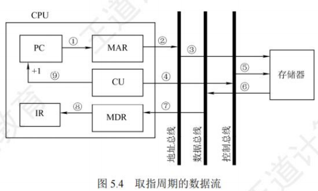
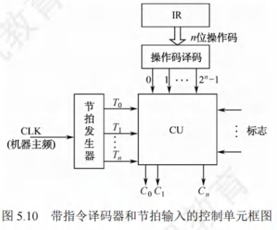
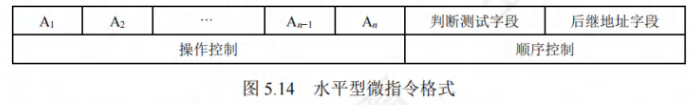

# 中央处理器

## CPU的功能和基本结构

### CPU的功能
中央处理器(CPU)由**运算器和控制器**组成。其中，**控制器**的功能是负责协调并控制计算机各部件执行程序的指令序列；**运算器**的功能是对数据进行加工。CPU的具体功能包括：
1. **指令控制**：完成取指令(也称取指)、分析指令和执行指令的操作，即程序的顺序控制。
2. **操作控制**：产生完成一条指令所需的操作信号，把各种操作信号送到相应的部件，从而控制这些部件按指令的要求正确执行。
3. **时间控制**：严格控制各种操作信号的出现时间、持续时间及出现的时间顺序。
4. **数据加工**：对数据进行算术和逻辑运算。
5. **中断处理**：对运行过程中出现的异常情况和中断请求进行处理。

### CPU的基本结构
在计算机系统中，CPU主要由**运算器和控制器**两大部分组成[也可将CPU分为数据通路(见5.3节)和控制部件两大组成部分]，如图5.1所示。

#### 运算器
运算器主要由**算术逻辑单元(ALU)、暂存寄存器、累加寄存存器(ACC)、通用寄存器组(GPRS)、程序状态字寄存器(PSW)、移位寄存器、计数器(CT)**等组成。其主要功能是根据控制器送来的命令，对数据执行**算术运算(加、减、乘、除)、逻辑运算(与、或、非、异或、移位、求补等)或条件测试(用于设置ZF、SF、OF和CF等标志位，作为条件转移的判断条件)**。

#### 控制器
控制器主要由**程序计数器(PC)、指令寄存器(IR)、指令译码器(ID)、存储器地址寄存器(MAR)、存储器数据寄存器(MDR)、时序电路和微操作信号发生器**等组成。其主要功能是执行指令，每条指令的执行是由控制器发出的一组微操作实现的。

控制器的工作原理是，根据指令操作码、指令的执行步骤(微命令序列)和条件信号来形成当前计算机各部件要用到的控制信号。计算机整机各硬件系统在这些控制信号的控制下协同运行，产生预期的执行结果。**控制器是整个系统的指挥中枢**，在控制器的控制下，运算器、存储器和输入/输出设备等功能部件构成一个有机的整体，根据指令的要求指挥全机协调工作。

### CPU的寄存器
CPU中的寄存器按汇编语言(或机器语言)程序是否可访问，可分为两类：
- 一类是**用户可见寄存器**，可对这类寄存器编程，以通过使用这类寄存器减少对主存储器的访问次数，如通用寄存器组(含基址/变址寄存器)、程序状态字寄存器、程序计数器、累加寄存器、移位寄存器。
- 另一类是**用户不可见寄存器**，对用户是透明的，不可对这类寄存器编程，它们被控制部件使用，以控制CPU的操作，如存储器地址寄存器、存储器数据寄存器、指令寄存器、暂存寄存器。

#### 运算器中的寄存器
1. **通用寄存器组(GPRs)**：用于存放操作数(包括源操作数、目的操作数及中间结果)和各种地址信息等，如AX、BX、CX、DX、SP等。在指令中要指定寄存器的编号，才能明确是对哪个寄存器进行访问。SP是堆栈指针，用于指示栈顶的地址。
2. **累加寄存器(ACC)**：它是一个通用寄存器，用于暂时存放ALU运算的结果。
3. **移位寄存器(SR)**：不但可用来存放操作数，而且在控制信号的作用下，寄存器中的数据可根据需要向左或向右移位。
4. **暂存寄存器**：用于暂存从数据总线或通用寄存器送来的操作数，以便在取出下一个操作数时将其同时送入ALU。暂存寄存器对应用程序员是透明的(不可见)。
5. **程序状态宇寄存器(PSW)**：保留由算术/逻辑运算指令或测试指令的运行结果而建立的各种状态信息，如溢出标志(OF)、符号标志(SF)、零标志(ZF)、进位标志(CF)等。每个标志位通常由一位触发器来保存，这些标志位组合在一起称为程序状态字。

#### 控制器中的寄存器
1. **程序计数器(PC)**：用于指出欲执行指令在主存储器中的存放地址。若PC和主存储器均按字节编址，则PC的位数等于主存储器地址位数。CPU根据PC的内容从主存储器中取指令，然后送入指令寄存器。指令通常是顺序执行的，因此PC具有自动加1的功能(这里的"1"是指一条指令的字节数)；当遇到转移类指令时，PC的新值由指令计算得到。
2. **指令寄存器(IR)**：用于保存当前正在执行的指令，IR的位数等于指令字长。
3. **存储器地址寄存器(MAR)**：用于存放要访问的主存储器单元的的地址，MAR的位数等于主存储器地址线数，它反映了最多可寻址的存储单元的个数。
4. **存储器数据寄存器(MDR)**：用于存放向主存储器写入的信息或从主存储器读出的信息，MDR的位数等于存储字长。当CPU和主存储器交换信息时，都要用到MAR和MDR。 

## 指令执行过程

### 指令周期
CPU每取出并执行一条指令所需的全部时间称为**指令周期**，不同指令的指令周期可能不同。指令周期通常可用若干机器周期来表示，每个指令周期内的机器周期数可以不等。图5.2反映了上述关系。图5.2(a)所示为定长的机器周期，图5.2(b)所示为不定长的机器周期。

- 对于无条件转移指令JMPX，在执行时不需要访问主存，只包含取指阶段(包括取指和分析)和执行阶段，所以其指令周期仅包含**取指周期和执行周期**。
- 对于间接寻址的指令，为了取操作数，需要先访问一次主存，取出有效地址，然后访问主存，取出操作数，所以还需包括**间址周期**。间址周期介于取指周期和执行周期之间。
- 当CPU采用中断方式实现主机和I/O设备的信息交换时，CPU在每条指令执行结束前，都要发中断查询信号，若有中断请求，则CPU进入中断响应阶段，也称**中断周期**。这样，一个完整的指令周期可包括**取指、间址、执行和中断4个周期**，如图5.3所示。

当CPU执行指令时：
1. 首先进入**取指周期**，从PC指出的主存单元中取出指令，送至指令寄存器，同时PC加“1”以作为下一条指令的地址。当遇到转移指令等改变执行顺序的指令时，在PC加“1”后会重新计算并更新PC值。
2. 然后判断是否有间接寻址，如果有，那么进入**间址周期**以获取操作数的有效地址。
3. 之后进入**执行周期**，完成取操作数、执行运算和存操作数的任务。
4. 执行周期结束后，如果CPU检测到中断请求，则进入**中断周期**，此时需要关中断、保存断点、修改PC值为中断服务程序的入口地址，并转向中断服务程序。

### 指令周期的数据流
数据流是根据指令要求依次访问的数据序列。在指令执行的不同阶段，要求依次访问的数据序列是不同的。而且对于不同的指令，它们的数据流往往也是不同的。

#### 取指周期
取指周期的任务是根据PC中的内容从主存中取出指令代码并存放在IR中。
取指周期的数据流如图5.4所示。PC中存放的是指令的地址，根据此地址从内存单元中取出的是指令，并放在指令寄存器IR中，取指令的同时，PC加1。
取指周期的数据流向如下：
1. PC → MAR → 地址总线 → 存储器。
2. CU发出读命令 → 控制总线 → 存储器。
3. 主存 → 数据总线 → MDR → IR(存放指令)。
4. CU发出控制信号使PC内容加1。

#### 间址周期
间址周期的任务是取操作数有效地址。以一次间址为例(见图5.5)，将指令中的地址码送到MAR并送至地址总线，此后CU向存储器发出读命令，以获取有效地址并存至MDR。
间址周期的数据流向如下：
1. Ad(IR)(或MDR) → MAR → 地址总线 → 存储器。
2. CU发出读命令 → 控制总线 → 存储器。
3. 主存 → 数据总线 → MDR(存放有效地址)。
其中，Ad(IR)表示取出IR中存放的指令字的地址字段。

#### 执行周期
执行周期的任务是取操作数，并根据IR中的指令字的操作码通过ALU操作产生执行结果。不同指令的执行周期操作不同，因此没有统一的数据流向。

#### 中断周期
中断周期的任务是处理中断请求。假设程序断点存入堆栈中，并用SP指示栈顶地址，而且进栈操作是先修改栈顶指针，后存入数据，数据流如图5.6所示。
中断周期的数据流向如下：
1. CU控制将SP减1，SP → MAR → 地址总线 → 存储器。
2. CU发出写命令 → 控制总线 → 存储器。
3. PC → MDR → 数据总线 → 主存(程序断点存入存储器)。
4. CU将中断服务程序的入口地址送入PC。 

### 指令执行方案
一个指令周期通常要包括几个执行步骤，每个步骤完成指令的一部分功能，几个依次执行的步骤完成这条指令的全部功能。不同的处理器采用不同的方案来安排指令的执行步骤。

#### 单周期处理器
**单周期处理器**对所有指令都选用相同的执行时间来完成。此时每条指令都在一个时钟周期内完成（即**CPI = 1**），指令之间**串行执行**，即下一条指令只能在前一条指令执行结束后才能启动。因此，指令周期取决于执行时间最长的指令的执行时间。对于那些本来可以在更短时间内完成的指令，仍要使用这个较长的周期来完成，会降低整个系统的运行速度。

#### 多周期处理器
**多周期处理器**对不同类型的指令选用不同的执行步骤。指令需要几个周期就为其分配几个周期，因此可选用不同个数的时钟周期来完成不同指令的执行过程（即**CPI > 1**），不再要求所有指令占用相同的执行时间。多指令周期方案中指令之间仍是**串行执行**。

#### 流水线处理器
**流水线处理器**采用指令之间**并行执行**的方案，其追求的目标是力争在每个时钟周期完成一条指令的执行过程（只在理想情况下才能达到该效果，此时**CPI = 1**）。这种方案通过在每个时钟周期启动一条指令，尽量让多条指令同时运行，但各自处在不同的执行步骤中。 

## 数据通路的功能和基本结构

### 数据通路的功能
随着技术的发展，更多的功能逻辑被集成到CPU芯片中，但不论CPU的内部结构多么复杂，它都可视为由**数据通路(Data Path)和控制部件(ControlUnit)**两大部分组成。

**数据通路**是数据在指令执行过程中所经过的路径，包括路径上的部件。**ALU、通用寄存器、状态寄存器、异常和中断处理逻辑**等都是指令执行时数据流经的部件，都属于数据通路的一部分。数据通路描述了信息从哪里开始，中间经过哪些部件最后被传送到哪里。数据通路由控制部件控制，控制部件根据每条指令功能的不同，生成对数据通路的控制信号。

### 数据通路的组成
组成数据通路的元件主要分为**组合逻辑元件和时序逻辑元件**两类。

#### 组合逻辑元件(操作元件)
任何时刻产生的输出仅取决于当前的输入。组合电路不含存储信号的记忆单元，也不受时钟信号的控制，输出与输入之间无反馈通路，信号是单向传输的。数据通路中常用的组合逻辑元件有**加法器、算术逻辑单元(ALU)、译码器、多路选择器、三态门**等，如图5.7所示。

图中虚线表示控制信号，译码器可用于操作码或地址码译码，n位输入对应$2^n$种不同组合，因此有$2^n$个不同输出。多路选择器(MUX)需要控制信号Select来确定选择哪个输入被输出。三态门可视为一种控制开关，由控制信号EN决定信号线的通断，当$EN = 1$时，三态门被打开，输出信号等于输入信号；当$EN = 0$时，输出端呈高阻态(隔断态)，所连寄存器与总线断开。

#### 时序逻辑元件(状态元件)
任何时刻的输出不仅与该时刻的输入有关，还与该时刻以前的输入有关，因而时序电路必然包含存储信号的记忆单元。此外，时序电路必须在时钟节拍下工作。各类寄存器和存储器，如**通用寄存器组、程序计数器、状态/移位/暂存/锁存寄存器**等，都属于时序逻辑元件。 

### 数据通路的基本结构
数据通路的基本结构主要有以下几种。

#### CPU内部单总线方式
将ALU及所有寄存器都连接到一条内部公共总线上，称为单总线结构的数据通路。这种结构比较简单，但数据传输存在较多的冲突现象，性能较低。此总线在CPU内部，注意不要把它与连接CPU、存储器和外设的系统总线相混淆。图5.8所示为单总线的数据通路和控制信号。

在图5.8中，GPRs为通用寄存器组，rs、rd分别为所读、写的通用寄存器的编号；Y和Z为暂存器；FR为标志寄存器，用于存放ALU产生的标志信息。带箭头的虚线表示控制信号，字母加"in"表示该部件允许写入，字母加"out"表示该部件允许输出。MDRin表示内部总线上信息写入MDR，MDRout表示MDR的内容送入内部总线。能输出到总线的部件均通过一个三态门与内部总线相连，用于控制该部件与内部总线之间数据通路的连接与断开。

**注意**：单周期处理器(CPI = 1)不能采用单总线方式，因为单总线将所有寄存器都连接到一条公共总线上，一个时钟内只允许一次操作，无法完成一条指令的所有操作。

#### CPU内部多总线方式
CPU内部有两条或更多的总线时，构成双总线结构或多总线结构。将所有寄存器的输入端和输出端都连接到多条公共通路上，相比之下单总线中一个时钟内只允许传送一个数据，因而指令执行效率很低，因此采用多总线方式，同时在多个总线上传送不同的数据，提高效率。

#### 专用数据通路方式
根据指令执行过程中的数据和地址的流动方向安排连接电路，避免使用共享的总线，性能较高，但硬件量大。

**注意**：内部总线是指同一部件，如CPU内部连接各寄存器及运算部件之间的总线；系统总线是指同一台计算机系统的各部件，如CPU、内存和各类I/O接口间互相连接的总线。

### 数据通路的操作举例
总线是一组共享的传输信号线，它不能存储信息，任一时刻也只能有一个部件把信息送到总线上。下面以图5.8所示的单总线数据通路为例，介绍一些常见操作的流程及控制信号。

#### 通用寄存器之间传送数据
在寄存器和总线之间有两个控制信号：Rin和Rout。当Rin有效时，控制将总线上的信息存到寄存器R中；当Rout有效时，控制将寄存器R的内容送至总线。下面以程序计数器PC为例，将PC的内容送至MAR。实现该操作的流程及控制信号为：
- PCout和MARin有效，PC内容→MAR，即$(PC)→MAR$。

#### 从主存读取数据
从主存中读取的信息可能是数据或指令，现以CPU从主存中取指令为例，说明数据在单总线数据通路中的传送过程。实现该操作的流程及控制信号为：
1. PCout和MARin有效，现行指令地址→MAR，即$(PC)→MAR$。
2. MDRin有效，CU发出读命令，取出指令后PC + 1，即$MEM (MAR)→MDR$，$(PC)+1→PC$。
3. MDRout和IRin有效，现行指令→IR，即$(MDR)→IR$。

第一步，将PC的内容通过内部总线送至MAR，需要1个时钟周期。第二步，CU向主存发出读命令，从MAR所指主存单元读取一个字，并送至MDR；同时PC加1为取下一条指令做准备，需要1个主存周期。第三步，将MDR的内容通过内部总线送至IR，需要1个时钟周期。

#### 将数据写入主存
将寄存器R1的内容写入寄存器R2所指的主存单元，完成该操作的流程及控制信号为：
1. R1out和MDRin有效，$(R1)→MDR$。
2. R2out和MARin有效，$(R2)→MAR$。
3. MDRout有效，CU发出写命令，$MDR→MEM (MAR)$。

#### 执行算术或逻辑运算
在单总线数据通路中，每一时刻总线上只有一个数据有效。由于ALU是一个没有存储功能的组合逻辑元件，在其执行运算时必须保持两个输入端同时有效，因此先将一个操作数经内部总线送入暂存器Y保存，Y的内容在ALU的左输入端始终有效，再将另一个操作数经内部总线直接送到ALU的右输入端。此外，ALU的输出端也不能直接与总线相连，否则其输出会通过总线反馈到输入端，影响运算结果，因此将运算结果暂存在暂存器Z中。假设加法指令ADD ACC, R1，实现将ACC的内容和R1的内容相加并写回ACC，完成该操作的流程及控制信号为：
1. R1out和Yin有效，操作数→Y，即$(R1)→Y$。
2. ACCout和ALUin有效，CU向ALU发出加命令，结果→Z，即$(ACC)+(Y)→Z$。
3. Zout和ACCin有效，结果→ACC，即$(Z)→ACC$。

以上3步不能同时执行，否则会引起总线冲突，因此该操作需要3个时钟周期。

#### 修改程序计数器的值
转移指令通过修改程序计数器PC的值来达到转跳的目的。假设转移指令JMP addr，addr为目标转移地址，实现将IR中的地址字段写入PC，完成该操作的流程及控制信号为：
- IRout和PCin有效，$Ad(IR)→PC$。

数据通路结构直接影响CPU内各种信息的传送路径，数据通路不同，指令执行过程的微操作序列的安排也不同，它关系着微操作信号形成部件的设计。 

## 控制器的功能和工作原理

### 控制器的结构和功能
从图5.9可以看到计算机硬件系统的五大功能部件及其连接关系。它们通过数据总线、地址总线和控制总线连接在一起，其中点画线框内的是控制器部件。

现对其主要连接关系简单说明如下：
1. 运算器部件通过数据总线与内存储器、输入设备和输出设备传送数据。
2. 输入设备和输出设备通过接口电路与总线相连接。
3. 内存储器、输入设备和输出设备从地址总线接收地址信息，从控制总线得到控制信号，通过数据总线与其他部件传送数据。
4. 控制器部件从数据总线接收指令信息，从运算器部件接收指令转移地址，送出指令地址到地址总线，还要向系统中的部件提供它们运行所需要的控制信号。

**控制器是计算机系统的指挥中心**，控制器的主要功能有：
1. 从主存中取出一条指令，并指出下一条指令在主存中的位置。
2. 对指令进行译码或测试，产生相应的操作控制信号，以便启动规定的动作。
3. 指挥并控制CPU、主存、输入设备和输出设备之间的数据流动方向。

根据控制器产生微操作控制信号的方式的不同，控制器可分为**硬布线控制器和微程序控制器**，两类控制器中的PC和IR是相同的，但确定和表示指令执行步骤的办法及给出控制各部件运行所需要的控制信号的方案是不同的。

### 硬布线控制器
**硬布线控制器**由复杂的组合逻辑门电路和触发器构成，也称组合逻辑控制器，其原理是根据指令的要求、当前的时序及内外部的状态，按时间的顺序发送一系列微操作控制信号。

指令的操作码是决定控制单元(CU)发出不同控制信号的关键。为了简化CU的逻辑，将存放在IR的n位操作码经过译码电路产生$2^n$个输出，每种操作码对应一个输出送至CU。如果将指令译码器和节拍发生器从CU中分离出来，便可得到简化的控制单元框图，如图5.10所示。

控制单元(CU)的输入信号来源如下：
1. 经指令译码器译码产生的指令信息。现行指令的操作码决定了不同指令在执行周期所需完成的不同操作，它与时钟配合产生不同的控制信号。
2. 时序系统产生的机器周期信号和节拍信号。为了使控制单元按一定的先后顺序、一定的节奏发出各个控制信号，控制单元必须受时钟控制。
3. 来自执行单元的反馈信息即标志。控制单元有时需依赖CPU当前所处的状态产生控制信号，如BAN指令，控制单元要根据上条指令的结果是否为负来产生不同的控制信号。

图5.10中，节拍发生器产生各机器周期中的节拍信号，使不同的微操作命令C(控制信号)按时间的先后发出。个别指令的操作不仅受操作码控制，而且受到状态标志控制，因此CU的输入来自操作码译码电路ID、节拍发生器及状态标志，其输出到CPU内部或外部控制总线上。

**硬布线控制的功能由逻辑门组合实现，其速度主要取决于电路延迟**，因此高速计算机中的关键核心部件CPU往往采用硬布线逻辑实现。因此，RISC一般都选用硬布线控制器。硬布线控制器的控制信号先用逻辑式列出，经化简后用电路来实现，因此显得零乱复杂，当需要修改或增加指令时就必须重新设计电路，非常麻烦。而且指令系统功能越全，微操作命令就越多，电路也就越庞杂，调试就更困难。为了克服这些缺点，便产生了微程序设计方法。 

### 微程序控制器
微程序控制器采用存储逻辑实现，也就是将微操作信号代码化，使每条机器指令转化成为一段微程序并存入一个专门的存储器(控制存储器)中，微操作控制信号由微指令产生。

#### 微程序控制的基本概念
微程序的设计思想就是将每条机器指令编写成一个微程序，每个微程序包含若干微指令，每条微指令对应一个或几个微操作命令。因此，执行一条指令的过程就是执行一个微程序的过程，这些微程序存储在一个控制存储器中。目前，大多数计算机都采用微程序设计技术。

微程序设计技术涉及的基本术语如下：
1. **微命令与微操作**：在微程序控制的计算机中，控制部件向执行部件发出的各种控制命令称为**微命令**，它是构成控制序列的最小单位。例如，打开或关闭某个控制门的电位信号、某个寄存器的打入脉冲等。执行部件收到微命令后所进行的操作称为**微操作**，微命令和微操作是一一对应的。
    - 微命令有相容性和互斥性之分。**相容性微命令**是指那些可以同时出现、共同完成某一些微操作的微命令；而**互斥性微命令**是指在机器中不允许同时出现的微命令。
    - **注意**：硬布线控制器中也有微命令与微操作的概念，并非微程序控制器的专有概念。
2. **微指令与微周期**：
    - 微指令是若干微命令的集合，一条微指令通常至少包含两大部分信息：
        - **操作控制字段**，也称微操作码字段，用于产生某一步操作所需的各种操作控制信号。
        - **顺序控制字段**，也称微地址码字段，用于控制产生下一条要执行的微指令地址。
    - **微周期**是指从控制存储器中取出并执行一条微指令所需的全部时间，通常为一个时钟周期。
3. **主存储器与控制存储器**：
    - 主存储器用于存放程序和数据，在CPU外部，用RAM实现。
    - **控制存储器(CM)**用于存放微程序，在CPU内部，用ROM实现。存放微指令的控制存储器的单元地址称为微地址。
4. **程序与微程序**：
    - 微程序和程序是两个不同的概念。**程序**是指令的有序集合，用于完成特定的功能。**微程序**是微指令的有序集合，用于描述机器指令，一条指令的功能由一段微程序来实现。微程序实际上是机器指令的实时解释器，是由计算机设计者事先编制好并存放在控制存储器中的，一般不提供给用户。对于程序员来说，系统中微程序的结构和功能是透明的，无须知道。
    - 程序最终由机器指令组成，并且由软件设计人员事先编制好并存放在主存储器或者辅助存储器中。

**读者应注意区分以下寄存器**：
- **地址寄存器(MAR)**：用于存放主存的读/写地址。
- **微指令地址寄存器(uPC或CMAR)**：用于存放待执行的微指令在控制存储器中的微地址。
- **指令寄存器(IR)**：用于存放从主存中读出的指令。
- **微指令寄存器(μIR或CMDR)**：用于存放从控制存储器中读出的微指令。

#### 微程序控制器的组成和工作过程
1. **微程序控制器的基本组成**：图5.11所示为一个微程序控制器的基本结构，其主要部件包括：
    - **起始和转移地址形成部件(或简称微地址形成部件)**：用于产生初始和后继微地址，以保证微指令的连续执行。
    - **微指令地址寄存器**：接收微地址形成部件送来的微地址，为读取微指令做准备。
    - **控制存储器**：它是微程序控制器的核心部件，用于存放各指令对应的微程序。
    - **微指令寄存器**：其位数等于微指令字长。

2. **微程序控制器的工作过程**：实际上就是在微程序控制器的控制下计算机执行机器指令的过程，这个过程可描述为：
    - 执行取指令公共操作。在机器开始运行时，自动地将取指微程序的入口地址送入uPC，并从CM中读出相应的微指令并送入uIR。取指微程序的入口地址一般为CM的0号单元，取指微程序执行完成后，从主存中取出的机器指令就已存入指令寄存器中。
    - 由机器指令的操作码字段通过微地址形成部件产生该机器指令所对应的微程序的入口地址，并送入uPC。
    - 从CM中逐条取出对应的微指令并执行。
    - 执行完对应于一条机器指令的一个微程序后，又回到取指微程序的入口地址，继续第1步，以完成取下一条机器指令的公共操作。
    - 以上是一条机器指令的执行过程，如此周而复始，直到整个程序执行完毕。
3. **微程序和机器指令**：
    - 通常，一条机器指令对应一个微程序。由于任何机器指令的取指令操作都是相同的，因此可将取指令操作的微命令统一编成一个微程序，这个微程序只负责将指令从主存单元中取出并送至指令寄存器。
    - 此外，也可编写出对应间址周期的微程序和中断周期的微程序。这样，控制存储器中的微程序个数应为机器指令数再加上对应取指、间址和中断周期等公共的微程序数。

#### 微指令的编码方式
微指令的编码方式也称微指令的控制方式，是指如何对微指令的控制字段进行编码，以形成控制信号。编码的目标是在保证速度的情况下，尽量缩短微指令字长。
1. **直接编码(直接控制)方式**：微指令的直接编码方式如图5.12所示。直接编码法无须进行译码，微指令的操作控制字段中每一位都代表一个微命令。设计微指令时，选用或不选用某个微命令，只要将表示该微命令的对应位设置成1或0即可。每个微命令对应并控制数据通路中的一个微操作。
    - 这种编码的优点是简单、直观，执行速度快，操作并行性好；缺点是微指令字长过长，几个微命令就要求微指令的操作字段有n位，造成控制存储器容量极大。
2. **字段直接编码方式**：将微指令的操作控制字段分成若干小字段，把互斥性微命令在同一字段中，把相容性微命令放在不同字段中，每个字段独立编码，每种编码代表一个微命令且各字段编码含义单独定义，与其他字段无关，这就是字段直接编码方式，如图5.13所示。这种方式可以缩短微指令字长，但因为要通过译码电路后再发出微命令，因此比直接编码方式慢。

**微命令字段分段的原则**：
    - 互斥性微命令分在同一段内，相容性微命令分在不同段内。
    - 每个小段中包含的信息位不能太多，否则将增加译码电路的复杂性和译码时间。
    - 一般每个小段还要留出一个状态，表示本字段不发出任何数命令。因此，当某字段的长度为3位时，最多只能表示7个互斥的微命令，通常用000表示不操作。
3. **字段间接编码方式**：一个字段的某些微命令需由另一个字段中的某些微命令来解释，由于不是靠字段直接译码发出的微命令，因此称为字段间接编码，也称隐式编码。这种方式可进一步缩短微指令字长，但因削弱了微指令的并行控制能力，因此通常作为字段直接编码方式的一种辅助手段。

#### 微指令的地址形成方式
后继微地址的形成主要有以下几个基本类型：
1. 由微指令的后继地址字段(也称下地址字段)指出。在微指令格式中设置一个后继地址字段，由微指令的后继地址字段直接指出后继微指令的地址，这种方式也称断定方式。
2. 根据机器指令的操作码形成。当机器指令取自指令寄存器后，微指令的地址由操作码经微地址形成部件形成，该部件输出的是对应机器指令微程序的首地址。
3. 增量计数器法，即$(uPC)+1→uPC$，适用于后继微指令地址是连续的情况。
4. 根据各种标志决定下一条微指令分支转移的地址。
5. 由硬件直接产生微程序入口地址。电源加电后，第一条微指令的地址可由专门的硬件电路产生，并送至uPC，这个地址即为取指周期微程序的入口地址。

#### 微指令的格式
微指令格式与微指令的编码方式有关，通常分为水平型微指令和垂直型微指令两种。
1. **水平型微指令**：从编码方式看，直接编码、字段直接编码和字段间接编码都属于水平型微指令。水平型微指令的基本指令格式如图5.14所示，指令字中的一位对应一个控制信号，有输出时为1，否则为0。一条水平型微指令定义并执行多个并行操作的微命令。

**水平型微指令的优点是微程序短，并行能力强，执行速度快；缺点是微指令长，编写微程序较麻烦**。
2. **垂直型微指令**：采用类似机器指令操作码的方式，在微指令字中设置微操作码字段，垂直型微指令的基本格式如图5.15所示。一条垂直型微指令通常只能定义并执行一种微命令。

**垂直型微指令的优点是微指令短、简单、规整，便于编写微程序；缺点是微程序长，执行速度慢，效率低**。

**水平型微指令和垂直型微指令的比较如下**：
    - 水平型微指令并行操作能力强、效率高、灵活性强；垂直型微指令则较差。
    - 水平型微指令执行一条指令的时间短；垂直型微指令执行的时间长。
    - 用水平型微指令编写的微程序，微指令字较长但微程序短；垂直型微指令正好相反。
    - 水平型微指令难以掌握；而垂直型微指令与机器指令比较相似，相对容易掌握。

#### 硬布线和微程序控制器的特点
1. **硬布线控制器的特点**：
    - **优点**：由于控制器的速度取决于电路延迟，所以速度快。
    - **缺点**：由于将控制部件视为专门产生固定时序控制信号的逻辑电路，所以把用最少元件和取得最高速度作为设计目标，一旦设计完成，就不可能通过其他额外修改添加新功能。
2. **微程序控制器的特点**：
    - **优点**：相比组合逻辑控制器，微程序控制器具有规整性、灵活性和可维护性。
    - **缺点**：由于微程序控制器采用了存储程序原理，所以每条指令都要从控制存储器中取一次，影响速度。

为便于比较，下面以表格的形式对比二者的不同，见表5.1 

