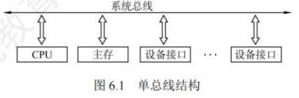
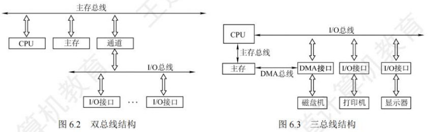

# 总线

## 总线概述

### 总线基本概念

### 总线的定义
总线是一组能为多个部件**分时和共享**的公共信息传送线路。**分时和共享是总线的两个特点**。
- 分时：同一时刻只允许有一个部件向总线发送信息，若系统中有多个部件，则它们只能分时地向总线发送信息。
- 共享：总线上可以挂接多个部件，各个部件之间互相交换的信息都可通过这组线路分时共享，多个部件可同时从总线上接收相同的信息。

### 总线设备
总线上所连接的设备，按其对总线有无控制功能可分为**主设备和从设备**两种。
- **主设备**：指发出总线请求且获得总线控制权的设备。
- **从设备**：指被主设备访问的设备，它只能响应从主设备发来的各种总线命令。

### 总线特性
总线特性是指**机械特性**（尺寸、形状）、**电气特性**（传输方向和有效的电平范围）、**功能特性**（每根传输线的功能）和**时间特性**（信号和时序的关系）。

### 总线的分类
#### 按功能层次分类
1. **片内总线**：芯片内部的总线，用于CPU芯片内部各寄存器之间及寄存器与ALU的连接。
2. **系统总线**：计算机系统内各功能部件（CPU、主存、I/O接口）之间相互连接的总线。按系统总线传输信息内容的不同，又可分为3类：
    - **数据总线**：用来在各部件之间传输数据、指令和中断类型号等，它是双向传输总线，数据总线的位数反映一次能传送的数据的位数。
    - **地址总线**：用来指出数据总线上源数据或目的数据所在的主存单元或I/O端口的地址，它是单向传输总线，地址总线的位数反映最大的寻址空间。
    - **控制总线**：用来传输各种命令、反馈和定时信号，典型的控制信号包括时钟、复位、总线请求/允许、中断请求/回答、存储器读/写、I/O读、I/O写、传输确认等。
    注意区分数据通路和数据总线：各个功能部件通过数据总线连接形成的数据传输路径称为数据通路。数据通路表示的是数据流经的路径，而数据总线是数据传输的媒介。
3. **I/O总线**：主要用于连接中低速的I/O设备，通过I/O接口与系统总线相连接，目的是将低速设备与高速总线分离，以提升总线的系统性能，常见的有USE3、PCI总线。
4. **通信总线**：计算机系统之间或计算机系统与其他系统（如远程通信设备、测试设备）之间传送信息的总线，通信总线也称外部总线。

#### 按时序控制方式分类
1. **同步总线**：总线上连接的部件或设备通过统一的时钟进行同步，在规定的时钟节拍内进行规定的总线操作，来完成部件或设备之间的信息传输。
2. **异步总线**：总线上连接的部件或设备没有统一的时钟，而以信号握手的方式来协调各部件或设备之间的信息传输，总线操作时序不是固定的。

#### 按数据传输方式分类
1. **串行总线**：只有一条双向传输或两条单向传输的数据线，数据按比特位串行顺序传输，其效率低于并行总线。串行传输对数据线的要求不太高，因此适合长距离通信。
2. **并行总线**：有多条双向传输的数据线，可以实现多比特位的同时传输，其效率比串行总线更高。缺点是各条数据线的传输特点可能存在一些差异，比如有的信息位可能会延迟，并且数据线之间相互干扰还会造成传输错误，因此并行总线适合近距离通信。
并行总线并不一定总比串行总线快，它们适合不同的场景。并行总线由于是多个数据位同时传输，需要考虑数据的协同性，以及线路之间的相互干扰，导致工作频率无法持续提高。而串行总线可通过不断提高工作频率来提高传输速度，使其速度最终超越并行总线的速度。

### 系统总线的结构
#### 单总线结构
单总线结构将CPU、主存、I/O设备（通过I/O接口）都挂在一组总线上，允许I/O设备之间、I/O设备与主存之间直接交换信息。CPU与主存、CPU与外设之间都可以通过总线直接进行信息交换，而无须经过中间设备的干预。需要注意的是，单总线并不是指只有一根信号线，系统总线按传送信息的不同可细分为地址总线、数据总线和控制总线。
- **优点**：结构简单，成本低，易于接入新的设备。
- **缺点**：带宽低、负载重，多个部件只能争用唯一的总线，且不支持并发传送操作。

#### 双总线结构
双总线结构有两条总线：
- 一条是**主存总线**，用于在CPU、主存和通道之间传送数据。
- 另一条是**I/O总线**，用于在多个外部设备与通道之间传送数据。
- **优点**：将低速I/O设备从原单总线上分离出来，实现了存储器总线和I/O总线分离。
- **缺点**：需要增加通道等硬件设备。

#### 三总线结构
三总线结构是在计算机系统各部件之间采用3条各自独立的总线来构成信息通路，这三条总线分别为**主存总线、I/O总线和直接内存访问（DMA）总线**。
- 主存总线用于在CPU和内存之间传送地址、数据和控制信息。
- I/O总线用于在CPU和各类外设之间通信。
- DMA总线用于在内存和高速外设之间直接传送数据。
- **优点**：提高了I/O设备的性能，使其更快地响应命令，提高系统吞吐量。
- **缺点**：任意时刻只能使用一种总线，系统工作效率较低。

### 常见的总线标准(考纲中删除)
总线标准是国际上公布的互连各个模块的标准，是把各种不同的模块组成计算机系统时必须遵守的规范。典型的总线标准有ISA、EISA、VESA、PCI、AGP、PCI-Express、USB等。它们的主要区别是总线宽度、带宽、时钟频率、寻址能力、是否支持突发传送等。
1. **ISA**（Industry Standard Architecture，工业标准体系结构）：最早出现为系统总线，缺点是传输速率低、CPU占用率高、占用硬件中断资源。它属于系统总线、并行总线。
2. **EISA**（Extended Industry Standard Architecture，扩展的ISA）：EISA支持多个总线主控器和突发传送，EISA对ISA完全兼容。它属于系统总线、并行总线。
3. **VESA**（Video Electronics Standards Association，视频电子标准协会）：是一个32位的局部总线，是针对多媒体PC要求高速传送活动图像的大量数据而推出的。它属于局部总线、并行总线。局部总线是在ISA总线和CPU总线之间增加的一级总线或管理层，这样就可将一些高速外设（如图形卡、硬盘控制器、网卡等）从ISA总线上卸下，而通过局部总线直接挂接到CPU总线上，使之能与高速CPU总线相匹配。
4. **PCI**（Peripheral Component Interconnect，外部设备互连）：是高性能的32位或64位总线，目前常用的PCI适配器有显卡、声卡、网卡等。PCI总线是一个与处理器时钟频率无关的高速外围总线，支持即插即用。它属于局部总线、并行总线。
5. **AGP**（Accelerated Graphics Port，加速图形接口）：是一种视频接口标准，专用于连接主存和图形卡，用于传输视频和三维图形数据。它属于局部总线、并行总线。
6. **PCI-E**（PCI-Express）：高速串行双通道传输，其传输速率远高于PCI和AGP，且支持双向传输模式，还可以支持全双工模式。它属于局部总线、串行总线。
7. **RS-232C**：应用于串行二进制交换的数据终端设备（DTE）和数据通信设备（DCE）之间的标准接口。它属于设备总线、串行总线。
8. **USB**（Universal Serial Bus，通用串行总线）：一种连接外部设备的I/O总线，具有即插即用、热插拔等优点，有很强的连接能力。它属于设备总线、串行总线。
9. **PCMCIA**（Personal Computer Memory Card International Association）：应用于笔记本电脑的接口标准，通常用于扩展功能，具有即插即用功能。它属于设备总线、并行总线。
10. **IDE**（Integrated Drive Electronics，集成设备电路，更准确地称为ATA）：硬盘和光驱通过IDE接口与主板连接。它属于设备总线、并行总线。
11. **SCSI**（Small Computer System Interface，小型计算机系统接口）：一种用于计算机和周边设备之间（硬盘等）系统级接口的独立处理器标准。它属于设备总线、并行总线。
12. **SATA**（Serial Advanced Technology Attachment，串行高级技术附件）：一种基于行业标准的串行硬件驱动器接口。它属于设备总线、串行总线。

### 总线的性能指标
1. **总线时钟周期**：即机器的时钟周期。计算机有一个统一的时钟，以控制整个计算机的各个部件，总线也要受此时钟的控制。
2. **总线时钟频率**：即机器的时钟频率，它为时钟周期的倒数。
3. **总线传输周期**：指一次总线操作所需的时间，包括申请阶段、寻址阶段、传输阶段和结束阶段。总线传输周期通常由若干总线时钟周期构成。
4. **总线工作频率**：总线上各种操作的频率，为总线周期的倒数。实际上指1秒内传送几次数据。若总线周期=N个时钟周期，则总线的工作频率=时钟频率/N；此外，若一个时钟周期可以传送K次数据，则总线工作频率是总线时钟频率的K倍。
5. **总线宽度**：总线宽度也称总线位宽，是总线上能够同时传输的数据位数，通常指数据总线的根数，如32根称为32位总线。
6. **总线带宽**：单位时间内总线上最多可传输数据的位数，通常用每秒传送信息的字节数来衡量，单位可用字节/秒（B/s）表示。总线带宽=总线工作频率×(总线宽度/8)。
7. **总线复用**：总线复用是指一种信号线在不同的时间传输不同的信息。例如，有些总线没有单独的地址线，地址信息通过数据线来传送，这种情况称为地址/数据线复用。因此可以使用较少的线传输更多的信息，从而节省空间和成本。
8. **信号线数**：地址总线、数据总线和控制总线3种总线数的总和称为信号线数。

其中，总线最主要的性能指标为**总线宽度、总线工作频率、总线带宽**。总线带宽是指总线的最大数据传输速率，它是衡量总线性能的重要指标。三者的关系：总线带宽=总线宽度×总线工作频率。例如，总线工作频率为22MHz，总线宽度为16位，则总线带宽=22M×(16/8)=44MB/s。 

## 总线事务和定时

### 总线事务
从请求总线到完成总线使用的操作序列称为**总线事务**，它是在一个总线周期中发生的一系列活动。典型的总线事务包括**请求操作、仲裁操作、地址传输、数据传输和总线释放**。
1. **请求阶段**：主设备(CPU或DMA)发出总线传输请求，并且获得总线控制权。
2. **仲裁阶段**：总线仲裁机构决定将下一个传输周期的总线使用权授予某个申请者。
3. **寻址阶段**：主设备通过总线给出要访问的从设备地址及有关命令，启动从模块。
4. **传输阶段**：主模块和从模块进行数据交换，可单向或双向进行数据传送。
5. **释放阶段**：主模块的有关信息均从系统总线上撤除，让出总线使用权。

总线上的数据传送方式分为**非突发方式和突发方式**两种。
- **非突发传送方式**：在每个传送周期内都先传送地址，再传送数据，主、从设备之间通常每次只能传输一个字长的数据。
- **突发(猝发)传送方式**：能够进行连续成组数据的传送，其寻址阶段发送的是连续数据单元的首地址，在传输阶段传送多个连续单元的数据，每个时钟周期可以传送一个字长的信息，但是不释放总线，直到一组数据全部传送完毕后，再释放总线。

### 总线定时
总线定时是指总线在双方交换数据的过程中需要时间上配合关系的控制，这种控制称为总线定时，其实质是一种协议或规则，主要有**同步、异步、半同步和分离式**四种定时方式。

#### 同步定时方式
所谓同步定时方式，是指系统采用一个统一的时钟信号来协调发送和接收双方的传送定时关系。时钟产生相等的时间间隔，每个间隔构成一个总线周期。在一个总线周期中，发送方和接收方可以进行一次数据传送。因为采用统一的时钟，每个部件或设备发送或接收信息都在固定的总线传送周期中，一个总线的传送周期结束，下一个总线的传送周期开始。
- **优点**：传送速度快，具有较高的传输速率；总线控制逻辑简单。
- **缺点**：主从设备属于强制性同步；不能及时进行数据通信的有效性检验，可靠性较差。
- **适用场景**：同步通信适用于总线长度较短及总线所接部件的存取时间比较接近的系统。
同步串行通信方式是发送方时钟直接控制接收方时钟，使双方完全同步的一种逐位传输的通信方式。使用同步串行通信时，由于收发双方的时钟严格一致，因此仅在数据块的头尾处添加了开始和结束标记，传输效率较高，但实现的硬件设备也更复杂，所以较少采用。

#### 异步定时方式
在异步定时方式中，没有统一的时钟，也没有固定的时间间隔，完全依靠传送双方相互制约的"握手"信号来实现定时控制。通常，主设备提出交换信息的"请求"信号，经接口传送到从设备；从设备接到主设备的请求后，通过接口向主设备发出"回答"信号。
- **优点**：总线周期长度可变，能保证两个工作速度相差很大的部件或设备之间可靠地进行信息交换，自动适应时间的配合。
- **缺点**：比同步控制方式稍复杂一些，速度比同步定时方式慢。

根据"请求"和"回答"信号的撤销是否互锁，异步定时方式又分为以下3种类型：
1. **不互锁方式**：主设备发出"请求"信号后，不必等到接到从设备的"回答"信号，而是经过一段时间便撤销"请求"信号。而从设备在接到"请求"信号后，发出"回答"信号，并经过一段时间后自动撤销"回答"信号。双方不存在互锁关系。
2. **半互锁方式**：主设备发出"请求"信号后，必须在接到从设备的"回答"信号后，才撤销"请求"信号，有互锁的关系。而从设备在接到"请求"信号后，发出"回答"信号，但不必等待获知主设备的"请求"信号已经撤销，而是隔一段时间后自动撤销"回答"信号，不存在互锁关系。
3. **全互锁方式**：主设备发出"请求"信号后，必须在从设备"回答"后才撤销"请求"信号；从设备发出"回答"信号后，必须在获知主设备"请求"信号已撤销后，再撤销其"回答"信号。双方存在互锁关系。

现在越来越多的总线采用异步串行通信方式，使用异步串行通信时，由于收发双方时钟不严格一致，因此每个字符都要用开始位和停止位作为字符开始和结束的标志，从而保证数据传输的准确性。异步串行通信的第一位是开始位，表示字符传送的开始。当通信线上没有数据传送时处于逻辑"1"状态，当发送方要发送一个字符时，首先发出一个逻辑"0"信号，即开始位。接收方检测到这个逻辑低电平后，就开始准备接收数据位。在字符传送过程中，数据位从最低位开始，一位一位地传输。当字符发送完后，就可以发送奇偶校验位(可选)，以用于有限的差错检测。在奇偶位或数据位之后发送的是停止位，表示一个字符数据的结束。

#### 半同步定时方式
半同步定时方式保留了同步定时的特点，如所有地址、命令、数据信号的发出时间都严格参照系统时钟的某个前沿开始，而接收方都采用系统时钟后沿时刻来进行判断识别；同时，又像异步定时那样，允许不同速度的设备和谐地工作。为此增设一条Wait响应信号线。例如，某个半同步总线总是从某个时钟开始，在每个时钟到来时，采样Wait信号，若无效，则说明数据未准备好，下个时钟到来时，再采样Wait信号，直到检测到有效，再去数据线上取数据。
- **适用场景**：半同步定时适用于系统工作速度不高，但又包含了由许多速度差异较大的各类设备组成的简单系统。
- **优点**：控制方式比异步定时简单，各模块在系统时钟的控制下同步工作，可靠性较高。
- **缺点**：系统时钟频率不能要求太高，所以从整体上来看，系统工作的速度不是很高。

以上三种定时方式都从主设备发出地址和读/写命令开始，直到数据传输结束，在整个传输周期中，总线的使用权完全由主设备及由其选中的从设备占据。其实，从设备在准备数据的阶段，总线纯属空闲等待，为进一步挖掘总线的潜力，又提出了分离式定时方式。

#### 分离式定时方式
分离式定时方式将总线事务分解为请求和应答两个子过程。
- 在第一个子过程中，主设备A获得总线使用权后，将命令、地址等信息发到总线上，经总线传输后由从设备B接收。此过程占用总线的时间很短，主设备一旦发送完，立即释放总线，以便其他设备使用。
- 在第二个子过程中，设备B收到设备A发来的有关命令后，将设备A所需的数据准备好后，便由设备B申请总线使用权，一旦获准，设备B便将相应的数据送到总线上，由设备A接收。上述两个子过程都只有单方向的信息流，每个设备都变为主设备。
- **优点**：在不传送数据时释放总线，使总线可接受其他设备的请求，不存在空闲等待时间。
- **缺点**：控制复杂，开销也大。 