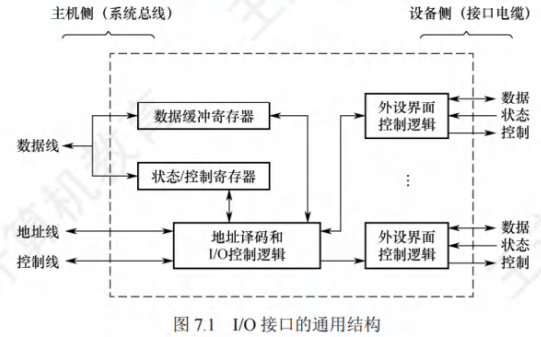
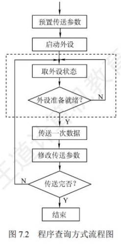
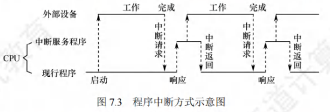
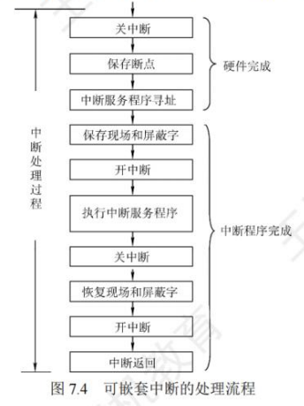
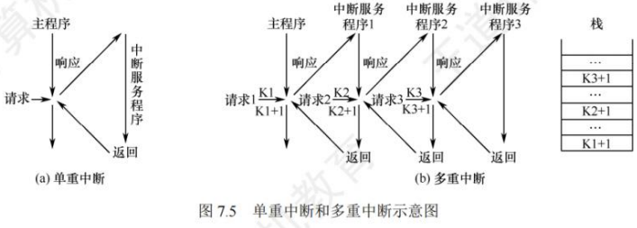
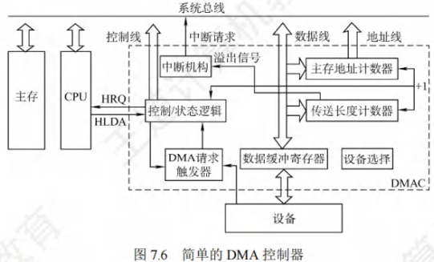
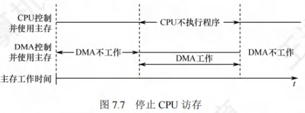
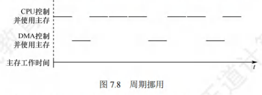
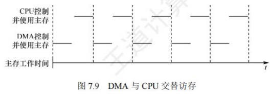
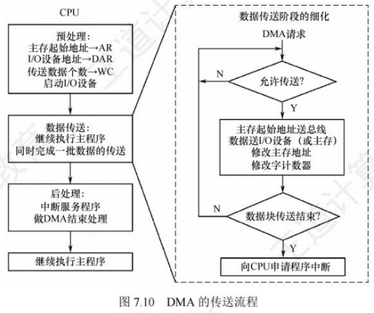

# 输入/输出系统

## I/O系统基本概念(考纲中删除)

### 输入/输出系统

输入/输出是以主机为中心而言的,将信息从外部设备传送到主机[称为输入,反之称为输出。
输入/输出系统解决的主要问题是对各种形式的信息进行输入和输出的控制。
I/O系统中的几个基本概念如下:
1)外部设备。包括输入/输出设备及通过输入/输出接口才能访问的外存储设备。
2)接口。在各个外设与主机之间传输数据时进行各种协调工作的逻辑部件。协调包括传输
过程中速度的匹配、电平和格式转换等。
3)输入设备。用于向计算机系统输入命令和文本、数据等信息的部件。键盘和鼠标是最基
本的输入设备。
4)输出设备。用于将计算机系统中的信息输出到计算机外部进行显示、交换等的部件。显
示器和打印机是最基本的输出设备。
5)外存设备。指除计算机内存及CPU缓存等外的存储器,如硬磁盘、光盘等。
一般来说,I/O系统由I/O软件和I/O硬件两部分构成:
1)I/O软件。包括驱动程序、用户程序、管理程序、升级补丁等。通常采用I/O指令和通道
指令实现CPU与I/O设备的信息交换。
2)I/O硬件。包括外部设备、设备控制器和接口、I/O总线等。通过设备控制器来控制I/O
设备的具体动作:通过I/O接口与主机(总线)相连。

### I/O控制方式

在输入/输出系统中,经常需要进行大量的数据传输,而传输过程中有各种不同的I/O控制方
式,基本的控制方式主要有以下四种:
1)程序查询方式。由CPU通过程序不断查询I/O设备是否已做好准备,从而控制I/O设备
与主机交换信息。
2)程序中断方式。只在I/O设备准备就绪并向CPU发出中断请求时才予以响应。
3)DMA方式。主存和I/O设备之间有一条直接数据通路,当主存和I/O设备交换信息时,
无须调用中断服务程序。
通道方式。在系统中设有通道控制部件,每个通道都挂接老苦干外设,主机在执行I/O命令
时,只需启动有关通道,通道将执行通道程序,从而完成I0操作。
其中,方式1和方式2主要用于数据传输速率较低的外部设备,方式3和方式4主要用于数
据传输速率较高的设备。

### 外部设备

(1)键盘
键盘是最常用的输入设备,通过它可发出命令或输入数据。
(2)鼠标
鼠标是常用的定位输入设备,它把用户的操作与计算机屏幕上的位置信息相联系。
2.输出设备
(1)显示器
按所用的显示器件分类,有阴极射线管(CRT)显示器、液晶晶显示器(LCD)、发光二极管
(LED)显示器等。显示器属于用点阵方式运行的设备,有以下主要参数
1)屏幕大小:以对角线长度表示,单位为英寸,常用的有122~32英寸等
2)分辨率:能表示的像素个数,屏幕上的每个光点就是一个像素,以宽和高的像素数的乘
积表示,如800x600、1024×768和1280x1024等。
3)灰度级:指黑白显示器中所显示的像素点的亮暗差别,在彩色显示器中则表现为颜色的
不同,灰度级越多,图像层次越清楚、逼真,典型的有8位(256级)、16位等。
4)刷新:光点只能保持极短的时间便会消失,为此必须在光点消失之前再重新扫描显示一
遍,这个过程称为刷新。
5)刷新频率:指单位时间内扫描整个屏幕内容的次数。按照人的视觉生理,刷新频率大于
30Hz时才不会感到闪烁,通常显示器的刷新频率为60~120Hz。
6)显示存储器(VRAM):也称刷新存储器,为了不断提高刷新图像的信号,必须把一帧图
像信息存储在刷新存储器中。其存储容量由图像分辨率和灰度级决定,分辨率越高,灰
度级越多,刷新存储器容量越大。
VRAM容量=分辨率x灰度级位数
VRAM带宽=分辨率x灰度级位数x帧频
(2)打印机
用于将计算机的处理结果打印在相关介质上。按工作方式,打丁印机可分为点阵打印机、针式
打印机、喷墨式打印机、激光打印机等。
1)针式打印机。针式打印机擅长"多层复写打印",实现各种票据或蜡纸等的打印。其工作
原理简单,造价低廉,耗材(色带)便宜,但打印分辨率和打印速度不够高
2)喷墨式打印机。彩色喷墨打印机基于三基色原理,即分别喷射三种颜色的墨滴,按一定
的比例混合出所要求的颜色。喷墨式打印机可实现高质量彩色打印。
3)激光打印机。计算机输出的二进制信息,经过调制后转换为激光束,在感光鼓上形成潜
像,再经过显影、转印和定影,在纸上得到所需的字符或图像。激光打印机打印质量高、
速度快、处理能力强,它是将激光技术和电子显像技术相结合的产物。

3.外部存储器(辅存)
(1)磁表面存储器
所谓"磁表面存储",是指把某些磁性材料薄薄地涂在金属铝或塑料表面上作为载磁体来存
储信息。磁盘存储器、磁带存储器和磁鼓存储器均属于磁表表面存储器
(2)固态硬盘(SSD)
微小型高档笔记本电脑采用高性能Flash存储器作为硬盘来记录数据,这种"硬盘"称为固
态硬盘(SSD)。固态硬盘除需要Flash存储器外,还需要其他便件和软件的支持
(3)光盘存储器
光盘存储器是利用光学原理读/写信息的存储装置,它采用聚焦激光束对盘式介质以非接触方
式记录信息。完整的光盘存储系统由光盘片、光盘驱动器、光盘控制器等组成。

## I/O接口

I/O接口(也称I/O控制器)是主机和外设之间的交接界面,通过接口可以实现主机和外设
之间的信息交换。外设种类繁多,且具有不同的工作特性,它们在工作方式、数据格式和工作速
度等方面有着很大的差异,接口正是为了解决这些差异而设置的的。

### I/O接口的功能

I/O接口的主要功能如下:
(1)进行地址译码和设备选择。CPU送来选择外设的地址码后,接口必须对地址进行详码以
产生设备选择信息,使主机能和指定外设交换信息。
2)实现主机和外设的通信联络控制。解决主机与外设时序配合问题,协调不同工作速度的
外设和主机之间交换信息,以保证整个计算机系统能统一、协调地工作。
3)实现数据缓冲。CPU与外设之间的速度往往不匹配,为消除速度差异,接口必须设置数
据缓冲寄存器,用于数据的暂存,以避免因速度不一致而丢失数据。
4)信号格式的转换。外设与主机两者的电平、数据格式都可能存在差异,接口应提供主机与
外设的信号格式的转换功能,如电平转换、并/串或串/并转换、模/数或数/模转换等。
5)传送控制命令和状态信息。CPU要启动某外设时,通过接口中的命令寄存器向外设发出
启动命令;外设准备就绪时,则将"准备好"状态信息送回接口中的状态寄存器,并反
馈给CPU。外设向CPU提出中断请求时,CPU也应有相应的响应信号反馈给外设。

### I/O接口的基本结构

图7.1所示是一个I/O接口的通用结构,I/O接口在主机侧通过I/O总线与内存、CPU相连。
数据缓冲寄存器用来暂存与CPU或内存之间传送的数据信息!,状态寄存器用来记录接口和设备的
状态信息,控制寄存器用来保存CPU对外设的控制信息。状态寄存器和控制寄存器在传送方向上
是相反的,在访问时间上也是错开的,因此可将它们合二为一。

I/O接口中的数据线传送的是读/写数据、状态信息、控制信息和中断类型号。地址线传送的
是要访问I/O接口中的寄存器的地址。控制线传送的是读/写控制信号,以确认是读寄存器还是
写寄存器,此外控制线还会传送中断请求和响应信号、仲裁信号和握手信号。
I/O接口中的I/O控制逻辑还要能对控制寄存器中的命令字进行评码,并将译码得到的控制
信号通过外设界面控制逻辑送到外设,同时将数据缓冲寄存器的数据发送到外设或从外设接收数
据到数据缓冲寄存器。另外,它还要具有收集外设状态到壮大态寄存器的功能
对数据缓冲寄存器、状态/控制寄存器的访问操作是通过相应的指令来完成的,通常称这类指
令为I/O指令,I/O指令只能在操作系统内核的底层I/O软件中使用,它们是一种特权指令。

### I/O接口的类型

从不同的角度看,I/O接口可以分为不同的类型。
1)按数据传送方式(外设和接口一侧),可分为并行接口(一字节或一个字的所有位同时传
送)和事行接口(一位一位地有序传送),接口要完成数据居格式的转换
2)按主机访问I/O设备的控制方式,可分为程序查询接口、中断接口和DMA接口等。
3)按功能选择的灵活性,可分为可编程接口(通过编程改变接口功能)和不可编程接口。

### I/O端口及其编址

I/O端口是指I/O接口电路中可被CPU直接访问的寄存器,3主要有数据端口、状态端口和控
制端口。通常,CPU能够对数据端口中的数据进行读/写操作:但难时状态端口中的外设状态只能
进行读操作,对控制端口中的各种控制命令只能进行写操作。
注意：端口和接口是两个不同的概念,端口是指接口电路中可以进行读/写的寄存器
I/O端口要想能够被CPU访问,就必须要对各个端口进行编均址,每个端口对应一个端口地址。
而对I/O端口的编址方式有与存储器独立编址和统一编址两种。
(1)独立编址
独立编址也称I/O映射方式,是指对所有的I/O端口单独进行编址。I/O端口的地址空间与主
存地址空间是两个独立的地址空间,它们的范围可以重叠,相同地址可能属于不同的地址空间。
因此需设置专门的I/O指令来表明访问的是10地址空间,10指令的地址码给出I/O端口号。
优点:I/O端口数比主存单元数少得多,只需少量地址线,使得I/O端口译码简单,寻址速度
更快。使用专用I/O指令,可使得程序更加清晰,便于理解和检查。
缺点:10指令少,只提供简单的传输操作,所以程序设计的的灵活性较差。此外,CPU需要
提供存储器读/写、I/O设备读/写两组控制信号,增大了控制的复杂性。
(2)统一编址
统一编址也称存储器映射方式,是指把主存地址空间分出一部分给I/O端口进行编址,I/O
端口和主存单元在同一地址空间的不同分段中,根据地址范围就能区分访问的是I/O端口还是主
存单元,因此无须设置专门的10指令,用统一的访存指令就可访问问I/O端口。
优点:不需要专门的VO指令,使得CPU访问I/O的操作更加灵活和方便,还使端口有较大
的编址空间。I/O访问的保护机制可由虚拟存储管理系统来实现,无须专门设置。
缺点:端口地址占用了部分主存地址空间,使主存可用容量变小。此外,由于在识别I/O端
口时全部地址线都需要参加译码,使得译码电路变得更复杂,降低了译码速度。

## I/O方式

输入/输出系统实现主机与I/O设备之间的数据传送,可以采用不同的控制方式,各种方式在
代价、性能、解决问题的着重点等方面各不相同,常用的I/O方式有程序查询、程序中断和DMA
等,其中前两种方式更依赖于CPU中程序指令的执行。

### 程序查询方式

信息交换的控制直接由CPU执行程序实现。程序查询方式接口中设置一个数据缓冲寄存器
(数据端口)和一个设备状态寄存器(状态端口)。主机进行I/O操作时,先读取设备的状态并根
据设备状态决定下一步操作究竟是进行数据传送还是等待。。
程序查询方式的工作流程如下(见图7.2):
CPU执行初始化程序,并预置传送参数。
向I/O接口发出命令字,启动I/O设备。
从外设接口读取其状态信息。
首计算机
CPU周期或持续的查询设备状态,直到外设准备就绪。
传送一次数据。
修改地址和计数器参数。
判断传送是否结束,若未结束转第3步,直到计数器为0。

根据上述流程4中查询方式的不同,程序查询方式可分为如下两两类
1)独占查询。一旦设备被启动,CPU就一直持续查询接口壮状态,CPU花费100%的时间用
于I/O操作,此时外设和CPU完全串行工作。
2)定时查询。CPU周期性地查询接口状态,每次总是等到条件满足才进行一个数据的传送,
传送完成后返回到用户程序。定时查询的时间间隔与设备的数据居传输速率有关。
【例7.1】假设计算机的主频为500MHz,CPI为4,某外设的数据率为2MB/s,I/O接口中有
一个32位数据缓冲寄存器,采用定时查询方式,每次I/O都执行10条指令。外设最多间隔多长
时间查询一次才能不丢失数据?CPU用于外设I/O的时间占CPU总时间的百分比至少是多少?
解:
由于端口大小有限,必须在外设传输完端口大小的数据时访问端口,以防止数据未被及时读
取而丢失。外设准备32位数据所用的时间为4B+2MB/s=2us,所以最多每隔2us就必须查询一
次,即每秒的查询次数至少是1s+2us=5×10,每秒CPU用于外设I/C的时间至少为5x10°×10x4
=2×107个时钟周期,占整个CPU时间的百分比至少是2x107/500M = 4%
程序查询方式的优点是设计简单、硬件量少。缺点是CPU要老费很多时间来查询和等待,
且在一段时间内只能和一台外设交换信息,CPU与设备串行工作,效率很低。

### 程序中断方式

#### 程序中断的基本概

程序中断是指在计算机执行程序的过程中,出现某些急需处理的异常情况或特殊请求,CPU
暂时中止现行程序,而转去对这些异常情况或特殊请求进行处理,处理完毕后再返回到原程序的
断点处,继续执行原程序。早期的中断技术是为了处理数据居传送
随着计算机的发展,中断技术不断被赋予新的功能,主要功能有:
实现CPU与I/O设备的并行工作。
处理硬件故障和软件错误。
实现人机交互,用户干预机器需要用到中断系统。
实现多道程序、分时操作,多道程序的切换需借助于中断系系统。
实时处理需要借助中断系统来实现快速响应。
实现应用程序和操作系统(管态程序)的切换,称为软中断斤。
多处理器系统中各处理器之间的信息交流和任务切换。
程序中断方式的思想:CPU在程序中安排好在某个时机启动某台外设,然后CPU继续执行
当前的程序,不需要像查询方式那样一直等待外设准备就绪。一旦外设完成数据传送的准备工作,
就主动向CPU发出中断请求。在可以响应中断的条件下,CPU暂时中止正在执行的程序,转去
执行中断服务程序为外设服务,在中断服务程序中完成一次主机与与外设之间的数据传送,传送完
成后,CPU返回原来的程序。此时,外设和CPU又开始并行工作,如图7.3所示。

【例7.2】假定计算机的主频为500MHz,CPI为4,某外设的数据率为40MB/s,I/O接口中
有一个32位数据缓冲寄存器。在中断I/O方式下,若每次中断响应和中断处理的总时钟周期数至
少为400,则该外设能否采用中断I/O方式?为什么?
解:
中断响应和中断处理的时间为400x1/500M=0.8us,只需计算外设准备32位数据的时间,若
准备数据的时间小于中断响应和中断处理的时间,则数据被刷新,造成丢失。外设准备32位数
据所用的时间为4B+40MB/s=0.1μs,因此该外设不适合采用中断I/O方式

#### 程序中断的工作流程

(1)中断请求
中断源是请求CPU中断的设备或事件,一台计算机允许有多个中断源。每个中断源向CPU
发出中断请求的时间是随机的。为记录中断事件并区分不同的中断源,中断系统需对每个中断源
设置中断请求标记触发器,当其状态为"1"时,表示该中断源有请求。这些触发器可组成中断
请求标记寄存器,该寄存器可集中在CPU中,也可分散在各个中断源钟。
通过INTR线发出的是可屏蔽中断,通过NMI线发出的是不可厂屏蔽中断。可屏蔽中断的优先
级最低,在关中断模式下不被响应。不可屏蔽中断用于处理紧急和重要的事件,如时钟中断、电
源掉电等,其优先级最高,其次是内部异常,即使在关中断模式下也被响应
(2)中断响应判优
中断响应优先级是指CPU响应中断请求的先后顺序。由于许多中断源提出中断请求的时间
都是随机的,因此当多个中断源同时提出请求时,需通过中断判优逻辑来确定响应哪个中断源的
请求,中断响应的判优通常是通过硬件排队器(或中断查询程星序)实现的
般来说,1不可屏蔽中断>内部异常>可屏蔽中断:2在内部异常中,硬件故障>软件
中断:3DMA中断请求>I/O设备的中断请求:4在I/O传送类中断请求中,高速设备>低速
设备;输入设备>输出设备;实时设备>普通设备。
注意:中断优先级包括响应优先级和处理优先级,响应优先级由硬件线路或查询程序的查询顺序
决定,不可动态改变。处理优先级可利用中断屏蔽技术动态训周整,以实现多重中断。
(3)CPU响应中断的条件
CPU在满足一定的条件下响应中断源发出的中断请求,并经过过一些特定的操作,转去执行中
断服务程序。CPU响应中断必须满足以下3个条件:
中断源有中断请求。
CPU允许中断及开中断(异常和不可屏蔽中断不受此限制)。
条指令执行完毕(异常不受此限制),且没有更紧迫的任务。
注意:I/O设备的就绪时间是随机的,而CPU在统一的时刻即每条指令执行结束时,采样中断请
求信号(开中断的情况下),以获取I/O的中断请求,也就是说,CPU响应中断的时间是在每
条指令执行阶段的结束时刻。这里说的中断仅指I/O中断,异常不属于此类情况
(4)中断响应过程
CPU响应中断后,经过某些操作,转去执行中断服务程序。这些操作是由硬件直接实现的,
我们将它称为中断隐指令。中断隐指令并不是指令系统中的一条真正的指令,只是一种虚拟的说
法,本质上是硬件的一系列自动操作。它所完成的操作如下:
1)关中断。CPU响应中断后,首先要保护程序的断点和现场信息,在保护断点和现场的过

程中,CPU不能响应更高级中断源的中断请求。否则,若断点或我现场保存不完整,在中
断服务程序结束后,就不能正确地恢复并继续执行现行程序*。
2)保存断点。为保证在中断服务程序执行完后能正确地返回到原来的程序,必须将原程序
的断点(指令无法直接读取的PC和PSW的内容)保存在栈或特)定寄存器中
注意异常和中断的差异:异常指令通常并没有执行成功,异常处理后要重新执行,所以
其断点通常是当前指令的地址。中断的断点则是下一条指令的地址征。
3)引出中断服务程序。识别中断源,将对应的服务程序入口地址送入程序计数器PC。有两
种方法识别中断源:硬件向量法和软件查询法。本节主要讨论比较常用的向量中断。
(5)中断向量
中断识别分为向量中断和非向量中断两种。非向量中断即软你件查询法,第5章已介绍。
每个中断源都有一个唯一的类型号,每个中断类型号都对应一个中中断服务程序,每个中断服
务程序都有一个入口地址,即中断向量,CPU必须找到入口地址。把系统中的全部中断向量集中
存放到存储器的某个区域内,这个存放中断向量的存储区就我称为中断向量表。
CPU响应中断后,通过识别中断源获得中断类型号,然后据此计算出对应中断向量的地址;
再根据该地址从中断向量表中取出中断服务程序的入口地址,并送入程序计数器PC,以转去执
行中断服务程序,这种方法被称为中断向量法,采用中断向量法的中断被称为向量中断。
注意:中断请求和响应信号是在I/O总线的控制线上传送的。CPU响应某一中断后,就从数据线
上获取该中断源的中断类型号,并据此计算对应中断向量在中断向量表中的位置。
(6)中断处理过程
不同计算机的中断处理过程各具特色,图7.4所示为一个可嵌套中断的典型处理流程。

中断处理流程如下:
关中断。
保存断点。
中断服务程序寻址。
保存现场和屏蔽字。进入中断服务程序后首先要保存现场和中断屏蔽字,现场信息是指
用户可见的工作寄存器的内容,它存放程序执行到断点处的现行值
注意：现场和断点,这两类信息都不能被中断服务程序破坏。由于现场信息用指令可直接访问,
因此通常在中断服务程序中通过指令把它们保存到栈中,即由软件实现。而断点信息由CPU
在中断响应时自动保存到栈或指定的寄存器中,即由硬件实现
开中断。允许更高级中断请求得到响应,以实现中断嵌套。
执行中断服务程序。这是中断请求的目的。
关中断。保证在恢复现场和屏蔽字时不被中断。
恢复现场和屏蔽字。将现场和屏蔽字恢复到原来的状态。
开中断、中断返回。中断服务程序的最后一条指令通常是一条中断返回指令,使其返回
到原程序的断点处,以便继续执行原程序。
其中,1~3由中断隐指令(硬件自动)完成:4~9由中断服务程序完成
注意：若是单重中断(或称单级中断),则在上述流程中去掉5和7即可

#### 多重中断和中断屏蔽技术

在CPU执行中断服务程序的过程中,若又出现了新的优先级更高的中断请求,而CPU对新的
中断请求不予响应,则称这种中断为单重中断,如图7.5(a)所示。若CPU暂停现行的中断服务程序,
转去处理新的中断请求,则称这种中断为多重中断,也称中断嵌套,如图7.5(b)所示。

断请求1,将主程序的断点压栈保存,然后转去执行中断服务程序1。在执行中断服务程序1时,
又发生中断请求2,而其处理优先级比中断请求1的更高,此时须中止中断请求1的处理,响应
中断请求2,将中断服务程序1的断点压栈保存,然后转去执行中断服务程序2。同样,拥有更
高处理优先级的中断请求3可以打断中断请求2的处理。当中断请请求3处理完后,CPU从栈顶取
出断点信息,回到中断服务程序2的断点(K3+1)处继续执行。以此类推,直到所有中断服务
程序执行完毕,最终回到原程序的断点(K1+1)处继续执行主程序
CPU要具备多重中断的功能,必须满足下列条件:
在中断服务程序中提前设置开中断指令。
优先级别高的中断源有权中断优先级别低的中断源。
中断处理优先级是指多重中断的实际优先级处理次序,可以利用中断屏蔽技术动态调整,从
而可以灵活地调整中断服务程序的优先级,使中断处理更加灵活。若不使用中断屏蔽技术,则处
理优先级和响应优先级相同。现代计算机一般使用中断屏蔽技术,每个中断源都有一个屏蔽触发
器(MASK),1表示屏蔽该中断源的请求,0表示可以正常请求,所有屏蔽触发器组合在一起便
构成一个屏蔽字寄存器,屏蔽字寄存器的内容称为屏蔽字。
关于中断屏蔽字的设置及多重中断程序执行的轨迹,下面通过实你例说明。
【例7.3】设某机有4个中断源A、B、C、D,其硬件排队优先次序为A>B>C>D,现要求
将中断处理次序改为D>A>C>B,写出每个中断源对应的的屏蔽字。
解:
在中断处理次序改为D>A>C>B后,D具有最高优先级,可以用屏蔽其他所有中断,且不能
中断自身,因此D对应的屏蔽字为1111;A具有次高优先级,只能被D中断,因此A对应的屏
蔽字为1110,以此类推,得到4个中断源的屏蔽字,见表7.1
从宏观上看,虽然程序中断方式克服了程序查询方式中CPU的等待现象,提高了CPU的利
用率。但从微观操作分析,CPU在处理中断时,仍需暂停原程序的的运行,尤其是当高速设备频繁
成批地与主存交换信息时,需要不断打断CPU执行现行程序而去执行中断服务程序。

### DMA方式

DMA 方式是一种完全由硬件进行成组信息传送的控制方式,它具有程序中断方式的优点,
即在数据准备阶段,CPU与外设并行工作。DMA方式在外设与内在外设与内字之间开辟了一条"直接数据
通路",信息传送不再经过CPU,降低了CPU在传送数据时的开销,因此称为直接存储器存取方
式。由于数据传送不经过CPU,因此不需要保护、恢复CPU现场等烦琐操作。
这种方式适用于磁盘、显卡、声卡、网卡等高速设备大批量数据的传送,它的硬件开销比较
大。在DMA方式中,中断的作用仅限于故障和正常传送结束时的处理。

#### DMA方式的特点

主存和DMA接口之间有一条直接数据通路。由于DMA方式传送数据不需要经过CPU,因此不必中断现行程序,I/O与主机并行工作,程序和传送并行工作
DMA方式具有下列特点:
1)它使主存与CPU的固定联系脱钩,主存既可被CPU访问,又可被外设访问。
2)在数据块传送时,主存地址的确定、传送数据的计数等都都由硬件电路直接实现。
3)主存中要开辟专用缓冲区,以及时提供和接收外设的数据。
4)DMA传送速度快,CPU和外设并行工作,提高了系统效率
5)DMA在传送开始前要通过程序进行预处理,结束后要通过中断方式进行后处理。

#### DMA控制器的组成

在DMA方式中,对数据传送过程进行控制的硬件称为DMA控制(DMA接口)。当I/O
设备需要进行数据传送时,通过DMA控制器向CPU提出DMA传送送请求,CPU响应之后将让出
系统总线,由DMA控制器接管总线进行数据传送。其主要功能如下:
1)接受外设发出的DMA请求,并向CPU发出总线请求。
2)CPU响应并发出总线响应信号,DMA接管总线控制权,进入DMA操作周期。
3)确定传送数据的主存起始地址及长度,并自动修改主存地址计数和传送长度计数
4)规定数据在主存和外设间的传送方向,发出读/写等控制信号,执行数据传送操作
5)向CPU报告DMA操作结束。
图7.6给出了一个简单的DMA控制器。

主存地址计数器:存放要交换数据的主存地址。在传送前,其保存的是传送数据的主存起
始地址:每传送一个字,地址寄存器的内容就加1,直至该批数据传送完毕
传送长度计数器:记录传送数据的总长度。在传送前,其记录的的是该批数据的总字数:每
传送一个字,计数器就减1,直至计数器为0,表示该批数据传送完毕。
数据缓冲寄存器:暂存每次传送的数据。通常,DMA接口与主存之间的传送单位为字,
而DMA与设备之间的传送单位可能为字节或位。
DMA请求触发器:每当I/O设备准备好数据后,发出一个控制信号,使DMA请求触发器
置位。
"控制/状态"逻辑:用于指定传送方向,修改传送参数,并对DMA请求信号、CPU响应
信号进行协调和同步。
中断机构:当一批数据传送完毕后触发中断机构,向CPU提出中断请求

在DMA传送过程中,DMA控制器接管系统总线。而当DMA传送结束后,将恢复CPU的
一切权利并开始执行其操作。由此可见,DMA控制器必须具不有控制系统总线的能力。

#### DMA的传送方式

主存和I/O设备之间交换信息时,不通过CPU。但当I/O设备和CPU同时访问主存时,可能
发生冲突,为了有效地使用主存,DMA与CPU通常采用以下3种方式使用主存。
(1)停止CPU访存
当I/O设备有DMA请求时,由DMA接口向CPU发送一个停停止信号,使CPU放弃总线控
制权,停止访问主存,直到DMA传送一块数据结束,如图7.7所示。数据传送结束后,DMA接
口通知CPU可以使用主存,并把总线控制权交回给CPU。

优点:控制简单,适用于数据传输速率很高的I/O设备实现成组数据的传送。
缺点:DMA在访问主存时,CPU基本上处于不工作状态。
(2)周期挪用
由于I/O访存的优先级高于CPU访存(I/O不立即访存就可能丢失数据),因此由I/O设备挪
用一个存取周期,传送完一个数据字后立即释放总线,如图7.8所示。它是一种单字传送方式。
当I/O设备有DMA请求时,会遇到3种情况:1此时CPU不在访存,因此10的访存请求与
CPU未发生冲突;2CPU正在访存,此时必须待存取周期结束后,CPU再将总线占有权让出
3I/O和CPU同时请求访存,出现访存冲突,此时CPU要暂时放弃总线占有权。

优点:既实现了I/O传送,又较好地发挥了主存与CPU的效率。
缺点:每挪用一个主存周期,DMA接口都要申请、建立和归还总线控制权。
(3)DMA与CPU交替访存
将CPU的工作周期分成两个时间片,一个给CPU访存,另一个给DMA访存,这样在每个
CPU周期内,CPU和DMA就都可以轮流访存,如图7.9所示。这种方式适用于CPU的工作周期
比主存存取周期长的情况。例如,若CPU的工作周期是1.2μs,主存的存取周期小于0.6μs,则可
将一个CPU周期分为C,和C两个周期,其中C」专供DMA访存,C2专供CPU访存。这种方式
不需要申请、建立和归还总线使用权,总线使用权是通过Ch和C2分时控制的

优点:不需要总线控制权的申请、建立和归还过程,具有很高的传送速率。
缺点:相应的硬件逻辑变得更复杂。
【例7.4】假定计算机的主频为500MHz,CPI为4,某外设的数据率为40MB/s,I/O接口中
的数据端口为32位,采用DMA方式,每次DMA传送块大小为1000B,且DMA预处理和后处
理的总时钟周期数为500,则CPU用于该外设I/O的时间占CPU总时间的百分比是多少?
解:
外设每秒的DMA次数为40MB/s+1000B=400000,在DMA方式中,只有预处理和后处理
需要CPU处理,数据传送全程由DMA控制。CPU用于外设I/O的总时间为40000×500=2x107
个时钟周期,占CPU总时间的百分比为2x107÷500M=4%。

#### DMA的传送过程

图7.10所示为DMA的数据传送流程,分为预处理、数据传送和后处理3个阶段。

(1)预处理
由CPU完成一些必要的准备工作。首先,初始化DMA控制器中的有关寄存器、设置传送方
向、测试并启动设备等。然后,CPU继续执行原程序,直到I/O设备准备好发送的数据(输入情
况)或接收的数据(输出情况)时,I/O设备向DMA控制器发送DMA请求,再由DMA控制器
向CPU发出总线请求(这两个过程也可统称DMA请求),用以传输数据。
(2)数据传送
DMA以数据块为基本传送单位。DMA 占用总线后的数据输入/输出操作都是通过循环来实
现的,这一循环也是由DMA控制器实现的,即数据传送阶段完全由DMA(硬件)控制。
(3)后处理
DMA控制器向CPU发送中断请求,CPU执行中断服务程序做DMA结束处理,包括校验
数据(出错则转诊断程序)等后处理工作。
在DMA方式下,整个数据块的传送过程都不需要CPU参与,CPU只在最初的DMA控
制器初始化和最后的DMA结束处理时才介入,因此CPU用于I/O的开销非常小。

#### DMA方式和中断方式的区别

DMA方式和中断方式的重要区别如下:
中断方式是程序的切换,需要保护和恢复现场:而DMA方式不中断现行程序,无需保护
现场,除了预处理和后处理,其他时候不占用任何CPU资源。
对中断请求的响应只能发生在每条指令执行结束时(执行周期后);而对DMA请求的响
应可以发生在任意一个机器周期结束时(取指、间址、执行周期后均可)。
中断传送过程需要CPU的干预;而DMA传送过程不需要CPU的的干预,因此数据传输速
率非常高,适合于高速外设的成组数据传送。
DMA请求的优先级高于中断请求。
中断方式具有处理异常事件的能力,而DMA方式仅局限于大批数据的传送。
从数据传送来看,中断方式靠程序传送,DMA方式靠硬件传送。

