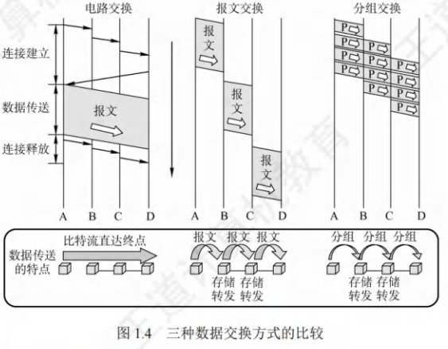
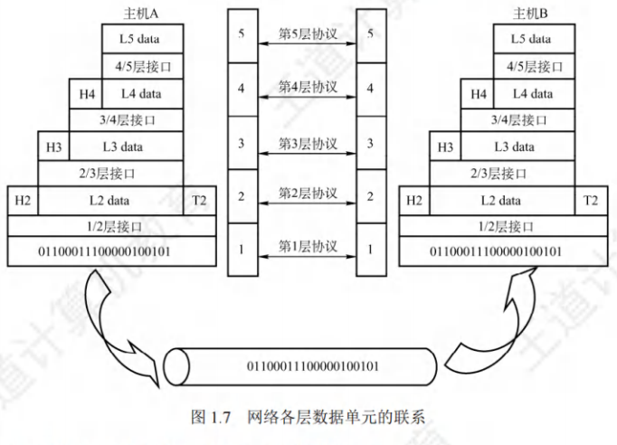
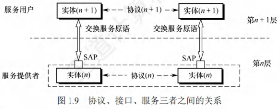
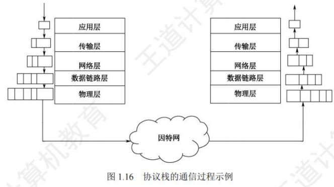
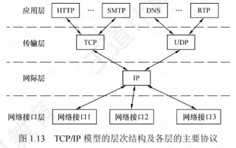
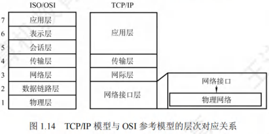

# 计算机网络体系结构

[toc]

## 网络概述

### 计算机网络概念

计算机网络是将众多分散且自治的计算机系统，通过通信设备与线路相连，借助功能完善的软件实现资源共享和信息传递的系统。

- **基本组成**：计算机网络（简称网络）由若干结点（node，也叫节点）和连接这些结点的链路（link）构成。其中，结点可以是计算机、集线器、交换机或路由器等。
-  - **网络互连**：网络之间通过路由器互连，形成覆盖范围更广的计算机网络，即互连网（internet）。 

| 对比项 | internet（互连网） | Internet（互联网或因特网） |
| ---- | ---- | ---- |
| 词性性质 | 通用名词 | 专用名词 |
| 定义范围 | 泛指多个计算机网络互连而成的网络  | 当前全球最大、开放，众多网络和路由器互连的特定计算机网络 |
| 通信协议 | 可使用任意通信协议 | 采用TCP/IP协议 | 

### 计算机网络的组成

1. **组成部分视角**
    - **硬件**：网络中的物理设备，如计算机、网线、交换机等。
    - **软件**：操作系统、网络管理软件等各类程序，实现网络功能。
    - **协议**：规定网络通信规则的标准，如TCP/IP 协议。
2. **工作方式视角**
    - **边缘部分**：由所有连接在互联网上的主机组成，用户直接使用这些主机进行信息处理和通信。
    - **核心部分**：由大量网络和连接这些网络的路由器组成，为边缘部分提供连通性和数据交换服务。
3. **功能组成视角**
    - **通信子网**：主要负责数据通信，由通信控制处理机、通信线路与其他通信设备组成。
    - **资源子网**：负责数据处理，向网络用户提供各种网络资源和网络服务，包括主机、终端等。 

### 计算机网络的功能

1. **数据通信**：计算机网络最基本功能，实现不同计算机或设备间数据传输，如文件传输、网页浏览、电子邮件发送，让用户能跨越地域共享和交换信息。
2. **资源共享**：可共享硬件、软件和数据资源。像共享打印机、服务器存储空间等硬件；共享办公软件、数据库管理系统等软件；共享各类数据文件、数据库等数据，提高资源利用率，降低成本。
3. **分布式处理**：将复杂任务分解为多个子任务，分配到网络中不同计算机协同处理。如科研领域的大规模数据计算，通过分布式处理，利用多台计算机的计算能力，提高处理效率，加快任务完成速度。
4. **提高可靠性**：通过网络冗余设计，如多路径连接、备用设备等，当部分设备或链路出现故障时，网络仍能正常运行。如服务器集群，一台服务器故障，其他服务器可接替工作，保障服务不间断。
5. **负载均衡**：将工作负载均匀分配到网络中的多个设备上，避免单个设备因负载过重影响性能。如大型网站，通过负载均衡器将用户请求分配到不同服务器，确保所有服务器资源有效利用，提高整体服务质量和响应速度。 

### 分组交换

在网络核心部分，路由器（router）起着关键作用，它通过对收到的分组进行存储转发，实现分组交换。

 从通信资源分配角度而言，交换指的是依照特定方式，动态分配传输线路资源。 

#### 电路交换

1. **电路交换的步骤**
    - **建立连接**：开始占用通信资源，在两个结点间建立一条专用（双方独占）的物理通信路径，此路径可能经过多个中间结点。
    - **传输数据**：一直占用通信资源，在建立好的物理路径上，比特流连续从源点直达终点，如同在管道中传送，无存储转发耗时。
    - **释放连接**：归还通信资源，通信结束后释放所占用的物理通信路径。典型的电路交换网为传统电话网。
2. **电路交换的优缺点**
| 类别 | 描述 |
| ---- | ---- |
| **优点** | 1. **通信时延小**：通信线路专用，数据直达，传输时延小。   2. **有序传输**：按发送顺序传送数据，无失序问题。   3. **没有冲突**：不同通信双方信道不同，不争用物理信道。   4. **实时性强**：物理通路建立后可随时通信。 |
| **缺点** | 1. **建立连接时间长**：平均连接建立时间对计算机通信过长。   2. **线路利用率低**：物理通路独占，空闲时也不能供其他用户使用。   3. **灵活性差**：物理通路中任一点故障，需重新拨号建立连接。   4. **难以实现差错控制**：中间结点无存储和检验数据能力，无法发现并纠正错误。 |

#### 报文交换

1. **基本概念**：报文交换以报文作为数据交换单位。用户数据加上源地址、目的地址等信息后封装成报文（message）。
2. **工作方式**：采用存储转发技术。整个报文先传至相邻结点，完整存储后，依据转发表转发到下一个结点，如此循环，直至抵达目的结点。每个报文都能独立选择通往目的结点的路径。
3. **优缺点**
|类别|描述|
| ---- | ---- |
|**优点**|1. **无需建立连接**：通信前无需建立连接，无建立连接时延，用户可随时发送报文。 2. **动态分配线路**：交换设备存储完整报文后，挑选合适的空闲线路转发报文。 3. **线路可靠性高**：若某传输路径故障，可重新选择其他路径传输数据。 4. **线路利用率高**：仅在报文于某段链路上传输时，才占用该链路通信资源。 5. **提供多目标服务**：一个报文可同时发往多个目的地址。|
|**缺点**|1. **转发时延高**：交换结点需接收完整报文后，才能查找转发表并转发至下一个结点。 2. **缓存开销大**：报文大小无限制，要求交换结点具备较大缓存空间。 3. **错误处理低效**：报文较长时，出错概率相对较高，重传整个报文代价大。| 

#### 分组交换
1. **核心机制**：同样采用存储转发技术，旨在解决报文交换中报文过长的问题。
2. **分组过程**：源结点发送前，把长报文分割成若干较小等长数据段，为每个数据段添加包含源地址、目的地址和编号信息等必要控制信息的首部，形成分组（Packet）。
3. **传输过程**：源结点将分组发至分组交换网，网中的分组交换机接收分组并缓存，从首部提取目的地址，依转发表将分组转发给下一个分组交换机，经多个交换机存储转发，最终到达目的结点。
4. **优缺点**
|类别|描述|
| ---- | ---- |
|**优点**|1. **存储管理便捷，开销小**：分组长度固定，对应缓冲区大小固定。 2. **传输效率高**：分组逐个传输，后一分组存储与前一分组转发可并行，以流水线方式缩短报文传输时间。 3. **出错概率与重传代价低**：分组短，出错概率减小，重发数据量大幅降低，提高可靠性并减小传输时延。|
|**缺点**|1. **存在存储转发时延**：虽比报文交换传输时延小，但相对电路交换仍存在，且要求节点交换机处理能力更强。 2. **需传输额外信息**：每个小数据段添加控制信息构成分组，使传送信息量增加5% - 10%，控制复杂，降低通信效率。 3. **分组可能出现问题**：采用数据报服务时，分组可能失序、丢失或重复，到达目的结点需按编号排序；采用虚电路服务虽无失序问题，但有呼叫建立、数据传输和虚电路释放三个过程。|
5. **应用场景对比**
    - **电路交换**：适用于传送数据量大且传送时间远大于呼叫时间的场景。
    - **分组交换**：在端到端通路由多段链路组成时，适合用于传送数据。从提高网络信道利用率角度，报文交换和分组交换优于电路交换，其中分组交换时延更小，尤其适合计算机间突发式数据通信。 

### 计算机网络的分类

1. **按分布范围**
    - **广域网（WAN，Wide Area Network）**：覆盖范围广，可跨城市、国家甚至全球。
    - **城域网（MAN，Metropolitan Area Network）**：通常覆盖一个城市范围。
    - **局域网（LAN，Local Area Network）**：覆盖范围较小，如学校、企业内部等局部区域。
    - **个人区域网（PAN，Personal Area Network）**：围绕个人使用，范围一般在10米左右，如蓝牙连接的设备组成的网络。
2. **按传输方式**
    - **广播式网络**：网络中的所有设备共享一条通信信道，一个节点发送的信息，其他节点都能接收。
    - **点对点网络**：数据以点对点的方式在计算机或通信设备间传输，每个节点与其他节点通过单独的链路相连。
3. **按拓扑结构**
    - **总线型网络**：所有节点连接在一条总线上，任何一个节点发送的信号都能被其他节点接收。
    - **星型网络**：以中央节点为中心，其他节点都与中央节点相连，数据通过中央节点进行转发。
    - **环形网络**：各节点通过通信线路连接成一个闭合的环，数据在环中单向流动。
    - **网状网络**：节点之间的连接是任意的，没有规律，可靠性高，但成本也高。
4. **按使用者**
    - **公用网**：由电信部门或其他提供通信服务的公司提供的网络，多个用户可以共享使用。
    - **专用网**：为特定用户或组织构建的网络，不对外公开，仅供内部使用。
5. **按传输介质**
    - **有线网络**：使用双绞线、同轴电缆、光纤等有线介质传输数据。
    - **无线网络**：通过无线电波等无线介质进行数据传输，如Wi-Fi、蓝牙等。 

### 计算机网络的性能指标

- **速率**：
指连接到网络上的结点在数字信道上传送数据的速率，也称数据传输速率、数据传输率、数据率或比特率。单位为$b/s$（比特/秒）或$bit/s$（有时也写为$bps$）。当数据率较高时，可用$kb/s$（$k = 10^3$）、$Mb/s$（$M = 10^6$）或$Gb/s$（$G = 10^9$）表示。

- **宽带**：
带宽（Bandwidth）。带宽原本表示通信线路允许通过的信号频率范围，单位是赫兹（$Hz$）。但在计算机网络中，带宽表示网络的通信线路所能传送数据的能力，是数字信道所能传送的“最高数据传输速率”的同义语，单位是比特/秒（$b/s$）。

- **吞吐量**：
吞吐量（Throughput）。指单位时间内通过某个网络（或信道、接口）的实际数据量。吞吐量常用在对实际网络的测量中，受网络带宽的限制。

- **时延**：
  时延（Delay）。指数据（一个报文或分组）从网络（或链路）的一端传送到另一端所需的总时间，它由4部分构成：发送时延、传播时延、处理时延和排队时延。
    - **发送时延**：也称传输时延。结点将分组的所有比特推向链路所需的时间，即从发送分组的第一个比特算起，到该分组的最后一个比特发送完毕所需的时间。
      $$
      发送时延 = \frac{分组长度}{发送速率}
      $$
    - **传播时延**：电磁波在信道（传输介质）中传播一定的距离所花的时间，即一个比特从链路的一端传播到另一端所需的时间。
      $$
      传播时延 = \frac{信道长度}{电磁波在信道上的传播速率}
      $$
    - **处理时延**：数据在交换结点为存储转发而进行的一些必要处理所花的时间。例如，分析分组的首部、从分组中提取数据、差错检验或查找合适的路由等。
    - **排队时延**：分组在进入路由器后要先在输入队列中排队等待处理。路由器确定转发端口后，还要在输出队列中排队等待转发。这就产生了排队时延。

数据在网络中经历的总时延就是以上4部分时延之和：
$$
总时延 = 发送时延 + 传播时延 + 处理时延 + 排队时延
$$

- **时延带宽积**：
时延带宽积。指发送端发送的第一个比特即将到达终点时，发送端已发出了多少比特，又称以比特为单位的链路长度。
$$
时延带宽积 = 传播时延×信道带宽
$$

- **往返时延**：
往返时延（Round - Trip Time，RTT）。指从发送端发出一个短分组，到发送端收到来自接收端的确认（接收端收到数据后立即发送确认）总共经历的时延。在互联网中，往返时延还包括各中间结点的处理时延、排队时延及转发数据时的发送时延。

- **信道利用率**：
信道利用率。用以指出某个信道有百分之多少的时间是有数据通过的。
$$
信道利用率 = \frac{有数据通过时间}{有数据通过时间 + 无数据通过时间}
$$

---

## 网络体系结构

### 网络的体系结构的概念

计算机网络的各层及其协议的集合称为网络的体系结构（Architecture）。

计算机网络的体系结构就是这个计算机网络及其所应完成的功能的精确定义。

### 分层

1. **实体**
    - 在计算机网络分层结构里，第\(n\)层中的活动元素一般叫做第\(n\)层实体。它可以是任何能够发送或接收信息的硬件或软件进程，常见为特定的软件模块。
    - 不同机器上处于同一层的部分被称作对等层，同一层的实体就是对等实体。第\(n\)层实体所实现的服务供第\(n + 1\)层使用，此时第\(n\)层是服务提供者，第\(n + 1\)层为服务用户。
2. **协议数据单元（PDU）**
    - 在计算机网络体系结构中，对等层之间传输的数据单位即该层的协议数据单元（PDU），第\(n\)层的PDU记为\(n - PDU\)。各层的PDU都包含数据和控制信息两部分。
3. **服务数据单元（SDU）与协议控制信息（PCI）**
    - **服务数据单元（SDU）**：是为实现用户所需功能而传输的数据。第\(n\)层的SDU记为\(n - SDU\)。
    - **协议控制信息（PCI）**：用于控制协议操作的信息。第\(n\)层的PCI记为\(n - PCI\)。
4. **各层PDU通俗名称**
    - 物理层的PDU称作比特流。
    - 数据链路层的PDU叫做帧。
    - 网络层的PDU是分组。
    - 传输层的PDU为报文段。
5. **三者关系**
    - 当数据在各层间传输时，把从第\(n + 1\)层接收到的PDU当作第\(n\)层的SDU，添加第\(n\)层的PCI后，封装形成第\(n\)层的PDU，再将其作为SDU交给第\(n - 1\)层发送。接收方则进行相反处理。它们的关系为：\(n - SDU + n - PCI = n - PDU = (n - 1) - SDU\) ，其变换过程如图1.7所示。 

#### 分层的基本原则

- **功能独立性**：每层实现相对独立功能，以此降低大系统的复杂程度。这样各层专注于自身功能实现，便于系统的设计、维护与优化。
- **接口清晰性**：各层间接口应自然明晰，易于理解，且相互交流尽量少。清晰的接口能减少层间耦合，提高系统的可扩展性和兼容性。
- **技术无关性**：各层功能的精确界定独立于具体实现方式，以便采用最合适的技术来达成。这使得不同技术可灵活应用于相应层次，推动技术的发展与创新。
- **单向依赖性与标准化**：保持下层对上层的独立性，上层单向使用下层提供的服务。整个分层结构应助力标准化工作，便于不同厂商设备和软件的互联互通。

#### 协议

- **定义**：为确保网络中数据交换有条不紊地进行，需遵循事先约定的规则，这些规则、标准或约定即为网络协议（Network Protocol）。它是控制对等实体间通信规则的集合，具有水平特性，即对等层实体间遵循协议通信，不对等实体间不存在协议。例如，在使用TCP/IP协议栈通信的两个结点A和B中，结点A的传输层与结点B的传输层之间存在协议，而结点A的传输层与结点B的网络层之间不存在协议。
- **组成部分**
    - **语法**：规定数据与控制信息的格式。例如，TCP报文段格式由TCP协议的语法定义。
    - **语义**：明确需要发出何种控制信息、执行何种动作以及做出何种应答。例如，TCP连接建立过程中的三次握手操作由TCP协议的语义定义。
    - **同步（或时序）**：阐述执行各种操作的条件、时序关系等，即对事件实现顺序的详细说明。例如，TCP连接三次握手操作的时序关系由TCP协议的同步定义。

#### 接口

- **定义**：同一结点内相邻两层实体交换信息的逻辑接口称作服务访问点（Service Access Point，SAP）。每层仅能为紧邻的上下层定义接口，不可跨层定义。服务通过SAP提供给上层使用，第\(n\)层的SAP是第\(n + 1\)层访问第\(n\)层服务的位置。
- **示例**：在5层体系结构中，数据链路层的服务访问点为帧的“类型”字段，网络层的服务访问点为IP数据报的“协议”字段，传输层的服务访问点为“端口号”字段。

#### 服务

- **定义**：服务指下层为紧邻的上层提供的功能调用，具有垂直特性。对等实体在协议控制下，使本层能够为上层提供服务，而实现本层协议则需借助下层提供的服务。 

### 网络提供的服务分类

1. **面向连接服务和无连接服务**
    - **面向连接服务**
      - **特点**：通信前双方必须先建立连接，并分配相应资源（如缓冲区），确保通信顺利进行。传输结束后，释放连接及占用的资源。该服务分为连接建立、数据传输和连接释放三个阶段。
      - **示例**：TCP协议。
    - **无连接服务**
      - **特点**：通信前无需先建立连接，当需要发送数据时，直接将每个带有目的地址的包（报文分组）传送到线路上，由系统选定路线进行传输。这种服务常被描述为“尽最大努力交付”，属于不可靠服务。
      - **示例**：IP协议和UDP协议。
2. **可靠服务和不可靠服务**
    - **可靠服务**：网络具备纠错、检错以及应答机制，能够保证数据准确、可靠地传送到目的地。
    - **不可靠服务**：网络仅尽力使数据正确、可靠地传送到目的地，属于尽力而为的服务。在不可靠服务的网络中，数据的正确性和可靠性需由应用程序或用户自行保障。例如，用户收到信息后需判断其正确性，若不正确，需将出错信息反馈给发送者，以便发送者采取纠正措施，通过这些用户端的措施，可将不可靠服务转变为可靠服务。
3. **有应答服务和无应答服务**
    - **有应答服务**：接收方在收到数据后会向发送方给出相应应答，此应答由传输系统内部自动实现，而非用户操作。应答既可以是肯定应答，也可以是否定应答，通常在接收到的数据存在错误时发送否定应答。例如文件传输服务，以确保文件准确传输。
    - **无应答服务**：接收方收到数据后不会自动给出应答。若需要应答，则由高层实现。例如WWW服务，用户浏览网页时，浏览器并不需要对每个网页数据的接收都向服务器发送应答。 

### 传输过程

### 数据传输过程

在计算机网络的数据传输中，各协议层协同工作，完成数据从用户端到接收端的传输与还原。
1. **发送端处理流程**
    - **应用层**：用户传输的数据一般为自然语言，应用层负责将其转化为适用于通信的通信数据。此时的数据将作为传输层的服务数据单元（SDU）。
    - **传输层**：接收来自应用层的通信数据作为自身SDU，添加传输层的控制信息（协议控制信息，PCI），二者共同组成传输层的协议数据单元（PDU）。
    - **网络层**：传输层的PDU下放到网络层后，成为网络层的SDU。网络层再添加自身的PCI，组成网络层的PDU。
    - **数据链路层**：网络层的PDU继续下传，成为数据链路层的SDU，同样添加数据链路层的PCI，完成该层PDU的封装。
    - **最终传输**：经过层层下放与封装，最终形成的数据包通过通信线路进行传输。
2. **接收端处理流程**：数据包到达接收方结点协议栈后，接收方按照与发送端相反的顺序，逆向逐层拆开“包裹”。即从数据链路层开始，去除该层PCI，将剩余部分作为网络层的SDU上传给网络层；网络层同样去除PCI，将剩余部分作为传输层的SDU上传给传输层；传输层去除PCI，将最终的数据（即应用层传来的通信数据）提交给应用层，应用层再将其转化为用户能够理解的自然语言，呈现给用户。

通过这样的过程，实现了数据在计算机网络中从发送端到接收端的准确传输与处理。 

---

## 网络模型

### OSI参考模型

| 物理层 | 数据链路层 | 网络层 | 传输层 | 会话层 | 表示层 | 应用层 |
| :----: | :--------: | :----: | :----: | :----: | :----: | :----: |

#### 物理层
1. **传输单位与功能**
    - **传输单位**：物理层的传输单位为比特。
    - **主要功能**：在物理介质上为数据端设备透明地传输原始比特流。同时，主要负责定义数据终端设备（DTE）和数据通信设备（DCE）之间物理与逻辑的连接方式。
2. **接口参数规定**
通信链路与通信结点相连时，需用到一些电路接口，物理层对这些接口的部分参数作出规定，像机械形状和尺寸、交换电路的数量及排列等。例如，笔记本电脑上的网线接口，其规格、形状等相关标准就是由物理层规定来规范的。
3. **信号规定**
物理层还明确了通信链路上所传输信号的意义和电气特征。举例来说，如果规定信号X代表数字0，那么当结点要传输0这个数字时，就会发出信号X；而当结点接收到信号X，便知晓接收到的信息为0。
4. **物理介质说明**
需要注意的是，传输信息所使用的部分物理介质，像双绞线、光缆、无线信道等，并不包含在物理层协议范畴内，而是处于物理层协议之下。基于此，有人将物理介质视为第0层。 

#### 数据链路层

1. **传输单位与基本功能**
    - **传输单位**：数据链路层以帧作为传输单位。
    - **功能概述**：两台主机间的数据传输是逐段在链路上进行的，因此需借助专门的链路层协议。该层负责将网络层传来的IP分组封装成帧，并确保可靠地传输至相邻结点的网络层。其核心作用在于强化物理层传输原始比特流的功能，把物理层可能出错的物理连接转化为逻辑上无差错的数据链路，从而为网络层呈现出一条无差错的链路。
2. **应对传输差错**
由于外界噪声干扰，原始物理连接在传输比特流时易出错。例如，结点A欲向结点B传输数字0，发出信号X，但传输中受干扰，信号X变为信号Y，而信号Y代表1，导致结点B误判。数据链路层协议具备检测此类差错的能力，并将错误信息丢弃。
3. **流量控制**
在相邻结点间传输数据时，可能出现结点A发送速率比结点B接收速率快的情况。若不加以调控，结点B会丢弃大量来不及接收的正确数据，降低传输线路效率。流量控制机制能够协调两个结点的速率，使结点A的发送速率适配结点B的接收速率。
4. **广播式网络的特殊处理**
在广播式网络中，数据链路层面临新问题，即如何控制对共享信道的访问。为此，数据链路层设有一个特殊子层——介质访问子层，专门处理该问题。 

#### 网络层

1. **传输单位**：网络层以数据报作为传输单位 。
2. **核心关注点与任务**
    - **核心关注点**：主要关注通信子网的运行控制 。
    - **主要任务**：负责把网络层的协议数据单元（分组）从源结点传送到目的结点，为分组交换网上不同主机之间提供通信服务。
3. **关键功能**
    - **路由选择**：为分组选择合适的传输路径，确保数据能高效地从源结点到达目的结点。
    - **流量控制**：协调网络中数据的发送和接收速率，避免因发送方速率过快导致接收方无法处理而丢失数据。
    - **拥塞控制**：防止网络出现过度拥塞，保证网络性能的稳定，避免因过多数据同时传输造成网络瘫痪。
    - **差错控制**：检测和纠正传输过程中出现的错误，确保数据的准确性。
    - **网际互连**：实现不同网络之间的连接与通信，使不同网络的主机能够相互通信。 

#### 传输层

1. **基本定义与功能**
    - **定义**：传输层又称为运输层，其主要职责是负责主机中两个进程之间的通信。
    - **功能**：为端到端连接提供可靠的传输服务，具体涵盖流量控制、差错控制、服务质量保障以及数据传输管理等方面。通过这些功能，确保数据能够准确、高效地在不同主机的进程间传输。
2. **与数据链路层通信方式对比**
    - **数据链路层**：提供点到点通信，这里的“点”通常指的是一个硬件地址或IP地址，可简单理解为实现主机与主机之间基于硬件地址或IP地址的通信。
    - **传输层**：提供端到端通信，其中的“端”指的是运行在不同主机内的进程，每个进程通过一个端口来标识，即实现不同主机内进程之间的通信。这种通信方式与数据链路层有着本质区别。
3. **复用与分用功能**
    - **复用**：由于一台主机可以同时运行多个进程，传输层具备复用功能，它允许多个应用层进程同时使用传输层提供的服务，提高了传输层资源的利用率。
    - **分用**：传输层在接收数据时，能够将收到的信息准确地分别交付给上面应用层中相应的进程，确保每个进程都能获取到属于自己的数据。
4. **对高层用户的屏蔽作用**
传输层对高层用户起到屏蔽通信子网细节的作用。高层用户无需了解通信子网的具体架构、技术变化等情况，只需通过传输层提供的接口进行数据传输，简化了高层应用开发的复杂度，提高了系统的稳定性和可维护性。 

#### 会话层

1. **核心功能**：会话层的主要作用是支持不同主机上各个进程之间进行会话。它为表示层实体或用户进程搭建连接，并保障在该连接上数据能够有序传输，这一过程即所谓的“会话”，也称作“建立同步（SYN）” 。
2. **会话管理**：会话层肩负着管理主机间会话进程的重任，具体涵盖了进程间会话的建立、管理以及终止等环节。通过对会话的全程把控，确保不同进程间的通信能够顺利进行。
3. **检查点机制**：会话层引入了一种名为“检查点”的重要机制，以此来维持可靠的会话。当通信过程中出现失效情况时，借助检查点机制，通信会话能够从检查点处继续恢复通信，这正是我们熟知的断点下载的原理所在。它大大提高了通信的可靠性和效率，避免了因通信中断而导致的数据重新传输，节省了时间和资源。 

#### 表示层

1. **信息表示处理**：表示层的核心任务是处理两个通信系统间交换信息的表示方式。由于不同机器在编码和表示方法上存在差异，为实现不同表示方法的数据与信息相互交换，该层采用抽象的标准方法来定义数据结构，同时运用标准的编码形式。例如，不同操作系统对于日期、数字等数据的表示方式可能不同，通过表示层的标准化处理，可确保数据在不同系统间准确交换。
2. **附加功能**
    - **数据压缩**：为减少数据传输量，提高传输效率，对要传输的数据进行压缩。如在传输图片、视频等大数据量文件时，经过压缩可显著缩短传输时间。
    - **加密和解密**：为保障数据的安全性，对传输的数据进行加密处理，接收方再通过解密还原数据。例如在网络支付场景中，对用户的账号、密码等敏感信息进行加密传输，防止信息泄露。 

#### 应用层

1. **地位与作用**：应用层处于OSI参考模型的最高层，充当用户与网络的接口。它为特定类型的网络应用提供了访问OSI参考模型环境的途径，直接面向用户的实际应用需求。
2. **协议多样性**：由于用户的实际应用丰富多样，每种应用都有其独特的需求，所以应用层需要采用不同的应用协议来满足这些多样化的要求。这使得应用层成为OSI模型中最为复杂的一层，所使用的协议数量也最多。
3. **典型协议示例**
    - **FTP（文件传输协议）**：主要用于在网络上进行文件的上传和下载，实现不同主机间文件的高效传输。例如，网站管理员可以使用FTP将网页文件上传到服务器。
    - **SMTP（简单邮件传输协议）**：专门用于电子邮件的发送，确保邮件能够准确无误地从发件人传输到收件人的邮件服务器。
    - **HTTP（超文本传输协议）**：是万维网应用的基础协议，用于在浏览器和网页服务器之间传输超文本数据，使得我们能够在浏览器中浏览各种网页信息。 

### TCP/IP模型

| 网络接口层 | 网际层 | 传输层 | 应用层 |
| :--------: | :----: | :----: | :----: |

#### 网络接口层

1. **功能类比**：网络接口层的功能与OSI参考模型中的物理层和数据链路层相似。它主要负责实现与物理网络的对接，确保数据能够在不同的物理网络环境中进行传输。
2. **协议特点**：在TCP/IP体系结构中，网络接口层并没有被TCP/IP详细描述。它只是强调主机必须借助某种协议与网络相连，目的是能够在该网络上传输IP分组。这意味着网络接口层具有灵活性，可适配多种不同类型的物理网络。
3. **适用物理网络**：具体适用的物理网络范围广泛，既包含各种类型的局域网，例如以太网，它以其高性价比和广泛应用成为局域网的主流技术；令牌环网，曾在特定场景中应用，通过令牌传递控制网络访问；令牌总线网，结合了令牌传递和总线拓扑的特点。同时也涵盖多种公共数据网络，像电话网，作为传统的通信网络，在数据传输领域仍有一定应用；SDH（同步数字体系），常用于电信骨干网，提供高可靠性和大容量的传输；X.25，早期的分组交换网络协议；帧中继，一种简化的X.25协议，提升了传输效率；ATM（异步传输模式），能够同时支持语音、数据和视频等多种业务的高速传输。
4. **作用概述**：网络接口层的核心作用是接收来自主机或结点的IP分组，并将这些分组准确无误地发送到指定的物理网络上，从而实现网络层与物理网络之间的数据交互和传输。 

#### 网际层

1. **关键地位与功能类比**
   - 网际层在TCP/IP体系结构里占据关键位置。从功能角度看，它和OSI参考模型的网络层极为相像。其核心职责是把分组传递到任意网络，并且独立为每个分组挑选适宜的路由。
   - 例如，在一个包含多个不同类型子网（如以太网、无线网络等）的网络环境中，网际层要确保数据分组能从源主机出发，顺利穿越各个子网，抵达目标主机。
2. **分组传输特点**
   - 网际层不保证各个分组按序到达。在复杂的网络环境下，网络拓扑结构动态变化，各条路径的拥塞程度也随时不同。因此，网际层为了尽快将分组送达目的地，会根据实时网络状况为每个分组独立选择路由。这就可能导致同一数据的不同分组通过不同路径传输，最终到达目的地的顺序与发送顺序不一致。
   - 比如，在一个大型互联网中，源主机向目的主机发送的多个分组，有的可能经过骨干网络的高速链路快速抵达，有的则可能因链路拥塞而选择迂回路径，从而出现后发送的分组先到达的情况。而分组的有序和可靠交付任务，则交由传输层等高层协议来完成。像传输层的TCP协议，通过序号、确认应答等机制，能将无序到达的分组重新排序，保证数据的可靠传输。
3. **IP协议**
   - 网际层定义了标准的分组格式以及IP协议。目前广泛应用的是IPv4（互联网协议第4版）。IPv4采用32位地址，在网络发展初期，满足了大量主机接入网络的需求。
   - 然而，随着互联网的迅猛发展，IPv4地址空间逐渐枯竭。为解决这一问题，IPv6应运而生，它是IPv4的下一代版本。IPv6采用128位地址，极大地扩展了地址空间，能够满足未来物联网等大量设备接入网络的需求。同时，IPv6在安全性、自动配置等方面也有显著提升。 

#### 传输层

传输层实现应用 - 应用或进程 - 进程间通信，功能与OSI参考模型传输层类似，负责使发送端和目的端主机的对等实体进行会话。传输层主要有以下两种协议：

|协议名称|英文简称|连接特性|交付可靠性|数据传输单位|
| ---- | ---- | ---- | ---- | ---- |
|传输控制协议|TCP|面向连接，传输前需先建立连接|可靠交付|报文段|
|用户数据报协议|UDP|无连接|尽最大努力交付，不保证可靠|用户数据报| 

#### 应用层
应用层（用户 - 用户）涵盖众多高层协议，具体如下：

|协议名称|英文简称|功能简述|
| ---- | ---- | ---- |
|虚拟终端协议|Telnet|用于远程登录，实现用户通过本地终端控制远程计算机|
|文件传输协议|FTP|主要用于在网络上进行文件的上传与下载|
|域名解析服务|DNS|将域名转换为IP地址，方便用户访问网站|
|电子邮件协议|SMTP|负责电子邮件的发送|
|超文本传输协议|HTTP|用于在Web浏览器和服务器之间传输超文本数据，实现网页浏览|

IP是互联网的核心协议 。TCP/IP具备两大特性：
 - **everything over IP**：可为各种应用提供服务。
 - **IP over everything**：允许IP在由各类网络构成的互联网上运行。 

### OSI参考模型和TCP/IP模型的比较

#### 相似点

1. 都采用分层的体系结构，且各层所承担的功能大致相同。
2. 均基于独立的协议栈概念。
3. 都能解决异构网络的互连问题，实现不同厂商生产的计算机之间的通信。

#### 不同点

|比较项目|OSI参考模型|TCP/IP模型|
| ---- | ---- | ---- |
|概念区分|精确定义服务、协议和接口，与面向对象程序设计思想契合|对服务、协议和接口没有明确区分|
|层次数量|7层模型|4层结构，将OSI的表示层和会话层功能合并到应用层，数据链路层和物理层合并为网络接口层|
|发展顺序|先有模型，后有协议规范，通用性强，适合描述各种网络|先有协议栈，后建立模型，不适合非TCP/IP网络|
|通信模式|网络层支持无连接和面向连接通信，传输层仅有面向连接通信|网际层仅有一种无连接通信模式，传输层支持无连接和面向连接两种模式| 

