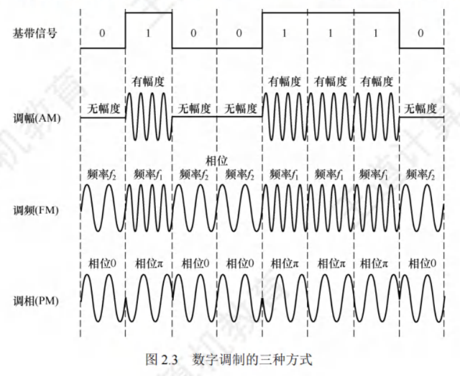

# 物理层

## 通信基础

### 基础概念
通信目的：传输数据。
数据通信系统主要分为**信源**、**信道**、**信宿**三部分。

#### 数据
- **定义**：传送信息的实体。
- **分类**：数字数据、模拟数据。

#### 信号
- **定义**：数据的电气或电磁表现，是数据在传输过程中的存在形式。
- **分类**：数字信号、模拟信号。

#### 码元
- **定义**：常用一个固定时长的信号波形表示一位$k$进制数字，这个时长内的信号称为码元（可称$k$进制码元）。
- **码元宽度**：上述固定时长，也称信号周期。1码元可携带若干比特的信息量。

#### 信源
产生和发送数据的源头。

#### 信道
信号的传输介质。 

#### 信道分类
1. **按传输信号形式**：
    - **模拟信道**：传送模拟信号。
    - **数字信道**：传送数字信号。
2. **按传输介质**：
    - **无线信道**
    - **有线信道**

**信号类型与传输**：
- **基带信号**：信源发出的未调制原始电信号。**基带传输**：直接在信道中传送基带信号。
- **宽带信号**：先将基带信号调制，形成频分复用模拟信号，再在模拟信道传输，此为**宽带传输**。

**数据传输方式**：
- **串行传输**：逐比特按序依次传输，适用于长距离通信，如计算机网络。
- **并行传输**：若干比特通过多个通信信道同时传输，适用于近距离通信，如计算机内部（CPU与主存之间）。

**通信双方信息交互方式**：
1. **单向通信**：只有一个方向通信，无反向交互。**特点**：只需一个信道。
2. **半双工通信**：双方都能发或收信息，但不能同时进行。**特点**：需两个信道，每个方向一个。
3. **全双工通信**：双方可同时发送和接收信息。**特点**：需两个信道，每个方向一个。 

#### 信宿
接收数据的终点。

#### 噪声源
信道上的噪声及分散在通信系统其他各处的噪声集中表示。

#### 速率
数据传输速率，表示单位时间内传输的数据量。
1. **码元传输速率**：又称波特率或调制速率，表示单位时间内数字通信系统所传输的码元数，单位是波特（Baud）。码元既可以是多进制的，又可以是二进制的，码元速率与进制数无关。
2. **信息传输速率**：又称比特率，表示单位时间内数字通信系统传输的二进制码元数（即比特数），单位是比特/秒（b/s）。

#### 带宽
 - 在模拟信号系统中，带宽（又称频率带宽）用来表示某个信道所能传输信号的频率范围，即最高频率与最低频率之差，单位是赫兹（Hz），可表示为$带宽 = 最高频率 - 最低频率$。
 - 在计算机网络中，带宽用来表示网络的通信线路所能传输数据的能力，即最高数据率。此时带宽的单位是b/s。 

### 信道的极限容量
任何实际的信道都并非理想状态，信号在信道传输时**不可避免会产生失真**。
 - **可接受的失真**：只要接收端能从失真的信号波形中识别出原始信号，那么这种失真对通信质量无影响。
 - **严重失真**：若信号失真严重，接收端将无法识别每个码元。以下因素会加重接收端波形失真：
    - **码元传输速率**：速率越高，失真越严重。
    - **信号传输距离**：距离越远，失真越严重。
    - **噪声干扰**：干扰越大，失真越严重。
    - **传输介质质量**：质量越差，失真越严重。 

#### 奈奎斯特定理（奈氏定理）

具体的信道所能通过的频率范围是有限的。信号中的高频分量常无法通过信道，在传输中会衰减，致使接收端收到的信号波形失去码元间清晰界限，此现象称为**码间串扰**。

奈奎斯特定理规定：在**理想低通**（无噪声、带宽有限）信道中，为避免码间串扰，极限码元传输速率为$2W$波特，其中$W$是信道的频率带宽（单位：$Hz$）。若用$V$表示每个码元的离散电平数目（例如，若有$16$种不同码元，需$4$个二进制位，数据传输速率就是码元传输速率的$4$倍），则极限数据率为：

$$
理想低通信道下的极限数据传输速率 = 2W\log_2V \text{（单位为b/s）}
$$

对于奈氏准则，有以下重点结论：
1. **码元传输速率上限**：在任何信道中，码元传输速率存在上限。若传输速率超过该上限，会出现严重码间串扰问题，导致接收端无法完全正确识别码元。
2. **频带与传输速率关系**：信道的频带越宽（即通过的信号高频分量越多），就越能够用更高的速率有效地传输码元。
3. **对信息传输速率的影响**：奈氏准则给出了码元传输速率的限制，但未限制信息传输速率，即未对一个码元可对应多少个二进制位作出限制。

由于码元传输速率受奈氏准则制约，所以要提高数据传输速率，需设法使每个码元携带更多比特的信息量，此时常采用多元制的调制方法。 

#### 香农定理
实际信道存在噪声，且噪声随机产生。香农定理给出了带宽受限且有高斯噪声干扰的信道的极限数据传输速率，在此速率下传输数据不会产生差错。其定义为：

$$
信道的极限数据传输速率 = W\log_2(1 + S/N) \text{（单位为b/s）}
$$

式中，$W$为信道的频率带宽（单位为$Hz$），即：

$$W \text{的单位为} Hz$$

$S$为信道内新传输信号的平均功率，$N$为信道内的高斯噪声功率。$S/N$为信噪比，即信号的平均功率与噪声的平均功率之比，且信噪比：

$$
信噪比 = 10\log_{10}(S/N) \text{（单位为} dB\text{）}
$$

例如，当$S/N = 10$时，信噪比为$10dB$；而当$S/N = 1000$时，信噪比为$30dB$。

对于香农定理，重点结论如下：
1. **速率与带宽、信噪比的关系**：信道的带宽或信道中的信噪比越大，信息的极限传输速率越高。
2. **速率上限的确定性**：对一定的传输带宽和一定的信噪比，信息传输速率的上限是确定的。
3. **无差错传输条件**：只要信息传输速率低于信道的极限传输速率，就能找到某种方法实现无差错的传输。
4. **实际与理论的差距**：香农定理得出的是极限信息传输速率，实际信道能达到的传输速率要比它低不少。

**对比奈氏准则**：奈氏准则只考虑了带宽与极限码元传输速率之间的关系，而香农定理不仅考虑了带宽，也考虑了信噪比。这从另一个侧面表明，一个码元对应的二进制位数是有限的。 

### 编码与调制
信号是数据的具体表现形式。无论数据是数字的还是模拟的，为实现传输，都需转换为信号。
 - **调制**：将数据转换为模拟信号的过程。
 - **编码**：将数据转换为数字信号的过程。

数字数据既可以通过数字发送器转换为数字信号进行传输，也能够借助调制器转换成模拟信号来传输；同样，模拟数据既能通过PCM编码器转换成数字信号传输，也可通过放大器 - 调制器转换成模拟信号传输。由此，形成了以下4种编码与调制方式： 

#### 数字数据编码为数字信号
数字数据编码用于基带传输，即在基本不改变数字数据信号频率的情况下，直接传输数字信号。如何用特定数字信号分别表示“0”和“1”，就是编码规则。编码规则多样，关键是能有效区分“0”与“1” 。常用数字数据编码如下：

1. **归零（RZ）编码**：
   - 用高电平表示“1”、低电平表示“0”（或相反）。
   - 每个码元中间均跳变到零电平（归零）。接收方依据该跳变调整自身时钟基准，为收发双方提供自同步机制。
   - 由于归零需占用部分带宽，传输效率受一定影响。
2. **非归零（NRZ）编码**：
   - 与RZ编码的区别在于不用归零，一个时钟周期全部用于传输数据，编码效率最高。
   - 但NRZ编码存在收发双方同步问题，因此需要双方都配备时钟线。
3. **反向非归零（NRZI）编码**：
   - 与NRZ编码不同，用电平跳变表示“0”，电平保持不变表示“1”。跳变信号自身可作为一种通知机制。
   - 这种编码方式融合了前两种编码的优点，既能传输时钟信号，又能尽量不损失系统带宽。例如，USB2.0采用的就是NRZI编码。
4. **曼彻斯特编码**：
   - 每个码元中间都发生电平跳变，该电平跳变既作为时钟信号（用于同步），又作为数据信号。
   - 可规定向下跳变表示“1”、向上跳变表示“0”，也可采用相反规定。
5. **差分曼彻斯特编码**：
   - 每个码元中间同样发生电平跳变，但与曼彻斯特编码不同，此处电平跳变仅表示时钟信号，不表示数据。
   - 数据通过每个码元开始处是否有电平跳变来表示：无跳变表示“1”，有跳变表示“0”。该编码具有更强抗干扰能力。

**重点**：曼彻斯特编码和差分曼彻斯特编码在每个码元中间都发生电平跳变，相当于将一个码元一分为二，编码速率是码元速率的2倍，二者所占频带宽度是原始基带宽度的2倍。标准以太网采用曼彻斯特编码，差分曼彻斯特编码广泛应用于宽带高速网。 

#### 模拟数据编码为数字信号

此过程主要包含三个步骤：采样、量化和编码 ，PCM编码常用于音频信号编码。

**采样定理**：在将模拟信号转换为数字信号时，设原始信号中的最大频率为 $ f $，那么采样率 $ f_{采样} $ 必须满足 $ f_{采样} \geq 2f $，才能确保采样后的数字信号完整保留原模拟信号的信息（记住该结论即可）。需注意，采样定理也被称作奈奎斯特定理。

1. **采样**：对模拟信号进行周期性扫描，将时间上连续的信号转变为时间上离散的信号。
2. **量化**：把采样得到的电平幅值依据一定分级标度，转换为对应的数值并取整，从而将连续的电平幅值转化为离散的数字量。其实质就是分割与转换。
3. **编码**：将量化得到的离散整数，转换为与之对应的二进制编码。 

#### 数字数据调制为模拟信号
数字数据调制技术在发送端把数字信号转变为模拟信号，在接收端将模拟信号还原成数字信号，这分别对应调制解调器的调制与解调过程。以下展示数字调制的几种方式：

1. **调幅（AM）/幅移键控（ASK）**：
    - 通过改变载波的振幅来表示数字信号“1”和“0”。例如，用有载波输出表示“1”，无载波输出表示“0”。
    - **特点**：实现相对容易，但抗干扰能力较差。
2. **调频（FM）/频移键控（FSK）**：
    - 通过改变载波的频率来表示数字信号“1”和“0”。例如，用频率 $ f_1 $ 和频率 $ f_2 $ 分别表示“1”和“0”。
    - **特点**：易于实现，抗干扰能力强，当前应用较为广泛。
3. **调相（PM）/相移键控（PSK）**：
    - 通过改变载波的相位来表示数字信号“1”和“0”，分为绝对调相和相对调相。例如，用相位 $ 0 $ 和 $ \pi $ 分别表示“1”和“0”，这是一种绝对调相方式。
4. **正交幅度调制（QAM）**：
    - 在频率相同的情况下，将AM与PM相结合，形成叠加信号。
    - 设波特率为 $ B $，采用 $ m $ 个相位，每个相位有 $ n $ 种振幅，则该QAM的数据传输速率 $ R $ 为：
    $R = B\log_2(mn) \text{（单位为b/s）} $

#### 模拟数据调制为模拟信号

为提升传输有效性，有时需要较高频率。该调制方式可借助频分复用（FDM）技术，充分挖掘带宽资源的潜力。

在实际应用中，电话机与本地局交换机采用的便是模拟信号传输模拟数据的编码方式 。这种方式通过对模拟数据进行特定的调制处理，以适应传输需求，同时利用FDM技术能在同一传输介质上实现多个信号的并行传输，提高了带宽利用率。 

## 传输介质

### 介质

传输介质，又称传输媒体，是数据传输系统中连接发送器和接收器的物理通路。可分为以下两类：
1. **导向传输介质**：例如铜线或光纤等。在此类介质中，电磁波被约束沿着固体介质传播。
2. **非导向传输介质**：主要指自由空间（包括空气、真空或海水等）。电磁波在这类介质中的传输方式被称为无线传输。 

#### 双绞线

双绞线是极为常用的传输介质，广泛应用于局域网与传统电话网。它由两根依特定规则并排绞合且相互绝缘的铜导线构成。绞合的目的是**减少对相邻导线的电磁干扰**。为进一步增强抗电磁干扰能力，可在双绞线外部添加一层金属丝编织的屏蔽层，这便形成了**屏蔽双绞线（STP）** ；而无屏蔽层的则称作**非屏蔽双绞线（UTP）** 。

双绞线价格低廉，既能用于模拟传输，也适用于数字传输。通信距离通常在几千米到数十千米。其带宽受铜线粗细与传输距离影响。当距离较远时：
 - 对于模拟传输，需用**放大器**放大衰减的信号。
 - 对于数字传输，则要用**中继器**对失真信号进行整形。 

#### 同轴电缆

同轴电缆由内导体、绝缘层、网状编织屏蔽层以及塑料外层组成。

同轴电缆一般可分为以下两类：
 - **50Ω同轴电缆**：主要用于传送基带数字信号，在早期局域网中应用较为广泛。
 - **75Ω同轴电缆**：主要用于传送宽带信号，在有线电视系统中被大量使用。

由于外导体屏蔽层的作用，同轴电缆具备良好的抗干扰特性，常被用于传输较高速率的数据。不过，在当前局域网领域，双绞线已基本取代同轴电缆，成为主要的传输介质。 

#### 光纤

光纤通信是借助光导纤维（简称光纤）传递光脉冲来实现通信，其中，有光脉冲表示“1”，无光脉冲表示“0” 。鉴于可见光频率约为$10^{8}MHz$，光纤通信系统具备极大的带宽。

光纤主要由纤芯和包层组成（见图2.6）。纤芯极为纤细，直径仅$8 - 100μm$ ，包层折射率低于纤芯，光波在纤芯中传导。当光线从高折射率介质射向低折射率介质时，折射角大于入射角。所以，只要入射角大于特定临界角，就会发生全反射，即光线碰到包层时折射回纤芯，如此不断重复，光便沿光纤传输。

- **多模光纤**：利用光的全反射特性，能让不同角度入射的多条光线在一根光纤中传输。其光源为发光二极管。但光脉冲在多模光纤传输时会逐渐展宽，导致失真，故多模光纤仅适合近距离传输（见图2.7）。
- **单模光纤**：当光纤直径减小到仅一个光的波长时，光纤类似波导，光线可直线传播而不产生多次反射。单模光纤纤芯极细，直径仅几微米，制造成本高。其光源是定向性良好的半导体激光器，衰减较小，无需中继器即可传输数千米甚至数十千米，适合远距离传输（见图2.8）。

光纤除通信容量大外，还具备以下特点：
1. **传输损耗小**：中继距离长，对于远距离传输经济性高。
2. **抗干扰性强**：能有效抵御雷电和电磁干扰，在大电流脉冲干扰环境中优势显著。
3. **保密性好**：无串音干扰，不易被窃听或截取数据。
4. **体积小、重量轻**：在现有电缆管道拥堵情况下，这一特点尤为有利。 

#### 无线传输介质

无线通信在蜂窝移动电话领域应用广泛。便携式计算机的出现，以及军事、野外等特殊场景对移动联网的需求，推动了移动通信的发展，如今无线局域网已十分普及。

1. **无线电波**
    - 具有较强穿透能力，能传输较长距离，广泛应用于通信领域，如无线手机通信、计算机网络中的无线局域网（WLAN）等。
    - **重要优点**：信号向所有方向散播，有效距离内的接收设备无需对准特定方向，就能与发射者建立通信连接，极大简化了通信连接过程。

2. **微波、红外线和激光**
   目前高带宽无线通信主要采用这三种技术，它们都要求发送方和接收方之间有视线通路，方向性强，沿直线传播。不同之处在于，红外通信和激光通信需将传输信号分别转换为红外光信号和激光信号，再在空间中直接传播。
    - **微波通信**：频率较高，频段范围宽，载波频率通常在2 - 400GHz，通信信道容量大。例如，2MHz带宽的频段可容纳500条语音线路，用于传输数字信号时，数据率可达数兆比特/秒。但与普通无线电波不同，微波信号沿直线传播，在地面传播距离有限，超过一定距离需借助中继站接力。
    - **卫星通信**：借助地球同步卫星作为中继转发微波信号，克服了地面微波通信距离的限制。三颗相隔120°的同步卫星几乎可覆盖地球表面，基本实现全球通信。
        - **优点**：通信容量大、距离远、覆盖范围广。
        - **缺点**：保密性差，端到端传播时延长。 

### 物理层接口的特性

物理层关注的是如何在连接各类计算机的传输介质上传输比特流，并非针对特定的传输介质。由于网络中的硬件设备、传输介质种类繁杂，通信方式也多种多样。物理层的作用在于尽可能屏蔽这些差异，使数据链路层无需感知，仅专注于完成本层的协议与服务。

物理层的主要任务是明确与传输介质接口相关的一系列特性：
1. **机械特性**：规定接口所用接线器的形状、尺寸、引脚数目与排列方式，以及固定和锁定装置等内容。
2. **电气特性**：界定接口电缆各条线上的电压范围、传输速率以及距离限制等参数。
3. **功能特性**：阐释某条线上特定电平电压的含义，以及每条线所具备的功能。
4. **过程特性（规程特性）**：说明针对不同功能的各种可能事件的出现先后顺序。 

## 物理层设备

#### 中继器

1. **主要功能**：中继器主要对信号进行整形、放大和转发，目的是消除信号在长电缆传输后出现的失真与衰减，让信号的波形和强度符合要求，以此扩大网络传输距离。它的工作原理是信号再生，并非单纯放大衰减信号。
2. **端口工作方式**：中继器设有两个端口，数据从一端输入，从另一端输出。端口仅处理信号的电气部分，对数据本身是否有误或是否适合所在网段并不关心。
3. **网络连接特点**：
    - 中继器是拓展网络规模时极为简单且廉价的互连设备。它连接的两端网络部分为网段，并非子网，经中继器连接的多个网段仍属于同一个局域网。若中继器发生故障，会对相邻两个网段的正常工作产生影响。
    - 由于中继器工作在物理层，它无法连接两个速率不同的局域网 。这是因为，若网络设备具备存储转发功能，才可连接不同协议的网络；而中继器没有存储转发功能，所以其两端的网段必须使用同一协议。
4. **使用限制**：
    - 理论上，中继器的使用数量不受限，网络似乎可无限延长。但实际并非如此，网络标准对信号延迟范围有明确规定，中继器只能在此范围内有效工作，否则会引发网络故障。
    - 例如，在采用粗同轴电缆的10BASE5以太网规范中，相互串联的中继器个数不能超过4个。并且在由4个中继器串联的5段通信介质里，仅有3段能连接计算机，另外2段仅作为扩展通信范围的链路段，不能连接计算机，这就是“5 - 4 - 3规则”。
5. **与放大器的区别**：放大器和中继器都有放大作用，不同之处在于放大器放大模拟信号，原理是对衰减信号进行放大；而中继器放大数字信号，原理是对衰减信号进行整形再生。 

#### 集线器

集线器（Hub）本质上是多端口的中继器。其工作原理如下：当某个端口接收到数据信号，由于信号在从端口传输至Hub的过程中已出现衰减，Hub会对该信号进行整形放大，使其再生（恢复）到初始发送时的状态，随后将其转发到除输入端口外的其他所有处于工作状态的端口。然而，如果同时有两个或更多端口输入信号，在输出时就会发生冲突，导致这些数据无效。

从Hub的工作模式可知，它在网络中仅起到信号放大与转发的作用，旨在扩大网络传输范围，却不具备信号的定向传送能力，信息传输方向固定，属于标准的共享式设备。

使用Hub组网具有灵活性，它将所有节点的通信集中在以自身为中心的节点上。由Hub组成的网络虽是共享式网络，但在逻辑上依然是总线网。Hub的每个端口连接的是同一网络的不同网段，并且Hub仅能在半双工状态下工作，这使得网络的吞吐率受到限制。

集线器无法分割冲突域，其所有端口都属于同一个冲突域。在一个时钟周期内，集线器只能传输一组信息。当连接到集线器的机器数量较多，且多台机器频繁需要同时通信时，就会引发信息冲突，导致集线器工作效率低下。例如，在一个带宽为10Mb/s的集线器上连接了8台计算机，当这8台计算机同时工作时，每台计算机实际拥有的带宽仅为$10÷8 = 1.25Mb/s$。 