# 数据链路层

## 数据链路层的功能

数据链路层的主要任务是实现顿在一段链路上或一个网络中进行传输。数据链路层协议有多
种,但有三个基本问题则是共同的,即封装成帧、透明传输和差错检测。
数据链路层使用的信道主要有两种:

1)点对点信道,使用一对一的通信方式。PP协议则是目前使用最广泛的点对点协议。
2)广播信道,这种信道上连接的主机很多,使用一对多的厂播通信方式。采用共享广播信
道的有线局域网普遍使用CSMA/CD协议,而无线局域网则使用CSMA/CA协议。

1)链路。指从一个结点到相邻结点的一段物理线路。当进行数据通信时,两台计算机之间
的通信路径往往要经过许多段这样的链路。可见链路只是一条路径的组成部分。
2)数据链路。当在一条链路上传送数据时,除了需要留连路本身,还需要一些必要的通信协
议来控制这些数据的传输,把实现这些协议的硬件和软件加到链路上,就构成了数据链路。有时也把上面所说的链路称为物理链路,而把数据链路称为逻辑链路。
3)帧。数据链路层对等实体之间进行逻辑通信的协议数据单元。数据链路层把网络层下交
的数据构成帧发送到链路上,并把接收到的帧中的数据取出并上交给网络层。

### 链路管理

数据链路层连接的建立、维持和释放过程称为链路管理,它主要用于面向连接的服务。链路
两端的结点要进行通信,必须首先确认对方已处于就绪状态,并交换一些必要的信息以对帧序号
初始化,然后才能建立连接,在传输过程中要能维持连接,而不在传输完毕后要释放该连接

### 封装成帧与透明传输

封装成顿是指在一段数据的前后分别添加首部和尾部,构成帧,顿是数据链路层的数据传送
单元。顿长等于帧的数据部分长度加上首部和尾部的长度。首部都和尾部中含有很多控制信息,它
们的一个重要作用是确定帧的界限,即帧定界。接收方能从接听收到的二进制比特流中区分出帧的
起始与终止,即帧同步。如在HDLC协议中,用标识位F(01111110)来标识帧的开始和结束。
在通信过程中,检测到帧标识位F即认为其是帧的开始,然后一旦检测到帧标识位F即表示帧的
结束。HDLC标准帧格式如图3.4所示。为了提高帧的传输效率,应当使帧的数据部分的长度尽
可能地大于首部和尾部的长度,但随着帧长的增加,传输差错发生的概率也随之提高,发生差错
时重传的代价也越大,因此每种链路层协议都规定了帧的数据部分的长度上限,即最大传送单元。

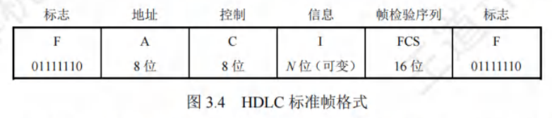

若在数据中恰好出现与帧定界符相同的比特组合(会误认为"传输结束"而丢弃后面的数据),
则要采取有效的措施来解决这个问题,即透明传输。更确切地说,透明传输是指不论所传的数据
是什么样的比特组合,都能够按原样无差错地在这个数据钱连路上传输

### 流量控制

因为链路两端结点的工作速率和缓存空间存在差异,所以发送方的发送能力可能大于接收方的接收能力,此时若不适当限制发送方的发送速率,前面来不及接收的帧将被后面不断发送来的
帧"淹没",造成帧的丢失而出错。因此,流量控制实际上就是限制发送方的发送速率,使之不
超过接收方的接收能力。这个过程需通过某种反馈机制,使发送方知道在什么情况下可以接着发
送下一帧,而在什么情况下必须暂停发送,以等待收到某种反馈信息后继续发送。
在OSI体系结构中,数据链路层具有流量控制的功能。而石ETCP/IP体系结构中,流量控制
功能被移到了传输层。它们控制的对象不同。对数据链路层来说,控制的是相邻结点之间的数据
链路上的流量,而对传输层来说,控制的则是从源端到目的端之间的流量。

### 差错检测

因为信道噪声等原因,帧在传输过程中可能会出现错误,这些错误分为位错和帧错
1)位错:帧中某些位出现差错,通常采用循环冗余检验(CRC)来发现位错。
2)顿错:帧丢失、帧重复或帧失序等错误,它们都属于传输差错。
过去OSI的观点是:必须让数据链路层向上提供可靠传输。因此在CRC检错的基础上,增
加了帧编号、确认和重传机制。收到正确的帧就要向发送力方发送确认。发送方在一定期限内若未
收到对方的确认,就认为出现了差错,因此进行重传,直至到收到确认为止。现在,在通信质量较
差的无线传输中,数据链路层依然使用确认和重传机制,1向上提供可靠的传输服务。
对于通信质量良好的有线链路,数据链路层已不再使用确人和重传机制,即不要求向上提供
可靠传输的服务,而仅需进行CRC检错,目的是将有差错的帧丢弃,保证上交的帧都是正确的,
而对出错的帧的重传任务则由高层协议(如传输层TCP协议)完成。

## 封装成帧

发送方依据一定的规则将网络层递交的分组封装成帧(也称组帧)。数据链路层之所以要将
比特组合成以帧为单位传输,是为了在出错时只重发出错的的帧,而不必重发全部数据,从而提高效率。组帧主要解决帧定界、帧同步、透明传输等问题。实现组帧的方法通常有以下4种。

组帧时既要加首部,又要加尾部。原因是,在网络中信息是以帧为最小单位进行传输的,
所以接收方要正确地接收帧,就必须清楚该帧在一串比特流中从哪里开始到哪里结束(因为接
收方收到的是一串比特流,没有首部和尾部是不能正确区分帧的)。而分组(即IP数据报)仅
是包含在帧中的数据部分(后面将详细讲解),所以不需要加尾部来定界。

### 字符计数法

字符计数法是指在帧首部使用一个计数字段来记录该帧所含的字节数(包括计数字段自身所
占用的1个字节),如图3.5所示。当接收方读出帧首部的字节计数值时,就知道后面跟随的字节
数,从而确定帧结束位置。因为帧与帧之间是连续传输的,,所以也能确定下一帧的开始位置。

这种方法最大的问题在于若计数字段出错,即失去帧边界划分的依据,则接收方就无法判断
所传输帧的结束位和下一帧的开始位,收发双方将失去同步步,造成灾难性后果。

### 字节填充法

字节填充法使用特定字节来定界一帧的开始与结束,在图33.6的例子中,控制字符SOH放在
顿的最前面,表示帧的开始,控制字符EOT表示帧的结束。为了使信息位中出现的特殊字符不被
误判为帧的首尾定界符,可在特殊字符之前填充一个转义与字符ESC来加以区分(注意,转义字符
是ASCII码中的控制字符,是一个字符,而非"E""S"""三个字符的组合),以实现数据的透
明传输。接收方收到转义字符后,就知道其后面紧跟的是数据信息,而不是控制信息。
在图3.6(a)所示的字符帧中,帧的数据段中出现EOT或SOH字符,发送方在每个EOT或SOH
字符前再插入一个ESC字符[见图3.6(b)],接收方收到数据后会自己删除这个插入的ESC字符,
结果仍得到原来的数据[见图3.6(c)]。这也正是字符填充法名利你的由来。若转义字符ESC也出现
在数据中,则解决方法仍是在转义字符前插入一个转义字符。

### 零比特填充法

零比特填充法允许数据顿包含任意个数的比特,它使用一个特特定的比特串01111110来标志一帧的开始和结束,如图3.7所示。为了不使数据字段中出现的比比特流01111110被误判为帧的首尾
标志,发送方先扫描整个数据字段,每遇到5个连续的"1",就自动在其后插入一个"0"。经过
这种比特填充后,就可保证数据字段中不会出现6个连续的的"1"。接收方做该过程的逆操作,即
每收到5个连续的"1",就自动删除后面紧跟的"0",以灰复原始数据。在数据链路层早期使用
的HDLC协议中,便是采用这种比特填充的首尾标志法来实现透明传输的。

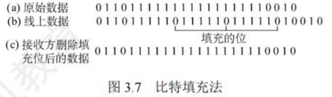

零比特填充法很容易由硬件来实现,性能优于字节填充法。

### 违规编码法

在物理层进行比特编码时,常采用违规编码法。例如,曼彻斯特编码方法将数据比特"1"
编码成"高-低"电平对,将数据比特"0"编码成"低-高高"电平对,而"高-高"电平对和"低
低"电平对在数据比特中是违规的(即没有采用),因此可借用这些违规编码序列来定界帧的起
始和终止。局域网IEEE802标准就采用了这种方法。违规编码法不采用任何填充技术便能实现数
据的透明传输,但只适用于采用冗余编码的特殊编码环境:
因为字符计数法中计数字段的脆弱性和字节填充法实现上的复杂性与不兼容性,所以目前较
常用的组帧方法是零比特填充法和违规编码法。

## 差错控制

实际通信链路都不是理想的,比特在传输过程中可能产生差错,1可能变成0,0也可能
变成1,这就是比特差错。比特差错是传输差错中的一种,本节仅讨论比特差错。
通常利用编码技术进行差错控制,主要有两类:自动重传请求(Automatic Repeat reQuest,
ARQ)和前向纠错(Forward Error Correction,FEC)。在ARQ方式中,当接收方检测到差错时,
就设法通知发送方重发,直到收到正确的数据为止。在FEC方式中,接收方不但能发现差错,而
且能确定错误的位置并加以纠正。因此,差错控制又可分为检错编码和纠错编码。

### 检错编码

检错编码都采用冗余编码技术,核心思想是在有效数据(信息位)被发送前,按某种关系附
加一定的冗余位,构成一个符合某一规则的码字后发送。当要发送的有效数据变化时,相应的冗
余位也随之变化,使得码字遵从不变的规则。接收方根据收到的码字是否仍符合原规则来判断是
否出错。常见的检错编码有奇偶检验码和循环冗余码。

#### 奇偶检验码

奇偶检验码是奇检验码和偶检验码的统称,是一种最基本的检错码。它由n-1位数据和1位
检验位组成,检验位的取值(0或1)将使整个检验码中"1"的个数为奇数或偶数。
1)奇检验码:附加一个检验位后,码长为n的码字中"1"的个数为奇数。
2)偶检验码:附加一个检验位后,码长为n的码字中"1"的个数为偶数。
例如,7位数据1001101对应的奇检验码为10011011,对应的偶检验码为10011010。它只能
检测奇数位的出错情况,但不知道哪些位错了,也不能发现偶数位的出错情况

#### 循环冗余码

数据链路层广泛使用循环冗余码(Cyclic Redundancy Code,CRC)检错技术،
循环冗余码(CRC)检错的基本思想:
1)收发双方约定生成多项式G(x)(最高位和最低位必须为1)。k位位串可视为阶数为k-1的

多项式的系数序列。例如,可用多项式x2+x2+1表示位串1101。
2)发送方基于待发送的数据和G(x),计算出冗余码,将冗余码附加到数据后面一起发送。
3)接收方收到数据和冗余码后,通过G(x)来计算收到的数据和冗余码是否产生差错
假设一个待传送m位的数据,CRC运算产生一个r位的冗余码,称为帧检验序列(FCS)。这
样形成的帧将由m+r位组成。在所要发送的数据后面增加r位冗余码,虽然增大了传输开销,
但是可以进行差错检测,这种代价往往是值得的。这个带检验马的帧刚好能被预先确定的多项式
G(x)整除。接收方用相同的多项式去除收到的帧,若无余数,则认为无差错

假设一段m位数据,则计算冗余码的步骤如下:
1)加0。假设G(x)的阶为r,在数据后面加r个0,相当于乘以2
2)模2除。利用模2除法,用G(x)对应的二进制串去除1)中计算得出的数据串,得到的余
数即为冗余码(共r位,前面的0不可省略)。
按照模2运算规则,加法不进位,减法不借位,相当于对应位进行逻辑异或运算。
冗余码的计算举例。假设数据M=101001(即m=6),除数CG(x)=1101(即r=3),经模2
除法运算后的结果是:商Q=110101(这个商没什么用),余萎收R=001。因此,发送出去的数据
为101001001(即2'M+FCS),共有m+r位,运算过程如图3.8所示

发送方的FCS生成和接收方的CRC检验都是由硬件实现的,处理非常迅速,不会影响数据
的传输。若在传输过程中无差错,则经过CRC检验后得出的余数R肯定为0。但是,若出现误码,
则余数R仍为0的概率极低。因此,通过CRC检错技术,可以以近似地认为"凡是接收方数据链
路层接受的倾均无差错"。也就是说,凡是接收方数据链路层扫接受的帧,我们都能以非常接近
的概率认为这些顿在传输过程中未产生差错:而接收方丢年的顿虽然曾经收到,但最终因为有差
错而被丢弃,即未被接受。
循环冗余码(CRC)是具有纠错功能的,只是数据链路层仅使用用了它的检错功能,检测到
帧出错则直接丢弃,是为了方便协议的实现,因此本节将CRC放在检错编码中介绍。

### 纠错编码

最常见的纠错编码是海明码,其实现原理是在有效信息位中加入几个检验位形成海明码,并
把海明码的每个二进制位分配到几个奇偶检验组中。某一位出错后,就会引起有关的几个检验位

的值发生变化,这不但可以发现错位,而且能指出错位的位置,为自动纠错提供依据。
现以数据码1010为例讲述海明码的编码原理和过程。
(1)确定海明码的位数
设n为有效信息的位数,k为检验位的位数,则信息位n和检验位k应满足
n+k≤ 2* -1
海明码位数n+k=7≤22-1成立,则n、k有效。设信息位为DD3D2D(1010),共4位,
检验位为P3P2PI,共3位,对应的海明码为H,HoHsHaH,H_H_H_H_H_H_H_H_H_
王道计算机
(2)确定检验位的分布
规定检验位P,在海明位号为251的位置上,其余各位为信息位立,因此有:
P的海明码位号为2-1=20=1,即H为P。
P2的海明码位号为2-1=21=2,即H2为P2。
P3的海明码位号为21=22=4,即H4为P3。
将信息位按原来的顺序插入,则海明码各位的分布如下:
H7 He Hs H4 H3 H2 H
D4 D3 D2 P3 D1 P2 P1
(3)分组以形成检验关系
每个数据位用多个检验位进行检验,但要满足条件:被检验数据位的海明位号等于检验该数
据位的各检验位海明位号之和。另外,检验位不需要再被检验脸。分组形成的检验关系如下。

检验位取值
检验位P的值为第i组(由该检验位检验的数据位)所有位求异或我。
算机教育
根据(3)中的分组有
P1=DIOD,OD,=00101=0
P2=DicD;©D;00001=1
D4=100+1=0
P3=D2
所以,1010对应的海明码为1010010(下画线为检验位,其他为信息位)。
(5)海明码的检验原理
每个检验组分别利用检验位和参与形成该检验位的信息位进行奇偶检验检查,构成k个检验方程:
Si=PiODiODiOD, D4
Sz=P20DiOD30D4
S3=P30D20D30D4
若SSSS的值为"000",则说明无错;否则说明出错,且这个数就是错误位的位号,如SSSSSSE=001,
说明第1位出错,即H出错,直接将该位取反就达到了纠错的目的。

## 流量控制与可靠传输机制

### 流量控制与滑动窗口机制

流量控制是指由接收方控制发送方的发送速率,使接收方有足够的缓冲空间来接收每个帧。
常见的流量控制方法有两种:停止-等待协议和滑动窗口协议。数据链路层和传输层均有流量控
制的功能,它们都用到了滑动窗口协议,但也有所区别,主要要体现如下
1)数据链路层控制的是相邻结点之间的流量,而传输层控制的是端到端的流量
2)数据链路层的控制手段是接收方收不下就不返回确认。传输层的控制手段是接收方通过
确认报文段中的窗口值来调整发送方的发送窗口。

#### 停止-等待流量控制基本原理

停止-等待流量控制是一种最简单的流量控制方法。发送方每次只允许发送一个帧,接收方每
接收一个帧都要反馈一个应答信号,表示可以接收下一帧,发送方收到应答信号后才能发送下一帧。
若发送方没有收到接收方反馈的应答信号,则需要一直等待。发送方每发送完一个帧,就进入等待
接收方确认信息的过程中,因而传输效率很低。

#### 滑动窗口流量控制基本原理

滑动窗口流量控制是一种更高效的流量控制方法。在任意时刻,发送方都维持一组连续的允
许发送帧的序号,称为发送窗口;同时接收方也维持一组连续的允许接收帧的序号,称为接收窗
口。发送窗口表示在还未收到对方确认信息的情况下,发送方最多还能发送多少个帧和哪些帧。
同理,在接收方设置接收窗口是为了控制可以接收哪些帧和不可以接收哪些帧。
图3.9给出了发送窗口的工作原理,图3.10给出了接收窗口(Wy=1)的工作原理。

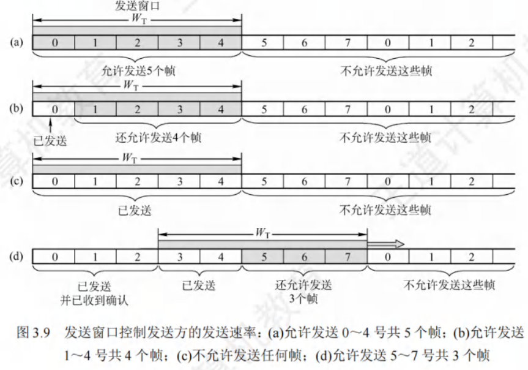

发送方每收到一个按序确认的确认帧,就将发送窗口向前滑动一个位置。这样,就有一个新
的序号落入发送窗口,序号落入发送窗口内的数据帧可以继续发送。当窗口内没有可以发送的帧
(即窗口内的帧全部是已发送但未收到确认的帧)时,发送方就停止发送。

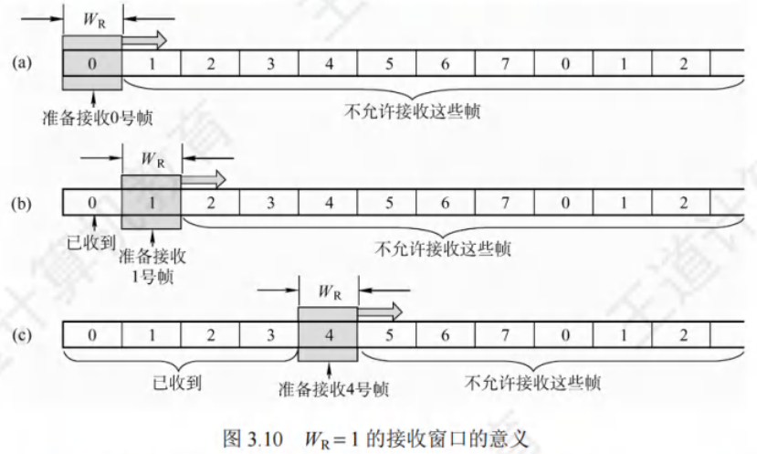

接收方每收到一个序号落入接收窗口的数据帧,就允许将该帧收下,然后将接收窗口向前滑
动一个位置,并发回确认。这样,就有一个新的序号落入接收窗口,序号落入接收窗口内的数据
帧即为准备接收的帧。若收到的帧落在接收窗口之外,则一律丢弃。
滑动窗口具有以下重要特性:
1)只有接收窗口向前滑动(同时接收方发送了确认)时,发送医德口才有可能(只有发送方
收到确认后才一定)向前滑动。

2)从滑动窗口的概念看,停止-等待协议、后退N帧协议和选择重传协议只在发送窗口大小
与接收窗口大小上有所差别:
停止-等待协议:发送窗口WT=1,接收窗口WR=1。
后退N帧协议:发送窗口WT>1,接收窗口WR=1。
选择重传协议:发送窗口WT>1,接收窗口WR>1。
若采用刀比特对帧编号,则后两种滑动窗口协议还需满足WT+1VR<2"
3)当接收窗口的大小为1时,可保证帧的有序接收。
4)在数据链路层的滑动窗口协议中,窗口大小在传输过程中是固定的(与传输层不同)。

### 可靠传输机制

可靠传输是指发送方发送的数据都能被接收方正确地接收,通常采用确认和超时重传两种机
制来实现。确认是指接收方每收到发送方发来的数据帧,都要向发送方发回一个确认帧,表示已
正确地收到该数据帧。超时重传是指发送方在发送一个数据顿后就启动一个计时器,若在规定时
间内没有收到所发送数据帧的确认帧,则重发该数据帧,直到发送成功为止。
使用这两种机制的可靠传输协议称为自动重传请求(ARQ),它意味着重传是自动进行的,
接收方不需要对发送方发出重传请求。在ARQ协议中,数据帧和确认帧都必须编号,以区分确认帧是对哪个帧的确认,以及哪些顿还未确认。ARQ协议分为三种:停止-等待(Stop-and-Wait)
协议、后退N顿(Go-Back-N)协议和选择重传(SelectiveReppeat)协议。值得注意的是,这三
种可靠传输协议的基本原理并不仅限于数据链路层,还可应应用到其上各层
在有线网络中,链路的误码率较低,为了降低开销,并不要求数女据链路层向其上层提供可靠
传输服务,即使出现了误码,可靠传输的问题也由其上层处理。而无线网络的链路易受干扰,误
码率较高,因此要求数据链路层必须向其上层提供可靠传输服务

#### 单帧滑动窗口与停止-等待协议(S-W)

在停止-等待协议中,发送方每次只能发送一个帧,当发送方收到接收方的确认帧之后,才可
以发送下一个帧。从滑动窗口的角度看,停止-等待协议的发送窗口和接收窗口大小均为1。
在停止-等待协议中,除数据帧丢失外,还可能出现以下两种差错:1到达接收方的数据顿
可能已遭破坏,接收方利用前面介绍的差错检测技术检出后,简单地将该帧丢弃。为了应付这种可
能的情况,发送方装备了计时器。在一个顿发送后,发送方等待确认,当计时器超时的时候,若仍
未收到确认,则重发该数据帧。如此重复,直到该数据帧正确到达为止。2数据帧正确而确认帧被
破坏,此时接收方已收到正确的数据顿,但发送方收不到确认帧,因此发送方会重传已被接收的
数据帧,接收方收到相同的数据帧时会丢弃该帧,并重传一个该帧对应的确认帧。
对于停止-等待协议,因为每发送一个数据顿就停止并等待,所可以用1比特来编号就已足够。
发送的帧交替地用0和1来标识,确认帧分别用ACK0和ACK1来表示,当收到的确认帧有误时,
就重传已发送的数据帧。若连续出现相同序号的数据帧,则表明发送方进行了超时重传。若连续
出现相同序号的确认帧,则表明接收方收到了重复帧。
此外,为了超时重传和判定重复帧的需要,发送方和接收方都要设置一个帧缓冲区。当发送
方发送完数据帧时,必须在其发送缓存中保留该数据帧的副本,这样才能在出现差错时进行重传。
只有在收到对方发来的确认帧ACK后,方可清除该副本。
停止-等待协议的信道利用率很低。为了提高传输效率,产生了连续ARQ协议(后退N帧协
议和选择重传协议),发送方可连续发送多个帧,而不是每发完一个帧就停止等待确认。

#### 多帧滑动窗口与后退N帧协议(GBN)

在后退N顿协议中,发送方可在未收到确认帧的情况下,将序号在发送窗口内的多个数据帧
全部发送出去。后退N顿的含义是:发送方发送N个数据帧后后,若发现这N个帧的前一个数据
帧在计时器超时的时候仍未收到其确认信息,则该帧被判为出错或丢失,此时发送方不得不重传
该出错帧及随后的N个帧。这意味着,接收方只允许按顺序接收帧。

如图3.11所示,发送方向接收方发送数据顿。发送方发完0号顿后,可以继续发送后续的1
号帧、2号帧等。发送方每发送完一个数据帧,就要为该帧设置超时计时器。因为连续发送了许
多帧,所以确认帧必须指明是对哪个帧的确认。为了降低开销,GBN协议允许接收方进行累积确
认,即允许接收方不需要每收到一个正确的数据帧就立即发回一个确认帧,而可在连续收到多个
正确的数据帧后,对最后一个数据顿发回确认信息,也就是说,对某个数据帧的确认就代表该数
据顿和之前所有的帧均已正确无误地收到。ACKn表示对n号帧的确认,表示接收方已正确收到
n号帧及之前的所有帧,下次期望收到n+1号帧(也可能是0号帧)。接收方只按序接收数据帧。
图中,虽然在有差错的2号帧之后接着收到了正确的6个数据帧,但接收方必须将这些帧丢弃。

接收方虽然丢弃了这些未按序出现的无差错顿,但应重发已发送的最后一个确认帧ACK1(这是
为了防止已发送的确认帧ACK1丢失)。

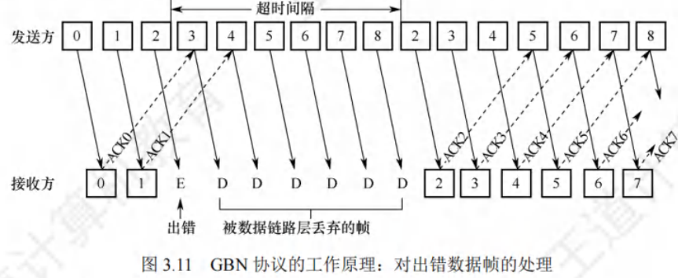

若采用n比特对帧编号,则其发送窗口WF应满足1<W+≤2"-1。若WA大于2"-1,则会造
成接收方无法分辨新数据顿和旧数据顿(参考本章末的疑难点(1)。
后退N帧协议的接收窗口WR=1,可保证按序接收数据帧。
不难看出,后退N帧协议一方面因连续发送数据顿而提高了信道利用率,另一方面在重传时
又必须重传原来已正确到达的帧(仅因这些帧的前面有一顿出错),因此这种做法会降低传送效
率。当信道误码率较大时,后退N帧协议不一定优于停止-等待协议。

#### 多帧滑动窗口与选择重传协议(SR)

为了进一步提高信道的利用率,可以设法只重传出现差错和计时器超时的数据帧,但此时必
须加大接收窗口,以便先收下失序但正确到达且序号仍落在接收窗口内的那些数据帧,等到所缺
序号的数据顿收齐后,再一并送交上层。这就是选择重传协议。

为了使发送方仅重传出错的帧,接收方不能再采用累积确认,而要对每个正确接收的数据顿
逐一进行确认。显然,选择重传协议比后退N顿协议更复杂,且接收方需要设置足够的帧缓冲区
(帧缓冲区的数目等于接收窗口的大小而非序号数目,因为接收方不能接收序号在窗口下界以下
或窗口上界以上的帧)来暂存那些失序但正确到达且序号落在接收窗口内的数据帧。每个发送缓
冲区对应一个计时器,当计时器超时的时候,缓冲区的帧就重传。另外,选择重传协议还采用了
比上述其他协议更有效的差错处理策略,即一旦接收方检测到某个数据顿出错,就向发送方发送
一个否定帧NAK,要求发送方立即重传NAK指定的数据帧。在图3.12中,2号帧丢失后,接收
方仍可正常接收并缓存之后收到的数据帧,待发送方超时重传2号帧并被接收方成功接收后,接
收窗口就可向前移动,而当发送方收到2号帧的确认后,发送窗口就可向前移动。在某个时刻,
接收方检测到10号帧出错,向发送方发出否定帧NAK10,在此期间接收方仍可正常接收并缓存
之后收到的帧,发送方收到否定帧NAK10后立即重传10号帧。
选择重传协议的接收窗口Wa和发送窗口W早都大于1,一次可以发送或接收多个帧。若采用
n比特对帧编号,需满足条件1:WR+Wr≤2"(否则,在接收方的接收窗口向前移动后,若有一个或多个确认帧丢失,则发送方就会超时重传之前的旧数据帧,接收窗口内的新序号与之前的旧
序号出现重叠,接收方就无法分辨是新数据顿还是重传的II日数据帧)。此外,还应满足条件2:
WR≤WT(否则,若接收窗口大于发送窗口,则接收窗口永远不不可能填满,接收窗口多出的空间
就毫无意义)。由1和2不难得出WR≤2""1。一般情况下,Wa和I4个的大小是相同的。

#### 信道利用率的分析

信道利用率是指信道的效率。从时间角度看,信道效率是双发送方而言的,是指发送方在一
个发送周期(从发送方开始发送分组到收到第一个确认分组[所需的时间)内,有效发送数据的时
间与整个发送周期之比。本节之所以使用分组的PDU名称而不使用帧,是为了更具通用性。

##### 停止-等待协议的信道利用率

停止-等待协议的优点是简单,缺点是信道利用率太低。下面用图3.13来分析这个问题。假
定在发送方和接收方之间有一个直通的信道来传送分组。

发送方发送分组的发送时延为TD。显然,TD等于分组长度除以数据传输速率。假定分组正
确到达接收方后,接收方处理分组的时间可以忽略不计,同时立即发回确认。接收方发送确认分
组的发送时延为TA(通常可以忽略不计)。再假设发送方处理确认分组的时间也可以忽略不计,
那么发送方经过时间TD+RTT+TA后就可再发送下一个分组,其中RTT是往返时延。因为仅在
Th内才用来发送数据分组,因此停止-等待协议的信道利用率U为

假定某个信道的RTT=20ms。分组长度是1200比特,数据传输速率是1Mb/s。若忽略处理
时间和T入,则可算出信道利用率U=5.66%。若把数据传输速率提高到10Mb/s,则U=0.0596%。
由此可知,当往返时延RT大于分组发送时延76时,信道利用率就非常低。

##### 连续ARQ协议的信道利用率

连续ARQ协议采用流水线传输(见图3.14),即发送方可连续发送多个分组。这样,只要发
送窗口足够大,就可使信道上有数据持续流动。显然,这利中方式能获得很高的信道利用率。

假设连续ARQ协议的发送窗口为n,即发送方可连续发送n个分组,分为两种情况:
1)nTD<TD+RTT+TA:即在一个发送周期内可以发送完n个分组,信道利用率为
nTo
TP+RTT+77
2)nTD=TD+RTT+TA:即在一个发送周期内发不完(或刚好发完)n个分组,对于这种情
况,只要不发生差错,发送方就可不间断地发送分组,信道利用率为1

此外,"信道平均(实际)数据传输速率=信道利用率x信道带宽(最大数据传输速率)",或
者"信道平均(实际)数据传输速率=发送周期内发送的数据量/发送周期"。

## 介质访问控制

介质访问控制所要完成的主要任务是,为使用介质的每个结点隔离来自同一信道上其他结点
所传送的信号,以协调活动结点的传输。图3.15是广播信道的通信方式,结点A、B、C、D、E
共享广播信道,假设A要与C通信,B要与D通信,因为它们共用一条信道,若不加控制,则两
对结点之间的通信可能会因互相干扰而失败。用来决定广播信道中信道分配的协议属于数据链路
层的一个子层,称为介质访问控制(MediumAccessControbl,MAC)子层

常见的介质访问控制方法有信道划分介质访问控制、随机认问介质访问控制和轮询访问介质
访问控制。其中前者是静态划分信道的方法,而后两者是动态分配信道的方法。

### 信道划分介质访问控制

信道划分介质访问控制将使用同一传输介质的多个设备的通信限隔离开来,把时域和频域资源
合理地分配给这些设备。信道划分介质访问控制通过复用技术实现。所谓复用,是指在发送端把
多个发送方的信号组合在一条物理信道上进行传输,在接收端批收到的复用信号分离出来,并发
送给对应的接收方,如图3.16所示。当传输介质的带宽超过传单个信号所需的带宽时,通过在
一条介质上传输多个信号,还能提高传输系统的利用率。

信道划分的实质是通过分时、分频、分码等方法,将原来的一个广播信道,逻辑上分为几个用
于在两个结点之间进行通信的互不干扰的子信道,即将广播信道道转变为若干个点对点信道。
信道划分介质访问控制分为以下4种。

#### 频分复用(FDM)

频分复用(Frequency Division Multiplexing,FDM)是指将信道的总频带划分为多个子频带,
每个子频带作为一个子信道,每对用户使用一个子信道进行通信,如图3.17所示。所有用户在同
一时间占用不同的频带资源。每个子信道分配的频带可不相同,但它们的总和不能超过信道的总
频带。在实际应用中,为了防止子信道之间互相干扰,相邻信道间还要加入"隔离频带"。

频分复用的优点在于充分利用了传输介质的带宽,系统效率转校高,实现也较容易。

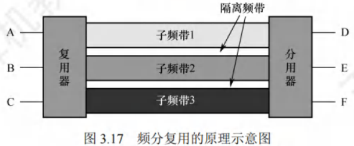

#### 时分复用

时分复用(TimeDivision Multiplexing,TDM)是指将信道的传输时间划分为一段段等长的
时间片,称为TDM顿,每个用户在每个TDM帧中占用固定序号的时隙,每个用户所占用的时隙
周期性地出现(其周期就是TDM的长度),所有用户在不同的时间占用同样的信道资源,如
图3.18所示。TDM帧实际上是一段固定长度的时间,它与数锯链路层的帧不是同一个概念。

从某个时刻来看,时分复用信道上传送的仅是某对用户之间的信号:从某段时间来看,传送
的是按时间分割的复用信号。因为时分复用是按固定次序给用户分配时隙的,当用户在某段时间
暂无数据传输时,其他用户也无法使用这个暂时空闲的线路资源,所以时分复用后的信道利用率
不高。统计时分复用(StatisticTDM,STDM)又称异步时分复用,它是对TDM的一种改进。STDM
帧与TDM帧不同,它并不固定分配时隙,而按需动态分配时隙,当用户有数据要传送时,才会
分配到STDM帧中的时隙,因此可以提高线路的利用率。例如,假设线路的数据传输速率为
6000b/s,3个用户的平均速率都为2000b/s,当采用TDM方式寸,每个用户的最高速率为2000b/s,
而在STDM方式下,每个用户的最高速率可达6000b/s。

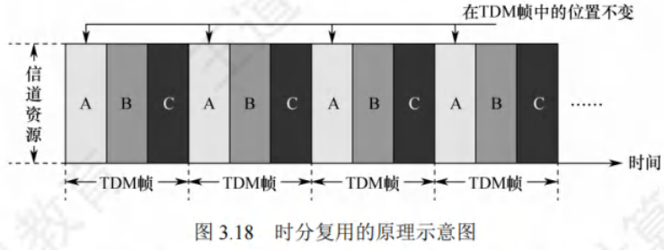

#### 波分复用

波分复用(Wavelength Division Multiplexing,WDM)即光的频分复用,它在一根光纤中传输
多种不同波长(频率)的光信号,因为波长不同,各路光信号互不干扰,最后用光分用器将各路波

长分解出来。因为光波处于频谱的高频段,有很大的带宽,所以可以实现多路的波分复用。

码分复用(Code Division Multiplexing,CDM)是采用不同的编码来区分各路原始信号的一种
复用方式。与FDM和TDM不同,它既共享信道的频率,又共马享时间
实际上,更常用的名词是码分多址(Code Division MultipleAccess,CDMA),其原理是将每
个比特时间再划分成m个短的时间槽,称为码片(Chip),通常m的值是64或128,下例中为简
单起见,设m为8。每个站点被指派一个唯一的m位码片序列发送1时,站点发送它的码片序
列;发送0时,站点发送该码片序列的反码。当两个或多个站点同时发送时,各路数据在信道中
线性相加。为了从信道中分离出各路信号,要求各个站点的的码片序列相互正交
简单理解就是,A站向C站发出的信号用一个向量来表示,B站向C站发出的信号用另一个
向量来表示,两个向量要求相互正交。向量中的分量,就是是所谓的码片
下面举例说明CDMA的原理。
令向量S表示A站的码片向量,T表示B站的码片向量。假设A站的码片序列被指派为
00011011,则A站发送00011011就表示发送比特1,发送11100100就表示发送比特0。为了方
便计算,将码片中的0写为-1,将1写为+1,因此A站的码片序列是(-1-1-1+1+1-1+1+1)
不同站的码片序列相互正交,即向量S和T的规格化内积为0:

不同站的码片序列相互正交,即向量S和T的规格化内积为0:
S·T=
ST = 0
任何站的码片向量和该码片向量自身的规格化内积都是1:
(±1)2=1
S.S = -
任何站的码片向量和该码片反码的向量的规格化内积都是-1:
S.S =
i=1
令向量7为(-1-1+1-1+1+1+1-1)。
当A站向C站发送数据1时,就发送了向量(-1-1-1+1+1+1+1-1 +1+1 +1)。
当B站向C站发送数据0时,就发送了向量(+1+1-1+1 -1 -1 -1 +1)。
两个向量在公共信道上叠加,实际上是线性相加,得到
S+T=(0 0 -2 2 0 -2 0 2)

到达C站后,进行数据分离,若要得到来自A站的数据,则C站就必须知道A站的码片序
列,让S与S+7进行规格化内积。根据叠加原理,其他站点的信号都在内积的结果中被过滤掉,
内积的相关项都是0,而只剩下A站发送的信号,得到
S.(S+T) = 1
所以A站发出的数据是1。同理,若要得到来自B站的数据,则
T.(S+T) = - -1
因此从B站发送过来的信号向量是一个反码向量,代表0。
规格化内积是线性代数中的内容,它在得到两个向量的内科积后,再除以向量的分量的个数。
下面举一个直观的例子来理解频分复用、时分复用和码分复通。

假设A站要向C站运输黄豆,B站要向C站运输绿豆,A站和B站与C站之间有一条公共
的道路,可类比为广播信道。在频分复用方式下,公共道路皮划分为两个车道,分别提供给A站
到C站的车和B站到C站的车通行,两类车可同时通行,但都只分到了公共车道的一半,因此
频分复用(波分复用也一样)共享时间而不共享空间。在时分复用方式下,先让A站到C站的车
走一趟,再让B站到C站的车走一趟,两类车交替地使用公共车道,因此时分复用共享空间,但
不共享时间。码分复用与另外两种信道划分方式极为不同,不在这种方式下,黄豆与绿豆放在同一
辆车上运送,到达C站后,由C站负责把车上的黄豆和绿豆分开,因此码分复用既共享空间,又
共享时间。
码分复用技术具有频谱利用率高、抗干扰能力强、保密性强、语音质量好等优点,还可以减
少投资及降低运行成本,主要用于无线通信系统,特别是移动动通信系统

### 随机访问介质访问控制

在随机访问协议中,不采用集中控制方式解决发送信息的次序问题,所有用户都能根据自己
的意愿随机地发送信息,占用信道的全部速率。在总线形网:络中,当有两个或多个用户同时发送
信息时,就会产生帧冲突(也称碰撞),导致所有冲突用户的发送均以失败告终。为了解决随机
访问发生的冲突,每个用户需要按照一定的规则反复地重传它的帧,直到该帧无冲突地通过,这
些规则就是随机访问介质访问控制协议,其核心思想是:胜利者通过争用获得信道,进而获得信
息的发送权。因此,随机访问介质访问控制协议又称争用型协议。
可见,若采用信道划分机制,则结点之间的通信要么共享空间,要么共享时间,要么共享空
间和时间;而若采用随机访问控制机制,则结点之间的通信既不共享时间,又不共享空间。因此,
随机介质访问控制实质上是一种将广播信道转换为点到点信道的机制。

#### ALOHA协议

ALOHA协议分为纯ALOHA协议和时隙ALOHA协议两种。
(1)纯ALOHA协议
纯ALOHA协议的基本思想是,当总线形网络中的任何站点需要发送数据时,可以不进行任
何检测就发送数据。若在一段时间内未收到确认,则该站点就认为传输过程中发生了冲突。发送
站点需要等待一段时间后再发送数据,直至发送成功。
图3.19表示一个纯ALOHA协议的工作原理。每个站均可自由地发送数据帧,假定所有帧都
是定长的,帧长不用比特而用发送这个帧所需的时间来表示,图中用70表示这段时间。

在图3.19的例子中,当站1发送帧1时,其他站都未发送数据,所以站1的发送必定是成功
的。但随后站2和站N-1发送的帧2和帧3在时间上重叠了-一部分(即发生了冲突)。发生冲突
的各站都必须进行重传,但并不能马上进行重传,因为这样做必然导致继续发生冲突。因此,让
各站等待一段随机的时间,然后进行重传。若再次发生冲突,则需要再等待一段随机的时间,直
到重传成功为止。图中其余一些顿的发送情况是,帧4发送成功,而帧5和帧6发生冲突。
纯ALOHA网络的吞吐量很低,为了克服这个缺点,便产生了时隙ALOHA协议。
(2)时隙ALOHA协议
时隙ALOHA协议同步各站点的时间,将时间划分为一段段等长的时隙(Slot),规定站点只
能在每个时隙开始时才能发送帧,发送一帧的时间必须小于或等于时隙的长度。这样做避免了用
户发送数据的随意性,降低了产生冲突的可能性,提高了信道的利用率。
图3.20表示两个站的时隙ALOHA协议的工作原理。每个帧到达后,一般都要在缓存中等待
一段小于时隙7。的时间,才能发送出去。当在一个时隙内有两个或两个以上的顿到达时,在下一
个时隙将产生冲突。冲突后重传的策略与纯ALOHA协议的情况相似

#### CSMA协议

ALOHA网络发生冲突的概率很大。若每个站点在发送前都先监听公用信道,发现信道空闲
后再发送,则会大大降低冲突的可能性,从而提高信道的利用率,载波监听多路访问(Carrier Sense
MultipleAccess,CSMA)协议依据的正是这一思想。CSMA协议是在ALOHA协议基础上提出的
一种改进协议,它与ALOHA协议的主要区别是多了一个载波监听装置。
根据监听方式和监听到信道忙后的处理方式的不同,CSMA协议分为三种。
(1)1-坚持CSMA
1-坚持CSMA的基本思想是:当站点要发送数据时,首先监听信道;若信道空闲,则立即发
送数据;若信道忙,则继续监听直至信道空闲。"坚持"的含义是监听到信道忙时,继续坚持监
听信道:"1"的含义是监听到信道空闲时,立即发送顿的概率为1。
(2)非坚持CSMA
非坚持CSMA的基本思想是:当站点要发送数据时,首先监听信道;若信道空闲,则立即发
送数据;若信道忙,则放弃监听,等待一个随机的时间后,再重新监听。
非坚持CSMA协议在监听到信道忙时就放弃监听,因此降低了多个站点等待信道空闲后同时
发送数据导致冲突的概率,但也增加了数据在网络中的平均时延。
(3)p-坚持CSMA
p-坚持CSMA只适用于时分信道,其基本思想是:当站点要发送数据时,首先监听信道;若
信道忙,则持续监听(即等到下一个时隙再监听),直至信道空闲;若信道空闲,则以概率p发
送数据,以概率1-p推迟到下一个时隙再继续监听;直到数据发送成功
p-坚持CSMA检测到信道空闲后,以概率p发送数据,以概率1-p推迟到下一个时隙继续监听,目的是降低1-坚持CSMA中多个站点检测到信道空闲时同时发送帧的冲突概率;采用坚
持"监听"的目的是,克服非坚持CSMA中因随机等待造成的延迟时间较长的缺点。因此,p
坚持CSMA协议是非坚持CSMA协议和1-坚持CSMA协议的折中。
三种不同类型的CSMA协议比较如表3.1所示。

#### CSMA/CD协议

载波监听多路访问/冲突检测(CSMA/CD)协议是CSMA协议的改进方案,适用于总线形网络
或半双工网络环境。对于全双工网络,因为全双工采用两条长信道,分别用来发送和接收,在任何
时候,发收双方都可以发送或接收数据,不可能产生冲突,所以不需要CSMA/CD协议。
载波监听是指每个站点在发送前和发送过程中都必须不停地检测信道,在发送前检测信道是
为了获得发送权,在发送过程中检测信道是为了及时发现发送的数据是否发生冲突。站点要在发
送数据前先监听信道,只有信道空闲时才能发送。冲突检则(CollisionDetection)就是边发送边
监听的,若监听到了冲突,则立即停止数据发送,等待一段随机时间后,重新开始尝试发送数据。
CSMA/CD的工作流程可简单地概括为"先听后发,边听边发,冲突停发,随机重发"。

电磁波在总线上的传播速率总是有限的。因此,当某时刻发送站检测到信道空闲时,信道不一
定空闲。如图3.21所示,设r为单程传播时延。当1=0时,A站发送数据。当1=7-8时,A站
发送的数据还未到达B站,因为B站检测到信道空闲而发送数据。经过时间8/2后,即当1=1-8/2
时,A站发送的数据和B站发送的数据发生冲突,但这时A站和B站都不知道。当1=7时,B站
检测到冲突,于是停止发送数据。当1=27-8时,A站检测到冲突,也停止发送数据。显然,CSMA/CD
中的站不可能同时进行发送和接收,因此采用CSMA/CD协议的!以太网只能进行半双工通信。

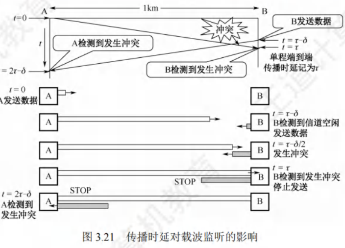

从图3.21不难看出,A站在开始发送数据后最多经过时间2r(端到端传播时延的2倍)就
能知道有没有发生冲突(当8-0时)。因此,把以太网的端到端往返时间27称为争用期(又称
冲突窗口)。每个站在自己发送数据后的一小段时间内,不存在发生冲突的可能性,只有经过争用
期这段时间还未检测到冲突时,才能确定这次发送不会发生冲突。

现在考虑一种情况:某站发送一个很短的帧,但在发送完之前并未检测出冲突。假定这个帧
在继续向前传播到达目的站之前和别的站发送的帧发生了冲突,因此目的站将收到有差错的帧
(当然会把它丢弃)。然而,发送站却不知道发生了冲突,因因此不会重传这个帧。为了避免发生
这种情况,以太网规定了一个最短帧长(争用期内可发送的数据长度)。在争用期内若检测到冲
突,则站就停止发送,此时已发送出去的数据一定小于最短帧长,因此凡长度小于这个最短帧长
的顿,就都是因为冲突而异常中止的无效帧。最短帧长的计算公式为
最短帧长=总线传播时延×数据传输速率×2
例如,以太网规定51.2us为争用期的长度。对于10Mb/s的以太网,在争用期内可发送512bit,
即64B。当以太网发送数据时,若前64B未发生冲突,则后续数据也不会发生冲突(表示已成功抢
占信道)。换句话说,若发生冲突,则一定在前64B。因为一旦检测到冲突就立即停止发送,所以
这时发送出去的数据一定小于64B。于是,以太网规定最短贞长为64B,凡长度小于64B的帧,就
都是因为冲突而异常中止的无效帧,收到这种无效帧时应立即即丢弃
若只发送小于64B的帧,如40B的帧,则需要在MAC子层中于梦数据字段的后面加一个整数
字节的填充字段,以保证以太网的MAC帧的长度不小于644B。

一旦发生冲突,参与冲突的两个站点紧接着再次发送就没有意义,若坚持这样做,则将导致无
休止的冲突。CSMA/CD采用截断二进制指数退避算法来确定冲突后重传的时机,它让发生冲突的
站点在停止发送后,推迟一个随机的时间再重新发送。算法精情髓如下
1)确定基本退避时间,一般取2倍的总线端到端的传播时延2r(即争用期)
2)从离散的整数集合[0,1,....(2*-1)]中随机取出一个数,记为r,重传所需推迟的时间就是
r倍的争用期,即2rr。参数k=min[重传次数,10],可见当重传次数不超过10时,参数
等于重传次数;但当重传次数超过10时,k就不再增大,而一直等于10。
3)当重传达16次仍不成功时,说明网络太拥挤,认为该帧永远无法正确发出,抛弃该帧并
向高层报告出错(这个条件也容易忽略,请读者注意)。
假设适配器首次试图传送一帧,且在传送过程中检测到冲突。第1次重传时,k=1,随机数
r从整数集合{0.1}中选择,可选的重传推迟时间是0或2て。若再次发生冲突,则第二次重传时,
随机数r从整数集合{0.1.2.3}中选择,因此重传推迟时间是在0,2t,47,67这四个时间中随机选
取的一个,以此类推。使用截断二进制指数退避算法可使重传需要推迟的平均时间随重传次数的
增大而增大(也称动态退避),因此能降低发生冲突的概率,有利于整个系统的稳定。
CSMA/CD算法的归纳如下:
准备发送:适配器从网络层获得一个分组,封装成帧,放入适配器的缓存。
检测信道:若信道空闲,则开始发送该帧;若信道忙,则持续检测直至信道空闲。
在发送过程中,适配器仍然持续检测信道。这里只有如下两种可能。
发送成功:在争用期内一直未检测到冲突,该顿肯定能发送成功。

发送失败:在争用期内检测到冲突,此时立即停止发送,适配器执行指数退避算法,
等待一段随机时间后返回到步骤2。若重传16次仍不能成功,则停止重传并向上报错。

CSMA/CD协议已成功用于使用有线连接的局域网,但在无找局域网环境下不能简单地搬用
CSMA/CD协议,特别是冲突检测部分,主要有两个原因:
1)接收信号的强度往往远小于发送信号的强度,且在无线介质上信号强度的动态变化范围
很大,因此若要实现冲突检测,则硬件上的花费会过大。
2)在无线通信中,并非所有站点都能够听见对方,即存在主"隐蔽站"问题。
为此,802.11标准定义了广泛用于无线局域网的CSMA/CA协议,它对CSMA/CD协议进行
修改,将冲突检测改为冲突避免(Collision Avoidance,CA)。"冲突避免"并不是指协议可以完
全避免冲突,而是指协议的设计要尽量降低冲突发生的概率。因为802.11无线局域网不使用冲突
检测,一旦站点开始发送一个帧,就会完全发送该帧,但冲突存在时仍发送整个帧(尤其是长数
据帧)会严重降低网络的效率,所以要采用冲突避免技术来降低冲突的概率。

因为无线信道的通信质量远不如有线信道,所以802.11标准使用链路层确认/重传(ARQ)
方案,即站点每通过无线局域网发送完一帧,就要在收到对才的确认帧后才能继续发送下一帧
可见,802.11标准无线局域网采用的停止-等待协议是一种可靠传输协议。
为了尽量避免冲突,802.11标准规定,所有站完成发送后,必须等待一段很短的时间(继续
监听)才能发送下一帧。这段时间称为顿间间隔(InterFrameSpace,IFS)。帧间间隔的长短取决
于该站要发送的帧的类型。802.11标准使用了下列三种IFS。

1)SIFS(短IFS):最短的IFS,用来分隔属于一次对话的的各帧,使用SIFS的帧类型有ACK
帧、CTS帧、分片后的数据帧,以及所有回答AP探询的帧等。
2)PIFS(点协调IFS):中等长度的IFS,在PCF操作中使用
3)DIFS(分布式协调IFS):最长的IFS,用于异步帧竞争访问问的时延
802.11标准还采用了虚拟载波监听机制,即让源站将它要占用信道的持续时间(包括目的站
发回ACK顿所需的时间)及时通知给所有其他站,以便使所有其他站在这段时间内都停止发送,
这样就大大减少了冲突的机会。"虚拟载波监听"表示其他站并未监听信道,而是因收到了源站
的通知才不发送数据,这种效果就像是其他站都监听了信道。
当信道从忙态变为空闲时,任何一个站要发送数据帧,不仅要等待一个DIFS的间隔,而且
要进入争用窗口,计算随机退避时间以便再次试图访问信道,因此降低了冲突发生的概率。当且
仅当检测到信道空闲且这个数据顿是要发送的第一个数据帧时,才不使用退避算法,其他所有情
况都必须使用退避算法,具体为:1在发送第一个帧之前检测到信道忙:2每次重传;3每次成
功发送后要发送下一帧。CSMA/CA的退避算法与CSMA/CD的稍有不同(详见相关的教材)。
CSMA/CA算法的归纳如下:
1)若站点最初有数据要发送(而非发送不成功再进行重传),且检测到信道空闲,那么在等
待时间DIFS后,就发送整个数据帧。
2)否则,站点执行CSMA/CA退避算法,选取一个随几退避值。一旦检测到信道忙,退避
计时器就保持不变。只要信道空闲,退避计时器就进行到计时

3)当退避计时器减至0时(这时信道只可能是空闲的),或站点就发送整个帧并等待确认。
4)发送站若收到确认,就知道已发送的顿被目的站正确接收。这时要发送第二帧,就要从
步骤2)开始,执行CSMA/CA退避算法,随机选定一段退避时间。
若发送站在规定时间(由重传计时器控制)内未收到确认侦ACK,就必须重传该帧,再次
使用CSMA/CA协议争用该信道,直到收到确认,或经过老干次重传失败后放弃发送。
处理隐蔽站问题:RTS和CTS
在图3.22中,站A和站B都在AP的覆盖范围内,但站A和站B相距较远,彼此都听不见
对方。当站A和站B检测到信道空闲时,都向AP发送数据,导致冲突发生,这就是隐蔽站问题。

为了避免该问题,802.11标准允许发送站对信道进行预约,如图3.23所示。源站要发送数据
顿之前,先监听信道,若信道空闲,则等待时间DIFS后,广播一个请求发送RTS(Request To Send)
控制帧,它包括源地址、目的地址和这次通信所需的持续时间若AP正确收到RTS帧,且信道
空闲,则等待时间SIFS后,向源站发送一个允许发送CTS(CIearToSend)控制顿,它也包括这
次通信所需的持续时间,源站收到CTS帧后,再等待时间SIFS,就可发送数据帧。若AP正确收
到了源站发来的数据,则等待时间SIFS后就向源站发送确认帧ACK。AP覆盖范围内的其他站听
到CTS帧后,将在CTS帧中指明的时间内抑制发送。CTS帧有两个目的:1给源站明确的发送
许可;2指示其他站在预约期内不要发送。
需要说明的是,源站在RTS帧中填写的所需占用信道的持续时间,是从RTS帧发送完毕
后,到目的站最后发送完ACK帧为止的时间,即"SIFS+CTS+SIFS+数据帧+SIFS+ACK"。
而AP在CTS帧中填写的所需占用信道的持续时间,是从C1TS帧发送完毕,到目的站最后发
送完ACK顿为止的时间,即"SIFS+数据帧+SIFS+ACK"。

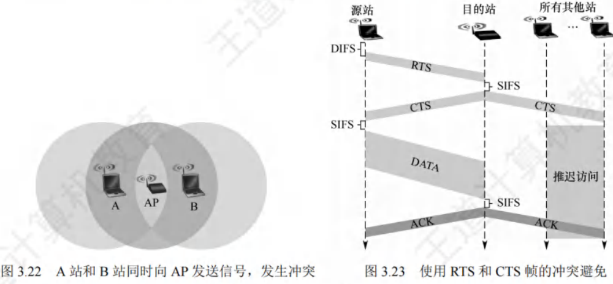

使用RTS帧和CTS帧会使网络的通信效率有所下降,但这两种帧都很短,与数据帧相比
开销不算大。相反,若不使用这种控制帧,则一旦发生冲突而导致数据顿重发,浪费的时间
会更多。信道预约不是强制性规定,各站可自行决定使用或不使用。只有当数据帧长超过某
个数值时,使用RTS帧和CTS帧才比较划算。
CSMA/CD与CSMA/CA主要有如下区别:
1)CSMA/CD可以检测冲突,但无法避免;CSMA/CA发送数据的同时不能检测信道上有无

### 轮询访问：令牌传递协议

在轮询访问中,用户不能随机地发送信息,而要通过一个集中控制的监控站,以循环方式轮
询每个结点,再决定信道的分配。典型的轮询访问控制协议是令牌传递协议。
在令牌传递协议中,一个令牌(Token)沿着环形总线在各站站之间依次传递。令牌是一个特
殊的控制帧,它本身并不包含信息,仅控制信道的使用,确保同一时刻只有一个站独占信道。当
环上的一个站希望发送帧时,必须等待令牌。站点只有取得令牌后才能发送帧,因此令牌环网络
不会发生冲突(因为令牌只有一个)。站点发送完一顿后,应释放令牌,以便让其他站使用。因
为令牌在网环上是按顺序依次传递的,所以对所有入网计算机而言,访问权是公平的。
令牌环网络中令牌和数据的传递过程如下:
1)当网络空闲时,环路中只有令牌帧在循环传递。
2)当令牌传递到有数据要发送的站点时,该站点就修改令卑中的一个标志位,并在令牌中
附加自己需要传输的数据,将令牌变成一个数据帧,然后将这个数据顿发送出去
3)数据顿沿着环路传输,接收到的站点一边转发数据,一边查看帧的目的地址。若目的地
址和自己的地址相同,则接收站就复制该数据帧,以便进一步处理
数据顿沿着环路传输,直到到达该帧的源站点,源站点收到自己发出去的顿后便不再转
发。同时,通过检验返回的帧来查看数据传输过程中是否出错,若出错则重传
5)源站点传送完数据后,重新产生一个令牌,并传递给下一站点,交出信道控制权。
令牌传递协议非常适合负载很高的广播信道,即多个结点在同一时刻发送数据概率很大的信
道。若这样的信道采用随机介质访问控制,则发生冲突的概率很大,而采用令牌传递协议则可以
很好地满足各站点间的通信需求。令牌传递协议既不共享时间,又不共享空间:它实际上在随机
访问介质访问控制的基础上,限定了有权发送数据的结点只能有一个。
即使是广播信道也可通过介质访问控制机制,使广播信道变为逻辑上的点对点信道,所以说
数据链路层研究的是"点到点"之间的通信。

## 局域网

### 基本概念与体系结构

局域网(Local Area Network,LAN)是指在一个较小的地理范围(如一所学校)内,将各种
计算机、外部设备和数据库系统等通过双绞线、同轴电缆等连接介质互相连接起来,组成资源和
信息共享的计算机互连网络。主要特点如下:

1)为一个单位所拥有,且地理范围和站点数目均有限。
2)所有站点共享较高的总带宽(即较高的数据传输速率)。
3)较低的时延和较低的误码率。
4)各站为平等关系而非主从关系。
5)能进行广播和多播。
局域网的特性主要由三个要素决定:拓扑结构、传输介质、介质访问控制方式,其中最重要
的是介质访问控制方式,它决定着局域网的技术特性。
常见的局域网拓扑结构主要有以下4大类:1星形结构;2环形结构;3总线形结构:4星
形和总线形结合的复合型结构。
局域网可以使用铜缆、双绞线和光纤等多种传输介质,其中双绞线为主流传输介质。
局域网的介质访问控制方法主要有CSMA/CD协议、令牌总线协议和令牌环协议,其中前两
种协议主要用于总线形局域网,令牌环协议主要用于环形局域|啊。
三种特殊的局域网拓扑实现如下:
以太网(目前使用范围最广)。逻辑拓扑是总线形结构,物理招拓扑是星形结构。
令牌环(TokenRing,IEEE802.5)。逻辑拓扑是环形结构,物理理拓扑是星形结构
FDDI(光纤分布数字接口,IEEE802.8)。逻辑拓扑是环形结构为,物理拓扑是双环结构。
IEEE 802标准定义的局域网参考模型只对应于OSI参考模型的数据链路层和物理层,并将数
据链路层拆分为两个子层:逻辑链路控制(LLC)子层和介质证方问控制(MAC)子层。与接入传
输介质有关的内容都放在MAC子层,它向上层屏蔽对物理层访问的各种差异,主要功能包括:
组帧和拆卸帧、比特传输差错检测、透明传输。LLC子层与传输介质无关,它向网络层提供无确
认无连接、面向连接、带确认无连接、高速传送四种不同同的连接服务类型
因为在局域网市场中的垄断地位,以太网几乎成为局域网的代名词,而802委员会制定的
LLC子层作用已经不大,所以现在许多网卡仅装MAC协议而不装LLC协议。IEEE 802协议层
与OSI参考模型的比较如图3.24所示。

### 以太网与IEEE802.3

以太网规约的第一个版本是DIXV1,它由DEC、Intel和Xerox联合提出。之后,它被修
改为第二版规约DIXEthernetV2,是世界上第一个局域网产品的规约。在此基础上,IEEE802
委员会的IEEE 802.3工作组制定了第一个IEEE的以太网标准IEEE802.3。
以太网是目前最流行的有线局域网技术。以太网逻辑上采用总线我形拓扑结构,所有计算机共
享同一条总线,信息以广播方式发送,以太网使用CSMA/CCD方式对总线进行访问控制。

严格来说,以太网是指符合DIXEthernetV2标准的局域网,但DIXEthernetV2标准与IEEE
802.3标准的差别很小,因此通常将802.3局域网简称为以太网。

以太网采用两项措施来简化通信:1采用无连接的工作方式,既不对发送的数据帧编号,又
不要求接收方发送确认,即以太网尽最大努力交付数据,提供的是不可靠服务,对差错的纠正则
由高层完成:2发送的数据都使用曼彻斯特编码的信号,每每个码元的中间出现一次电压转换,接
收方利用这种电压转换方便地将位同步信号提取出来。

#### 以太网的传输介质与网卡

以太网常用的传输介质有4种:粗缆、细缆、双绞线和光纤,它们的适用情况见表3.2

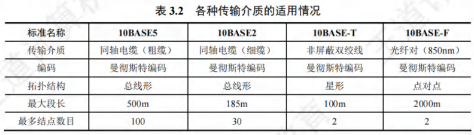

在上述标准中,10指标准的速率为10Mb/s;Base指基带以太网;早期标准Base之后的5
或2指单段最大传输距离不超过500m或185m,Base之后的T指双绞线,F指光纤。

计算机与外界局域网的连接是通过主板上嵌入的一块网络适配器(Adapter)[又称网络接口卡
(Network InterfaceCard,NIC)]实现的。适配器上装有处理器和存储器,工作在数据链路层。适
配器和局域网的通信是通过电缆或双绞线以串行方式进行的的,而适配器和计算机的通信则是通过
计算机的I/0总线以并行方式进行的。因此,适配器的重要功能能就是进行数据的串并转换。
适配器不仅能实现与局域网传输介质之间的物理连接和电信号匹配,还涉及帧的发送与接
收、帧的封装与拆封、介质访问控制、数据的编码与解码及数据缓存等功能。当适配器收到正确
的帧时,就使用中断来通知该计算机,并交付协议栈中的网网络层。当计算机要发送IP数据报时,
就由协议栈把IP数据报向下交给适配器,组帧后发送到局域网。

#### 以太网的MAC地址

IEEE802标准为局域网规定了一种48位的全球地址,是指局域网上的每台计算机中固化在适
配器的ROM中的地址,称为物理地址或MAC地址(因为这种地址用在MAC帧中),这个地址用
于控制主机在网络上的数据通信。全世界所有的局域网适配器那具有不同的地址,一台计算机只要
没有更换适配器,不管其地理位置如何变化,其MAC地址都不会变化。

MAC地址长6字节,一般用由连字符(或冒号)分隔的12个十六进制数表示,如02-60-8c-e4-
b1-21。高24位为厂商代码,低24位为厂商自行分配的适配器F序列号
当路由器通过适配器连接到局域网时,适配器上的MAC地址上就用来标志路由器的某个接口。
路由器若同时连接到两个网络上,则它需要两个适配器和两个MAC地址。

适配器从网络上每收到一个MAC顿,首先都要用硬件检查MAC帧中的目的地址。若是发
往本站的帧,则收下,否则丢弃该帧。这里"发往本站的帧"包括以下三种帧:
1)单播帧(一对一),即收到的顿的目的地址与本站的MAC地址相同。
2)广播顿(一对全体),即发送给本局域网上所有站点的(全全1地址)
3)多播帧(一对多),即发送给本局域网上一部分站点的帧。

#### 以太网的MAC帧

以太网MAC顿格式有两种标准:DIXEthernetV2标准(即以以太网V2标准)和IEE802.3
标准。这里只介绍最常用的以太网V2的MAC帧格式,如图3.25所示。

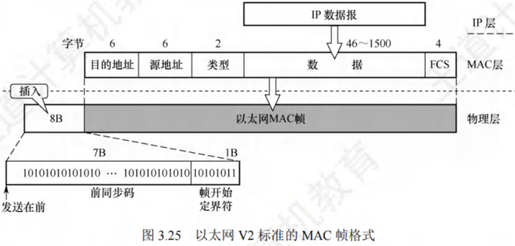

在帧前面插入的8字节前导码分为两个字段:第一个字段是7字节的前同步码,用来实现MAC帧的比特同步:第二个字段是1字节的顿开始定界符,表示后面的信息就是MAC帧。

目的地址:6字节,帧在局域网上的目的适配器的MAC地址上。
源地址:6字节,传输帧到局域网上的源适配器的MAC地址上。
类型:2字节,指出数据字段中的数据应交给哪个上层协议处理,如网络层的IP协议。

数据:46~1500字节,承载上层的协议数据单元(如IP数据报)。以太网的最大传输单元是
1500字节,若IP数据报超过1500字节,则必须将该IP数据报分片。此外,由于CSMA/CD算
法的限制,以太网帧必须满足最小长度是64字节,当数据字段的长度小于46字节时,MAC子
层就在数据字段的后面加一个整数字节的填充字段,以确保帧长不小于64字节。

46是怎么来的?由CSMA/CD可知以太网顿的最短帧长为64B,而MAC帧的首部和尾部
的长度为18字节,所以数据宇段最短为64-18=46字节。

检验码(FCS):4字节,检验范围从目的地址段到数据字段,算法采用32位CRC码,不但
要检验MAC帧的数据部分,而且要检验目的地址、源地址和类型字段,但不检验前导码。
802.3帧格式与以太网V2帧格式的不同之处是,用长度域替代了V2帧中的类型域,指出了
数据域的长度。在实践中,前述长度/类型两种机制可以并不存,因为IEEE802.3数据段的最大字节
数是1500,所以长度段的最大值是1500,于是从1501到65535的值可用于类型段标识符。

以太网顿不需要帧结束定界符,因为当以太网传送帧时,各顿之间必须有一定的间隙。因
此,接收方只要找到帧开始定界符,其后面连续到达的比特流就都属于同一个帧。实际上,以太
网采用了违规编码法的思想,因为以太网使用曼彻斯特编码,所以每个码元中间都有一次电压的
跳变。发送方发完一个帧后,发送方网络接口上的电压不再变化,这样接收方就能很容易地找到
帧的结束位置,这个位置往前数4字节就是FCS字段,于是就就能确定数据宇段的结束位置。

#### 高速以太网

速率达到或超过100Mb/s的以太网称为高速以太网,表3.3列出了几种高速以太网技术。

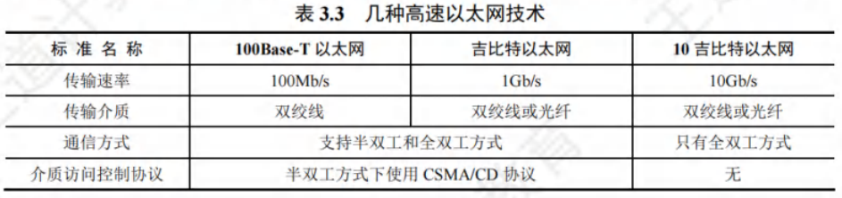

100BASE-T是在双绞线上传送100Mb/s基带信号的星形拓扑以太网,它仍然使用CSMA/CD
协议,又称快速以太网。100BASE-T既支持全双工方式,又支诗半双工方式,可在全双工方式下
工作而无冲突发生,因此在全双工方式下不使用CSMA/CD协议。
100BASE-T的MAC帧格式仍然是802.3标准规定的顿格式。保保持最短帧长不变,但将一个
网段的最大长度减小到100m。帧间最小间隔从原来的9.6us改为0.96μs。
(2)吉比特以太网
吉比特以太网又称千兆以太网,允许在1Gb/s速率下以全双工和半双工两种方式工作。使用
802.3协议规定的顿格式。使用双绞线或光纤作为传输介质。在在半双工方式下使用CSMA/CD协
议,而在全双工方式不使用CSMA/CD协议。与10BASE-T和100BASE-T技术向后兼容。
(3)10吉比特以太网
10吉比特以太网的帧格式与10Mb/s、100Mb/s和1Gb/s以太网的的帧格式完全相同,还保留了
802.3标准规定的以太网最小帧长和最大帧长,以便升级和向后兼容。10吉比特以太网只工作在
全双工方式,不存在争用问题,当然也不使用CSMA/CD协议。
以太网从10Mb/s到10Gb/s的演进证明了以太网是可扩展的(从10Mb/s到10Gb/s)、灵活的
(多种传输介质、全/半双工、共享/交换),且易于安装,稳健性生好

### IEEE802.11无线局域网

#### 无线局域网的组成

无线局域网可分为两大类:有固定基础设施的无线局域网和无固定基础设施的移动自组织网
络。所谓"固定基础设施",是指预先建立的、能覆盖一定地理范围的固定基站。

(1)有固定基础设施无线局域网
对于有固定基础设施的无线局域网,IEEE制定了无线局域网的802.11系列协议标准,包括
802.11a/b/g/n等。802.11标准使用星形拓扑,其中心称为接入点(AccessPoint,AP),在MAC
层使用CSMA/CA协议。使用802.11系列协议的局域网又称Wi-Fi
802.11标准规定无线局域网的最小构件是基本服务集(BasicSService Set,BSS)。一个基本服
务集包括一个接入点和若干移动站。各站在本BSS内的通信,或与本BSS外部站的通信,都必
须通过本BSS的AP。上面提到的AP就是基本服务集中的基站(basestation)。安装AP时,必
须为其分配一个不超过32字节的服务集标识符(Service Set IIDentifier,SSID)和一个信道。SSID
是指使用该AP的无线局域网的名称。基本服务集覆盖的地理范围称为基本服务区(Basic Service
Area,BSA),无线局域网的基本服务区的直径一般不超过100m。
基本服务集可以是孤立的,也可通过AP连接到一个分配系统(Distribution System,DS),然后
连接到另一个基本服务集,构成一个扩展的服务集(ExtendedScervice Set,ESS)。分配系统的作用是
使扩展的服务集对上层的表现就像一个基本服务集。ESS还可通过一种称为Portal(门户)的设备为
无线用户提供到有线连接的以太网接入。门户的作用相当于网桥。在图3.26中,移动站A若要和另
一个基本服务集中的移动站B通信,则必须经过两个接入点AP|和AP2,即A→AP|→AP2→B,注意
AP|到AP2的通信是使用有线传输的。

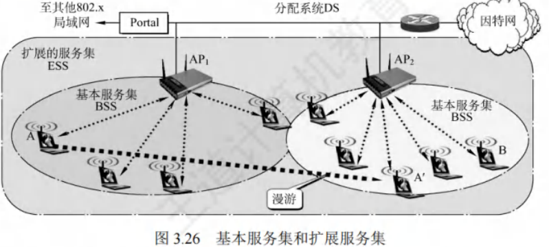

当移动站A从某个基本服务集漫游到另一个基本服务集时(图)3.26中的A'),仍可保持与另
一个移动站B的通信。但A在不同的基本服务集中使用的AP改变了。
(2)无固定基础设施移动自组织网络
另一种无线局域网是无固定基础设施的无线局域网,又称自组网络(adhocnetwork)。自组
网络没有上述基本服务集中的AP,而有由一些平等状态的移动站相互通信组成的临时网络(见
图3.27)。各结点之间地位平等,中间结点都为转发结点,因此都具有路由器的功能。

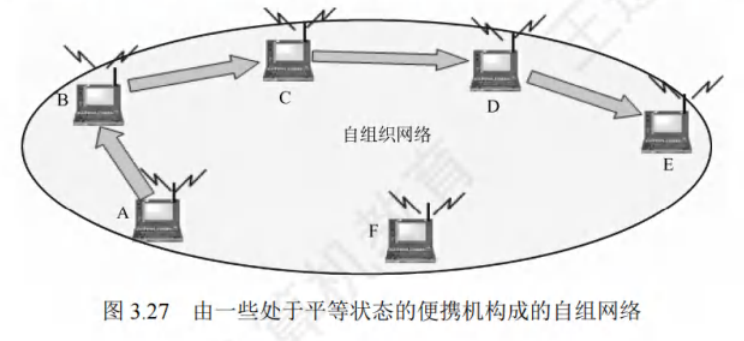

#### 802.11局域网的MAC帧

802.11帧共有三种类型,即数据帧、控制帧和管理帧。数据帽侦察不要的格式如图
802.11数据帧由以下三部分组成:
1)MAC首部,共30字节。帧的复杂性都在MAC首部。
2)帧主体,即帧的数据部分,不超过2312字节。它比以太网的最大长度长很多。
3)帧检验序列FCS是MAC尾部,共4字节。

802.11帧的MAC首部中最重要的是4个地址字段(都是MAC地址)。这里仅讨论前三
个地址(地址4用于自组网络)。这三个地址的内容取决于帧控制字段中的"去往AP"和"来
自AP"这两个字段的数值。表3.4中给出了802.11帧的地址字段最常用的两种情况。

地址1是直接接收数据顿的结点地址,地址2是实际发送数据帧的结点地址。
1)现在假定从一个BSS中的A站向B站发送数据帧。在A站发往AP的数据帧的帧控制字
段中,"去往AP=1"而"来自AP=0";地址1是AP的MAC地址,地址2是A站的
MAC地址,地址3是B站的MAC地址。注意,"接收地址"与"目的地址"并不等同。
2)AP接收到数据帧后,转发给B站,此时在数据帧的帧控制字段中,"去往AP=0"而"来
自AP=1";地址1是B站的MAC地址2是AP的MAC地址,地址3是A站的
MAC地址。注意,"发送地址"与"源地址"也不等同。
对这三个地址的理解方法如下:地址1和地址2分别是无线通信中信道两端的接收地址和发
送地址。当主机发往AP时,接收地址不是实际的目的地址上,因此用地址3来存放实际的目的地
址;当AP发往主机时,发送地址不是实际的源地址,因此比用地址3来存放实际的源地址。

下面讨论一种更复杂的情况。在图3.29中,两个AP有线连接接到路由器,现在路由器要向A
站发送数据。路由器是网络层设备,它看不见链路层的AIP,只认识A站的IP地址。而AP是链
路层设备,它只认识MAC地址,而不认识IP地址。

1)路由器从IP数据报获知A站的IP地址,并用ARP获取A刘站的MAC地址。获取A站的
MAC地址后,路由器接口R1将该IP数据报封装成802.3帧((802.3帧只有两个地址),
该帧的源地址字段是RI的MAC地址,目的地址字段是A站的MAC地址。
2)AP收到该802.3顿后,将该802.3帧转换为802.11帧,在帧控制字段中,"去往AP=0"
而"来自AP=1";地址1是A站的MAC地址2是AP的MAC地址,地址3是
RI的MAC地址。这样,A站就可以确定(从地址3)将数据报发送到子网中的路由器
接口的MAC地址。
现在考虑从A站向路由器接口R1发送数据的情况。
1)A站生成一个802.11帧,在帧控制字段中,"去往AP=1"而"来自AP=0";地址1是
AP的MAC地址,地址2是A站的MAC地址3是R1的MAC地址。
2)AP收到该802.11帧后,将其转换为802.3帧。该帧的源地址字段是A站的MAC地址,
目的地址字段是R1的MAC地址。
由此可见,地址3在BSS和有线局域网互连中起关键作用,它允许AP在构建以太网帧时确
定目的MAC地址。

### VLAN基本概念与基本原理

一个以太网是一个广播域,当一个以太网中包含的计算机太多时,往往会导致:
以太网中出现大量的广播帧,特别是经常使用的ARP和IDHCP协议(第4章)。
一个单位的不同部门共享一个局域网,对信息保密和安全不利。
通过虚拟局域网(VirtualLAN,VLAN),可将一个较大的)局域网分割成一些较小的与地理
位置无关的逻辑上的VLAN,而每个VLAN是一个较小的广播域。
有以下三种划分VLAN的方式:
1)基于接口。将交换机的若干接口划为一个逻辑组,这种力方法最简单、最有效,若主机离
开了原来的接口,则可能进入一个新的子网。
2)基于MAC地址。按MAC地址将一些主机划分为一个逻辑子网,当主机的物理位置从一
个交换机移动到另一个交换机时,它仍属于原来的子网。
3)基于IP地址。根据网络层地址或协议划分VLAN,这样的的VLAN可以跨越路由器进行扩
展,将多个局域网的主机连接在一起。

802.3ac标准定义了支持VLAN的以太网帧格式的扩展。它在以太网顿中插入一个4字节的
标识符(插在源地址字段和类型字段之间),称为VLAN标签,用来指明发送该帧的计算机属于
哪个虚拟局域网。插入VLAN标签的帧称为802.1Q帧,如日图3.30所示。因为VLAN帧的首部增
加了4字节,所以以太网的最大帧长从原来的1518字节变为1522字节

VLAN标签的前两个字节总是置为0x8100,表示这是一个8022.1Q帧。在VLAN标签的后
两个字节中,前4位实际上并没什么作用,这里不讨论,后112位是该VLAN的标识符VID
它唯一地标识该802.1Q帧属于哪个VLAN。12位的VID可只别4096个不同的VLAN。插入
VLAN标签后,802.1Q帧最后的FCS必须重新计算。
如图3.31所示,交换机1连接7台计算机,该局域网划分为两两个虚拟局域网VLAN-10和
VLAN-20,这里的10和20就是802.1Q帧中的VID字段的值,由交换机管理员设定。各主机并
不知道自己的VID值(但交换机必须知道),主机与交换机之间交互的都是标准以太网帧。一个
VLAN的范围可以跨越不同的交换机,前提是所用的交换机能够识别和处理VLAN。交换机2连
接5台计算机,并与交换机1相连。交换机2中的2台计算机加入VLAN-10,另外3台计算机加
入VLAN-20。这两个VLAN虽然都跨越了两个交换机,但各自都是一个广播域。
连接两个交换机接口之间的链路称为汇聚链路或千线钱路。

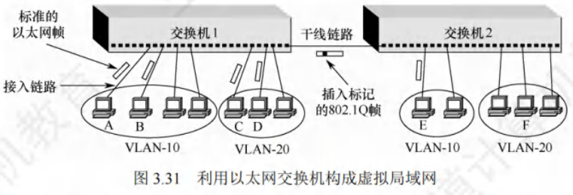

假定A站向B站发送帧,交换机1根据顿首部的目的MAC地址;,识别B站属于本交换机管
理的VLAN-10,因此就像在普通以太网中那样直接转发帧。假定A站向E站发送帧,交换机1
必须把顿转发到交换机2,但在转发前,要插入VLAN标签,否否则交换机2就不知道应把帧转发
给哪个VLAN。因此,在干线链路上传送的顿是802.1Q帧。交换机2在向E站转发帧之前,要
拿走已插入的VLAN标签,因此E站收到的顿是A站发送的标准以太网帧,而不是802.1Q帧。
若A站向C站发送帧,则情况就复杂了,因为这是在不同P网络之间的通信,虽然A站和C站都
连接到同一个交换机,但是它们已处在不同的网络中(VLAN-10和VLAN-20),需要通过上层的路
由器来解决,也可在交换机中嵌入专用芯片进行转发,以便在交换机中实现第3层的转发功能。
虚拟局域网只是局域网为用户提供的一种服务,并不是一种新型局域网。

## 广域网

### 广域网的基本概念

广域网(WideAreaNetwork,WAN)通常是指覆盖范围很广(远超一个城市的范围)的长距
离网络,任务是长距离运送主机所发送的数据。连接广域网各结点交换机的链路都是高速链路,
广域网首要考虑的问题是通信容量必须足够大,以便支持日益增长的通信量。
广域网不等于互联网。互联网可以连接不同类型的网络,通常使用路由器来连接。图3.32
显示了由相距较远的局域网通过路由器与广域网相连而成的一个覆盖范围很广的互联网。因
此,局域网可以通过广域网与另一个相隔很远的局域网通信。

广域网由一些结点交换机(注意不是路由器,结点交换机和路由器都用来转发分组,它们的
工作原理也类似。结点交换机在单个网络中转发分组,而路由器在多个网络构成的互联网中转发
分组)及连接这些交换机的链路组成。结点交换机的功能是存储并转发分组。结点之间都是点到
点连接,但为了提高网络的可靠性,通常一个结点交换机往往与多个结点交换机相连。
从层次上考虑,广域网和局域网的区别很大,因为局域网使用的协议主要在数据链路层(还
有少量在物理层),而广域网使用的协议主要在网络层。怎么理解"局域网使用的协议主要在数
据链路层,而广域网使用的协议主要在网络层"这句话呢?若网络中的两个结点要进行数据交换,
则结点除了要给出数据,还要给数据"包装"上一层控制信息,用于实现传输控制等功能。若这
层控制信息是数据链路层协议的控制信息,则称使用了数锯路层协议:若这层控制信息是网络
层的控制信息,则称使用了网络层协议。

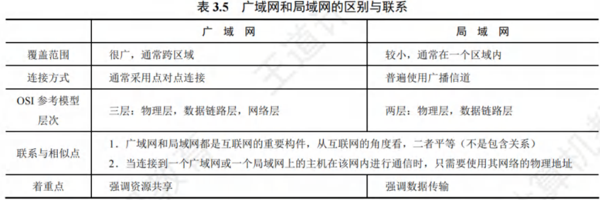

在通信线路质量较差的年代,能实现可靠传输的高级数据链路控制(HDLC)成为当时比较
流行的数据链路层协议。但对现在误码率很低的点对点有线链路,更简单的点对点协议(PPP)
则是目前使用最广泛的数据链路层协议。HDLC已从最新大纲中删除,所以本书不再介绍。

### 点对点协议

点对点协议(Point-to-Point Protocol,PPP)是现在最流行的点对点链路控制协议。主要有两
种应用:1用户通常都要连接到某个ISP才能接入互联网,PPP协议就是用户计算机与ISP通信
时所用的数据链路层协议:2广泛用于广域网路由器之间的专用线路。
PPP协议有三个组成部分:
1)一个链路控制协议(LCP)。用来建立、配置、测试数据链路连接,以及协商一些选项。
2)一套网络控制协议(NCP)。PPP协议允许采用多种网络层协议,每个不同的网络层协议
要用一个相应的NCP来配置,为网络层协议建立和配置逻辑过连接
3)一种将IP数据报封装到串行链路的方法。IP数据报在PPP帧中就是其信息部分,这个信
息部分的长度受最大传送单元(MTU)限制。
PPP帧的格式如图3.33所示,首部和尾部分别为4个字段和2个字段。

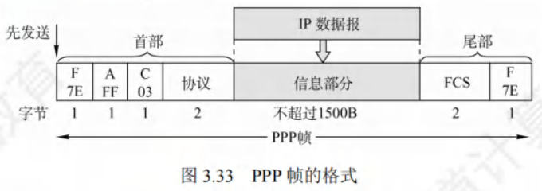

首部和尾部各有一个标志字段(F),规定为0x7E(01111111110),它表示一个帧的开始和结束,
即PPP帧的定界符。当标志字段出现在信息段中时,就必多预采取一些措施使这种形式上和标志字
段一样的比特组合不出现在信息段中。当PP使用异步传输时,采用字节填充法,使用的转义字
符是0x7D(011111101)。当PP使用同步传输时,采用零比特均填充法来实现透明传输。
地址字段(A)占1字节,规定为0xFF,控制字段(C)占1字节,规定为0x03,这两个字
段的意义暂未定义。PPP是面向字节的,因此所有PP帧的长度都是整数个字节。
第四个字段是协议段,占2字节,它表示信息段运载的是什么中类的分组。若为0x0021,则
信息字段是IP数据报。若为0xC021,则信息字段是PPP链路控制协议(LCP)的数据。
第五段信息段的长度是可变的,长度为0~1500字节。

第六个字段是帧检验序列(FCS),占2字节,是使用CRC检验的冗余码。
图3.34给出了PP协议的状态图。具体解释如下:

当处于链路静止状态时,通信双方不存在物理层的连接。
当链路一方检测到载波信号并建立物理连接时,进入链路建立状态。
在链路建立状态下,链路控制协议(LCP)开始协商一些配置选项(包括最大帧长、鉴别
协议等)。若协商成功,则进入鉴别状态。若协商失败,则退回到链路静止状态。
协商成功后,双方就建立了LCP链路,接着进入"鉴别"状态。若双方无须鉴别或鉴别
身份成功,则进入网络层协议状态。若鉴别失败,则进入锋路终止状态。
5)处于网络层协议状态后,双方采用NCP配置网络层,配置置协商成功后,进入链路打开状态。
只要链路处于打开状态,双方就可进行数据通信。
7)数据传输结束后,链路一方发出终止请求且在收到对方发来的终止确认后,或者链路出
现故障时,进入链路终止状态。载波停止后,回到链路静止状态。
PP协协议的特点如下:
1)PPP不使用序号和确认机制,只保证无差错接收(CRC检验),因此是不可靠服务。
2)PP只只支持全双工的点对点链路,不支持多点线路。
3)PP的两端可以运行不同的网络层协议,但仍可使用同一个PPP进行通信
4)PPP是面向字节的,所有PP帧的长度都是整数个字节。

## 数据链路层设备

### 以太网交换机

#### 交换机的原理和特点

以太网交换机也称二层交换机,二层是指以太网交换机工作在数据链路层。以太网交换机实
质上是一个多接口的网桥,它能将网络分成小的冲突域,为每个用户提供更大的带宽。对于传统
使用集线器的共享式10Mb/s以太网,若共有N个用户,则每个用户的平均带宽为总带宽(10Mb/s)
的1/N。使用以太网交换机(全双工方式)连接这些主机时,虽然从每个接口到主机的带宽还是
10Mb/s,但是因为一个用户通信时是独占带宽的(而不是和其他网络用户共享传输介质带宽的),
所以拥有N个接口的交换机的总容量为Nx10Mb/s。这正是交换机的最大优点。

以太网交换机的特点:
1)当交换机的接口直接与主机或其他交换机连接时,可工作在全双工方式,并能同时连通
多对接口,使每对相互通信的主机都能像独占通信介质那样样,无冲突地传输数据,这样
就不需要使用CSMA/CD协议。
2)当交换机的接口连接集线器时,只能使用CSMA/CD协议且且只能工作在半双工方式。当
前的交换机和计算机中的网卡都能自动识别上述两种情况。
3)交换机是一种即插即用设备,其内部的帧转发表是通过自学习算法,基于网络中各主机
间的通信,自动地逐渐建立的。
4)交换机因为使用专用交换结构芯片,交换速率较高。
5)交换机独占传输介质的带宽。

以太网交换机主要采用两种交换模式:
1)直通交换方式。只检查帧的目的MAC地址,以决定该帧的转发接口。这种方式的交换时
延非常小,缺点是它不检查差错就直接转发,因此可能将一些无效帧转发给其他站。直
通交换方式不适用于需要速率匹配、协议转换或差错检测的线路。
(2)存储转发交换方式。先将接收到的帧缓存到高速缓存器中,并检查数据是否正确,确认
无误后通过查找表转换为输出接口,以便将该帧发送出去。若发现顿有错,则将其丢弃。
优点是可靠性高,且能支持不同速率接口间的转换,缺点是时延较大。
交换机一般都具有多种速率的接口,如10Mb/s、100Mb/s的接口,以及多速率自适应接口。

#### 交换机的自学习功能

决定一个帧是转发到某个接口还是丢弃它称为过滤。决定一个帧应被移至哪个接口称为转发。交换机的过滤和转发借助交换表(switch table)完成。交换表中的一个表项至少包含:1
个MAC地址:2连通该MAC地址的接口。例如,在图3.35中,以太网交换机有4个接口,各
连接一台计算机,MAC地址分别为A、B、C和D,交换机的交换表最初为空A先向B发送一帧,从接口1进入交换机。交换机收到帧后,查找我交换表,找不到MAC地
址为B的表项。然后,交换机将该帧的源地址A和接口1写入交换表,并向除接口1外的所有接
口广播这个帧(该帧就是从接口1进入的,因此不应将它再从接口11转发出去)。C和D丢弃该
帧,因为目的地址不对。只有B才收下这个目的地址正确的帧。交换表中写入(A,1)后,从任
何接口收到目的地址为A的顿都应从接口1转发出去。这是因为,既然A发出的帧从接口1进入
交换机,那么从接口1转发出去的帧也应能到达A。
接下来,假定B通过接口3向A发送一帧,交换机查找交换表后,发现有表项(A,1),将
该帧从接口1转发给A。显然,此时已没有必要再广播收到的帧。将该帧的源地址B和接口3写
入交换表,表明以后若有发送给B的帧,则应从接口3转发出去。
经过一段时间后,只要C和D也向其他主机发送帧,交换机就把C和D及对应的接口号写
入交换表。这样,转发给任何主机的帧,就都能很快地在交换表中找到相应的转发接口。
因为交换机所连的主机会随时变化,所以需要更新交换表中的表项。为此,交换表中的
每个表项都设有一定的有效时间,过期表项将被自动删除。这就保证了交换表中的数据符合
当前网络的实际状况。这种自学习算法使得交换机能即插即用,而不必手工配置,因此非常
方便。

#### 共享式以太网和交换式以太网的对比

假设交换机已通过自学习算法逐步建立了完整的转发表,下面举例说明使用集线器的共享式
以太网与全部使用交换机的交换式以太网的区别。
1)主机发送普通帧。对于共享式以太网,集线器将帧转发到其他所有接口,其他各主机中
的网卡根据顿的目的MAC地址决定接收或丢弃该帧。对于交换式以太网,交换机收到帧
后,根据帧的目的MAC地址和自身的交换表将帧明确地转发给目的主机
2)主机发送广播帧。对于共享式以太网,集线器将帧转发到其他所有接口,其他各主机
中的网卡检测到帧的目的MAC地址是广播地址时,就接收该帧。对于交换式以太网,

交换机检测到帧的目的MAC地址是广播地址,于是从其他所有接口转发该顿,其他
各主机收到该广播顿后,就接收该帧。两种情况从效果上看是相同的,但它们的原理
并不相同。
3)多对主机同时通信。对于共享式以太网,当多对主几同时通信时,必然产生冲突。对于
交换式以太网,交换机能实现多对接口的高速并行交换,因此不会产生冲突。

集线器既不隔离广播域,又不隔离冲突域,而交换机不隔离广播域,但隔离冲突域。
