# 数据链路层

[toc]

## 数据链路层的功能

数据链路层主要任务是实现帧在一段链路或一个网络中传输。虽数据链路层协议多样，但有三个共同基本问题：**封装成帧**、**透明传输**和**差错检测**。

数据链路层使用的信道主要有以下两种：
1. **点对点信道**：采用一对一通信方式。**PPP协议**是目前使用最广泛的点对点协议。
2. **广播信道**：此信道连接主机众多，采用一对多广播通信方式。采用共享广播信道的有线局域网普遍使用**CSMA/CD协议**，无线局域网则使用**CSMA/CA协议**。

以下是相关概念：
1. **链路**：指从一个结点到相邻结点的一段物理线路。数据通信时，两台计算机间通信路径常需经过多段这样的链路，链路是路径的组成部分。
2. **数据链路**：在链路上传输数据，除链路本身，还需通信协议控制数据传输，将实现这些协议的硬件和软件加到链路上，就构成数据链路。链路常被称作物理链路，数据链路则被称作逻辑链路。
3. **帧**：数据链路层对等实体之间进行逻辑通信的协议数据单元。数据链路层将网络层下交的数据构成帧发送到链路上，并把接收到的帧中的数据取出上交给网络层。 

### 链路管理

- **定义**：数据链路层连接的建立、维持和释放过程，主要用于面向连接的服务。
- **流程**：
    - **建立连接**：链路两端结点通信前，需先确认对方已就绪，并交换必要信息（如对帧序号初始化），之后才能建立连接。
    - **维持连接**：在数据传输过程中，要维持该连接。
    - **释放连接**：传输完毕后，需释放连接。 

### 封装成帧与透明传输

1. **封装成帧**
    - **概念**：在一段数据的前后分别添加首部和尾部，构成帧，帧是数据链路层的数据传送单元。帧长 = 数据部分长度 + 首部长度 + 尾部长度 。
    - **首部和尾部作用**：含有众多控制信息，重要作用之一是**帧定界**，即确定帧的界限，以便接收方从接收到的二进制比特流中区分出帧的起始与终止，实现**帧同步**。例如在HDLC协议中，用标识位F(01111110)来标识帧的开始和结束，接收方检测到F标识位，就认为是帧的开始，再次检测到F标识位，则表示帧结束。（HDLC标准帧格式见[图3.4]）
    - **帧长考量**：为提高帧传输效率，应使帧的数据部分长度尽可能大于首部和尾部长度。但帧长增加，传输差错概率提高，重传代价增大。所以每种链路层协议都规定了帧的数据部分长度上限，即**最大传送单元**。

2. **透明传输**
    - **问题**：若数据中出现与帧定界符相同的比特组合，会被误认为“传输结束”，导致后面的数据被丢弃。
    - **概念**：透明传输指不论所传数据是什么样的比特组合，都能按原样无差错地在数据链路上传输。 

### 流量控制

- **产生原因**：链路两端结点工作速率与缓存空间存在差异，发送方发送能力可能大于接收方接收能力。若不限制发送方速率，接收不及的帧会被后续帧“淹没”，导致帧丢失出错。
- **定义**：流量控制本质是限制发送方发送速率，使其不超过接收方接收能力。
- **实现方式**：借助反馈机制，让发送方知晓何时可发送下一帧，何时需暂停发送，等待反馈信息后再继续发送。

- **不同体系结构对比**：
    - **OSI体系结构**：数据链路层具备流量控制功能，控制相邻结点间数据链路上的流量。
    - **TCP/IP体系结构**：流量控制功能移至传输层，控制的是从源端到目的端之间的流量。 

### 差错检测

由于信道噪声等因素，帧在传输过程中可能出现错误，主要分为**位错**和**帧错**：
1. **位错**：指帧中某些位出现差错，常采用**循环冗余检验（CRC）**来发现。
2. **帧错**：包括帧丢失、帧重复或帧失序等错误，均属于传输差错。

关于数据链路层处理差错的方式，存在不同情况：
 - **过去OSI观点**：数据链路层需向上提供可靠传输。在CRC检错基础上，增加帧编号、确认和重传机制。接收方收到正确帧要向发送方发送确认，发送方若在一定期限内未收到确认，就认为出现差错并进行重传，直至收到确认为止。在通信质量较差的无线传输中，数据链路层依旧采用此方式，向上提供可靠传输服务。
 - **如今有线链路情况**：对于通信质量良好的有线链路，数据链路层不再使用确认和重传机制，即不要求向上提供可靠传输服务，仅进行CRC检错。目的是丢弃有差错的帧，保证上交的帧正确，而将出错帧的重传任务交由高层协议（如传输层TCP协议）完成。 

## 封装成帧

发送方按照特定规则，将网络层递交的分组封装成帧（组帧）。数据链路层以帧为单位传输比特组合，这样在出错时只需重发出错帧，无需重发全部数据，可提高传输效率。组帧主要解决**帧定界**、**帧同步**和**透明传输**等问题。实现组帧的方法通常有4种。

### 加首部和尾部的原因

在网络中，信息以帧为最小传输单位。接收方要准确接收帧，就必须明确该帧在比特流中的起止位置（因为接收方接收到的是连续比特流，若无首部和尾部，无法正确区分帧）。而分组（即IP数据报）只是帧中包含的数据部分（后续会详细讲解），因此无需加尾部来定界，所以组帧时既要加首部，又要加尾部。 

### 字符计数法

- **原理**：在帧首部设置一个计数字段，用于记录该帧包含的字节数（计数字段自身占用的1个字节也包含在内） ，如[图3.5]所示。接收方通过读取帧首部的字节计数值，知晓后续跟随的字节数，以此确定帧的结束位置。由于帧是连续传输的，进而也能确定下一帧的开始位置。
- **缺点**：该方法的最大问题在于，若计数字段出现错误，就会丧失帧边界划分的依据。如此一来，接收方无法判断所传输帧的结束位以及下一帧的开始位，导致收发双方失去同步，产生灾难性后果。 

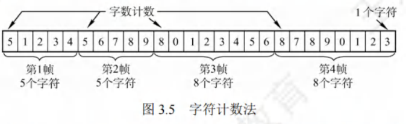

### 字节填充法

- **帧定界方式**：采用特定字节来界定一帧的起始与结束。例如在[图3.6]的示例中，将控制字符**SOH**置于帧的开头，表示帧的起始；控制字符**EOT**表示帧的结束。
- **透明传输实现**：为防止信息位中的特殊字符被误判为帧的首尾定界符，在特殊字符前填充一个**转义字符ESC**加以区分（注意，转义字符是ASCII码中的一个控制字符，并非“E”“S”“C”三个字符的组合），以此达成数据的透明传输。接收方收到转义字符后，便知其后紧跟的是数据信息，而非控制信息。

 - 在图3.6(a)的字符帧里，若帧的数据段中出现**EOT**或**SOH**字符，发送方会在每个**EOT**或**SOH**字符前插入一个**ESC**字符[见图3.6(b)]。
 - 接收方收到数据后，自行删除插入的**ESC**字符，最终得到原始数据[见图3.6(c)]，这就是“字节填充法”名称的由来。
 - 若转义字符**ESC**也出现在数据中，解决办法同样是在该转义字符前再插入一个转义字符。 

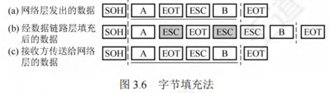

### 零比特填充法

- **帧定界标志**：零比特填充法允许数据帧包含任意数量的比特，采用特定比特串**01111110**来标识一帧的起始与结束，如[图3.7]所示。
- **避免误判机制**：为防止数据字段中出现的比特流**01111110**被误判为帧的首尾标志，发送方会对整个数据字段进行扫描。每遇到5个连续的“1” ，便自动在其后插入一个“0”。经过这样的比特填充，可确保数据字段中不会出现6个连续的“1”。
- **接收方处理**：接收方进行与发送方相反的操作，每收到5个连续的“1”，就自动删除紧跟其后的“0”，从而恢复原始数据。在数据链路层早期使用的HDLC协议，就是运用这种比特填充的首尾标志法来实现透明传输。 

零比特填充法很容易由硬件来实现，性能优于字节填充法。

### 违规编码法

- **原理**：在物理层比特编码时运用。以曼彻斯特编码为例，它把数据比特“1”编码为“高 - 低”电平对，“0”编码为“低 - 高”电平对，而“高 - 高”和“低 - 低”电平对在数据比特编码中是违规的（未使用）。于是，可利用这些违规编码序列来界定帧的起始与终止。像局域网IEEE802标准就采用了此方法。
- **特点**：该方法无需任何填充技术就能达成数据的透明传输。然而，它仅适用于采用冗余编码的特殊编码环境。

由于字符计数法中计数字段的脆弱性，以及字节填充法在实现上存在复杂性与不兼容性，当前较常用的组帧方法为零比特填充法和违规编码法。 

#### 奇偶检验码

奇偶检验码是奇检验码与偶检验码的统称，属于最基础的检错码。它由$n - 1$位数据和1位检验位构成，通过设定检验位的取值（0或1），让整个检验码中“1”的个数呈现奇数或偶数。
1. **奇检验码**：添加一个检验位后，码长为$n$的码字里“1”的个数为奇数。
2. **偶检验码**：添加一个检验位后，码长为$n$的码字里“1”的个数为偶数。

#### 循环冗余码

数据链路层广泛采用循环冗余码（Cyclic Redundancy Code，CRC）作为检错技术。

- **基本思想**：
    - **约定生成多项式**：收发双方事先约定一个生成多项式$G(x)$（其最高位和最低位必须为$1$）。$k$位的位串可看作是阶数为$k - 1$的多项式的系数序列。例如，位串$1101$可用多项式$x^3 + x^2 + 1$表示。

    - **发送方计算冗余码**：发送方依据待发送的数据和$G(x)$计算出冗余码，然后将冗余码附加在数据之后一同发送。
    - **接收方差错检测**：接收方收到数据与冗余码后，借助$G(x)$来判断收到的数据和冗余码是否出现差错。

假设要传送$m$位的数据，CRC运算会产生一个$r$位的冗余码，即帧检验序列（Frame Check Sequence，FCS）。如此形成的帧由$m + r$位构成。在待发送数据后增加$r$位冗余码，虽增加了传输开销，但能够实现差错检测，这种付出通常是值得的。带有检验码的帧恰好能被预先确定的多项式$G(x)$整除。接收方用相同的多项式去除收到的帧，若余数为$0$，则认为无差错。

- **计算冗余码步骤**：
    - **加$0$**：假设$G(x)$的阶为$r$，在数据后面添加$r$个$0$，这相当于将原数据乘以$2^r$。
    - **模$2$除**：利用模$2$除法，用$G(x)$对应的二进制串去除上述添加$0$后的数据串，所得的余数就是冗余码（共$r$位，前面的$0$不可省略）。模$2$运算规则为：加法不进位，减法不借位，相当于对应位进行逻辑异或运算。

**冗余码计算举例**：假设数据$M = 101001$（即$m = 6$），除数$G(x)=1101$（即$r = 3$），经模$2$除法运算后，商$Q = 110101$（此商在实际差错检测中作用不大），余数$R = 001$。所以，发送出去的数据为$101001001$（即$2^rM + FCS$），共$m + r$位，运算过程如[图3.8]所示。

发送方生成FCS和接收方进行CRC检验都由硬件实现，处理速度极快，不会对数据传输造成影响。若传输过程无差错，经过CRC检验得出的余数$R$必定为$0$。而一旦出现误码，余数$R$仍为$0$的概率极低。所以，借助CRC检错技术，可近似认为“凡是接收方数据链路层接受的帧均无差错”。即对于接收方数据链路层接受的帧，我们能以极高概率认定这些帧在传输过程中未出差错；而接收方丢弃的帧，虽曾收到，但因存在差错最终被舍弃，即未被接受。

实际上，循环冗余码（CRC）具备纠错功能，但数据链路层仅运用其检错功能，检测到帧出错便直接丢弃，这样做是为了简化协议实现，因此本节将CRC置于检错编码部分进行介绍。 

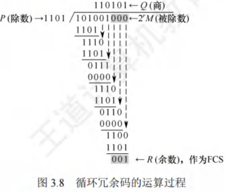

### 纠错编码

最常见的纠错编码是**海明码**，其原理是在有效信息位中加入若干检验位构成海明码，把海明码的每一位分配到多个奇偶检验组。某一位出错会改变相关检验位的值，不仅能发现错误，还能指出错误位置，为自动纠错提供依据。

以数据码1010为例，讲述海明码的编码原理与过程：
1. **确定海明码的位数**
设$n$为有效信息位数，$k$为检验位位数，信息位$n$和检验位$k$需满足$n + k \leq 2^k - 1$。
对于$n = 4$（信息位$D_4D_3D_2D_1 = 1010$），$k = 3$（检验位$P_3P_2P_1$），此时$n + k = 7 \leq 2^3 - 1$成立，$n$、$k$有效。对应的海明码为$H_7H_6H_5H_4H_3H_2H_1$。
2. **确定检验位的分布**
规定检验位$P_i$在海明位号为$2^{i - 1}$的位置上，其余为信息位。所以：
    - $P_1$的海明码位号为$2^{1 - 1} = 2^0 = 1$，即$H_1$为$P_1$。
    - $P_2$的海明码位号为$2^{2 - 1} = 2^1 = 2$，即$H_2$为$P_2$。
    - $P_3$的海明码位号为$2^{3 - 1} = 2^2 = 4$，即$H_4$为$P_3$。
将信息位按原顺序插入，海明码各位分布为：$H_7H_6H_5H_4H_3H_2H_1$对应$D_4D_3D_2P_3D_1P_2P_1$。
3. **分组以形成检验关系**
每个数据位由多个检验位检验，需满足：被检验数据位的海明位号等于检验该数据位的各检验位海明位号之和。检验位无需再次被检验。分组形成的检验关系如下（此处未详细列出分组，可根据后续计算推测分组方式）。
4. **检验位取值**
检验位$P_i$的值为第$i$组（由该检验位检验的数据位）所有位求异或。
根据上述分组有：
    - $P_1 = D_1 \oplus D_3 \oplus D_4 = 0 \oplus 1 \oplus 1 = 0$
    - $P_2 = D_1 \oplus D_2 \oplus D_4 = 0 \oplus 0 \oplus 1 = 1$
    - $P_3 = D_2 \oplus D_3 \oplus D_4 = 0 \oplus 1 \oplus 1 = 0$
所以，1010对应的海明码为1010010（下画线为检验位，其他为信息位）。
5. **海明码的检验原理**
每个检验组分别利用检验位和参与形成该检验位的信息位进行奇偶检验检查，构成$k$个检验方程：
    - $S_1 = P_1 \oplus D_1 \oplus D_3 \oplus D_4$
    - $S_2 = P_2 \oplus D_1 \oplus D_2 \oplus D_4$
    - $S_3 = P_3 \oplus D_2 \oplus D_3 \oplus D_4$
若$S_3S_2S_1$的值为“000”，则说明无错；否则说明出错，且这个数就是错误位的位号。例如$S_3S_2S_1 = 001$，说明第1位出错，即$H_1$出错，直接将该位取反就可实现纠错。 

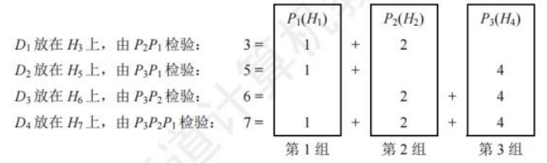

## 流量控制与可靠传输机制

流量控制指接收方对发送方发送速率进行控制，确保自身有足够缓冲空间接收每一帧。常见流量控制方法有**停止 - 等待协议**和**滑动窗口协议**。数据链路层与传输层都具备流量控制功能，且都运用滑动窗口协议，但二者存在区别，主要体现在：
1. **控制范围**：
    - 数据链路层控制的是**相邻结点之间**的流量。
    - 传输层控制的是**端到端**的流量。
2. **控制手段**：
    - 数据链路层：接收方若接收能力不足，就不返回确认信息。
    - 传输层：接收方通过确认报文段中的**窗口值**来调节发送方的发送窗口。 

#### 停止 - 等待流量控制基本原理

停止 - 等待流量控制是最为简单的流量控制方式。其运作原理如下：
 - **发送规则**：发送方每次仅能发送一个帧。
 - **接收反馈**：接收方每接收一个帧，都需向发送方反馈一个应答信号，以此表明自身具备接收下一帧的能力。
 - **发送条件**：发送方只有在收到接收方反馈的应答信号后，才可以发送下一帧。若未收到应答信号，发送方就必须持续等待。

由于发送方每发送完一个帧，便进入等待接收方确认信息的阶段，这种方式使得传输效率较为低下。 

#### 滑动窗口流量控制基本原理

滑动窗口流量控制是一种更为高效的流量控制方式。在任何时刻：
 - **发送窗口**：发送方维护一组连续的允许发送帧的序号，此即发送窗口。它表明在尚未收到对方确认信息时，发送方最多还能发送多少个帧以及具体是哪些帧。
 - **接收窗口**：接收方同样维持一组连续的允许接收帧的序号，称作接收窗口。用于控制可接收和不可接收的帧。

[图3.9]展示了发送窗口的工作原理，[图3.10]呈现了接收窗口（$W_R = 1$）的工作原理。

 - **发送方操作**：发送方每收到一个按序确认的确认帧，就将发送窗口向前滑动一个位置。如此一来，便有一个新的序号落入发送窗口，序号在发送窗口内的数据帧可继续发送。当窗口内不存在可发送的帧（即窗口内的帧均为已发送但未收到确认的帧）时，发送方停止发送。
 - **接收方操作**：接收方每收到一个序号落入接收窗口的数据帧，便收下该帧，然后将接收窗口向前滑动一个位置，并发送确认。这样，会有一个新的序号落入接收窗口，序号在接收窗口内的数据帧就是准备接收的帧。若收到的帧落在接收窗口之外，则直接丢弃。

滑动窗口具有以下关键特性：
1. **窗口滑动关系**：只有接收窗口向前滑动（同时接收方发送了确认）时，发送窗口才有可能向前滑动（只有发送方收到确认后才一定会滑动）。
2. **协议窗口差异**：从滑动窗口概念来看，停止 - 等待协议、后退N帧协议和选择重传协议的区别仅在于发送窗口大小与接收窗口大小：
    - **停止 - 等待协议**：发送窗口$W_T = 1$，接收窗口$W_R = 1$。
    - **后退N帧协议**：发送窗口$W_T > 1$，接收窗口$W_R = 1$。
    - **选择重传协议**：发送窗口$W_T > 1$，接收窗口$W_R > 1$。
    若采用$n$比特对帧编号，则后两种滑动窗口协议还需满足$W_T + W_R \leq 2^n$。
3. **有序接收保证**：当接收窗口大小为1时，能够确保帧的有序接收。
4. **窗口大小特性**：在数据链路层的滑动窗口协议中，窗口大小在传输过程中固定不变（这与传输层不同）。 

### 可靠传输机制
可靠传输旨在确保发送方发送的数据能被接收方准确无误地接收，通常借助**确认**和**超时重传**两种机制达成。
 - **确认机制**：接收方每接收到发送方发来的数据帧，都需向发送方回发一个确认帧，以此表明已正确接收该数据帧。
 - **超时重传机制**：发送方发送数据帧后启动一个计时器，若在规定时间内未收到对应数据帧的确认帧，便重发该数据帧，直至发送成功。

运用这两种机制的可靠传输协议被称为**自动重传请求（ARQ）**，即重传过程自动进行，接收方无需向发送方发出重传请求。在ARQ协议里，数据帧和确认帧都必须编号，以便区分确认帧对应的是哪个数据帧，以及哪些数据帧尚未得到确认。ARQ协议主要有以下三种：
 - **停止 - 等待（Stop - and - Wait）协议**
 - **后退N帧（Go - Back - N）协议**
 - **选择重传（Selective Repeat）协议**

需注意，这三种可靠传输协议的基本原理并非局限于数据链路层，也可应用于其上层各层。

在网络传输中，不同链路情况对可靠传输要求不同：
 - **有线网络**：链路误码率较低，为降低开销，不要求数据链路层向上层提供可靠传输服务，若出现误码，可靠传输问题由上层处理。
 - **无线网络**：链路易受干扰，误码率较高，因此要求数据链路层必须向上层提供可靠传输服务。 

#### 单帧滑动窗口与停止 - 等待协议（S - W）
停止 - 等待协议中，发送方一次仅能发送一个帧，只有在收到接收方的确认帧后，才可以发送下一个帧。从滑动窗口视角来看，此协议的发送窗口和接收窗口大小均为1。

该协议除了可能出现数据帧丢失的情况，还存在以下两种差错情形：
1. **数据帧受损**：到达接收方的数据帧可能已遭破坏，接收方利用先前介绍的差错检测技术检出后，会直接丢弃该帧。为应对这种情况，发送方配备了计时器。在发送一帧后，发送方等待确认，若计时器超时仍未收到确认，则重发该数据帧，如此反复，直至该数据帧正确到达。
2. **确认帧受损**：数据帧正确，但确认帧被破坏。此时接收方已收到正确数据帧，然而发送方收不到确认帧，所以会重传已被接收的数据帧。接收方再次收到相同数据帧时，会丢弃该帧，并重新发送一个该帧对应的确认帧。

对于停止 - 等待协议，由于每发送一个数据帧就停止等待，所以用1比特来编号就足够。发送的帧交替使用0和1来标识，确认帧分别用ACK0和ACK1表示。当收到的确认帧有误时，就重传已发送的数据帧。若连续出现相同序号的数据帧，表明发送方进行了超时重传；若连续出现相同序号的确认帧，则表明接收方收到了重复帧。

此外，出于超时重传和判定重复帧的需求，发送方和接收方都需设置一个帧缓冲区。发送方发送完数据帧后，必须在其发送缓存中保留该数据帧的副本，以便在出现差错时重传。只有在收到对方发来的确认帧ACK后，才可清除该副本。

停止 - 等待协议的信道利用率很低。为提高传输效率，衍生出了连续ARQ协议（后退N帧协议和选择重传协议），发送方能够连续发送多个帧，而不必每发完一个帧就停止等待确认。 

#### 多帧滑动窗口与后退N帧协议(GBN)

1. **发送机制**：在后退N帧协议里，发送方在未收到确认帧的情况下，能够把序号处于发送窗口内的多个数据帧一次性全部发送出去。“后退N帧”指的是，发送方发送N个数据帧后，要是发现这N个帧中的前一个数据帧在计时器超时的时候，依然没有收到其确认信息，那么该帧就会被判定为出错或丢失，此时发送方必须重传这个出错帧以及随后的N个帧。这表明接收方仅允许按顺序接收帧。
    - 例如在[图3.11]中，发送方向接收方发送数据帧。发送方发完0号帧后，可接着发送后续的1号帧、2号帧等。并且发送方每发送完一个数据帧，都要为该帧设置超时计时器。
2. **确认机制**：由于连续发送了许多帧，确认帧必须明确是对哪个帧的确认。为减少开销，GBN协议允许接收方进行累积确认。即接收方无需每收到一个正确的数据帧就马上发回一个确认帧，而是可以在连续收到多个正确的数据帧后，针对最后一个数据帧发回确认信息。也就是说，对某个数据帧的确认，就代表该数据帧以及它之前的所有帧都已被正确无误地接收。其中，ACKn表示对n号帧的确认，意味着接收方已正确收到n号帧及之前的所有帧，下次期望收到n + 1号帧（也可能是0号帧）。
3. **接收机制**：接收方只按序接收数据帧。在图中，即便在有差错的2号帧之后紧接着收到了正确的6个数据帧，接收方也必须将这些帧丢弃。不过，接收方虽丢弃了这些未按序出现的无差错帧，但应重发已发送的最后一个确认帧ACK1（此举是为了防止已发送的确认帧ACK1丢失）。
4. **窗口大小限制**：若采用n比特对帧编号，其发送窗口$W_T$需满足$1 < W_T \leq 2^n - 1$ 。要是$W_T$大于$2^n - 1$，就会致使接收方无法区分新数据帧和旧数据帧（参考本章末的疑难点(1)）。同时，后退N帧协议的接收窗口$W_R = 1$，这样能够保证按序接收数据帧。
5. **协议特点**：后退N帧协议一方面凭借连续发送数据帧提高了信道利用率；另一方面，在重传时，即便有些帧原本已正确到达，仅因为其前面有一帧出错，就必须重传这些帧，所以这种方式会降低传送效率。当信道误码率较高时，后退N帧协议未必比停止 - 等待协议更具优势。 

#### 多帧滑动窗口与选择重传协议(SR)

1. **协议核心思想**：为进一步提升信道利用率，选择重传协议致力于仅重传出现差错和计时器超时的数据帧。为此，必须增大接收窗口，以便先接收那些虽顺序错乱但正确到达且序号仍处于接收窗口内的数据帧，待缺失序号的数据帧收齐后，再统一提交给上层。
2. **确认机制**：与后退N帧协议不同，为使发送方仅重传出错的帧，接收方不再采用累积确认，而是对每个正确接收的数据帧逐个进行确认。这种方式使得选择重传协议比后退N帧协议更为复杂。
3. **接收方处理**：接收方需要设置足够数量的帧缓冲区（帧缓冲区的数量等于接收窗口的大小，而非序号数目。原因是接收方不能接收序号在窗口下界以下或窗口上界以上的帧），用于临时存储那些失序但正确到达且序号落在接收窗口内的数据帧。
4. **计时器与重传**：每个发送缓冲区对应一个计时器，当计时器超时，缓冲区中的帧就会被重传。此外，选择重传协议采用了更为有效的差错处理策略。一旦接收方检测到某个数据帧出错，就会向发送方发送一个否定帧NAK，要求发送方立即重传NAK指定的数据帧。例如在[图3.12]中，2号帧丢失后，接收方仍能正常接收并缓存后续收到的数据帧，待发送方超时重传2号帧且被接收方成功接收后，接收窗口便可向前移动。当发送方收到2号帧的确认后，发送窗口也可向前移动。又如，若在某个时刻接收方检测到10号帧出错，会向发送方发出否定帧NAK10，在此期间接收方仍能正常接收并缓存之后收到的帧，发送方收到否定帧NAK10后会立即重传10号帧。
5. **窗口大小限制**：
    - 选择重传协议的接收窗口$W_R$和发送窗口$W_T$都大于1，一次能够发送或接收多个帧。若采用$n$比特对帧编号，需满足两个条件：
        - **条件1**：$W_R + W_T \leq 2^n$。否则，在接收方的接收窗口向前移动后，如果有一个或多个确认帧丢失，发送方就会超时重传之前的旧数据帧，接收窗口内的新序号与之前的旧序号出现重叠，接收方将无法分辨是新数据帧还是重传的旧数据帧。
        - **条件2**：$W_R \leq W_T$。否则，若接收窗口大于发送窗口，接收窗口永远不可能填满，接收窗口多出的空间就毫无意义。
    - 由这两个条件不难得出$W_R \leq 2^{n - 1}$。一般情况下，$W_R$和$W_T$的大小是相同的。 

#### 信道利用率的分析

**信道利用率定义**：信道利用率反映的是信道的效率。从时间维度来看，它是针对发送方而言的，指的是发送方在一个发送周期（从开始发送分组到收到第一个确认分组所需的时间）内，有效发送数据的时间与整个发送周期的比值。这里使用分组的PDU名称而非帧，是为了让概念更具通用性。

##### 停止-等待协议的信道利用率

    - **优缺点**：停止 - 等待协议的优点在于简单，然而其缺点是信道利用率过低。
    - **分析示例**：借助[图3.13]来分析此问题。假设在发送方和接收方之间存在一条直通信道用于传送分组。
        - **发送时延**：发送方发送分组的发送时延为$T_D$，其计算方式为分组长度除以数据传输速率。
        - **假设条件**：假设分组能正确到达接收方，且接收方处理分组的时间可忽略不计，同时会立即发回确认。接收方发送确认分组的发送时延为$T_A$（通常可忽略不计）。另外，发送方处理确认分组的时间同样可忽略不计。在这种情况下，发送方经过$T_D + RTT + T_A$的时间后，就能够再次发送下一个分组，其中$RTT$表示往返时延。
        - **利用率计算**：由于只有在$T_D$时间内是用于发送数据分组的，所以停止 - 等待协议的信道利用率$U$的计算公式为：$U = \frac{T_D}{T_D + RTT + T_A}$。
        - **具体数值示例**：假设某信道的$RTT = 20ms$，分组长度为$1200$比特，数据传输速率为$1Mb/s$。若忽略处理时间和$T_A$，首先计算$T_D$，$T_D = \frac{1200bit}{1\times10^6bit/s} = 1.2ms$。则信道利用率$U = \frac{1.2}{1.2 + 20} \approx 5.66\%$。若将数据传输速率提高到$10Mb/s$，此时$T_D = \frac{1200bit}{10\times10^6bit/s} = 0.12ms$，则$U = \frac{0.12}{0.12 + 20} \approx 0.596\%$。由此可见，当往返时延$RTT$大于分组发送时延$T_D$时，信道利用率会非常低。 

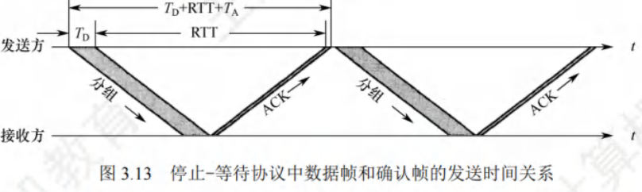

### 连续ARQ协议的信道利用率
连续ARQ协议运用流水线传输方式（见[图3.14]），这使得发送方能够连续发送多个分组。如此一来，只要发送窗口足够大，就能保证信道上始终有数据在传输，进而显著提高信道利用率。

假设连续ARQ协议的发送窗口大小为$n$，意味着发送方能够连续发送$n$个分组，具体存在以下两种情况：
1. **情况一：$nT_D < T_D + RTT + T_A$**
即在一个发送周期内可以发送完$n$个分组。此时，信道利用率的计算方式为：
\[
\frac{nT_D}{T_D + RTT + T_A}
\]
这里的分子$nT_D$表示在一个发送周期内实际用于发送数据分组的总时间，分母$T_D + RTT + T_A$代表整个发送周期的时长。
2. **情况二：$nT_D = T_D + RTT + T_A$**
即在一个发送周期内发不完（或刚好发完）$n$个分组。在这种情况下，只要不出现差错，发送方就能够不间断地发送分组，此时信道利用率为$1$，也就是$100\%$。这是因为在该条件下，发送方始终处于忙碌状态，信道被充分利用。

此外，还存在两个重要的公式用于计算信道相关参数：
 - “信道平均（实际）数据传输速率 = 信道利用率×信道带宽（最大数据传输速率）”。这个公式表明，实际的数据传输速率与信道利用率以及信道本身的最大传输能力相关。信道利用率越高，在给定带宽下实际能够传输的数据速率就越高。
 - “信道平均（实际）数据传输速率 = 发送周期内发送的数据量 / 发送周期”。此公式从另一个角度，通过发送的数据量和发送周期来计算平均数据传输速率，与前一个公式本质上是一致的，只是计算的出发点不同。它更直观地反映了在一个完整的发送周期内，平均每秒能够传输的数据量。 

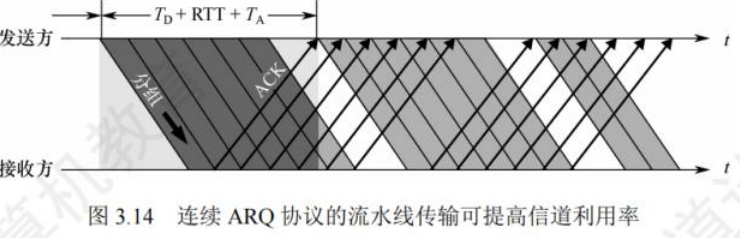

## 介质访问控制
介质访问控制的核心任务，是让使用介质的每个结点能够隔离同一信道上其他结点传送的信号，从而协调各活动结点的传输。如[图3.15]展示的广播信道通信方式，结点A、B、C、D、E共同使用该广播信道。假设A要与C通信，B要与D通信，由于信道共享，如果缺乏控制，这两对结点间的通信可能因相互干扰而无法成功。

决定广播信道中信道分配的协议，属于数据链路层的一个子层，即介质访问控制（Medium Access Control，MAC）子层。

常见的介质访问控制方法主要分为以下几类：
 - **信道划分介质访问控制**：这是一种静态划分信道的方法，预先将信道划分给不同的结点或用户，各结点在自己被分配的信道上进行通信，彼此之间不会产生干扰。
 - **随机访问介质访问控制**：该方法属于动态分配信道方式，各结点随机地尝试访问信道，可能会出现冲突，但通过特定的机制来解决冲突，使各结点最终能成功传输数据。
 - **轮询访问介质访问控制**：同样是动态分配信道的方法，通过轮询的方式，依次询问各个结点是否有数据要发送，从而决定信道的分配。 

### 信道划分介质访问控制

信道划分介质访问控制旨在将使用同一传输介质的多个设备的通信隔离开，通过合理分配时域和频域资源，实现各设备间互不干扰的通信。它借助复用技术达成这一目标。复用，即在发送端将多个发送方的信号整合到一条物理信道上传输，在接收端把接收到的复用信号分离出来，再分别传送给对应的接收方，如[图3.16]所示。当传输介质的带宽超出传输单个信号所需带宽时，在一条介质上传输多个信号，可有效提升传输系统的利用率。

信道划分的本质，是运用分时、分频、分码等手段，把原本的一个广播信道，从逻辑上划分成几个用于两个结点间通信且互不干扰的子信道，也就是将广播信道转变为若干个点对点信道。信道划分介质访问控制主要分为以下4种类型： （这里原文本未提及4种类型具体内容，可等待后续补充） 

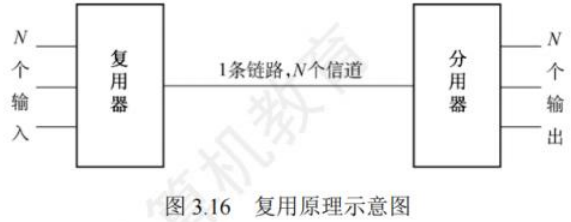

#### 频分复用(FDM)
频分复用（Frequency Division Multiplexing，FDM）的原理是把信道的总频带划分成多个子频带，每个子频带都当作一个独立的子信道，每对用户通过其中一个子信道进行通信，具体情形如图3.17所示。在这种复用方式下，所有用户在同一时间内占用不同的频带资源。每个子信道所分配到的频带大小可以不一样，但这些子信道频带的总和不能超出信道的总频带。

在实际应用过程中，为避免子信道之间相互干扰，在相邻信道之间还需设置“隔离频带”。

频分复用具有诸多优点，它能够充分挖掘传输介质的带宽潜力，显著提升系统效率。而且从技术实现角度来讲，相对比较容易达成。 这种复用方式在许多通信场景中都有广泛应用，例如在早期的电话通信系统中，就利用频分复用技术将不同电话线路的信号在同一传输介质上进行传输，从而实现多路通话同时进行。 

#### 时分复用

时分复用（Time Division Multiplexing，TDM）是把信道的传输时间划分成一个个等长的时间片，这些时间片组成的整体称为TDM帧。每个用户在每个TDM帧中占据固定序号的时隙，并且每个用户所占用的时隙会周期性出现，这个周期就是TDM帧的长度。所有用户在不同时间占用相同的信道资源，具体情况如图3.18所示。需要注意的是，TDM帧本质上是一段固定时长的时间，和数据链路层的帧概念不同。

从某个特定时刻观察，时分复用信道上传输的只是某一对用户之间的信号；但从一段较长时间来看，传输的是按照时间分割的复用信号。由于时分复用是按照固定顺序给用户分配时隙，若某个用户在某段时间内没有数据需要传输，其他用户也不能利用这段暂时空闲的线路资源，这就导致时分复用后的信道利用率较低。

统计时分复用（Statistic TDM，STDM），也叫异步时分复用，是对TDM的改进。STDM帧与TDM帧不同之处在于，它不是固定分配时隙，而是根据需求动态分配时隙。只有当用户有数据要传输时，才会在STDM帧中被分配到时隙，这样可以提高线路的利用率。例如，假设线路的数据传输速率为6000b/s，3个用户的平均速率都为2000b/s。在TDM方式下，每个用户的最高速率只能达到2000b/s；而在STDM方式下，每个用户的最高速率可达6000b/s。这是因为在STDM中，当某个用户暂时无数据传输时，其原本可能占用的时隙可以被其他有数据传输需求的用户使用，从而更灵活地利用了信道资源。 

#### 波分复用

波分复用（Wavelength Division Multiplexing, WDM）本质就是光领域的频分复用。在光纤通信中，它利用一根光纤同时传输多种不同波长（对应不同频率）的光信号 。由于不同波长的光信号在传输过程中相互之间不会产生干扰，在接收端，通过光分用器能够将各个不同波长的光信号准确地分解开来，进而实现不同信号的分别处理与接收。

光波所处的频谱位置在高频段，拥有极为丰富的带宽资源。这一特性使得在一根光纤上实现多路光信号的复用成为可能，极大地提升了光纤的传输能力与效率。例如在现代通信网络的骨干传输链路中，常常运用波分复用技术，在一根光纤上同时承载几十路甚至上百路不同波长的光信号，每一路信号都可以独立传输数据、语音或视频等信息，有效满足了日益增长的海量数据传输需求。 

#### 码分复用（CDM）

码分复用（Code Division Multiplexing, CDM）是一种借助不同编码来区分各路原始信号的复用技术 。与频分复用（FDM）和时分复用（TDM）有所不同，它在信道使用上既共享频率资源，又共享时间资源。在实际应用中，更为常见的术语是码分多址（Code Division Multiple Access, CDMA）。

其原理是将每个比特时间进一步细分为$m$个短的时间槽，这些时间槽被称为码片（Chip）。一般情况下，$m$的值通常设定为64或者128 。为简化阐述，以下示例中假定$m = 8$ 。每个站点都会被分配一个独一无二的$m$位码片序列。当站点发送比特“1”时，便发送该码片序列；而发送比特“0”时，则发送此码片序列的反码。当两个或更多站点同时进行发送操作时，各路数据会在信道中进行线性相加。为了能够从混合的信道信号中准确分离出各路信号，这就要求各个站点的码片序列必须相互正交。

可以简单理解为，若A站向C站发送信号，用一个向量来表示；B站向C站发送信号，则用另一个向量表示，且这两个向量需满足相互正交的关系。向量中的各个分量，就是所谓的码片。

下面通过具体例子说明CDMA的原理：
设向量$S$代表A站的码片向量，向量$T$代表B站的码片向量。假设A站的码片序列被指定为$00011011$，为便于计算，将码片中的“0”记为$-1$，“1”记为$ + 1$，那么A站的码片序列可表示为$( - 1 - 1 - 1 + 1 + 1 - 1 + 1 + 1)$ 。不同站的码片序列相互正交，即向量$S$和$T$的规格化内积为$0$ ，可表示为$S \cdot T = 0$ 。同时，任何站的码片向量与该码片向量自身的规格化内积都为$1$ ，即$S \cdot S = \sum_{i = 1}^{m}(\pm1)^2 \div m = 1$（这里$m = 8$ ）；任何站的码片向量与该码片反码的向量的规格化内积都为$-1$ 。假设向量$T$为$( - 1 - 1 + 1 - 1 + 1 + 1 + 1 - 1)$ 。
当A站向C站发送数据“1”时，发送的向量即为$( - 1 - 1 - 1 + 1 + 1 - 1 + 1 + 1)$ ；当B站向C站发送数据“0”时，发送向量为$( + 1 + 1 - 1 + 1 - 1 - 1 - 1 + 1)$ 。这两个向量在公共信道上叠加（即线性相加），得到$S + T = (0, 0, - 2, 2, 0, - 2, 0, 2)$ 。
信号到达C站后进行数据分离。若要获取来自A站的数据，C站需知晓A站的码片序列$S$，并让$S$与$S + T$进行规格化内积。依据叠加原理，其他站点的信号在内积结果中会被过滤掉，只剩下A站发送的信号。经计算$S \cdot (S + T) = 1$ ，由此可知A站发出的数据是“1” 。同理，若要获取来自B站的数据，计算$T \cdot (S + T) = - 1$ ，这表明从B站发送过来的信号向量是反码向量，代表“0” 。这里的规格化内积是线性代数中的运算，即先得到两个向量的内积，再除以向量的分量个数。

为更直观地理解频分复用、时分复用和码分复用，可参考以下例子：
假设A站要向C站运输黄豆，B站要向C站运输绿豆，A站和B站与C站之间有一条公共道路，此道路可类比为广播信道。在频分复用方式下，公共道路被划分为两个车道，分别供A站到C站的车和B站到C站的车行驶，两类车能够同时通行，但各自仅获得公共车道的一半，所以频分复用（波分复用同理）是共享时间而不共享空间。在时分复用方式下，先让A站到C站的车行驶一趟，然后B站到C站的车再行驶一趟，两类车交替使用公共车道，即时分复用共享空间，但不共享时间。而码分复用与前两种信道划分方式差异显著，在这种方式下，黄豆与绿豆放在同一辆车上运输，抵达C站后，由C站负责将车上的黄豆和绿豆分开，所以码分复用既共享空间，又共享时间。

码分复用技术具备诸多优势，例如频谱利用率高、抗干扰能力强、保密性良好、语音质量佳等，并且还能够减少投资以及降低运行成本。正因如此，它主要应用于无线通信系统，特别是移动通信系统。 

### 随机访问介质访问控制
在随机访问协议体系里，并不依靠集中控制的方式来确定信息发送的先后顺序。所有用户都能依据自身意愿，随机地向信道发送信息，并且每个用户都可占用信道的全部传输速率。

以总线形网络为例，一旦有两个或更多用户同时进行信息发送操作，就会引发帧冲突（也叫碰撞）。这种冲突会致使所有参与冲突的用户发送操作失败。为有效应对随机访问过程中产生的冲突问题，每个用户都需遵循特定规则，反复重传自身的帧，直至该帧能够毫无冲突地通过信道。这些规则构成了随机访问介质访问控制协议。其核心要点在于：用户通过竞争的方式来获取信道的使用权，进而赢得信息的发送权。正因如此，随机访问介质访问控制协议也被称作争用型协议。

从对比角度来看，如果采用信道划分机制，各结点间的通信方式要么是共享空间（如码分复用），要么是共享时间（如时分复用），亦或是既共享空间又共享时间（如码分复用）。然而，当采用随机访问控制机制时，结点之间的通信在时间和空间上都不存在共享情况。所以，随机介质访问控制本质上是一种把广播信道转化为点到点信道的机制，通过这种转化，在一定程度上解决了多个用户同时发送信息时产生的冲突问题，确保每个用户都有机会成功传输信息。 

#### ALOHA协议

ALOHA协议包含纯ALOHA协议和时隙ALOHA协议这两种类型，以下为您详细介绍：
1. **纯ALOHA协议**
    - **基本思想**：在总线形网络里，任何站点只要有数据需要发送，无需进行任何检测，就可直接发送。若在一段时间内未收到确认信息，该站点便认定在传输过程中发生了冲突。之后，发送站点需等待一段时间，再重新发送数据，直至成功发送。
    - **工作原理示例**：参考[图3.19]，它展示了纯ALOHA协议的工作过程。每个站点都能自由发送数据帧，假设所有帧长度固定，这里用发送该帧所需的时间来表示帧长，图中以$T_0$表示这段时间。例如，当站1发送帧1时，由于其他站点此时都未发送数据，所以站1的发送操作必定成功。但随后站2发送的帧2和站$N - 1$发送的帧3在时间上出现了部分重叠，即发生了冲突。一旦发生冲突，相关站点都要进行重传。不过，不能立刻重传，因为马上重传必然会再次引发冲突。所以，各站点需等待一段随机时长，然后再尝试重传。若再次冲突，则继续等待随机时间，直到重传成功。如图中，帧4发送成功，而帧5和帧6又发生了冲突。由于纯ALOHA网络存在冲突频繁的问题，导致其吞吐量很低。为解决这一缺陷，时隙ALOHA协议应运而生。
2. **时隙ALOHA协议**
    - **改进机制**：时隙ALOHA协议对各站点的时间进行同步，将时间划分成一个个等长的时隙（Slot）。它规定站点只能在每个时隙开始的时候发送帧，并且发送一帧的时间必须小于或等于时隙的长度。这种方式避免了用户随意发送数据，有效降低了冲突产生的概率，从而提高了信道利用率。
    - **工作原理示例**：[图3.20]呈现了两个站的时隙ALOHA协议工作原理。每个帧到达后，通常要在缓存中等待一段小于时隙$T_0$的时间，才可以发送。当在一个时隙内有两个或更多帧到达时，在下一个时隙就会产生冲突。而冲突后重传的策略与纯ALOHA协议类似，即等待一段随机时间后再进行重传。 

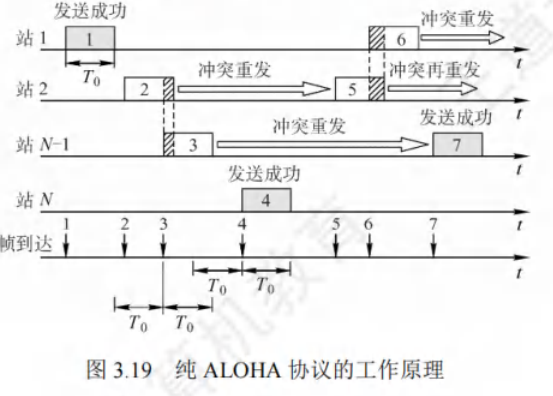

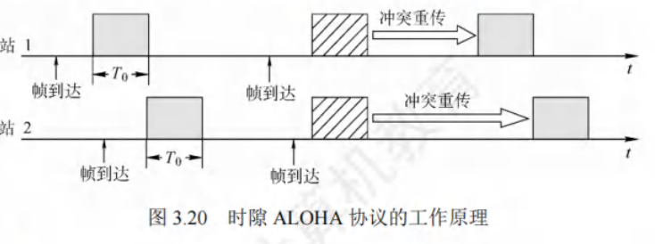

#### CSMA协议

ALOHA网络存在冲突概率较大的问题。如果每个站点在发送数据之前，先对公用信道进行监听，确认信道空闲后再发送，就能显著降低冲突发生的可能性，进而提升信道利用率。载波监听多路访问（Carrier Sense Multiple Access，CSMA）协议正是基于这一理念提出的。它是在ALOHA协议基础上改进而来的协议，与ALOHA协议的主要区别在于增设了一个载波监听装置。

依据监听方式以及监听到信道忙之后的处理方式差异，CSMA协议可细分为以下三种：
1. **1 - 坚持CSMA**
    - **基本思想**：当站点准备发送数据时，首先对信道进行监听。若信道处于空闲状态，便立即发送数据；若信道正忙，则持续监听，直至信道变为空闲。这里“坚持”的意思是，在监听到信道忙时，站点会继续坚守监听信道；“1”则表示当监听到信道空闲时，站点立即发送帧的概率为1。例如，在一个局域网环境中，站点A有数据要发送，它开始监听信道，若此时信道空闲，站点A会毫不犹豫地马上发送数据。
2. **非坚持CSMA**
    - **基本思想**：站点要发送数据时，同样先监听信道。若信道空闲，即刻发送数据；若信道忙，站点会放弃当前监听，等待一段随机时长后，再重新开始监听。比如，站点B要发送数据，监听发现信道忙，它不会一直监听，而是随机等待一段时间，比如5秒后，再去监听信道状态。这种方式虽然降低了多个站点在等待信道空闲后同时发送数据而引发冲突的概率，但由于随机等待的存在，增加了数据在网络中的平均时延。就像在交通拥堵的路口，车辆不一直等待，而是随机选择一个时间再尝试通行，虽然减少了同时抢行的冲突，但整体通行时间变长了。
3. **p - 坚持CSMA**
    - **基本思想**：该协议仅适用于时分信道。当站点有数据需发送时，先监听信道。若信道忙，就持续监听（等到下一个时隙再监听），直到信道空闲。若信道空闲，此时站点以概率$p$发送数据，以概率$1 - p$推迟到下一个时隙再继续监听，直至数据成功发送。例如，假设$p = 0.6$，站点C监听信道空闲后，有60%的概率会立即发送数据，40%的概率会推迟到下一个时隙再做决定。$p - 坚持CSMA$检测到信道空闲后，通过设置以概率$p$发送数据和以概率$1 - p$推迟监听，旨在降低$1 - 坚持CSMA$中多个站点检测到信道空闲时同时发送帧的冲突概率；同时采用“坚持”监听的方式，是为了克服非坚持CSMA中因随机等待导致延迟时间较长的缺点。所以，$p - 坚持CSMA$协议可看作是非坚持CSMA协议和$1 - 坚持CSMA$协议的一种折中方案。

这三种不同类型的CSMA协议各有特点，在不同的网络场景下适用程度有所不同，其详细比较如表3.1所示（此处虽未提及表3.1具体内容，但可推测表中会从冲突概率、平均时延等方面对三种协议进行对比）。 

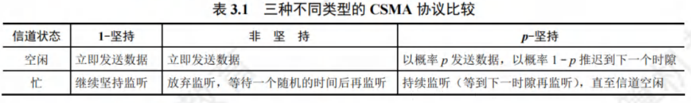

#### CSMA/CD协议
载波监听多路访问/冲突检测（CSMA/CD）协议是对CSMA协议的进一步优化，主要适用于总线形网络或者半双工网络环境。而在全双工网络中，由于采用两条独立信道，分别用于发送和接收，在任何时刻，通信双方都能同时进行发送或接收数据的操作，不会产生冲突，所以无需CSMA/CD协议。

1. **载波监听与冲突检测机制**
    - **载波监听**：每个站点在发送数据之前以及发送过程中，都要持续检测信道状态。发送前监听信道，目的是获取发送数据的权限；而在发送过程中监听信道，则是为了能及时察觉所发送的数据是否发生冲突。站点只有在检测到信道空闲时，才可以开始发送数据。
    - **冲突检测**：站点在发送数据的同时进行监听，一旦监听到冲突，会立刻停止数据发送，然后等待一段随机时长，之后重新尝试发送数据。
2. **工作流程**
CSMA/CD的工作流程可以简洁地归纳为“先听后发，边听边发，冲突停发，随机重发”。具体来说，站点在发送数据前先监听信道，若信道空闲则发送数据；在发送过程中持续监听，若检测到冲突，马上停止发送；停止发送后，等待一段随机时间，再次尝试发送。
3. **传播时延与半双工通信**
由于电磁波在总线上的传播速度是有限的，所以存在这样一种情况：当某个时刻发送站检测到信道空闲时，实际上信道可能并非真的空闲。例如在[图3.21]中，设$\tau$为单程传播时延。在$t = 0$时，A站开始发送数据。到$t = \tau - \delta$时，A站发送的数据还未抵达B站，此时B站检测到信道空闲，进而也开始发送数据。经过$\delta / 2$时间后，即$t = \tau - \delta / 2$时，A站和B站发送的数据发生冲突，但此时A站和B站都还未察觉到冲突。直到$t = \tau$时，B站检测到冲突，随即停止发送数据。当$t = 2\tau - \delta$时，A站才检测到冲突并停止发送。由此可见，在CSMA/CD协议下，站点无法同时进行发送和接收操作，这就导致采用CSMA/CD协议的以太网只能实现半双工通信。 

1. **争用期与最短帧长**
    - **争用期定义**：从图3.21可知，A站开始发送数据后，最多经过$2\tau$（端到端传播时延的2倍，当$\delta = 0$时）就能知晓是否发生冲突。因此，以太网将端到端往返时间$2\tau$称作争用期（也叫冲突窗口）。每个站在发送数据后的争用期内，存在发生冲突的可能性，只有经过争用期未检测到冲突，才能确定此次发送不会冲突。
    - **最短帧长的必要性**：假设某站发送短帧，在发送完前未检测出冲突，但在到达目的站之前与其他站的帧冲突，目的站会丢弃该差错帧，而发送站不知冲突，不会重传。为避免这种情况，以太网规定了最短帧长（争用期内可发送的数据长度）。若争用期内检测到冲突，站停止发送，此时已发送数据小于最短帧长，所以长度小于最短帧长的帧是因冲突异常中止的无效帧。
    - **最短帧长计算**：最短帧长 = 总线传播时延×数据传输速率×2。例如，以太网争用期长度为$51.2\ \mu s$，对于$10\ Mb/s$的以太网，争用期内可发送$512\ bit$，即$64\ B$。以太网发送数据时，若前$64\ B$未冲突，后续也不会冲突（表示成功抢占信道）；若冲突，一定在前$64\ B$。所以以太网规定最短帧长为$64\ B$，小于此长度的帧为无效帧，应立即丢弃。若要发送小于$64\ B$的帧，如$40\ B$的帧，需在MAC子层数据字段后加填充字段，保证MAC帧长度不小于$64\ B$。
2. **截断二进制指数退避算法**
    - **算法目的**：发生冲突后，参与冲突的站点立即再次发送无意义，会导致无休止冲突。CSMA/CD采用截断二进制指数退避算法确定重传时机，让冲突站点停止发送后，推迟随机时间再重发。
    - **算法精髓**：
        - **确定基本退避时间**：一般取$2$倍的总线端到端传播时延$2\tau$（即争用期）。
        - **随机选取重传推迟时间**：从离散整数集合$[0, 1,....(2^k - 1)]$中随机取数$r$，重传推迟时间为$r$倍争用期，即$2r\tau$。参数$k = min[重传次数, 10]$，重传次数不超$10$时，$k$等于重传次数；超$10$时，$k$恒为$10$。
        - **重传次数限制**：当重传达$16$次仍不成功，认为网络拥挤，该帧无法正确发出，抛弃该帧并向高层报告出错。
    - **示例**：适配器首次传帧检测到冲突，第1次重传时，$k = 1$，$r$从$\{0, 1\}$选，重传推迟时间为$0$或$2\tau$；若再次冲突，第2次重传，$r$从$\{0, 1, 2, 3\}$选，重传推迟时间在$0, 2\tau, 4\tau, 6\tau$中随机选一个。此算法使重传推迟平均时间随重传次数增大而增大（动态退避），降低冲突概率，利于系统稳定。
3. **CSMA/CD算法归纳**
    - **准备发送**：适配器从网络层获取分组，封装成帧放入缓存。
    - **检测信道**：信道空闲则开始发送帧；信道忙则持续检测直至空闲。
    - **发送过程检测**：
        - **发送成功**：争用期内未检测到冲突，帧发送成功。
        - **发送失败**：争用期内检测到冲突，立即停止发送，执行指数退避算法，等待随机时间后返回检测信道步骤。若重传$16$次仍不成功，停止重传并向上报错。
4. **CSMA/CD在无线局域网的局限性与改进**
    - **局限性**：CSMA/CD协议成功用于有线连接局域网，但在无线局域网不能简单套用，特别是冲突检测部分。原因如下：
        - **信号强度问题**：无线局域网中接收信号强度远小于发送信号强度，且信号强度动态变化范围大，实现冲突检测硬件花费过大。
        - **隐蔽站问题**：无线通信中存在“隐蔽站”问题，并非所有站点都能听见对方。
    - **改进措施**：802.11标准定义了适用于无线局域网的CSMA/CA协议，将冲突检测改为冲突避免（CA）。“冲突避免”并非完全避免冲突，而是降低冲突发生概率。因为802.11无线局域网不使用冲突检测，一旦站点开始发送帧就会完全发送，冲突时发送长数据帧会严重降低网络效率，所以采用冲突避免技术。 

由于无线信道在通信质量方面相较于有线信道存在较大差距，802.11标准采用了链路层确认/重传（ARQ）方案。这意味着站点通过无线局域网每发送完一帧，必须等待接收方的确认帧，只有收到确认帧后，才能继续发送下一帧。由此可见，802.11标准无线局域网所采用的停止 - 等待协议属于可靠传输协议。

为了最大程度地避免冲突，802.11标准做出规定：所有站在完成一次发送后，必须等待一段较短的时间（同时持续监听），才能发送下一帧。这段时间被称为帧间间隔（InterFrame Space，IFS）。IFS的长短取决于该站即将发送的帧的类型，802.11标准使用了以下三种IFS：
1. **SIFS（短IFS）**：这是最短的IFS，主要用于分隔属于一次对话的各帧。使用SIFS的帧类型包含ACK帧、CTS帧、分片后的数据帧，以及所有回答AP探询的帧等。
2. **PIFS（点协调IFS）**：其长度处于中等水平，应用于PCF操作中。
3. **DIFS（分布式协调IFS）**：是最长的IFS，用于异步帧竞争访问时的时延控制。

802.11标准还引入了虚拟载波监听机制。该机制下，源站会将自身占用信道的持续时间（涵盖目的站发回ACK帧所需时间）及时告知所有其他站。这样一来，其他站在这段时间内都会停止发送，从而极大地减少了冲突发生的可能性。“虚拟载波监听”的含义是，其他站并非通过实际监听信道来决定是否发送，而是因为收到了源站的通知才选择不发送数据，这就如同所有站都对信道进行了监听一样。

当信道由忙转闲时，任何一个站若要发送数据帧，不仅要等待一个DIFS的间隔，还需进入争用窗口，计算随机退避时间，以便再次尝试访问信道，如此便降低了冲突发生的概率。只有在同时满足检测到信道空闲且该数据帧是要发送的第一个数据帧的情况下，才无需使用退避算法，而在其他所有情况下都必须使用退避算法，具体情形如下：
1. 在发送第一个帧之前检测到信道忙；
2. 每次重传；
3. 每次成功发送后要发送下一帧。

CSMA/CA的退避算法与CSMA/CD的退避算法略有不同（详细内容可参考相关教材）。CSMA/CA算法可归纳如下：
1. 若站点最初有数据要发送（并非因发送不成功而进行重传），并且检测到信道空闲，那么在等待DIFS时间后，便发送整个数据帧。
2. 若不满足上述条件，站点则执行CSMA/CA退避算法，选取一个随机退避值。一旦检测到信道忙，退避计时器就保持不变；只要信道空闲，退避计时器就开始倒计时。
3. 当退避计时器减至0时（此时信道必然是空闲的），站点就发送整个帧并等待确认。
4. 发送站若收到确认，表明已发送的帧被目的站正确接收。若要发送第二帧，需从步骤2开始，执行CSMA/CA退避算法，随机选定一段退避时间。若发送站在规定时间（由重传计时器控制）内未收到确认帧ACK，就必须重传该帧，再次运用CSMA/CA协议争用该信道，直至收到确认，或者经过若干次重传失败后放弃发送。

### 处理隐蔽站问题：RTS和CTS
在[图3.22]所示场景中，站A和站B都处于AP的覆盖范围之内，但由于二者相距较远，彼此无法听到对方的信号。当站A和站B检测到信道空闲时，都会向AP发送数据，进而导致冲突发生，这就是所谓的隐蔽站问题。

为避免此类问题，802.11标准允许发送站对信道进行预约，具体流程如图3.23所示：
源站在准备发送数据帧之前，先监听信道。若信道空闲，等待DIFS时间后，广播一个请求发送RTS（Request To Send）控制帧，该帧包含源地址、目的地址以及此次通信所需的持续时间。若AP正确接收到RTS帧，并且此时信道空闲，那么在等待SIFS时间后，AP会向源站发送一个允许发送CTS（Clear To Send）控制帧，此帧同样包含这次通信所需的持续时间。源站收到CTS帧后，再等待SIFS时间，就可以发送数据帧。若AP正确收到源站发来的数据，等待SIFS时间后会向源站发送确认帧ACK。AP覆盖范围内的其他站听到CTS帧后，会在CTS帧指明的时间内抑制发送。CTS帧具有两个作用：
1. 给予源站明确的发送许可；
2. 指示其他站在预约期内不要发送。

需要注意的是，源站在RTS帧中填写的所需占用信道的持续时间，是从RTS帧发送完毕后，到目的站最后发送完ACK帧为止的时间，即“SIFS + CTS + SIFS + 数据帧 + SIFS + ACK”。而AP在CTS帧中填写的所需占用信道的持续时间，是从CTS帧发送完毕，到目的站最后发送完ACK帧为止的时间，即“SIFS + 数据帧 + SIFS + ACK”。 

1. **RTS和CTS帧的权衡**
    - 使用RTS（请求发送）帧和CTS（允许发送）帧虽然会在一定程度上降低网络的通信效率，然而这两种帧的长度较短，相较于数据帧而言，所带来的开销并不大。反之，如果不采用这两种控制帧，一旦出现冲突致使数据帧需要重传，那么所浪费的时间将会更多。对于信道预约，它并非是强制性的要求，各个站点能够自行抉择是否使用。通常只有当数据帧的长度超过某个特定数值时，使用RTS帧和CTS帧才更具效益。
2. **CSMA/CD与CSMA/CA的区别**
    - **冲突处理能力**：
        - CSMA/CD具备检测冲突的能力，但无法从根本上避免冲突的发生。它是在冲突发生后及时察觉并采取相应措施。
        - CSMA/CA在发送数据的过程中不能检测信道上是否存在冲突，即便在本结点处没有检测到冲突，也不能保证在接收结点处不会发生冲突，该协议主要侧重于尽量降低冲突发生的概率。
    - **适用传输介质**：
        - CSMA/CD适用于总线形以太网，这种网络通过共享总线进行数据传输。
        - CSMA/CA则应用于无线局域网，如802.11a/b/g/n等标准所涵盖的无线网络环境。
    - **检测方式**：
        - CSMA/CD依靠电缆中的电压变化来检测冲突情况。当总线上出现多个信号叠加导致电压异常时，便可判断发生了冲突。
        - CSMA/CA采用三种检测信道空闲的方式，分别为能量检测、载波检测以及能量载波混合检测。通过这些方式来判断信道是否可用于数据发送，以减少冲突的可能性。
3. **总结**
    - CSMA/CA的工作方式是在发送数据帧之前，通过广播的形式通知其他站点，使得其他站点在特定的一段时间内不发送数据帧，以此来避免冲突的出现。
    - CSMA/CD则是在发送数据帧之前先对信道进行监听，并且在发送数据的同时持续监听信道。一旦检测到冲突，会立刻停止数据发送操作。 

这两种协议在不同的网络环境中发挥着各自的优势，CSMA/CD适用于有线的共享介质网络，而CSMA/CA则更契合无线局域网的特点，有效地应对了无线环境中的信号干扰和冲突问题。 

### 轮询访问：令牌传递协议
轮询访问这种方式下，用户不能随意随机地发送信息，而是借助一个集中控制的监控站，以循环的形式逐个询问每个结点，进而决定信道的分配。令牌传递协议是典型的轮询访问控制协议。

在令牌传递协议里，有一个特殊的控制帧——令牌（Token），它沿着环形总线在各个站点之间依次传递。令牌本身不携带实际的信息内容，其主要作用是控制信道的使用，确保在同一时刻，只有一个站点能够独占信道进行数据传输。当环上某个站点希望发送数据帧时，必须等待获取令牌。只有成功取得令牌，站点才可以发送数据帧，由于令牌只有一个，所以令牌环网络不会出现冲突。站点完成一帧数据的发送后，需要释放令牌，方便其他站点使用。因为令牌是按照固定顺序在环上依次传递，所以对于所有接入网络的计算机来说，获取访问权的机会是公平的。

令牌环网络中令牌和数据的传递具体过程如下：
1. **网络空闲状态**：当整个网络处于空闲状态时，环路中只有令牌帧在持续循环传递。
2. **站点获取令牌并发送数据**：当令牌传递到有数据需要发送的站点时，该站点会修改令牌中的一个标志位，并且在令牌中添加自己要传输的数据，将令牌转变为一个数据帧，随后把这个数据帧发送出去。
3. **数据帧转发与接收**：数据帧沿着环路进行传输，每个接收到数据帧的站点一边对数据帧进行转发，一边检查帧的目的地址。如果目的地址与自身地址一致，接收站就会复制该数据帧，以便后续进一步处理。
4. **源站点处理**：数据帧继续沿着环路传输，直至回到该帧的源站点。源站点收到自己发出的帧后便不再转发。同时，源站点会通过检验返回的帧，查看在数据传输过程中是否出现错误，如果发现错误则会进行重传。
5. **释放令牌**：源站点完成数据传送后，会重新生成一个令牌，并将其传递给下一个站点，从而交出信道的控制权。

令牌传递协议在负载很高的广播信道中表现出色，也就是在多个结点同时发送数据概率较大的信道环境下。如果在这样的信道中采用随机介质访问控制方式，发生冲突的概率会非常高，而令牌传递协议则能够很好地满足各个站点之间的通信需求。令牌传递协议在时间和空间上都不进行共享，它实际上是在随机访问介质访问控制的基础上，限制了同一时刻只有一个有权发送数据的结点。

即使是广播信道，通过合适的介质访问控制机制，也能够使其在逻辑上转变为点对点信道，这也说明了数据链路层主要研究的是“点到点”之间的通信。 

## 局域网

### 基本概念与体系结构

局域网（Local Area Network，LAN）是在相对较小的地理区域（比如一所学校）内，利用双绞线、同轴电缆等连接介质，将各类计算机、外部设备以及数据库系统等相互连接，构建起一个实现资源与信息共享的计算机互联网络。其具有以下主要特点：
1. **所有权与规模限制**：局域网归一个单位所有，地理范围和包含的站点数目都有一定限度。这意味着它的覆盖范围相对集中，管理和维护相对集中在该单位内部。
2. **高带宽共享**：所有站点能够共享较高的总带宽，即具备较高的数据传输速率。这使得局域网内的数据传输速度较快，能够满足多个站点同时进行数据传输的需求。
3. **低时延与低误码率**：具有较低的时延和误码率。数据在局域网内传输时，延迟较小，能够快速到达目的地；同时，由于局域网环境相对稳定，数据传输过程中出现错误的概率较低，保证了数据的准确性。
4. **站点平等关系**：各站点之间是平等的关系，并非主从关系。这意味着每个站点在网络中的地位相同，都有平等的机会访问网络资源和进行数据传输。
5. **广播和多播能力**：局域网能够进行广播和多播。广播可以将消息发送给网络中的所有站点，多播则可以将消息发送给特定的一组站点，这种特性方便了网络内的信息传播和资源共享。

局域网的特性主要由三个关键要素决定：拓扑结构、传输介质以及介质访问控制方式。其中，介质访问控制方式最为重要，它在很大程度上决定了局域网的技术特性。
1. **常见拓扑结构**：
    - **星形结构**：所有站点都连接到一个中心节点，如集线器或交换机。这种结构便于集中管理和维护，某个站点出现故障不会影响其他站点，但中心节点一旦出现问题，整个网络可能瘫痪。
    - **环形结构**：各个站点通过通信链路连接成一个闭合的环，数据在环中沿着一个方向逐站传输。这种结构的优点是传输延迟固定，但某个站点的故障可能导致整个网络通信中断。
    - **总线形结构**：所有站点都连接到一条总线上，任何一个站点发送的信号都能被其他站点接收。它的优点是结构简单、成本低，但容易产生冲突，总线出现故障会影响整个网络。
    - **复合型结构**：是星形和总线形结合的结构，兼具两者的部分特点，能够在一定程度上弥补单一结构的不足。
2. **传输介质**：局域网可使用多种传输介质，如铜缆、双绞线和光纤等，其中双绞线是目前的主流传输介质。双绞线价格相对较低，安装方便，适用于大多数局域网环境。
3. **介质访问控制方法**：
    - **CSMA/CD协议**：主要应用于总线形局域网，通过载波监听和冲突检测来避免和处理冲突，确保数据的有序传输。
    - **令牌总线协议**：同样常用于总线形局域网，它在总线上建立一个逻辑环，站点只有获取令牌才能发送数据，以此避免冲突。
    - **令牌环协议**：主要用于环形局域网，令牌在环中传递，持有令牌的站点可以发送数据，保证了环网中数据传输的有序性。

有三种特殊的局域网拓扑实现：
1. **以太网**：目前应用最为广泛，其逻辑拓扑为总线形结构，物理拓扑是星形结构。在逻辑上，所有站点共享总线，如同连接在一条总线上；而在物理连接上，各个站点通过双绞线连接到中心的交换机或集线器，呈现出星形的布局。
2. **令牌环（Token Ring，IEEE802.5）**：逻辑拓扑是环形结构，物理拓扑为星形结构。在逻辑上，站点形成一个环，令牌在环中传递；物理上，各站点通过线缆连接到中心设备，类似于星形结构。
3. **FDDI（光纤分布数字接口，IEEE802.8）**：逻辑拓扑是环形结构，物理拓扑为双环结构。采用光纤作为传输介质，通过两个反向旋转的环来提高网络的可靠性和容错能力，其中一个环作为主环用于数据传输，另一个环作为备用环，当主环出现故障时，备用环可以接替工作。

IEEE 802标准定义的局域网参考模型只对应于OSI参考模型的数据链路层和物理层，并将数据链路层进一步拆分为两个子层：逻辑链路控制（LLC）子层和介质访问控制（MAC）子层。
1. **MAC子层**：负责与接入传输介质相关的工作，向上层屏蔽了对物理层访问的各种差异。其主要功能包括组帧和拆卸帧，即将来自上层的数据封装成帧以便在物理层传输，并在接收时将帧拆解还原为数据；进行比特传输差错检测，确保数据在传输过程中的准确性；实现透明传输，保证数据在传输过程中不被误解或修改。
2. **LLC子层**：与传输介质无关，它向网络层提供四种不同的连接服务类型，分别为无确认无连接、面向连接、带确认无连接以及高速传送。这些服务类型为网络层提供了多样化的选择，以满足不同应用场景对数据传输的需求。

由于以太网在局域网市场占据垄断地位，几乎成为局域网的代名词。而802委员会制定的LLC子层作用逐渐减小，如今许多网卡仅安装MAC协议而不再安装LLC协议。

### 以太网与IEEE802.3
1. **发展历程**
    - 以太网规约的首个版本是由DEC、Intel和Xerox联合提出的DIX V1 。随后，该版本被修订为第二版规约DIX Ethernet V2，这一版本成为世界上首个局域网产品的规约。在此基础之上，IEEE802委员会的IEEE 802.3工作组制定出第一个IEEE的以太网标准——IEEE802.3。
2. **技术特点**
    - **拓扑与访问控制**：以太网在逻辑层面采用总线形拓扑结构，这意味着所有计算机共同连接在同一条总线上，信息以广播的形式进行发送。为了实现对总线的有效访问控制，以太网采用CSMA/CD（载波监听多路访问/冲突检测）方式。在这种方式下，各站点在发送数据前先监听总线，若总线空闲则发送数据，同时在发送过程中持续监听，一旦检测到冲突便立即停止发送，等待随机时间后重发。
    - **标准差异与通用称呼**：严格来讲，只有符合DIX Ethernet V2标准的局域网才能被称为以太网。然而，DIX Ethernet V2标准与IEEE 802.3标准之间的差异极小，所以在日常使用中，人们通常将802.3局域网简称为以太网。
3. **通信简化措施**
    - **无连接工作方式**：以太网采用无连接的工作模式，在数据发送过程中，既不会对发送的数据帧进行编号，也不要求接收方发送确认信息。这表明以太网仅尽最大努力交付数据，提供的是不可靠服务。如果数据在传输过程中出现差错，对差错的纠正工作将由高层协议来完成。例如，在传输文件时，若某个数据帧丢失或出错，以太网不会主动处理，而是由上层的应用层协议（如TCP）来负责重传等纠错操作。
    - **曼彻斯特编码**：以太网发送的数据均采用曼彻斯特编码的信号。在曼彻斯特编码中，每个码元的中间都会出现一次电压转换，接收方可以利用这种电压转换轻松地提取位同步信号。这种编码方式不仅能够在传输数据的同时传递时钟信号，保证收发双方的同步，而且具有自同步能力，提高了数据传输的可靠性。例如，接收方可以根据码元中间的电压跳变来准确判断每个码元的起始和结束位置，从而正确接收数据。 

#### 以太网的传输介质与网卡

1. **以太网传输介质**
    - 以太网在实际应用中，常用的传输介质共有4种，分别是粗缆、细缆、双绞线和光纤。这些传输介质在性能、成本、适用场景等方面各有特点，以满足不同环境下的以太网组网需求。
    - 在以太网相关标准命名中，“10”代表标准的传输速率为10Mb/s ，“Base”意味着这是基带以太网。早期标准里，“Base”之后紧跟的数字，如“5”或“2”，分别表示单段传输介质的最大传输距离不超过500m或185m 。而“Base”之后的“T”代表双绞线，“F”则代表光纤。例如，10Base - T 表示传输速率为10Mb/s的基带以太网，使用双绞线作为传输介质。这种命名方式简洁明了，方便用户根据标准名称快速了解以太网的基本特性和所使用的传输介质。
2. **网卡（网络适配器）**
    - **连接作用**：计算机要实现与外界局域网的连接，依靠的是主板上嵌入的一块网络适配器（Adapter），也常被称作网络接口卡（Network Interface Card，NIC）。它如同计算机与局域网之间的桥梁，承担着数据传输和交互的关键任务。
    - **工作层次与结构**：网络适配器工作在数据链路层，其上装有处理器和存储器。这使得它具备一定的数据处理和存储能力，能够在数据链路层对数据进行有效的处理和管理。
    - **通信方式转换**：适配器与局域网之间通过电缆或双绞线以串行方式进行通信，而与计算机则通过计算机的I/O总线以并行方式通信。由于计算机内部的数据处理和传输多采用并行方式，而局域网传输介质通常以串行方式传输数据，所以适配器的一项重要功能就是进行数据的串并转换，确保数据在不同通信方式之间能够准确、高效地传输。
    - **其他功能**：适配器除了实现物理连接和电信号匹配外，还具备一系列与数据链路层相关的重要功能。它负责帧的发送与接收，确保数据以帧的形式在局域网中正确传输；进行帧的封装与拆封，将来自上层的协议数据单元封装成适合在局域网传输的帧格式，接收时再将其拆解还原；执行介质访问控制，遵循以太网的CSMA/CD等访问控制协议，协调计算机对传输介质的访问；完成数据的编码与解码，将数字信号转换为适合在传输介质上传输的信号形式，并在接收端还原；同时，还设有数据缓存功能，以应对数据传输速率的差异，避免数据丢失。
    - **数据交互流程**：当适配器收到正确的帧时，会利用中断机制通知计算机，并将数据交付给协议栈中的网络层进行进一步处理。反之，当计算机要发送IP数据报时，协议栈会把IP数据报向下传递给适配器。适配器将其组帧后，再发送到局域网中，从而实现计算机与局域网之间的数据交互。 

#### 以太网的MAC地址
1. **MAC地址的定义与特性**
    - IEEE802标准为局域网制定了一种48位的全球地址，它被固化在局域网内每台计算机适配器的ROM中，被称作物理地址或MAC地址（因其应用于MAC帧）。这个地址主要用于掌控主机在网络中的数据通信。其具有全球唯一性，即全世界所有的局域网适配器都拥有不同的MAC地址。而且，只要计算机的适配器不更换，无论该计算机在地理位置上如何变动，其MAC地址始终保持不变。这种特性使得MAC地址成为网络设备在物理层面的独特标识，在网络通信中起到关键作用。
2. **MAC地址的格式与组成**
    - MAC地址长度为6字节，通常以由连字符（或冒号）分隔的12个十六进制数来表示，例如：02 - 60 - 8c - e4 - b1 - 21。它的高24位是厂商代码，这部分由IEEE统一分配给各个网络设备制造商，用于标识生产厂商。低24位则由厂商自行分配给其生产的适配器，作为序列号，用于在厂商内部唯一标识每个适配器。通过这种方式，保证了全球范围内每个适配器的MAC地址的唯一性。
3. **MAC地址在路由器中的应用**
    - 当路由器通过适配器连接到局域网时，适配器上的MAC地址就用于标识路由器的特定接口。如果路由器同时连接到两个不同的网络，那么它需要配备两个适配器，每个适配器都有各自独立的MAC地址，以此来区分不同网络接口的通信。这使得路由器能够准确地处理来自不同网络的数据包，并将其转发到正确的目标网络。
4. **适配器对MAC帧的处理依据**
    - 适配器在从网络接收到MAC帧时，首先会利用硬件检查MAC帧中的目的地址。只有当该帧是“发往本站的帧”时，适配器才会收下，否则将丢弃该帧。这里“发往本站的帧”涵盖以下三种类型：
        - **单播帧（一对一）**：即接收到的帧的目的地址与本站的MAC地址完全相同。这种情况下，该帧明确是发送给当前站点的，适配器会接收并进一步处理。
        - **广播帧（一对全体）**：此类帧是发送给本局域网上所有站点的，其目的地址为全1地址。在局域网中，所有站点都会接收并处理广播帧，常用于一些需要通知所有站点的场景，如网络配置信息的广播等。
        - **多播帧（一对多）**：这是发送给本局域网上特定一部分站点的帧。适配器会检查自身是否属于该多播组，如果是，则接收该帧，否则丢弃。多播在一些需要特定一组设备接收数据的场景中应用广泛，如在线视频会议，只有参与会议的设备才会接收相关的多播数据。 

#### 以太网的MAC帧

以太网的MAC帧格式主要有DIX Ethernet V2标准（即以太网V2标准）和IEEE802.3标准，这里着重介绍常用的以太网V2的MAC帧格式，其结构可结合图3.25来理解。

1. **前导码**：在帧前面插入的8字节前导码，由两个字段构成。
    - **前同步码**：第一个字段为7字节的前同步码，其功能是实现MAC帧的比特同步。通过特定的比特模式，使接收方能够与发送方的时钟频率同步，确保正确接收后续的帧数据。
    - **帧开始定界符**：第二个字段是1字节的帧开始定界符，它的作用是表明后续的信息就是MAC帧，作为帧数据开始的标志。
2. **地址字段**
    - **目的地址**：长度为6字节，记录的是帧在局域网上要到达的目的适配器的MAC地址。这就如同邮件的收件人地址，确保帧能够准确无误地发送到目标设备。
    - **源地址**：同样为6字节，代表传输该帧到局域网上的源适配器的MAC地址，类似于邮件的发件人地址，方便接收方了解数据的来源。
3. **类型字段**：2字节的类型字段，用于指明数据字段中的数据应交付给哪个上层协议进行处理。例如，如果是网络层的IP协议，该字段会有相应的标识，使得数据能够准确地递交给正确的上层协议模块。
4. **数据字段**
    - **长度范围与限制**：数据字段的长度在46到1500字节之间，用于承载上层的协议数据单元，如IP数据报。以太网的最大传输单元为1500字节，若IP数据报超过这个长度，就必须进行分片处理。同时，受CSMA/CD算法的限制，以太网帧必须满足最小长度为64字节。当数据字段长度小于46字节时，MAC子层会在数据字段后面添加一个整数字节的填充字段，以保证帧长不小于64字节。这是因为根据CSMA/CD原理，以太网帧的最短帧长为64字节，而MAC帧的首部（目的地址6字节 + 源地址6字节 + 类型2字节）和尾部（检验码4字节）总长度为18字节，所以数据字段最短为64 - 18 = 46字节。
5. **检验码（FCS）**：4字节的检验码字段，采用32位CRC码算法。其检验范围涵盖从目的地址段到数据字段，不仅要检查MAC帧的数据部分，还会对目的地址、源地址和类型字段进行检验，但前导码不包含在检验范围内。通过这种方式，能够有效检测出在传输过程中可能出现的错误，保证数据的完整性。
6. **与802.3帧格式的区别**：802.3帧格式与以太网V2帧格式的不同点在于，802.3帧用长度域替代了V2帧中的类型域，以此指出数据域的长度。在实际应用中，长度/类型两种机制可以共存。因为IEEE802.3数据段的最大字节数是1500，所以长度段的最大值为1500，那么从1501到65535的值就可用于作为类型段标识符，这样就巧妙地在同一字段实现了两种不同功能的区分。
7. **帧结束的判定**：以太网帧不需要专门的帧结束定界符。这是因为在以太网传送帧时，各帧之间必须保持一定的间隙。接收方通过寻找帧开始定界符来确定帧的起始位置，之后连续到达的比特流都属于同一个帧。实际上，以太网运用了违规编码法的思路，由于采用曼彻斯特编码，每个码元中间都有一次电压跳变。当发送方发完一个帧后，网络接口上的电压不再变化，接收方据此就能轻松找到帧的结束位置。从该结束位置往前数4字节就是FCS字段，进而可以确定数据字段的结束位置，这种方式有效地解决了帧结束判定的问题。 

#### 高速以太网

速率达到或超过100Mb/s 的以太网被定义为高速以太网，以下为您详细介绍几种常见的高速以太网技术：

1. **100BASE - T（快速以太网）**
    - **基本特性**：100BASE - T 是基于双绞线传输 100Mb/s 基带信号的星形拓扑结构以太网。它依旧采用 CSMA/CD 协议，支持全双工与半双工两种工作方式。在全双工模式下，由于数据的发送和接收分别使用不同的信道，不会发生冲突，所以无需使用 CSMA/CD 协议。
    - **帧格式与参数变化**：其 MAC 帧格式遵循 802.3 标准规定的格式。为适应更高的速率，在保持最短帧长不变的情况下，将一个网段的最大长度减小至 100m，这样可以有效减少信号传输延迟，降低冲突发生的可能性。同时，帧间最小间隔从原本的 9.6μs 缩短为 0.96μs，这使得网络能够在更短的时间内处理更多的帧，提高了整体的数据传输效率。

2. **吉比特以太网（千兆以太网）**
    - **工作模式与兼容性**：吉比特以太网允许在 1Gb/s 的速率下，以全双工和半双工两种方式运行。它同样使用 802.3 协议规定的帧格式，传输介质可选用双绞线或光纤。在半双工方式下，由于存在多个设备竞争信道的情况，所以需要使用 CSMA/CD 协议来避免冲突；而在全双工方式下，如同 100BASE - T 的全双工模式，不存在冲突问题，也就无需使用该协议。此外，吉比特以太网与 10BASE - T 和 100BASE - T 技术具有向后兼容性，这意味着现有的基于低速以太网的设备和网络架构可以较为平滑地升级到吉比特以太网。
    - **应用场景**：因其高速率和较好的兼容性，吉比特以太网广泛应用于对网络带宽需求较高的场景，如企业数据中心、大型园区网络等，能够满足大量数据的快速传输和处理需求。

3. **10 吉比特以太网**
    - **帧格式与工作方式**：10 吉比特以太网的帧格式与 10Mb/s、100Mb/s 和 1Gb/s 以太网的帧格式完全一致，并且保留了 802.3 标准规定的以太网最小帧长和最大帧长。这样的设计使得 10 吉比特以太网在进行网络升级时，能够与现有的以太网设备和网络协议良好兼容。它仅工作在全双工方式下，由于不存在多个设备争用信道的问题，所以自然也不使用 CSMA/CD 协议。
    - **优势与意义**：10 吉比特以太网的出现，进一步提升了以太网的传输速率，满足了诸如高性能计算、数据中心互联等对超高速网络连接的需求。同时，它继承了以太网一贯的优点，如可扩展性、灵活性以及易于安装和维护等，使得以太网在高速网络领域依然保持着强大的竞争力。

以太网从 10Mb/s 逐步演进到 10Gb/s，充分展现了其可扩展性（速率从 10Mb/s 提升至 10Gb/s）、灵活性（支持多种传输介质、全双工和半双工模式、共享式和交换式网络架构），并且具有易于安装和良好的稳健性等特点，使其在局域网领域始终占据重要地位。 

### IEEE802.11无线局域网

#### 无线局域网的组成

1. **有固定基础设施无线局域网**
    - **协议与拓扑**：IEEE为有固定基础设施的无线局域网制定了802.11系列协议标准，像802.11a/b/g/n等。该类网络采用星形拓扑，以接入点（Access Point, AP）为中心，在MAC层运用CSMA/CA协议，人们常将使用802.11系列协议的局域网称作Wi-Fi。
    - **基本服务集（BSS）**：
        - **构成与通信**：802.11标准把基本服务集定义为无线局域网的最小组成部分。一个BSS包含一个AP和若干移动站。无论是BSS内各站之间，还是与外部站点通信，都要通过本BSS的AP。AP即基本服务集中的基站。
        - **配置与覆盖**：安装AP时，需分配不超32字节的服务集标识符（SSID）和一个信道，SSID是无线局域网名称。基本服务集覆盖区域叫基本服务区（BSA），其直径一般不超100m。
    - **扩展的服务集（ESS）**：
        - **构建与功能**：BSS可孤立存在，也能通过AP连到分配系统（DS），再与其他BSS相连形成ESS。DS让ESS对上层而言类似一个BSS。
        - **接入有线网络**：ESS借助Portal设备为无线用户提供有线以太网接入，Portal类似网桥。如移动站A与另一BSS的移动站B通信，要经AP1和AP2，AP1到AP2用有线传输。
        - **漫游特性**：当移动站A漫游到其他BSS（如A'）时，虽使用的AP改变，但仍能与移动站B保持通信。
2. **无固定基础设施移动自组织网络**
    - **网络特性**：这是一种无固定基础设施的无线局域网，也叫自组网络（adhoc network）。它没有BSS中的AP，而是由平等状态的移动站相互通信构成临时网络。
    - **结点功能**：网络内各结点地位平等，中间结点兼具转发功能，起到类似路由器的作用。 这种网络无需预先搭建基础设施，可快速组建，适用于临时通信场景，如应急救援、野外作业等。 

#### 802.11局域网的MAC帧

802.11局域网的MAC帧主要分为数据帧、控制帧和管理帧这三种类型，这里先着重介绍数据帧的构成。802.11数据帧由以下三个部分组成：
1. **MAC首部**：这部分长度为30字节，承载了较多关键信息，802.11数据帧的复杂性也主要体现在MAC首部。它包含了诸如源地址、目的地址、帧控制等重要字段，这些字段对于数据帧在无线局域网中的传输、路由以及接收处理等环节起着决定性作用。例如，源地址和目的地址用于标识数据的发送方和接收方，帧控制字段则可以指示帧的类型、传输方向、是否采用加密等信息。
2. **帧主体**：也就是帧的数据部分，它的长度不超过2312字节，相较于以太网数据帧的最大长度要长得多。这使得802.11数据帧能够携带更多上层协议数据单元，例如可能包含较大的多媒体文件片段、大量的网络配置信息等，以满足无线局域网中多样化的数据传输需求。
3. **帧检验序列FCS（MAC尾部）**：长度为4字节，其作用与以太网帧中的检验码类似，通过特定的算法（如CRC校验算法）对整个数据帧（除前导码等部分外）进行校验计算，生成校验值并填充在该字段。接收方在接收到数据帧后，会按照相同的算法重新计算校验值，并与接收到的FCS字段值进行比对，以此来判断数据帧在传输过程中是否发生错误，确保数据的完整性和准确性。 

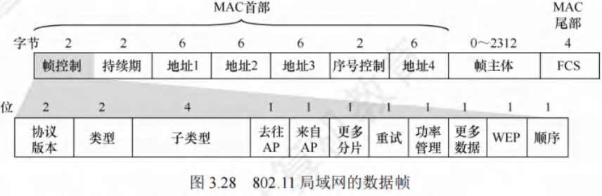

### 802.11 帧 MAC 首部地址字段
802.11 帧的 MAC 首部中，4 个地址字段（均为 MAC 地址）里，此处重点讨论前三个地址（地址 4 用于自组网络）。这三个地址内容取决于帧控制字段中的“去往 AP”和“来自 AP”两个字段数值。以下是 802.11 帧地址字段最常用的两种情况：
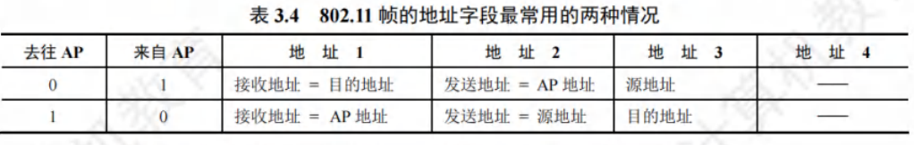

**重点**：地址 1 是直接接收数据帧的结点地址，地址 2 是实际发送数据帧的结点地址。

1. **BSS 内 A 站向 B 站发送数据帧**：
    - **A 站发往 AP 时**：帧控制字段中，“去往 AP = 1”且“来自 AP = 0”；地址 1 是 AP 的 MAC 地址，地址 2 是 A 站的 MAC 地址，地址 3 是 B 站的 MAC 地址。注意，“接收地址”与“目的地址”并不等同。
    - **AP 转发给 B 站时**：帧控制字段中，“去往 AP = 0”且“来自 AP = 1”；地址 1 是 B 站的 MAC 地址，地址 2 是 AP 的 MAC 地址，地址 3 是 A 站的 MAC 地址。注意，“发送地址”与“源地址”也不等同。
    - **理解方法**：地址 1 和地址 2 分别是无线通信中信道两端的接收地址和发送地址。主机发往 AP 时，接收地址不是实际目的地址，所以用地址 3 存放实际目的地址；AP 发往主机时，发送地址不是实际源地址，所以用地址 3 存放实际源地址。

2. **更复杂情况 - 路由器向 A 站发送数据（两 AP 有线连接到路由器）**：
    - **路由器操作**：路由器从 IP 数据报获知 A 站 IP 地址，并用 ARP 获取 A 站的 MAC 地址。之后，路由器接口 R1 将该 IP 数据报封装成 802.3 帧（802.3 帧只有两个地址），该帧源地址字段是 R1 的 MAC 地址，目的地址字段是 A 站的 MAC 地址。
    - **AP 操作**：AP 收到该 802.3 帧后，转换为 802.11 帧，在帧控制字段中，“去往 AP = 0”且“来自 AP = 1”；地址 1 是 A 站的 MAC 地址，地址 2 是 AP 的 MAC 地址，地址 3 是 R1 的 MAC 地址。这样，A 站可从地址 3 确定将数据报发送到子网中路由器接口的 MAC 地址。
    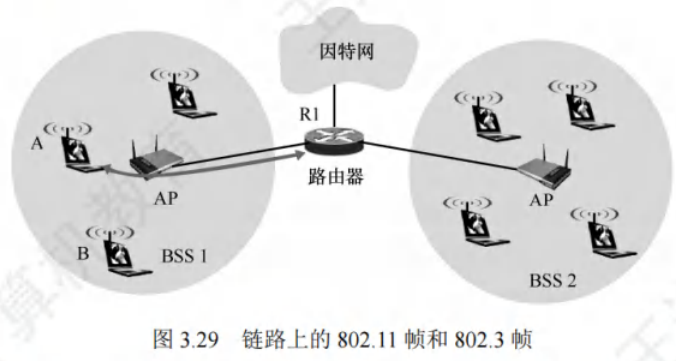

3. **A 站向路由器接口 R1 发送数据**：
    - **A 站操作**：A 站生成一个 802.11 帧，在帧控制字段中，“去往 AP = 1”且“来自 AP = 0”；地址 1 是 AP 的 MAC 地址，地址 2 是 A 站的 MAC 地址，地址 3 是 R1 的 MAC 地址。
    - **AP 操作**：AP 收到该 802.11 帧后，将其转换为 802.3 帧。该帧源地址字段是 A 站的 MAC 地址，目的地址字段是 R1 的 MAC 地址。

**总结**：地址 3 在 BSS 和有线局域网互连中起关键作用，它允许 AP 在构建以太网帧时确定目的 MAC 地址。 

### VLAN 基本概念与基本原理
- **以太网存在的问题**：一个以太网是一个广播域，计算机数量过多时，会出现大量广播帧，如 ARP 和 DHCP 协议（第 4 章相关）。而且不同部门共享局域网，对信息保密和安全不利。
- **VLAN 定义**：通过虚拟局域网（Virtual LAN，VLAN），可将较大局域网分割成较小的、与地理位置无关的逻辑 VLAN，每个 VLAN 是一个较小的广播域。
- **划分 VLAN 的方式**：
    - **基于接口**：将交换机的若干接口划为一个逻辑组，此方法简单有效。若主机离开原来接口，可能进入新子网。
    - **基于 MAC 地址**：按 MAC 地址将主机划分为一个逻辑子网，主机物理位置在不同交换机间移动时，仍属于原来子网。
    - **基于 IP 地址**：根据网络层地址或协议划分 VLAN，这样的 VLAN 可跨越路由器扩展，连接多个局域网的主机。
- **支持 VLAN 的以太网帧格式扩展**：
    - 802.3ac 标准定义在以太网帧中插入一个 4 字节标识符（插在源地址字段和类型字段之间），称为 VLAN 标签，指明发送帧的计算机所属虚拟局域网。插入 VLAN 标签的帧称为 802.1Q 帧，如图 3.30 所示。因 VLAN 帧首部增加 4 字节，以太网最大帧长从 1518 字节变为 1522 字节。
    - **VLAN 标签详解**：
        - VLAN 标签前两字节总置为 0x8100，表示这是 802.1Q 帧。
        - 后两字节中，前 4 位作用不大暂不讨论，后 12 位是 VLAN 的标识符 VID，它唯一标识该 802.1Q 帧所属 VLAN。12 位的 VID 可识别 4096 个不同 VLAN。插入 VLAN 标签后，802.1Q 帧最后的 FCS 必须重新计算。
        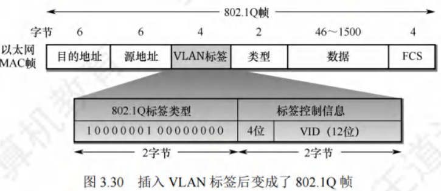
- **VLAN 在交换机中的应用**：
    - 如图 3.31 所示，交换机 1 连接 7 台计算机，局域网划分为 VLAN - 10 和 VLAN - 20，10 和 20 是 802.1Q 帧中 VID 字段的值，由交换机管理员设定。主机不知自身 VID 值（交换机必须知道），主机与交换机交互的是标准以太网帧。VLAN 范围可跨越不同交换机，前提是交换机能识别和处理 VLAN。交换机 2 连接 5 台计算机并与交换机 1 相连，其中 2 台计算机加入 VLAN - 10，3 台加入 VLAN - 20。这两个 VLAN 虽跨越两个交换机，但各自是一个广播域。连接两个交换机接口之间的链路称为汇聚链路或干线链路。
    
    - **帧转发示例**：
        - 若 A 站向 B 站发送帧，交换机 1 根据帧首部目的 MAC 地址，识别 B 站属本交换机管理的 VLAN - 10，像普通以太网一样直接转发帧。
        - 若 A 站向 E 站发送帧，交换机 1 转发到交换机 2 前要插入 VLAN 标签，否则交换机 2 不知转发给哪个 VLAN。干线链路上传送的是 802.1Q 帧。交换机 2 向 E 站转发帧前拿走 VLAN 标签，E 站收到的是标准以太网帧。
        - 若 A 站向 C 站发送帧，因 A、C 站处于不同 VLAN（VLAN - 10 和 VLAN - 20），属于不同网络间通信，需上层路由器解决，也可在交换机中嵌入专用芯片实现第 3 层转发功能。

**总结**：虚拟局域网只是局域网为用户提供的一种服务，并非新型局域网。 

## 广域网

### 广域网的基本概念
- **广域网定义与任务**：广域网（Wide Area Network，WAN）一般指覆盖范围极广（远超城市范围）的长距离网络 ，其主要任务是长距离传输主机发送的数据。连接广域网各结点交换机的链路为高速链路，广域网首要关注点是具备足够大的通信容量，以支撑不断增长的通信量。
- **广域网与互联网区别**：广域网并不等同于互联网。互联网可连接不同类型网络，常用路由器连接。如图 3.32 所示，相距较远的局域网通过路由器与广域网相连构成大范围互联网，实现局域网间远距离通信。

- **广域网组成与结点交换机功能**：
    - **组成**：广域网由结点交换机及连接它们的链路组成。需注意，结点交换机不同于路由器，结点交换机在单个网络中转发分组，路由器在多个网络构成的互联网中转发分组 。
    - **功能**：结点交换机功能为存储并转发分组。结点间采用点到点连接，为提高网络可靠性，通常一个结点交换机与多个结点交换机相连。
- **广域网与局域网层次协议区别**：从层次看，局域网使用的协议主要在数据链路层（少量在物理层），广域网使用的协议主要在网络层。当网络中两结点进行数据交换时，需给数据添加一层控制信息以实现传输控制等功能。若此控制信息属于数据链路层协议，则使用的是数据链路层协议；若属于网络层，则使用的是网络层协议。
- **广域网数据链路层协议**：
    - 在通信线路质量差的时期，能实现可靠传输的高级数据链路控制（HDLC）是较流行的数据链路层协议。
    - 如今，对于误码率很低的点对点有线链路，更简单的点对点协议（PPP）是使用最广泛的数据链路层协议。由于 HDLC 已从最新大纲删除，本书不再介绍。 

### 点对点协议
点对点协议（Point - to - Point Protocol，PPP）是当下最为流行的点对点链路控制协议，主要应用于以下两个方面：
1. 用户通常需连接到某个 ISP 以接入互联网，此时 PPP 协议便是用户计算机与 ISP 通信时所采用的数据链路层协议。
2. 广泛应用于广域网路由器之间的专用线路。

#### PPP 协议的组成部分
1. **链路控制协议（LCP）**：用于建立、配置、测试数据链路连接，并协商相关选项。
2. **网络控制协议（NCP）**：PPP 协议允许采用多种网络层协议，每种不同的网络层协议都需一个对应的 NCP 来配置，为网络层协议建立和配置逻辑连接。
3. **IP 数据报封装方法**：将 IP 数据报封装到串行链路。IP 数据报在 PPP 帧中作为信息部分，该信息部分长度受最大传送单元（MTU）限制。

#### PPP 帧格式
PPP 帧的格式如图 3.33 所示，首部包含 4 个字段，尾部包含 2 个字段。

- **标志字段（F）**：首部和尾部各有一个标志字段，值规定为 0x7E（01111110），作为 PPP 帧的定界符，表示一个帧的开始和结束。当标志字段出现在信息段中时，需采取措施避免其与真正的定界符混淆。异步传输时采用字节填充法，转义字符为 0x7D（01111101）；同步传输时采用零比特填充法实现透明传输。
- **地址字段（A）**：占 1 字节，值规定为 0xFF 。
- **控制字段（C）**：占 1 字节，值规定为 0x03 。这两个字段意义暂未定义。由于 PPP 是面向字节的，所有 PPP 帧长度均为整数个字节。
- **协议字段**：占 2 字节，用于表明信息段运载的分组类型。例如，0x0021 表示信息字段是 IP 数据报；0xC021 表示信息字段是 PPP 链路控制协议（LCP）的数据。
- **信息字段**：长度可变，范围为 0 - 1500 字节。
- **帧检验序列（FCS）**：占 2 字节，采用 CRC 检验生成冗余码。

#### PPP 协议状态图
图 3.34 展示了 PPP 协议的状态图，具体状态转换如下：
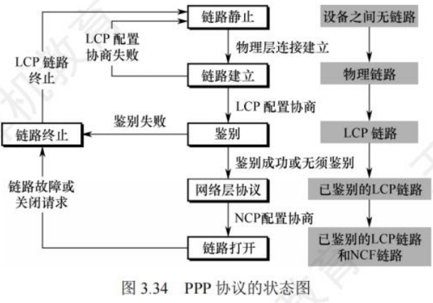
1. **链路静止状态**：通信双方无物理层连接。
2. **链路建立状态**：链路一方检测到载波信号，建立物理连接后进入此状态。此时，链路控制协议（LCP）开始协商配置选项（如最大帧长、鉴别协议等）。协商成功进入鉴别状态，协商失败退回链路静止状态。
3. **鉴别状态**：协商成功建立 LCP 链路后进入此状态。若双方无需鉴别或鉴别身份成功，进入网络层协议状态；若鉴别失败，进入链路终止状态。
4. **网络层协议状态**：进入此状态后，双方采用 NCP 配置网络层。配置协商成功后，进入链路打开状态。
5. **链路打开状态**：链路处于此状态时，双方可进行数据通信。
6. **链路终止状态**：数据传输结束，链路一方发出终止请求并收到对方终止确认，或链路出现故障时进入此状态。载波停止后，回到链路静止状态。

#### PPP 协议的特点
1. **可靠性**：PPP 不使用序号和确认机制，仅通过 CRC 检验保证无差错接收，提供不可靠服务。
2. **连接方式**：只支持全双工的点对点链路，不支持多点线路。
3. **协议兼容性**：PPP 的两端可运行不同的网络层协议，但仍能通过同一个 PPP 进行通信。
4. **数据格式**：PPP 是面向字节的，所有 PPP 帧的长度均为整数个字节。 

## 数据链路层设备

### 以太网交换机

#### 交换机的原理和特点
以太网交换机又称二层交换机，因其工作在数据链路层。它本质是多接口网桥，可将网络划分为较小的冲突域，为各用户提供更大带宽。

对于传统使用集线器的共享式 10Mb/s 以太网，若有$N$个用户，每个用户平均带宽为总带宽（10Mb/s）的$\frac{1}{N}$ 。而使用以太网交换机（全双工方式）连接主机时，虽每个接口到主机带宽仍为 10Mb/s，但用户通信时独占带宽，拥有$N$个接口的交换机总容量可达 $N×10Mb/s$，这是交换机最大优势。

**以太网交换机的特点**：
1. **全双工与无冲突传输**：当交换机接口直接连接主机或其他交换机时，可工作在全双工模式，能同时连通多对接口，使通信主机如同独占通信介质，无冲突传输数据，无需使用 CSMA/CD 协议。
2. **连接集线器的工作模式**：当交换机接口连接集线器时，只能使用 CSMA/CD 协议，且仅能工作在半双工方式。当前交换机和计算机网卡能自动识别这两种连接情况。
3. **即插即用与自学习**：交换机属于即插即用设备，其内部帧转发表通过自学习算法，依据网络中主机间通信情况自动逐步建立。
4. **高速交换**：交换机采用专用交换结构芯片，交换速率较高。
5. **带宽独占**：交换机独占传输介质的带宽。

**以太网交换机的交换模式**：
1. **直通交换方式**：
    - **工作原理**：仅检查帧的目的 MAC 地址，据此决定帧的转发接口。
    - **优缺点**：交换时延极小，但不检查差错就直接转发，可能将无效帧转发给其他站点，不适用于需速率匹配、协议转换或差错检测的线路。
2. **存储转发交换方式**：
    - **工作原理**：先把接收到的帧缓存到高速缓存器，检查数据正确性，确认无误后通过查找表转换到输出接口再发送。若发现帧有错，则丢弃。
    - **优缺点**：可靠性高，能支持不同速率接口间转换，但时延较大。

此外，交换机一般配备多种速率接口，如 10Mb/s、100Mb/s 接口，以及多速率自适应接口。 

#### 交换机的自学习功能
在交换机的工作过程中，“过滤”指决定一个帧是转发到某个接口还是丢弃，“转发”则是决定一个帧应被移至哪个接口，而这些操作借助交换表（switch table）来完成。交换表中的一个表项至少包含：1. 一个MAC地址；2. 连通该MAC地址的接口。

以图3.35为例，以太网交换机有4个接口，分别连接MAC地址为A、B、C和D的计算机，初始时交换机的交换表为空。
 - **A向B发送帧**：帧从接口1进入交换机，交换机查找交换表，未找到MAC地址为B的表项。于是，交换机将该帧的源地址A和接口1写入交换表，并向除接口1外的所有接口广播此帧（因帧从接口1进入，不能再从该接口转发）。C和D因目的地址不符丢弃该帧，只有B收下目的地址正确的帧。此时交换表写入(A, 1)，意味着之后从任何接口收到目的地址为A的帧，都应从接口1转发出去，因为A发出的帧从接口1进入交换机，从接口1转发的帧也应能到达A。
 - **B向A发送帧**：B通过接口3向A发送一帧，交换机查找交换表，发现表项(A, 1)，便将该帧从接口1转发给A。此时无需再广播收到的帧，同时将该帧的源地址B和接口3写入交换表，表明以后发送给B的帧应从接口3转发。

经过一段时间，只要C和D也向其他主机发送帧，交换机就会把C、D及对应的接口号写入交换表。如此一来，转发给任何主机的帧，都能迅速在交换表中找到相应的转发接口。

由于交换机所连主机会随时变化，所以需要更新交换表中的表项。为此，交换表中的每个表项都设有一定的有效时间，过期表项将自动删除，以保证交换表数据符合当前网络实际状况。这种自学习算法让交换机能即插即用，无需手工配置，极为方便。 

#### 共享式以太网和交换式以太网的对比
假设交换机已通过自学习算法逐步建立了完整的转发表，以下通过实例说明使用集线器的共享式以太网与全部使用交换机的交换式以太网的区别：

1. **主机发送普通帧**
    - **共享式以太网**：集线器会将主机发送的帧转发到其他所有接口。此时，其他各主机中的网卡需依据帧的目的MAC地址来判断是接收还是丢弃该帧。这是因为集线器工作在物理层，它只是简单地将接收到的信号广播到所有端口，不具备对数据帧进行智能分析和转发的能力。
    - **交换式以太网**：交换机在收到帧后，会依据帧的目的MAC地址以及自身已建立的交换表，将帧精准地转发给目的主机。交换机工作在数据链路层，能够学习网络中各主机的MAC地址，并记录在交换表中，从而实现根据目的MAC地址进行准确转发。

2. **主机发送广播帧**
    - **共享式以太网**：集线器同样将帧转发到其他所有接口。当其他各主机中的网卡检测到帧的目的MAC地址是广播地址时，就会接收该帧。因为广播帧的目的是网络中的所有主机，集线器的广播特性使得所有连接到它的主机都能接收到该帧。
    - **交换式以太网**：交换机检测到帧的目的MAC地址是广播地址后，会从其他所有接口转发该帧。其他各主机收到该广播帧后就接收它。虽然两种网络在这种情况下最终效果相同，即所有主机都能收到广播帧，但原理不同。共享式以太网是基于集线器的物理层广播特性，而交换式以太网是交换机根据广播地址的特殊性质，按照其转发规则将广播帧从除接收端口外的所有端口转发出去。

3. **多对主机同时通信**
    - **共享式以太网**：由于共享式以太网采用的是共享传输介质的方式，当多对主机同时通信时，信号会在传输介质上相互干扰，必然产生冲突。这会导致数据传输的错误和效率降低。
    - **交换式以太网**：交换机内部具有高速的交换结构，能实现多对接口的高速并行交换。每对通信的主机都有独立的传输通道，因此不会产生冲突，大大提高了网络的通信效率。

**总结**：集线器既不隔离广播域，又不隔离冲突域，这意味着网络中的广播帧会传播到所有连接的主机，且多主机同时通信易产生冲突；而交换机不隔离广播域，但能隔离冲突域，广播帧仍会在整个网络传播，但能避免多对主机同时通信时的冲突问题。 