# 网络层

[toc]

## 网络层的功能

网络层提供**主机到主机**的通信服务，主要任务是**将分组从源主机经多个网络和链路传输到目的主机**，该任务可分为**分组转发**和**路由选择**两种重要功能。

OSI参考模型主张网络层用面向连接的虚电路服务，认为网络应保证通信可靠性；而TCP/IP体系的网络层提供无连接的数据报服务，核心思想是由用户主机保证通信可靠性。

在TCP/IP体系结构中，网络层向上提供**简单灵活、无连接、尽最大努力交付的数据报服务**。即分组可能出错、丢失、重复、失序或超时，这使路由器简单且价廉，通信可靠性由传输层负责。这种设计思路好处是：**网络造价降低，运行方式灵活，适应多种应用**。

### 异构网络互连
互联网由数以百万计的异构网络互连而成，这些网络在拓扑结构、寻址方案、差错处理方法、路由选择机制等方面不同。网络层任务之一是实现这些异构网络互连。

网络互连指将两个以上计算机网络，通过一定方法，用中继系统相互连接构成更大网络系统。根据所在层次，中继系统分为以下4种：
1. **物理层中继系统**：转发器，集线器。
2. **数据链路层中继系统**：网桥或交换机。
3. **网络层中继系统**：路由器。
4. **网络层以上中继系统**：网关。

使用物理层或数据链路层中继系统，只是扩大网络，从网络层看仍是同一网络，一般不称网络互连。因此，网络互连通常指用**路由器**进行网络连接和路由选择，路由器是用于互联网路由选择的专用计算机。

TCP/IP在网络互连上，网络层采用标准化协议，相互连接的网络可以异构。

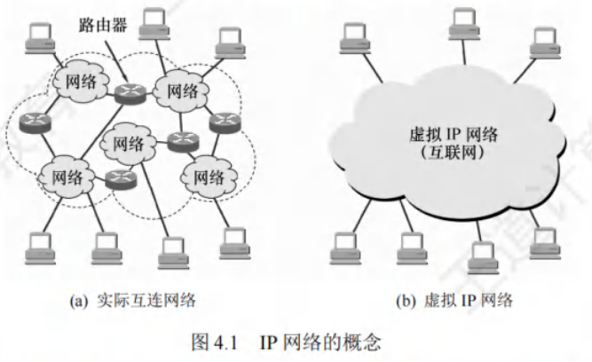

虚拟互连网络即逻辑互连网络，各种物理网络的异构性客观存在，但通过IP协议，使这些网络在网络层看似统一，这种使用IP协议的虚拟互连网络简称IP网络。

使用IP网络的好处是：IP网上主机通信时，如同在单个网络通信，看不到互连网络的具体异构细节（如编址方案、路由选择协议等）。 

### 路由与转发
路由器主要实现两个功能：
 - **路由选择**：确定路径，根据路由协议构造并维护路由表，常与相邻路由器交换信息，获取网络最新拓扑，动态更新路由表，以决定分组到目的结点的最优路径。
 - **分组转发**：当分组到达时采取动作，处理路由器数据流，关键操作有转发表查询、转发及相关队列管理和任务调度等，即根据转发表将分组从合适端口转发出去。

路由表由路由选择算法得出，转发表从路由表得出。转发表结构优化查找过程，路由表优化网络拓扑变化计算。讨论路由选择原理时，常不区分转发表和路由表，统称路由表。

### 网络层提供的两种服务
分组交换网依通信子网向端点系统提供的服务，分为面向连接的虚电路服务和无连接的数据报服务，均由网络层提供。

#### 虚电路
在虚电路方式中，两台计算机通信先建立网络层连接，即逻辑上的虚电路（Virtual Circuit, VC），连接建立后固定物理路径。整个通信过程分三个阶段：虚电路建立、数据传输与虚电路释放。
 - 每次建立虚电路，分配未用过的虚电路号（VCID）以区分其他虚电路，之后双方沿已建立虚电路传送分组。分组首部在连接建立时用完整目的地址，之后仅携带虚电路编号。
 - 虚电路网络的每个结点维持一张虚电路表，记录打开虚电路信息，包括接收和发送链路的虚电路号、前后结点标识，在虚电路建立过程中确定。

虚电路方式工作原理如下：
1. **虚电路建立**：数据传输前，主机A发“呼叫请求”分组经中间结点到主机B，若主机B同意，回“呼叫应答”分组确认。
2. **数据传输**：虚电路建立后，主机A和B相互传送数据分组。
3. **虚电路释放**：传送结束，主机A发“释放请求”分组拆除虚电路，逐段断开连接。

虚电路服务特点：
 - **建立拆除开销**：虚电路通信链路的建立和拆除耗时，对交互式应用和少量短分组浪费，对长时间、频繁数据交换效率高。
 - **路由选择时机**：路由选择在连接建立阶段，建立后确定传输路径。
 - **可靠通信**：提供可靠通信功能，保证分组正确有序到达，可对两端流量控制，接收方来不及接收时通知发送方暂缓。
 - **故障影响**：网络中某结点或链路故障，经过的虚电路会被破坏。
 - **首部开销**：分组首部含虚电路号而非目的地址，开销较数据报方式小。

虚电路是“虚”的，因电路不专用，每个结点到其他结点链路可能同时有若干虚电路通过，也可能在多个结点间同时建立虚电路。

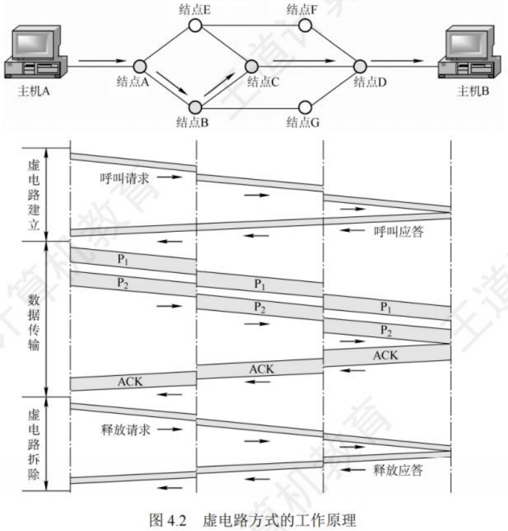

#### 数据报
网络发送分组前无需建立连接。源主机高层协议将报文拆成较小数据段，加地址等控制信息构成分组。中间结点短暂存储分组，找最佳路由尽快转发，网络层不承诺服务质量，不提供端到端可靠传输，路由器简单价廉。

数据报服务原理（以主机A向主机B发送分组为例）：
1. 主机A逐个将分组发往直接相连的交换结点A，交换结点A缓存分组。
2. 交换结点A查找转发表，因网络状态不同，转发表内容有别，分组可能转发给交换结点C或D。
3. 网络其他结点类似转发分组，直至到达主机B。

数据报服务特点：
 - **无需连接**：发送分组前无需建立连接，发送方随时发，网络结点随时收。
 - **尽力交付**：网络尽最大努力交付，不保证可靠性，分组可能出错或丢失；为每个分组独立选路由，转发路径可能不同，分组不一定按序到达。
 - **完整地址**：分组包含发送方和接收方完整地址，可独立传输。
 - **时延与丢弃**：分组在交换结点存储转发需排队，有时延；网络拥塞时，时延大增，交换结点可丢弃部分分组。
 - **故障适应**：网络有冗余路径，某交换结点或链路故障，可更新转发表，找另一条路径转发分组，适应能力强。
 - **资源利用**：收发双方不独占链路，资源利用率高。

采用这种设计思想，网络造价降低、运行灵活、适应多种应用，互联网发展规模证明其正确性。 

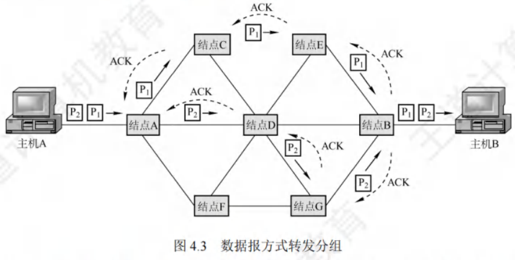

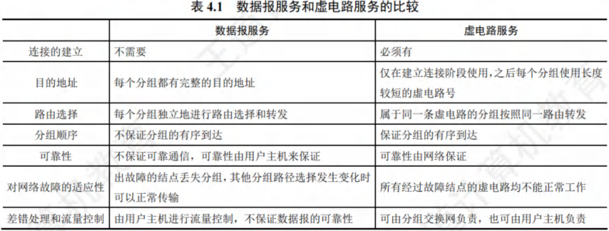

### SDN的基本概念
网络层主要任务为转发和路由选择，可抽象划分为**数据平面（转发层面）**与**控制平面**，转发由数据平面实现，路由选择由控制平面实现。

软件定义网络（Software Defined Network, SDN）是近年流行的创新网络架构，采用**集中式控制平面和分布式数据平面**，两平面相互分离。控制平面通过控制 - 数据接口对数据平面的路由器进行集中控制，便于软件操控网络。

传统路由器兼具转发表与路由选择软件，即同时具备数据平面与控制平面。而在SDN结构中，路由器简化，无需路由选择软件，路由器间也不再交换路由信息。网络控制平面有一个逻辑上的远程控制器（可由多个服务器组成），其掌握各主机及整个网络状态，为每个分组算出最佳路由，通过Openflow协议（或其他途径）将转发表（SDN中称为流表）下发给路由器。路由器仅执行“收到分组、查找转发表、转发分组”的单纯工作。

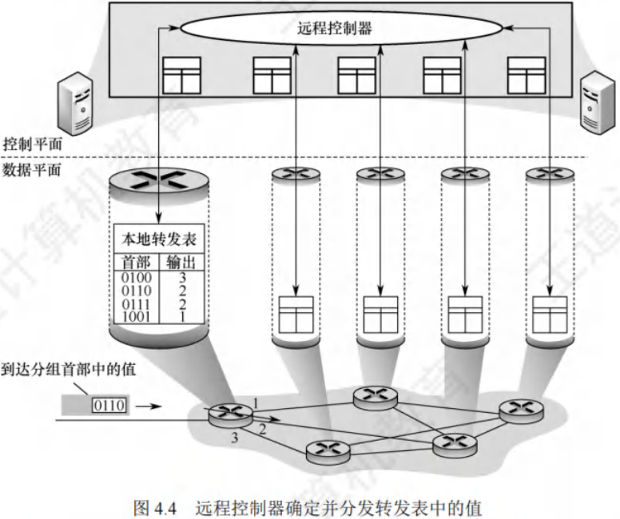

SDN并非要将整个互联网改造成集中控制模式，这不现实。但在某些条件下，如大型数据中心间的广域网，采用SDN模式可提高网络运行效率。

SDN具有可编程性，通过为开发者提供强大编程接口实现。具体接口如下：
 - **北向接口**：面向上层应用开发者，提供丰富API，开发者基于此设计应用，无需关心底层硬件细节。
 - **南向接口**：SDN控制器与转发设备建立双向会话的接口，通过不同南向接口协议（如Openflow），SDN控制器可兼容不同硬件设备，并在设备中实现上层应用逻辑。
 - **东西向接口**：SDN控制器集群内部控制器之间的通信接口，用于增强控制平面的可靠性与可拓展性。

SDN优点：
 - **控制与转发优势**：全局集中式控制和分布式高速转发，既利于控制平面全局优化，又利于高性能网络转发。
 - **可编程与性能平衡**：控制和转发功能分离，网络可由专有自动化工具以编程方式配置。
 - **降低成本**：控制和数据平面分离，尤其使用开放接口协议后，实现网络设备制造与功能软件开发分离，有效降低成本。

SDN问题：
 - **安全风险**：集中管理易受攻击，若崩溃，整个网络受影响。
 - **瓶颈问题**：分布式控制平面集中化后，随网络规模扩大，控制器可能成为网络性能瓶颈。

### 拥塞控制
因过量分组导致网络性能下降的现象叫拥塞。判断网络是否拥塞，观察网络吞吐量与网络负载关系：若网络负载增加时，吞吐量明显小于正常吞吐量，网络可能进入轻度拥塞；若吞吐量随网络负载增大而下降，网络可能已拥塞。拥塞控制主要解决如何获取拥塞信息并利用其控制，避免分组丢失。

拥塞控制作用是确保网络承载流量，是全局性过程，涉及网络中所有主机、路由器及影响网络传输能力的因素。单纯增加资源不能解决拥塞。

拥塞控制与流量控制区别：流量控制通常指发送方和接收方间点对点通信量的控制，抑制发送方速率，使接收方来得及接收。

拥塞控制方法有两种：
 - **开环控制**：设计网络时考虑拥塞因素，力求工作时不产生拥塞，是静态预防方法。系统启动运行后不再修改。开环控制手段包括确定接收新流量时机、丢弃分组时机及对象、调度策略等，做决定时不考虑当前网络状态。
 - **闭环控制**：事先不考虑拥塞因素，通过监测网络系统，及时检测拥塞位置，将信息传到合适地方，调整网络运行以解决问题。基于反馈环路概念，是动态方法。 

## IPv4

### IPv4分组
IPv4（版本4）是当前广泛使用的网际协议（Internet Protocol, IP）。IP定义了数据传送的基本单元——IP分组及其确切数据格式，还包含一套处理分组、控制错误的规则，特别是非可靠投递及路由选择的思想。

#### IPv4分组的格式
一个IP分组（IP数据报）由**首部和数据部分**组成。首部前一部分长度固定，为20B，是所有IP分组必备的。首部固定部分之后是可选字段，长度可变，用于错误检测及安全等机制。

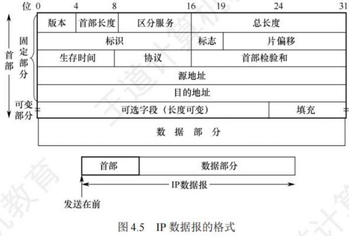

IPv4首部部分重要字段含义：
1. **版本**：占4位，指IP的版本，IPv4数据报中该字段值为4。
2. **首部长度**：占4位，以4B为单位，最大可表示首部长度为60B（15×4B）。最常用首部长度是20B（5×4B），此时该字段值为5，不使用可选字段，IP首部前两个字节常以0x45开头，可用于定位IP数据报起始位置。
3. **总长度**：占16位，指首部和数据之和的长度，单位为字节，数据报最大长度为$2^{16}-1 = 65535B$。以太网帧的最大传送单元（MTU）为1500B，IP数据报封装成帧时，总长度（首部加数据）不能超过数据链路层的MTU值。
4. **标识**：占16位，是一个计数器，每产生一个数据报就加1并赋值给该字段，但它不是“序号”（因IP是无连接服务）。当数据报长度超过网络MTU时需分片，每个数据报片都复制标识号，以便正确重装成原数据报。
5. **标志（Flag）**：占3位。标志字段最低位为MF，MF = 1表示后面还有分片，MF = 0表示最后一个分片。中间一位是DF，只有DF = 0时才允许分片。
6. **片偏移**：占13位，指出较长数据报分片后，某片在原数据报中的相对位置，片偏移以8B为偏移单位。除最后一个分片外，每个分片长度一定是8B的整数倍。
7. **生存时间（TTL）**：占8位，是数据报在网络中可通过路由器数的最大值，标识数据报在网络中的寿命，确保数据报不会永远在网络中循环。路由器转发数据报前，先将TTL减1，若TTL减为0，则丢弃该数据报。
8. **协议**：占8位，指出此数据报携带的数据使用何种协议，即数据报的数据部分应上交给哪个协议处理，如TCP、UDP等。值为6表示TCP，值为17表示UDP。
9. **首部检验和**：占16位，只检验数据报首部，不包括数据部分。因为数据报每经过一个路由器，部分字段（如生存时间、总长度、标志、片偏移、源/目的地址）可能变化，需重新计算首部检验和，不检验数据部分可减少计算量。
10. **源地址字段**：占4B，标识发送方的IP地址。
11. **目的地址字段**：占4B，标识接收方的IP地址。

**注意**：IP数据报首部中有三个关于长度的标记，即首部长度、总长度、片偏移，基本单位分别为4B、1B、8B。需熟悉IP数据报首部各字段意义和功能，但无需记忆首部，题目一般会给出。分析IP首部时，IP地址常以十六进制表示，要注意与十进制的转换。

#### IP数据报分片
链路层数据帧能承载的最大数据量称为最大传送单元（MTU）。IP数据报封装在链路层帧中，链路层的MTU严格限制IP数据报长度，且源与目的地路径上各段链路可能使用不同链路层协议，MTU不同。例如，以太网MTU为1500B，许多广域网MTU不超过576B。当IP数据报总长度大于链路MTU时，需将数据分装在多个较小IP数据报中，这些小数据报称为片。

片在目的地网络层重新组装。目的主机使用IP首部中的标识、标志和片偏移字段完成片的重组。创建IP数据报时，源主机为其加上标识号。路由器分片时，每个数据报片都具有原始数据报的标识号。目的主机收到同一发送主机的一批数据报，通过检查标识号确定哪些数据报属于同一个原始数据报的片。IP首部标志位占3位，后2位有意义（分别是DF（Don't Fragment）位和MF（More Fragment）位）。只有DF = 0时，IP数据报才可被分片。MF用于告知目的主机该IP数据报是否为原始数据报的最后一个片，MF = 1表示还有后续片，MF = 0表示是最后一个片。目的主机重组片时，使用片偏移字段确定片在原始IP数据报中的位置。

IP分片涉及计算。例如，一个长4000B的IP数据报（首部20B，数据部分3980B）到达路由器，需转发到MTU为1500B的链路上。意味着3980B数据需分配到3个独立片中（每片也是一个IP数据报），每片数据部分依次为1480B、1480B和1020B。假定原始数据报标识号为777，则分成的3片如图4.6所示。可见，除最后一个片外，其他片数据部分都为8B的倍数。 

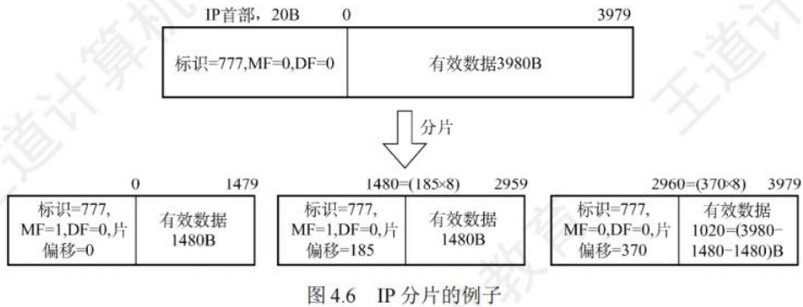

### IPv4地址与NAT

#### IPv4地址

IP地址是为互联网上每台主机（或路由器）的每个接口分配的全球唯一32位标识符，由互联网名字和数字分配机构ICANN负责分配。

所有IP地址都由**网络号**和**主机号**两部分构成，即IP地址::={<网络号>,<主机号>}。网络号标识主机（或路由器）所连网络，在整个互联网范围内唯一；主机号标识主机（或路由器），在其网络号所指网络范围内唯一，因此IP地址在整个互联网范围唯一。

各类IP地址中，部分IP地址有特殊用途，不作为主机IP地址：
 - 主机号全为0表示本网络本身，如202.98.174.0。
 - 主机号全为1表示本网络的广播地址，即直接广播地址，如202.98.174.255。
 - 127.x.x.x保留为环回自检（Loopback Test）地址，代表任意主机本身，目的地址为环回地址的IP数据报不会出现在任何网络上。
 - 32位全为0，即0.0.0.0表示本网络上的本主机。
 - 32位全为1，即255.255.255.255表示整个TCP/IP网络的广播地址，即受限广播地址。实际使用中，因路由器隔离广播域，255.255.255.255等效为本网络广播地址。

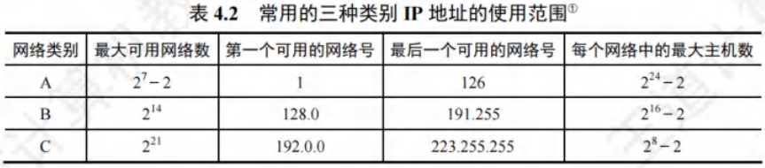

以A类地址为例，可用网络数为$2^7 - 2$，减2原因如下：
 - 网络号字段全为0的IP地址是保留地址，意为“本网络”。
 - 网络号为127的IP地址是环回自检地址。

IP地址具有以下重要特点：
 - **分等级结构**：每个IP地址由网络号和主机号组成，是分等级的地址结构。好处在于：
    - IP地址管理机构只需分配网络号，主机号由单位自行分配，便于管理。
    - 路由器依据目的主机的网络号转发分组，减小路由表存储空间。
 - **标志接口**：IP地址标志一台主机（或路由器）和一条链路的接口。当主机同时连接两个网络，需有两个不同网络号的IP地址。路由器至少有两个IP地址，每个端口对应不同网络号的IP地址。
 - **同一网络特性**：用转发器或桥接器连接的若干LAN属同一网络（同一广播域），其中主机IP地址网络号相同，但主机号不同。
 - **网络平等性**：所有分配到网络号的网络（LAN或WAN）地位平等。
 - **局域网特性**：同一个局域网上的主机或路由器接口的IP地址，网络号必须相同。

近年来，无分类IP地址广泛用于路由选择，传统分类的IP地址逐渐成为历史。

#### 网络地址转换(NAT)
网络地址转换（Network Address Translation, NAT）是将专用网络地址（如Intranet）转换为公用地址（如Internet），对外隐藏内部管理的IP地址。它使整个专用网仅需一个全球IP地址即可与互联网连通，因专用网本地IP地址可重用，大大节省了IP地址。同时，隐藏内部网络结构，降低内部网络受攻击风险。

为保障网络安全，划分出部分IP地址作为私有IP地址。私有IP地址仅用于LAN，不用于WAN连接（不能直接用于Internet，需通过网关利用NAT转换为合法全球IP地址才能出现在Internet上），且允许被LAN重复使用，有效缓解IP地址不足问题。私有IP地址网段如下：
 - **A类**：1个A类网段，即10.0.0.0 ~ 10.255.255.255。
 - **B类**：16个B类网段，即172.16.0.0 ~ 172.31.255.255。
 - **C类**：256个C类网段，即192.168.0.0 ~ 192.168.255.255。

互联网中的路由器对目的地址为私有地址的数据报不转发。采用私有IP地址的互联网络称为专用互联网或本地互联网，私有IP地址也叫可重用地址。

使用NAT需在专用网连接互联网的路由器上安装NAT软件，NAT路由器至少有一个有效的外部全球IP地址。当本地地址主机与外界通信时，NAT路由器利用NAT转换表进行本地IP地址和全球IP地址的转换。NAT转换表存放着{本地IP地址:端口}到{全球IP地址:端口}的映射，可实现多个私有IP地址映射到一个全球IP地址。

例如，某家庭办理10Mb/s电信宽带获全球IP地址（如138.76.29.7），家庭网络内3台主机使用私有地址（如10.0.0.0网段），家庭网关路由器开启NAT功能。其工作原理如下：
1. 用户主机10.0.0.1（随机端口3345）向Web服务器128.119.40.186（端口80）发送请求。
2. NAT路由器收到IP分组后，生成新端口号5001，将IP分组源地址改为138.76.29.7（NAT路由器的全球IP地址），源端口号改为5001，并在NAT转换表中增加表项。
3. Web服务器不知IP分组已被改装，响应分组目的地址是NAT路由器的全球IP地址138.76.29.7，目的端口号是5001。
4. 响应分组到达NAT路由器后，通过NAT转换表将目的IP地址改为10.0.0.1，目的端口号改为3345，实现多台主机用一个全球IP地址同时访问互联网。

普通路由器转发IP分组时，源IP地址和目的IP地址不变。而NAT路由器转发时，一定会更换IP地址（转换源IP地址或目的IP地址），且需查看和转换传输层端口号。

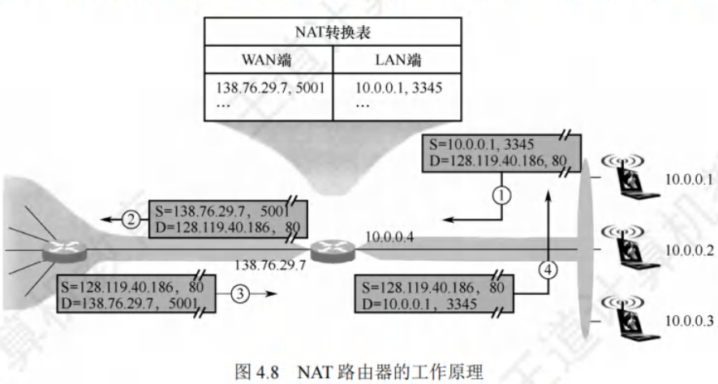

### 划分子网与路由聚合

#### 划分子网
- **两级IP地址缺点**：IP地址空间利用率低；路由表因每个物理网络分配一个网络号而变得庞大，影响网络性能；灵活性不足。
- **划分子网思路**：
    - 1985年起，在IP地址中增加“子网号字段”，将两级IP地址变为三级IP地址，此做法成为互联网正式标准协议。
    - 划分子网是单位内部事务，对外仍表现为一个未划分子网的网络。方法是从主机号借用若干位作为子网号，主机号相应减少相同位数。三级IP地址结构为：IP地址::={<网络号>,<子网号>,<主机号>}。
    - 路由器先依据IP数据报的目的网络号转发，本单位路由器收到后，再按目的网络号和子网号找到目的子网，最后交付给目的主机。
    - 例如，将C类网络208.115.21.0划分为4个子网，子网号占2位，主机号剩6位，各子网网络地址分别为208.115.21.0、208.115.21.64、208.115.21.128、208.115.21.192 ，每个子网可分配IP地址数为$2^6 - 2 = 62$ 。
- **注意要点**：
    - 划分子网只对主机号部分再划分，不改变原网络号，从IP地址本身无法判断网络是否划分子网。
    - 子网中主机号全0的地址是子网网络地址，主机号全1的地址是子网广播地址，这两个地址不能指派给主机。
    - 划分子网增加灵活性，但减少了网络可连接的主机总数。

#### 子网掩码和默认网关
- **子网掩码**：用于指明分类IP地址的主机号部分有多少位被借用作为子网号。它是一个32位二进制串，由一串1和跟随的一串0组成，1对应IP地址中的网络号及子网号，0对应主机号。主机或路由器将IP地址和子网掩码逐位“与”（AND运算），可得出子网的网络地址。
- **默认网关**：是子网与外部网络连接的设备，即连接本机或子网的路由器接口的IP地址。主机发送数据时，根据目的IP地址和子网掩码判断目的主机是否在子网内，若在则直接发送，若不在则发送到默认网关，由网关（路由器）转发到其他网络寻找目的主机。
- **相关规定**：
    - 互联网标准规定所有网络都必须使用子网掩码，未划分子网的网络使用默认子网掩码，A、B、C类地址的默认子网掩码分别为255.0.0.0、255.255.0.0、255.255.255.0。例如，主机IP地址192.168.5.56与子网掩码255.255.255.0逐位“与”，可得子网网络号192.168.5.0。
    - 子网掩码是网络重要属性，路由器交换路由信息时需告知对方自己所在网络的子网掩码。分组转发时，路由器将分组目标地址和某网络子网掩码按位相与，结果与该网络地址一致则路由匹配成功，分组转发至该网络。
    - 使用子网掩码时，主机设置IP地址信息必须同时设置子网掩码，同属一个子网的主机及路由器相应端口必须设置相同子网掩码，路由器路由表包含目的网络地址、子网掩码、下一跳地址。

#### 无分类编址CIDR
- **基本概念**：无分类域间路由选择（Classless Inter - Domain Routing, CIDR）基于变长子网掩码，消除传统A、B、C类地址及划分子网概念。例如，单位需2000个地址，分配2048个地址的块而非完整B类地址，以更有效分配IPv4地址空间。CIDR使用网络前缀概念替代网络概念，与传统分类IP地址最大区别是网络前缀位数不固定。记法为IP地址::={<网络前缀>,<主机号>} 。
- **斜线记法**：也称CIDR记法，记为“IP地址/网络前缀所占的位数”。网络前缀所占位数对应网络号部分，等效于子网掩码中连续1的部分。例如，128.14.32.5/20，其掩码是20个连续1和后续12个连续0，通过逐位“与”可得网络前缀128.14.32.0 。斜线记法既能表示IP地址，又能表示地址块网络前缀位数。
- **CIDR地址块**：CIDR将网络前缀相同的连续IP地址组成CIDR地址块。知道其中一个地址，就能确定地址块的最小地址、最大地址及地址数。例如，128.14.32.5/20地址块，最小地址128.14.32.0 ，最大地址128.14.47.255 。主机号全0或全1的地址一般不使用，只使用两者之间的地址。
- **与子网关系**：CIDR虽不使用子网概念，但分配到CIDR地址块的单位仍可在内部按需划分子网。如单位分配到/20地址块，可从主机号借用3位继续划分为8个子网，此时每个子网网络前缀变为23位。
- **地址数特点**：CIDR地址块中地址数是2的整数次幂，实际可指派地址数通常为$2^N - 2$，N为主机号位数，主机号全0代表网络号，主机号全1为广播地址。网络前缀越短，地址块包含地址数越多；三级结构IP地址划分子网使网络前缀变长。

#### 路由聚合
- **概念与作用**：由于CIDR地址块包含多个地址，在路由表中利用CIDR地址块查找目的网络，这种地址聚合称为路由聚合，也称构成超网。它使路由表一个项目可表示多个传统分类地址的路由，减少路由器间信息交换，提高网络性能。
- **示例**：如图4.9网络，若不使用路由聚合，R1路由表需分别有到网络1和网络2的路由表项。网络1和网络2网络前缀二进制表示前16位相同，第17位分别为0和1，且从R1到两者的下一跳皆为R2 。使用路由聚合，R1可将网络1和网络2构成更大地址块206.1.0.0/16，两条路由聚合成一条到206.1.0.0/16的路由。
- **最长前缀匹配**：使用CIDR时，路由表项由“网络前缀”和“下一跳地址”组成。查找路由表可能有多个匹配结果，应选择网络前缀最长的路由，因为网络前缀越长，地址块越小，路由越具体。
- **查找方法**：为有效查找最长前缀匹配，通常将无分类编址路由表存放在层次式数据结构（常采用二叉线索）中，自上而下按层次查找。
- **优点**：CIDR网络前缀长度灵活，上层网络前缀短，路由表项目少；内部可延长网络前缀灵活划分子网。

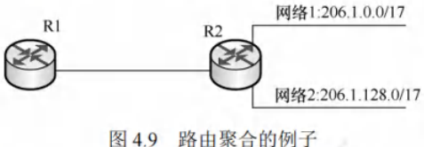

#### 子网划分的应用举例
子网划分通常有两类方法：采用定长的子网掩码和采用变长的子网掩码。

(1) **采用定长的子网掩码划分子网**
当使用定长的子网掩码划分子网时，每个子网的子网掩码相同，所分配的IP地址数量也一样，这种方式易造成地址资源浪费。

假设某单位拥有CIDR地址块208.115.21.0/24 ，该单位有三个部门，各部门主机台数分别为50、20、5 。采用定长子网掩码为各部门分配IP地址。
 - 部门1需要51个IP地址（含一个路由器接口地址）；部门2需要21个IP地址；部门3需要6个IP地址。
 - 从给定地址块208.115.21.0/24的主机号部分借用2位作为子网号，可划分出$2^2 = 4$个子网 。每个子网可分配的IP地址数为$2^{8 - 2} - 2 = 62$，能满足各部门需求。各子网划分如下（为方便书写，仅将IP地址后8位用二进制展开）：
    - 208.115.21.00000000 ~ 208.115.21.00111111，地址块“208.115.21.0/26”，分配给部门1。
    - 208.115.21.01000000 ~ 208.115.21.01111111，地址“208.115.21.64/26”，分配给部门2。
    - 208.115.21.10000000 ~ 208.115.21.10111111，地址块“208.115.21.128/26”，分配给部门3。
    - 208.115.21.11000000 ~ 208.115.21.1111111，地址块“208.115.21.192/26”，留作以后用。
 - 子网掩码：255.255.255.11000000，即255.255.255.192。

(2) **采用变长的子网掩码划分子网**
采用变长的子网掩码划分子网时，每个子网可使用不同的子网掩码，所分配的IP地址数量也能不同，可最大程度减少地址资源浪费。

假设条件与上例相同，下面采用变长的子网掩码为该单位分配IP地址。
 - 部门1的主机号需6位，剩余$26 (32 - 6 = 26)$位作为网络前缀；部门2的主机号需5位，剩余$27 (32 - 5 = 27)$位作为网络前缀；部门3的主机号需3位，剩余$29 (32 - 3 = 29)$位作为网络前缀。
 - 从地址块208.115.21.0/24中划分出3个子网（1个“/26”地址块，1个“/27”地址块，1个“/29”地址块），并按需分配给三个部门。每个子网的最小地址选取主机号全0的地址。划分方案不唯一，建议从大的子网开始划分。以下是一种划分方案：
    - 208.115.21.00000000 - 208.115.21.00111111，地址块208.115.21.0/26，子网掩码255.255.255.192，可分配地址62个，分配给部门1。
    - 208.115.21.01000000 - 208.115.21.01011111，地址块208.115.21.64/27，子网掩码255.255.255.224，可分配地址30个，分配给部门2。
    - 208.115.21.01100000 - 208.115.21.01100111，地址块208.115.21.96/29，子网掩码255.255.255.248，可分配地址6个，分配给部门3。
 - 剩余$256 - 64 - 32 - 8 = 152$个地址，留作以后划分。

再次强调，子网主机号全0或全1的地址不能分配。对于连接两个路由器的链路，可分配一个“/30”地址块，这样可分配地址为2个，刚好能分给链路两端的路由器接口。 

### 网络层转发分组的过程
分组转发基于目的主机所在网络，因为互联网上网络数远少于主机数，这样能极大压缩转发表大小。分组到达路由器后，路由器依据目的IP地址的网络前缀查找转发表，确定下一跳路由器。所以转发表中每条路由需包含**(目的网络地址, 下一跳地址)** 两条信息。

IP数据报最终能找到目的主机所在网络的路由器（可能需多次间接交付），到达最后一个路由器时才尝试向目的主机直接交付。

采用CIDR编址时，若分组在转发表中有多个匹配前缀，应使用**最长前缀匹配**。为加快查找，可按前缀长度降序排列转发表，从最长前缀开始查找，找到匹配项则停止。

路由表中还可增加两种特殊路由：
1. **特定主机路由**：为特定目的主机的IP地址专门指定一条路由，方便网络管理员控制和测试网络。若特定主机IP地址是a.b.c.d，转发表中对应项的目的网络是a.b.c.d/32 ，/32表示的子网掩码虽无意义，但可用于转发表。
2. **默认路由**：用特殊前缀0.0.0.0/0表示，全0掩码与任何目的地址按位与运算结果为全0，必然与该前缀匹配。只要目的网络不在转发表中，就选择默认路由。默认路由常用于路由器到互联网的路由，因互联网网络众多，无法在路由表中一一列出。

路由器执行的分组转发算法如下：
1. 从收到的IP分组首部提取目的主机的IP地址D（目的地地址）。
2. 若查找到特定主机路由（目的地址为D），按该路由的下一跳转发分组；否则从转发表下一条（按前缀长度顺序）开始检查，执行步骤3。
3. 将该行的子网掩码与目的地址D逐位“与”（AND操作）。若运算结果与本行前缀匹配，查找结束，按“下一跳”指示处理（直接交付本网络目的主机或通过指定接口发送到下一跳路由器）。否则，若转发表还有下一行，对下一行检查，重新执行步骤3；否则，执行步骤4。
4. 若转发表中有默认路由，将分组传送给默认路由；否则，报告转发分组出错。

需注意，转发表（或路由表）未指明分组到某个网络的完整路径，仅指出到某个网络应先到哪个路由器（下一跳路由器），到达后再查其转发表确定下一步走向，直至到达目的网络。

得到下一跳路由器的IP地址后，不直接填入待发送数据报，而是通过ARP将其转换为MAC地址，填入MAC帧首部，再据此MAC地址找到下一跳路由器。在不同网络传送时，MAC帧的原地址和目的地址会变化。 

### 地址解析协议ARP

#### IP地址与硬件地址
- **地址层次与位置**：IP地址用于网络层及以上，是分层式的，放在IP数据报首部；硬件地址（MAC地址）用于数据链路层，是平面式的，放在MAC帧首部。IP数据报封装成MAC帧后，数据链路层无法看到其中的IP地址。
- **寻址方式**：因路由器隔离，IP网络无法通过广播MAC地址跨网络寻址，网络层使用IP地址寻址。寻址时，路由器依据路由表（由路由协议生成）选择到目标网络（主机号全为0的网络地址）的下一跳（路由器物理端口号或下一网络地址）。IP数据报经多次路由转发到达目标网络后，在目标局域网通过数据链路层MAC地址广播寻址，可提高路由选择效率。
- **网络特性强调**：
    1. 在IP层抽象的互联网上只能看到IP数据报。
    2. 路由器只根据IP数据报首部的目的IP地址进行转发，不考虑源IP地址。
    3. 局域网链路层只能看见MAC帧，IP数据报被封装在MAC帧中。通过路由器转发时，IP数据报在每个网络都被解封装和重新封装，MAC帧首部的源地址和目的地址不断改变，因此无法用MAC地址跨网络通信。
    4. IP层抽象的互联网屏蔽了下层硬件地址体系的复杂细节，在网络层讨论问题时，可使用统一的、抽象的IP地址研究主机与主机或路由器间的通信。
- **路由器地址特点**：路由器互连多个网络，有多个IP地址和多个硬件地址。

#### 地址解析协议
- **协议作用**：实际网络链路传送数据帧需使用硬件地址，地址解析协议（Address Resolution Protocol, ARP）用于完成IP地址到MAC地址的映射。每台主机有ARP高速缓存，存放本局域网上主机和路由器的IP地址到MAC地址的映射表（ARP表），并通过ARP动态维护。
- **工作原理**：ARP工作在网络层。主机A向本局域网上的主机B发送IP数据报时，先查ARP高速缓存，若有主机B的IP地址映射，则查出对应的硬件地址写入MAC帧并发送；若没有，则用目的MAC地址为FF - FF - FF - FF - FF - FF的帧封装并广播ARP请求分组。主机B收到请求后，向主机A单播发送包含其IP地址与MAC地址映射关系的ARP响应分组，主机A将映射写入ARP缓存后按硬件地址发送MAC帧。
- **应用场景**：ARP用于解决同一局域网上主机或路由器的IP地址和硬件地址的映射问题。若目的主机和源主机不在同一局域网，需通过ARP找到本局域网上某个路由器的硬件地址，将分组发给该路由器，由其转发到下一个网络。ARP请求分组广播发送，响应分组单播发送。
- **具体情况分析**：
    1. 主机H1向本网络的主机H2发送IP分组，H1在网1用ARP找到H2的硬件地址。
    2. 主机H1向其他网络的主机H4发送IP分组，H1用ARP找到与网1连接的路由器R1的硬件地址（默认网关），由R1完成后续工作。开始传送时，MAC帧首部源地址是H1的MAC地址，目的地址是R1的硬件地址。R1收到MAC帧后，在数据链路层丢弃原MAC首部和尾部，更换首部源地址和目的地址，这些变化在IP层不可见。
    3. 路由器R1向与其连接的网络（网2）上的主机H3转发IP分组，R1在网2用ARP找到H3的硬件地址。
    4. 路由器R1向网3上的主机H4转发IP分组，R1在网2用ARP找到与网2连接的路由器R2的硬件地址，由R2完成后续工作。
- **自动解析**：从IP地址到硬件地址的解析自动进行，主机用户无需了解解析过程。只要主机或路由器与本网络上已知IP地址的主机或路由器通信，ARP就自动完成IP地址到硬件地址的解析。

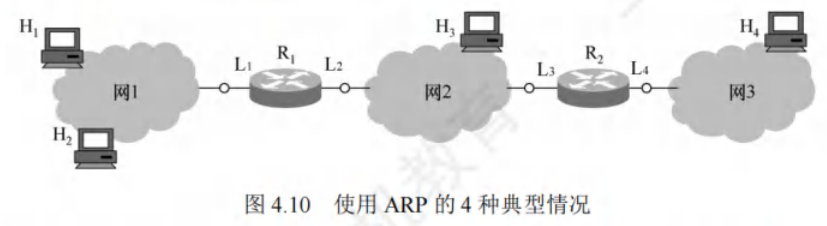

### 动态主机配置协议DHCP
动态主机配置协议（Dynamic Host Configuration Protocol, DHCP）主要用于动态给主机分配IP地址，提供即插即用的连网机制，允许计算机加入新网络并自动获取IP地址，无需手动配置。DHCP属于应用层协议，基于UDP实现。

#### 工作原理
采用客户/服务器模型。需要IP地址的主机启动时，会以广播方式向网络发送发现报文，此时该主机成为DHCP客户。本地网络上所有主机都能收到此广播报文，但只有DHCP服务器会响应。DHCP服务器接收到报文后，先在数据库中查找该计算机的配置信息，若找到则返回对应信息；若未找到，则从IP地址池中选取一个地址分配给该计算机，并以提供报文的形式回复。

#### 交换过程
1. **DHCP发现**：DHCP客户广播“DHCP发现”消息，目的是找到网络中的DHCP服务器以获取IP地址。此消息源地址为0.0.0.0，目的地址为255.255.255.255。
2. **DHCP提供**：DHCP服务器收到“DHCP发现”消息后，广播“DHCP提供”消息，其中包含准备分配给DHCP客户机的IP地址。该消息源地址为DHCP服务器地址，目的地址为255.255.255.255。
3. **DHCP请求**：DHCP客户收到“DHCP提供”消息，若接受该IP地址，则广播“DHCP请求”消息向DHCP服务器请求分配此IP地址。此消息源地址为0.0.0.0，目的地址为255.255.255.255。
4. **DHCP确认**：DHCP服务器广播“DHCP确认”消息，将IP地址正式分配给DHCP客户。消息源地址为DHCP服务器地址，目的地址为255.255.255.255。

#### 相关特性
- **多服务器响应**：网络中可配置多台DHCP服务器，当DHCP客户发出“DHCP发现”消息时，可能收到多个应答。DHCP客户通常会挑选最先到达的应答。
- **租用期**：DHCP服务器分配给客户的IP地址是临时的，客户只能在有限时间内使用，这段时间称为租用期。租用期由DHCP服务器决定，客户也可在报文中提出租用期要求。
- **广播与UDP使用原因**：DHCP客户和服务器通过广播方式交互，因为在DHCP执行初期，客户机不知道服务器IP地址，执行过程中客户机也未分配到IP地址，所以只能采用广播。采用UDP而非TCP是因为TCP需要建立连接，在不知对方IP地址的情况下无法建立连接。
- **应用层协议性质**：DHCP采用客户/服务器模式，客户向服务器请求服务，这是应用层协议的工作方式，其他层次协议一般不具备。

### 网际控制报文协议ICMP
为有效转发IP数据报并提高交付成功率，网络层使用网际控制报文协议（Internet Control Message Protocol, ICMP），用于主机或路由器报告差错和异常情况。ICMP报文封装在IP数据报中发送，但它属于网络层协议。

#### 报文类型
- **ICMP差错报告报文**：由目标主机或到目标主机路径上的路由器向源主机报告差错和异常情况，常见类型有5种：
    1. **终点不可达**：路由器或主机无法交付数据报时，向源点发送该报文。
    2. **源点抑制**：路由器或主机因拥塞丢弃数据报时，向源点发送此报文，提醒源点降低数据报发送速率。
    3. **时间超过**：路由器收到生存时间（TTL）为零的数据报，或终点在规定时间内未收到数据报的全部片时，除丢弃相关数据报外，向源点发送该报文。
    4. **参数问题**：路由器或目的主机收到的数据报首部字段值不正确时，丢弃该数据报并向源点发送此报文。
    5. **改变路由（重定向）**：路由器向主机发送该报文，告知主机下次应将数据报发送给其他路由器以获取更好路由。
- **不发送ICMP差错报告报文的情况**：
    1. 对于ICMP差错报告报文，不再发送ICMP差错报告报文。
    2. 第一个分片的数据报片的所有后续数据报片，不发送ICMP差错报告报文。
    3. 具有多播地址的数据报，不发送ICMP差错报告报文。
    4. 具有特殊地址（如127.0.0.0或0.0.0.0）的数据报，不发送ICMP差错报告报文。
- **ICMP询问报文**：有4种类型，分别是回送请求和回答报文、时间戳请求和回答报文、地址掩码请求和回答报文、路由器询问和通告报文，其中回送请求和回答报文、时间戳请求和回答报文最常用。

#### 常见应用
- **分组网间探测PING**：用于测试两台主机之间的连通性，工作在应用层，直接使用网络层的ICMP回送请求和回答报文。
- **Traceroute（UNIX）/Tracert（Windows）**：用于跟踪分组经过的路由，工作在网络层，使用ICMP时间超过报文。 

## IPv6

### IPv6的特点及产生背景
#### 产生背景
目前广泛使用的IPv4是20世纪70年代设计的，随着互联网几十年的飞速发展，到2011年2月，IPv4地址已耗尽。为解决“IP地址耗尽”问题，有以下三种措施：
1. **采用无类别编址CIDR**：使IP地址的分配更加合理，提升地址使用效率。
2. **采用网络地址转换（NAT）方法**：节省全球IP地址，让多个内部网络设备共享一个或少量外部IP地址。
3. **采用具有更大地址空间的新版本的IPv6**：前两种方法只是延长了IPv4的使用寿命，只有IPv6能从根本上解决IP地址耗尽问题。

#### IPv6的主要特点
1. **更大的地址空间**：这是IPv6最重要的特点。IPv6将地址从IPv4的32位增大到128位，其地址空间是IPv4的$2^{128 - 32}=2^{96}$倍，从长远来看，能满足未来网络发展对地址的大量需求。
2. **扩展的地址层次结构**：由于地址空间巨大，IPv6可以划分出更多的层次，有利于构建更复杂、更合理的网络拓扑结构。
3. **灵活的首部格式**：IPv6定义了许多可选的扩展首部，不仅能提供比IPv4更多的功能，还能提高路由器的处理效率。因为路由器对扩展首部不进行处理，减少了路由器的处理负担。
4. **改进的选项**：IPv6首部长度固定，选项放在有效载荷中，且选项灵活可变。而IPv4规定的选项是固定不变的，放在首部的可变部分，这使得IPv6在功能扩展和应用灵活性上更具优势。
5. **允许协议继续扩充**：IPv6允许不断扩充功能，以适应未来网络发展和新应用的需求。而IPv4的功能是固定不变的，难以满足不断变化的网络环境。
6. **支持即插即用（自动配置）**：IPv6不需要使用DHCP（动态主机配置协议），设备可以自动配置IP地址，简化了网络设备的配置过程，提高了网络部署的便捷性。
7. **支持资源的预分配**：IPv6支持实时音/视频等要求保证一定带宽和时延的应用，能够为这些对网络性能要求较高的应用预先分配所需的网络资源，保障应用的服务质量。
8. **端到端分片**：IPv6只有源主机才能进行分片，是端到端的，不允许类似IPv4传输路径中的路由分片。这种方式减少了中间路由器的处理复杂度，提高了数据传输的效率。
9. **首部长度固定**：IPv6首部长度是固定的40B，而IPv4首部长度是可变的（必须是4B的整数倍）。固定的首部长度使得路由器在处理IPv6数据报时更加高效和统一。
10. **增大了安全性**：身份鉴别和保密功能是IPv6的扩展首部，增强了网络通信的安全性，保护用户数据的隐私和完整性。

虽然IPv6与IPv4不兼容，但总体而言它与所有其他的互联网协议兼容，包括TCP、UDP、ICMP、IGMP和DNS等，只是在少数地方做了必要的修改（大部分是为了处理长地址），这使得IPv6能够在现有互联网基础上逐步推广和应用。 

### IPv6数据报的基本首部
#### 组成结构
IPv6数据报由**基本首部**和**有效载荷（净负荷）** 两部分构成。有效载荷包含零个或多个扩展首部（扩展首部不属于IPv6数据报的首部）以及其后的数据部分。

#### 首部特点
IPv6取消了首部中不必要的功能，使得基本首部的字段数量减少到8个。但由于IPv6地址长度为128位，基本首部的长度增大到40B。

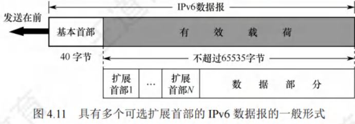

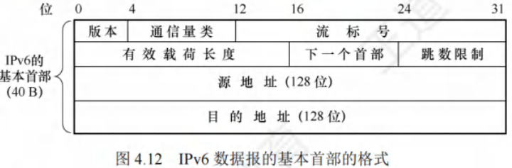

#### 各字段含义
1. **版本**：占4位，用于指明协议的版本。对于IPv6，该字段的值固定为6。
2. **通信量类**：占8位，其作用是区分不同的IPv6数据报的类别或优先级，以此来满足不同类型数据传输的需求。
3. **流标号**：占20位，IPv6引入了“流”的抽象概念。“流”指的是互联网上从特定源点到特定终点（单播或多播）的一系列数据报，例如实时音/视频传输。在“流”经过的路径上，路由器会保证指定的服务质量。属于同一流的数据报都具有相同的流标号。
4. **有效载荷长度**：占16位，它指明了IPv6数据报除基本首部以外的字节数，所有扩展首部都包含在有效载荷之内。该字段的最大值为65535字节。
5. **下一个首部**：占8位，此字段类似于IPv4首部中的协议字段或可选字段。当IPv6没有扩展首部时，其作用与IPv4的协议字段相同，用于指明IPv6数据所运载的数据是何种协议数据单元；当IPv6带有扩展首部时，它标识后面第一个扩展首部的类型。
6. **跳数限制**：占8位，类似于IPv4首部的TTL字段。源点在发出每个数据报时会设定一个限制值（最大为255），路由器每次转发数据报时将该值减1，当减为0时就会丢弃该数据报，以此避免数据报在网络中无限循环。
7. **源地址和目的地址**：各占128位，分别表示数据报的发送端和接收端的IP地址。 

### IPv6地址
#### 目的地址类型
- **单播**：传统的点对点通信方式，数据报从一个发送端传输到一个接收端。
- **多播**：实现一点对多点的通信，数据报会被发送到一组计算机中的每一台。
- **任播**：IPv6新增的地址类型。任播的终点是一组计算机，但数据报只会交付给其中一台，通常是距离最近的那台计算机。

#### 地址表示法
- **冒号十六进制记法**：IPv6标准使用该记法，将地址中的每4位用一个十六进制数表示，并用冒号分隔每16位。例如：4BF5:AA12:0216:FEBC:BA5F:039A:BE9A:2170 。
- **缩写表示法**：
    - 当16位域开头有0时，可缩写，但域中至少保留一个数字。如4BF5:0000:0000:0000:BA5F:039A:000A:2176可缩写为4BF5:0:0:BA5F:39A:A:2176 。
    - 当有相继的0值域时，可用双冒号(::)进一步缩写，但双冒号在一个地址中只能出现一次。如上述地址可更紧凑地写成4BF5::BA5F:39A:A:2176 。

#### 五类地址解释
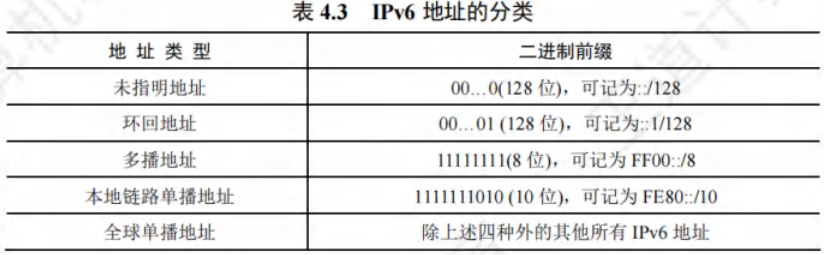
1. **未指明地址**：不能作为目的地址，仅可用于未配置IPv6地址的主机作为源地址。
2. **环回地址**：作用与IPv4的环回地址相同，不过IPv6的环回地址只有一个。
3. **多播地址**：作用和IPv4的多播地址一样，这类地址占IPv6地址空间的1/256。
4. **本地链路单播地址**：类似于IPv4的私有IP地址。
5. **全球单播地址**：使用最广泛的地址类型。采用三级结构：
    - 全球路由选择前缀：占48位，用于互联网中的路由选择，类似于IPv4分类地址中的网络号。
    - 子网标识符：占16位，供各机构构建自己的子网使用。
    - 接口标识符：用于指明主机或路由器的单个网络接口，相当于IPv4分类地址中的主机号。与IPv4不同，IPv6地址的接口标识符有64位，足以对各种接口的硬件地址直接编码，可直接从128位地址的最后64位中提取硬件地址，无需使用地址解析协议（ARP）进行地址解析。

### 从IPv4向IPv6过渡
从IPv4向IPv6过渡需采用逐步演进的方法，新安装的IPv6系统要具备向后兼容的能力，即能接收和转发IPv4分组，并为其选择路由。过渡策略有以下两种：
1. **双协议栈**：在一台设备上同时安装IPv4和IPv6两个协议栈，并分别配置一个IPv4地址和一个IPv6地址。这样设备既能与IPv4网络通信，也能与IPv6网络通信。双协议栈主机通过应用层的域名系统（DNS）来确定目的主机使用的地址类型。若DNS返回IPv4地址，源主机就使用IPv4地址进行通信；若返回IPv6地址，则使用IPv6地址通信。
2. **隧道技术**：当IPv6数据报进入IPv4网络时，将整个IPv6数据报封装成IPv4数据报的数据部分，使IPv6数据报如同在IPv4网络的隧道中传输。当IPv4数据报离开IPv4网络时，再将其数据部分交给主机的IPv6协议进行处理。 

## 路由算法与路由协议

### 路由算法
路由选择协议的核心是路由算法，其目的是在给定一组路由器及连接它们的链路的情况下，找到从源路由器到目的路由器的“最佳”路径，通常“最佳”指具有最低费用的路径。

#### 静态路由与动态路由
根据能否随网络通信量或拓扑自适应调整变化，路由算法可分为两类：
1. **静态路由算法**：由网络管理员手工配置每一条路由。其特点是简单、开销小，但不能及时适应网络状态变化，适用于简单的小型网络。
2. **动态路由算法**：根据网络流量负载和拓扑结构的变化动态调整自身的路由表。能较好地适应网络状态变化，但实现复杂、开销大，适用于较复杂的大网络。常用的动态路由算法又可分为距离 - 向量路由算法和链路状态路由算法。

#### 距离 - 向量路由算法
距离 - 向量算法基于Bellman - Ford算法，用于计算单源最短路径。每个结点以自身为源点执行该算法，从而全局上可解决任意结点对之间的最短路径问题。

##### Bellman - Ford算法基本思想
假设$d_x(y)$表示从结点$x$到结点$y$的带权最短路径的费用，则有$d_x(y)=\min\{c(x,v)+d_v(y)\}$，其中$v$是$x$的所有邻居，$c(x,v)$是从$x$到其邻居$v$的费用。即已知$x$的所有邻居到$y$的最短路径费用后，从$x$到$y$的最短路径费用是对所有邻居$v$的$c(x,v)+d_v(y)$取最小值。所有最短路径算法都依赖“两点之间的最短路径也包含了路径上其他顶点间的最短路径”这一性质。

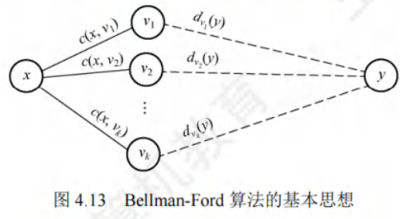

##### 结点维护的路由信息
对于距离 - 向量算法，每个结点$x$维护以下路由信息：
1. 从$x$到每个直接相连邻居$v$的链路费用$c(x,v)$。
2. 结点$x$的距离向量，即$x$到网络中其他结点的费用，是一组距离。
3. 它收到的每个邻居的距离向量，即$x$的每个邻居到网络中其他结点的费用。

##### 算法执行过程
在距离 - 向量算法中，每个结点定期向它的每个邻居发送它的距离向量副本。当结点$x$从它的任何一个邻居$v$接收到一个新距离向量时，它首先保存$v$的距离向量，然后使用Bellman - Ford公式$d_x(y)=\min\{c(x,v)+d_v(y)\}$更新自己的距离向量。若结点$x$的距离向量因这个更新步骤而改变，则结点$x$接下来继续向它的每个邻居发送其更新后的距离向量。

例如图4.14，初始化时各结点之间未交换路由信息，各结点的初始化距离向量等于它到每个直接相连邻居$v$的费用。初始化后，每个结点第一次向它的所有邻居发送其距离向量，接收到更新报文后，每个结点重新计算自己的距离向量。如结点$x$计算：$d_x(x)=0$；$d_x(y)=\min\{c(x, y)+d_y(y), c(x,z)+d_z(y)\} = \min\{2 + 0,7 + 1\}=2$；$d_x(z)=\min\{c(x,y)+d_y(z), c(x, z) + d_z(z)\} = \min\{2 + 1, 7 + 0\} =3$。结点$x$到结点$z$以及结点$z$到结点$x$的最低费用都从7变成了3。结点的距离向量变化后，再次向它们的邻居发送更新的距离向量，无变化的结点不用发送更新报文。接收到邻居的更新报文后，结点又重新计算它们的距离向量，若此次没有结点更新，则算法进入静止状态。

显然，更新报文的大小与网络中的结点数目成正比，大型网络将导致很大的更新报文。最常见的距离 - 向量路由算法是RIP算法，它采用“跳数”作为距离的度量。

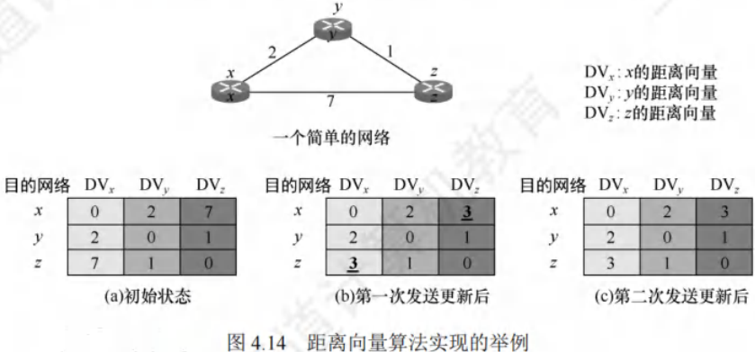

#### 链路状态路由算法
链路状态是指本路由器都和哪些路由器相邻，以及相应链路的代价。链路状态算法要求每个结点都具有全网拓扑结构图（全网一致），执行两项任务：一是主动测试所有相邻结点的状态；二是定期地将链路状态传播给所有其他结点。因此每个结点都知道全网结点数量、哪些结点相连及代价，可使用Dijkstra最短路径算法计算出到达其他结点的最短路径。

在链路状态算法中，结点每收到一个链路状态报文，便用其更新自己的网络状态“视野图”，一旦链路状态发生变化，就使用Dijkstra算法重新计算到达所有其他结点的最短路径。

因为一个结点的链路状态只涉及相邻结点的连通状态，与整个互联网的规模无直接关系，所以链路状态算法适用于大型的或路由信息变化频繁的互联网环境。

链路状态算法的主要优点：
1. 每个结点都使用同样的链路状态数据独立地计算路径，不依赖中间结点的计算。
2. 链路状态报文不加改变地传播，易于查找故障。
3. 当一个结点从所有其他结点接收到报文时，它就在本地立即计算出正确的路径，保证一步汇聚。
4. 链路状态报文仅运载来自单个结点关于直接链路的信息，其大小与网络中的结点数目无关，所以比距离 - 向量算法有更好的规模可伸展性。

两种路由算法的比较：
- 距离 - 向量算法中，每个结点仅与它的直接邻居交谈，向邻居发送自己的路由表，其大小取决于网络中的结点数目，代价较大。
- 链路状态算法中，每个结点通过广播的方式与所有其他结点交谈，但只告诉它们与它直接相连的链路的费用。

典型的链路状态路由算法是OSPF算法。 

### 分层次的路由选择协议
互联网采用自适应、分布式路由选择协议。因规模巨大且部分联网单位不愿公开网络布局，所以采用分层次的路由选择协议。互联网被划分为多个较小的自治系统（AS），AS是在单一技术管理下的一组路由器，使用同一种AS内部路由选择协议和共同度量，对其他AS呈现统一路由选择策略。基于此，互联网的路由选择协议分为两类：
1. **内部网关协议（IGP）**：在自治系统内部使用，与其他自治系统的路由选择协议无关。常见的有RIP和OSPF。
2. **外部网关协议（EGP）**：当源主机和目的主机处于不同自治系统时，用于在自治系统边界传递路由选择信息。目前使用最多的是BGP - 4。

自治系统间的路由选择为域间路由选择，自治系统内部的为域内路由选择。如图4.15所示，每个自治系统可自主选择内部网关协议（如RIP或OSPF），同时部分路由器（如R1和R2）除运行内部网关协议外，还需运行外部网关协议（如BGP - 4）。

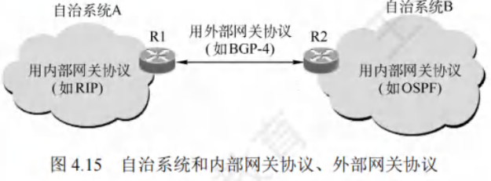

### 路由信息协议（RIP）
RIP是内部网关协议IGP中最先广泛应用的协议，是分布式的基于距离向量的路由选择协议。

#### RIP的规定
1. 网络中每个路由器维护自身到其他每个目的网络的距离记录，即距离向量。
2. 使用跳数（Hop Count）衡量到达目的网络的距离，规定到直接连接网络的距离为1，每经过一个路由器距离加1。
3. 认为跳数少的路由是好路由。
4. 允许路径最多包含15个路由器，距离等于16表示网络不可达，所以RIP只适用于小型互联网，规定最高跳数可防止分组在环路循环，减少网络拥塞。
5. 每个路由表项包含三个关键字段：<目的网络N, 距离d, 下一跳路由器地址X>。

#### RIP的特点
1. **交换对象**：仅与直接相邻的路由器交换信息。
2. **交换内容**：交换本路由器的全部路由表信息。
3. **交换时间**：按固定时间间隔（如30秒）交换路由信息，网络拓扑变化时及时通告。
路由器初始仅知道到直接相连网络的距离为1，通过与相邻路由器周期性交换和更新路由信息，最终所有路由器会知道到达本自治系统内任何网络的最短距离和下一跳路由器地址，此过程称为收敛。
RIP是应用层协议，使用UDP传送数据（端口520），它选择的路径不一定时间最短，但一定是跳数最少的。

#### RIP的距离向量算法
对相邻路由器发来的RIP报文，执行以下步骤：
1. 修改相邻路由器X发来的RIP报文，将“下一跳”字段地址改为X，“距离”字段值加1。
2. 对修改后的报文中每个项目：
    - 若原路由表无目的网络N，将该项目添加到路由表。
    - 若原路由表有目的网络N且下一跳路由器地址是X，用收到的项目替换原表项目。
    - 若原路由表有目的网络N但下一跳路由器地址不是X，且收到项目的距离d小于原表距离，则更新。
    - 其他情况不做处理。
3. 若180秒（RIP默认超时时间）未收到相邻路由器的更新路由表，将此相邻路由器记为不可达，距离设为16。

#### 举例说明
已知路由器R6和R4相邻，表4.4(a)是R6的路由表，收到R4发来的路由更新信息如表4.4(b)。
先将R4发来的路由表中各项目距离加1，下一跳路由器改为R4，得到表4.5(a)。与R6的路由表比较：
- 第一行Net1在原表中无，添加到原表。
- 第二行Net2在原表中有且下一跳是R4，更新。
- 第三行Net3在原表中有但下一跳不同，新距离2小于原表4，更新。
更新后的R6路由表如表4.5(b)。

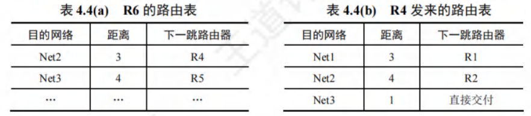
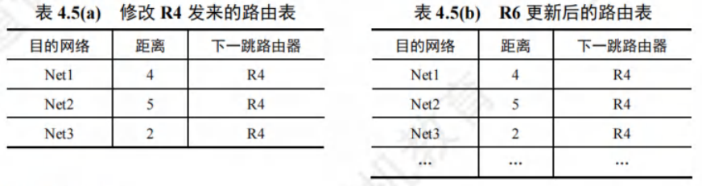

### RIP的优缺点
#### 优点
1. **实现与开销**：RIP的实现方式相对简单，在运行过程中产生的开销较小。同时，其收敛过程速度较快，能够在较短时间内让网络中的路由器对路由信息达成一致。
2. **好消息传播**：当路由器发现了更短的路由时，这种更新信息能够快速传播。在较短的时间内，网络中的所有路由器都可以接收到这个好消息并更新自己的路由表，即所谓的“好消息传播得快”。

#### 缺点
1. **网络规模限制**：RIP对网络规模有一定的限制，它所允许使用的最大距离为15，当距离达到16时表示网络不可达。这使得RIP仅适用于规模较小的网络。
2. **信息交换开销**：路由器之间交换的是完整的路由表信息。随着网络规模的不断增大，路由表的内容会越来越多，这就导致信息交换的开销也会相应增大。
3. **慢收敛现象**：当网络出现故障时，路由器之间需要经过反复多次的信息交换才能完成收敛过程。也就是说，故障消息需要经过较长的时间才能传送到所有的路由器，这种现象被称为“慢收敛”，即“坏消息传播得慢”。

#### 举例说明
假设图4.16中的路由器都采用RIP交换路由信息，初始时R1到网络N的距离为4，且R1和R2均已收敛。

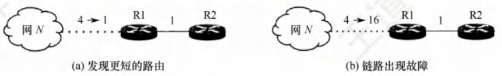

- **好消息传播得快**：在图4.16(a)中，某时刻R1的某个端口检测到“到N更短的链路”，R1到N的距离由4变为1。R1计算其到N的最新距离为$min\{1,1 + R2到N的距离\}=min\{1,1 + 5\}=1$，并将此信息通知给邻居R2。R2收到后，更新其到N的距离为2，并通知邻居R1。R1收到后，由于其到N的最短距离未变，不再发送通知，算法进入静止状态。由此可见，R2到N的距离减少的好消息通过RIP得到了迅速传播。
- **坏消息传播得慢**：在图4.16(b)中，某时刻R1的某个端口检测到“N不可达”，即距离变为16。R1计算其到N的最新距离为$min\{16,1 + R2到N的距离\}=min\{16,1 + 5\}=6$。从网络全局的视角来看，经过R2的这个新距离显然是错误的。R1算出到N的最新距离后，通知邻居R2。R2收到后，更新其到N的距离为7，并通知邻居R1。R1收到后，计算其到N的距离为$min\{16,1 + R2到N的距离\}=min\{16,1 + 7\}=8$，继续通知邻居R2……如此循环，直到R2最终算出它经由R1到达N的距离为16为止。可见，RIP关于链路故障或距离增加的坏消息传播得很慢。 

### 开放最短路径优先协议OSPF

### OSPF协议的基本特点
开放最短路径优先（OSPF）协议是分布式链路状态路由算法的典型代表，属于内部网关协议（IGP）。与RIP相比，主要有以下4点区别：
1. **信息发送范围**：OSPF使用洪泛法向本自治系统中所有路由器发送信息；而RIP仅向自己相邻的几个路由器发送信息。
2. **发送信息内容**：OSPF发送的是与本路由器相邻的所有路由器的链路状态，这只是路由器所知道的部分信息；RIP发送的是本路由器所知道的全部信息，即整个路由表。
3. **信息发送时机**：OSPF只有当链路状态发生变化时，才用洪泛法向所有路由器发送此信息，且更新过程收敛快，不会出现RIP“坏消息传得慢”的问题；RIP不管网络拓扑是否发生变化，路由器之间都要定期交换路由表信息。
4. **协议层次与传输方式**：OSPF是网络层协议，不用UDP或TCP，直接用IP数据报传送（IP数据报首部的协议字段为89）；RIP是应用层协议，在传输层使用UDP。用UDP传送是将信息作为UDP报文的数据部分，直接使用IP数据报传送是将信息直接作为IP数据报的数据部分，RIP报文是作为UDP数据报的数据部分。

除上述区别外，OSPF还有以下特点：
1. **路由代价设置**：允许对每条路由设置不同的代价，可针对不同类型的业务计算不同的路由。
2. **负载均衡**：若到同一个目的网络有多条相同代价的路径，可将通信量分配给这几条路径。
3. **鉴别功能**：OSPF分组具有鉴别功能，保证仅在可信赖的路由器之间交换链路状态信息。
4. **编址支持**：支持可变长度的子网划分和无分类编址CIDR。
5. **状态序号**：每个链路状态都带上一个32位的序号，序号越大，状态越新。

### OSPF的基本工作原理
各路由器之间频繁交换链路状态信息，最终所有路由器都能建立一个链路状态数据库，即全网的拓扑结构图。每个路由器利用链路状态数据库中的数据，使用Dijkstra算法计算自己到达各目的网络的最优路径，构造出自己的路由表。当链路状态发生变化时，每个路由器重新计算到达各目的网络的最优路径，构造出新的路由表。虽然Dijkstra算法能计算出完整的最优路径，但路由表中只存储“下一跳”信息。

为用于规模很大的网络，OSPF将一个自治系统再划分为若干更小的范围，称为区域。划分区域可将利用洪泛法交换链路状态信息的范围局限在每个区域而非整个自治系统，从而减少整个网络上的通信量。

### OSPF的五种分组类型
1. **问候分组**：用来发现和维持邻站的可达性。
2. **数据库描述分组**：向邻站给出自己的链路状态数据库中的所有链路状态项目的摘要信息。
3. **链路状态请求分组**：向对方请求发送某些链路状态项目的详细信息。
4. **链路状态更新分组**：用洪泛法对全网更新链路状态，是OSPF最核心的部分。
5. **链路状态确认分组**：对链路更新分组的确认。

在网络中通常传送的OSPF分组大多是问候分组。两个相邻路由器通常每隔10秒要交换一次问候分组，以便知道哪些站可达。若有40秒没有收到某个相邻路由器发来的问候分组，则认为该相邻路由器不可达，应立即修改链路状态数据库，并重新计算路由表。

在路由器刚开始工作时，OSPF让每个路由器使用数据库描述分组和相邻路由器交换本数据库中已有的链路状态摘要信息。然后，路由器使用链路状态请求分组，向对方请求发送自己所缺少的某些链路状态项目的详细信息。经过一系列的这种分组交换，就建立了全网同步的链路数据库。

在网络运行过程中，只要一个路由器的链路状态发生变化，该路由器就要使用链路状态更新分组，用洪泛法向全网更新链路状态。其他路由器在收到更新分组后要发送确认。

为确保链路状态数据库与全网的状态保持一致，OSPF还规定每隔一段时间（如30分钟）要刷新一次数据库中的链路状态。因为一个路由器的链路状态只涉及与相邻路由器的连通状态，与整个网络的规模并无直接关系，所以当互联网规模很大时，OSPF要比RIP好得多。

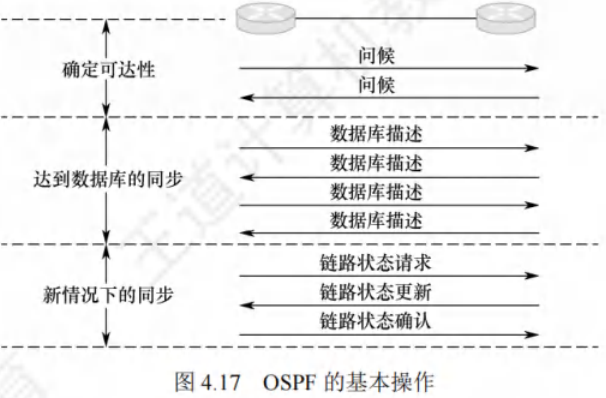

### 边界网关协议BGP
边界网关协议（Border Gateway Protocol, BGP）是用于不同自治系统（AS）的路由器之间交换路由信息的外部网关协议，常用于互联网的网关之间。

#### 使用环境与特点
内部网关协议主要关注数据报在一个AS内高效传输，无需考虑其他策略。而BGP使用环境不同，原因如下：
1. **规模问题**：互联网规模巨大，AS之间路由选择困难，每个主干网路由器表中的项目数庞大，寻找最佳路由不现实。
2. **策略因素**：AS之间的路由选择需考虑政治、安全、经济等因素。

因此，BGP只能力求寻找一条能到达目的网络且较好的路由（避免兜圈子），而非最佳路由。BGP采用路径向量路由选择协议，与距离向量协议（如RIP）和链路状态协议（如OSPF）有很大区别。BGP是应用层协议，基于TCP。

#### 工作原理
1. **BGP发言人选择**：配置BGP时，每个AS的管理员要选择至少一个路由器作为该AS的“BGP发言人”，通常是BGP边界路由器。
2. **建立连接与会话**：一个BGP发言人与其他AS中的BGP发言人交换路由信息时，先建立TCP连接，再在此连接上交换BGP报文以建立BGP会话，利用会话交换路由信息。使用TCP连接交换路由信息的两个BGP发言人互为邻站或对等站。每个BGP发言人除运行BGP外，还需运行该AS所用的内部网关协议，如OSPF或RIP。

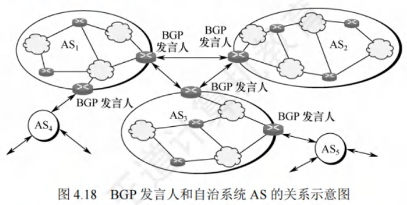

3. **交换网络可达性信息**：BGP所交换的网络可达性信息是到达某个网络要经过的一系列自治系统。BGP发言人互相交换该信息后，根据所用策略从收到的路由信息中找出到达各自治系统的较好路由。

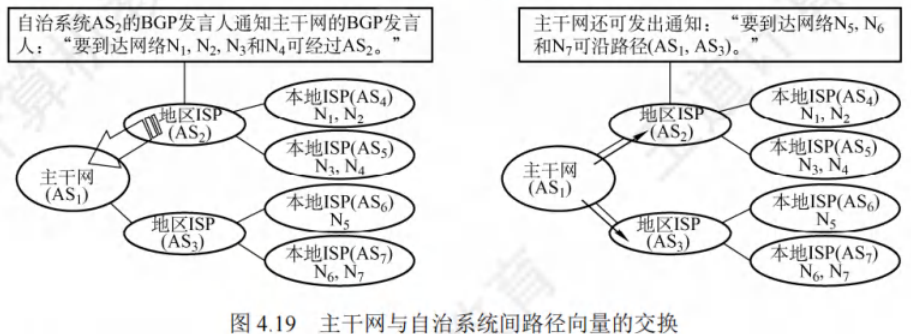

#### BGP的特点
1. **结点数量级**：BGP交换路由信息的结点数量级是AS个数的数量级，远少于这些AS中的网络数。
2. **路由选择复杂度**：寻找较好路径取决于找准正确的BGP发言人，每个AS中BGP发言人（或边界路由器）数目少，使AS之间的路由选择不过分复杂。
3. **支持CIDR**：BGP支持CIDR，其路由表包括目的网络前缀、下一跳路由器，以及到达该目的网络要经过的各个自治系统序列。
4. **路由表更新**：BGP刚运行时，邻站交换整个BGP路由表，之后只更新有变化的部分，节省网络带宽和路由器处理开销。

#### BGP - 4的四种报文
1. **打开（Open）报文**：用于与相邻的另一个BGP发言人建立关系，初始化通信。
2. **更新（Update）报文**：通知某一路由的信息，列出要撤销的多条路由，是BGP的核心内容。BGP发言人可用其撤销曾经通知过的路由，或宣布增加新的路由。
3. **保活（Keepalive）报文**：周期性地证实邻站的连通性，一般每隔30秒交换一次，报文只有19B，不会造成太大网络开销。
4. **通知（Notification）报文**：发送检测到的差错。

若一个BGP发言人想与另一个AS的BGP发言人建立邻站关系，发送Open报文，若对方接受则用Keepalive报文响应。邻站关系建立后，双方需周期性交换Keepalive报文维持关系。

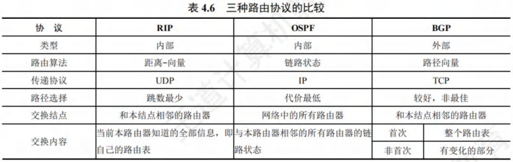

## IP多播

### 多播的概念
多播是一种一对多的通信方式，源主机一次发送的单个分组可以抵达用一个组地址标识的若干目的主机。在互联网上进行的多播，被称为IP多播。与单播相比，在一对多的通信场景中，多播能大大节约网络资源。例如视频服务器向90台主机传送同样的视频节目，多播时仅发送一份数据且只需发送一次，只有在传送路径出现分岔时才将分组复制后继续转发，这减轻了发送者的负担和网络的负载。多播的实现需要路由器的支持，能够运行多播协议的路由器称为多播路由器。

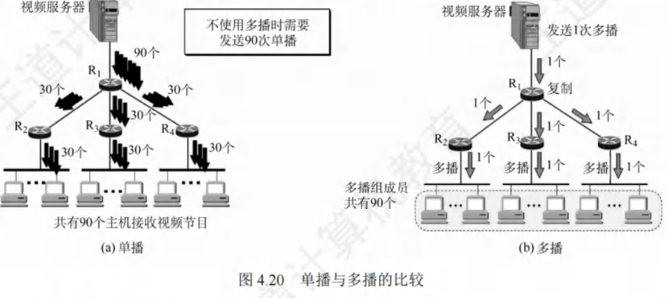

### IP多播地址
- **地址定义**：多播数据报的源地址是源主机的IP地址，目的地址是IP多播地址，即IPv4中的D类地址。D类地址前四位是1110，范围是224.0.0.0 - 239.255.255.255，每个D类IP地址标志一个多播组，一台主机可以随时加入或离开一个多播组。
- **与一般IP数据报区别**：多播数据报使用D类IP地址作为目的地址，并且首部中的协议字段值是2，表明使用IGMP协议。需要注意：
    - 多播数据报“尽最大努力交付”，不提供可靠交付。
    - 多播地址只能用于目的地址，不能用于源地址。
    - 对多播数据报不产生ICMP差错报文。
- **多播类型**：IP多播分为两种，一是只在本局域网上进行硬件多播，二是在互联网的范围内进行多播。目前大部分主机通过局域网接入互联网，所以在互联网上进行多播的最后阶段，还是要把多播数据报在局域网上用硬件多播交付给多播组的所有成员。
- **协议应用**：多播机制仅应用于UDP，它能将报文同时发送给多个接收者。而TCP是面向连接的协议，会一对一地发送数据。

### 在局域网上进行硬件多播
局域网支持硬件多播，将IP多播地址映射成多播MAC地址，把IP多播数据报封装在局域网的MAC帧中，MAC帧首部的目的MAC地址字段设置为由IP多播地址映射成的多播MAC地址，就能利用硬件多播实现局域网内的IP多播。
IANA拥有的以太网多播地址范围是从01 - 00 - 5E - 00 - 00 - 00到01 - 00 - 5E - 7F - FF - FF，其中只有23位可用作多播，只能和D类IP地址中的23位有一一对应关系，D类IP地址可供分配的有28位，前5位无法映射到多播MAC地址。例如，IP多播地址224.128.64.32（即E0 - 80 - 40 - 20）和224.0.64.32（即E0 - 00 - 40 - 20）转换成以太网的硬件多播地址都是01 - 00 - 5E - 00 - 40 - 20。由于多播IP地址与以太网MAC地址的映射关系不是唯一的，收到多播数据报的主机，还要在IP层利用软件进行过滤，丢弃不是本主机要接收的数据报。

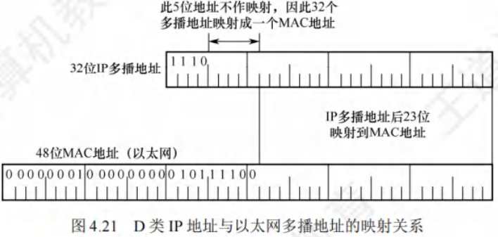

### IGMP与多播路由协议
- **IGMP功能**：路由器要获得多播组的成员信息，需要利用网际组管理协议（Internet Group Management Protocol, IGMP）。IGMP让连接到本地局域网上的多播路由器知道本局域网上是否有主机参加或退出了某个多播组，但它不是在互联网范围内对所有多播组成员进行管理的协议，不知道IP多播组包含的成员数，也不知道成员分布在哪些网络上。IGMP报文被封装在IP数据报中传送，也向IP提供服务，被视为整个网际协议IP的一个组成部分。
- **IGMP工作阶段**：
    - **第一阶段**：当某台主机加入新的多播组时，向多播组的多播地址发送一个IGMP报文，声明自己要成为该组的成员。本地的多播路由器收到IGMP报文后，利用多播路由选择协议，把这种组成员关系转发给互联网上的其他多播路由器。
    - **第二阶段**：组成员关系是动态的。本地多播路由器要周期性地探询本地局域网上的主机，了解这些主机是否仍继续是组的成员。只要对某个组有一台主机响应，多播路由器就认为这个组是活跃的；若一个组经过几次探询后仍无主机响应，多播路由器就认为本网络上的主机都已离开这个组，不再把该组的成员关系转发给其他多播路由器。
- **多播路由选择**：多播路由选择要找出以源主机为根结点的多播转发树，使每个分组在每条链路上传送一次，即多播转发树上的路由器不会收到重复的多播数据报。不同的多播组对应不同的多播转发树，同一个多播组对不同的源点也会有不同的多播转发树。 

## 移动IP

### 移动IP的概念
移动IP技术能让移动站以固定的IP地址跨越不同网络进行漫游，同时保证基于IP的网络权限在漫游过程中不发生变化，其目标是将分组自动投递给移动站。移动站是指连接点可从一个网络或子网转移到另一个网络或子网的主机。

移动IP定义了三种功能实体：
1. **移动结点**：拥有永久IP地址的移动主机。
2. **本地代理（归属代理）**：通常是连接在归属网络（移动站原始连接的网络）上的路由器。
3. **外地代理**：一般是连接在被访网络（移动站移动到另一地点后所接入的网络）上的路由器。

需要注意的是，若用户将笔记本关机后更换地点上网，通过DHCP自动获取新IP地址，这不属于移动IP。而要使移动站在移动中保持TCP连接不中断，就需让笔记本的IP地址在移动过程中保持不变，这正是移动IP要解决的问题。

### 移动IP的通信过程
可以用本科毕业同学保持联系的例子来理解移动IP的通信原理。毕业时同学们彼此留下家庭地址（永久地址），之后若要联系某同学，写信寄到其永久地址，由家长转交。

在移动IP中：
- 每个移动站有原始的永久地址（归属地址），其原始连接的网络是归属网络，永久地址和归属网络的关联保持不变。例如图4.22中，移动站A的永久地址是131.8.6.7/16，归属网络是131.8.0.0/16，归属代理通常是连接到归属网络的路由器，其代理功能在应用层完成。
- 当移动站移动到另一地点，所接入的网络是被访网络。如图4.22中，移动站A移动到被访网络15.0.0.0/8，被访网络中的外地代理有两个重要功能：
    - 为移动站创建临时的转交地址，移动站A的转交地址是15.5.6.7/8，转交地址的网络号和被访网络一致。
    - 及时把移动站的转交地址告知其归属代理。

需要注意，转交地址供移动站、归属代理及外地代理使用，各种应用程序不会使用。外地代理向连接在被访网络上的移动站发送IP分组时，直接使用移动站的MAC地址。

以图4.22中通信者B和移动站A通信为例，移动IP的基本通信流程如下：
1. 移动站A在归属网络时，按传统的TCP/IP方式进行通信。
2. 移动站A漫游到被访网络时，向外地代理登记获取临时的转交地址，外地代理向A的归属代理登记该转交地址。
3. 归属代理得知移动站A的转交地址后，构建通向转交地址的隧道，将截获的发往A的IP分组再封装，通过隧道发送给被访网络的外地代理。
4. 外地代理将收到的封装IP分组拆封，恢复成原始IP分组后发送给移动站A，使A在被访网络能收到这些分组。
5. 移动站A在被访网络对外发送IP分组时，仍用自己的永久地址作为源地址，直接通过被访网络的外部代理发送，无须归属代理转发。
6. 移动站A移动到另一个被访网络时，在新外地代理处登记，新外地代理将A的新转交地址告知其归属代理，无论A如何移动，其收到的IP分组都由归属代理转发。
7. 移动站A回到归属网络时，向归属代理注销转交地址。

为支持移动性，网络层需增加新功能：
1. 移动站到外地代理的登记协议。
2. 外地代理到归属代理的登记协议。
3. 归属代理数据报封装协议。
4. 外地代理拆封协议。

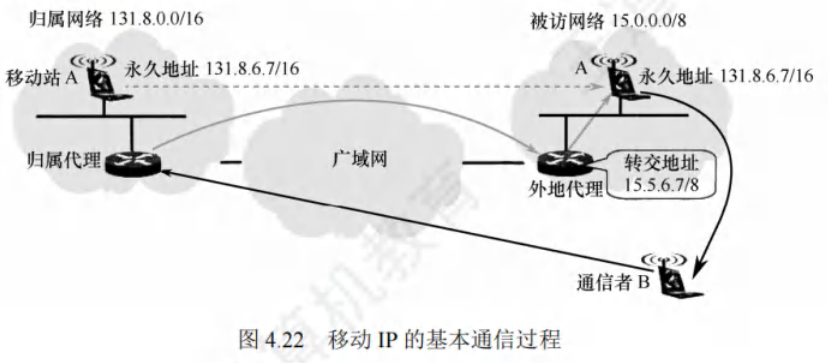

## 网络层设备

### 冲突域与广播域
#### 冲突域
冲突域指连接到同一物理介质上的所有结点的集合，这些结点之间存在介质争用现象。在OSI参考模型中，冲突域属于第1层的概念。像集线器、中继器这类简单无脑复制转发信号的第1层设备所连接的结点都处于同一个冲突域，它们无法划分冲突域。而第2层的网桥、交换机以及第3层的路由器设备能够划分冲突域。

#### 广播域
广播域是接收同样广播消息的结点集合。集合中任一结点发送广播帧，其他能收到该帧的结点都属于该广播域。在OSI参考模型里，广播域被视为第2层的概念。第1层的集线器等和第2层的交换机等设备所连接的结点都在同一个广播域。路由器作为第3层设备，可以划分广播域，即能连接不同的广播域。通常所说的局域网（LAN）特指使用路由器分割的网络，也就是广播域。

### 路由器的组成与功能
路由器是有多个输入/输出端口的专用计算机，其任务是连接不同网络（包括异构网络）并完成分组转发。多个逻辑网络（多个广播域）互连时必须使用路由器。

当源主机向目标主机发送数据报时，路由器会先判断源主机与目标主机是否在同一网络。若在同一网络则直接交付，无需路由器；若不在同一网络，路由器会依据转发表（由路由表得出）将分组转发给下一个路由器，这就是间接交付。所以，同一网络内传递数据无需路由器，跨网络通信必须通过路由器转发。例如，路由器可连接不同的LAN、VLAN、WAN，或者将LAN和WAN互连，同时它能隔离广播域。

从结构上看，路由器由路由选择和分组转发两部分构成，从模型角度看，它是网络层设备，实现了网络模型的下三层，即物理层、数据链路层和网络层。

若一个存储转发设备实现了某个层次的功能，它就能互连两个在该层次使用不同协议的网段。例如网桥实现了物理层和数据链路层，可互连两个物理层和数据链路层不同的网段；但中继器虽是实现了物理层的设备，却不能互连两个物理层不同的网段，因为它不是存储转发设备，属于直通式设备。

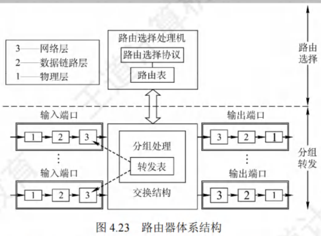

#### 路由选择部分
也叫控制部分，核心构件是路由选择处理机，其任务是根据选定的路由选择协议构造路由表，并且经常或定期和相邻路由器交换路由信息，以此不断更新和维护路由表。

#### 分组转发部分
由交换结构、一组输入端口和一组输出端口组成。
 - **交换结构**：也称交换组织，根据转发表处理分组，将从某个输入端口进入的分组从合适的输出端口转发出去，它本身就像一个“在路由器中的网络”。
 - **输入和输出端口**：路由器的端口包含物理层、数据链路层和网络层的处理模块。输入端口在物理层接收比特流，在数据链路层提取帧，剥去帧的首部和尾部后，分组进入网络层处理模块；输出端口执行相反操作。端口的网络层处理模块设有缓冲队列，用于暂存待处理或已处理完待发送的分组，还可进行差错检测。若分组处理速率跟不上进入队列的速率，后续进入队列的分组会因缓冲区满而被丢弃。通常路由器的端口兼具输入和输出功能，图中分开表示是为便于理解。

### 路由表与分组控制
#### 路由表
路由表依据路由选择算法得出，主要用于路由选择。标准的路由表通常有4个项目：目的网络IP地址、子网掩码、下一跳IP地址、接口。例如在图4.24所示网络拓扑中，R1的路由表见表4.7，该路由表包含到互联网的默认路由。

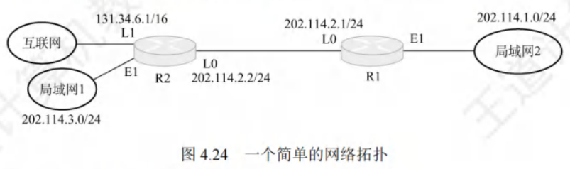
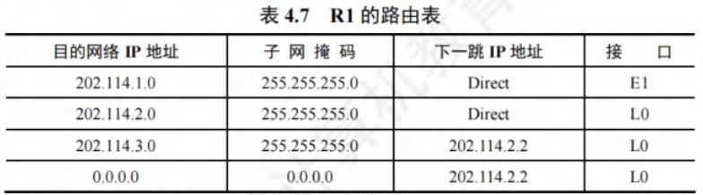

#### 转发表
转发表从路由表得出，表项与路由表项有直接对应关系，但格式不同。转发表结构应使查找过程最优化（路由表则需对网络拓扑变化的计算最优化）。转发表包含分组的目的地址和下一跳（实际为MAC地址）。为减少转发表的重复项目，可用默认路由代替所有具有相同“下一跳”的项目，并将默认路由优先级设得比其他项目低，如图4.25所示。路由表通常用软件实现，转发表可用软件甚至特殊硬件实现。

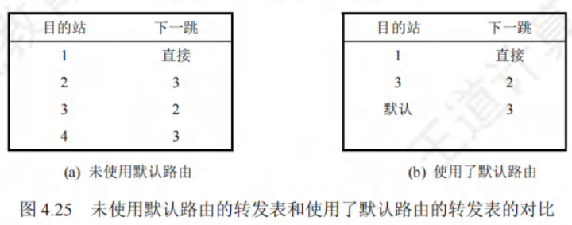

#### 转发与路由选择的区别
 - **转发**：路由器根据转发表把收到的IP数据报从合适的端口转发出去，仅涉及一个路由器。
 - **路由选择**：涉及很多路由器，路由表是众多路由器协同工作的结果。这些路由器依据复杂的路由算法，根据从相邻路由器获取的网络拓扑变化情况，动态改变所选择的路由，进而构造出整个路由表。

需要注意，路由表不等于转发表，分组的实际转发是通过直接查找转发表，而非路由表。 
