# 应用层

[toc]

## 网络应用模型

### 客户/服务器模型

在客户/服务器（Client/Server, C/S）模型中，存在一个始终开启的主机，即**服务器**，它处理众多来自其他被称为**客户机**的主机请求。其工作流程如下：
1. **服务器**：处于接收请求状态。
2. **客户机**：发出服务请求，等待接收结果。
3. **服务器处理**：收到请求后，分析并进行必要处理，将结果发送给客户机。

服务器运行专门的服务程序，可同时处理多个远程或本地客户请求。客户程序需知晓服务器程序地址，而服务器启动后持续运行，被动等待接收各地客户请求，无需知道客户程序地址。

**客户/服务器模型最主要特征**：客户是服务请求方，服务器是服务提供方。例如Web应用程序，Web服务器服务于客户机上浏览器的请求，收到客户机对某对象的请求时，向其发送所请求对象以响应。常见应用包括Web、文件传输协议（FTP）、远程登录和电子邮件等。

**客户/服务器模型主要特点**：
- **管理集中**：网络中各计算机地位不平等，服务器通过限制用户权限管理客户机，网络管理集中方便。
- **客户机不直接通信**：如Web应用中，两个浏览器不直接通信。
- **可扩展性不佳**：受服务器硬件和网络带宽限制，服务器支持的客户机数量有限。

### P2P模型

在C/S模型中，服务器性能决定整个系统性能，大量用户请求时易成瓶颈。P2P模型（Peer - to - Peer）的理念是，网络传输内容不再仅存于中心服务器，每个结点同时具备下载、上传功能，权利和义务大体对等。

在P2P模型中，计算机无固定的客户和服务器划分，任意一对计算机（对等方Peer）直接通信。本质上，P2P模型仍使用客户/服务器模型，每个结点既作为客户访问其他结点资源，又作为服务器提供资源给其他结点访问。

**与C/S模型相比，P2P模型优点**：
- **减轻服务器压力**：减轻服务器计算压力，消除对单个服务器的完全依赖，任务分配到各结点，提高系统效率和资源利用率。
- **直接共享文档**：多个客户机可直接共享文档。
- **可扩展性好**：传统服务器受响应和带宽限制，只能接受一定数量请求，P2P模型可扩展性强。
- **网络健壮性强**：单个结点失效不影响其他结点。

**P2P模型缺点**：在获取服务时，需给其他结点提供服务，占用较多内存，影响整机速度，如P2P下载会损伤硬盘。据统计，当前P2P程序占互联网50% - 90%的流量，导致网络拥塞，各大ISP（如电信、网通等互联网服务提供商）通常反对P2P应用。

## 域名系统

域名系统（Domain Name System, DNS）是因特网使用的命名系统，用于将便于人们记忆的、具有特定含义的主机名转换为便于机器处理的IP地址 。相较于IP地址，人们更倾向于使用有特定含义的字符串标识因特网上的计算机。需重点注意，**DNS系统采用客户/服务器模型，协议运行在UDP之上，使用53号端口**。

从概念上，DNS可分为三部分：层次域名空间、域名服务器和解析器。

### 层次域名空间

因特网采用层次树状结构的命名方法。任何连接到因特网的主机或路由器，都有唯一的层次结构名称，即域名（Domain Name）。域（Domain）是名字空间中一个可被管理的划分，域可进一步划分为子域，从而形成顶级域、二级域、三级域等。

每个域名由标号序列组成，标号之间用点（"."）隔开。例如，王道论坛用于提供WWW服务的服务器域名由三个标号组成，其中标号com是顶级域名，标号cskaoyan是二级域名，标号www是三级域名。

关于域名中的标号，注意事项如下：
- **大小写不敏感**：标号中的英文不区分大小写。
- **标点符号限制**：标号中除连字符（-）外不能使用其他标点符号。
- **长度限制**：每个标号不超过63个字符，多标号组成的完整域名最长不超过255个字符。
- **书写顺序**：级别最低的域名写在最左边，级别最高的顶级域名写在最右边。

**顶级域名（Top Level Domain, TLD）分为三大类**：
- **国家（地区）顶级域名（nTLD）**：代表国家和某些地区的域名，如".cn"表示中国，".us"表示美国，".uk"表示英国。
- **通用顶级域名（gTLD）**：常见的有".com"（公司）、".net"（网络服务机构）、".org"（非营利性组织）、".edu"（教育机构）、".gov"（国家或政府部门）等。
- **基础结构域名（arpa）**：用于反向域名解析，即把IP地址反向解析为域名。

### 域名服务器

域名到IP地址的解析由运行在域名服务器上的程序完成。一个服务器所负责管辖（或有权限）的范围称为区（小于或等于“域”），一个区中的所有结点必须连通，每个区设置相应的权限域名服务器，保存该区中所有主机的域名到IP地址的映射。

每个域名服务器既能进行部分域名到IP地址的解析，还需具备联系其他域名服务器的信息，以便在自身无法转换时，知晓应前往何处查找其他域名服务器。

**DNS使用大量域名服务器，以层次方式组织，不存在拥有因特网上所有主机映射的单一域名服务器，该映射分布在所有域名服务器上。有4种类型的域名服务器**：
1. **根域名服务器**：是最高层次的域名服务器，知晓所有顶级域名服务器的域名和IP地址，至关重要。本地域名服务器若无法解析域名，首先求助于根域名服务器。因特网上有13个根域名服务器，每个“服务器”实际是冗余服务器的集群，以保障安全性和可靠性。根域名服务器管辖顶级域（如.com），通常不直接将待查询域名转换为IP地址，而是告知本地域名服务器下一步应查找的顶级域名服务器。
2. **顶级域名服务器**：负责管理在该顶级域名服务器注册的所有二级域名。收到DNS查询请求时，给出相应回答（可能是最终结果，也可能是下一步应查找的域名服务器的IP地址）。
3. **权限域名服务器（授权域名服务器）**：每台主机都需在权限域名服务器处登记，为确保可靠工作，一台主机最好至少有两个权限域名服务器。许多域名服务器同时充当本地域名服务器和权限域名服务器，权限域名服务器总能将其管辖的主机名转换为该主机的IP地址。
4. **本地域名服务器**：对域名系统十分重要。每个因特网服务提供者（ISP）、大学，甚至大学的各个系，都可拥有一个本地域名服务器。主机发出DNS查询请求时，查询请求报文发送给该主机的本地域名服务器。例如在Windows系统中配置“本地连接”时填写的DNS地址，就是本地DNS（域名服务器）的地址。 

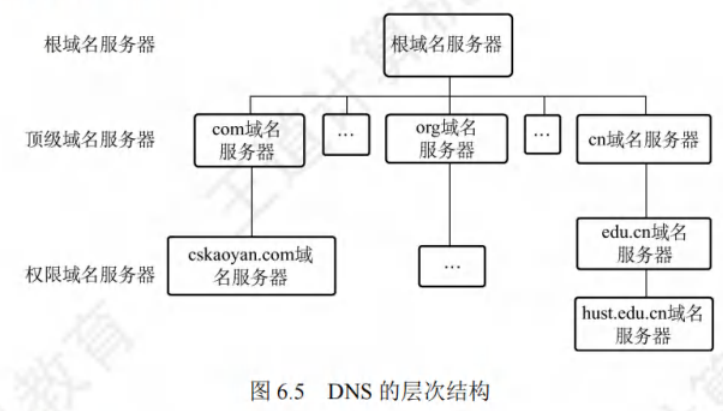

### 域名解析过程

域名解析，即把域名转化为IP地址的过程。当客户端需要域名解析时，会通过本机的DNS客户端构造一个DNS请求报文，并以UDP数据报方式发往本地域名服务器。

域名解析存在两种方式：递归查询和迭代查询。

1. **主机向本地域名服务器的查询采用递归查询**
递归查询指，若主机所询问的本地域名服务器不知道被查询域名的IP地址，那么本地域名服务器会以DNS客户的身份，向根域名服务器继续发出查询请求报文（即代替该主机继续查询），而非让主机自行进行下一步查询。两种查询方式在此步骤是相同的。

2. **本地域名服务器向其他域名服务器采用递归查询或迭代查询**
    - **递归查询过程**：如图6.6(a)所示，本地域名服务器仅向根域名服务器查询一次，后续几次查询递归地在其他几个域名服务器之间进行（步骤3 - 6）。在步骤7中，本地域名服务器从根域名服务器获取所需的IP地址，最后在步骤8中，本地域名服务器将查询结果告知发起查询的主机。由于该方法会给根域名服务器带来过大负载，实际中几乎不被使用。

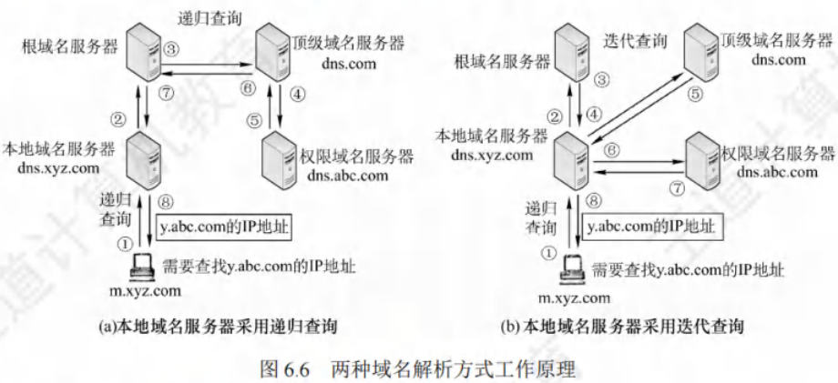

本地域名服务器向根域名服务器的查询通常采用迭代查询。当根域名服务器收到本地域名服务器发出的迭代查询请求报文时，有两种处理方式：
1. 直接给出所要查询的IP地址，
2. 告知本地域名服务器下一步应查询的顶级域名服务器。
随后由本地域名服务器自行进行后续查询（而非根域名服务器代劳），顶级域名服务器收到查询报文后处理方式类似，即要么给出IP地址，要么告知下一步应查询的权限域名服务器。最终，当获取到所要解析域名的IP地址后，将结果返回给发起查询的主机。具体过程如图6.6(b)所示。

以下通过实例说明域名解析过程。假设某客户机想获取域名为 `y.abc.com` 主机的IP地址，该过程最多需使用8个UDP报文（4个查询报文和4个回答报文）：
1. **客户机发起递归查询**：客户机向其本地域名服务器发出DNS请求报文（递归查询）。
2. **本地域名服务器迭代查询**：本地域名服务器收到请求后，先查询本地缓存。若未找到该记录，则以DNS客户身份向根域名服务器发出解析请求报文（迭代查询）。
3. **根域名服务器响应**：根域名服务器收到请求后，判断该域名属于 `.com` 域，将对应的顶级域名服务器 `dns.com` 的IP地址返回给本地域名服务器。
4. **本地域名服务器向顶级域名服务器查询**：本地域名服务器向顶级域名服务器 `dns.com` 发出解析请求报文（迭代查询）。
5. **顶级域名服务器响应**：顶级域名服务器 `dns.com` 收到请求后，判断该域名属于 `abc.com` 域，因此将对应的权限域名服务器 `dns.abc.com` 的IP地址返回给本地域名服务器。
6. **本地域名服务器向权限域名服务器查询**：本地域名服务器向权限域名服务器 `dns.abc.com` 发起解析请求报文（迭代查询）。
7. **权限域名服务器响应**：权限域名服务器 `dns.abc.com` 收到请求后，将查询结果返回给本地域名服务器。
8. **本地域名服务器返回结果**：本地域名服务器将查询结果保存到本地缓存，同时返回给客户机。

为提高DNS查询效率、减少因特网上DNS查询报文数量，域名服务器广泛采用高速缓存，用于缓存近期查询过的域名相关映射信息。如此，当相同域名查询再次到达该DNS服务器时，可直接提供所需IP地址。由于主机名和IP地址的映射并非永久，DNS服务器会在一段时间后丢弃高速缓存中的信息。主机同样需要高速缓存，许多主机在启动时从本地域名服务器下载域名和地址的全部数据库，维护自身最近使用域名的高速缓存，仅在缓存中未找到域名时才使用域名服务器。

## 文件传输协议

### FTP的工作原理
文件传输协议（File Transfer Protocol, FTP）是因特网上应用极为广泛的文件传输协议。它具备以下特点与功能：
- **特点**：提供交互式访问，支持客户指定文件类型、格式及设置存取权限，还能屏蔽各计算机系统细节，适用于异构网络中任意计算机间的文件传输。
- **功能**：
    - 实现不同主机系统（硬件、软件体系均可不同）间的文件传输。
    - 以用户权限管理方式，赋予用户对远程FTP服务器文件的管理能力。
    - 通过匿名FTP方式，实现公用文件共享。

FTP采用客户/服务器工作模式，借助TCP可靠传输服务。一个FTP服务器进程可同时服务多个客户进程，其服务器进程由两部分构成：
- **主进程**：负责接收新请求。
- **从属进程**：处理单个请求。

其工作步骤如下：
1. 打开熟知端口21（控制端口），以便客户进程连接。
2. 等待客户进程发送连接请求。
3. 启动从属进程处理客户请求。从属进程处理完请求后终止，回到等待状态，继续接收其他客户进程请求。主进程与从属进程并发执行。

此外，FTP服务器在整个会话期间需保留用户状态信息，尤其要将指定用户账户与控制连接关联，并追踪用户在远程目录树中的当前位置。

### 控制连接与数据连接

FTP工作时使用两个并行的TCP连接（见图6.7）：

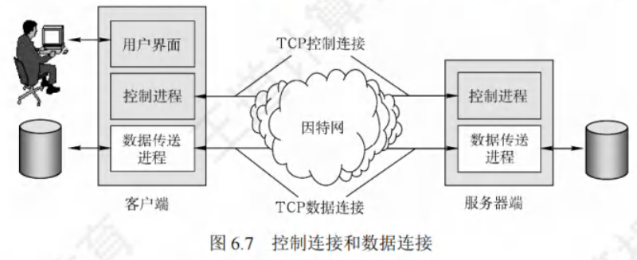

- **控制连接（服务器端口号21）**
    - **作用**：服务器监听21号端口等待客户连接，此连接用于传输控制信息（如连接请求、传送请求等），但不传输文件。客户发出的传送请求通过控制连接发送给服务器端控制进程，且在整个会话期间一直保持打开状态，传输文件时也可利用它（如客户中途发送中止传输命令）。
- **数据连接（服务器端口号20）**
    - **作用**：服务器端控制进程收到客户文件传输请求后，创建“数据传送进程”和“数据连接”。数据连接用于连接客户端和服务器端的数据传送进程，由数据传送进程完成文件传送，传送完毕后关闭连接并结束运行。
    - **传输模式**：
        - **主动模式PORT**：客户端连接到服务器21端口登录，读取数据时，客户端随机开放端口并告知服务器，服务器通过20端口与客户端开放端口连接并发送数据。
        - **被动模式PASV**：客户端读取数据时，发送PASV命令给服务器，服务器本地随机开放端口并告知客户端，客户端再连接到服务器开放端口进行数据传输。
        - **总结**：采用PORT还是PASV模式由客户端决定。简单说，主动模式是“服务器”连接“客户端”端口传送数据；被动模式是“客户端”连接“服务器”端口传送数据。若无特别说明，默认采用主动模式。

由于FTP使用分离的控制连接，其控制信息是带外（Out - of - band）传送的。使用FTP修改服务器文件时，需先将文件传至本地，修改后再传回原服务器，耗时较多。而网络文件系统（NFS）思路不同，它允许进程打开远程文件，并在文件特定位置读写数据，用户可只复制大文件的小片段，无需复制整个文件。

**重点知识点**：
- **FTP工作模式**：客户/服务器模式，基于TCP可靠传输服务，服务器进程由主进程和从属进程组成。
- **连接类型**：控制连接（端口21）用于传输控制信息，会话期间保持打开；数据连接（端口20）用于文件传输，有主动（PORT）和被动（PASV）两种模式，默认主动模式。
- **与NFS对比**：FTP修改文件需来回传输，NFS可直接在远程文件特定位置读写数据。

## 电子邮件

### 电子邮件系统的组成结构

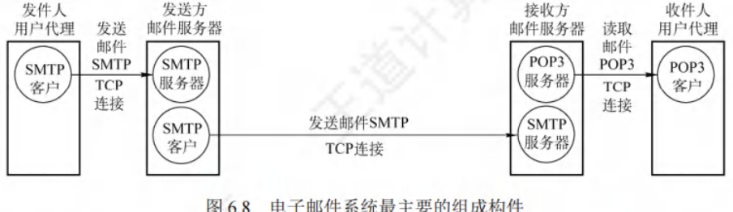

自因特网诞生，电子邮件便在其上广泛流行。它属于异步通信方式，通信时无需双方同时在线。电子邮件将邮件发送至收件人使用的邮件服务器，并存储在收件人的邮箱中，收件人可随时上网至其邮件服务器读取。

一个电子邮件系统主要由三个构件组成，如图6.8所示：
1. **用户代理（User Agent, UA）**：作为用户与电子邮件系统的接口，为用户提供友好界面用于发送和接收邮件。至少具备撰写、显示和邮件处理功能。常见的用户代理是运行在PC上的程序（如电子邮件客户端软件），像Outlook和Foxmail等。
2. **邮件服务器**：负责邮件的发送与接收，同时向发件人反馈邮件传送状态（已交付、被拒绝、丢失等）。邮件服务器以客户/服务器模式工作，且能同时扮演客户和服务器角色。例如，邮件服务器A向B发送邮件时，A是SMTP客户，B是SMTP服务器；反之，B向A发送邮件时，角色互换。
3. **电子邮件使用的协议**：
    - **邮件发送协议**：用于用户代理向邮件服务器发送邮件或在邮件服务器之间传输邮件，如SMTP。SMTP采用“推”（Push）的通信方式，即用户代理向邮件服务器发送邮件及在邮件服务器间传输时，SMTP客户将邮件“推”至SMTP服务器。
    - **邮件读取协议**：用于用户代理从邮件服务器读取邮件，如POP3。POP3采用“拉”（Pull）的通信方式，即用户读取邮件时，用户代理向邮件服务器发出请求，“拉”取用户邮箱中的邮件。

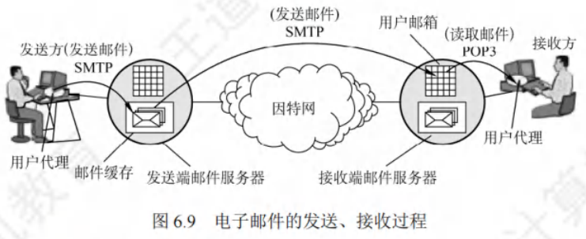

电子邮件的收发过程如下：
1. **撰写邮件**：发件人调用用户代理撰写和编辑待发送邮件。
2. **发送邮件**：邮件撰写完成后，发件人点击“发送邮件”按钮，后续工作由用户代理负责，其使用SMTP将邮件传送给发送端邮件服务器。
3. **排队等待**：发送端邮件服务器将邮件放入邮件缓存队列，等待发送。
4. **传输邮件**：发送端邮件服务器的SMTP客户与接收端邮件服务器的SMTP服务器建立TCP连接，然后将邮件缓存队列中的邮件依次发送。注意，邮件直接传送给接收端邮件服务器，不在互联网中间邮件服务器停留。
5. **接收存储**：运行在接收端邮件服务器中的SMTP服务器进程收到邮件后，将其放入收件人的用户邮箱，等待收件人读取。
6. **收取邮件**：收件人准备收信时，调用用户代理，使用POP3（或IMAP）协议从接收端邮件服务器的用户邮箱中取回邮件（若邮箱中有邮件）。

**重点知识点**：
- **系统构件**：电子邮件系统由用户代理、邮件服务器和相关协议（如SMTP、POP3等）组成。
- **协议特点**：SMTP是“推”式发送邮件，POP3是“拉”式读取邮件。
- **收发流程**：涵盖从发件人撰写到收件人读取邮件的完整步骤。

### 电子邮件格式与MIME

#### 电子邮件格式
电子邮件由信封和内容两大部分构成，其中邮件内容又细分为首部和主体。RFC 822规定了邮件首部格式，主体部分则由用户自由撰写。用户完成首部撰写后，邮件系统会自动提取信封所需信息并填写，无需用户手动操作。

邮件内容的首部包含多个首部行，每个首部行由“关键字:值”组成，部分关键字是必需的，部分可选。其中，最重要的关键字有：
 - **To**：必填关键字，后面需填入一个或多个收件人的电子邮件地址。地址格式为“收件人邮箱名@邮箱所在主机的域名”，例如“abc@cskaoyan.com”，且邮箱名在对应的邮件服务器上必须唯一，以此保证邮件地址在整个因特网上的唯一性。
 - **Subject**：可选关键字，作为邮件主题，用于反映邮件主要内容。
 - **From**：同样是必填关键字，但通常由邮件系统自动填入。首部与主体之间以一个空行分隔。典型邮件内容展示如下：

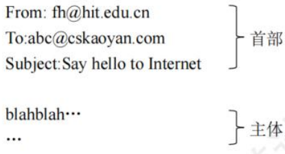

#### 多用途因特网邮件拓展
由于SMTP仅能传送7位ASCII码文本邮件，对于许多非英语国家文字（如中文、俄文，以及带重音符号的法文或德文等），以及可执行文件和其他二进制对象都无法传送。因此，多用途因特网邮件扩展（Multipurpose Internet Mail Extensions, MIME）应运而生。

MIME既未改动SMTP，也未将其取代。当发送端邮件包含非ASCII码数据时，不能直接用SMTP传送，需先通过MIME转换，将非ASCII码数据转为ASCII码数据后，方可使用SMTP传输。接收端则使用MIME对收到的ASCII码数据进行逆转换，从而获取包含非ASCII码数据的邮件。MIME与SMTP的关系如下图所示：

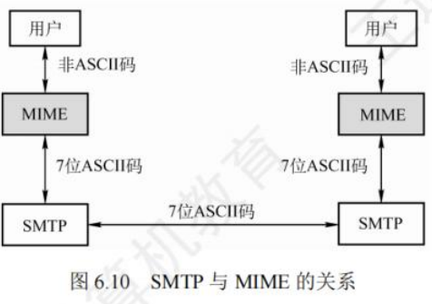

MIME主要包含以下三部分内容：
 - **5个新的邮件首部字段**：分别为MIME版本、内容描述、内容标识、传送编码和内容类型。
 - **定义邮件内容格式**：对多媒体电子邮件的表示方法进行标准化。
 - **定义传送编码**：能够对任何内容格式进行转换，且不会被邮件系统改变。

**重点知识点**：
 - **电子邮件格式**：重点掌握邮件的构成（信封、内容，内容又分首部和主体），以及首部重要关键字（To、Subject、From）及其作用，还有首部与主体的分隔方式。
 - **MIME**：理解其产生原因是SMTP对非ASCII码数据和二进制对象传输的局限，掌握MIME与SMTP的关系，以及MIME自身包含的三部分主要内容。

### SMTP和POP3

#### SMTP

简单邮件传输协议（Simple Mail Transfer Protocol, SMTP），用于实现可靠且高效的电子邮件传输，控制两个通信的SMTP进程交换信息。SMTP采用客户/服务器模式，负责发送邮件的是SMTP客户，接收邮件的是SMTP服务器 。它基于TCP连接，端口号为25 。SMTP通信分为以下三个阶段：
1. **连接建立**：发件人的邮件进入发送方邮件服务器的邮件缓存后，SMTP客户定时扫描缓存。若发现邮件，便与接收方邮件服务器的SMTP服务器建立TCP连接（SMTP服务器熟知端口号25）。连接建立后，接收方SMTP服务器回应“220 Service ready（服务就绪）”，接着SMTP客户发送HELO命令并附上发送方主机名。需注意，SMTP不借助中间邮件服务器，TCP连接直接在发送方和接收方邮件服务器间建立，不受距离和路由器数量影响。若接收方邮件服务器故障无法建立连接，发送方邮件服务器需等待后重试。
2. **邮件传送**：连接建立后开始传送邮件。以MAIL命令起始，后接发件人地址，如“MAIL FROM:fh@hit.edu.cn”。若SMTP服务器准备好接收邮件，回复“250 OK”。随后跟一个或多个RCPT命令，格式为“RCPT TO:<收件人地址>”，每个RCPT命令都会收到SMTP服务器的响应，如“250 OK”或“550 No such user here（无此用户）”。RCPT命令用于确认接收方系统是否准备好接收邮件，避免因地址错误浪费通信资源。收到“OK”回复后，客户端使用DATA命令表明开始传送邮件内容，正常情况下，SMTP服务器返回“354 Start mail input; end with <CRLF>.<CRLF>”，<CRLF>表示回车换行，此时SMTP客户可传送邮件内容，并以<CRLF>.<CRLF>表示内容结束。
3. **连接释放**：邮件发送完毕，SMTP客户发送QUIT命令，SMTP服务器返回“221（服务关闭）”，同意释放TCP连接，邮件传送过程结束。

#### POP3和IMAP

1. **POP3**：邮局协议（Post Office Protocol, POP）是简单但功能有限的邮件读取协议，当前版本为POP3。它采用客户/服务器模式，在传输层使用TCP，端口号110。接收方用户代理运行POP客户程序，接收方邮件服务器运行POP服务器程序。POP有两种工作方式：
    - **“下载并保留”**：用户从邮件服务器读取邮件后，邮件仍保留在服务器，可再次读取。
    - **“下载并删除”**：邮件读取后即从服务器删除。
2. **IMAP**：因特网报文存取协议（Internet Message Access Protocol, IMAP）比POP复杂。IMAP为用户提供创建文件夹、在不同文件夹间移动邮件及在远程文件夹查询邮件等联机命令，IMAP服务器维护会话用户的状态信息。其另一特性是允许用户代理只获取报文部分内容，如只读取报文首部或多部分MIME报文的一部分，适用于低带宽场景，用户无需取回邮箱中的所有大邮件（如含大量音频或视频的邮件）。

此外，随着万维网普及，出现了基于万维网的电子邮件，如Hotmail、Gmail等。这类邮件的特点是，用户浏览器与邮件服务器间的邮件发送或接收使用HTTP，仅在不同邮件服务器间传送邮件时使用SMTP。

## 万维网

### WWW的概念与组成结构
万维网（World Wide Web, WWW）是分布式、联机式的信息存储空间。其中，每一个有用事物都被视为一种“资源”，并由全域的“统一资源定位符”（URL）标识。这些资源通过超文本传输协议（HTTP）传送给用户，用户通过点击链接获取资源。

万维网借助链接，能便捷地从一个站点访问另一个站点，主动按需获取丰富信息。超文本标记语言让页面设计可轻松通过超链接，从本页面链接到因特网上任意页面，并在计算机屏幕显示。

万维网的内核由三个标准构成：
1. **统一资源定位符（URL）**：负责标识万维网上各类文档，使每个文档在整个万维网范围内拥有唯一标识符。其一般形式为 `<协议>://<主机>:<端口>/<路径>` 。
    - `<协议>`：常见如 `http`、`ftp` 等，用于表明获取万维网文档所采用的协议。
    - `<主机>`：指存放资源的主机在因特网中的域名或IP地址。
    - `<端口>` 和 `<路径>`：有时可省略。URL不区分大小写。
2. **超文本传输协议（HTTP）**：应用层协议，基于TCP连接实现可靠传输，是万维网客户程序与服务器程序交互必须严格遵循的协议。
3. **超文本标记语言（HTML）**：一种文档结构标记语言，利用约定标记描述页面上文字、声音、图像、视频等各种信息及其格式。

万维网采用客户/服务器模式工作。浏览器是用户主机上的万维网客户程序，万维网文档所在主机运行服务器程序，此主机即为万维网服务器。工作流程如下：
1. **连接与请求**：Web用户使用浏览器（指定URL）与Web服务器建立连接，并发送浏览请求。
2. **转换与响应**：Web服务器将URL转换为文件路径，向Web浏览器返回信息。
3. **关闭连接**：通信完成后，关闭连接。

万维网是众多网络站点和网页的集合，构成了因特网的主要部分（因特网还包含电子邮件、Usenet和新闻组）。

### 超文本传输协议
HTTP定义了浏览器（万维网客户进程）请求万维网文档以及服务器传送文档给浏览器的方式。从层次角度，HTTP是面向事务（Transaction - oriented）的应用层协议，规定了浏览器与服务器间请求和响应的格式与规则，是万维网可靠交换文件（包括文本、声音、图像等多媒体文件）的重要基础。

#### HTTP的操作过程
从协议执行角度看，浏览器访问WWW服务器，首先需完成对WWW服务器的域名解析。获取服务器IP地址后，浏览器通过TCP向服务器发送连接建立请求 。

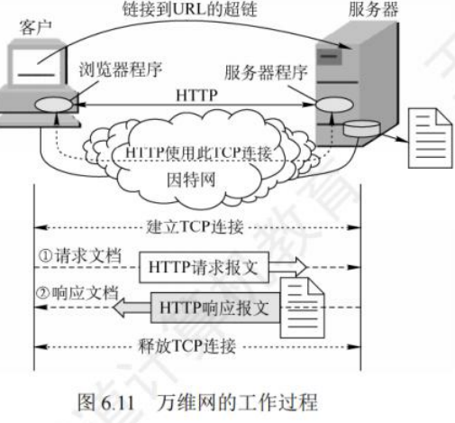

每个万维网站点都有服务器进程，持续监听TCP的80端口（默认）。监听到连接请求后，与浏览器建立TCP连接。之后，浏览器向服务器发送获取某个Web页面的HTTP请求，服务器收到请求，构建所需Web页信息，通过HTTP响应返回给浏览器，浏览器解释信息并将Web页显示给用户，最后释放TCP连接。

以访问清华大学网站为例，用户单击鼠标后按顺序发生以下事件：
1. **URL分析**：浏览器分析链接指向页面的URL（http://www.tsinghua.edu.cn/chn/index.htm）。
2. **DNS请求**：浏览器向DNS请求解析www.tsinghua.edu.cn的IP地址。
3. **DNS解析**：域名系统DNS解析出清华大学服务器的IP地址。
4. **TCP连接建立**：浏览器与该服务器建立TCP连接（默认端口号80）。
5. **HTTP请求发送**：浏览器发出HTTP请求：GET /chn/index.htm。
6. **HTTP响应接收**：服务器通过HTTP响应把文件index.htm发送给浏览器。
7. **TCP连接释放**：释放TCP连接。
8. **页面显示**：浏览器解释文件index.htm，并将Web页显示给用户。

上述是简化过程，实际涉及TCP/IP体系结构中应用层的DHCP、DNS和HTTP，传输层的UDP和TCP，网际层的IP和ARP，数据链路层的CSMA/CD或PPP（若涉及ISP接入或广域网传输）。

#### HTTP的特点
1. **基于TCP保证可靠传输**：HTTP使用TCP作为传输层协议，确保数据可靠传输，自身无需考虑数据丢弃后的重传问题。但需注意，HTTP本身无连接，虽使用TCP连接，通信双方交换HTTP报文前无需先建立HTTP连接。
2. **无状态特性**：HTTP是无状态的，即同一个客户第二次访问同一服务器页面时，服务器响应与首次相同，因为服务器不记得曾服务过该客户。此特性简化了服务器设计，更易支持大量并发请求。实际应用中，常采用Cookie加数据库方式跟踪用户活动，如记录用户最近浏览商品。Cookie工作原理如下：
    - 用户初次访问使用Cookie的网站，服务器为用户生成唯一Cookie识别码（如“12345”），并以此为索引在后端数据库创建项目记录用户访问信息。
    - 服务器在给用户的响应报文中添加Set - cookie首部行“Set - cookie:12345”，用户收到响应后，在其管理的特定Cookie文件中添加该服务器主机名和Cookie识别码。
    - 用户再次浏览该网站时，取出识别码，在请求报文中添加Cookie首部行“Cookie:12345”，服务器依据识别码从数据库查询用户活动记录，执行个性化操作，如按历史浏览记录推荐新商品。
3. **连接方式**：HTTP既支持非持续连接（HTTP/1.0），也支持持续连接（HTTP/1.1支持）。
    - **非持续连接**：每个网页元素对象（如JPEG图形、Flash等）传输都需单独建立TCP连接。请求一个万维网文档所需时间为文档传输时间（与文档大小成正比）加上两倍往返时间RTT（一个RTT用于TCP连接，另一个RTT用于请求和接收文档）。每请求一个对象都产生2×RTT开销，且每次新建TCP连接都要分配缓存和变量，加重万维网服务器负担。
    - **持续连接**：万维网服务器发送响应后保持连接，同一客户和服务器可在该TCP连接上传送后续HTTP请求和响应报文。HTTP/1.1默认使用持续连接，其又分为非流水线和流水线两种工作方式。
        - **非流水线方式**：客户收到前一个响应后才能发出下一个请求，服务器发送完一个对象后，TCP连接空闲，浪费服务器资源。
        - **流水线方式**：客户可连续发出对各个对象的请求，服务器连续响应。若所有请求和响应连续发送，引用所有对象共经历1个RTT延迟，而非每个对象都有1个RTT延迟，减少了TCP连接空闲时间，提高效率。不过，流水线方式中，服务器每个RTT连续发送的数据量受TCP发送窗口限制。

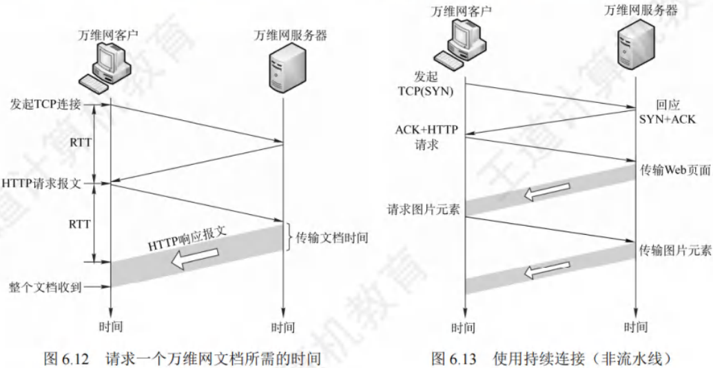

#### HTTP的报文结构
HTTP是面向文本的（Text - Oriented），报文中每个字段都是ASCII码串，且字段长度不定。HTTP报文分为两类：
 - **请求报文**：由客户向服务器发送，如图6.14(a) 所示。
 - **响应报文**：从服务器返回给客户，如图6.14(b) 所示。

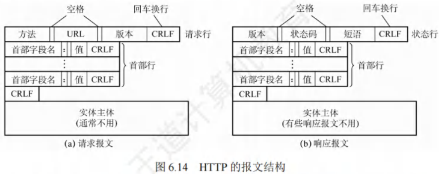

从图6.14可见，两种报文都由三部分构成，区别在于开始行不同。
 - **开始行**：请求报文中称请求行，响应报文中为状态行。开始行的三个字段以空格分隔，结尾“CR”和“LF”分别表示“回车”和“换行”。
 - **首部行**：用于说明浏览器、服务器或报文主体的相关信息。首部可有若干行，也可省略。每行首部字段都有字段名和对应值，行尾以“回车”和“换行”结束。整个首部行结束后，用一空行与实体主体分隔。
 - **实体主体**：请求报文中一般较少使用，响应报文中也可能不存在该字段。

请求报文的“请求行”包含三个内容：方法、请求资源的URL及HTTP版本。其中，“方法”是对请求对象执行的操作，类似命令。

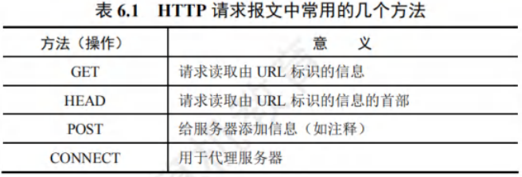

以下是典型的HTTP请求报文示例：

```js
GET /bbs/index.htm HTTP/1.1  {指明方法"GET"、相对URL、HTTP版本}
Host: www.cskaoyan.com  {指明服务器的域名}
Connection: Keep - Alive  {要求服务器在发送完被请求的文档后保持这条连接}
User - Agent: Mozilla/5.0  {表明用户代理是浏览器Mozilla/5.0}
Accept - Language: en  {表示用户希望优先得到中文版本的文档}
```
第1行是请求行，采用相对URL，因后续首部行给出了服务器域名。第3行表明使用持续连接，即浏览器要求服务器在发送完文档后保持TCP连接，若使用非持续连接，对应首部行应为“Connection: close”。

HTTP响应报文的第1行是状态行，包含三个内容：HTTP版本、状态码、解释状态码的短语。以下是HTTP响应报文中常见的三种状态行示例：
 - `HTTP/1.1 202 Accepted` {接受请求}
 - `HTTP/1.1 400 Bad Request` {错误的请求}
 - `HTTP/1.1 404 Not Found` {找不到页面}

#### HTTP请求报文举例

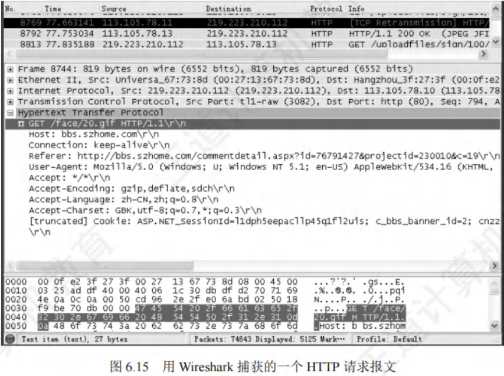

根据报文结构定义，在图6.15的以太网数据帧中：
 - 第1 - 6字节为目的MAC地址（默认网关地址），即`00 - 0f - c2 - 3f - 27 - 3f`。
 - 第7 - 12字节为本机MAC地址，即`00 - 27 - 13 - 67 - 73 - 8d`。
 - 第13 - 14字节`08 - 00`为类型字段，表示上层使用IP数据报协议。
 - 第15 - 34字节（共20B）为IP数据报的首部，其中第27 - 30字节为源IP地址，即`db - df - d2 - 70`，转换为十进制是`219.223.210.112`；第31 - 34字节为目的IP地址，即`71 - 69 - 4e - 0a`，转换为十进制是`113.105.78.10`。
 - 第35 - 54字节（共20B）为TCP报文段的首部。
 - 从第55字节开始为TCP数据部分（阴影部分），即应用层传递下来的数据（此例中为请求报文），`GET`对应请求行的方法，`face/20.gif`对应请求行的URL，`HTTP/1.1`对应请求行的版本。左侧数字是对应字符的ASCII码，如`'G' = 0x47`、`'E' = 0x45`、`'T' = 0x54`等。

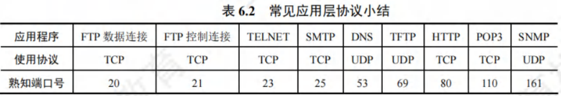
