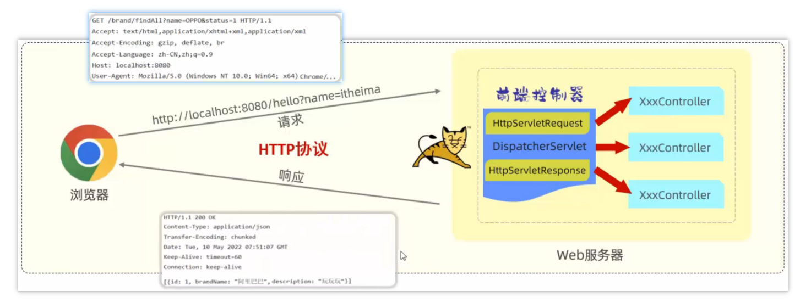
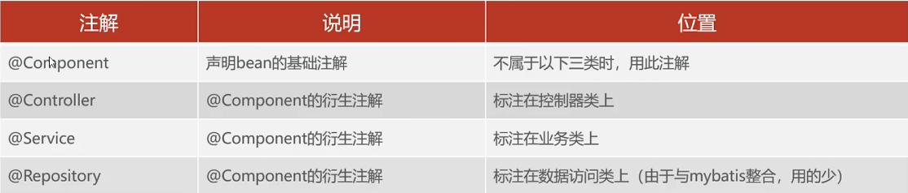

# JavaWeb

## Http协议

## 请求与响应



浏览器发送**请求**在前端控制器中封装为`HttpServletRequest`对象，由`Controller`响应。

`Controller`发送**响应**在前端控制器中封装为`HttpServletResponse`对象，响应给浏览器。

### 请求

#### 简单参数

```json
http://localhost:8080/hello?name=Tom
```

- 原始方式

通过`HttpServletRequest`对象手动获取。

```java
@RequestMapping("/hello")
public String hello(HttpServletRequest request){
	String name = request.getParameter("name");

    return name;
}
```

- Springboot方式

参数名与形参变量名相同，定义形参即可接收参数。

```java
@RequestMapping("/hello")
public String hello(String name){
    return name;
}
```

如果参数名不相同可以使用`@RequestParam`注解

- 该注解的required属性默认是true，代表请求参数必须传递(没有请求参数warn)。

#### 对象参数

与简单参数类似，请求参数名和形参对象属性名相同，即可接收。如果参数中还有对象，按照层次依次接收即可。

```json
http://localhost:8080/complex?name=Tom&age=16&address.province=shandong&address.city=qingdao
```

```java
public class Complex{
    String name;
    int age;
    Address address;
}

@RequestMapping("/complex")
public String hello(Complex c){
    return "ok";
}
```

#### 数组集合参数

```json
http://locallocalhost:8080/arrayParam?array=cpp&array=java
```

```java
@RequestMapping("/arrayParam")
public String hello(String[] array){
    return "ok";
}
```

```java
@RequestMapping("/arrayParam")
public String hello(@RequestParam List<String> array){
    return "ok";
}
```

集合参数需要`@RequestParam`绑定参数关系

#### 日期参数

```json
http://locallocalhost:8080/dataParam?Time=2024-11-23 14:25:00
```

```java
@RequestMapping("/dataParam")
public String hello(@DataTimeFormat(pattern="yyyy-MM-dd HH:mm:ss")LocalDataTime Time){
    return "ok";
}
```

日期参数需要`@DataTimeFormat完成日期参数格式转换

#### Json格式参数（POST）

Json数据键名与形参对象属性名相同

```json
http://locallocalhost:8080/jsonParam
```

```json
{
    "name": "Tom",
    "age": 10,
    "address":{
        "province": "shandong",
        "city": "qingdao"
    }
}
```

```java
public class Address{
    private String province;
    private String city;
}

public class User{
    private String name;
    private Integer age;
    private Address address;
}
```

```java
@RequestMapping("/jsonParam")
public String hello(@RequesBody User user){
    return "ok";
}
```

#### 路径参数

```json
http://locallocalhost:8080/path/100
```

通过请求URL直接传递参数，需要使用`@PathVariable`

```java
@RequestMapping("/path/{id}")
public String hello(@PathVariable Integer id){
    return "ok";
}
```

### 响应

`@ResponseBody`作用是将方法返回值直接响应，如果返回值是实体/集合，将会转为JSON格式。

`@RestController=@Controller+@ResponseBody`

#### 统一响应结果

```java
public class Result{
	private Integer code;//响应码
    private String msg;//提示信息
    private Object data;
}
```

## 分层解耦

### 三层架构

- Controller：控制层，接受请求，响应数据。

- Service：业务逻辑层，处理具体的业务逻辑。
- Dao（Mapping）：数据访问层（Data Access Object）（持久层），负责数据访问操作。

#### Controller层

```java
@RestController
public class EmpController{
    private EmpService empService = new EmpServiceA();
    
    @RequestMapping("/listEmp")
    public Result list(){
        List<Emp> empList = empService.listEmp();
        return Reslt.success(empList);
    }
}
```

#### Service层

```java
public interface EmpService{
    public List<Emp>listEmp();
}

public class EmpServiceA implements EmpService{
    private EmpDao empDao = new EmpDaoA();
    public List<Emp> listEmp(){
        List<Emp>emList = empDao.ListEmp();
        //处理数据
        return empList;
    }
}
```

#### Dao层

```java
public interface EmpDao{
    public List<Emp> listEmp();
}

public class EmpDaoA implements EmpDao{
    public List<Emp> listEmp(){
        //加载数据
        return empList;
    }
}
```

### IOC&DI

- 内聚：软件中各个功能模块内壁的功能联系。
- 衡量软件中各个层/模块间的依赖、关联的程度。

- 软件设计原则：高内聚 低耦合

**实现方法：**

- 控制反转（Inversion Of Control,IOC）：对象的创建控制权由程序自身转移到外部（容器）。
- 依赖注入（Dependency Injection,DI）：容器为应用程序提供运行时所依赖的资源。
- Bean对象：IOC容器中创建，管理的对象。

1. Service层和Dao层的实现类交给IOC容器管理。添加注解`@Component`。（控制反转）
2. Controller层和Service层注入运行时依赖的对象。添加注解`@Autowired`。（依赖依赖）

#### Controller层

```java
@RestController
public class EmpController{
    @Autowired
    private EmpService empService;
    
    @RequestMapping("/listEmp")
    public Result list(){
        List<Emp> empList = empService.listEmp();
        return Reslt.success(empList);
    }
}
```

#### Service层

```java
public interface EmpService{
    public List<Emp>listEmp();
}
@Component
public class EmpServiceA implements EmpService{
    @Autowired
    private EmpDao empDao;
    public List<Emp> listEmp(){
        List<Emp>emList = empDao.ListEmp();
        //处理数据
        return empList;
    }
}
```

#### Dao层

```java
public interface EmpDao{
    public List<Emp> listEmp();
}
@Component
public class EmpDaoA implements EmpDao{
    public List<Emp> listEmp(){
        //加载数据
        return empList;
    }
}
```

### IOC详解

#### Bean的声明

把某个对象交给IOC容器管理，需要在对应的类上加上如下注解之一：



**注意事项：**

- 声明Bean时，可以通过value指定bean的名字；没有指定，默认为类名首字母小写。
- 声明控制器bean时只能用`@Controller`

### DI详解

#### Bean注入

- `@Autowired`默认按照类型进行，如果存在多个相同类型的bean会报错。
- 可以通过`@Primary`，`@Qualifier("ServiceA")`，`@Resource(name="ServiceA")`解决。


