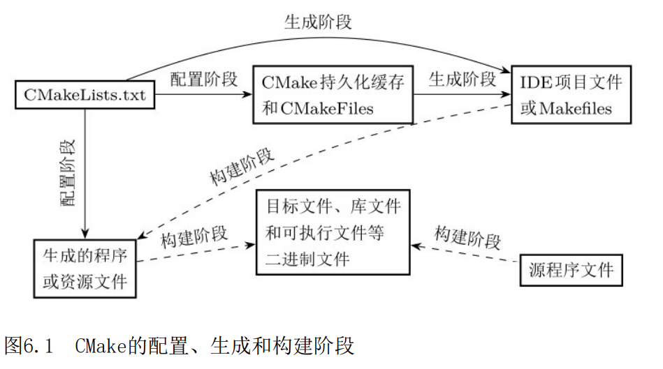

# 第六章 构建初探

## CMake项目的生命周期

### 配置阶段和生成阶段

CMake本身并不实际调用编译器和链接器等,而是根据整个构建流程,生成Makefile或者其他构建工具的配置文件,通过它们来实际调用各种命令完成构建。正因如此，CMake常被称为构建系统生成器。

CMake构建系统生成器在构建项目的过程中涉及两个重要阶段:
- 一是执行CMake目录程序(CMakeLists.txt)的阶段
- 二是根据程序执行结果生成构建系统配置文件的阶段。
  
前者往往是对项目的构建环境、构建目标等进行配置,因此称为配置阶段(configure stage)
而后者用于生成构建系统的配置文件，因此称为生成阶段

之所以要区分这两个阶段,是因为在配置阶段, CMake仅需确定项目构建目标的依赖关系、构建需求等,与选用的具体构建系统的特殊化配置无关。在生成阶段, CMake必须根据目标构建系统(如Makefile等)的要求,生成出符合具体构建系统要求格式的具体配置。

图中的"生成的程序或资源文件”既可能是配置阶段由CMake脚本直接生成的,又可能是构建阶段生成的。这是因为有些信息可能与构建系统的配置有关,因此CMake不能直接生成它们,而是将它们的生成过程在生成阶段定义到构建系统的配置中,再由构建系统最终在构建阶段生成。

例如,项目通常有Debug(调试)模式和Release(发布)模式两种构建模式,以对应不同的编译优化级别。对于Makefile构建系统而言,CMake需要对这两种构建模式分别生成不同的Makefile项目配置；而对于Visual Studio构建系统而言,由于其本身支持多种构建模式的切换, CMake只需生成一个Visual Studio的项目配置。试想,如果需要根据当前的构建模式生成不同的头文件内容，该怎么做呢？是否可以直接在CMake目录程序中获取当前构建模式并使用if命令来判断呢?这对于Makefile这种单构建模式的构建系统是可行的，但对于Visual Studio这种支持多构建模式的构建系统则是不可行的。因为在配置阶段执行CMake目录程序时, CMake并不能够确定多构建模式构建系统当前选择的是哪种构建模式,这个信息只有在构建时才会确定。为了解决这类问题, CMake提供了生成器表达式。顾名思义,生成器表达式就是构建系统生成器的表达式,也就是生成阶段才会被解析的表达式。总而言之,这类问题只有在生成阶段结合了构建系统的具体特性后才可解决。

