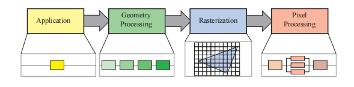
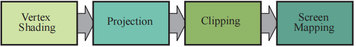
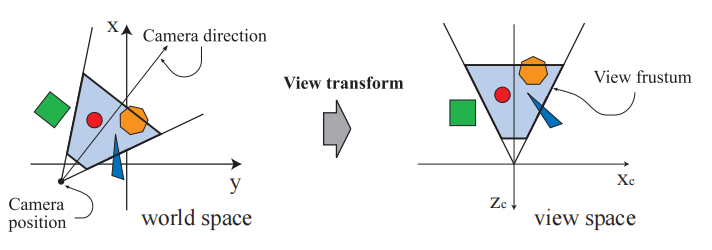
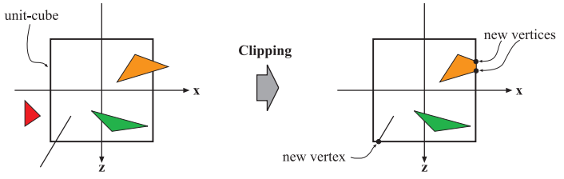
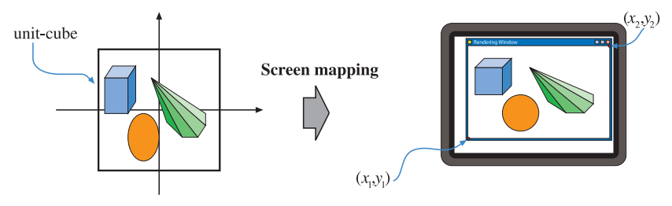
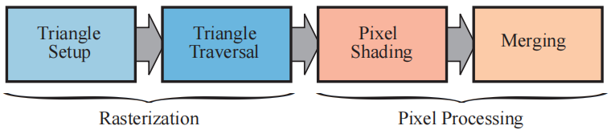

# 第二章

## 管线

​	图形渲染管线（graphics rendering pipeline），也被简称为管线。渲染管线的核心功能就是利用给定的虚拟相机、三维物体、光源等信息，来生成或者渲染（render）一张二维图像。因此，渲染管线是实时渲染中的底层工具。最终图像中物体的位置和形状，由其几何结构，环境特征以及相机位置所决定。而物体的外观则会受到材质属性、光源、纹理（应用在物体表面上的图像）以及着色方程的影响。

## 渲染管线的架构

一个流水线中会包含若干个阶段，每个阶段负责完成总任务中的一部分任务。流水线阶段可以并行执行，其中每个阶段都依赖于前一个阶段的结果。

在实时渲染领域中也可以找到这样的流水线结构，一种粗略的划分方法是将渲染管线分为四个阶段——应用阶段（application）、几何处理阶段（geometry processing）、光栅化阶段（rasterization）和像素处理阶段（pixel processing）。

- 应用阶段（application）是由应用程序进行驱动的，它在软件中进行实现，运行在通用CPU上。这些CPU一般都具有多个核心，可以并行处理多个线程（thread）的任务，这使得CPU可以高效执行由应用阶段所负责的各种任务，一般CPU会负责碰撞检测，全局加速算法，动画，物理模拟等任务，具体会执行哪些任务取决于应用程序的类型。

- 几何处理阶段（geometry processing），它负责处理变换（transform），投影（projection）以及其他所有和几何处理相关的任务。这个阶段需要计算哪些物体会被绘制，应该如何进行绘制，以及应当在哪里绘制等问题。几何阶段通常运行在图形处理单元（GPU）上，它包含一系列的可编程单元和固定操作硬件。

- 光栅化阶段（rasterization）通常会将构成一个三角形的三个顶点作为输入，找到所有位于三角形内部的像素，并将其转发到下一个阶段中。

- 像素处理阶段（pixel processing），对于每个像素而言，都会执行一个程序来决定它的颜色；并执行深度测试，来判断这个像素是否可见；这里还可以执行一些逐像素的操作，例如将新计算的颜色和之前的颜色进行混合。光栅化阶段和像素处理阶段同样完全运行在GPU上。

### 应用阶段

- 运行位置：多运行在CPU上，部分任务可以运行在GPU上。

​	由于应用阶段通常都运行在CPU上， 因此开发者可以完全控制在应用阶段发生的事情，开发者可以决定应用程序的具体实现方式，也可以在之后对其进行修改优化，从而提高程序的性能表现。对应用阶段的修改也会影响后续阶段的性能表现。

​	部分任务也可以让GPU来进行执行，即通过使用一个叫做计算着色器（compute shader）的独立模式，该模式会将GPU视为一个高度并行的通用处理器，而忽略其专门用于图形渲染的特殊功能。

- 任务：**输出渲染图元**，碰撞检测，处理输入，加速算法等。

​	在应用阶段的最后，需要进行渲染的几何物体会被输入到几何处理阶段中，这些几何物体被称作为渲染图元（rendering primitive）。这些图元最终可能会出现在屏幕上（或者是任何正在使用的显示设备上），这也是应用阶段中最重要的任务。

​	碰撞检测（collision detection）通常会在这个阶段中实现。当检测到两个物体之间的碰撞之后，会产生相应的响应，并返回给碰撞物体，同时也返回给力反馈设备（如果有的话）。应用阶段同样也是处理其他来源输入的地方。一些加速算法等，以及渲染管线剩余部分无法处理的一切问题，都会在应用阶段中完成。

## 几何处理阶段

- 运行位置：GPU。

- 任务：负责大部分的逐三角形（per-triangle）和逐顶点（per-vertex）操作。

- 划分为以下几个功能性阶段：顶点着色（vertex shading）、投影（projection）、裁剪（clipping）和屏幕映射（screen mapping）。

### 顶点着色

顶点着色（vertex shading）的任务主要有两个：

1. 计算顶点的位置。
2. 计算那些开发人员想要作为顶点数据进行输出的任何参数，例如法线（normal）和纹理坐标（texture coordinate）等。

#### 逐顶点计算

​	通过将光源应用于每个顶点的位置和法线，从而计算并存储最终的顶点颜色；然后再通过对顶点颜色进行插值，来获取三角形内部像素的颜色。

​	这个可编程的顶点处理单元被命名为顶点着色器（vertex shader）。现在，顶点着色阶段变得越来越通用。

#### 逐顶点计算计算过程

- 输入：一组顶点坐标

- 过程：在物体最终进入屏幕的过程中，它需要在不同的空间（space）或者坐标系（coordinate system）下，进行若干次变换。

##### 模型变换

​	模型位于自身的模型空间（model space）中，可以简单地认为它没有进行任何变换。每个模型都可以与一个模型变换（model transform）相关联，以便调整自身的位置和朝向。可以将若干个模型变换和同一个模型相关联，这样我们就能够在不复制这个模型的前提下，在一个场景中放置同一个模型的多个副本（也叫做实例，instance），每个实例都拥有各自不同的位置和朝向（即模型变换）。模型变换会对模型的顶点和法线进行变换，模型本身所处的坐标系叫做模型坐标系（model coordinates），它的坐标也被称为模型坐标。当对这些坐标进行模型变换之后，这个模型便位于世界坐标系（world coordinate）或者叫做世界空间（world space）中。世界空间是唯一的，当各个模型经过各自的模型变换之后，所有的模型便都位于一个相同的空间中。

##### 观察变换

只有被相机（或者观察者）看到的模型才会被渲染，相机在世界空间中有一个位置参数和方向参数，用于放置相机和调整相机的朝向。为了便于后续的投影操作和裁剪操作，相机和世界空间中的所有模型，都会应用观察变换（view transform），观察变换的主要目的是将相机放置在原点上，并调整相机的朝向，使其看向z轴负半轴的方向，同时y轴指向上方，x轴指向右方。本文中我们将会使用指向负z轴的约定，有一些书籍则更喜欢让相机看向正z轴的方向，二者之间的区别主要是语义上的，因为二者之间的转换十分简单。在应用观察变换之后，模型的具体位置和具体方向取决于底层图形API的实现方式。这样形成的空间被称作相机空间（camera space），或者是更加常见的观察空间（view space）和眼睛空间（eye space）。顶点的坐标和法线，都可以按照程序员所喜欢的任何方式来进行计算。

我们将描述顶点着色的第二类输出。为了创建一个真实的场景，仅仅是渲染物体的位置和形状是不够的，我们还需要对物体的外观信息进行建模，包括物体的材质（material）信息以及光源照射在物体表面上的效果。从最简单的颜色描述到基于物理的详细描述，材质和光源可以通过很多方式进行建模。

确定光照作用于材质上所产生的效果，这个操作被称为着色，它涉及到在模型的不同位置上计算着色方程。通常来说，其中一些计算是在模型顶点的几何处理阶段中执行的，其他计算可能会在逐像素处理中完成。顶点上可以存储各种各样的数据，例如顶点位置、法线、颜色或者着色方程所需要的其他数值信息。顶点着色的结果（可能是颜色、向量、纹理坐标或者其他类型的着色数据）会被发送到光栅化阶段中进行插值，并在像素处理阶段中用于计算表面的着色。

作为顶点着色的一部分，渲染系统还会进行投影操作和裁剪操作，这两个操作会将整个可视空间变换为一个标准立方体（standard cube），其端点位于$(-1, -1, -1)$和$(1, 1, 1)$处，立方体的边长为2。可以使用不同的范围来定义相同的空间，例如$0 \le z \le 1$，这个标准立方体被称为规范可视空间（canonical view volume）。首先会进行投影操作，这是在GPU上的顶点着色器中完成；有两种常见的投影方法，一种是正交投影（orthographic），也可以叫做平行投影（parallel）；另一种是透视投影（perspective）。投影操作是通过投影矩阵完成的，因此有时候它会和其余几何变换连接起来。

正交视图的可视空间通常是一个长方体，正交投影会将这个可视空间变换为一个标准立方体。正交投影最主要的特征就是，投影变换之前的平行线，在正交投影之后仍然是平行的。这样的投影变换由一个位移变换和一个缩放变换组成。

透视投影要更加复杂一点。在透视投影中，距离相机越远的物体，在投影变换之后就越小；此外，平行线在透视投影之后也会在视界处汇聚，也就是说，透视投影模拟了我们感知物体大小的方式。从几何学上看，透视投影的可视空间（也叫做视锥体）是一个具有矩形底面的截断金字塔，这个视锥体也会被投影变换为一个标准立方体。正交投影和透视投影都可以使用一个4 \times 4矩阵来进行描述（第4章），在投影变换之后，模型所处的坐标系被称为裁剪坐标系（clip coordinates），在坐标除以w 分量之前，事实上它们都是齐次坐标（homogeneous coordinate）。GPU的顶点着色器必须始终输出这种类型的坐标，以便于下一个功能性阶段（裁剪）可以正确执行。

尽管这些投影变换矩阵会将模型从一个空间变换到另一个空间，但是它们仍然被叫做投影，这是因为在显示之后，坐标的z分量并不会被存储在生成的图像中，而是存储在一个叫做z-buffer的地方，通过这种方式，模型便从三维空间投影到了二维空间中。

### 可选的顶点处理

每个渲染管线中，都会有刚才所描述的顶点处理阶段，当完成顶点处理之后，还有几个可以在GPU上执行的可选操作，它们的执行顺序如下：曲面细分（tessellation）、几何着色（geometry shading）和流式输出（stream out）。是否使用这些可选操作，一方面取决于硬件的功能（并不是所有GPU都支持这些功能），另一方面取决于程序员的意愿。这些功能相互独立。

第一个可选阶段是曲面细分（tessellation），想象现在有一个使用三角形进行表示的弹性小球，我们可能会遇到质量和性能的取舍问题。在5米外观察这个小球可能看起来会很不错，但是如果离近了看，我们会发现部分三角形，尤其是小球轮廓边缘处的三角形会非常明显。如果我们给这个小球添加更多的三角形来提高表现质量，那么当这个小球距离相机很远，仅仅占据屏幕上几个像素的时候，我们会浪费大量的计算时间和内存。这个时候，使用曲面细分可以为一个曲面生成数量合适的三角形，同时兼顾质量和效率。

在前文中我们已经讨论了一些有关三角形的话题，但是到目前为止，我们在管线中只对顶点进行了处理。这些顶点可以用来表示点、线、三角形或者其他物体，顶点也可以用来描述一个曲面（例如一个球体），这样的曲面可以通过几个部分组合而成，每个部分也都由一组顶点构成。曲面细分阶段本身也包含了一系列子阶段——壳着色器（hull shader）、曲面细分器（tessellator）和域着色器（domain shader），它们可以将当前的顶点集合（通常）转换为更大的顶点集合，从而创建出更多的三角形。场景中的相机位置可以用来决定需要生成多少个三角形：当距离相机很近时，则生成较多数量的三角形；当距离相机很远时，则生成较少数量的三角形。

下一个可选阶段是几何着色器（geometry shader），这个着色器出现的比曲面细分着色器更早，因此在GPU上也更加常见。它和曲面细分着色器的相似点在于，它也将各种类型的图元作为输入，然后生成新的顶点。这是一个较为简单的阶段，因为它能够创建的范围是有限的，能够输出的图元则更加有限。几何着色器有好几种用途，其中最流行的一种就是用来生成粒子。想象我们正在模拟一个烟花爆炸的过程，每颗火花都可以表示为一个点，即一个简单的顶点。几何着色器可以将每个顶点都转换成一个正方形（由两个三角形组成），这个正方形会始终面朝观察者，并且会占据若干个像素，这为我们提供了一个更加令人信服的图元来进行后续的着色。

最后一个可选阶段叫做流式输出（stream out）。这个阶段可以让我们把GPU作为一个几何引擎，我们可以选择将这些处理好的数据输入到一个缓冲区中，而不是将其直接输入到渲染管线的后续部分并直接输出到屏幕上，这些缓冲区中的数据可以被CPU读回使用，也可以被GPU本身的后续步骤使用。这个阶段通常会用于粒子模拟。

以上三个阶段会按照曲面细分、几何着色和流式输出的顺序进行执行，每一个阶段都是可选的。无论我们选择使用其中的哪些阶段，最终我们都会拥有一组使用齐次坐标进行表示的顶点，并输入到管线的下一阶段中，并检查这些顶点是否会被相机看见。

### 裁剪

只有完全位于可视空间内部，或者部分位于可视空间内部的图元，才需要被发送给光栅化阶段（以及后续的像素处理阶段），然后再将其绘制到屏幕上。完全位于可视空间内部的图元，将会按照原样传递给下一阶段；完全位于可视空间之外的图元，将不会传递给下一阶段，因为它们是不可见的，也不会被渲染；而对于那些一部分位于可视空间内部，一部分位于可视空间外部的图元，则需要进行额外的裁剪操作。例如：一个顶点在外，一个顶点在内的线段会被可视空间裁剪（clip），裁剪之后会生成一个新的顶点，用来替代可视空间之外的那个顶点，这个新顶点位于线段和可视空间的交点处。我们使用投影矩阵将可视空间变换为一个标准立方体，这意味着所有的图元都需要被这个标准立方体所裁剪。使用观察变换和投影变换保证了裁剪操作的一致性，即图元始终只需要针对这个标准立方形进行裁剪即可。

用户还可以定义额外的裁剪平面来对物体进行裁剪，这种操作被称为切片（sectioning）。

这里我们会使用投影变换生成的四维齐次坐标，来完成这个剪切操作，齐次坐标在透视空间中的三角形上进行的插值，通常并不是线性的，同时我们需要使用齐次坐标的第四个值，以便在透视投影之后进行正确的插值和裁剪。最后会进行透视除法（perspective division），将得到的三角形位置转换到三维标准化设备坐标系（normalized device coordinates，NDC）中。前文中我们提到，这个标准立方体的范围是(-1, -1, -1)到(1, 1, 1)，几何处理阶段的最后一步就是将这个空间转换为窗口坐标系。

#### 屏幕映射

只有位于可视空间内部的图元才会被传递到屏幕映射（screen mapping）阶段。当这些图元进入这一阶段时，其坐标还是三维的，其中x坐标和y坐标会被转换为屏幕坐标（screen coordinate），屏幕坐标和z坐标在一起，被称作窗口坐标（window coordinate）。假设这个场景会被渲染到一个窗口中，窗口左下角的坐标为(x_1, y_1)，右上角的坐标为(x_2, y_2)，其中x_1 < x_2, y_1 < y_2。屏幕映射包含了一个缩放操作，映射后的新x,y坐标会被称为屏幕坐标。z坐标同样也会被映射到[z_1, z_2]的范围中，默认是z_1 = 0, z_2 = 1（OpenGL中的范围是[-1, + 1]，DirectX中的范围是[0,1]），但是这些范围也可以使用相应的API来进行修改。窗口坐标和这个被重映射的z值一起，都会被传递到光栅化阶段中。

接下来我们将描述整型数值和浮点型数值与像素（以及纹理坐标）之间的对应关系，给定一个使用笛卡尔坐标进行描述的水平像素数组，那么最左侧像素的中心点坐标为0.5，该像素左边界的坐标为0.0。OpenGL以及DirectX 10之后的API均采用了这一规定。因此，[0,9]范围的像素占据了[0.0, 10.0) 的范围，也就是说，转换规则为：

$$
d = floor
$$

$$
c = d + 0.5
$$

其中d代表了像素的位置索引（整型），c代表了像素内的连续值（浮点类型）。

虽然所有API都定义像素值从左向右会不断增大，但是在某些情况下，OpenGL和DirectX在竖直方向上的起始位置是不一样的。

OpenGL倾向于全部使用笛卡尔坐标系，始终将最左下角的像素视为最小像素（即起始位置的像素）；而在DirectX中，根据上下文的不同，有时候会将左上角的位置作为最小像素。在这个问题上并没有一个标准答案，每个规定都有着自己的逻辑。例如：在OpenGL中，(0,0)点位于屏幕的左下角；而在DirectX中，这个点位于屏幕的左上角。当我们想要迁移API的时候，这个差异是十分重要的。

### 光栅化阶段

现在我们已经有了被正确变换和正确投影的顶点数据，以及它们相应的着色数据（在几何处理阶段中获取的），下一阶段的目标是找到位于待渲染图元（例如三角形）中的所有像素值（pixel，picture element的缩写）。我们将这个过程称作为光栅化（rasterization），我们可以将其划分成两个子阶段：三角形设置（triangle set up，也叫做图元装配，primitive assembly）和三角形遍历（triangle traversal）。这里需要注意的是，这两个子阶段也同样适用于点和线，只是因为三角形是更加常见的图元，因此这两个子阶段的名字中才带有了三角形。光栅化也被称为扫描变换（scan conversion），这是一个将屏幕空间中二维顶点，转换到屏幕上像素的过程，其中每个顶点都对应一个z值（深度缓冲）和各种各样的着色信息。光栅化也可以被认为是一个几何处理阶段和像素处理阶段之间的同步点，因为光栅化阶段的三角形，是由几何处理阶段输出的顶点组成的，并且最终会输出到像素处理阶段中。

判定某个三角形和屏幕上的哪些像素重合，取决于我们如何实现GPU管线。例如：你可以使用点采样（point sample）来判定某个点是否位于三角形内部。最简单的方式就是直接将每个像素的中心点来作为该像素的样本，如果该像素的中心点位于三角形内部的话，那么我们就认为该像素也位于三角形的内部。我们还可以通过超采样（supersampling）或者多重采样抗锯齿技术（multisampling antialiasing），来对每个像素进行多次采样。另一种方法是使用保守光栅化（conservative rasterization），即当某个像素只要有一部分与三角形重叠时，我们就认为该像素位于三角形内部。

#### 三角形设置

三角形的微分（differential）、边界方程（edge equation）和其他数据，都会在这个阶段进行计算，这些数据可以用于三角形遍历，以及对几何处理阶段产生的各种着色数据进行插值。这个功能一般会使用固定功能的硬件实现。

#### 三角形遍历

在这一阶段，会对每个被三角形覆盖的像素（中心点或者样本点在三角形内部的像素）进行逐个检查，并生成一个对应的片元（fragment）。更加详细的采样方法。找到那些位于三角形内部的点或者样本，这个过程通常被称为三角形遍历，并且会对三角形三个顶点上的属性进行插值，来获得每个三角形片元的属性，这些属性包括片元的深度，以及几何阶段输出的相关着色数据等。在光栅化阶段也会对三角形进行透视正确的插值）。片元内部的像素或者样本会被输入到像素处理阶段中。

### 像素处理阶段

经过之前若干阶段的处理，这里我们已经找到了所有位于三角形（或者其他图元）内部的像素。像素处理阶段也可以被划分为像素着色（pixel shading）和合并（merging）两个阶段。在像素处理阶段，会对图元内部的的像素（或者样本）进行逐像素（或者逐样本）的计算和操作。

#### 像素着色

这里会使用插值过的着色数据作为输入，来进行逐像素的着色计算，其结果是生成一个颜色值或者多个颜色值，这些颜色值会被输入到下一阶段中。三角形设置和三角形遍历使用了专门的硬件单元进行执行，而像素着色阶段则是由可编程的GPU核心来执行的。为此，程序员需要为像素着色器（在OpenGL中叫做片元着色器）提供一个实现程序，这个程序中包含了任何我们想要的着色计算操作。这里可以使用各种各样的技术，其中最重要的一个技术就是纹理化（texturing）。简单来说，纹理化就是将一个图像或者多个图像“粘合（gluing）”在物体表面，从而实现各种各样的效果和目的。简单来说，像素着色阶段最终会输出每个片元的颜色值，这些颜色值会被输入到下一个子阶段中。

#### 合并

颜色缓冲（color buffer）是一个矩形阵列，它存储了每个像素中的颜色信息（即颜色的红绿蓝分量）。在之前的像素着色阶段中，我们计算了每个片元的颜色，并将其存储在颜色缓冲中，而合并阶段的任务就是将这些片元的颜色组合起来。这个阶段也被叫做ROP，意思是“光栅操作管线（raster operations pipeline）”或者“渲染输出单元（render output unit）”，这取决于你问的是谁。与像素着色阶段不同，执行这一阶段的GPU子单元，并不是完全可编程的；但它仍然是高度可配置的，可以支持实现各种效果。

合并阶段还负责解决可见性问题，即当整个场景被渲染的时候，颜色缓冲应当只包含那些相机可见的图元颜色。对于大部分或者几乎所有的图形硬件而言，这个操作是通过z-buffer（深度缓冲）实现的。z-buffer具有与颜色缓冲相同的尺寸，对于其中的每个像素，它存储了目前距离最近的图元z值。这意味着，当一个图元要被渲染到某个像素上时，会计算这个图元的z值，并将其与z-buffer中的对应像素深度进行比较。如果这个新的z值比当前z-buffer中的像素深度更小，说明这个新图元距离相机更近，会挡住原来的图元，因此需要使用新图元的z值和颜色值来对z-buffer和颜色缓冲进行更新；如果新图元的z值大于对应像素在z-buffer中的z值，说明这个新图元距离相机更远，则z-buffer和颜色缓冲将会保持不变。z-buffer算法十分简单，其时间复杂度为O(n)（n为需要被渲染的图元数量）；且这个算法适用于任何能够计算出z值的图元。同时请注意，z-buffer允许图元以任意顺序进行渲染，这也是它流行的另一个原因。但是z-buffer在每个屏幕像素上，只存储了一个深度值，因此它不适用于透明物体的渲染。透明物体必须要等到所有的不透明物体都渲染完成之后，才能进行渲染，而且需要严格按照从后往前的顺序进行渲染，或者使用一个顺序无关的透明算法。透明物体的渲染是z-buffer算法的主要弱点之一。

我们刚才提到使用颜色缓冲来存储每个像素的颜色，使用z-buffer来存储每个像素的z值。但是还有一些其他的通道和缓冲可以用来过滤和捕获片元的信息，例如与颜色缓冲相关联的透明通道（alpha channel），它存储了每个像素的不透明度（opacity）。在一些较老的API中，透明通道也可以被用来进行透明测试（alpha test），来选择性的丢弃一些像素。如今这样的片元丢弃操作可以在像素着色器中完成，而且任何我们想要的计算都可以用来触发这个丢弃操作。这种类型的测试可以用来确保那些完全透明的片元，不会对z-buffer产生影响。

模板缓冲（stencil buffer）是一个离屏缓冲区（offscreen buffer），它可以用来记录被渲染图元的位置信息，通常它的每个像素包含8 bit。图元可以通过各种各样函数来被渲染到模板缓冲中，同时模板缓冲可以用来控制渲染到颜色缓冲和z-buffer中的内容。举个例子：假设现在有一个实心圆被写入到了模板缓冲中，现在我们通过一个操作，可以只允许后续图元被渲染到这个实心圆所在位置的颜色缓冲中。模板缓冲十分强大，可以用于生成一些特殊效果。所有这些在管线末尾的功能都被叫做光栅操作（raster operation，ROP）或者混合操作（blend operation）。我们也可以将当前颜色缓冲中的颜色，与三角形中正在处理的颜色相混合，从而实现一些透明效果或者颜色样本累积的效果。上文中我们提到，混合操作通常并不是完全可编程的，一般只能通过使用API来进行配置。但是某些API支持光栅顺序视图（raster order view），也可以被称作像素着色器排序，它支持可编程的混合操作。

系统中的所有缓冲区在一起，被统称为帧缓冲（frame buffer）。

当图元到达并通过光栅化阶段时，这些从相机角度可见的图元将会被显示在屏幕上， 屏幕上所显示的内容就是颜色缓冲中的内容。由于渲染需要花费一定时间，为了避免观察者看到图元渲染并显示在屏幕上的过程，一般都会使用双缓冲机制（double buffering），这意味着场景的渲染都会在屏幕外的后置缓冲区中进行。当场景被渲染到后置缓冲区之后，后置缓冲区会与显示在屏幕上的前置缓冲区（front buffer）交换内容。这个交换的过程通常发生在垂直回扫（vertical retrace）的过程中，因此这样做是可行的。
