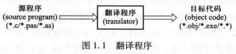
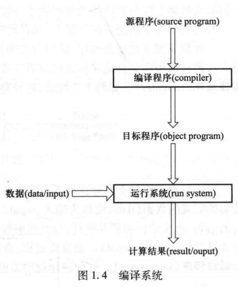
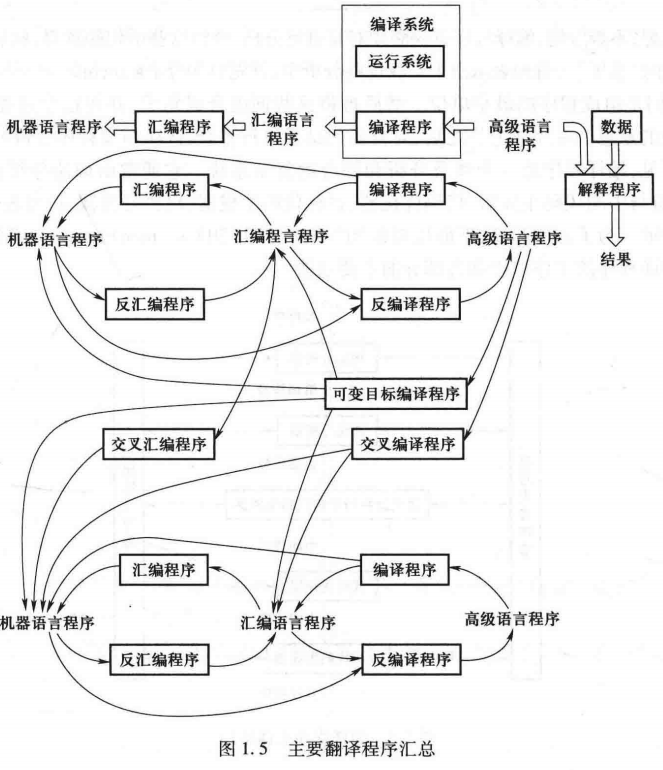
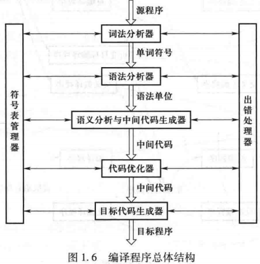
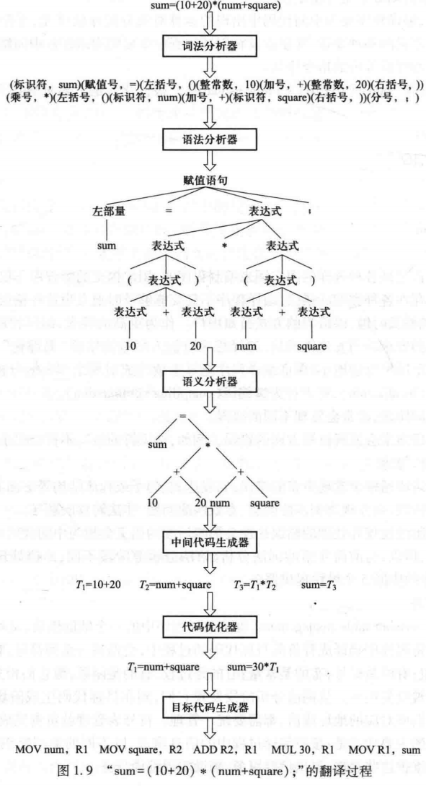

# 编译原理

## 程序设计语言

当用某种语言表示(书写)程序的时候,称用此语言描述(describe)某一个程序,并称该程序是该语言程序。

### 程序设计语言的发展

- 机器语言
- 汇编语言
- 高级语言

### 程序设计语言的分类

- 强制式（命令式）语言
- 申述式语言
- 面向对象语言

## 程序设计语言的翻译

- 翻译程序(translator)：将一种语言描述的程序翻译成等价的用另一种语言描述的程序的程序

- 源语言(source language)：用来描述被翻译程序的语言

- 源程序(source program)：被翻译程序

- 目标语言(object language)：用来描述翻译出来的程序的语言

- 目标程序(object program)或目标代码(object code)：翻译出来的程序

### 编译程序分类

- 编译程序
- 解释程序

### 编译系统

## 编译程序的总体结构

## 编译程序的组织

## 编译程序的生成

