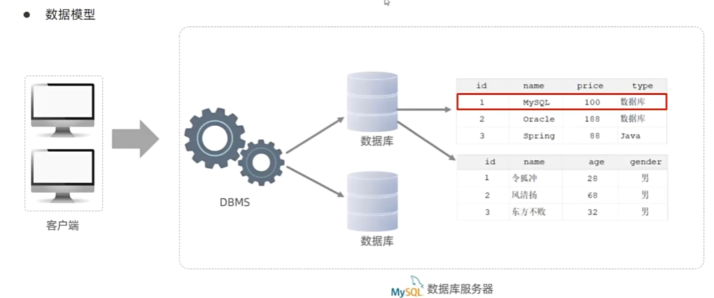
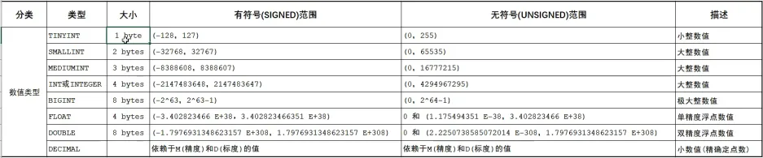
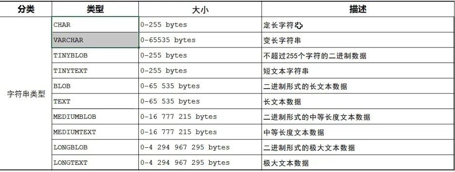
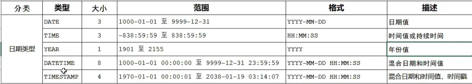
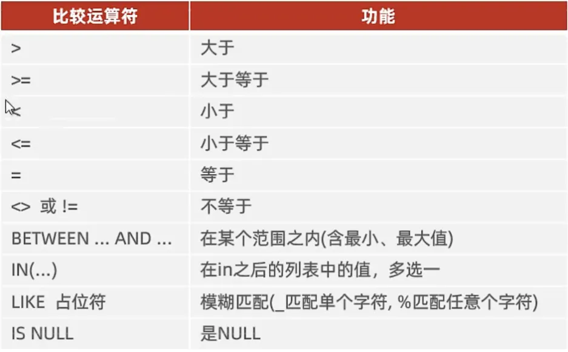

# MySQL

## MySQL简介


- 登录

```shell
mysql -u root -p
```

## MySQL的数据模型



## SQL

### SQL的通用语法

1. SQL语句可以使用单行或者多行书写，以分号结尾
2. SQL语句可以使用空格、缩进来增强语句的可读性
3. MySQL数据库的SQL语句不区分大小写，关键字建议使用大写
4. 注释：
	a. 单行注释： --注释内容 或者 # 注释内容（MySQL特有）
	b. 多行注释：/* 注释内容 */

### SQL的分类

DDL   Data Definition Language    数据定义语言，用来定义数据库对象（数据库，表，字段）

DML  Data Manipulation Language  数据操作语言，用来对数据库表中的数据进行增改查

DQL  Data Query Language  数据查询语言，用力啊查询数据库中表的记录

DCL  Data Control Language  数据控制语言，用来创建数据库用户，控制数据库的访问权限

| 分类 | 中文         | 说明                               |
| ---- | ------------ | ---------------------------------- |
| DDL  | 数据定义语言 | 定义数据库对象                     |
| DML  | 数据操作语言 | 对表中的数据进行增删改             |
| DQL  | 操作查询语言 | 查询数据库中表的记录               |
| DCL  | 操作控制语言 | 创建数据库用户、控制数据库访问权限 |

### DDL

#### 数据库操作

- 查询

查询所有数据库

```mysql
SHOW DATABASES;
```

```mysql
SELECT DATABSE();
```

- 创建数据库

```mysql
CREATE DATABASE [IF NOT EXISTS] 数据库名 [DEFAULT CHARSET 字符集] [COLLATE 排序规则];
```

- 删除数据库

```mysql
DROP DATABASE [IF EXISTS] 数据库名;
```

- 使用数据库

```mysql
USE 数据库名;
```

#### 表操作

- 查询表

```mysql
SHOW TABLES;
```

- 查询表结构

```mysql
DESC 表名;
```

- 查询建表语句

```mysql
SHOW CREATE TABLE 表名;
```

- 创建表

```mysql
CREATE TABLE 表名(
	字段1 字段1类型 [COMMENT 字段1注释],
  	字段2 字段2类型 [COMMENT 字段2注释],
  	字段3 字段3类型 [COMMENT 字段3注释],
  	......
  	字段n 字段n类型 [COMMENT 字段n注释]
)[COMMENT 表注释];
```

- 修改表-添加字段

```mysql
ALTER TABLE 表名 ADD 字段名 类型(长度) [COMMENT 注释] [约束];
```

- 修改表-修改数据类型

```mysql
ALTER TABLE 表名 MODIFY 字段名 新数据类型(长度);
```

- 修改表-修改字段名和字段类型

```mysql
ALTER TABLE 表名 CHANGE 旧字段名 旧字段 新字段 类型(长度) [comment 注释][约束];
```

- 修改表-删除字段

```mysql
ALTER TABLE 表名 DROP 字段名;
```

- 修改表-修改表名

```mysql
ALTER TABLE 表名 RENAME TO 新表名;
```

#### 数据类型

- 数值类型



- 字符串类型



- 日期时间类型



### 案例

```mysql


```

### DML

#### 添加数据

- 给指定字段添加数据

```mysql
INSERT INTO 表名 (字段名1，字段名2，.....) VALUES (值1，值2，.....);
```

- 给全部字段添加数据

```mysql
INSERT INTO 表名 VALUES (值1, 值2,......);
```

- 批量添加数据

```mysql
INSERT INTO 表名 (字段名1，字段名2，....) VALUES (值1，值2，..),(值1，值2，...),(值1，值2,...);

INSERT INTO 表名 values (值1，值2，..),(值1，值2，...),(值1，值2,...);
```

**注意：**

1. 插入数据时，指定的字段顺序需要与值的顺序是一一对应的。

2. 字符串和日期类型数据应该包含在引号中，单引号双引号都可以。

3. 插入的数据大小，应该在字段的规定范围内。

#### 修改数据

```mysql
UPDATE 表名 SET 字段名1=值1, 字段名2=值2, 字段名3=值3,....[WHERE 条件];
```

**注意：**

1. 没有where则作用于整张表。

#### 删除数据

```mysql
DELETE FROM 表名 [WHERE 条件];
```

**注意：**

1. delete语句不能删除某一个字段的值（可以使用update为null）。

### 案例

```mysql


```

### DQL

**关键字：SELECT**

#### 语法

```mysql
SELECT
	字段列表
FROM
	表名列表
WHERE
	条件查询
GROUP BY
	分组字段列表
HAVING
	分组后条件列表
ORDER BY
	排序字段列表
LIMIT
	分页参数
```

#### 基本查询

- 查询多个字段

```mysql
SELECT 字段1, 字段2, 字段3,.... FROM 表名;
SELECT * FROM 表名;
```

- 设置别名

```mysql
SELECT 字段1 [AS 别名1], 字段2 [AS 别名2],.... FROM 表名;#AS可以省略
```

- 去除重复记录

```mysql
SELECT DISTINCT 字段列表 FROM 表名;
```

#### 条件查询

```mysql
SELECT 字段列表 FROM 表名 WHERE 条件列表;
```




#### 聚合查询

```mysql
SELECT func(字段) FROM 表名 WHERE 条件列表;
```

将一列数据作为一个整体，进行纵向计算。

**常见聚合函数**

count：统计数量

max：最大值

min：最小值

avg：平均值

sum：求和

**注意：**null值不参与所有聚合函数运算。

#### 分组查询

```mysql
SELECT 字段列表 FROM 表名 [WHERE 条件] GROUP BY 分组字段名 HAVING [分组后过滤条件];
```

#### 排序查询

```mysql
SELECT 字段列表 FROM 表名 ORDER BY 字段1 排序方式1, 字段2 排序方式2;
```

**排序方式**

- **ASC** ：升序（默认值）
- **DESC**：降序

**注意：**如果是多字段排序，当第一个字段值相同时，才会根据第二个字段进行排序。

#### 分页查询

```mysql
SELECT 字段列表 FROM 表名 LIMIT 起始索引,查询记录数;
```

**注意：**

- 起始索引从0开始，起始索引 =（查询页码 - 1）* 每页显示记录数
- 分页查询是数据库的方言，不同的数据库有不同的实现，MySQL中是limit
- 如果查询的是第一页数据，起始索引可以省略，直接简写为limit10

### 案例

```mysql


```

### DCL

#### 创建用户

```mysql
CREATE USER '用户名'@'主机' IDENTIFIED BY '密码';# 可用%表示任意主机
```

#### 修改密码

```mysql
ALTER USER '用户名'@'主机' IDENTIFIED WITH mysql_native_password BY '新密码';
```

#### 删除用户

```mysql
DROP USER '用户名'@'主机';
```

#### 查询权限

```mysql
SHOW GRANTS FOR '用户名'@'主机名';
```

#### 授予权限

```mysql
GRANT 权限列表 ON 数据库名.表名 TO '用户名'@'主机名';
```


#### 撤销权限

```mysql
REVOKE 权限列表 ON 数据库名.表名 FROM '用户名'@'主机名';
```

## 函数

## 约束

### 基础约束

概念：约束是作用于表中字段上的规则，用于限制存储在表中的数据。

目的：保证数据库中数据的正确、有效性和完整性。

分类：

| **约束** | **描述**                                                 | **关键字**  |
| -------- | -------------------------------------------------------- | ----------- |
| 非空约束 | 限制该字段的数据不能为null                               | NOT NULL    |
| 唯一约束 | 保证该字段的所有数据都是唯一、不重复的                   | UNIQUE      |
| 主键约束 | 主键是一行数据的唯一标识，要求非空且唯一                 | PRIMARY KEY |
| 默认约束 | 保存数据时，如果未指定该字段的值，则采用默认值           | DEFAULT     |
| 检查约束 | 保证字段值满足某一个条件                                 | CHECK       |
| 外键约束 | 用来让两张图的数据之间建立连接，保证数据的一致性和完整性 | FOREIGN KEY |

注意：约束是作用于表中字段上的，可以在创建表和修改表的时候添加约束。

字段AUTO-INCREMENT：自动增长

### 外键约束

让两张表的数据之间建立连接，保证数据的一致性和完整性。

#### 添加外键

```mysql
CREATE TABLE 表名(
	字段名 数据类型,
    ...
    [CONSTRAINT] [外键名称] FOREIGN KEY (外键字段名) REFERENCES 主表 (主表列名)
);
```

```mysql
ALTER TABLE 表名 ADD CONSTRAINT 外键名称 FOREIGN KEY (外键字段名) REFERENCES 主表(主表列名);
```

#### 删除外键

```mysql
ALTER TABLE 表名 DROP FOREIGN KEY 外键名称;
```

#### 删除/更新行为

| **行为**        | **说明**                                                     |
| --------------- | ------------------------------------------------------------ |
| NO ACTION       | 当在父表中删除/更新对应记录时，首先检查该记录是否有对应外键，如果有则不允许删除/更新（与RESTRICT一致） |
| RESTRICT        | 当在父表中删除/更新对应记录时，首先检查该记录是否有对应外键，如果有则不允许删除/更新（与NO ACTION一致） |
| **CASCADE级联** | 当在父表中删除/更新对应记录时，首先检查该记录是否有对应外键，如果有则也删除/更新外键在子表中的记录 |
| SET NULL        | 当在父表中删除/更新对应记录时，首先检查该记录是否有对应外键，如果有则设置子表中该外键值为null（要求该外键允许为null） |
| SET DEFAULT     | 父表有变更时，子表将外键设为一个默认值（Innodb不支持）       |

```mysql
ALTER TABLE 表名 ADD CONSTRAINT 外键名称 FOREIGN KEY (外键字段) REFERENCES 主表名(主表字段名) ON UPDATE 行为 ON DELETE 行为;
```

### 案例

```mysql


```

## 多表查询

### 分类

- 连接查询

  - 内连接：查询A，B交集部分数据。
  - 外连接
    - 左外连接：查询**左表**所有数据，和两表交集部分数据。
    - 右外连接：查询**右表**所有数据，和两表交集部分数据。
  - 自连接：当前表与自身的连接查询，自连接必须使用表别名。
- 子连接

### 连接查询

#### 内连接

- 隐式内连接

```mysql
SELECT 字段列表 FROM 表1，表2 WHERE 条件...;
```

- 显示内连接

```mysql
SELECT 字段列表 FROM 表1 [INNER] JOIN 表2 ON 连接条件...;
```

#### 外连接

- 左外连接

```mysql
SELECT 字段列表 FROM 表1 LEFT [OUTER] JOIN 表2 ON 条件...;
```

- 右外连接

```mysql
SELECT 字段列表 FROM 表1 RIGHT [OUTER] JOIN 表2 ON 条件...;
```

#### 自连接

```mysql
SELECT 字段列表 FROM 表A 别名A JOIN 表A 别名B ON 条件...;
```

#### 联合查询

把多次查询的结合合并起来，形成一个新的查询结果集。

```mysql
SELECT 字段列表 FROM 表A ...
UNION [ALL]
SELECT 字段列表 FROM 表B ...;
```

多张表的列数必须保持一致，字段类型也要保持一致。

`union all`会将全部的数据直接合并到一起，`union`会对合并后的数据去重。

### 案例

```mysql


```

### 子查询

```mysql
SELECT * FROM t1 WHERE column1 = (SELECT column1 FROM t2);
```

子查询的外部语句可以是`INSERT` / `UPDATE` / `DELETE` / `SELECT`的任何一个。

- 根据子查询结果不同，分为：
  - 标量子查询（子查询结果为单个值）
    - 常用操作符：=，<>，>，>=，<，<=
  - 列子查询（结果为一列）
    - 常用操作符：IN，NOT IN，ANY，SOME，ALL
  - 行子查询（结果为一行）
    - 常用操作符：=，<>，IN，NOT IN
  - 查子查询（结果为多列多行）
    - 常用操作符：IN

### 案例

```mysql


```


## 事务


## SQL优化


