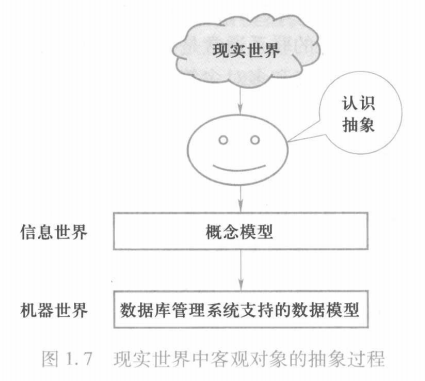
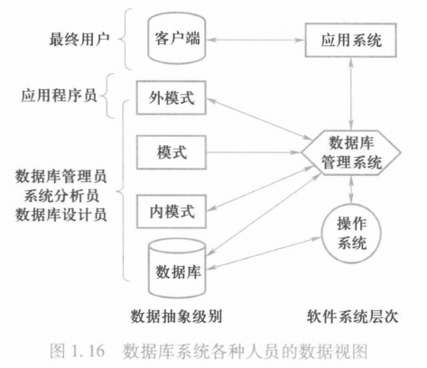
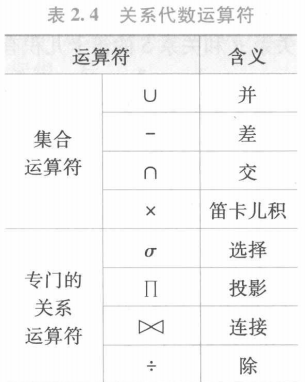
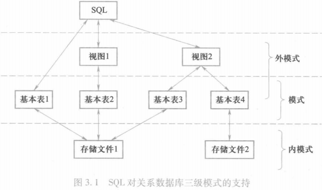

# 数据库基础

## 绪论

### 数据库系统概述

#### 数据库的基本概念

1. 数据Data：描述事物的符号记录。数据的含义称为数据的语义，数据与其语义是不可分的。数据库中存储的基本对象。
2. 数据库Database：**长期存储**在计算机内**有组织的**、**可共享**的**大量数据**的**集合**。
3. 数据库管理系统DBMS：位于用户与操作系统之间的数据管理软件。提供DDL，数据组织、存储和管理功能，提供DML，事务管理和运行管理，建立和维护。
4. 数据库系统DBS：由数据库、数据库管理系统、应用程序和数据库管理员（DBA）组成。

#### 数据库系统的特点

1. 数据**结构化**。

2. 数据的**共享性高**，**冗余度低**，**容易扩充**。

3. 数据独立性高：

   **物理独立性**（应用程序与物理存储相互独立，数据的物理存储改变，应用程序不改变）

   **逻辑独立性**（应用程序与逻辑结构相互独立，数据的逻辑结构改变，应用程序不改变）。

4. 数据由数据库管理系统统一管理和控制。

### 数据模型

#### 数据模型

把现实世界中的具体事物抽象、组织为某一数据库管理系系统支持的数据模型,这个过程称
为数据建模。

数据模型包括概念模型（信息模型）和逻辑模型/物理模型。

- 概念模型按用户的观点建模，用于数据库设计，表示方法有E-R模型。
- 逻辑模型按计算机的观点建模，用于DBMS实现，包括网状模型、层次模型、关系模型。
- 物理模型是对数据最底层的抽象。



#### 概念模型

概念模型用于信息世界的建模

基本概念：

- 实体：客观存在并可互相区别的事物成为实体。
- 属性：实物所具有的某一特性称为属性。
- 码：唯一标识实体的属性集称为码。
- 实体性：用实体名及其属性名集合来抽象和刻画同类实体，称为实体型。
- 实体集：同一类型实体的集合被称为实体集。
- 联系：不同实体集之间的联系。

表示方法：

实体-联系方法（E-R模型）

#### 逻辑模型

- 层次模型
- 网状模型
- 关系模型
- 面向对象数据模型
- 对象关系数据模型
- 半结构化数据模型

#### 数据模型的三要素

1. 数据结构：数据结构描述数据库的组成对象以及对象之间的联系。

2. 数据操纵：数据操纵是指对数据库中各种对象(型)的实例(值)允许执行的操作的集合,包括操作及有关的操作规则。

3. 完整性约束：完整性约束是一组完整性规则。完整性规则是给定的数据模型中的数据及其联系所具有的制约和依存规则,用以限定符合数据模型的数据库状态以及状态的变化,以保证数据的正确、有效和相容。

### 数据库系统的三级模式结构

数据库系统的内部的体系结构

#### 数据库系统模式的概念

- 型：对某一类数据的结构和属性的说明。
- 值：型的一个具体赋值。
- 模式(schema)：数据库中全体数据的逻辑结构和特征的描述。模式的一个具体的值称为模式的一个实例。

#### 数据库系统的三级模式结构

1. 外模式（子模式/用户模式）：**数据库用户**能够看见和使用的局部数据的逻辑结构和特征的描述，数据库用户的数据视图，是与某应用有关的数据的逻辑表示。

2. 模式（逻辑模式）：所有用户的公共数据视图。

3. 内模式（存储模式）：数据物理结构和存储方法的描述，是数据在数据库内部的组织方式。

#### 数据库的二级映像功能与数据独立性

1. 外模式/模式映像：保证了数据的逻辑独立性

当模式改变时，对外模式/模式的映像做出改变，保证外模式不变，应用程序由外模式编写，从而应用程序不变。

2. 模式/内模式映像：保证了数据的物理独立性

当数据库的存储结构改变时，对模式/内模式映像做出改变，使模式不变，进而应用程序不变。

### 数据库系统的组成



## 关系数据库

### 关系模型的数据结构及形式化定义

1. 域
2. 笛卡尔积，元组，分量，基数
3. 关系，目（度）
4. 关系模式，候选码，全码，主属性，非主属性

### 关系操作

#### 查询

**选择**，**投影**，连接，除，**并**，**差**，交，**笛卡尔积**。

#### 更新

### 关系完整性

实体完整性，参照完整性，用户定义完整性

#### 实体完整性

若属性（指一个或一组属性）A 是基本关系 R 的主属性，则 A不能取空值(null value)。

#### 参照完整性

#### 用户定义完整性

### 关系代数



## 关系型数据库标准语言SQL

### SQL概述

​	结构化查询语言(SQL)是关系数据库的标准语言，也是一个通用的、功能极强的关系数据库语言。功能包括查询，数据库创建，插入，修改，安全性完整性定义和控制。

#### SQL的特点

SQL集数据查询，数据操纵，数据定义，数据控制功能于一体，主要特点包括一下部分：

1. 功能综合，风格统一。
2. 高度非过程化。
3. 面向集合的操作方式。
4. 以一种语法结构提供多种使用方式。
5. 语言简洁，易用易学。

#### SQL的基本概念



### 数据定义

```sql
CREATE SCHEMA "schemaName" AUTHORIZATION "userName";
DROP SCHEMA "schemaName" CASCADE;

CREATE TABLE "tableName"(
	"Sno" CHAR(8) PRIMARY KEY,
    "Sname" CHAR(20) UNIQUE,
    "Spno" CHAR(5),
    FOREIGN KEY(Spno) REFERENCES "tableName2"(Sno)
);
ALTER TABLE "tableName" ADD "Sno" VARCHAR(30);
						ALTER COLUMN "Sno" TYPE VARCHAR(30);
						ADD UNIQUE(Sname);

CREATE [UNIQUE] [CLUSTER] INDEX Idx_StuSname On Student(Sname);
ALTER INDEX Idx_StuSname RENAME TO Idx_SSname;
```

### 数据查询

```sql
SELECT [ALL|DISTINCT]<目标列表达式>[别名][，<目标列表达式>[别名]]··· 
FROM <表名或视图名>[别名][，<表名或视图名>[别名]]…1(<SELECT语句>)[AS]<别名>
[WHERE <条件表达式>]
[GROUP BY <列名1> HAVING <条件表达式>]]
[ORDER BY <列名2>[ASCIDESC]]
[LIMIT <行数 1>[ OFFSET <行数2>]];
```

### 数据更新

```sql
INSERT INTO tableName (Sno,Sname) VALUES ('202211','shirokm') SELECT;
UPDATE tableName SET Sno='202212' WHERE Sname='a' IN(SELECT);
DELETE FROM tableName WHERE Sname='a' IN(SELECT);
```

### 空值的处理

### 视图

```sql
CREATE VIEW viewName AS select
DROP VIEW viewName CASCADE;
```

## 数据库安全

### 安全性概述

数据库的安全性是指保护数据库，以防不合法使用所造成的数据泄露、篡改或破坏。

#### 不安全因素

非授权用户对数据库的恶意存取和破坏，数据库中重要或敏感的数据被泄露，安全环境的脆弱性

#### 安全标准简介

TCSEC：A1>B3>B2>B1>C2>C1>D

CC

### 安全性控制

#### 常用方法

用户身份鉴别：静态口令，动态口令，生物特征，智能卡，入侵检测

存取控制：自主存取控制C2，强制存取控制B1

审计

视图

数据加密

#### 自主存取控制

TODO

#### 授权

```sql
GRANT <权限> ON <表名> TO <用户> [WITH GRANT OPTION];
```

```sql
REVOKE <权限> ON <表名> FROM <用户> [CASCADE];
```

#### 强制存取控制


### 数据加密

### 其他安全性保护

## 数据库完整性

### 完整性概述

### 参照完整性

### 用户定义的完整性

### 用户定义的完整性

### 完整性约束命名字句

### 触发器

## 关系数据理论

### 关系数据理论概述

### 规范化

### 数据依赖的公理系统

### 保持函数依赖的模式分解

## 数据库设计

### 数据库设计概述

### 需求分析

### 概念结构设计

### 逻辑结构设计

### 物理结构设计

### 数据库的实施和维护

## 关系数据库存储管理

### 数据组织

### 索引结构

## 关系查询处理和查询优化

### 查询处理

### 查询优化

### 代数优化

### 物理优化

## 数据库恢复技术

### 事务的基本概念

### 数据库恢复概述

### 故障的种类

### 恢复的实现技术

### 恢复策略

### 具有检查点的恢复技术

### 数据库镜像

## 并发控制

### 并发控制概论

### 事务的隔离级别

### 封锁

### 封锁协议

### 活锁和死锁

### 并发调度的可串行性

### 两段锁协议

### 封锁的粒度
